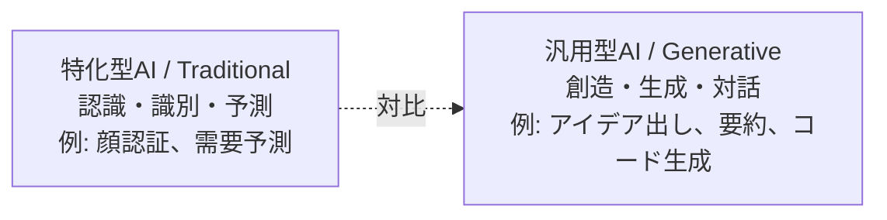
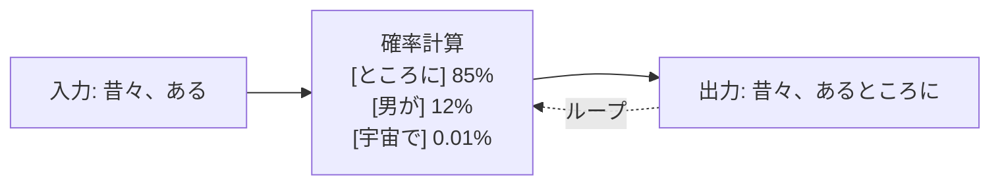
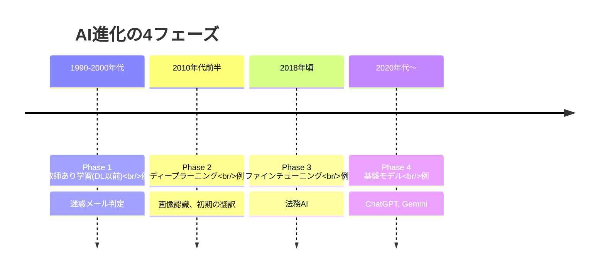
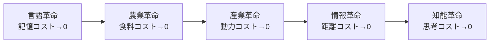
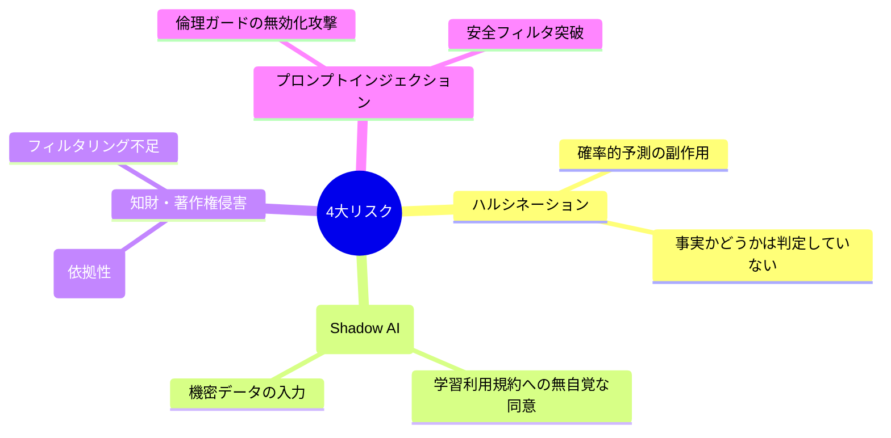
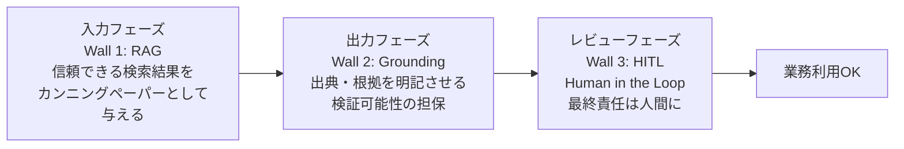

# 第1回 生成AIの全体像 — パラダイムシフトと4大リスク

> 出典: 野口侑渡氏（大手IT企業 生成AI推進担当 / Fluxia代表）「生成AI完全ガイド 第1回: 生成AIの全体像」オフラインセッション資料（2025-11-26）より要点整理。

## このセッションのキーメッセージ

> **「作る（実行）」コストが消え、「決める（意思）」の価値が最大化する時代へ。**

知能が「高価で希少な資源」から「電気のように安価で無限なインフラ」へ転換した。実行力（Do）の価値は暴落し、意思決定（Will）の価値が極大化する。

## 1. パラダイムシフトの全体像

第1回の出発点となる対比表。**Before / After の構造を一枚で示す** ことで、生成AIが「便利ツール」ではなく「経済構造の転換」であることを印象付ける。

| 観点 | Before（これまで） | After（これから） |
|---|---|---|
| 知能の位置づけ | 高価で希少な資源 | 安価で無限なインフラ |
| 獲得コスト | 採用・育成に莫大な費用と時間 | API経由で即時利用・極小コスト |
| 拡張性 | 限界あり（人月に依存） | ∞無限（需要に応じ即時スケール） |
| 価値の源泉 | 実行力（Do） | 意思決定（Will） |

## 2. 講座を貫く3スタンス

野口氏は「ツールとしての生成AI」ではなく「戦略的武器としての生成AI」を強調する。

1. **脱・チャットツール** — 質問→回答の関係から脱却し、業務プロセスと意思決定フローに組み込む
2. **徹底的なROI志向** — 「なんとなく凄い」ではなく、コスト削減・品質向上・スピードUPを数値で語る
3. **攻めと守りの両立** — リスクを正しく管理した上で、萎縮せずに活用する

ガバナンス文脈で重要なのは **3つ目** だ。「危険だから禁止」と「怖くないから無管理」のどちらでもなく、リスクを **構造的に理解した上でアクセルを踏む** 設計が後の第2回につながる。

## 3. 生成AIとは何か — 従来型AIとの違い

メタファ: **特化型AI=ハサミ（切れるが叩けない）**、**生成AI=スイスアーミーナイフ（言語理解という柄に多機能が接続）**。

## 4. 4つの用途と代表ツール

| 用途 | 代表ツール | ビジネス活用 |
|---|---|---|
| テキスト生成 | ChatGPT, Gemini, Claude | 議事録要約、メール作成、コード記述、ブレスト |
| 画像生成 | Midjourney, Stable Diffusion | 広告クリエイティブ、プレゼン素材、ロゴ |
| 音声生成 | ElevenLabs, Suno AI | ナレーション、多言語吹き替え、BGM |
| 動画生成 | Runway Gen-3, Sora, Veo | プロモ動画、研修動画、SNSショート |

## 5. メカニズム — なぜ「もっともらしい嘘」をつくのか

### テキスト生成 = 確率的予測

LLMは辞書を引いているのではない。**文脈から「次に来る確率が最も高い単語」を計算し続ける予測マシン** である。

直感的イメージは「**世界中のインターネットと書籍を読んだ、超高性能なスマホの予測変換**」。

これが後述の **ハルシネーション（幻覚）** が「バグ」ではなく「仕様」である理由になる。

### 画像生成の2方式

- **拡散モデル（Diffusion）**: ノイズを段階的に除去して像を彫刻する。「曇りガラスを拭いて景色を出す」イメージ。Midjourney, Stable Diffusion。
- **ハイブリッド型（Transformer-based）**: 文脈理解＋高速描画。「熟練の画家による迷いのない一筆書き」。4o-image, Nano Banana など。

## 6. AI進化の4フェーズ

複雑性も拡大していくが、同時に **必要なカスタマイズデータ量は減少** していく。少しの指示で多様なタスクに対応する基盤モデル時代へ。

## 7. グローバルAI規制の3極比較

ガバナンス論の前提として **国ごとに法的スタンスが分断している** ことを押さえる。

| 観点 | 🇯🇵 日本 | 🇺🇸 米国 | 🇪🇺 欧州 |
|---|---|---|---|
| 基本姿勢 | AI開発者重視 | 判例法による対応 | 権利者保護重視 |
| 法的根拠 | 著作権法 第30条の4 | フェアユース（判例） | DSM著作権指令 / EU AI法 |
| 学習許可 | 原則許可（明文化） | 裁判所判断次第 | オプトアウト方式 |
| リスクレベル | 低 | 高（訴訟リスク） | 中（規制大） |
| 透明性要件 | 低 | 中 | 高（学習データ開示義務） |

**日本は世界有数の「AI学習パラダイス」**。ただし「学習段階」と「生成・利用段階」は別問題で、後者は依然リスクが残る（第2回で詳述）。

## 8. 知能の限界費用ゼロ — 人類史的な位置づけ

人類は技術によって物理的制約（記憶・食料・動力・距離）を順に克服してきた。**最後に残された聖域が「知能（思考）」**。これを生成AI・LLMが今、置き換えつつある。

## 9. 導入で狙う4領域（4 Levers）

「知能コストゼロ」を ROI に変換する4類型。

| Lever | 名称 | 概要 | KPI例 |
|---|---|---|---|
| 1 | コスト削減 (Substitution) | 人の作業をAIが代替 | 工数削減率、人件費 |
| 2 | 品質向上 (Augmentation) | 人の能力をAIが増強 | 品質偏差、CS |
| 3 | スケーラブル化 (Expansion) | 労働集約モデルから脱却 | 処理件数、リードタイム |
| 4 | ビジネス転換 (Redefinition) | コストセンター→収益源 | 新規売上比率、LTV |

> 多くの企業は①コスト削減で止まるが、本質的な競争優位は③スケーラブル化と④ビジネス転換にある。

## 10. 4大リスクと3つの防壁 ★ガバナンスの起点

ここからが **第2回ガバナンスへの橋渡し** になる中核パート。

### 4大リスク

### 最大リスク「ハルシネーション」を防ぐ3つの防壁

これは第2回の Human-in-the-Loop 議論の原型でもある。

**運用方針**: 「AIに知識を問うな。処理をさせろ」「AIの回答は下書きとみなす」。

### 法的・セキュリティ対策

- **情報漏洩対策**: 法人版（Enterprise）で学習オプトアウト設定 + DLP（データ損失防止）+ 社内専用環境
- **権利侵害対策**: クリーンモデル選定（Adobe Firefly等）+ リリース前の類似性チェック（逆画像検索）

## 11. ケーススタディ — 成功と失敗の分岐点

### 成功事例

| 企業 | 施策 | Lever |
|---|---|---|
| リクルート | 職務経歴書自動作成（5分に短縮） | L1 + L2 |
| コカ・コーラ | Create Real Magic（ブランド共創） | L4 |
| 第一興商（DAM） | 表記揺れ自動補正で5人日削減 | L1 + L2 |
| ベネッセ | 「答えないAI」自由研究おたすけ | L4 |

### 失敗事例

| 企業 | 事故 | 教訓 |
|---|---|---|
| マクドナルド日本 | 指6本のAI動画でSNS炎上 | 速さのKPIが信頼のKPIを上回ってはいけない |
| JAL Luxury Card | 高級商材にチープなAI画像 | TPOをわきまえろ。本物感が必要な領域はプロを使え |
| デロイト豪 | 政府報告書に架空の論文を捏造 | 引用・出典はAIに任せるな。Fact Checkを義務化 |

**失敗の共通パターン**: ① 品質ゲート（Human Review）の欠如、② 適用領域（Domain）の選定ミス、③ ナレッジ業務への丸投げ。これらは第2回で扱う **「チェックしないこと」が法的責任になる** という議論につながる。

## 12. まとめ — 「優秀だが未熟な部下」をマネジメントせよ

| 誤解 | 正解 | アクション |
|---|---|---|
| AIにお願いすれば完璧な答えが返る | AIは指示待ちの新人エリート | 丸投げ禁止。詳細指示＋検品 |
| AIより早く綺麗に資料を作れるようになろう | 作る作業はAIに譲り、何を作るかを極めよ | 浮いた時間で審美眼と課題設定力を磨け |
| AIは危険だから禁止 / 怖いから使わない | リスクは構造的欠陥ではなく運用ミス | 適切なフロー構築で9割の事故は防げる |

最後の点が **第2回ガバナンス** に直結する。「禁止」でも「無管理」でもなく、**運用設計でリスクを管理可能にする** のが企業に求められる仕事だ。

## ガバナンス文脈での示唆

第1回は「生成AIとは何か」の前提知識編だが、ガバナンス文脈で押さえるべきは次の3点：

1. **ハルシネーションは仕様** — 確率的言語モデルである以上、事実検証は構造的に保証されない。よって運用側で **必ずチェックフローを挟む** 設計が必須。
2. **日本は学習規制が緩いが、生成・利用段階は別** — 30条の4は学習を守るだけ。出力の類似性・依拠性は依然リスク。
3. **失敗事例は技術ではなく運用の失敗** — 品質ゲート欠如・領域選定ミスはどちらもガバナンス設計でカバーできる。

→ 次: [第2回 生成AIの統制（ガバナンス）](./02-governance.md)
