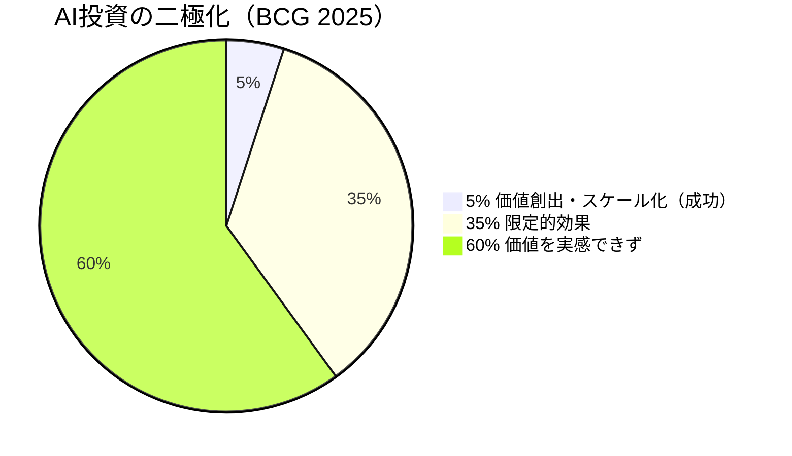
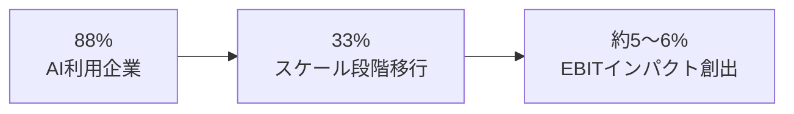
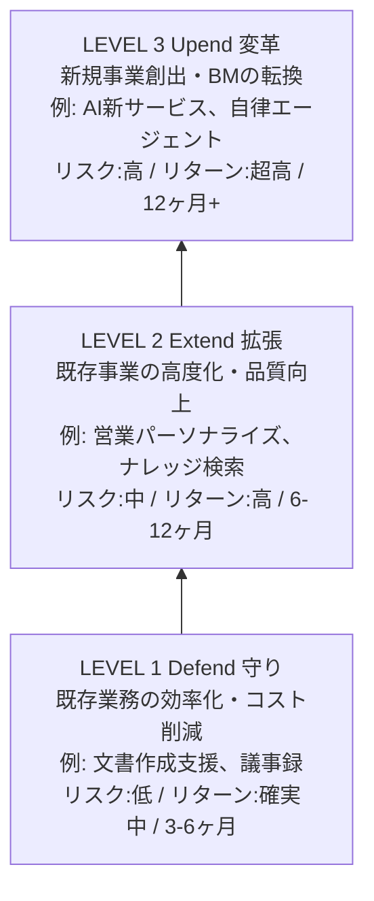
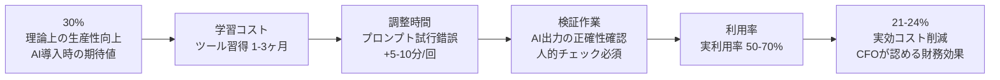
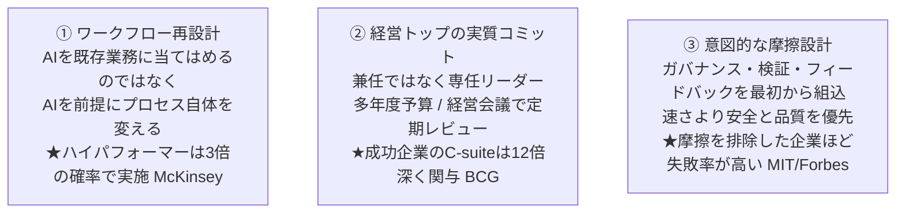

# 第3回 生成AIの導入戦略 — 95%失敗の罠と5%成功企業の行動原則

> 出典: 野口侑渡氏（大手IT企業 生成AI推進担当 / Fluxia代表）「生成AI完全ガイド 第3回: 生成AIの導入戦略」オフラインセッション資料より要点整理。

## このセッションのキーメッセージ

> **失敗は技術力ではなく意思決定のミスに起因する。**
> AI投資で「5%」の成功企業に入るための導入戦略を学ぶ。

導入論は **「どこに・なぜ・どう進めるか」** の意思決定設計。技術力の問題ではない。

## AI投資の現実 — 95%は「導入」で止まっている

3つの主要レポートが同じ結論を出している。

| 出典 | 数字 | 意味 |
|---|---|---|
| McKinsey 2025 *State of AI Global Survey* | **88%** がAI利用、**EBITインパクト約6%のみ** | 利用と価値創出のギャップ |
| BCG 2025 *The Widening AI Value Gap* | 価値スケール化できたのは **5%** のみ。残り60%は価値を実感できず | 二極化が進行 |
| MIT 2025 *The GenAI Divide* | GenAIパイロットの **95%が失敗** | 明確な収益インパクトを生めず終了 |



## 3つの罠 — なぜ95%は価値を生めないのか

```mermaid
graph TB
  subgraph 構造的・意思決定の3つの失敗パターン
    T1[① 実験の罠<br/>Experimentation Trap<br/>使っている ≠ 価値を生んでいる<br/>PoC止まりで業務変更に接続されない]
    T2[② 配置の罠<br/>Misallocation Trap<br/>投資先と最大ROIの場所がズレている<br/>マーケに集中、バックオフィスが軽視]
    T3[③ 混同の罠<br/>Confusion Trap<br/>汎用ツールと特化型AIの混同<br/>ChatGPT導入だけで満足]
  end
```

### ① 実験の罠 — 88% → 6%への漏斗



PoC は「やった感」を出しやすいが、**業務プロセスを変更しない限りスケールしない**。

### ② 配置の罠 — マーケばかりに金が行く

MIT調査: AI予算の **50〜70%がセールス・マーケティング** に集中。一方で最大ROIの実績エリアは **バックオフィス自動化**。

| 事例 | 削減効果 |
|---|---|
| パナソニック コネクト ConnectAI | 2024年 18.6万時間/年 → 2025年 44.8万時間/年（**前年比2.4倍**） |
| ベルシステム24 AIロープレ研修 | 管理工数 132h → 9h（**90%以上削減**） |

派手さはないが、地味な業務の自動化が最強のROIを叩き出す。

### ③ 混同の罠 — 汎用ツール vs 特化型AI

| 観点 | 汎用AIツール（例: ChatGPT Enterprise） | 特化型AIツール（例: RAG、異常検知AI） |
|---|---|---|
| 導入目的 | 全社リテラシー向上、日常業務効率化 | 特定業務の変革、完全自動化 |
| ROI特性 | 広く薄い（1人少額×全社員） | 狭く深い |
| リスク | 低（既製品） | 中〜高（カスタム開発、データ整備） |
| 判断基準 | 利用率（MAU/DAU） | 業務インパクト（EBIT）、データ準備度 |

**汎用ツール導入だけで「AI活用している」と認識する企業は5%に入れない。**

## ROI設計 — Defend / Extend / Upend

何を狙うかでROI設計が変わる。Gartnerの3カテゴリー分類を使う。




### 投資規模とリターンの目安（Gartner 推計値）

| レイヤー | 初期投資 | ユーザー年間コスト | ユーザー年間価値 | ROI実現時期 | 主な測定指標 |
|---|---|---|---|---|---|
| Defend | $100K – $200K | $280 – $550/人 | $1,600 – $6,000/人 | 3 – 6ヶ月 | 工数削減、コスト削減額 |
| Extend | $400K – $500K | $1,000 – $2,100/人 | $7,000 – $16,000/人 | 6 – 12ヶ月 | 売上向上、CS |
| Upend | $500K+ | 変動要素大 | 事業KPIベース | 12ヶ月+ | 新事業売上、市場シェア |

**重要**: Defendは「コスト削減」で短期回収、Extend/Upendは「トップライン成長」を狙う。**評価軸をCFOと事前に握っておく** こと。

## Productivity Leak — 30%向上 ≠ 30%削減

導入提案で最も外しやすいポイント。



> **PROPOSAL TIP**: ROI計算には30%ではなく **実効値（70〜80%掛け = 21-24%）** を使う。これを事前に提示できるかがCFOからの信頼性を決める鍵。

## ハードROI vs ソフトROI — 聞き手で語り方を変える

| | ハードROI | ソフトROI |
|---|---|---|
| 領域 | Defend（守り）中心 | Extend / Upend（攻め）中心 |
| 内容 | 工数削減×単価＝金額、外注費削減 | 意思決定速度、CX/EX改善、リスク回避 |
| 有効な聞き手 | CFO、経営会議 | CDO、事業部長、取締役会 |
| 測定方法 | 財務データ直接比較（PLインパクト） | サーベイ、NPS、プロセスKPI |
| McKinseyデータ | EBIT直接貢献 39% | イノベーション改善報告 64% |

## 5%企業の達成事項 — BCG 2025

「5%」に入ることは単なる効率化ではなく **企業の生存競争における勝利** を意味する。

| 指標 | 5% Future-built企業 vs 95% |
|---|---|
| 売上成長 | **1.7倍** |
| EBITマージン | **1.6倍** |
| 株主総利回り (TSR) | **3.6倍** |

## 5%企業に共通する3つの行動原則

技術以外の意思決定。



3つ目が **第2回ガバナンス** に直結する。**「速さ」最優先で摩擦を排除した企業ほど失敗率が高い** という MIT/Forbes の発見は強烈。ガバナンス＝速度のブレーキではなく、スケール化の前提条件だ。

## 練習用ケース: 株式会社ノースフィールド

第3回はワークショップ形式。架空の食品メーカー（売上800億、2,500名、営業利益率4.5%↓）が題材。

- 既導入: ChatGPT Enterprise 全社導入（年1,500万円）
- 残予算 1,500万円・6ヶ月期限
- 競合A社が「商品開発期間半減」とプレスリリース

検討中の4案：

| 案 | 部門 | 初期 | 年運用 | 期待効果 |
|---|---|---|---|---|
| A 営業RAG | 営業120名 | 800万 | 360万 | 提案書3h→1h（年8,000件） |
| B マーケコンテンツ自動生成 | マーケ15名 | 200万 | 600万 | エージェンシー費30%削減 |
| C 品質管理AI | 品管40名 | 1,200万 | 480万 | リコールリスク低減（実績2億） |
| D 新商品企画AI | 開発60名 | 1,500万 | 720万 | 企画リードタイム2週→1週 |

予算1,500万円では **全案実施不可**。組み合わせと優先順位を意思決定する練習。設問は **罠診断 → Defend/Extend/Upend分類 → 優先順位 → ROI設計（Productivity Leak考慮の実効値含む） → CIO向け3行メモ** という構造。

## まとめ

| 押さえるべき問い | 答え |
|---|---|
| 95%の失敗要因 | 技術力ではなく意思決定のミス。実験・配置・混同の3つの罠 |
| ROI設計の最適化 | Defend / Extend / Upend ごとに期待値・時間軸・評価指標を使い分け |
| 再現可能な成功行動 | ワークフロー再設計 / トップのコミット / 意図的な摩擦設計 |

## ガバナンス文脈での示唆

第3回は「戦略・ROI」の話だが、ガバナンス文脈では次が重要：

1. **意図的な摩擦設計＝ガバナンス** — 「速さ」優先で摩擦を排除する企業ほど失敗率が高い。第2回で設計した HITL・データ分類・契約明示は **失敗率を下げる構造的レバー** だった
2. **配置の罠への警告** — マーケへの予算集中は「派手さ」のバイアス。バックオフィス（議事録・契約レビュー・問合せ対応）はガバナンス管理しやすく、かつ最大ROIエリア
3. **Productivity Leak はガバナンスコストでもある** — 検証作業の20-30%は HITL コスト。これを織り込まないROI試算は CFO に通らない
4. **5%企業のC-suite関与12倍** — ガバナンスはトップが旗を振らないと現場で機能しない

→ 前: [第2回 生成AIの統制（ガバナンス）](./02-governance.md) ｜ 戻る: [シリーズ index](./index.md)

## 参考出典（第3回スライドより）

- McKinsey (2025) *The State of AI Global Survey 2025*
- BCG (2025) *Are You Generating Value from AI? The Widening Gap*
- MIT (2025) *The GenAI Divide: State of AI in Business 2025*
- Gartner (2024) *How to Calculate Business Value and Cost for GenAI Use Cases*
- Deloitte (2026) *The State of AI in the Enterprise 2026*
- Harvard Business Review (Aug 2025) *Beware the AI Experimentation Trap*
- a16z (2025) *How 100 Enterprise CIOs Are Building and Buying Gen AI in 2025*
- Forbes / MIT (Aug 2025) *Why 95% of AI Pilots Fail*
- Panasonic Connect (2024/2025) ConnectAI 生成AI導入実績プレスリリース
- ベルシステム24 AIロープレ導入事例
