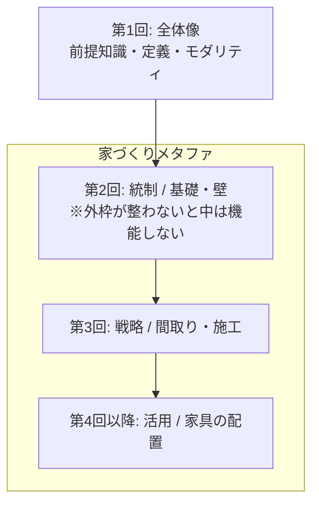

# AI導入ガバナンス解説シリーズ

野口侑渡氏（大手IT企業 生成AI推進担当 / Fluxia代表）による「生成AI完全ガイド」全3回オフラインセッション資料を、**AI導入ガバナンス** の文脈で整理した学習ノート。

> 本記事は学習目的での要点整理・解説であり、原資料そのものの転載ではない。図解は要点を独自に再構成したものを掲載し、必要に応じて画像プレースホルダを残してある。

## なぜ「ガバナンス」なのか — 家づくりメタファ

野口氏は3回のセッションを「家づくり」に例える。**統制（ガバナンス）が外枠（基礎と壁）、戦略が間取り、活用が家具配置** だ。基礎と壁が整わなければ、内側の活動は安全に機能しない。

このシリーズでは **第2回（統制）を中核** に置き、第1回をその前提として、第3回をその応用として読む。

## 各記事

| 回 | タイトル | 中核トピック |
|---|---|---|
| [第1回](./01-overview.md) | 生成AIの全体像 | 知能の限界費用ゼロ化、4大用途、4大リスク、3つの防壁、ケーススタディ7社 |
| [第2回](./02-governance.md) ★中核 | 生成AIの統制（ガバナンス） | 7リスクの地図、法律3論点、Who/What/Where、3社のガバナンス型 |
| [第3回](./03-strategy.md) | 生成AIの導入戦略 | 95%失敗の現実、3つの罠、Defend/Extend/Upend、Productivity Leak |

## ガバナンス解説としての読みどころ

このシリーズが他のAIガバナンス解説と一線を画すのは次の3点：

1. **リスク → 法律 → ガバナンス の三段構成**（第2回）
   「何が起きるか（事例）」→「適法/違法の境界線（法律）」→「自社で誰が・何を・どこまでやるか（ガバナンス）」と階層的に降ろしている。漠然とした不安を **判断基準** に変換し、**実装可能な仕組み** に落とすロジックが明快。

2. **ガバナンスは「禁止」ではなく「条件付き許容の設計図」**
   秘密情報の3層分類、著作権の「学習段階」と「生成・利用段階」の切り分け、ハルシネーション責任は「使ったこと」ではなく「チェックしなかったこと」という整理。**萎縮させずアクセルを踏ませる** ためのガードレール設計。

3. **3社のガバナンス型は「正解」ではなく「適合」で選ぶ**
   パナソニック型（防御基盤先行）/ ソフトバンク型（高速展開）/ ベネッセ型（環境隔離）。既存統制の強さ・スピード要求・ブランド/PII重要度の3軸で自社近似型を選ぶ。

## 出典・引用ポリシー

- 講師: 野口侑渡氏（NOGUCHI YUTO） — 大手IT企業 生成AI推進担当 / Fluxia代表
- 講座: 「生成AI完全ガイド」全6回構成のうち第1〜3回
- 第1回: 2025-11-26開催 / 第2回・第3回: 2026年開催
- 本記事は学習メモであり、原資料の図表をそのまま転載していない（要点を独自の言葉と図で再構成）
- 法令・統計データの出典（著作権法、民法、McKinsey、BCG、MIT、Gartner等）は各記事内に明記

## 関連

- [structured/articles/](../) — 他のAI関連記事
- [outputs/note/](../../../outputs/note/) — note発信用の派生コンテンツ置き場
