# 【マネしたい】おしゃれなパワポの「箇条書き」スライド９選

[note原文](https://note.com/powerpoint_jp/n/n00e1bf7dc2fd)

みなさんこんにちは。
資料デザインのリサーチや分析に取り組むパワーポイントのスペシャリスト、パワポ研です。

今回は【マネしたい】シリーズの新作です。**パワポにおける「箇条書き」をテーマに、上場企業のIR資料から参考になるデザインを抜粋して紹介**していきます。

【マネしたい】シリーズ全般のまとめ記事はこちらから。

箇条書きにそんなにデザインのパターンがあるの？と感じられるかもしれませんが、**実はパワポの箇条書きは様々な見せ方の工夫が可能**です。例えば、インデントを使って階層構造にする見せ方や、箇条書きの頭に記号を付けて見やすくする見せ方、色を使っておしゃれにする見せ方などで、パワポのデザインが変わってきますよ。

参考になるパワポの「箇条書き」のデザインを紹介した後は、パワーポイントにおける箇条書きのデザイン方法についても解説しますので、最後まで見ていってくださいね。

では早速行きましょう！

## 階層構造で見やすい箇条書きのデザイン３選

まずはパワポの箇条書きのデザインにおける基本となるスライド例から見ていきましょう。**パワポの箇条書きにおいては、何よりもまず、見やすいことが重要**です。
箇条書きに限らずですが、見やすいパワポを作るうえでは、階層構造をはじめとする構造化がポイントになります。なので最初は、階層構造を使って見やすいパワポにしているデザイン例を３つ紹介します。

### タイトルと箇条書きのパワポデザイン

まずはラクスル株式会社の箇条書きのパワポから見ていきましょう。2025年7月期決算説明会資料のパワーポイントに入っている、エコシステムの拡大に向けてというページです。

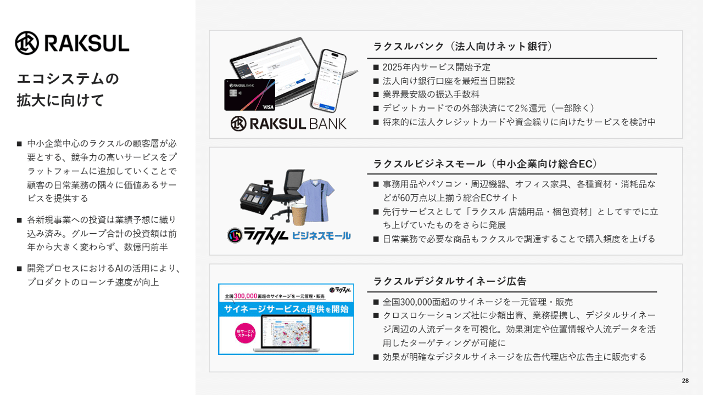
> 引用元：[> 2025年7月期決算説明会資料](https://ssl4.eir-parts.net/doc/4384/ir_material_for_fiscal_ym/187138/00.pdf)

*https://corp.raksul.com/ir/library/presentation/*

パワポの右側のボディの部分ですが、ラクスルバンク、ラクスルビジネスモール、ラクスルデジタルサイネージの３つについて、イメージ画像とタイトル、箇条書きの詳細という見やすい構造になっています。

箇条書きで文章を記載する場合、どうしてもパワポがビジーになりがちなので、階層構造にするなどのデザインの工夫が必要です。ここでは**タイトル部分を太字にして、箇条書きの部分より大きなフォントで示す**と同時に、太目の黒線でタイトルと箇条書き部分を切り分けることで見やすくしています。

**文字だらけにならないようイメージ画像を入れている点も、箇条書きを使いつつ見やすいパワポにする**上で地味に効果的な手段です。

なおラクスルはパワポの左側にメッセージを入れて、その下に詳細を箇条書きで書くデザインとなっています。こちらも箇条書きを活かした見やすいパワポのデザインとして参考になりますね。

### 箇条書き内タイトルがあるパワポデザイン

続いてグリーンモンスター株式会社の箇条書きのパワポを見ていきましょう。2025年6月期 通期決算説明資料（事業計画及び成長可能性に関する事項）のパワーポイントに入っている、通期計画の前提条件のスライドです。
通期計画や中期経営計画の前提条件を記載するパワポでは、詳細をテキストで書くことが多く、箇条書きのデザインが使われることが多いです。

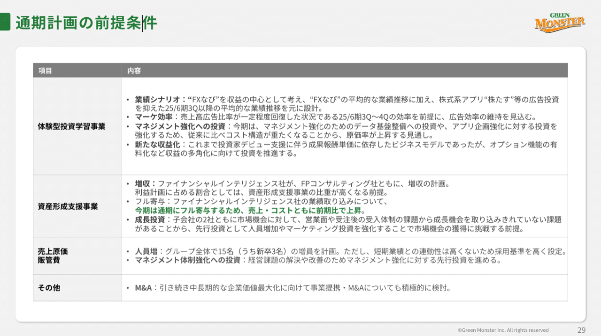
> 引用元：[> 2025年6月期 通期決算説明資料（事業計画及び成長可能性に関する事項）](https://contents.xj-storage.jp/xcontents/AS04869/8f57059a/8b77/4d01/a3a0/7f208f8a43a6/140120250814542608.pdf)

*https://greenmonster.co.jp/ir/library/*

シンプルなテーブル形式のパワポで、箇条書きのデザインが使われています。テキスト間の余白が少ないので、びっしりと綿密に作成された計画であるという印象を受けますね。

箇条書きでテキストをびっしり書くと、どうしても見やすいパワポではなくなってしまいます。そこでメリハリをつけるために太字や色を使うのですが、このパワポでは**箇条書きの各テキストの頭に「業績シナリオ」「マーケ効率」「マネジメント強化への投資」といったタイトルをつける**ことで、見やすいデザインにしています。

伝えたいテキストをピンポイントで緑色にする見せ方も、箇条書きを使いながら見やすいパワポにする工夫です。

### インデントで階層化したパワポデザイン

お次は株式会社ABEJAの箇条書きのパワポを見ましょう。2025年8月期決算説明資料のパワーポイントに入っている、ブレークスルーに関する参考スライドです。

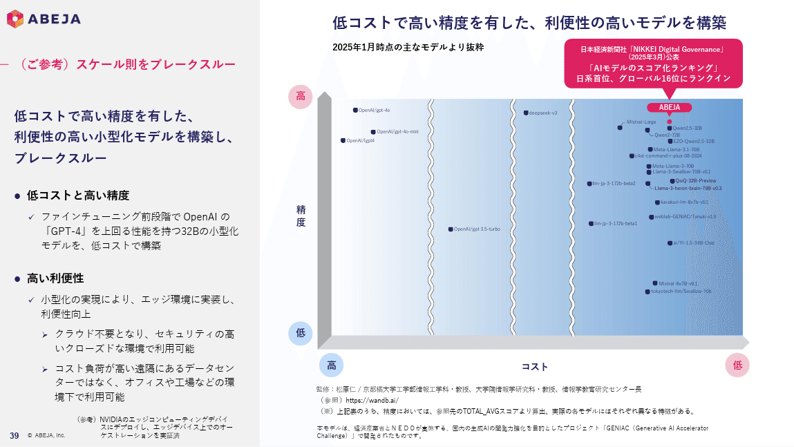
> 引用元：[> 2025年8月期　決算説明資料](https://ssl4.eir-parts.net/doc/5574/tdnet/2698143/00.pdf)

*https://www.abejainc.com/ir-presentation*

注目したいのは左側のメッセージの部分になりますが、パワポのインデントの機能を使って３段階の階層構造のデザインにしています。**一番上の階層が黒丸の点と太字、２段目の階層がチェック、三段目が矢印**というように整理することで見やすくしています。

パワポに限らず、箇条書きを使う場合は階層構造を使うことで見やすいデザインになります。ここでは以下のような構造になっています。

- 一段目：一言サマリー

- 二段目：一言サマリーの背景

- 三段目：詳細

ラクスル社同様に左側にメッセージと詳細を入れるパワポデザインですが、スライドタイトルが赤、メッセージが青、その下に箇条書きという構造で、非常に見やすい階層構造のスライド例といえますね。

なお**箇条書きで階層構造を作る際には、パワポの上部の「箇条書きと段落番号」の機能を使うのが楽**です。パワポの「箇条書きと段落番号」の機能を使えば、改行時に文字がそろうだけでなく、キーボードのタブボタンで箇条書きの階層を一つ下げることができ、いちいち調整する手間がかかりません。
詳しくはパワポの箇条書きのデザイン方法のパートで説明しますね。

## ラベルで見やすい箇条書きのデザイン３選

ここからは、箇条書きの点にラベルを付けて見やすいデザインにしているパワポ例から見ていきましょう。
パワポの箇条書きの点にナンバーを付けるデザインはよく目にすると思いますが、ナンバー以外にも様々なラベルを使った見せ方の工夫があります。いくつかのパターンでデザイン例を３つ紹介します。

### 箇条書きと数字ラベルのパワポデザイン

まずは株式会社ティアの箇条書きのパワポを見ていきましょう。2025年9月期決算説明会資料のパワーポイントの、基本方針に基づく重点施策のスライドです。

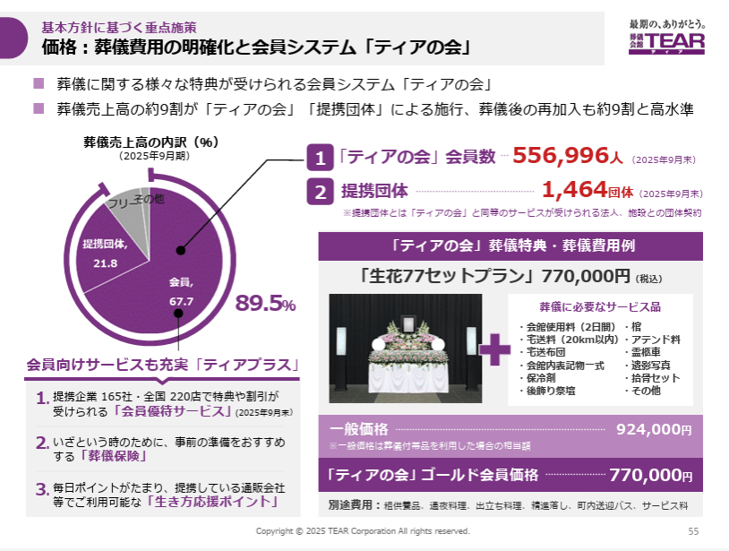
> 引用元：[> 2025年9月期決算説明会資料](https://www.tear.co.jp/company/ir/event/pdf/kessan/20251114kessan.pdf)

*https://www.tear.co.jp/company/*

株式会社ティアの特徴であるティアの会について詳細に説明しているスライドです。メッセージ、ティアプラスの内容、会員数と提携団体数のそれぞれに箇条書きが使われたパワポですが、それぞれデザインが異なります。

パワポのトップラインメッセージについてはプレーンな箇条書き、ティアプラスについてはプレーンな数字、会員数と提携団体数については数字のラベルを箇条書きの点の上に乗せて区別し、見やすくしています。
**同じ箇条書きでも、点の上の数字やラベルの見せ方ひとつで印象が大きく変わり、**見やすいパワポになることがわかります。

また**箇条書きの点に色を付けることで、パワポのデザインに統一感が出る**点も覚えていきたいポイントです。ティア社のパワポは紫色で統一されているのが特徴ですが、箇条書きの番号に色を付けることで、おしゃれで見やすいデザインとなっています。

### 箇条書きとマルバツ評価のパワポデザイン

続いてインフォメティス株式会社の箇条書きのパワポを見ていきましょう。事業計画及び成長可能性に関する事項のプレゼンテーションに入っている、現在の事業概要のスライドです。既存のIoTサービスと自社のサービスの違いを横比較しています。

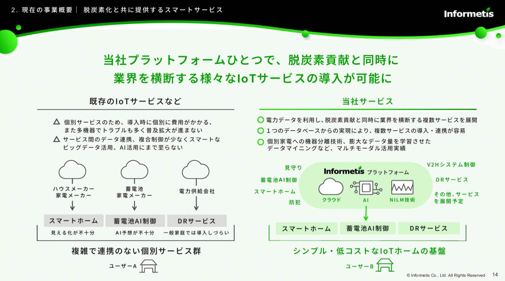
> 引用元：[> 事業計画及び成長可能性に関する事項](https://contents.xj-storage.jp/xcontents/AS04931a/ff5bd8b4/5223/42fd/9828/34477a9287a6/140120250327501451.pdf)

*2025/03/28適時開示事業計画及び成長可能性に関する事項*

左右でサービスを比較するデザインのパワポですが、**箇条書きの点に丸と三角を上乗せことで、自社のサービスの方が優れているという見せ方**にしています。

このように箇条書きのパワポに丸や三角をつける場合には、一旦パワポの「箇条書きと段落番号」の機能を使って箇条書きをし、点の上に背景つきの図形を重ねると見やすくなります。この際に背景をパワポの背景色と揃えることで、つなぎ目もなく見やすいデザインの箇条書きになりますよ。

またここでは、**箇条書きに合わせる丸の方を自社のコーポレートカラーである緑色**に、三角の方を灰色にすることで見やすいパワポデザインにしている点も見せ方の工夫といえますね。

### 箇条書きと上下の評価のパワポデザイン

続いてデジタルグリッド株式会社の箇条書きのパワポを見ていきます。2025年7月期通期_決算説明資料（事業計画及び成長可能性に関する事項）のプレゼンテーションに入っている、リスク評価のスライドです。

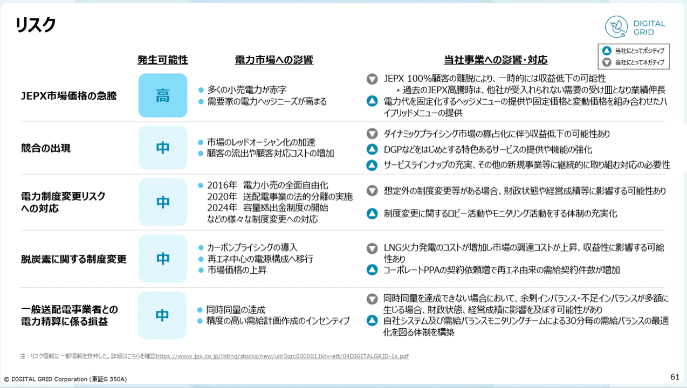
> 引用元：[> 2025年7月期通期_決算説明資料（事業計画及び成長可能性に関する事項）](https://ssl4.eir-parts.net/doc/350A/tdnet/2686461/00.pdf)

*https://www.digitalgrid.com/ir/library/presentation/*

事業計画及び成長可能性に関する事項の資料に必ず入っている、リスクについて整理されたパワポです。発生しうるリスクに対して、自社の事業への影響や対応方針を箇条書きで見やすくまとめています。

先ほどのパワポは丸と三角を箇条書きの点の上に付ける見せ方でしたが、こちらは**自社にとってポジティブかネガティブかのラベルを付ける見せ方**となっています。
見やすいパワポになるように、三角形が上向きか下向きかで箇条書きの各項目がポジティブかネガティブかを見せていますね。

また先ほどと同様に**ポジティブな方のラベルは自社のコーポレートカラーである青色、ネガティブな方のラベルは灰色**にすることで、箇条書きにメリハリをつけるデザインとなっている点もポイントです。

## 配色の妙でおしゃれで見やすいデザイン３選

最後に、パワポの箇条書きの配色をグラフやタイトルと合わせることで、おしゃれで見やすいデザインを実現している例を見ていきましょう。
先ほどの株式会社ティアのように、コーポレートカラーの色を箇条書きのパワポに合わせることで全体の統一感を出すことができますが、その応用形のおしゃれなパワポデザイン例を３つ紹介します。

### 見やすい色の箇条書きのパワポデザイン

まずはHEROZ株式会社の箇条書きのパワポを見ていきましょう。2025年4月期 通期決算説明資料のパワーポイントの、リカーリング売上のスライドになります。

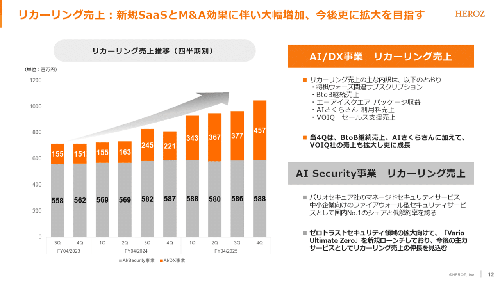
> 引用元：[> 2025年4月期 通期決算説明資料](https://ssl4.eir-parts.net/doc/4382/tdnet/2638737/00.pdf)

*https://heroz.co.jp/ir/material/*

四半期ごとのリカーリング売上を棒グラフで左側に見せたうえで、右側に箇条書きでその詳細を描くという見せ方のパワポです。

**パワポの箇条書きの点の色をコーポレートカラーのオレンジ色にするだけでなく、それを左側のグラフと揃える**ことで、一目でグラフと詳細がリンクするような見せ方の工夫がされており、見やすくなっています。

安定して伸びているAI Security事業に対して、伸びているAI/DX事業の方をオレンジ色にして目立たせている点も見やすいポイントですね。

### おしゃれな色の箇条書きパワポデザイン

続いて株式会社ダイブの箇条書きのパワポを見てみましょう。2025年6月期 通期決算説明資料（事業計画及び成長可能性に関する事項）のプレゼンテーションに入っている、成長戦略のスライドです。

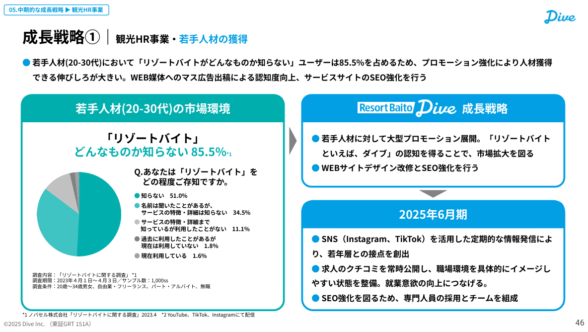
> 引用元：[> 2025年6月期 通期決算説明資料（事業計画及び成長可能性に関する事項）](https://ssl4.eir-parts.net/doc/151A/tdnet/2671665/00.pdf)

*https://dive.design/ir/library/presentation*

左側に市場環境、右側に成長戦略と2025年6月期の取り組みを記載するという構造のスライドです。各ボックスの中に箇条書きが使われているパワポですが、箇条書きの点に円グラフの緑色やボックスタイトルの青色が使われていることで見やすくなっています。

**パワポの左側はボックス自体が緑色で、円グラフも緑色のグラデーション、箇条書きもグラデーションに合わせる見せ方**で見やすいデザインとなっています。一方右側はコーポレートカラーの青色を箇条書きに使ったパワポデザインで、統一感のある見やすいデザインとなっています。

ポイントとしては、**パワポの左右それぞれで箇条書きを使いながらも見やすい統一感のあるデザインとしつつ、左右の配色の相性が良い**ことで、おしゃれなデザインともなっている点です。

### カラフルな色の箇条書きパワポデザイン

最後は株式会社unerryの箇条書きのパワポを見ていきましょう。2025年6月期通期 決算説明資料のパワーポイントの、粗利率のスライドになります。

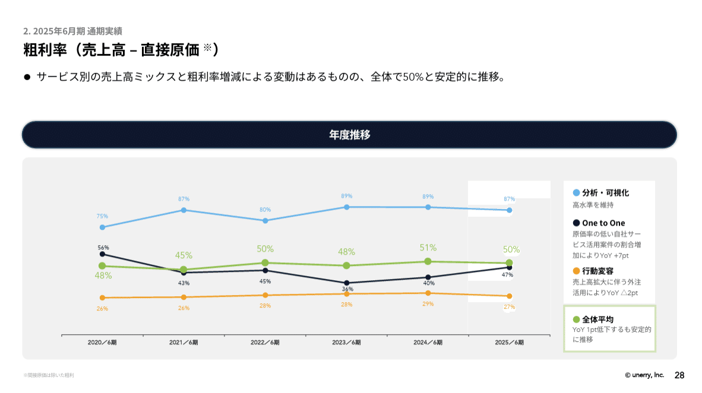
> 引用元：[> 2025年6月期通期 決算説明資料](https://contents.xj-storage.jp/xcontents/AS82460/42cb224e/d3dc/493d/aced/dd7acff9c7b3/140120250812539357.pdf)

*2025年6月期通期 決算説明資料*

こちらのスライドは[【マネしたい】おしゃれなパワポの「折れ線グラフ」スライド９選](https://note.com/powerpoint_jp/n/n4d105e11f613)でも紹介していますが、非常に見せ方のうまいスライドです。
パワポの右側に各事業ごとの粗利率の背景が箇条書きでまとまっていますが、その**点の色を左の折れ線グラフの色と合わせることで、おしゃれで見やすいデザイン**となっています。

またポイントとして、折れ線グラフ側の点を丸にすることで、右の箇条書きの頭の丸との統一感も出している点も、おしゃれで見やすいパワポデザインとなっている理由ですね。

## パワポの箇条書きのデザイン方法

最後に、パワポの箇条書きのデザイン方法についてかんたんに紹介します。
「インデントで階層化したパワポデザイン」のところでも説明しましたが、パワポで箇条書きを使う場合は、**パワポの上部の「箇条書きと段落番号」の機能を使うのが楽**です。

### パワポの「箇条書きと段落番号」の機能

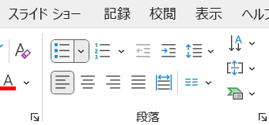
*箇条書きと段落番号のタブ*

パワポの箇条書きと段落番号の機能はおしゃれで見やすいデザインにする上でかなり便利です。

- 改行時に自動でインデント調整がされ、すっきり見やすいデザインになる

- 階層を下げる際に、タブボタン一つで階層を下げることができる

- 箇条書きを番号に変えたい場合もボタン一つで調整できる

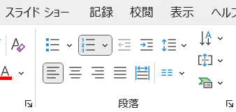
*段落番号のタブ*

といったことを、何も考えずとも勝手に調整してくれるので、パワポで箇条書きのデザインにする場合は必須といえます。

### 箇条書きの改行や行間や空白の微調整

ここからは、パワポの箇条書きにおける微調整の方法について説明します。
箇条書き機能を使っていると、「自動改行より早めに改行したい」「少し文字を詰めて２行に収めたい」「見やすいように行間を広げたい」といった調整をしたくなることがあります。

自分の好みの位置で改行をしたい場合ですが、Enterをただ押すと改行と同時に次の箇条書きの点が出てきてしまいますよね。**箇条書きの点を変えずに改行したい場合は、Shift＋Enterで改行**しましょう。

また**文字を詰めたい場合は、表示機能のルーラーを使って調整**しましょう。
リボンの下にあるルーラーのツメの部分で調整することで、箇条書きの点と文字の間や、点の位置を調整できるようになります。

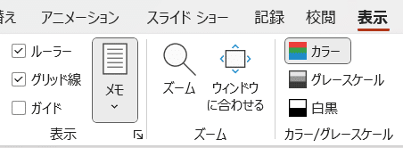
*表示機能のルーラーにチェックを入れる*

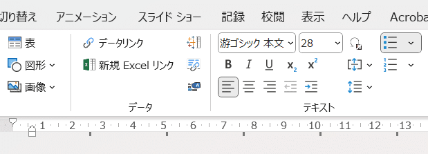
*リボンの下にルーラーが現れる*

箇条書きの行間を広げたい場合は、同じく箇条書きと段落番号の機能の中にある行間の機能を使って調整しましょう。**行間のオプションを開くと、箇条書きのインデントや段落間の間隔などを細かく設定**できます。

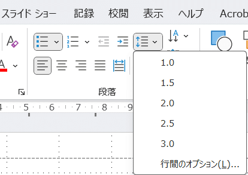
*箇条書きと段落番号の機能の中にある行間の機能*

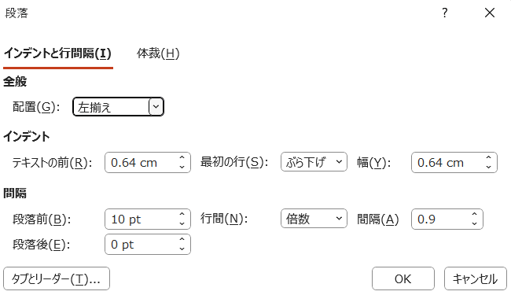
*行間のオプション*

## 【マネしたい】おしゃれなパワポの「箇条書き」スライド９選まとめ

いかがでしたでしょうか。パワポの「箇条書き」について、見やすいスライドの見本や、おしゃれなスライドの見本を見たうえで、実際にパワーポイントで箇条書きの機能を使いこなすための方法を説明しました。

箇条書きは情報をリッチにするうえで効果的ですが、ポイントを押さえれば見やすいおしゃれなパワポデザインにできることが伝わったかと思いますので、今後パワーポイントを作る際の参考になっていれば幸いです。

## パワポ研オリジナルテンプレート

パワポ研では、「ビジネスシーンで使える」パワーポイントテンプレートを公開しております。デザインを整えるのみならず、**ロジックやストーリーを整理するのにも役立つパッケージ**になっておりますので、関心のある方は下記ページも併せてご覧ください！

上記の記事のように、noteでは**フォローしているだけでビジネスにおける「資料作成のコツ」と「デザインのセンス」が身に付くアカウント**を目指して情報配信を行っています。
今後もコンスタントに記事を配信していく予定なので、関心のある方は是非アカウントのフォローをお願いします！

**> Template販売　**[> https://powerpointjp.stores.jp/](https://powerpointjp.stores.jp/%EF%BF%BCnote)
**> note　**[> パワポ研の資料作成術](https://note.com/powerpoint_jp/m/mc291407396da)
**> X（旧Twitter)　**[> https://twitter.com/powerpoint_jp](https://twitter.com/powerpoint_jp)

## レックスアドバイザーズからのお知らせ

パワポ研は株式会社レックスアドバイザーズが運営しています。
レックスアドバイザーズは**経営企画職や経営管理職に特化した転職エージェント**です。
上場企業や上場準備企業を中心に、**経営企画、IR、経理財務、法務、内部監査等の職種の求人**をご紹介しているほか、**CFOなどのコンフィデンシャル求人**もご紹介可能です。
またコンサルティングファームや監査法人、会計事務所の求人も豊富にあるため、プロフェッショナルファームを目指す方のご支援も得意です。
求人紹介やキャリア相談を希望の方は、[**無料転職サポート**](https://www.career-adv.jp/job_search/entryform_exp/)よりサービス利用登録をしてみてください。

*レックスアドバイザーズのサービスサイトはこちらから*

**> 求人をご希望の方　**[> 無料転職サポート](https://www.career-adv.jp/job_search/entryform_exp/)**
> 採用支援をご希望の方　**[> 採用サポート](https://www.career-adv.jp/request3/)
**> その他　**[> お問い合わせフォーム](https://www.rex-adv.co.jp/contact)
**> 書籍　**[> 注目企業の実例から学ぶパワポ作成術](https://www.amazon.co.jp/dp/4046060476)

