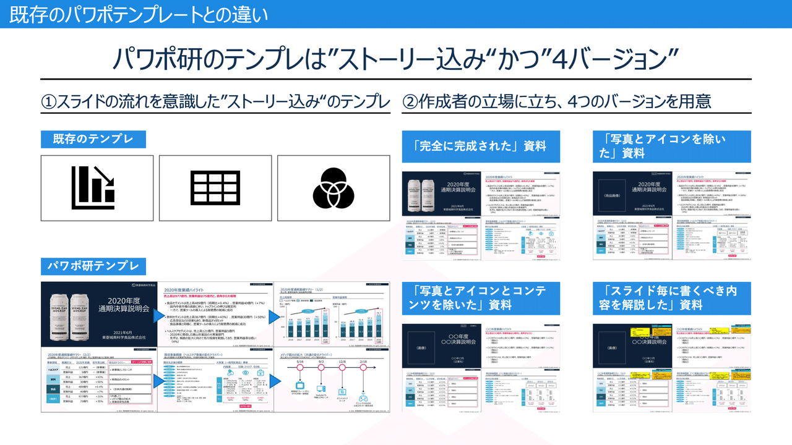
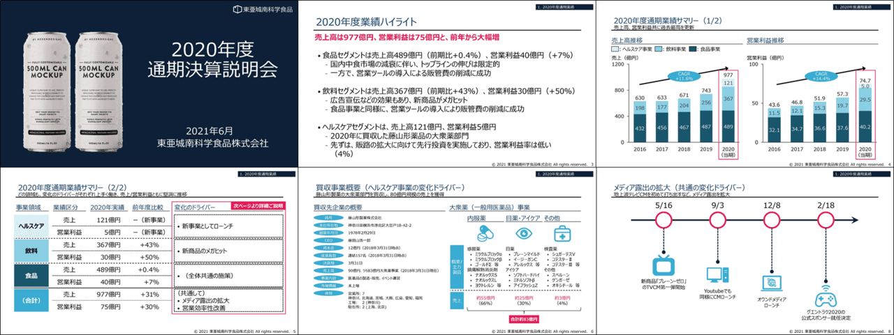
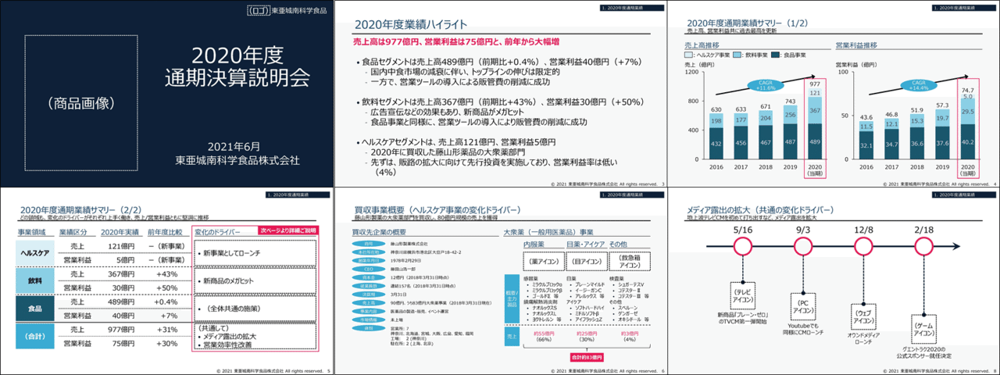
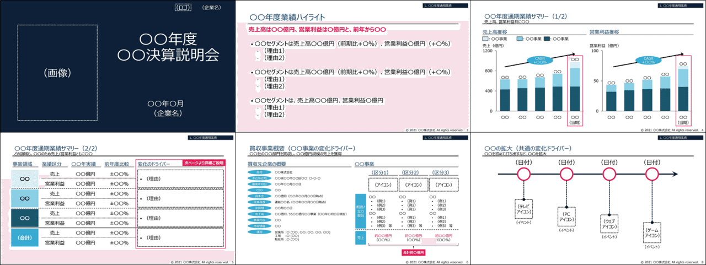
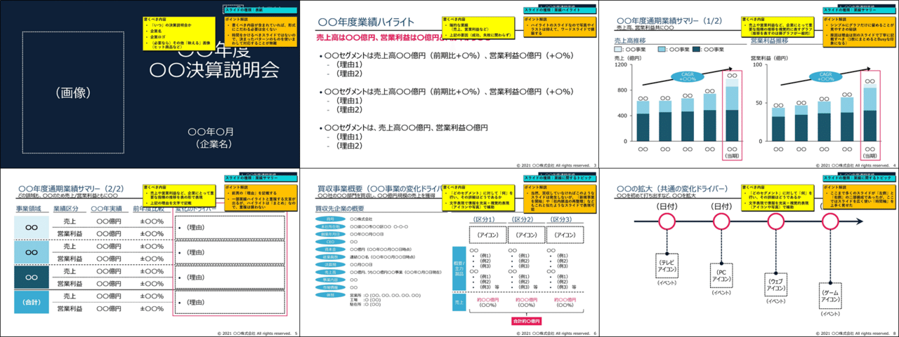
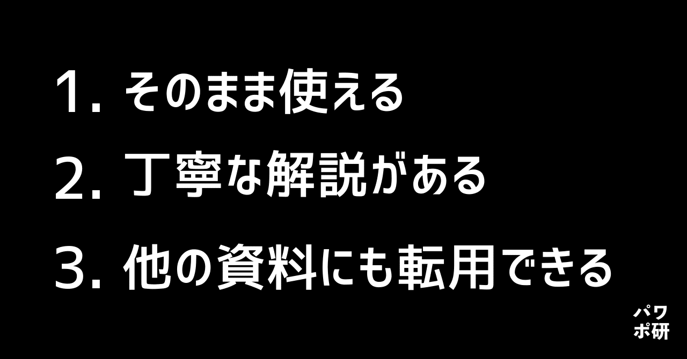
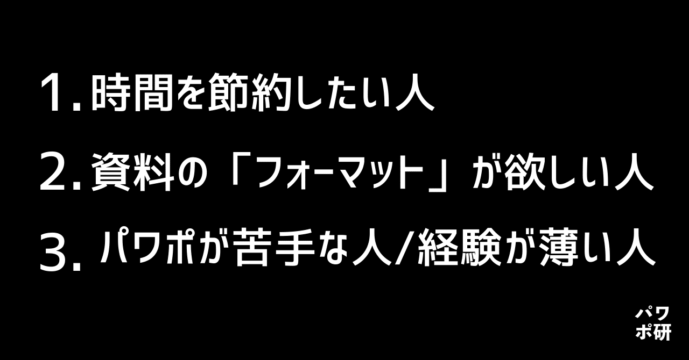
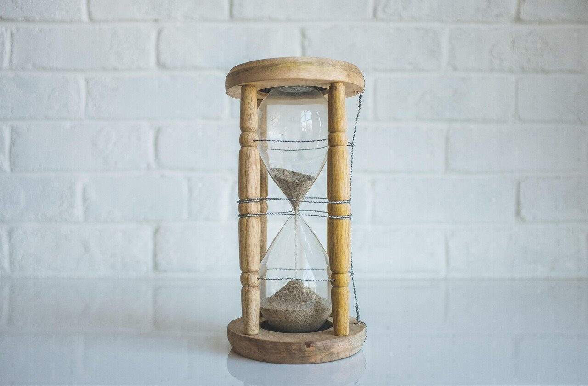
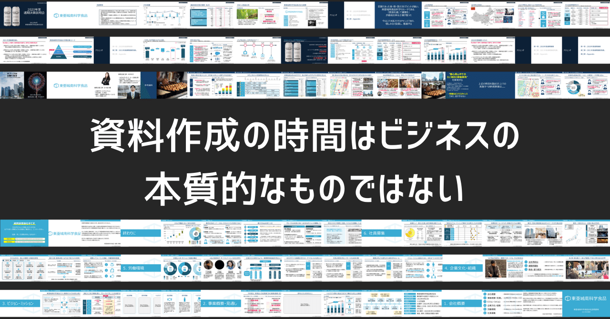
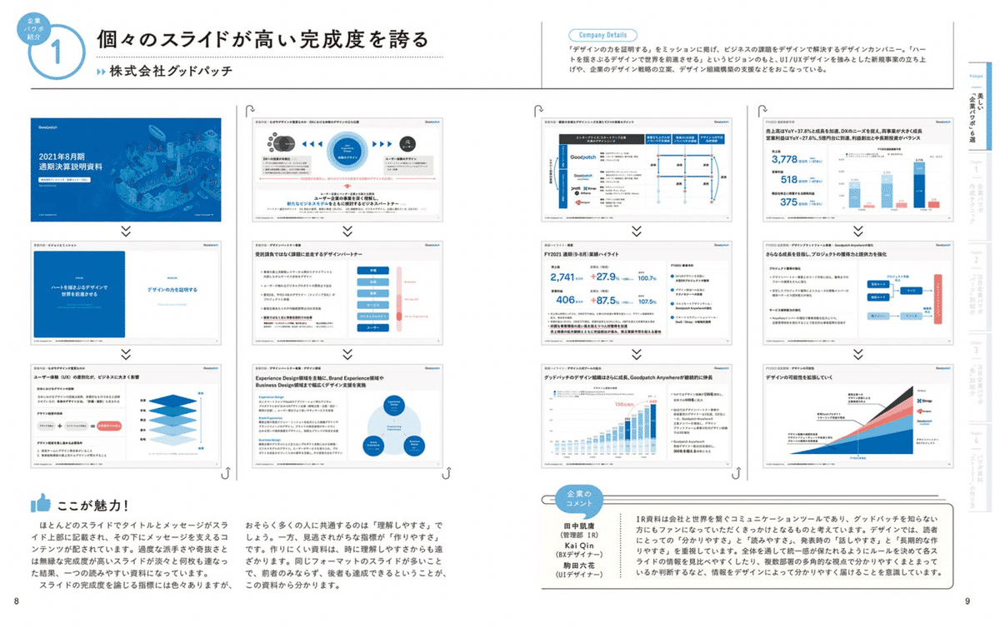

# 【決定版】パワポ研が1年かけて開発したビジネスシーン別で使えるスライドテンプレート！

[note原文](https://note.com/powerpoint_jp/n/n0380d0556127)

みなさんこんにちは。
資料デザインのリサーチや分析に取り組むパワーポイントのスペシャリスト、パワポ研です。日々noteやTwitterでパワポに関する情報発信をしています。

この度、パワポ研が一年間という歳月をかけ作成していた、ビジネスシーンで大変便利な**「パワーポイントテンプレートの決定版」**が完成いたしましたので、是非とも皆様にお使いいただきたく、その解説を行いたいと思います。

（なお「**解説はいらないからすぐに使いたい！」**という人は**「**[**こちら**](https://powerpointjp.stores.jp/)**」**のLPをクリックください）

## パワポ研ビジネスシーン別テンプレートの構成

パワポ研で展開するテンプレートは現時点では以下の**4種類**になります。なるべく多くの方が利用できるようなラインナップを構築しました（今後随時追加予定です）。

**> ・資金調達ピッチ資料（全24ページ）
> ・決算説明資料（全26ページ）
> ・新規事業計画資料（全19ページ）
> ・会社説明/採用資料（全45ページ）**

各資料のサンプルは以下よりダウンロードできます。

   [    **パワポ研_資金調達ピッチ資料_v1（0. サンプル）.pdf** 1032201 Bytes  ファイルダウンロードについて      

ダウンロード
   ](https://note.com/api/v2/attachments/download/739ebf6f4cdf2e7cc3b433665ed0af9d)      [    **パワポ研_決算説明資料_v1（0. サンプル）.pdf** 995639 Bytes  ファイルダウンロードについて      

ダウンロード
   ](https://note.com/api/v2/attachments/download/25cc4651c21b722484988ba16d2b80ee)      [    **パワポ研_新規事業計画資料_v1（0. サンプル）.pdf** 2179068 Bytes  ファイルダウンロードについて      

ダウンロード
   ](https://note.com/api/v2/attachments/download/66e82919f2cef27400f5f3e3977b90d4)      [    **パワポ研_会社説明・採用資料_v1（0. サンプル）.pdf** 732393 Bytes  ファイルダウンロードについて      

ダウンロード
   ](https://note.com/api/v2/attachments/download/cbcf844c61f566c3ee404ce67bf71365)   そして、今回パワポ研が作成したのは「**内容（ストーリー）のあるパワーポイント全体のパッケージ**」です。巷では、**単体のスライド**（例えば、ピラミッド図やフローチャート図）の配布や、あるいは**中身が空欄ばかりの資料**（汎用的に使えるもの）はしばしば見られますが、利用シーンを想定した**完成形としての資料**はあまりありません。

パワポ研は完成形としての資料を用意したので、ユーザーは「**それをちょっと改変するだけ**」でご自身の資料としてお使いいただけます。要すれば、頭の中で考えた内容をほぼ最短ルートでパワーポイントのアウトプットに落とし込むことが出来るようになるのです。また、完成形に自分の伝えたいことを当てはめていくことで、**構造化やロジックの整理ができる**という点も大きなメリットです。

もちろん、「空欄が多い資料が良い」というニーズもあると思いますので、パワポ研は以下のパッケージをバンドルして提供します。

**> ・「完全に完成された」資料（PDF）
> ・「写真とアイコンを除いた」資料（パワーポイント）
> ・「写真とアイコンとコンテンツを除いた」資料（パワーポイント）
> ・「スライド毎に書くべき内容を解説した」資料（PDF）**

上記4点で1セットとして提供します。なお、それぞれは以下のようなイメージと特徴になっております。
（※なお、本noteに記載の画像は実際の商品と一部異なる場合がございます）

**「完全に完成された」資料（PDF）**

> ・「写真」と「アイコン」も含む、完全なパッケージ
> ・PDFの状態なので、これをベースにパワーポイント資料を作成する場合は次の資料を用いる

**「写真とアイコンを除いた」資料（パワーポイント）**

> ・「写真」と「アイコン」を除いたパッケージ
> ・パワーポイント資料なので、この資料の文字を変更したり、写真やアイコンを入れることによって自身の資料として活用可能
> ・既に記載がある内容を改変するだけで、簡便に資料が完成する

**「写真とアイコンとコンテンツを除いた」資料（パワーポイント）**

> ・「写真」と「アイコン」と「文字」を除いたパッケージ
> ・上記と同様にパワーポイント資料であり、またほとんどの文字を除去しているため、ここに文字や写真を打ち込んでいけば自然に資料が完成する

**「スライド毎に書くべき内容を解説した」資料（PDF）**

> ・PDFの状態で、「資料構成の意図と作り方」が学べる資料
> ・利用するというよりは、これを見て資料の作り方を学ぶための位置づけ

以上の4資料で1つのコンテンツとなっております。

## パワポ研テンプレートの特徴

このテンプレートには、3つの大きな特徴があります。

まず1つ目は、「**そのまま使える**」ということです。前述しましたが、これまで世の中にあった既存のテンプレートは「独立したスライド」であるが故に**いちいちピックアップする手間**があったり、また「中身が空欄」であるが故に、**何を書くかのとっかかりがない**などテンプレユーザーのニーズを満たせていないものがほとんどでした。しかしパワポ研のテンプレートは資料を「**フルパッケージ**」として提供するものであり、ユーザーの頭の中のものを当て込むだけで、ほとんどそのまま使えます。

2つ目は、「**丁寧な解説がある**」ということです。既存のテンプレートは大量のスライドだけを用意して「さあどうぞ使ってください」というものが多く、ユーザーフレンドリーとは言えませんでした。しかしパワポ研のテンプレートでは、**どこに何を書くべきか**が明確に分かり、更に例として既にフルパッケージを提供してあり、ユーザーの指針となります。

3つ目は、「**他の資料にも転用できる**」ことです。発売時現在で、パワポ研は4つのテンプレートを提供していますが、その4つに拘らず、複数の**テンプレートを組み合わせることでどのような資料にも転用**いただけます。もちろん、既存の資料のためにテンプレートのいくつかのスライドをピックアップして利用することも可能です。

## 想定するユーザー

さて、ここまではテンプレートの構成と特徴を記載してきましたが、本章では「どのような人に使って欲しいか」ということを記載します。本音を言えば、「パワーポイントを使う全ての人」に使って欲しいのですが、実際のところ全ての人にFitするプロダクトは、逆に言えばだれにもぴったりとははまらないものです。そのため、パワポ研は以下のような人をターゲットとして想定しています。

**1. 時間を節約したい人**

全てのビジネスパーソンや研究者は限りなく時間に追われていますが、その時間の一部を使ってパワーポイントを作成しています。そして、ほとんどの人が「資料作成」を本業としているわけではなく、**「創造的」な仕事を本業としている**はずです。そして、**テンプレートを使うことで本業ではない「資料作成」の時間を削り、より生産性の高い働き方を実現**できます。実際のところ、「資料作成」というのは（デザイナーなどそれを本業とする方を除き）なんら本質的な作業ではありません。あくまで物事を伝えるための手段であり、そのようなことに時間をかけるのはナンセンスであると我々は考えています。その**時間節約の一助にこのテンプレートを活用して欲しい**のです。

裏返せば「時間を大量に消費して徹底的にデザインに拘りたい人」にはこのテンプレートはおすすめしません。

**2. 資料の「フォーマット」が欲しい人**

資料作成作業では、**「全体の構成決定」**と**「細部の詰め」**の2つの山場が存在します。「全体の構成決定」というのは、どのような流れでプレゼン資料を組み立てるかを指し、また「細部の詰め」はフォントや色などよりデザインに寄った細かい作業を指します。

そして、**このテンプレートは両方の山場に有用**です。

まずフルパッケージとして各ケースに沿ったストーリーが完成されているので、構成を決定するのには間違いなく有用でしょう。この中身を入れ替えるだけで、資料として完成します。

また、このテンプレートを使うことで、細部の詰めに関して迷いは一切なくなります。全て「メッセージが明確なスライド」と「視認性の高いフォントと色」でパッケージが構成されているので、些末なことで悩んだり時間を費やしたりする必要は一切なくなります。

要すれば、「フォーマット」として完成しているため、それを活用したいという人には最適なものになっているはずです。

**3. パワーポイントが苦手な人/経験が薄い人**

そもそも本テンプレートは、**パワポ初心者の方でも簡単に利用できる**ということをコンセプトに開発されました。そのため、オブジェクトを一々作成したり、スライドのレイアウトに悩んだりする必要が一切なくなり、**この資料をベースにすれば手間をかけずにスライドを作成すること**が出来るでしょう。

また、フルパッケージ一式を利用して**パワーポイント資料の作り方を学ぶ**ことも可能です。オリジナル版は、できる限り構造を単純化し、でデザイン性の高いページを削ぎ落としているため、慣れた頃合いで自身に最適なフォーマットを作り上げ、資料作成のスピードを上げることも将来的には可能になるでしょう。

## テンプレートの使い方

ここまでの説明で、おおよそテンプレートの使い方はご理解いただけたかと思いますが、改めて使い方を以下にまとめます。

まず、基本的には**業務に活用すること**を想定しています。日々のパワーポイント作成にご活用いただく、ということです。ある種の資料を作る必要があり、その発射台としての利用を主に想定しています。実際には、以下のフローになるでしょう。

> 1. 作成する資料の「大枠」のイメージを描く
> 2. 適切なテンプレートを開く
> 3. 思い描いていたことを「メッセージ」「ボディ（内容）」の順に、テンプレートに流し込む
> （テンプレートに無いスライドは、他のテンプレートから借用したり、あるいは自作する）
> 4. 自社ロゴを入れたり、必要に応じて色やフォントを変更する

（このあたりの資料の作成方法は、以下の記事をご参照ください）

また、副次的に**パワーポイント作成の勉強材料としての活用**も可能です。前述の通り、4つのフルパッケージについて「書くべき内容」と「作成のポイント」を全てのスライドについて記載しています。また、「一般的な資料一連の流れ」を理解することもできます。

## テンプレート作成の背景

少し脇道に逸れますが、なぜパワポ研がわざわざテンプレートを作成したのかということを念のため記載しておきます。

まず第一に、パワポ研は**資料作成の時間はビジネスの本質的なものではない**、と考えています。前述の通り、限りある時間の中では創造的な業務に注力することがビジネスパーソンとしての価値に繋がります。

そして、パワーポイント資料作成はその本質的ではない時間の最たるものです。同じような作業の繰り返しに近く、それは創造的とは言えません。あくまでパワポ資料というのはアイデアや結果を「見せる」ためのものなので、そこに独創性や創造性は求められていません。しかし、パワポ資料があると説明もし易いし、理解もしてもらい易い。だからビジネスパーソンは時間を割いて資料を作るのです。

そして、ある種の**テンプレートがあれば「分かりやすい」資料を「最小の労力で」作成することが出来る**と考えました。なので、パワポ研としても世の中のテンプレートを探し、いいものを紹介できれば……と考えていました。

しかし前述の通り、世の中に無料のテンプレートはいくつか散見できますが、どれも一長一短があり、パワポ研が「これぞ！」と思うものはなかなか見つかりませんでした。図形の寄せ集めであったり、ごく一部の極端にデザイン性の高いスライドの集まりであったり、あるいは特定の役割にフォーカスし過ぎていたり……などなど。

そのため、「じゃあゼロからテンプレートを作って配布しよう」ということで、この度テンプレートの作成に至ったわけであります。

## テンプレートの価格/購入方法

購入価格は以下のようになっております。

【4種類のテンプレート「セット販売」】：**6,980円
**【1種類のテンプレート】：**2,500円**

**> ・資金調達ピッチ資料（全24ページ）
> ・決算説明資料（全26ページ）
> ・新規事業計画資料（全19ページ）
> ・会社説明/採用資料（全45ページ）**

の4つの資料のセットです。

そして、それぞれについて

**> ・「完全に完成された」資料（PDF）
> ・「写真とアイコンを除いた」資料（パワーポイント）
> ・「写真とアイコンとコンテンツを除いた」資料（パワーポイント）
> ・「スライド毎に書くべき内容を解説した」資料（PDF）**

の4つの要素が含まれています。これをバンドルして、**6,980円（税込）**でご提供します。購入は下記のページよりお願いいたします。

【単品のテンプレート】：**2,500円**
また、それぞれの資料（資金調達ピッチ資料、決算説明資料など）については**各2,500円**でバラ売りしております。これについても、上記の商品ページよりご購入いただけます。

## おまけ

テンプレートとは異なりますが、2023年1月にKADOKAWAからより「[**注目企業の実例から学ぶパワポ作成術**](https://www.amazon.co.jp/dp/4046060476)」という書籍を出版しております。実際の企業の決算パワポを40社分解説しており、パラパラとめくれる「デザイン集」として使える一冊となっておりますので、手元に紙で置いておきたいという方が購入をご検討ください！

*パワポ研書籍「注目企業の実例から学ぶパワポ作成術」のページサンプル*

**> Template販売：**[> ストアページ](https://note.com/powerpoint_jp/store)
**> note：**[> パワポ研の資料作成術](https://note.com/powerpoint_jp/m/mc291407396da)
**> 書籍：**[> 注目企業の実例から学ぶパワポ作成術](https://www.amazon.co.jp/dp/4046060476)
**> X（旧Twitter)：**[> https://twitter.com/powerpoint_jp](https://twitter.com/powerpoint_jp)
**> お問い合わせ：**[> お問い合わせフォーム](https://www.rex-adv.co.jp/contact)

