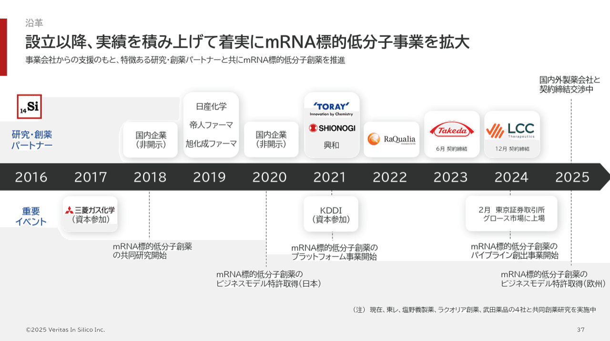
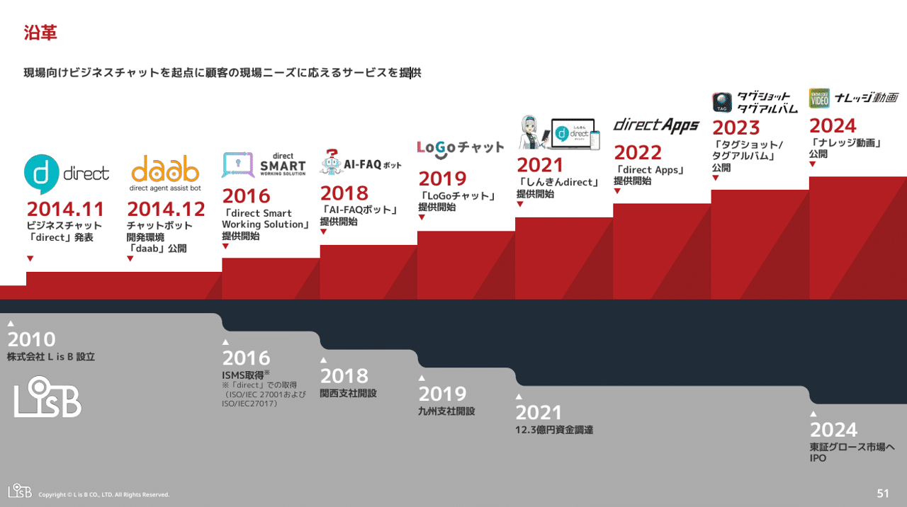
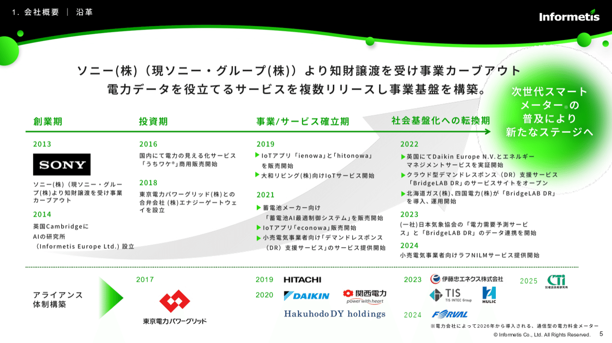
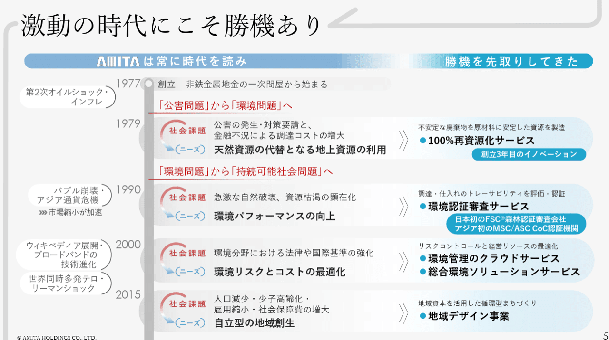
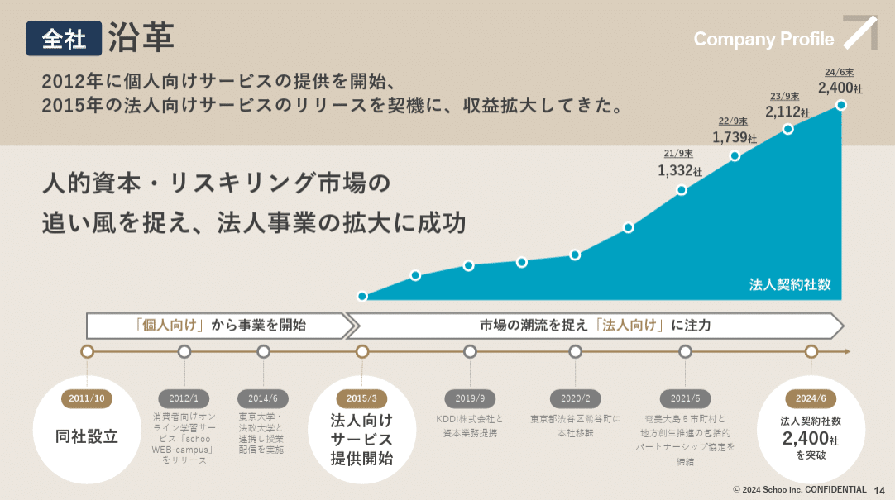
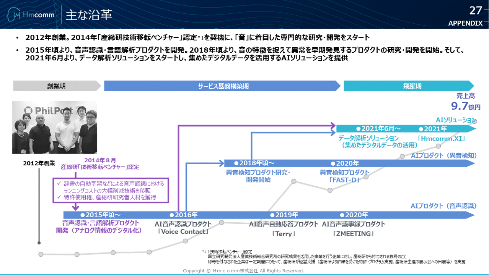
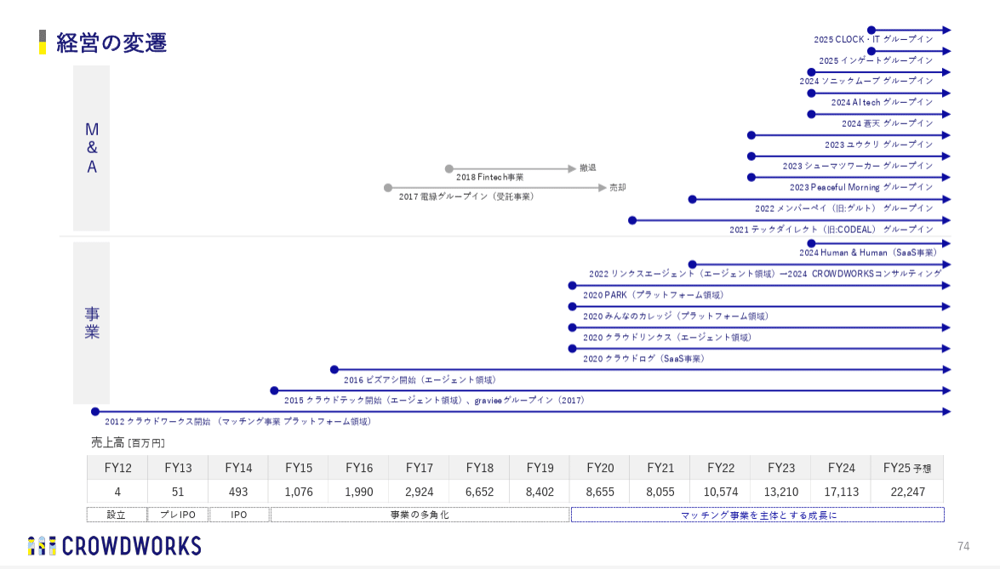
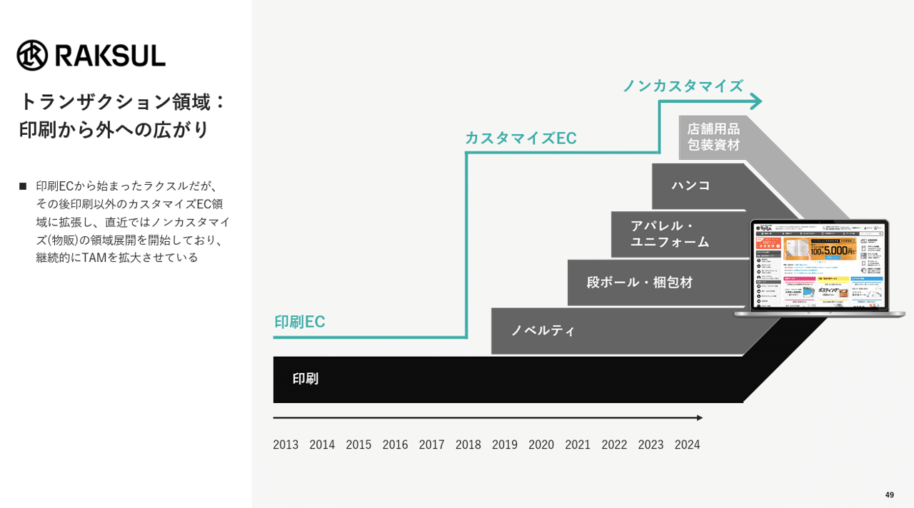
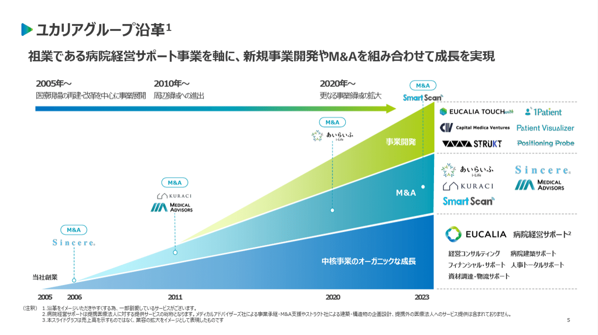

# 【マネしたい】見やすいパワポの「タイムライン」「時系列」スライド９選 （2025年更新）

[note原文](https://note.com/powerpoint_jp/n/n13417981793d)

みなさんこんにちは。
資料デザインのリサーチや分析に取り組むパワーポイントのスペシャリスト、パワポ研です。

今回は、パワポの「タイムライン」「時系列」スライドに焦点を当て、上場企業のIR資料から参考になるスライド例を抜粋して紹介していきます。

【マネしたい】シリーズの記事一覧はこちら。

では早速見てみましょう！

## ベーシックな時系列スライドの見本３選

まずは文章を中心に構成された年表スライド例を見ていきましょう。
パワポの沿革スライドで最もベーシックなのは、西暦とその年の出来事を縦に並べていくものですが、どうしても情報量が多くて見づらくなる傾向があります。**見やすいスライドは、上下や左右でカテゴリを分けるなど構造化がされています。**

### 株式会社Veritas In Silicoのスライド例

決算説明資料でたまに見かけるのが、年表の真ん中に西暦を持ってくるテンプレートです。それにより、**上のスペースと下のスペースを分断**できます。
このスライド例では、上に「研究・創薬パートナー」、下に「重要イベント」を持ってくることで、見やすい構造にしています。
また、どの情報を削るべきか？という観点を持って作成されているだけでなく、配色やテキストやロゴの内容を吟味し、シンプルな形で情報を整理されている点もポイントが高いですね。

> 引用元：[> 2024年12月期 決算説明資料](https://contents.xj-storage.jp/xcontents/AS82025/8f7c5a8d/5e58/4432/a061/d987dde579b9/140120250213572315.pdf)

*https://www.veritasinsilico.com/ir/presentations/*

*L is Bの時系列スライド。上がサービスローンチ、下は企業関連のイベント。*

> 引用元：[> 2024年 12月期 通期 決算説明資料](https://contents.xj-storage.jp/xcontents/AS05193/eb43db33/5d69/419f/a9af/3e1d5d3423b5/140120250214575783.pdf)

*https://l-is-b.com/ja/ir/presentations/*

### インフォメティス株式会社のスライド例

次のスライド例は、単純な年表ではなく、**企業のステージで横軸を４つのフェーズ（創業期、投資期、事業/サービス確率期、社会基盤化への転換期）**に分け、それぞれのフェーズにおける出来事とアライアンス体制を分けて記載しています。
また、**背景に上向きの矢印を入れる**と同時に、次のフェーズを示唆する「次世代スマートメーターの普及により新たなステージへ」という文言を入れることで、今後の成長を期待させており好印象です。

> 引用元：[> 2024年12月期決算説明資料](https://pdf.irpocket.com/C281A/CRpO/GXe3/v8qs.pdf)

*https://www.informetis.com/ir/library/briefing/?relyear=2024*

### アミタホールディングス株式会社のスライド例

次のスライド例は、同じように２列で構造化している事例ですが、縦に流れている年表に合わせて、**社会のニーズの変化と、それに合わせて自社がどのようなサービスを開始したか**を記載しています。
パワーポイントの沿革ページだと、自社の活動の背景まで入れることは珍しいですが、**「社会のニーズに合わせて進化してきた会社である」というメッセージを伝える**ために、このような構造にしているのだと思われます。

> 引用元：[> 説明会資料](https://www.amita-hd.co.jp/ir/pdf/20250313.pdf)

*https://www.amita-hd.co.jp/ir/meeting.html*

## グラフを使った時系列スライドの見本３選

ここからは、文章やロゴだけでなく、グラフを組み合わせた時系列スライド例を見ていきましょう。時系列スライドはどうしても文字が多くなりますが、**見やすいパワーポイントにするための工夫**として、グラフなどの数的情報を組み合わせるわけですね。

### 株式会社Schooのスライド例

このスライド例では、主なマイルストーンを示したタイムラインの上に、**法人契約者数の伸びをターコイズブルーのグラフ**で見せています。
元々個人向けに事業を行っていたが、市場の潮流を見て法人向けに注力し、一気に成長したという当社の沿革が一目でわかるようになっており、非常に見やすいパワポといえます。

> 引用元：[> 2024年9月期 決算説明資料](https://ssl4.eir-parts.net/doc/264A/ir_material_for_fiscal_ym/167570/00.pdf)

*https://corp.schoo.jp/ir/library/presentation/*

### Hmcomm株式会社のスライド例

次のスライド例は、企業のサービスがどのように進化してきたを時系列で見せつつ、**背景にさりげなく売上推移の折れ線グラフを差し込んで**います。
パワポ全体ではいくつかのテクニックが使われており、基盤構築期のものと飛躍期のものを色で分けて見せている点や、売上は全体の邪魔をしないようにあえて灰色にしている点など、参考になります。
【[マネしたい】見やすいパワポの「棒グラフ」「複合グラフ」スライド９選](https://note.com/powerpoint_jp/n/n285958fc3427#5b4be31f-d52e-4bfa-922b-f6545851e00a)でも取り上げましたが、Hmcommは折れ線をうまく組み合わせるのが上手いですね。

> 引用元：[> 2024年12月期 決算説明資料](https://ssl4.eir-parts.net/doc/265A/tdnet/2568211/00.pdf)

*https://hmcom.co.jp/ir/library/presentation/*

### デジタルグリッド株式会社のスライド例

次のスライド例は、**時系列スライドに合わせて、現在の財務数値と中期経営計画の目標数値を入れ込んで**います。
企業のフェーズを、研究期、創業期、商用期としたうえで、次に中期経営核をがっつり見せる構成も見事ですし、**青色ベースの背景に白線でフェーズを切っているデザイン**も見事といえます。
デジタルグリッドは、CEOがゴールドマン出身、COOがマッキンゼー出身とあって、全体的にパワーポイントのレベルが高く、[パワポの「資金調達ピッチ」作成ポイントと参考スライド集](https://note.com/powerpoint_jp/n/n6b6db49c6081)でも何度か取り上げています。

> 引用元：[> 2025年7月期 通期 決算説明資料（事業計画及び成長可能性に関する事項）](https://ssl4.eir-parts.net/doc/350A/tdnet/2686579/00.pdf)

*https://www.digitalgrid.com/ir/library/presentation/*

## M&Aの時系列スライド見本３選

ここからは少し趣向を変えて、M&Aに関する時系列パワポを見ていきましょう。経営戦略におけるM&Aの重要性が高まる中で、どのような会社をM&Aしているのか、どのようにM&Aを進めているのか見せることはとても大切です。ここではM&Aの中身が伝わりやすいスライド例を３つ取り上げます。

### 株式会社クラウドワークスのスライド例

このスライド例は、「経営の変遷」というタイトルで、**年表上に自社事業の沿革と、M&Aの沿革を同時に見せて**います。いつから始まったものかがわかるよう、各事業を青丸からの矢印で見せています。
クラウドワークスのようにM&Aで成長していくことを明言している場合、M&Aの数もとても重要です。このパワポでは、**縦をM&Aと事業に分け、事業と同じくらいM&Aが進んでいると見せること**で、戦略をしっかり実行していることが見えるようにしています。

> 引用元：[> 2024年９月期 通期決算説明資料](https://contents.xj-storage.jp/xcontents/AS80447/4d07beaa/9ce3/4eb5/8acd/f38d4b90671c/20241105141550707s.pdf)

*https://crowdworks.co.jp/ir/results*

### ラクスル株式会社のスライド例

次のスライド例は、**よりコンセプチュアルに、過去のM&Aの意義や目的を見せて**います。一番下に年表と祖業の印刷ECを置き、その上に各年度に追加された事業を乗せていっています。
どのようなサービスをどの順番で行ってきたかの軌跡が一目瞭然になっており、かつそれぞれがビジネスカテゴリの拡張にどう貢献しているかも一目でわかります。まとめると**戦略の広がりが一目でわかるパワポ**になっており、スライド全体のバランスとしても非常に整っているといえるでしょう。

> 引用元：[> 2025年7月期決算説明会資料](https://ssl4.eir-parts.net/doc/4384/ir_material_for_fiscal_ym/187138/00.pdf)

*https://corp.raksul.com/ir/library/*

### 株式会社ユカリアのスライド例

このスライド例では、事業の広がりをイメージさせる面積グラフを中心に起きつつ、各セグメントにどのような事業があるのか、また**節目でどのようなM&Aを行ってきたか**を見せています。
このパワポ１枚で事業セグメント、M&Aの変遷、新規事業の変遷、将来の戦略などが一目でわかるようになっており、非常にレベルの高いスライドです。
ユカリアは[【マネしたい】見やすいパワポの「表」スライド９選](https://note.com/powerpoint_jp/n/nfbd66d194ff2)でも紹介しましたが、色使いもすごく参考になります。

> 引用元：[> 2024年12月期 通期決算説明資料](https://contents.xj-storage.jp/xcontents/AS96593/db79aabf/80ad/494d/8a69/57f6fa3e8ead/140120250226583009.pdf)

*https://eucalia.jp/ir/presentations/*

## 【マネしたい】見やすいパワポの「タイムライン」「時系列」スライド９選まとめ

いかがでしたでしょうか。一言でタイムラインや時系列のパワーポイントといっても、様々な使い方や様々なパターンがあることが伝わったのではないかと思います。会社紹介資料やIR資料において、沿革のスライドは必須なので、みなさまのパワポ作成に少しでも役立っていれば幸いです。

## パワポ研オリジナルテンプレート

パワポ研では、「ビジネスシーンで使える」パワーポイントテンプレートを公開しております。デザインを整えるのみならず、**ロジックやストーリーを整理するのにも役立つパッケージ**になっておりますので、関心のある方は下記ページも併せてご覧ください！

上記の記事のように、noteでは**フォローしているだけでビジネスにおける「資料作成のコツ」と「デザインのセンス」が身に付くアカウント**を目指して情報配信を行っています。
今後もコンスタントに記事を配信していく予定なので、関心のある方は是非アカウントのフォローをお願いします！

**> Template販売　**[> https://powerpointjp.stores.jp/](https://powerpointjp.stores.jp/%EF%BF%BCnote)
**> note　**[> パワポ研の資料作成術](https://note.com/powerpoint_jp/m/mc291407396da)
**> X（旧Twitter)　**[> https://twitter.com/powerpoint_jp](https://twitter.com/powerpoint_jp)

## レックスアドバイザーズからのお知らせ

パワポ研は株式会社レックスアドバイザーズが運営しています。
レックスアドバイザーズは**経営企画職や経営管理職に特化した転職エージェント**です。
上場企業や上場準備企業を中心に、**経営企画、IR、経理財務、法務、内部監査等の職種の求人**をご紹介しているほか、**CFOなどのコンフィデンシャル求人**もご紹介可能です。
またコンサルティングファームや監査法人、会計事務所の求人も豊富にあるため、プロフェッショナルファームを目指す方のご支援も得意です。
求人紹介やキャリア相談を希望の方は、[**無料転職サポート**](https://www.career-adv.jp/job_search/entryform_exp/)よりサービス利用登録をしてみてください。

*レックスアドバイザーズのサービスサイトはこちら*

**> 求人をご希望の方　**[> 無料転職サポート](https://www.career-adv.jp/job_search/entryform_exp/)**
> 採用支援をご希望の方　**[> 採用サポート](https://www.career-adv.jp/request3/)
**> その他　**[> お問い合わせフォーム](https://www.rex-adv.co.jp/contact)
**> 書籍　**[> 注目企業の実例から学ぶパワポ作成術](https://www.amazon.co.jp/dp/4046060476)

