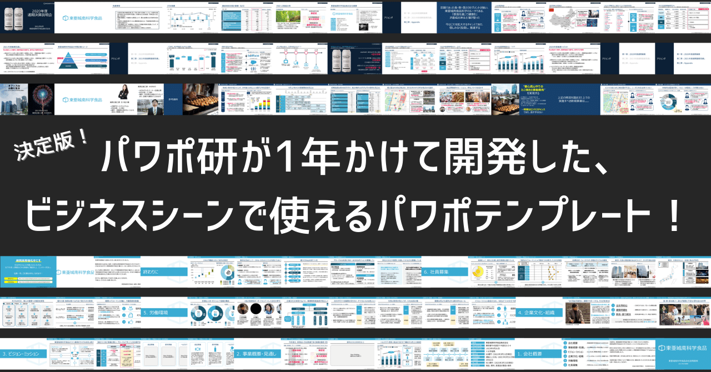

# 【パワポの疑問は全て解決！】パワポメディア9選

[note原文](https://note.com/powerpoint_jp/n/n1559e74d37a8)

みなさんこんにちは。
資料デザインのリサーチや分析に取り組むパワーポイントのスペシャリスト、パワポ研です。

「見やすいプレゼン資料を作りたい」「定期的にパワーポイントの情報を吸収したい」「困ったときに調べ方がわからない」などパワーポイントにまつまるお悩みはつきません。そんな時に何かしらのきっかけを与えてくれるのが**「パワポメディア」**です。

今回はパワポ研として「パワポメディア」についてリサーチを実施し、**9社をピックアップしましたので、紹介していきたい**と思います。私たちもtwitterとnoteを中心にパワーポイントに関する情報を発信していますが、参考になるメディアがまだまだたくさんございます。ぜひご参照下さい。

> ※なお、冒頭の数字はランキングではなく、業者の優劣には関係がないことをご承知おきください。
> ※また、本情報はあくまでweb上での検索結果であり、実際のクオリティを保証するものではないことを御留意願います。

## １．PowerPoint Design

 
[
**
プレゼンデザイン
**

プレゼン資料を伝わりやすく・すばやく作成するためのデザインノウハウを学ぶ情報サイト

ppt.design4u.jp

](https://ppt.design4u.jp/)

 
ウェブサイトのデザインが非常にきれいで、記事の質、量ともに豊富なメディアです。**「画像やアイコンの使い方」のような、細かいポイントですが知っておくと資料の完成度がグッとあがる記事が掲載**されています。色の変更が可能なテンプレートの配布（無料）やセミナーも実施しており、提案書、企画書を作る上で、総合的に役立つサイトです。

> URL：[> https://ppt.design4u.jp/](https://ppt.design4u.jp/)

## ２．伝わるデザイン

 
[
**
伝わるデザイン｜研究発表のユニバーサルデザイン
**

情報の伝わりやすさは「資料の作り方」に大きく左右されます。本ページでは、プレゼン資料などを作るためのデザインルールやテクニ

tsutawarudesign.com

](https://tsutawarudesign.com/)

 
『伝わるデザインの基本』や『プレゼン資料作成見るだけノート』などの書籍を出版する実績のある千葉大学理学大学院の2名が制作しているページです。**基本から忠実に、見やすいプレゼン資料をつくるためのノウハウが列挙**されています。WEBページのデザインも相当に見やすいものとなっており、パワーポイントの勉強を始めたけど、**何から手を付けたら良いか迷っている方にオススメ**です。

> URL：[> https://tsutawarudesign.com/](https://tsutawarudesign.com/)

## ３．PPTDP

 
[
**
PPDTP
**

PowerPointの神業ブログ

ppdtp.com

](https://ppdtp.com/)

 
PPDTPは、PowerPointの革命的な作成テクニックのご紹介やスキルアップをお手伝いするAIアシスタントという設定になっております。「PowerPointで桜の花びらを作り五角形状に並べる方法」など**ニッチな活用方法が中心**になっていますが、どのボタンを押して進めるのかという、一連の流れが詳細に、記載されており、**もう一工夫したいが、アイデアが浮かんでこないユーザーにはオススメ**です。

> URL：[> https://ppdtp.com/](https://ppdtp.com/)

## ４．Office Hack

 
[
**
Microsoft Officeの使い方を学べるサイト｜Office Hack（オフィスハック）
**

Office Hackはオフィスユーザーのための教科書です。操作方法をソフト別に最低限必要な基礎から応用技術まで丁寧に解説

office-hack.com

](https://office-hack.com/)

 
名前の通りではありますが、**Officeの製品（Excel、Word、PowerPoint、Outlook等）の解説がまとめられているWEBサイト**です。原則は閲覧数ランキング形式で「パワーポイントのスライド番号（ページ番号）の設定方法」のような基礎的な内容が記載されています。PowerPointだけで見ると、そこまで**記事数も多くないので、ランキング順に目を通してみても良い**かもしれません。

> URL：[> https://office-hack.com/](https://office-hack.com/)

## ５．bagie

 
[
**
ベイジの図書館
**

株式会社ベイジのマーケターやデザイナ、エンジニアがお届けする、マーケティング、デザイン、テクノロジー、組織作り、キャリアに

baigie.me

](https://baigie.me/officialblog/)

 
**BtoB企業のためのWEB制作会社である株式会社ベイジが運営するWEBサイト**です。「パワポでやりがちな9の無駄な努力」のような現場で頻繁に生じる経験談や「知っておくと便利な思考フレームワーク×35」などビジネスパーソンが参考となる記事が列挙されています。WEBサイトも非常に見やすい構成となっており、**お気に入りしておいて損はない**と思います。代表の枌谷氏は、定期的にパワーポイント講座を実施されており、この講座では「実際の営業ではどのような観点で見やすいパワーポイントが作られているのか」を学ぶことができます。

> URL：[> https://baigie.me/officialblog/](https://baigie.me/officialblog/)

## ６．パワポでデザイン

 
[
**
パワポでデザイン
**

パワポでデザインでは、デザインとPowerPointの基本的な知識と考え方・作り方。デザイン制作に便利な操作方法などをご紹

power-point-design.com

](https://power-point-design.com/)

 
**「デザインの基本」「PowerPointの操作方法」「PowerPointで作るデザイン」の3部構成**となっており、「デザインの基本」では色相環の話のような、パワーポイント作成者として、知っておくべき要素が並んでおり、「PowerPointで作るデザイン」では、**世界地図のダウンロードが可能**となっている、独特なポジションを取るWEBサイトです。記事数は多くありませんが、刺さる人には刺さるサイトだといえます。

> URL：[> https://power-point-design.com/](https://power-point-design.com/)

## ７．The Power of  PowerPoint

 
[
**
The Power of PowerPoint | 誰でも、見やすく美しいパワーポイントデザインを
**

パワーポイントを使いこなして、見やすく美しい、高品質なスライド作成を目指すためのサイトです。基本的な使い方から、デザイン、

thepopp.com

](https://thepopp.com/)

 
「パワーポイントで失敗しないための図形の使い方と心構え」といった記事が掲載されているWEBサイトです。無料にてテンプレートとフォントの販売を行っていることもあり、**記事の内容は、図形の使い方やフォントの見せ方に関する記事が多くなっています。記事にタグがつけられているので、検索性が高いことも特徴**です。名前の通り、力強い雰囲気のサイトであり、サイトのデザイン自体も参考になるので、一度訪れてみてはいかがでしょうか。

> URL：[> https://thepopp.com/](https://thepopp.com/)

## ８．パワポ師の仕事術

 
[
**
ホリ@パワポ師｜note
**

想いに価値を付ける「資料術」を発信中。資料作成だけでなくアイデア出し/思考整理/動画もパワポでやるパワポ好き！過程を楽しめ

note.com

](https://note.com/present_create)

 
「思考術 × 資料作成 × 資料デザイン」を掲げるnoteでのパワポメディアです。noteの記事となるため、テキストベースでの記事が中心となっています。**有料記事もありますが、パワーポイントの基礎的な内容から、Twitterでの成功事例など幅広く記載されていることが特徴**です。

> URL：[> https://note.com/present_create](https://note.com/present_create)

## ９．Are you designer

 
[
**
Top | ビズデザビズデザ
**

社会人のための資料デザインメディア

www.tridge.work

](https://www.tridge.work/)

 
「サラリーマンはデザイナーではありません。でも、サラリーマンにデザイン力は必須です。」というキャッチコピーからもわかるように、プレゼンに主眼が置かれており、ビジネスパーソンが参考となる記事が並んでいます。神楽くんとトリジ先生の**会話形式での記事**となっているため、初心者の方でも読みやすくなっています。**ExcelやWordについての内容も扱っており、一通り目を通すだけで、ビジネスパーソンとしてのスキルが上がることは間違いなし**です。

> URL：[> https://www.tridge.work/](https://www.tridge.work/)

## まとめ

いかがでしたでしょうか。今回はパワポメディアを紹介させていただきました。困った際にメディア内で何か検索するというよりは、**空き時間に目を通し正しいイメージをインプットすることで、使えるテクニックを増やす**という使い方が望ましいかもしれません。気に入ったメディアがあれば、ブックマークしておき、いつでも閲覧できる状態にしておくことをオススメします。

## パワポ研オリジナルテンプレート

パワポ研では**「ビジネスシーンで使える」パワーポイントテンプレート**を公開しております。デザインを整えるのみならず、**ロジックやストーリーを整理する**のにも役立つパッケージになっておりますので、関心のある方は下記ページも併せてご覧ください！

## パワポ研からのお知らせ

上記の記事のように、**noteではフォローしているだけでビジネスにおける「資料作成のコツ」と「デザインのセンス」が身に付くアカウント**を目指して情報配信を行っています。

今後もコンスタントに記事を配信していく予定なので、関心のある方は是非アカウントのフォローをお願いします！

**> Template販売**
[> https://powerpointjp.stores.jp/](https://powerpointjp.stores.jp/)
**> 書籍**
[> 注目企業の実例から学ぶパワポ作成術](https://www.amazon.co.jp/dp/4046060476)
**> note**
[> パワポ研の資料作成術](https://note.com/powerpoint_jp/m/mc291407396da)
**> X（旧Twitter)**
[> https://twitter.com/powerpoint_jp](https://twitter.com/powerpoint_jp)
**> お問い合わせはこちら**
[> お問い合わせフォーム](https://www.rex-adv.co.jp/contact)

