# 【マネしたい】パワポの「アップセル」「クロスセル」戦略のスライド９選

[note原文](https://note.com/powerpoint_jp/n/n16f270481c80)

みなさんこんにちは。
資料デザインのリサーチや分析に取り組むパワーポイントのスペシャリスト、パワポ研です。

今回は、**パワポの「アップセル」「クロスセル」戦略のスライドに焦点を当て、上場企業のIR資料からおしゃれなスライドを紹介**していきます。

アップセルもクロスセルも、マーケティング戦略における施策の一つです。収益向上につながりやすいことから、IR資料などでもアップセルやクロスセルの施策や成功事例がよく取り上げられます。パワポ研ではグラフのフォーマットなどのほかに、こうしたマーケティング戦略で使われるスライドなども紹介しています。

アップセルやクロスセルと言われてもなじみの無い方もいると思うので、まずはアップセルやクロスセルとは何か？からおさらいしていきましょう。
では早速行きます！

## 「アップセル」「クロスセル」とは

まず最初に、アップセルとは何か、クロスセルとは何か、おさらいをしておきましょう。**アップセルもクロスセルもマーケティング戦略の用語になりますが、一言でいうと顧客あたり売上を増加させるための営業施策**を意味します。
新規の顧客開拓には一定のコストや労力がかかる中で、既存顧客の売上を伸ばす方が効率よく売上を拡大できることから、アップセルやクロスセルの施策の議論がされるわけです。

### アップセルとクロスセルの違い

アップセルとクロスセルは似た響きであるものの、マーケティング戦略の中の、顧客単価を上げるための営業施策であるという点を除くと、全く異なる概念となります。アップセルとクロスセルは一般には以下のような意味で使われます。

- **アップセル施策の意味：顧客に対して、現在のサービスよりも上位のサービスを提案し、切り替えてもらうことを通じて、顧客単価を上げる施策。他部門への展開など社内での利用拡大もアップセルに含まれる**

- **クロスセル施策の意味：顧客に対して、異なるサービスを追加で提案し、追加発注してもらうことを通じて、顧客単価を上げる施策**

いずれも顧客のニーズを深く理解するのですが、ニーズに対してより高度あるいは広範なサービスを提案するのがアップセル、異なるサービスを提案するのがクロスセルというのが、アップセルとクロスセルの違いですね。

## アップセルとクロスセルの事例スライド４選

まずはアップセルやクロスセルの成功事例を紹介しているパワポスライドから見ていきましょう。アップセルやクロスセルの成功事例を見せることで、読み手が営業施策をリアルにイメージできるようになることに加えて、マーケティング戦略が上手くいっていることを見せられます。

### アップセルとクロスセルの成功事例

まずは株式会社Faber Companyのパワポにおけるアップセルとクロスセルの成功事例スライドを見ていきましょう。
2025年9月期 通期決算説明資料のパワーポイントにある、「ビジネスモデルの展開事例（抜粋）」のスライドです。

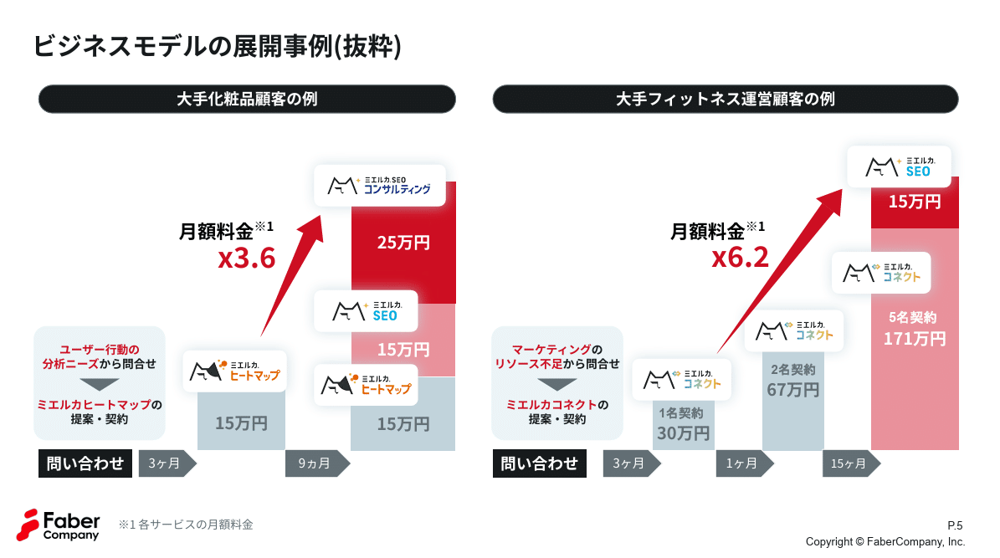
*株式会社Faber Companyのアップセルとクロスセルの成功事例スライド*

> 引用元：[> 2025年9月期 通期決算説明資料](https://ssl4.eir-parts.net/doc/220A/tdnet/2717268/00.pdf)

*https://www.fabercompany.co.jp/ir/library/summary/*

パワポの「アップセル」「クロスセル」の成功事例スライドにおける特徴は、**クロスセルとアップセルの成功事例を横並びにしている点**が挙げられます。スライド左側ではクロスセルの成功事例、スライド右側ではアップセルとクロスセルの成功事例を紹介しています。

棒グラフを使ってクロスセルやアップセルの成功事例の紹介をしていますが、サービスのロゴを使うことでクロスセル七日アップセルなのかわかりやすくしているほか、月額料金の伸びを倍率で示している点も効果的です。

### アップセル営業と施策イメージの事例

続いて株式会社unerryのパワポにおけるクロスセルとアップセルの成功事例スライドです。
2025年６月期通期 決算説明資料のパワーポイントにある、「ビジネスモデル：リカーリング顧客の顧客単価が１３０倍以上となる例も」のスライドです。

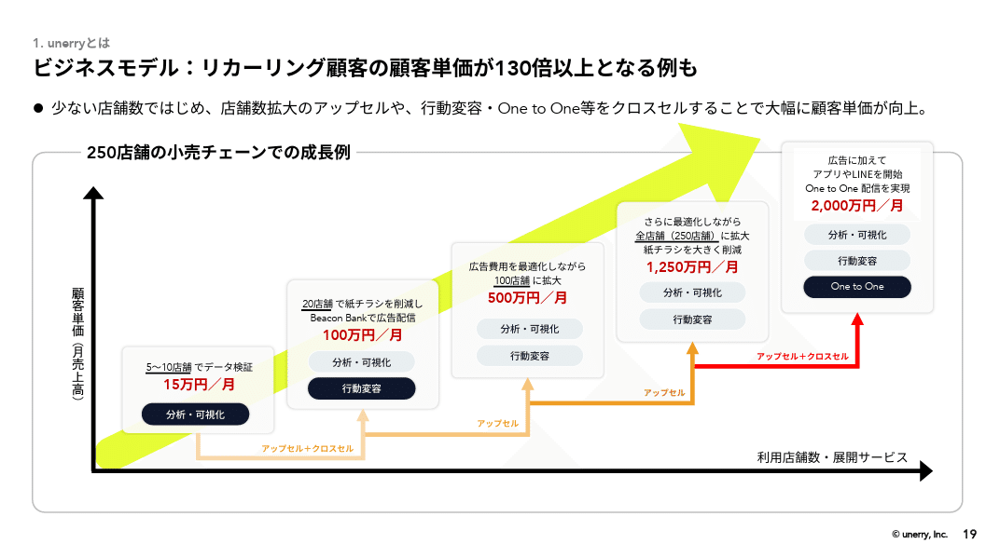
*株式会社unerryのアップセルとクロスセルの成功事例スライド*

> 引用元：[> 2025年６月期通期 決算説明資料](https://contents.xj-storage.jp/xcontents/AS82460/42cb224e/d3dc/493d/aced/dd7acff9c7b3/140120250812539357.pdf)

*https://www.unerry.co.jp/ir/news/*

パワポの「アップセル」「クロスセル」の成功事例スライドにおける特徴は、**矢印を使ってクロスセルやアップセルの成功事例を視覚的に見せている点**が挙げられます。利用店舗の拡大によるアップセルを下線で、利用サービスの拡大によるクロスセルをタグで表現し、ステップ間を矢印でつないでいます。

金額や提供サービスを５段階でわかりやすく示すことで、どのような戦略でアップセルやクロスセルを成功させるのか、視覚的にわかるようになっております。各矢印にアップセルなのかクロスセルなのか示してくれることで、提案の流れもわかるようになっており、良い資料です。

### クロスセルの販売施策の成功事例

続いて株式会社プレイドのパワポにおけるクロスセルの成功事例スライドを見ていきましょう。
事業計画及び成長可能性に関する説明資料のパワーポイントにある、「エンタープライズ企業との取引規模拡大事例_金融A社」のスライドです。

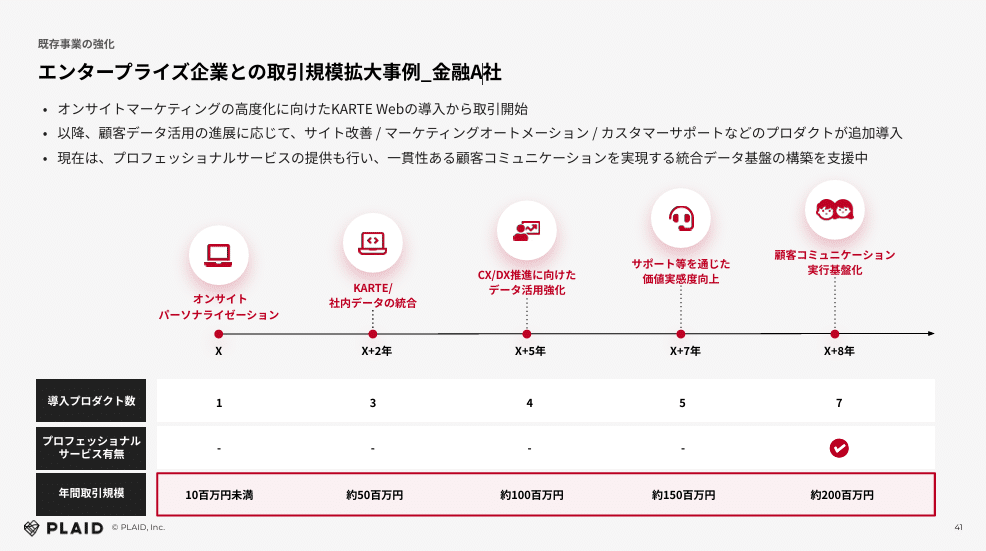
*株式会社プレイドのクロスセルの成功事例スライド*

> 引用元：[> 事業計画及び成長可能性に関する説明資料](https://pdf.irpocket.com/C4165/PDLX/Da1l/ANI7.pdf)

*https://plaid.co.jp/ir/news/*

パワポの「クロスセル」の成功事例スライドにおける特徴は、**表形式でクロスセルの提案内容をまとめている点**が挙げられます。導入プロダクト数、プロフェッショナルサービスの有無、年間取引規模の３つの項目で、初年度から９年目までのクロスセルの成功状況を記載しています。

クロスセル施策の成功状況を表形式でまとめており見やすいのですが、やはり棒グラフと比べると「伸びている感」は薄れます。そこでアイコンの位置を少しずつ上にもっていき、右肩上がり感を演出するという工夫をしています。

### 提案商材がわかるクロスセルの成功事例

次にGLOE株式会社のパワポにおける「パーチェスファネル」図の具体例を見ます。
2025年10月期 決算説明資料のパワーポイントにある、既存のゲームユーザーのエンゲージメントを高めるマーケティングのスライドです。

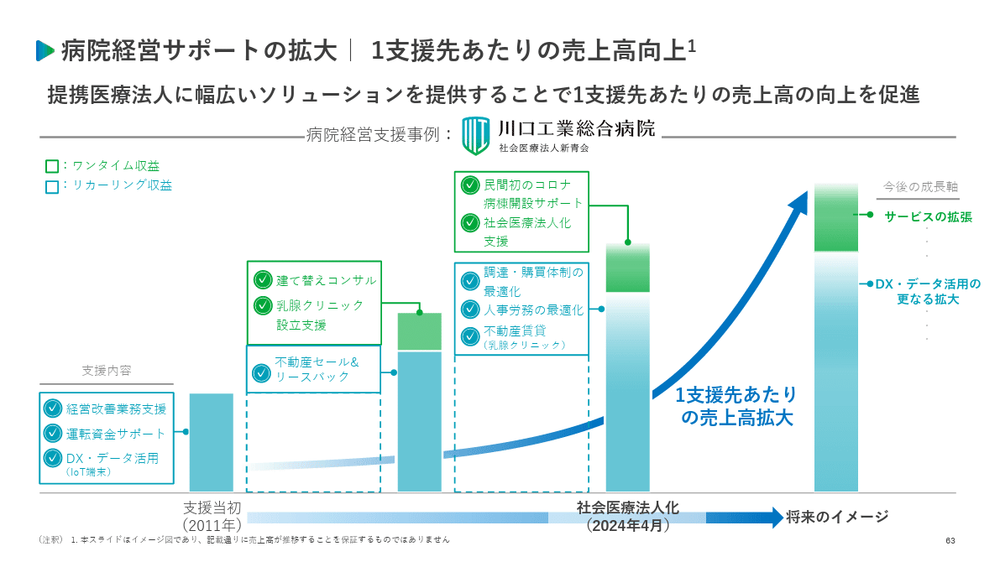
*株式会社ユカリアのクロスセルの成功事例スライド*

> 引用元：[> 2025年12月期 通期決算説明資料_事業計画及び成長可能性資料](https://contents.xj-storage.jp/xcontents/AS96593/bf10b1cf/3f1e/40a7/8da3/cb876291c65c/140120260213560495.pdf)

*https://eucalia.jp/ir/news/*

パワポの「クロスセル」の成功事例スライドにおける特徴は、**棒グラフに合わせて具体的な提案商材が記載されている点**が挙げられます。支援スタートから、不動産セール＆リースバックや建て替えコンサル、クリニック独立支援など、具体的にクロスセル商材をどのような流れで提案して、採用されていったかが詳細にわかります。

また下に、支援当初、社会利用法人化、将来などとフェーズを記載することで、どのタイミングでどのクロスセル商材が入っていくのか等もイメージしやすいです。クロスセル商材が棒グラフの上に積みあがっていくようなビジュアルもよいですね。

## アップセルとクロスセル戦略のスライド５選

続いて、アップセルやクロスセルの戦略についてまとめているパワポスライドの例を見ていきましょう。実際の営業戦略の中で、アップセルやクロスセルをどのように施策に落とし込むのか、まとめているスライドです。
実際のアップセルやクロスセル戦略が具体にイメージできるようになると、成長性への期待も高まりますよね。

### クロスセルの営業戦略イメージの事例

まずは、株式会社GA Technologiesのパワポにおけるクロスセル戦略のスライドから見ていきましょう。
事業計画及び成長可能性に関する事項のパワーポイントにある、「マネタイズポイント」のスライドになります。

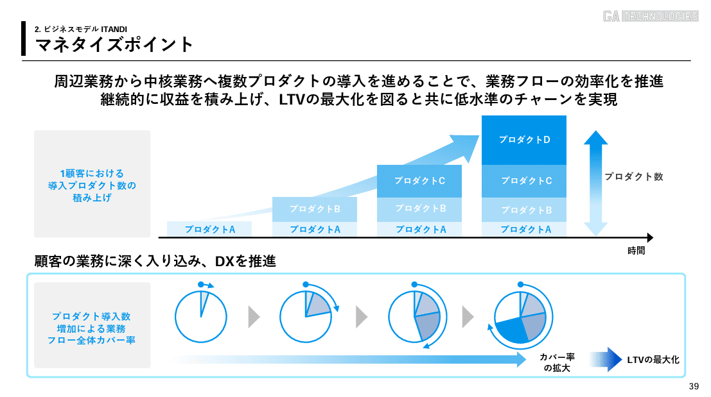
*株式会社GA Technologiesのクロスセル戦略のスライド*

> 引用元：[> 事業計画及び成長可能性に関する事項](https://ssl4.eir-parts.net/doc/3491/tdnet/2736686/00.pdf)

*https://www.ga-tech.co.jp/ir/news/*

パワポの「クロスセル」戦略のスライドにおける特徴は、**棒グラフと円グラフの組み合わせでクロスセルの営業戦略のイメージを説明している点**が挙げられます。プロダクトが積みあがるごとに、顧客の業務フロー全体のカバー率が上がっていきLTVが最大化されるという営業戦略をわかりやすく示しています。

棒グラフでも説明はできるものの、円グラフを使うことで、顧客のウォレットシェアをクロスセルによって高めていくことがよりビジュアルで伝わるので、一層わかりやすくなっています。

### クロスセル提案のイメージイラストの事例

続いて株式会社 L is Bのパワポにおけるクロスセルやアップセル戦略のスライドを見ていきましょう。
2025年 12月期 通期 決算説明資料のパワーポイントにある、利用顧客の利用拡大についてのスライドです。

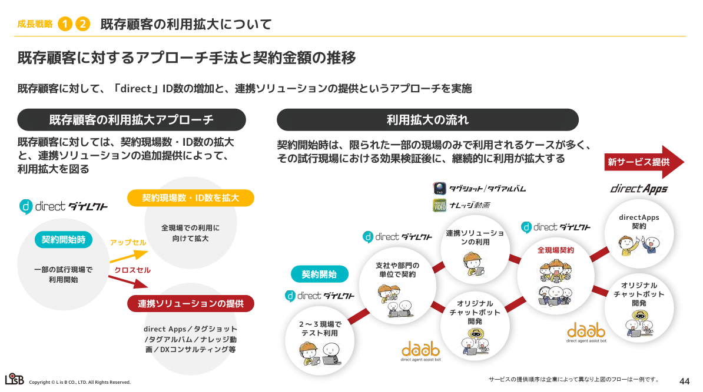
*株式会社 L is Bのクロスセルとアップセル戦略のスライド*

> 引用元：[> 2025年 12月期 通期 決算説明資料](https://contents.xj-storage.jp/xcontents/AS05193/a9de1925/8296/41a0/bdea/28ec0c314a97/140120260213560775.pdf)

*https://l-is-b.com/ja/ir/ir_news/*

パワポの「クロスセル」提案戦略のスライドにおける特徴として、**イラストを使ってクロスセル提案のイメージが伝わる様**にしています。まずダイレクトのID増加によってアップセルをしつつ、連携ソリューションを提供してクロスセルをする、それによって利便性が上がってID数が増加する、という生のループをイラストで見せていますね。

左側で大きなアップセルとクロスセルの提案の流れを見せた上で、右側でそれが重層的に積み重なっていくことを見せるデザインで、非常にわかりやすいです。

### 顧客の戦略に合わせたクロスセルの事例

続いて株式会社ジグザグのパワポにおけるクロスセル戦略のスライドです。
事業計画及び成長可能性に関する事項のパワーポイントにある、「ショップ売上高のグロース」のスライドを見ていきましょう。

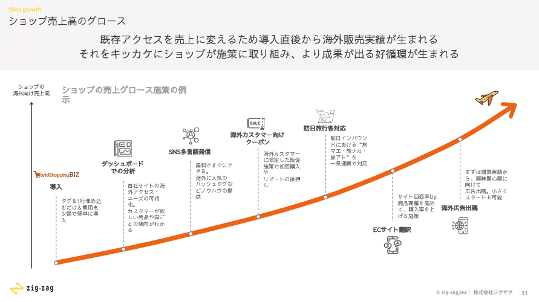
*株式会社ジグザグのクロスセル戦略のスライド*

> 引用元：[> 事業計画及び成長可能性に関する事項](https://ssl4.eir-parts.net/doc/340A/ir_material_for_fiscal_ym/182957/00.pdf)

*https://ir.zig-zag.co.jp/news/*

パワポの「クロスセル」戦略のスライドにおける特徴として、**顧客の成長に合わせたグロース施策の流れでクロスセル施策を整理している点**が挙げられます。カートの導入をスタート地点として、ダッシュボードでの分析、多言語発進、海外カスタマー向けクーポン、訪日旅行客対応、ECサイト翻訳、海外広告出稿と、クロスセル商材が並びます。

顧客の成長とともにクロスセル商材を提案していくことで、一緒に成長していけることが一目でわかるデザインで、とても良いですね。飛行機のイラストで急成長を示しているのも面白いです。

### アップセル戦略のイメージイラストの事例

次に株式会社ハッチ・ワークのパワポにおけるアップセル戦略のスライドを見てみましょう。
事業計画及び成長可能性に関する説明資料のパワーポイントにある、ビジネスモデル(8/8)：滞納保証台数・保証料の積み上げイメージのスライドです。

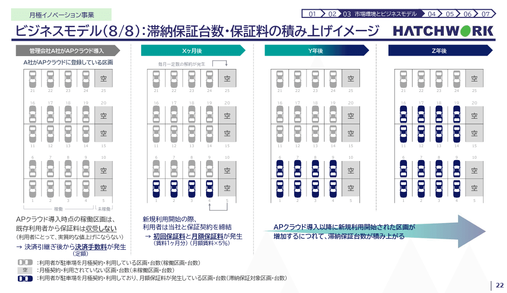
*株式会社ハッチ・ワークのアップセル戦略のスライド*

> 引用元：[> 事業計画及び成長可能性に関する説明資料](https://contents.xj-storage.jp/xcontents/AS08743/678539a6/8779/461b/a41d/5561cef8965c/140120260326589451.pdf)

*https://hatchwork.co.jp/ir*

パワポの「アップセル」戦略のスライドにおける特徴として、**アップセル施策の仕組みをイラストで見せている点**が挙げられます。新規に月極駐車場を利用開始する利用者にデフォルトで滞納保証サービスがついていくという仕組みが、イラストによって一目でわかるように整理されています。

イラストの中でも、非利用者が灰色、利用者が青色で、青色が徐々に広がっていくデザインも、自然とアップセルが実現されるという戦略をうまく表していてよいですね。

### クロスセル戦略と提案施策の事例

最後は株式会社ミライロのパワポにおけるクロスセル戦略のスライドを見ていきましょう。
事業計画及び成長可能性に関する事項のパワーポイントにある、「ステージ別の顧客イメージとミライロIDソリューションの成長ポテンシャル」のスライドです。

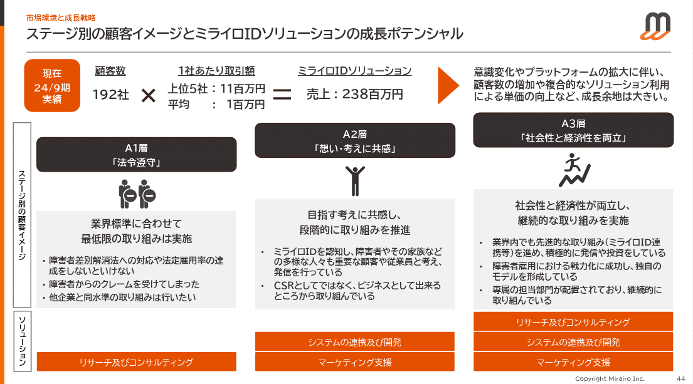
*株式会社ミライロのクロスセル戦略のスライド*

> 引用元：[> 事業計画及び成長可能性に関する事項](https://ssl4.eir-parts.net/doc/335A/tdnet/2583569/00.pdf)

*https://www.mirairo.co.jp/ir/news*

パワポの「クロスセル」戦略のスライドにおける特徴として、**顧客の意識の変化のイメージとクロスセル商材をリンクさせている点**が挙げられます。顧客のイメージを、「法令順守」「想い・考えに共感」「社会性と経済性を両立」の３ステップに分け、それぞれのタイミングでのソリューションを記載しています。

顧客の意識の進化を階段状にしていることに加え、クロスセル商材も１個、２個、３個と積みあがっていくデザインにしており、コンセプトが伝わりやすいです。

## 【マネしたい】パワポの「アップセル」「クロスセル」戦略のスライド９選まとめ

以上、アップセルやクロスセルに関する様々なスライドを見てきました。アップセルやクロスセルについては、成功事例で語るパターンと、より戦略的に語るパターンがあることが伝わったのではないかと思います。いずれにせよ、アップセルやクロスセルが成功していることが伝わる様に、戦略や営業施策レベルで理解が深まる様なスライドにすることが重要です。

ちなみに**パワポ研で提供しているテンプレート集には、以下のような「アップセル」「クロスセル」のスライドに使えるテンプレートもあります**ので、気になる方は下で紹介しているオリジナルテンプレートのNoteも見てみてくださいね。

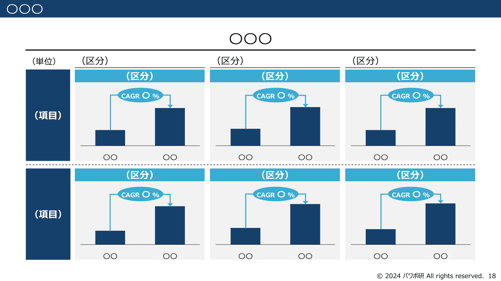
*パワポ研オリジナルテンプレートの差分を見せるスライド*

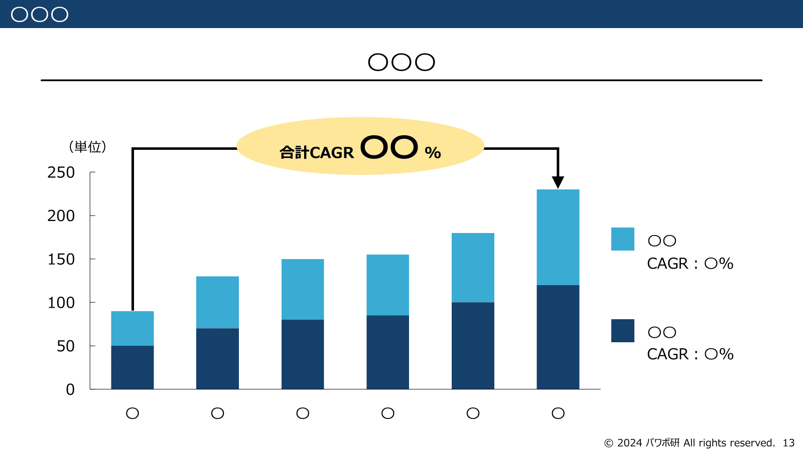
*パワポ研オリジナルテンプレートの成長推移を見せるスライド*

## パワポ研オリジナルテンプレート

パワポ研では「ビジネスシーンで使える」パワーポイントテンプレートを公開しております。デザインを整えるのみならず、**ロジックやストーリーを整理するのにも役立つパッケージ**になっておりますので、関心のある方は下記ページも併せてご覧ください！

上記の記事のように、noteでは**フォローしているだけでビジネスにおける「資料作成のコツ」と「デザインのセンス」が身に付くアカウント**を目指して情報配信を行っています。
今後もコンスタントに記事を配信していく予定なので、関心のある方は是非アカウントのフォローをお願いします！

**> Template販売　**[> https://powerpointjp.stores.jp/](https://powerpointjp.stores.jp/%EF%BF%BCnote)
**> note　**[> パワポ研の資料作成術](https://note.com/powerpoint_jp/m/mc291407396da)
**> X（旧Twitter)　**[> https://twitter.com/powerpoint_jp](https://twitter.com/powerpoint_jp)

## レックスアドバイザーズからのお知らせ

パワポ研は株式会社レックスアドバイザーズが運営しています。
レックスアドバイザーズは**経営企画職や経営管理職に特化した転職エージェント**です。
上場企業や上場準備企業を中心に、**経営企画、IR、経理財務、法務、内部監査等の職種の求人**をご紹介しているほか、**CFOなどのコンフィデンシャル求人**もご紹介可能です。
またコンサルティングファームや監査法人、会計事務所の求人も豊富にあるため、プロフェッショナルファームを目指す方のご支援も得意です。
求人紹介やキャリア相談を希望の方は、[**無料転職サポート**](https://www.career-adv.jp/job_search/entryform_exp/)よりサービス利用登録をしてみてください。

*レックスアドバイザーズのサービスサイトはこちら*

**> 求人をご希望の方　**[> 無料転職サポート](https://www.career-adv.jp/job_search/entryform_exp/)**
> 採用支援をご希望の方　**[> 採用サポート](https://www.career-adv.jp/request3/)
**> その他　**[> お問い合わせフォーム](https://www.rex-adv.co.jp/contact)
**> 書籍　**[> 注目企業の実例から学ぶパワポ作成術](https://www.amazon.co.jp/dp/4046060476)

