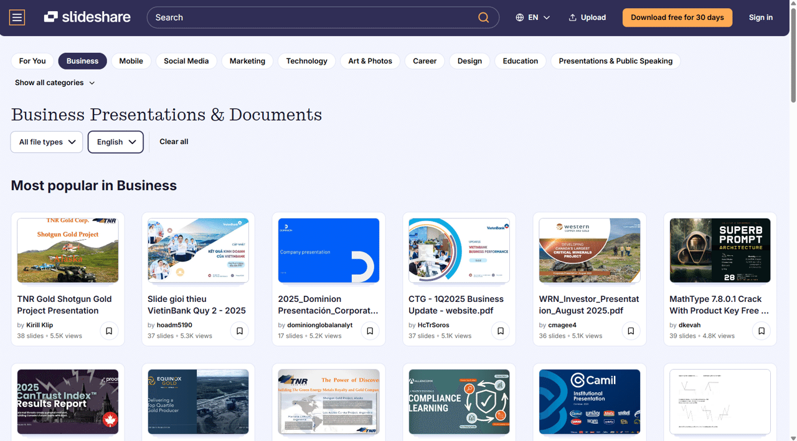
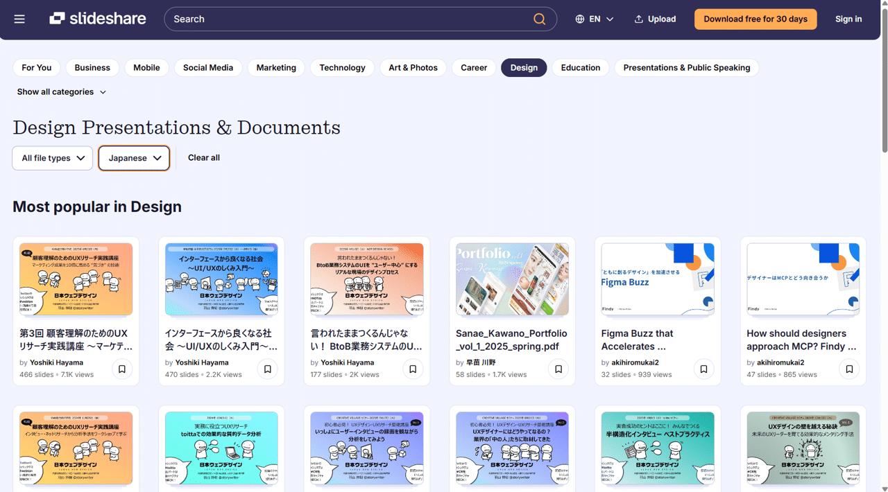
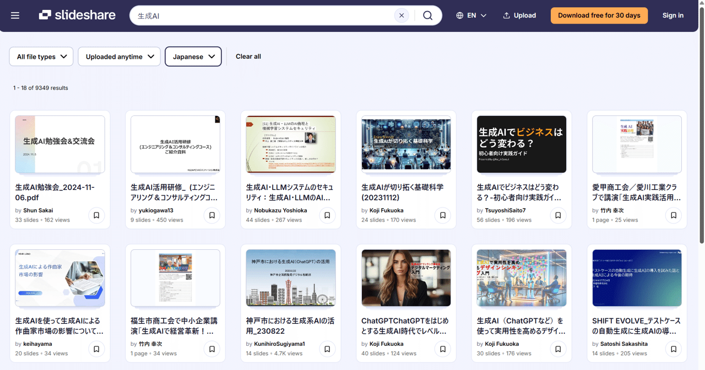
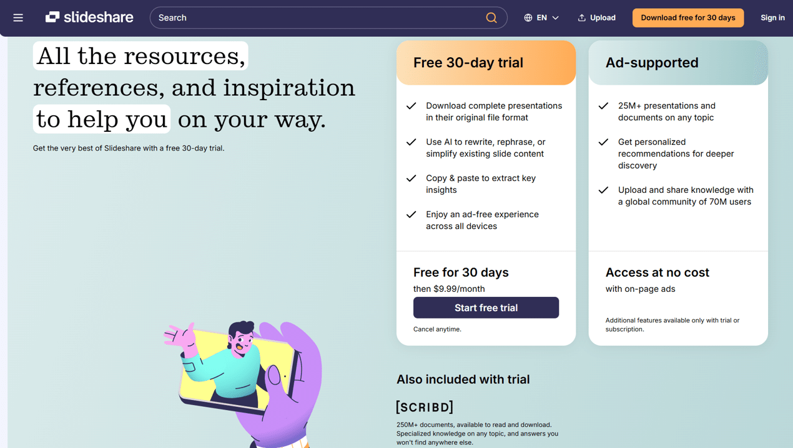
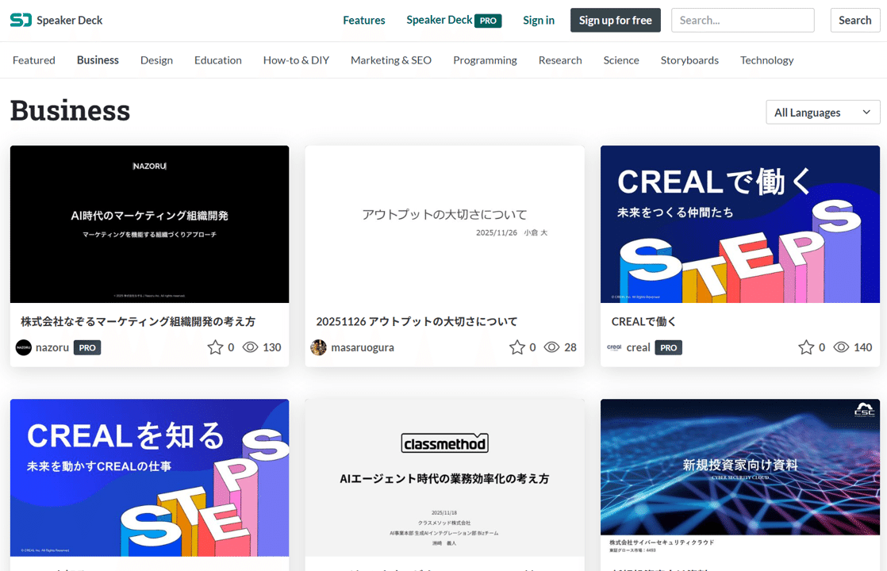
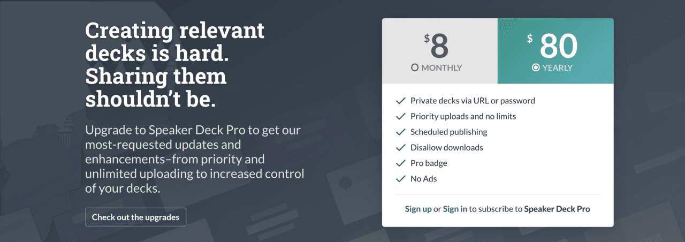
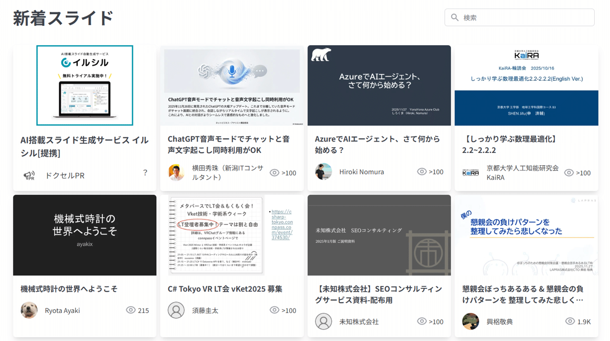
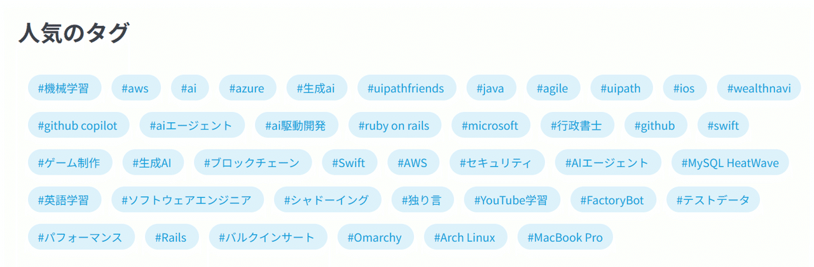
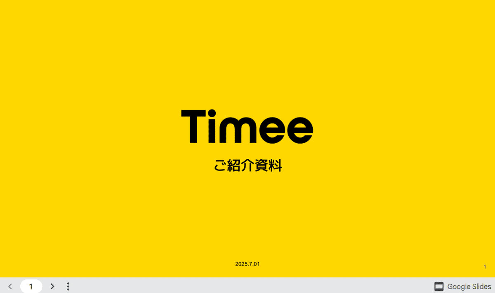

# 【知っておきたい】スライド共有サービス３選の特徴と違い

[note原文](https://note.com/powerpoint_jp/n/n19840a713886)

みなさんこんにちは。
資料デザインのリサーチや分析に取り組むパワーポイントのスペシャリスト、パワポ研です。

今回は、パワーポイントのスライド共有サービスをテーマに、主要なサービスの機能や特徴を紹介していきます。
スライド共有サービスとは、読んで字の如く、**パワポのスライドをオンラインにアップロードしてシェアするサービス**ですが、特定の誰かに共有するという目的だけで利用している人はそれほど多くないと思われます。共有以外のサービスの利用動機としては以下の二つが考えられます。

**①スライドのデザイン研究**
pinterestなどの、主にデザイナーが活用しているデザイン研究サイトだと、バナーやフライヤーのデザインが主流で、あまりパワーポイントのデザインは掲載されていません。そのためパワポ研でもしばしば、スライドに特化したサービスを利用し、パワポ形式のデザインの研究を行っています。

**②マーケティングやブランディング**
逆にプレゼンテーション資料をアップする側のメリットとして、「それなりに知名度のあるのあるスライド共有サービスを通じてに自社のパワーポイント資料を拡散できる」ことが挙げられます。
特に多いのが採用プレゼンテーション資料を共有するパターンで、公式な採用資料から、エンジニア向けのマニアックな資料まで、共有されるパワーポイント資料は様々です。

採用プレゼンテーション資料を公開しておくと、**パワーポイント資料のURLを友人が拡散してくれたり、知らない人が面白い資料として拡散してくれたりする**ので、より多くの人の目に留まります。

特にエンジニアは自分の気に入ったスライド資料をどんどん仲間内にシェアしていく習性があるため、エンジニアの採用競争が年々激化している現代において、**スライド共有サービスを通じたブランディングは非常に効果的**です。実際にスライド共有サービスを見てみると、エンジニア向けのパワーポイント資料が多数あることがわかります。

また採用以外の文脈でも、スライド共有サービスを通じて企業案内のパワポや会社実績のプレゼンテーション資料を公開しておくことは有効です。
こちらもSNS上のシェアなどを通じて、ふとしたきっけで外部の人が会社や商品を知り、それが**商談に繋がる可能性**があるからです。質の高いパワポであれば、それがテンプレート的な形で広く流布され、結果的に**会社のブランディングになるということ**もあります。

前段が少し長くなりましたが、さっそく各スライド共有サービスを見ていきましょう。

## SlideShare

 
[
**
Slideshare.net
**

Discover, Share, and Present presentations and infographics w

www.slideshare.net

](https://www.slideshare.net/)

 
2006年にサービスが開始されてから、**2025年現在で2,500万点以上のプレゼンテーション資料がアップロードされている**世界最大級のスライド共有サービスです。訪問者数は非公開となっていますが、親会社のscribedのサービス全体では、月間2億人のユニークユーザーがいるようです。

以前はビジネスマン向けのSNSサービスを運営している「LinkedIn」が運営していたのですが、2020年9月に書籍や音楽などのサブスクリプションサービスを運営する「Scribd」が買収しました。

サイトの構成は非常に単純で、**SlideShareが設定したカテゴリーを選ぶと、そのカテゴリーに投稿されたスライド一覧ページにアクセス**することができます。また、それぞれのスライドには閲覧数が表示されているため、そのスライドが世界中でどの程度見られているかを確認することができます。

カテゴリーページでは、さらにドキュメントタイプと言語を指定することができます。今回デザインを選択してみたところ、日本語のスライドも増えていました、４年前には日本語のスライドがほとんど存在しなかったことを考えると、Slideshareが日本でもポピュラーになってきていることがわかります。

以前は日本語の資料が少なかったため、**「明確に指定できる英語のキーワードがあり、その関連スライドを探す」**あるいは**「アクセス数の多いスライドから、デザインやストーリー作成のコツを学ぶ」**という使い方がおすすめでしたが、今は普通に日本語で検索することができます。

生成AIというワードで検索するとこんな感じですね。

また以前はなかった有料プランも整備されています。
月額9.99ドルの有料プランに加入することでscribed全体の有料サービスを使うことができます。SlideShareにおいても以下の様なメリットを享受することができますよ。

- オリジナルフォーマットのプレゼンテーション資料のダウンロード

- AIによるプレゼンテーション資料の校正

- キーインサイトのコピーアンドペースト

- すべてのデバイスで広告が非表示になる

## Speaker Deck

 
[
**
Share Presentations without the Mess
**

Speaker Deck is the best way to share presentations online. S

speakerdeck.com

](https://speakerdeck.com/)

 
機能的には、上記で解説したSlideShareとほぼ同じサービスです。文字検索もしくはカテゴリー検索でスライド一覧画面を表示させ、気になるスライドを探すという流れや、スライドの閲覧数が表示されるという部分は全く変わりません。

以前はSlideShareと異なる点として、日本語のスライドがかなりの割合で表示されることが挙げられました。特に設定などを行わなくても、**カテゴリーによっては８割以上日本語の資料**が表示されます。
この差が見られた大きな理由は、以前はSlideShare側に日本語の資料が少なかったためです。今となってはSlideShareにも日本語の資料が多く存在するので、この点も差分としては埋まってきたように思います。

Speaker Deckの有料プランは月額8ドルもしくは年額80ドルで設定されています。無料でも十分便利なのですが、有料プランに加入することで、以下の機能が追加で解放されます。

- スライドの非公開もしくはパスワード設定

- 無制限のアップロード

- アップロード日時の指定

- ダウンロード制限

- Proバッジの獲得

- 広告の非表示

相当なヘビーユーザーでない限り、Proプランへの課金は不要かと思いますが、従来の「シェアサービス」目的でフル活用したい方はProプランを検討してみても良いかもしれません。

## Docswell（ドクセル）

 
 
 

 
 
 
[
www.docswell.com
](https://www.docswell.com/)
 
 
> 引用元：[> 海外のスライド共有サービスがやる気ないので自分で作ってみた](https://qiita.com/ku_suke/items/7702c7b25aa31672a2bf)

*https://qiita.com/*

日本のエンジニアの方が、以下のようなモチベーションで開発したスライド共有サービスです（上記引用元より、原文ママ）。

- SlideShareが親会社をころころ変えるわりに中身が進化してなくてやる気ない

- SpeakerDeckが日本語のファイルをアップするとSlugを勝手に中国語読みにする

- なんか個人サービス作りたい

SlideShareとSpeaker Deckを意識して開発されているため、基本的な機能はほとんど変わりません。カテゴリーの設定がない代わりに、ユーザーが独自でつけたタグでソートするという形になっております。

2021年にローンチされた当時は、開発者のコメント通り日本語向けのサービスが充実しておりませんでしたが、2025年現在はそれなりに充実してきているため、やや劣勢な印象を受けます。

## SlideShare vs Speaker Deck

今回はプラットフォームにアップロードされているスライドの特徴をメインについて解説してきましたが、実際のところどちらの方が便利なのか、いくつかの観点で見てみましょう。

実際にアップロードする際の手順や機能がSlideShareとSpeaker Deckでは微妙に異なります。これらの比較については、丁寧に解説している記事があったため、そちらをご参照ください。

 
[
**
それでも SlideShare を使う理由 - てくなべ (tekunabe)
**

■ はじめに 私は普段、発表資料を SlideShare へアップロードしています。 www.slideshare.net

tekunabe.hatenablog.jp

](https://tekunabe.hatenablog.jp/entry/2018/08/05/slideshare)

 

## スライド共有サービスの利用状況

最後に、国内の大手ベンチャー企業がどのスライド共有サービスを使ってプレゼンテーション資料を共有しているのか、10社ほどの事例を見てみました。ざっくりメガベンチャーやユニコーンというワードで引っかかる企業のうち、スライド共有サービスを使ってパワーポイント資料を共有している企業を選んでいます。

**メルカリ**

  **エムスリー**

  **サイバーエージェント**

  **グリー**

  **ミクシィ**

  **マネーフォワード**

  **freee**

  **Preferred Networks**

  **SmartHR**

  **DeNA**

 
 
 

 
 
 
[
www.docswell.com
](https://www.docswell.com/)
 
 
上場非上場含む有名ベンチャー10社のうち9社がSpeaker Deckを利用しているという結論でした。DeNAだけがドクセルを使ってプレゼンテーション資料を共有しており、SlideShareを使っている会社はなんと0でした。
もちろん全くのゼロということはないと思いますが、SlideShareにはビュー順に資料を並べるといった機能がなく、社名で検索してパワーポイント資料の有無を確認することしかできないため、今回は探索を断念しました。

## グーグルスライドという選択肢もある

ここまで、Slideshare、Speaker Deck、ドクセルという３つのスライド共有サービスを見てきましたが、実際これらのサイトで検索をかけてプレゼンテーション資料を見る方はほとんどおらず、シェアされたリンクなどを見て各スライドに到達する方が多いと思います。

そうなると、別にSpeaker Deckを使ってパワーポイント資料を共有する必要はなく、グーグルスライドを使ってページに埋め込むという手段も出てきます。

**タイミーの採用パワーポイント**

> 引用元：[> 会社説明資料](https://corp.timee.co.jp/special-recruit/)

*https://corp.timee.co.jp/special-recruit/*

とはいえ、依然としてグーグルスライドによる埋め込みではなく、Speaker Deckを使ってのプレゼンテーション資料の共有が多数を占めていますよね。そこにはいくつかの理由があると思います。

- Speaker Deckなどのスライド共有サービスの方がシェアしやすい

- パワーポイントの方が使いやすいのでグーグルスライドを使いたくない

Speaker Deckにせよドクセルにせよ、プレゼンテーション資料のページのURLをコピー＆ペーストすれば、そのままわパワーポイント資料の枠をページに埋め込めます。
そのため、こうした**Noteなどでの共有が抜群にしやすく、展開されやすい**わけですね。グーグルスライドはあくまでスライドなので、編集されないようにしたうえでかつ自由に共有できるようにするのが大変であり、実際上記のタイミーのページでも共有はできなくなっています。Speaker Deckやドクセルの場合、パワーポイント資料をPDFにしたうえで埋め込むので、編集される心配がないわけです。

もう一つ地味に聞いていると思われるのが、やはりみんなグーグルスライドよりパワーポイントの方が好き！ということです。元々パワーポイントがデフォルトだったため、**プレゼンテーション資料の作成をする方は、ショートカットなど含めパワーポイントの操作性に慣れて**います。そうなるとグーグルスライドを使うのがおっくうになり、結果としてパワーポイント資料を共有できるスライド共有サービスが選ばれているわけですね。

## 【知っておきたい】スライド共有サービス３選の特徴と違いのまとめ

いかがでしたでしょうか。
最近ではCanvaのような、ブラウザ上でテンプレートからスライドを作成できるデザインツールの注目も高まっていますが、採用プレゼンテーション資料をはじめとするパワーポイントの資料については、依然としてスライド共有サービスを利用してシェアされています。
ビジネスで使われるプレゼンテーション資料については、インハウスのデザイナーが作ったテンプレートよりも、実際のユーザーが作ったスライドを見た方がより具体的なイメージが湧くことも事実なので、今後もすみわけが続いていくと考えられます。
また、スライドを公にすることがモチベーションにつながる場合もあります。本稿がそのようなポジティブな循環のきっかけになれば幸いです。

## パワポ研オリジナルテンプレート

パワポ研では、「ビジネスシーンで使える」パワーポイントテンプレートを公開しております。デザインを整えるのみならず、**ロジックやストーリーを整理するのにも役立つパッケージ**になっておりますので、関心のある方は下記ページも併せてご覧ください！

上記の記事のように、noteでは**フォローしているだけでビジネスにおける「資料作成のコツ」と「デザインのセンス」が身に付くアカウント**を目指して情報配信を行っています。
今後もコンスタントに記事を配信していく予定なので、関心のある方は是非アカウントのフォローをお願いします！

**> Template販売　**[> https://powerpointjp.stores.jp/](https://powerpointjp.stores.jp/%EF%BF%BCnote)
**> note　**[> パワポ研の資料作成術](https://note.com/powerpoint_jp/m/mc291407396da)
**> X（旧Twitter)　**[> https://twitter.com/powerpoint_jp](https://twitter.com/powerpoint_jp)

## レックスアドバイザーズからのお知らせ

パワポ研は株式会社レックスアドバイザーズが運営しています。
レックスアドバイザーズは**経営企画職や経営管理職に特化した転職エージェント**です。
上場企業や上場準備企業を中心に、**経営企画、IR、経理財務、法務、内部監査等の職種の求人**をご紹介しているほか、**CFOなどのコンフィデンシャル求人**もご紹介可能です。
またコンサルティングファームや監査法人、会計事務所の求人も豊富にあるため、プロフェッショナルファームを目指す方のご支援も得意です。
求人紹介やキャリア相談を希望の方は、[**無料転職サポート**](https://www.career-adv.jp/job_search/entryform_exp/)よりサービス利用登録をしてみてください。

*レックスアドバイザーズのサービスサイトはこちらから*

**> 求人をご希望の方　**[> 無料転職サポート](https://www.career-adv.jp/job_search/entryform_exp/)**
> 採用支援をご希望の方　**[> 採用サポート](https://www.career-adv.jp/request3/)
**> その他　**[> お問い合わせフォーム](https://www.rex-adv.co.jp/contact)
**> 書籍　**[> 注目企業の実例から学ぶパワポ作成術](https://www.amazon.co.jp/dp/4046060476)

