# 【BIG4のパワポ紹介】EYグループのプレゼン資料（2025年）

[note原文](https://note.com/powerpoint_jp/n/n1b5203d569ba)

みなさんこんにちは。
資料デザインのリサーチや分析に取り組むパワーポイントのスペシャリスト、パワポ研です。

このシリーズでは**BIG4のパワーポイント資料に焦点を当てて、デロイトトーマツ、PwC、KPMG、EYのパワポを紹介**していきます。
各グループとも、コンサルティングファーム、フィナンシャルアドバイザリーサービス（FAS）、監査法人、税理士法人を持っていますので、それぞれのファンクションのスライドを紹介していきますね。これまでに紹介したNoteは以下の通りです。

ラストはEYグループです！EYはフィナンシャルアドバイザリーサービスもストラテジーコンサルティングの中にあるため、３つの法人のパワーポイントを見ていきます。

- EYストラテジー・アンド・コンサルティング株式会社

- EY新日本有限責任監査法人

- EY税理士法人

資料はいつものように[経産省の委託調査報告書](https://www.meti.go.jp/topic/data/e90622aj.html)から引用しております。

EYの資料を見て学びたい方、EYグループに転職したい方など、ぜひ最後まで読んでいただければと思います！では早速行きましょう！

## EYストラテジー・アンド・コンサルティング株式会社の資料

まずはEYストラテジー・アンド・コンサルティングの調査報告資料を見ていきましょう。ここでは「令和５年度内外一体の経済成長戦略構築に係る国際経済調査事業（日本企業の南西アジア高度人材活用促進に係る能力可視化分析調査）調査実施報告書」のパワーポイントを見ていきます。

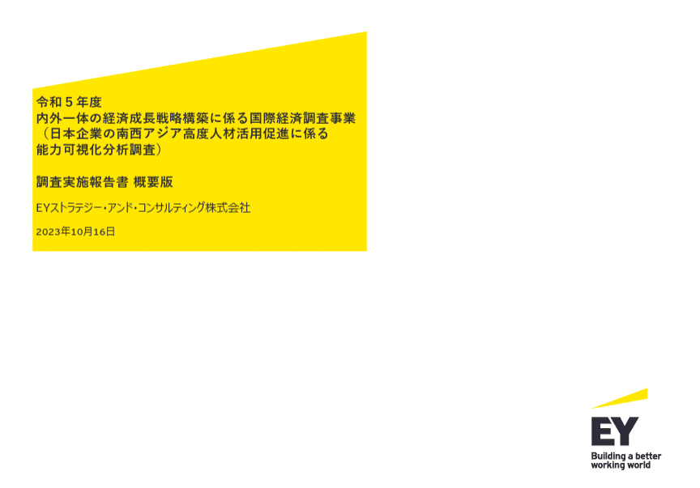
> 引用元：[> 令和５年度内外一体の経済成長戦略構築に係る国際経済調査事業（日本企業の南西アジア高度人材活用促進に係る能力可視化分析調査）調査実施報告書 概要版](https://www.meti.go.jp/meti_lib/report/2023FY/000800.pdf)

*https://www.meti.go.jp/meti_lib/report/2023FY/itakuichiran2023FY.pdf*

### 背景と目的のスライド

まずは背景と目的のスライドから見ていきましょう。インドデジタル人材を活用していくための検討であるということが書いてあります。

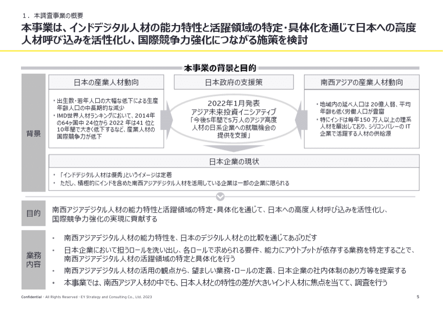
パワーポイント上部はスライドタイトル＋サマリーとなっていて、その下に背景と目的、業務内容がテキストで記載されています。サマリーとボディの間にブランドカラーの黄色の線が入っています。
テキストベースですが、箱を使って**構造化がされており**、見やすいスライドとなっています。

### 業務内容のスライド

調査業務のアプローチを示したスライドです。どのように調査業務を進めていくのかを、「ロールの整理・検証」「能力の可視化」「市場の見通しと日本企業の課題の確認」「示唆・提案」と、ワークのブロックに分けて記載しています。

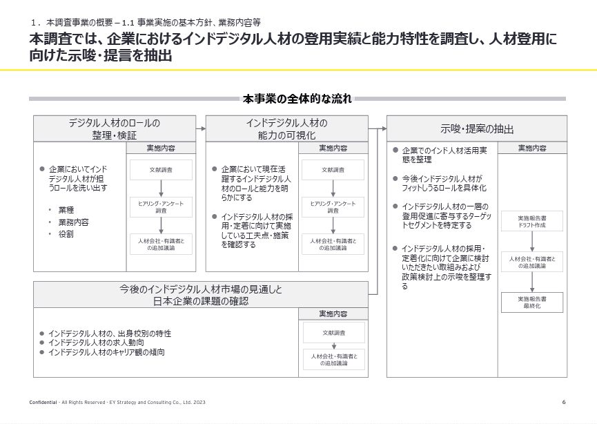
上段にタイトルとメッセージがあり、ボディはフローチャートの形をとっています。**「ロールの整理」「能力の可視化」と並行して「市場見通しと日本企業の課題の確認」を行うため、上下に並行して**並べています。
また、ヒアリングやアンケートといった、具体的にどのようなタスクを行うかは、各箱の中の右下に縦のフローで書いていますね。

### 分析結果に関するスライド

分析結果のスライドです。先ほどのフレームに従って、様々な角度から分析を行っていますね。

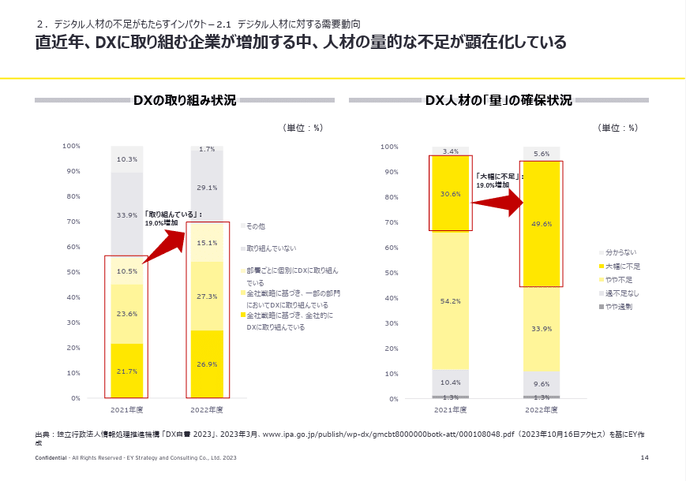
DXの取り組み状況と、人材の「質」に関するアンケート結果です。
棒グラフで内訳を示していますが、**強調したい部分はブランドカラーの黄色を使ったうえで、さらに赤枠で囲っています**。

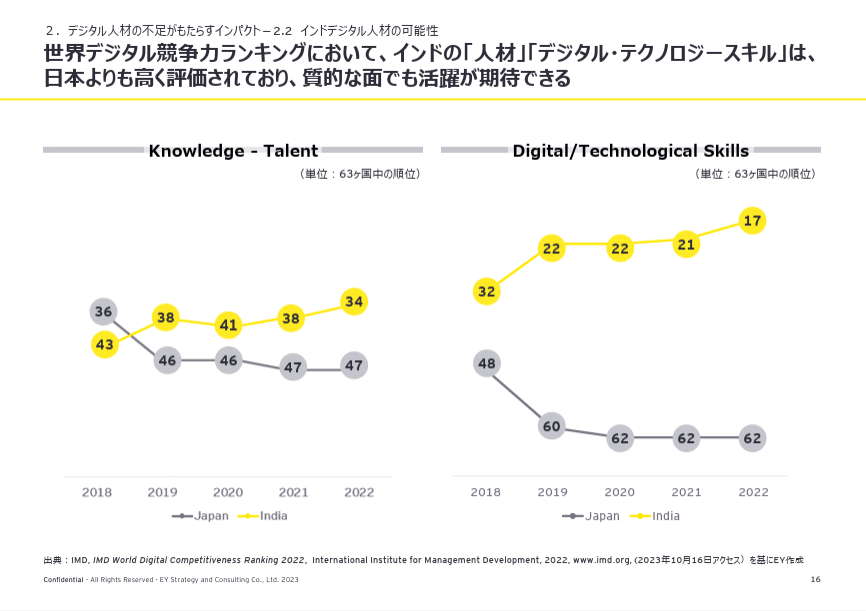
世界デジタル競争力ランキングの結果を日本とインドで比較しています。ランキング（数字が小さい方がいい）なので折れ線グラフのスタイルにしていますね。
インドの方がランキングが高いということを示すスライドなので、**日本をグレーに、インドをブランドカラーの黄色**にしています。

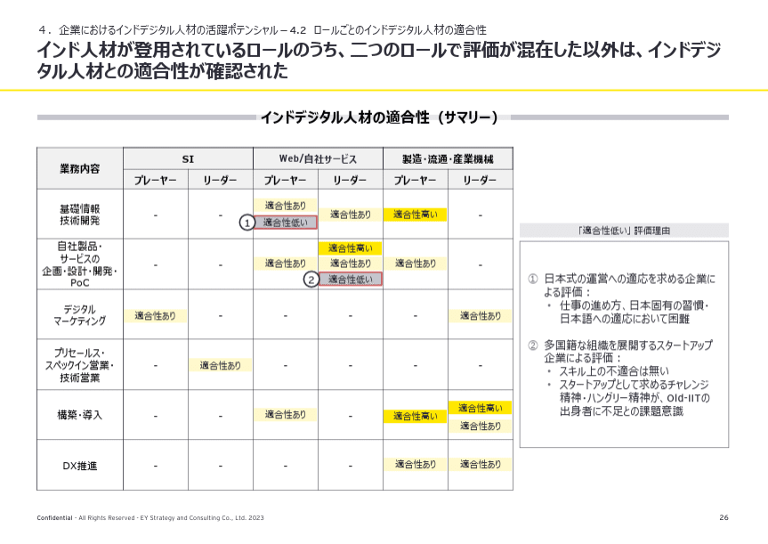
インド人材に任せる役割に対して、能力的な適合性が高いかどうかを、マトリックスで示したスライドです。
業務内容とどういう立場かで評価が変わるものなので、マトリックス型で示すのが合うわけですね。**適合しているほど良いということなので、「適合度高い」を濃い黄色、「適合度あり」を薄い黄色**にしています。

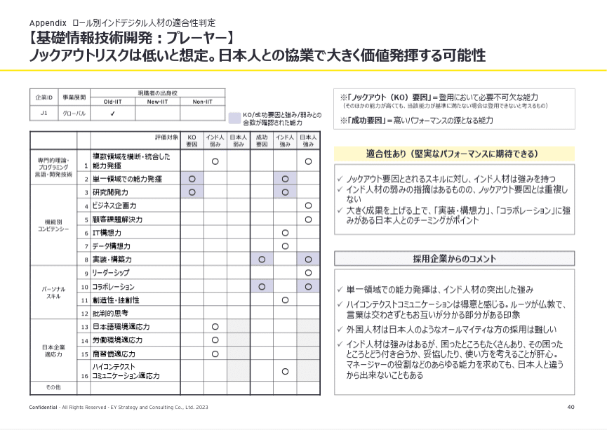
マトリックスの各ブロックにおける評価を行った基礎アンケートの結果です。評価項目ごとにインド人と日本人のどちらがよいか、どのような課題があるか成功事例があるか、まとめています。
**左はアンケート結果をそのまま載せ、右上に結論、右下に採用企業からの生の声として定性的な補足情報を入れています**。

### 提案内容サマリーのスライド

最後に調査報告資料の成果である、提案内容のスライドを見ていきましょう。背景から分析結果、課題と必要な取り組みの案が１枚にまとまっています。

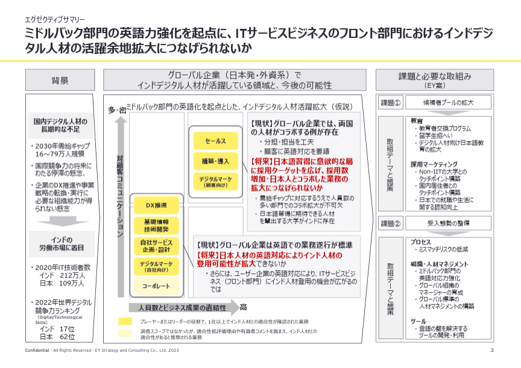
フロー型で今回の調査業務の全体像をまとめているスライドで、読みごたえがありますね。
真ん中の分析結果については、**キラーチャートとしてマトリックスを入れていますが、そのまま使うと紙面を使いすぎるので、マトリックスを侵食する形でテキストサマリー**を入れています。

ビジーではあるものの、ブランドカラーの黄色や赤文字もうまく組み合わせることで、見やすく仕上がっています。スライドの中心に図や色があることで、左右がテキストでも全体として見られる仕上がりになっています。

### 提案内容のスライド

候補者プールの拡大に向けた施策の案をまとめたスライドです。取り組みテーマ、取り組み主体、詳細、タイムラインをまとめています。

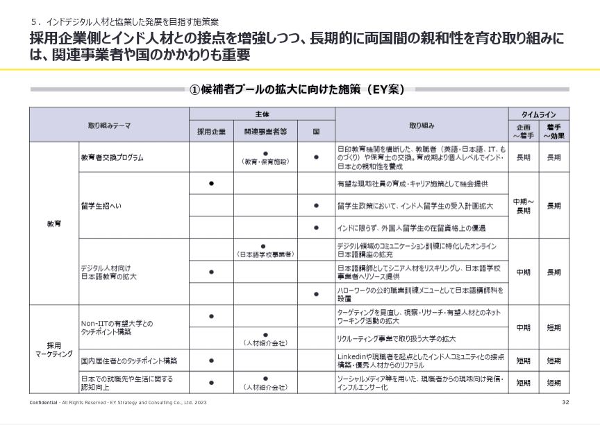
施策の全体像が表形式でわかりやすくまとまっています。実際に行動の議論に移りやすい、いいまとめです。

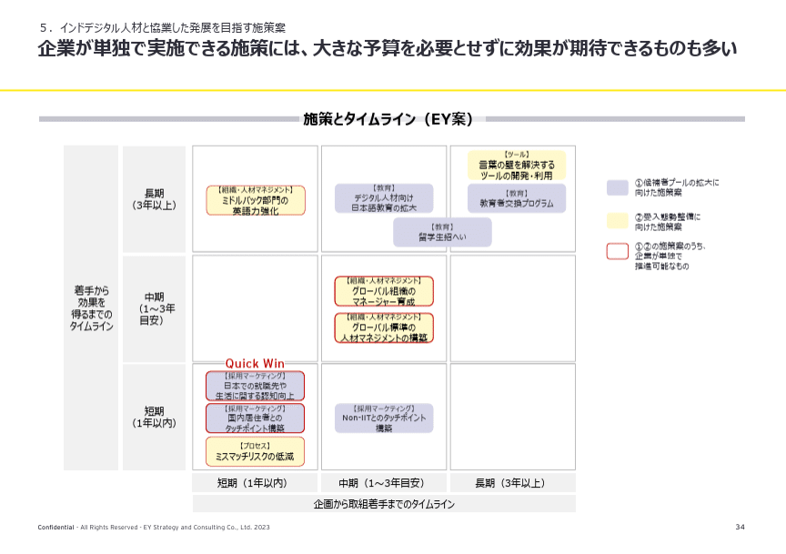
施策のタイムラインについて、効果が出るまでの期間と、着手までの期間でマトリックス的に示しています。これはコンサルスライドの定番である、**難易度とインパクトのマトリックスの変形**ですね。
着手までの期間が短く、効果が出るまでの期間も短いものをクイックウィンとして強調しているのもよいですね。

EYストラテジー・アンド・コンサルティングへの転職を検討されている方は[こちら](https://www.career-adv.jp/lp/casual/?utm_source=note&utm_medium=referral&utm_campaign=note_pp)から。

## EY新日本有限責任監査法人の資料

続いてEY新日本有限責任監査法人の調査報告資料を見ていきましょう！「令和6年度産業経済研究委託事業（ESRSの現状や第三国基準ドラフトに関する調査およびワーキング・グループの開催）調査報告書」のパワーポイントを見ていきます。

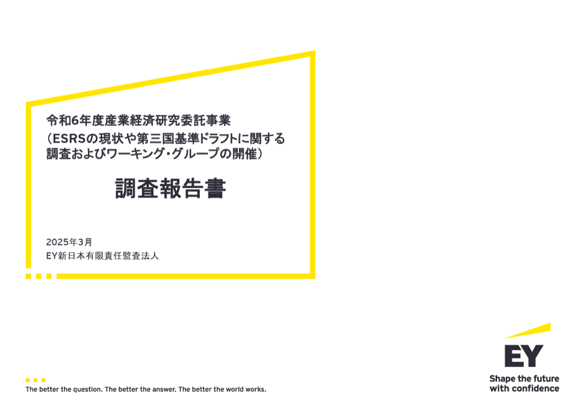
> 引用元：[> 令和6年度産業経済研究委託事業（ESRSの現状や第三国基準ドラフトに関する調査およびワーキング・グループの開催）調査報告書](https://www.meti.go.jp/meti_lib/report/2024FY/000017.pdf)

*https://www.meti.go.jp/meti_lib/report/2024FY/itakuichiran2024FY.pdf*

### 調査概要のスライド

まずは調査概要について見ていきます。本調査の対象であるCSRDについて、一般の方にもわかるように情報整理をしたうえで、実施目的と調査の基本方針をまとめています。

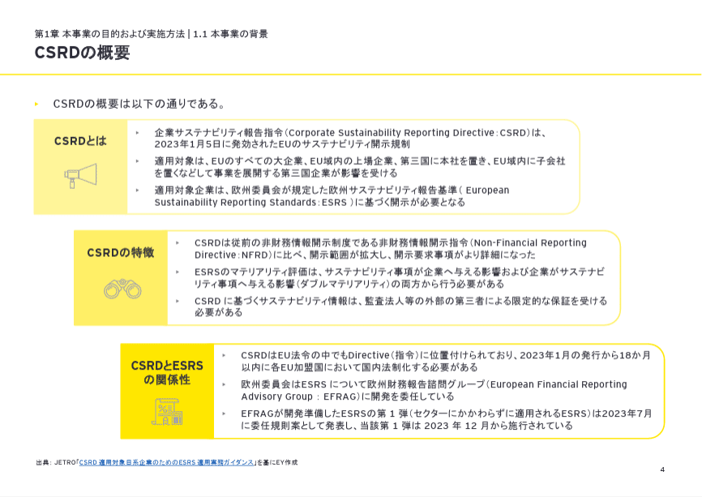
テキストベースでCSRDについてまとめたスライドです。上部にタイトル、ボディにテキストという構造です。

**工夫としてあえて箱を左上から右下に流れるようなデザインにすることで、より本題に近づいていくこと**を示しています。合わせてブランドカラーの黄色が濃くなっていくようにグラデーションで示しているのもポイントですね。

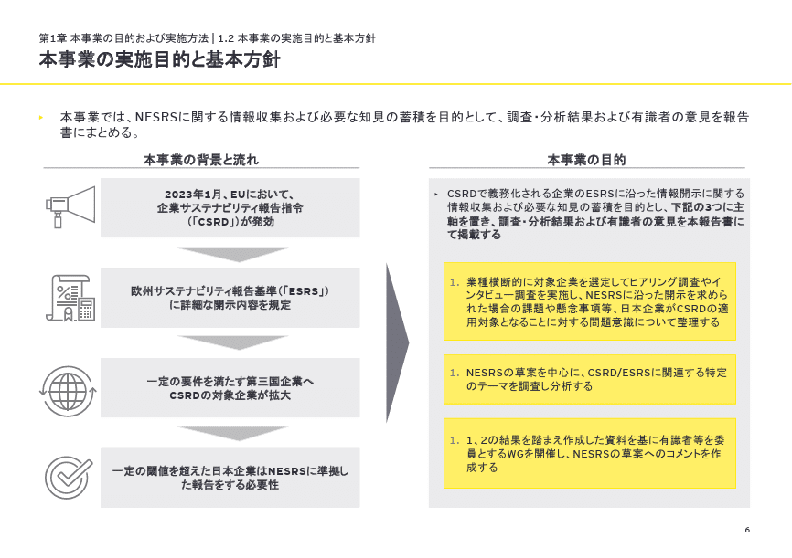
調査事業の背景と目的を左右で示したスライドです。背景をタイムラインで示した方がわかりやすいことから、背景の方もタテに流れる構造にしていますね。

### 業務内容のスライド

調査業務のアプローチと成果物を定義したスライドです。先ほどのEYSCのスライドでは調査する項目ごとにフローがありましたが、こちらは「ロングリスト作成」「アンケート先選定」「インタビュー先選定」などタスクベースの業務内容のフローになっています。

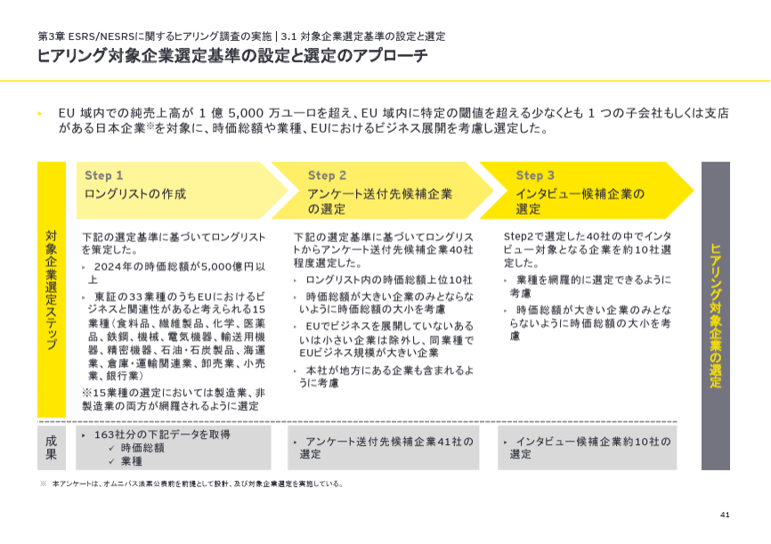
上部にチャプターとスライドタイトル、その下にメインメッセージ、その下に調査アプローチの詳細という構成になっています。タスクを黄色でまとめた上で、成果はグレーでまとめており、タスクの方に注目させる意図のスライドとなっています。

### 分析内容サマリーのスライド

続いて分析内容サマリーのスライドを見てみましょう。ヒアリング調査の結果について2枚にまとめたうちの1枚です。

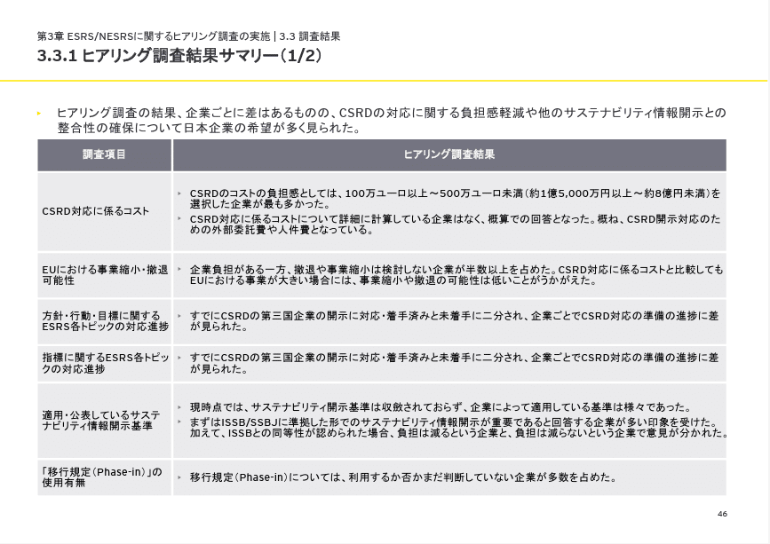
ここでは調査結果をテキストベースでまとめています。調査結果の内容はヒアリングの生の声を入れているわけではなく、複数のヒアリング結果から導き出された内容が記載されています。テキストでバーっとまとめるのは監査法人っぽいスライドといえますね。

### 分析結果に関するスライド

アンケートと詳細インタビューのヒアリング結果についてまとめたスライドです。先ほどのサマリーの詳細です。

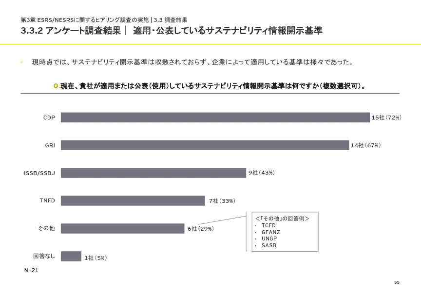
アンケート調査の結果について棒グラフでまとめています。構造はこれまで同様、チャプター＋タイトル、メッセージ、ボディとなっています。ボディについては補足情報などは入れず、グラフのみのスライドなっています。

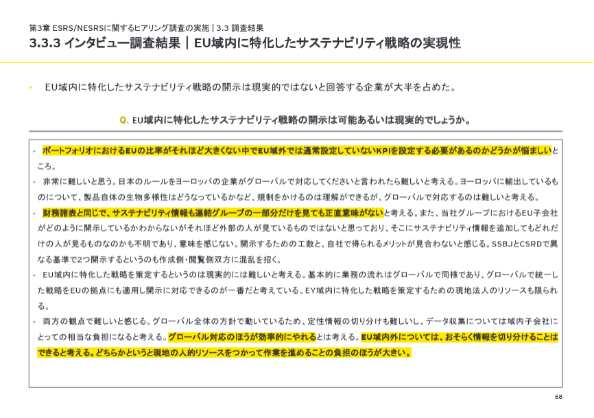
ヒアリングで聞かれた生の声を記載したスライドです。ヒアリングの声をより伝わりやすくするには、あえてきれいにまとめない方がいいので、そのままテキストで載せています。

**テキストばかりだと読み手はしんどいので、ブランドカラーの黄色でハイライトすることで緩急をつけて**読みやすくしています。

EY新日本有限責任監査法人への転職を検討されている方は[こちら](https://www.career-adv.jp/lp/casual/?utm_source=note&utm_medium=referral&utm_campaign=note_pp)から。

## EY税理士法人の資料

最後にEY税理士法人のパワーポイント資料を見ていきましょう！「令和５年度産業経済研究委託事業 持続的な成長を実現するための政府支援のあり方に関する調査報告書」という報告資料です。

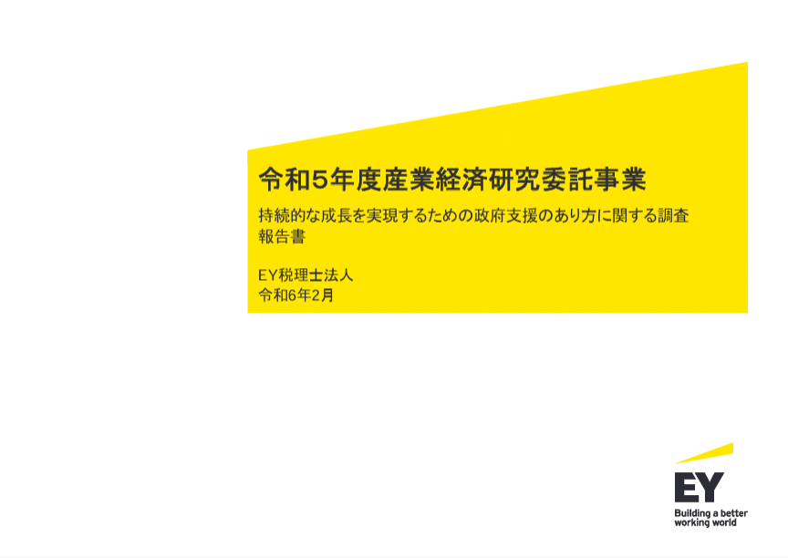
> 引用元：[> 令和５年度産業経済研究委託事業 持続的な成長を実現するための政府支援のあり方に関する調査報告書](https://www.meti.go.jp/meti_lib/report/2023FY/000823.pdf)

*https://www.meti.go.jp/meti_lib/report/2023FY/itakuichiran2023FY.pdf*

### 背景と目的のスライド

まずは背景と目的のスライドから見ていきましょう。背景と目的についてテキストベースで記載されたスライドです。

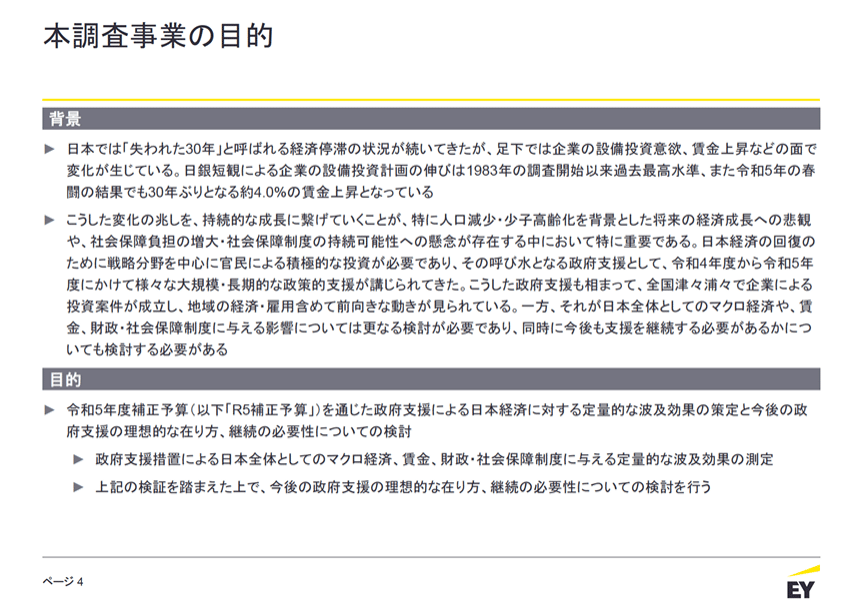
上部にタイトル、その下にボディというシンプルな構造です。背景と目的をラベルとして入れたうえで、内容についてはメインテキストとサブテキストに構造化されています。

### 分析内容に関するスライド

シナリオ分析を行う上で参考とするマクロ経済モデルについて整理したスライドです。複数のマクロ経済モデルについて詳細がまとめられています。

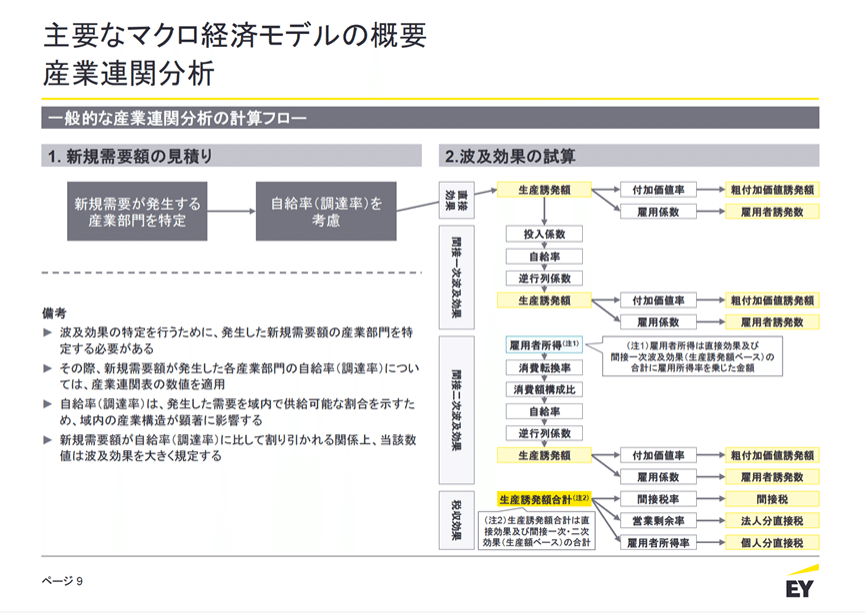
産業連関分析の計算フローをまとめたスライドです。計算のフローを、新規需要額の見積もりと波及効果の試算に分け、左右で整理しています。

**波及効果の試算がかなり細かいものの、フローチャート型で整理**することで、比較的見やすく仕上がっています。左下の空いたスペースに尾行を入れているのも全体のバランスがよくなっていてよいですね。

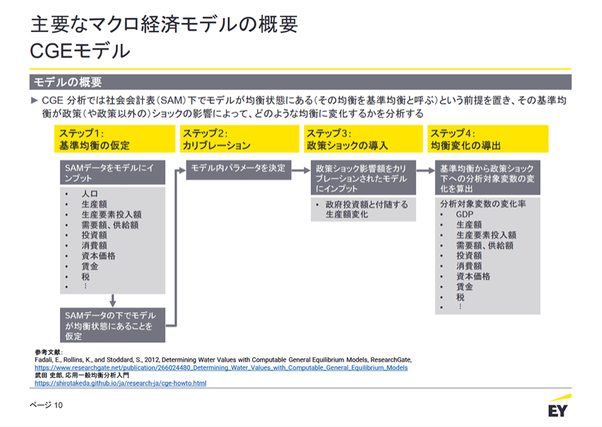

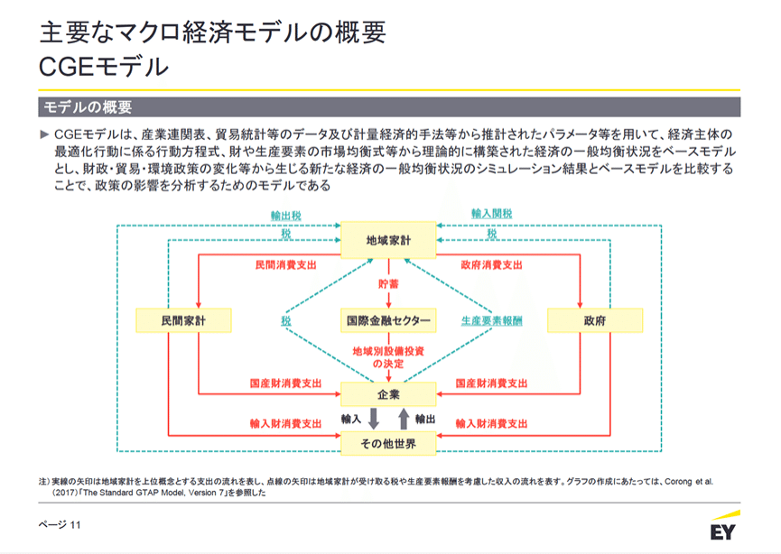
こちらはCGEモデルについて、分析フローと全体の概念図を示したスライドです。概要のテキストと図で示す構造です。

### 分析結果のスライド

続いて分析結果のスライドです。シナリオごとに、生産額やGDPへの影響、税収効果、社会保障額、雇用者数、賃金、資本収益率がどのようになるかを計算しています。

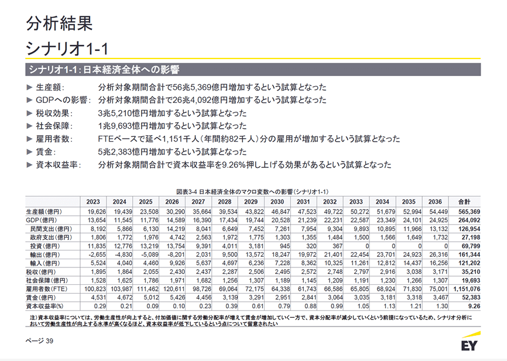
主要パラメーターのサマリーを上に示したうえで、スライドの下半分は表をそのまま載せています。**複雑な分析を行った結果の数値がかなり細かく示される**と、すごい分析をやっていたんだなということが伝わります。

### 示唆のまとめスライド

最後に、定量分析の結果得られた示唆についてまとめたスライドを見てみましょう。今後の政府支援の継続性、理想的な在り方への提言がなされています。

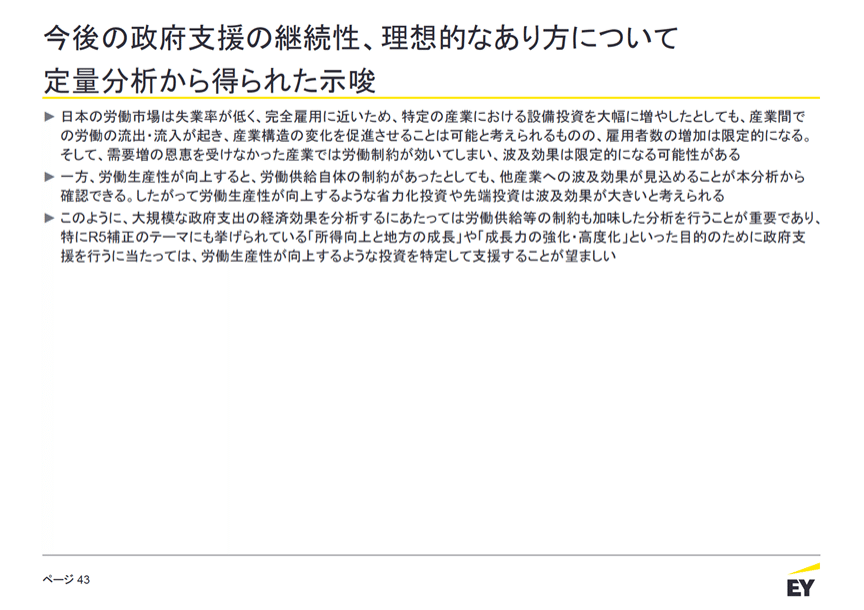
テキストベースの示唆のスライドです。まとめなのでテキストでぎっしり書くのは一般的ですが、下半分が余白になっているので、もう少し行間を開けてもよいのかもと感じます。もしかすると、**政府への報告用は文字がぎっしり入っていて、外部講評用にする際に下半分は機密性が高いとして削った**のかもしれませんね。

EY税理士法人への転職を検討されている方は[こちら](https://www.career-adv.jp/lp/casual/?utm_source=note&utm_medium=referral&utm_campaign=note_pp)から。

## EYグループへの転職を考えている方へ

パワポ研は株式会社レックスアドバイザーズが運営しています。
**レックスアドバイザーズは会計ファームへの転職支援に強みを持つ転職エージェント**です。EYストラテジー・アンド・コンサルティング株式会社、EY新日本有限責任監査法人、EY税理士法人、への転職を考えている方は、[無料相談フォーム](https://www.career-adv.jp/job_search/entryform_exp/?utm_source=note&utm_medium=referral&utm_campaign=note_pp)から相談してみてくださいね。

*レックスアドバイザーズのサービスサイトはこちらから*

**> 求人紹介をご希望の方　**[> 無料転職サポート](https://www.career-adv.jp/job_search/entryform_exp/)**
> 採用支援をご希望の方　**[> 採用サポート](https://www.career-adv.jp/request3/)
**> その他　**[> お問い合わせフォーム](https://www.rex-adv.co.jp/contact)

## パワポ研オリジナルテンプレート

パワポ研では「ビジネスシーンで使える」パワーポイントテンプレートを公開しております。デザインを整えるのみならず、**ロジックやストーリーを整理するのにも役立つパッケージになっております**ので、関心のある方は下記ページも併せてご覧ください！

[
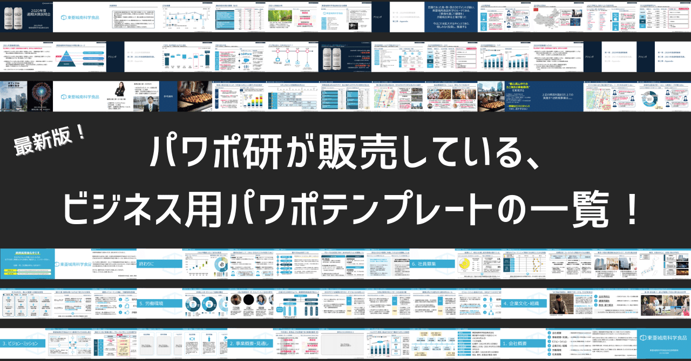
](https://note.com/powerpoint_jp/n/n7300a1293e8e)またパワポ研では、上記の記事のように、noteでは**フォローしているだけでビジネスにおける「資料作成のコツ」と「デザインのセンス」が身に付くアカウント**を目指して情報配信を行っています。
今後もコンスタントに記事を配信していく予定なので、関心のある方は是非アカウントのフォローをお願いします！

**> Template販売　**[> https://powerpointjp.stores.jp/](https://powerpointjp.stores.jp/%EF%BF%BCnote)
**> note　**[> パワポ研の資料作成術](https://note.com/powerpoint_jp/m/mc291407396da)
**> X（旧Twitter)　**[> https://twitter.com/powerpoint_jp](https://twitter.com/powerpoint_jp)
**> その他　**[> お問い合わせフォーム](https://www.rex-adv.co.jp/contact)
**> 書籍　**[> 注目企業の実例から学ぶパワポ作成術](https://www.amazon.co.jp/dp/4046060476)

