# 【メガバンクのパワポ紹介】SMBCグループのプレゼン資料（2025年更新）

[note原文](https://note.com/powerpoint_jp/n/n1b8bc2e39ff5)

みなさんこんにちは。
資料デザインのリサーチや分析に取り組むパワーポイントのスペシャリスト、パワポ研です。

このシリーズでは**日本のメガバンクのパワーポイント資料に焦点を当てて、三菱UFJFG、みずほFG、SMFGのパワポを紹介**していきます。
グループによってコンサルティングファームやシンクタンク等のグループ構成は変わるので、公開されているパワーポイントを紹介していきますよ。

今回は三井住友フィナンシャルグループです！

- 三井住友銀行の産業調査レポート

- 三井住友フィナンシャルグループのサステナビリティ説明会資料

- 三井住友銀行のIR資料

三菱フィナンシャルグループのパワーポイントはこちら。

みずほフィナンシャルグループのパワーポイントはこちら。

では早速行きましょう！

## 三井住友銀行の産業調査レポート

まずは三井住友銀行の産業調査レポートを見ていきましょう。ここでは「米州におけるCCUSの動向」のパワーポイントを見ていきます。

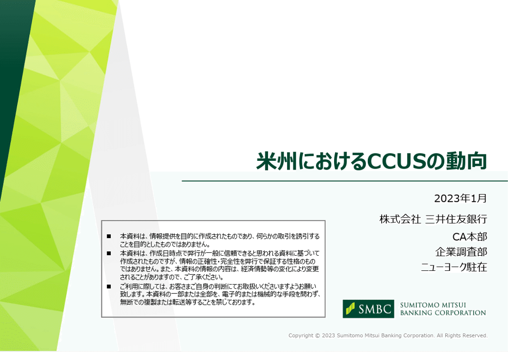
> 引用元：[> 米州におけるCCUSの動向](https://www.smbc.co.jp/hojin/report/investigationlecture/resources/pdf/3_00_CRSDReport134.pdf)

*https://www.smbc.co.jp/hojin/report/investigationlecture/*

### 基本情報のスライド

まずは基本情報のスライドから見ていきましょう。
今回のレポートの調査対象であるCCUS（CO2の回収・有効利用・貯蔵）に関して、読み手にわかるように基本的な情報を整理しています。

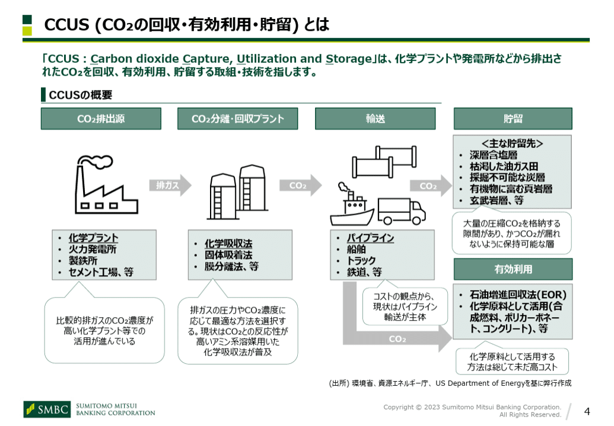

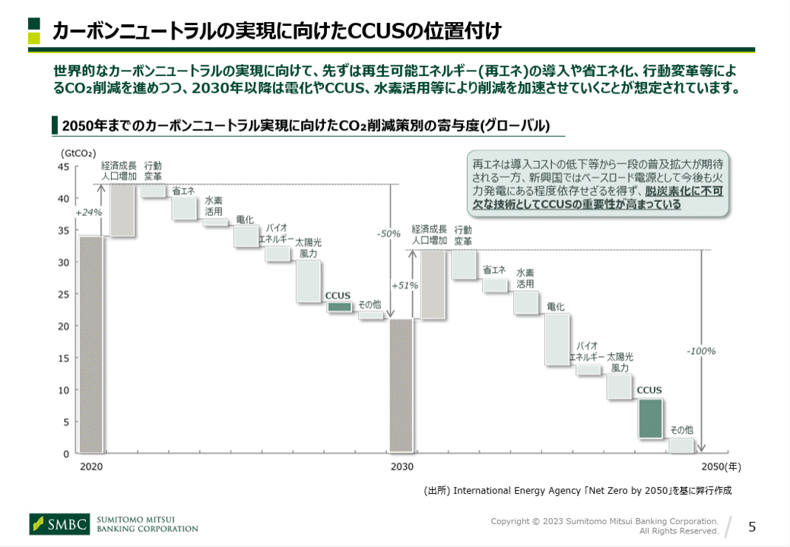

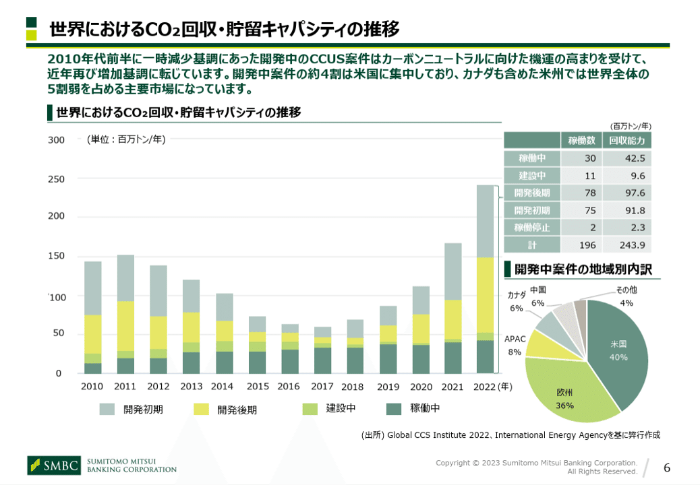
構成としては、まず１行スライドタイトルがあり、その下にスライドのサマリーがあり、その下にフロー図やグラフといったボディがあります。
産業調査レポートということで、**読み手への情報提供を目的としているため、スライドタイトルがQ&AのQ、スライドのサマリーがQ&AのA**のような構造になっています。

三井住友フィナンシャルグループの資料というと、明るい緑色を多用するイメージがありますが、産業調査レポートにおいては、暗めの緑も多用しています。

スライドタイトルのテキストは黒色、スライドサマリーのテキストは緑色となっています。グラフの色については緑のグラデーションとなっていますが、おそらく一番濃い緑は、コーポレートカラーの濃い緑とは違うカラーコードのようです。

### 分析内容のスライド

続いて分析内容のスライドです。米国における商用化CCUSプラントの状況について、稼働中・建設中・計画中のものを見せると同時に、背景にある普及支援策の説明をしています。

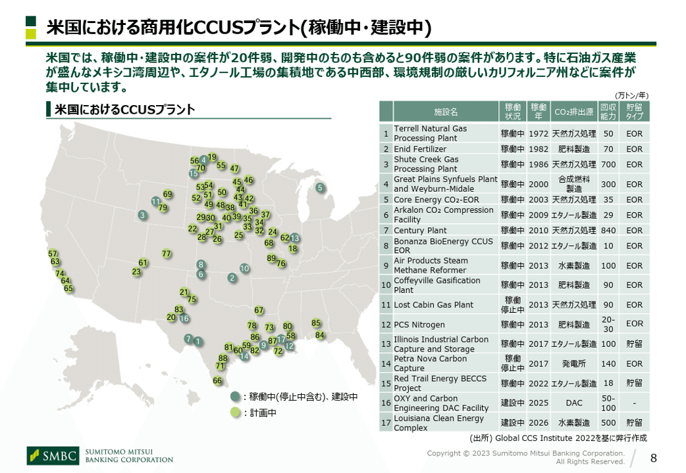

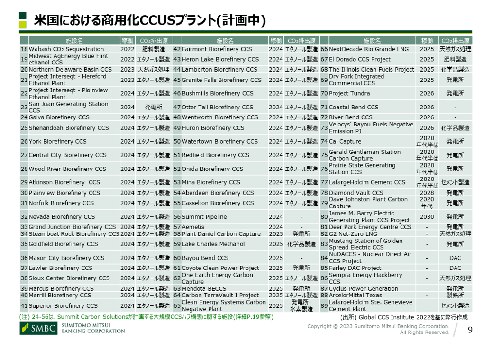

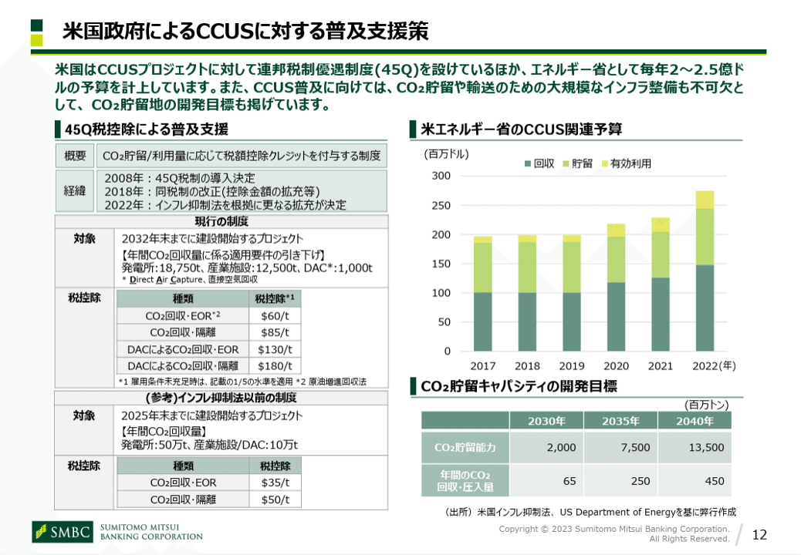
スライドの構造は変わらず、Q&AのQであるスライドタイトルの下に、Q&AのAであるスライドサマリーがあり、その下にボディがあります。

文字が多めでビジーな構造のため、テーブル形式の表を多用して、構造的に見せています。表の背景については、薄い緑と灰色を使い分けていますが、**極力薄い緑を使いつつ、うるさくなりそうな場合に灰色や白色を使っている**ように見えます。
地図と表の組み合わせはこうした分布を見せたい場合の定番フォーマットですね。

### 課題と取り組み内容のスライド

最後に課題と取り組み内容のスライドを見ていきましょう。
ここまで米州のCCUSの現状の話をしてきましたが、読み手に取って重要なのは今後どうなっていくかです。そこで今後どうなるかを、普及に向けた課題と取り組みという形でまとめて、レポートの締めとしているわけですね。

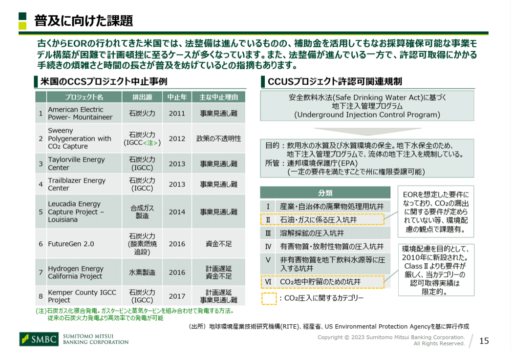

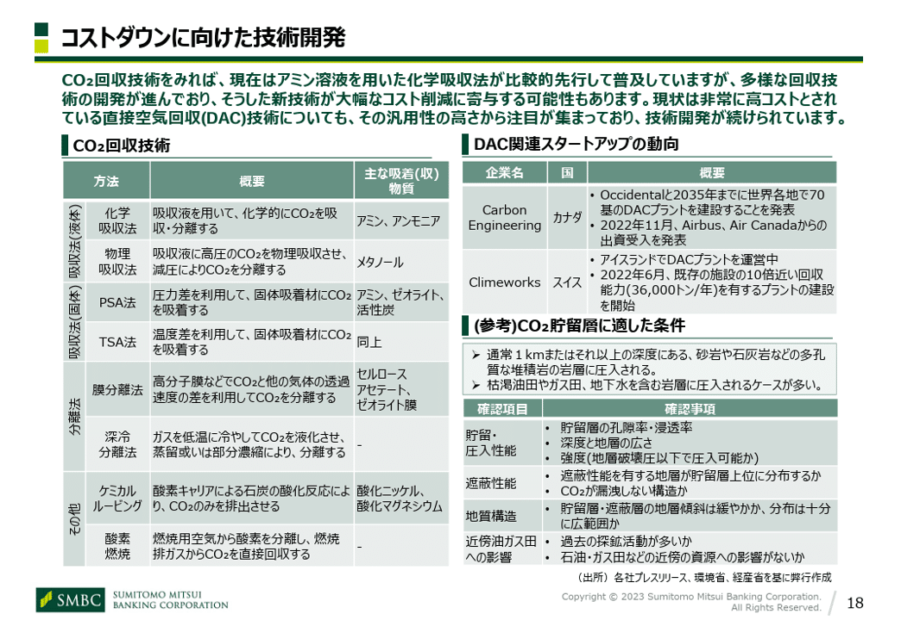

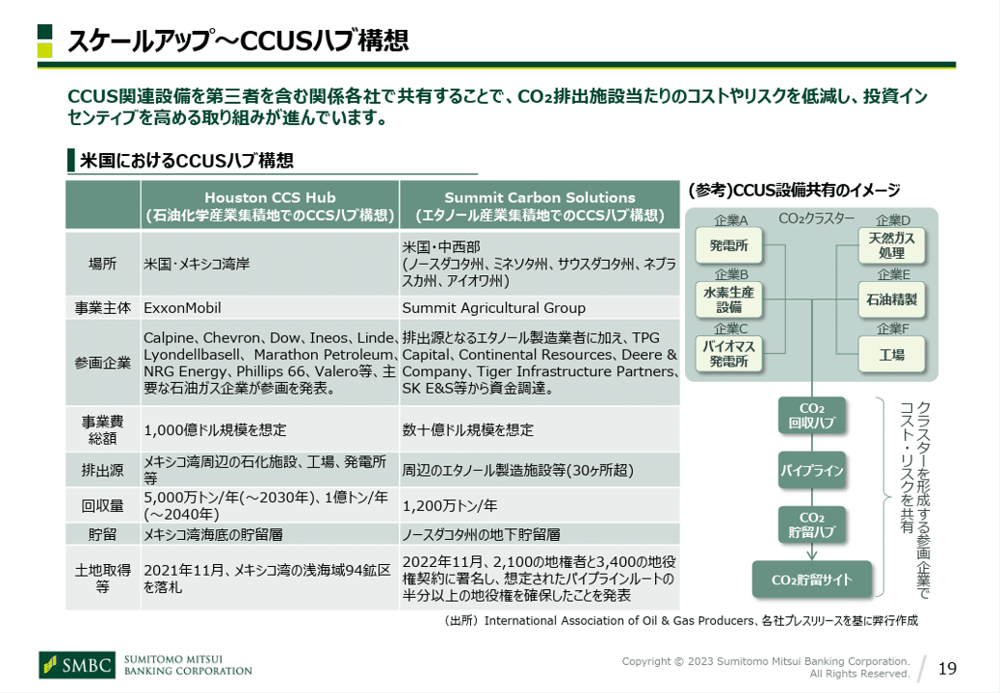
構造は引き続き変わりませんが、最後の結論の部分になってくるため、内容としても力が入っています。とはいえ**内容はテキスト中心になってきますので、引き続きテーブル形式の表が中心**です。

## サステナビリティ説明会の資料

続いて、三井住友フィナンシャルグループのサステナビリティ説明会のパワーポイントを見ていきましょう。SMBCグループの社会的価値創造への取り組みがまとめられています。

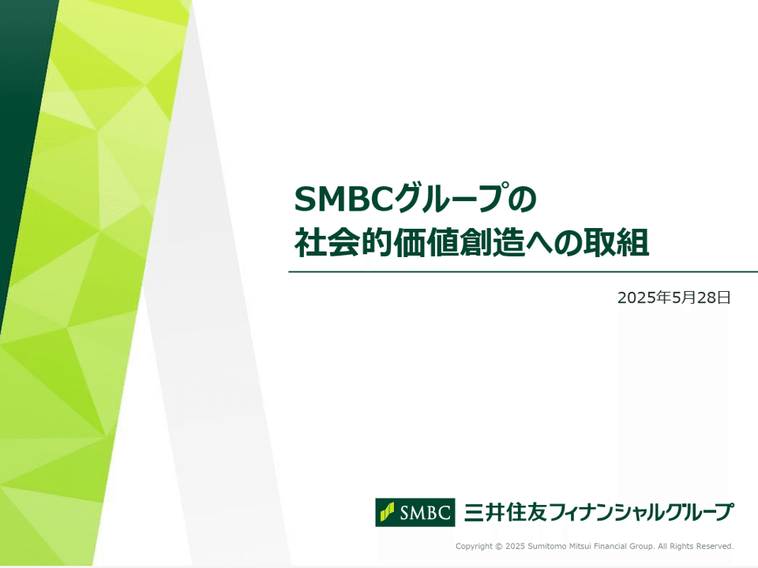
> 引用元：[> プレゼンテーション資料](https://c-hotline.net/docs/co/arc/DGZY5351rev02/src/dl/smfg250528_1.pdf)

*https://www.smfg.co.jp/sustainability/*

### 環境に対する取り組みのスライド

環境に関する取り組みのパートです。脱炭素化やサーキュラーエコノミーに関して、SMBCグループとしての取り組みをまとめています。

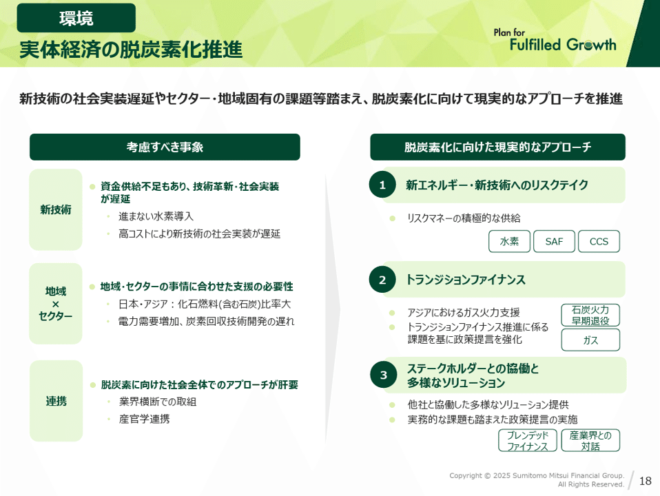

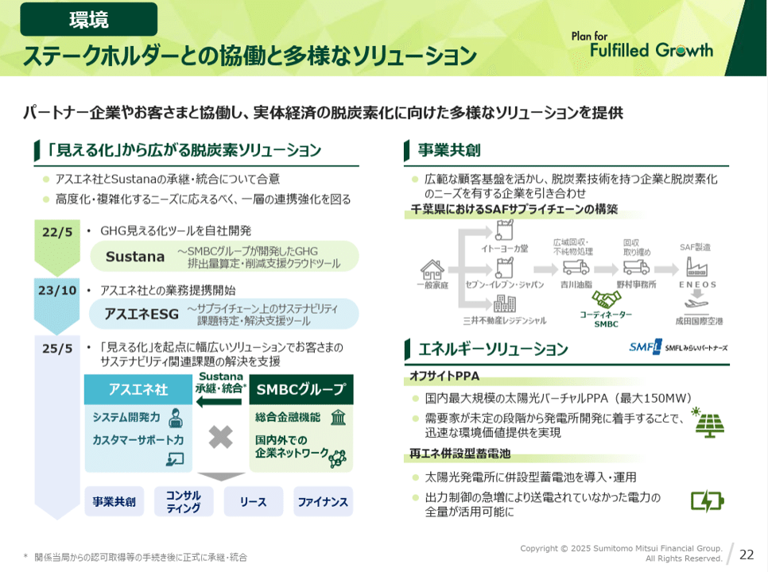

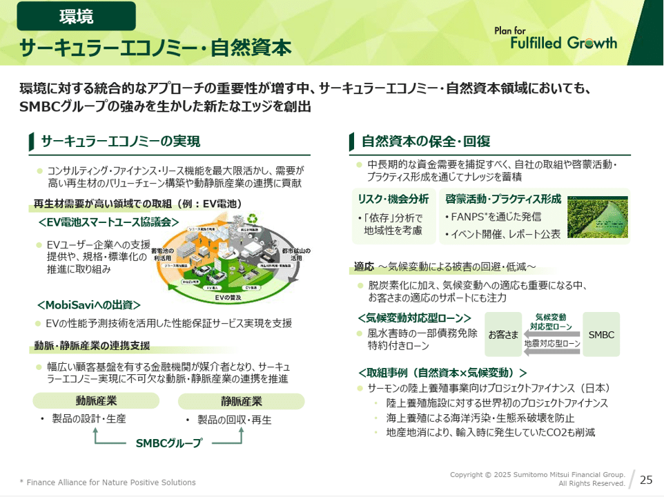
スライドの構造としては、**上部に「環境」などの大カテゴリのタグと、「実体経済の脱炭素化推進」といった中カテゴリがあり、その下にスライドサマリーとボディがあります**。上部はSMBCのコーポレートカラーのヘッダーの中に大カテゴリと中カテゴリがあります。

テキストベースのスライドにおいては、ボックスを使って構造化するパターンと、テキスト内で大中小の項目を作って構造化するパターンがあります。
テキスト内で項目を作る場合には、**大項目は緑色の下線、中項目は緑文字、小項目は黒文字のプレーンテキスト**という構造を取っています。

またテキストが多いと、どうしても文字文字しくなってしまうので、イラストや写真を入れたり、フロー図を入れたりすることで、全体のバランスを取るといった工夫も見られます。

### 人的資本経営のスライド

人的資本経営に関する取り組みのパートです。人的資本経営に関する主要な指標について、１枚のスライドにまとめています。

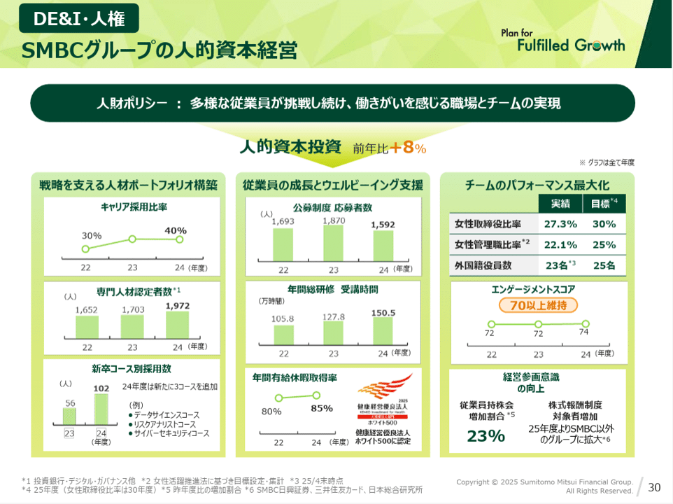
**数字を見せるスライドなので、構造としてもスライドサマリーはなく、ボディに９つのKPIに関する進捗状況が記載**されています。

KPIは、推移を見せるものは棒グラフや折れ線グラフ、目標に対しての実績を見せるものは表やテキストベースでまとめています。

また単純に９つのKPIを並べるわけではなく、「戦略を支える人材ポートフォリオ構築」「従業員の成長とウェルビーイング支援」「チームのパフォーマンス最大化」という３つのグループにわけることで見やすくしています。**背景色を明るめの薄緑にしているのも、見やすくてよいですね。**

### 日本の課題に対する取り組みのスライド

最後に、様々な日本の課題に関する取り組みのスライドです。
国内における貧困や格差の問題、少子高齢化の問題、日本の再成長の問題におけるSMBCグループの取り組みをまとめています。

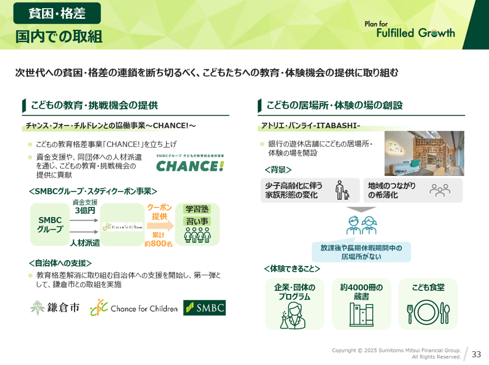
貧困・格差のパートのスライドです。ボディは左右にタイトルがあり、その中に取り組み内容の具体が記載されています。

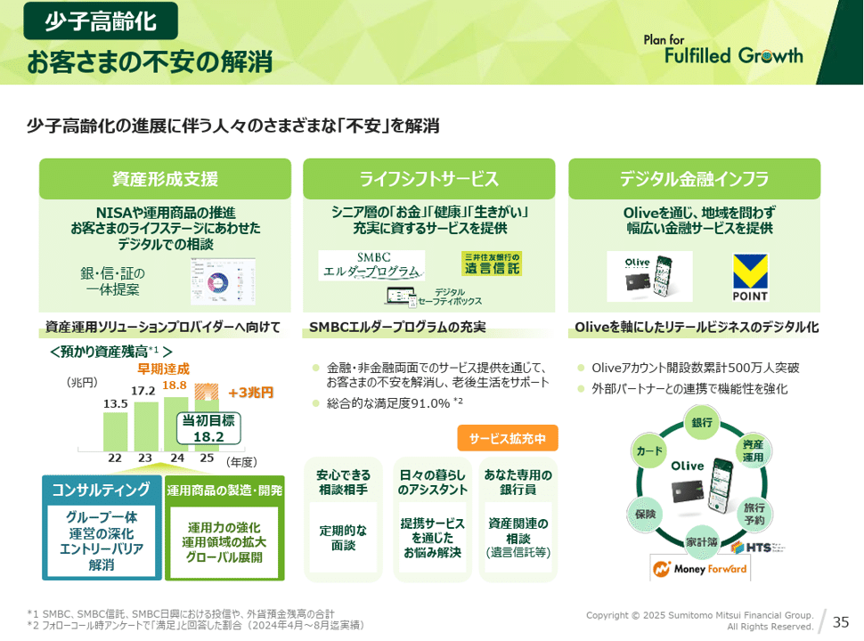
少子高齢化のパートのスライドです。少子高齢化そのものに対する取り組みというよりは、少子高齢化の中でお客様が不安に思うことに対しての取り組みが記載されています。
構造としては、**ボディを３分割し、「資産形成支援」「ライフシフトサービス」「デジタル金融インフラ」の３つ**について、具体な内容を記載しています。

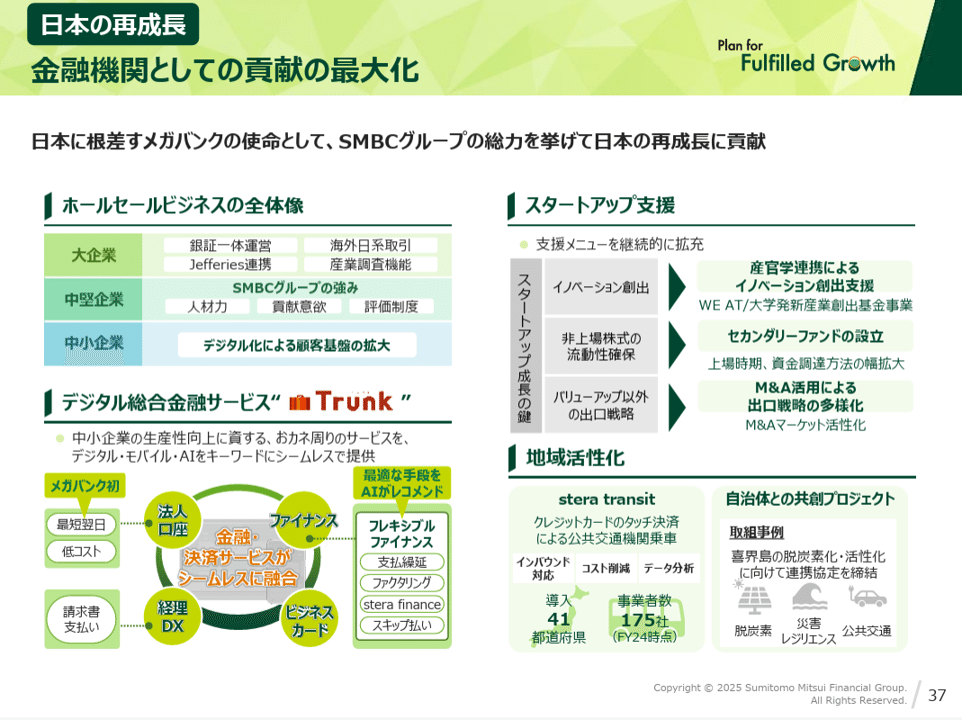
日本の再成長のパートのスライドです。金融機関としてどのように日本の再成長に貢献していくのか、４つの項目で記載しています。画面を４等分するような構造ではなく、コンテンツの大きさによってサイズを変えて４つの項目を整理しています。

## 三井住友銀行のIR資料

最後に三井住友銀行のIRプレゼンテーションについて見ていきましょう。
といっても、三井住友銀行の投資家説明会のパワーポイントについては、【マネしたい】おしゃれなパワポの「緑色系」プレゼン３選の中で詳しく説明しているので、ここではリンクを載せるだけにしておきますね。

## メガバンクグループに転職を考えている方へ

パワポ研は株式会社レックスアドバイザーズが運営しています。
**レックスアドバイザーズはコンサルタントや会計経理人材の転職支援に強みを持つ転職エージェント**です。メガバンク系のコンサルティングファームやメガバンクへの転職を考えている方は、[無料相談フォーム](https://www.career-adv.jp/job_search/entryform_exp/?utm_source=note&utm_medium=referral&utm_campaign=note_pp)から相談してみてくださいね。

*レックスアドバイザーズのサービスサイトはこちら*

**> 求人紹介をご希望の方　**[> 無料転職サポート](https://www.career-adv.jp/job_search/entryform_exp/)**
> 採用支援をご希望の方　**[> 採用サポート](https://www.career-adv.jp/request3/)
**> その他　**[> お問い合わせフォーム](https://www.rex-adv.co.jp/contact)

## パワポ研オリジナルテンプレート

パワポ研では「ビジネスシーンで使える」パワーポイントテンプレートを公開しております。デザインを整えるのみならず、**ロジックやストーリーを整理するのにも役立つパッケージになっております**ので、関心のある方は下記ページも併せてご覧ください！

またパワポ研では、上記の記事のように、noteでは**フォローしているだけでビジネスにおける「資料作成のコツ」と「デザインのセンス」が身に付くアカウント**を目指して情報配信を行っています。
今後もコンスタントに記事を配信していく予定なので、関心のある方は是非アカウントのフォローをお願いします！

**> Template販売　**[> https://powerpointjp.stores.jp/](https://powerpointjp.stores.jp/%EF%BF%BCnote)
**> note　**[> パワポ研の資料作成術](https://note.com/powerpoint_jp/m/mc291407396da)
**> X（旧Twitter)　**[> https://twitter.com/powerpoint_jp](https://twitter.com/powerpoint_jp)
**> その他　**[> お問い合わせフォーム](https://www.rex-adv.co.jp/contact)
**> 書籍　**[> 注目企業の実例から学ぶパワポ作成術](https://www.amazon.co.jp/dp/4046060476)

