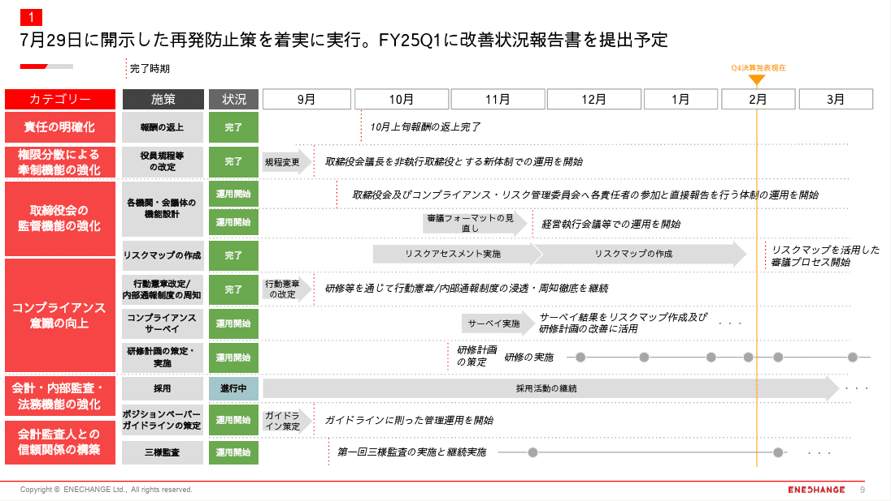
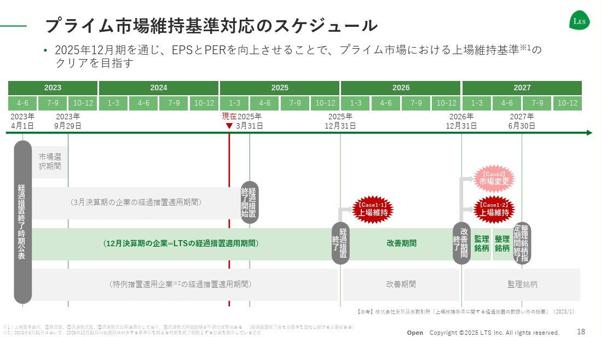
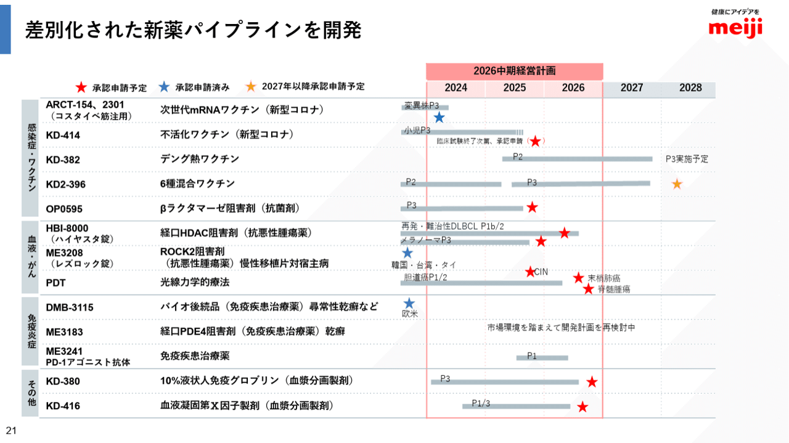
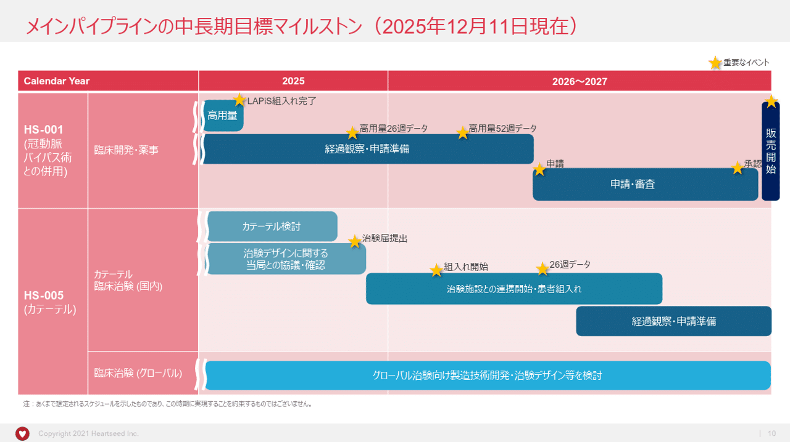
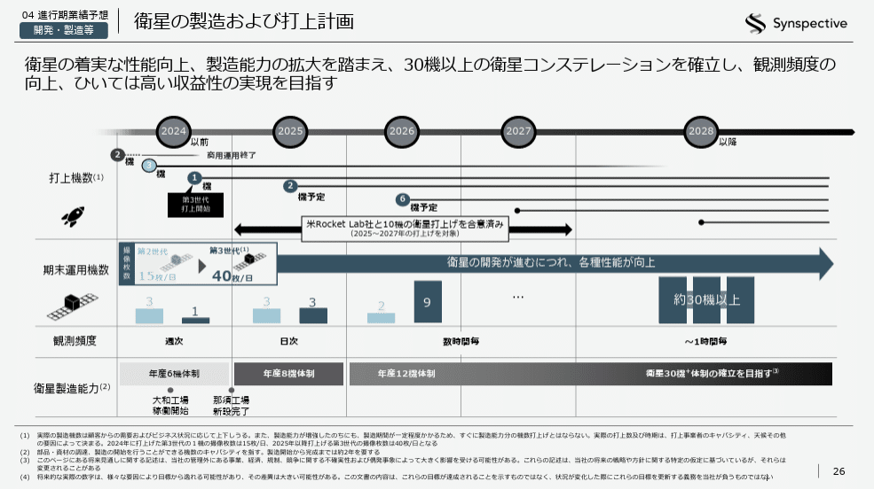
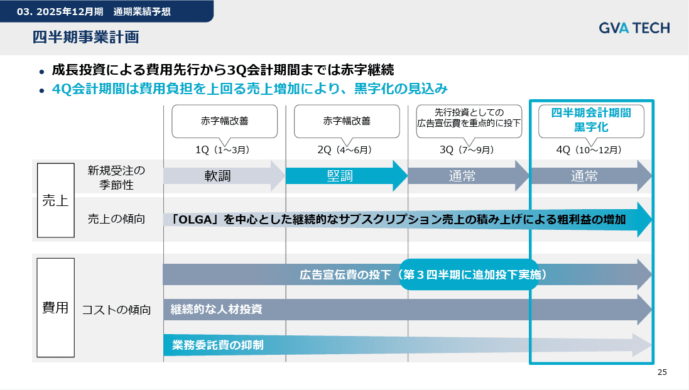
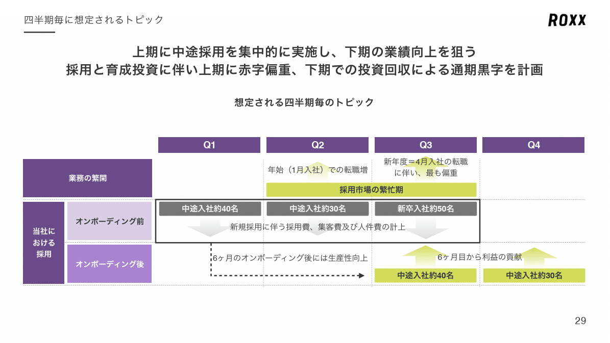
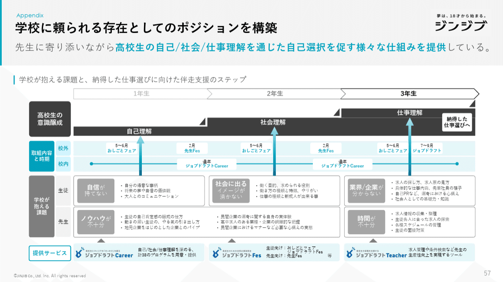
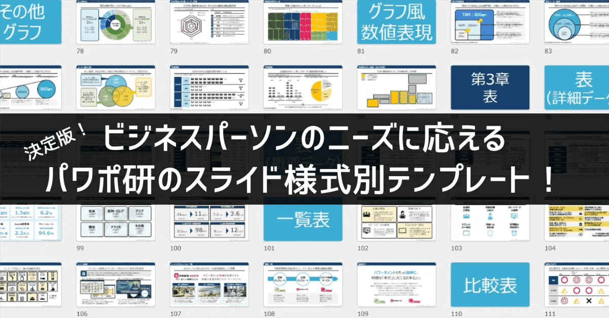

# 【マネしたい】見やすいパワポの「スケジュール」スライド９選

[note原文](https://note.com/powerpoint_jp/n/n1f177d84a172)

みなさんこんにちは。
資料デザインのリサーチや分析に取り組むパワーポイントのスペシャリスト、パワポ研です。

パワポ研ではこれまで、「タイムライン」や「ロードマップ」のスライドを紹介してきましたが、今回は**パワポの「スケジュール」のスライドに焦点を当て、上場企業のIR資料から見やすいスライドを紹介**していきます。

同じように「時間軸」に関するパワポに使われる「タイムライン」「ロードマップ」「スケジュール」ですが、大まかには以下の様に使い分けられていることが多いです。とはいえ明確に定義があるわけではないので、この限りではありません。

- タイムライン：**過去の取り組み**に関するパワポで使われることが多い。
事業の沿革、これまでのM&A履歴等を紹介するのに適している

- ロードマップ：将来の取り組みに関するパワポで使われることが多い。
**比較的長期目線、あるいは時間軸が明確に定まってない場合**に取組内容を紹介するのに適している

- スケジュール：将来の取り組みに関するパワポで使われることが多い。
**比較的短期目線、あるいは時間軸が明確に定まっている場合**に取組内容を紹介するのに適している

では早速具体的に見ていきましょう！

## 基本的な「スケジュール」スライド３選

まずは将来に向けたタイムスケジュールが明確に決まっている場合に使われる「スケジュール」のスライドについて見ていきましょう。

### 「スケジュール」とイベントのパワポ例

まずは株式会社ボードルアのパワポにおける「スケジュール」のデザインから見ていきましょう。
2025年２月期　決算補足説明資料のパワーポイントにある、売り出しの目的及びタイミング／次なるM&Aに向けた自社株買いのスライドです。

*株式会社ボードルアのスケジュールのスライド*

> 引用元：[> 2025年２月期　決算補足説明資料](https://contents.xj-storage.jp/xcontents/AS82646/78393b6f/504c/4fce/b111/4d1ca83dcaa8/140120250415516268.pdf)

*https://www.baudroie.jp/ir/presentations/*

パワポの「スケジュール」スライドの特徴としては、**将来発生するイベントのタイミングだけを記載している点**が挙げられます。四半期や月を上に書かず、あくまでイベントのタイムスケジュールのみをシンプルに見せるデザインです。

色使いにも工夫が見られ、売り出しや自社株買いといったアクションを黄色、時期TOPIX判定のタイミングを赤、そこに向けた重要イベントの通期決算発表をオレンジにしています。重要なイベントをより濃い色にし、そこに向けての取り組みを黄色にすることで、読み手が見やすいパワポとなっています。

### 行動計画の「スケジュール」のパワポ例

続いてENECHANGE株式会社のパワポにおける「スケジュール」のデザインを見ていきましょう。
2025年3月期 第3四半期決算説明資料のパワーポイントにある、再発防止策の実行状況のスライドです。

*ENECHANGE株式会社のスケジュールのスライド*

> 引用元：[> 2025年3月期 第3四半期決算説明資料](https://contents.xj-storage.jp/xcontents/AS71239/20e3e3e8/967c/4c55/beef/2ee006788099/140120241114523187.pdf)

*https://enechange.co.jp/ir/news/*

パワポの「スケジュール」スライドの特徴として、**タイムスケジュールが月刻みになっていて、細かなアクションの状況が一目でわかるようになっている点**が挙げられます。各アクションの実行スケジュールを矢印で示し、具体的に何をするのかを矢印の中に記載するデザインです。

再発防止策なので、取り組みのカテゴリを目を引く赤色に、状況については青信号を意味する緑色にするなど、細かなデザインの工夫が見られます。
完了したものや運用開始したものについては、テキストで補足をすると同時に、線と丸でフォローアップ状況を示している点も見やすいパワポにする工夫といえますね。

### 中長期の「スケジュール」のパワポ例

続いて株式会社エル・ティー・エスのパワポにおける「スケジュール」のデザインです。
2024年12月期　決算説明資料のパワーポイントにある、プライム市場維持基準対応のスケジュールのスライドを見てみましょう。

*株式会社エル・ティー・エスのスケジュールのスライド*

> 引用元：[> 2024年12月期　決算説明資料](https://contents.xj-storage.jp/xcontents/AS95010a/710d934b/06af/4a8f/9f2f/adb6f51b0e68/140120250209567470.pdf)

*https://lt-s.jp/ir/presentations*

パワポの「スケジュール」スライドの特徴としては、**重要な目標である上場維持に向けた重要なマイルストーンにフォーカスが当たっている点**が挙げられます。
タイムスケジュールは四半期ごとになっていて、マイルストーンに向けた経過措置期間と改善機関が左から右へと長い帯で記されています。

プライム上場維持基準に向けた対応スケジュールのスライドなので、ベースはコーポレートカラーの緑色にしつつ、「上場維持」を赤色のギザギザで強調するデザインとなっています。色が少なく、ピンポイントで強い色が来るデザインで見やすいパワポとなっています。

## 開発系の「スケジュール」スライド３選

続いて、製品開発等の「スケジュール」を示しているパワポ例を見ていきましょう。特に製薬企業や、宇宙系企業など、開発期間が長い企業においてよく使われるスライドです。

### 製薬会社の「スケジュール」のパワポ例

まずは明治ホールディングス株式会社のパワポにおける「スケジュール」のデザインから見ていきます。
医薬品セグメントスモールミーティングのパワーポイントにある、差別化された新薬パイプラインのスライドになります。

*明治ホールディングス株式会社のスケジュールのスライド*

> 引用元：[> 医薬品セグメントスモールミーティング](https://www.meiji.com/pdf/investor/library/presentation_2026_small_pharmaceuticals.pdf)

*https://www.meiji.com/investor/library/presentation/*

パワポの「スケジュール」スライドの特徴としては、**タイムスケジュールは年単位にしつつ、スケジュールの棒の長さはそれぞれ異なる点**が挙げられます。同じ2025年中に承認申請予定の開発品でも、2025年の前半までしか棒が伸びていないものと、後半まで棒が伸びているものがあります。

製薬企業のように、ある程度のタイムスケジュールは見えているが詳細はブレうる、という企業のパワポにおいては、四半期などの細かいスケジュールできちっと見せることが難しい場合が多いです。そこで時間軸としては広めにとりながら、スケジュールをイメージ感で伝えるデザインにするわけですね。

### 開発マイルストーン詳細のパワポ例

続いてHeartseed株式会社のパワポにおける「スケジュール」のデザインを見ていきましょう。
2024年10月期 決算説明会資料のパワーポイントにある、メインパイプラインの中長期目標マイルストンのスライドです。

*Heartseed株式会社のスケジュールのスライド*

> 引用元：[> 2024年10月期 決算説明会資料](https://ssl4.eir-parts.net/doc/219A/ir_material_for_fiscal_ym/170152/00.pdf)

*https://heartseed.jp/ir/library/presentation/index.html*

パワポの「スケジュール」スライドの特徴としては、**アクションごとに行を変えて階段状でスケジュールを示している点**が挙げられます。例えばカテーテルの臨床治験においては、最初に「カテーテル検討」と「知見デザインに関する当局との協議・確認」があり、その次は一段下がって「知見施設との連携開始・患者組み入れ」があり、その下は少しタイムスケジュールがかぶる形で「経過観察・申請準備」があるという、パワポのデザインになっています。

明治ホールディングス同様、どうしても詳細なスケジュールまでは固まらないことから、パワポ内でもスケジュール感ののりしろを作るわけですね。データの蓄積が進む26週や52週を星で示す、ステージが進むほど色を濃くするといった工夫も、見やすいパワポにする工夫です。

### 宇宙事業の「スケジュール」のパワポ例

最後は株式会社Synspectiveのパワポにおける「スケジュール」のデザインです。
2024年12月期通期　決算説明資料のパワーポイントにある、衛星の製造及び打上計画のスライドです。

*株式会社Synspectiveのスケジュールのスライド*

> 引用元：[> 2024年12月期通期　決算説明資料](https://contents.xj-storage.jp/xcontents/AS04951/acbb5e72/2b7d/481f/9d61/94f87408f517/20250214152856182s.pdf)

*https://synspective.com/jp/ir/presentations/*

パワポの「スケジュール」スライドの特徴としては、**KPIが縦軸に並び、それに対する進捗が年次で示されている点**が挙げられます。「打上機数」「期末運用機数」「観測頻度」「衛星製造能力」といった主要なKPIが示され、それぞれ定量や定性で示されています。打上機数だけは左から右への線で示されるデザインです。

背景含むシックな色使い、左から右へとグラデーションが濃くなる線や矢印、2028以降が広がっているデザインなど、タイムスケジュールの長い宇宙事業ならではのパワポのデザインとも言えますね。

## 事業構造の「スケジュール」スライド３選

ここからは「スケジュール」スライドを使って、四半期ごとのデコボコや事業の季節性を説明しているパワポを紹介します。受注が下期によるビジネスや、受注と売上にタイムラグがある事業などで、投資家に正しく事業のメカニズムを理解してもらうべく、見やすいパワポを作るわけですね。

### 四半期別の計画を見せるパワポ例

まずはGVA TECH株式会社のパワポにおける「スケジュール」のデザインから見ていきましょう。
2024年12月期決算説明資料のパワーポイントにある、四半期事業計画のスライドです。

*GVA TECH株式会社のスケジュールのスライド*

> 引用元：[> 2024年12月期決算説明資料](https://contents.xj-storage.jp/xcontents/AS83525/83c2adfa/3315/4769/abc9/7cf660181759/140120250214575087.pdf)

*https://gvatech.co.jp/ir/presentation-materials*

パワポの「スケジュール」スライドの特徴としては、**四半期ごとに売上とコストがどのように変化するかを矢印で示している点**が挙げられます。新規受注の季節性、３Qの広告宣伝費の追加投下など、PLに影響する項目をピックアップして強調しています。

全体的にグレー色のグラデーションとターコイズのデザインで見やすいパワポですが、「業務委託費の抑制」は矢印が細っていくなど、細かな視覚的なデザインの工夫も見られます。

### 季節性を見せる「スケジュール」パワポ例

続いて株式会社ROXXのパワポにおける「スケジュール」効果のデザインです。
2025年９月期通期 決算説明資料のパワーポイントにある、四半期ごとに想定されるトピックのスライドを見ていきましょう。

*株式会社ROXXのスケジュールのスライド*

> 引用元：[> 2025年９月期通期 決算説明資料](https://contents.xj-storage.jp/xcontents/AS04024/9e62dca3/6e71/4e16/9a36/6e6c51c83463/140120251110594542.pdf)

*https://roxx.co.jp/ir/library/presentation/*

パワポの「スケジュール」スライドの特徴としては、**顧客の繁忙期と自社の採用の関連性を示している点**が挙げられます。業務が忙しいQ3に向けて、Q1の採用を加速したうえで6か月間のオンボーディングを行い、生産性を高めた状態で送り込むといいうことが記載されています。

採用市場の繁忙期というビジネス上重要タイミングを黄色で示すと同時に、そこに間に合わせるた目に教育まで完了した中途スタッフを同じ黄色で示すことで、成長を実現していくという、デザイン上の工夫が見られます。

### 学生就活の「スケジュール」のパワポ例

最後は株式会社ジンジブのパワポにおける「スケジュール」のデザインを見ていきましょう。
2025年3月期 通期 決算説明資料 中期経営計画 説明資料 （事業計画及び成長可能性に関する事項）のパワーポイントにある、学校に頼られる存在としてのポジションのスライドです。

*株式会社ジンジブのスケジュールのスライド*

> 引用元：[> 2025年3月期 通期 決算説明資料 中期経営計画 説明資料 （事業計画及び成長可能性に関する事項）](https://ssl4.eir-parts.net/doc/142A/tdnet/2619236/00.pdf)

*https://jinjib.co.jp/ir/library/presentation/*

パワポの「スケジュール」スライドの特徴としては、**お客様のライフサイクルを年単位で整理している点**が挙げられます。高校生が１年生・２年生・３年生時に何をしなければならないのかと、それに対しての学校の課題、人事部が支援できることを見やすいパワポにまとめています。

学校の課題に対してどのような価値提供ができるかと、それぞれのタイミングでどのサービスが提供できるかが一目でわかるようになっており、見やすいパワポとなっています。

## 【マネしたい】見やすいパワポの「スケジュール」スライド９選まとめ

以上、様々なパワポの「スケジュール」のデザイン例を見てきました。
一言でスケジュールといっても、自社のアクションのタイムスケジュールを示したものもあれば、顧客のタイムスケジュールを示したものもあり、用途によってもいろいろなデザインがあることが分かったのではないかと思います。パワポ研では最初に説明した「タイムライン」「ロードマップ」のNoteもありますので、是非色々とみて、自社に合う出材印を習得してみてくださいね。

## パワポ研オリジナルテンプレート

パワポ研では「ビジネスシーンで使える」パワーポイントテンプレートを公開しております。デザインを整えるのみならず、**ロジックやストーリーを整理するのにも役立つパッケージ**になっておりますので、関心のある方は下記ページも併せてご覧ください！

上記の記事のように、noteでは**フォローしているだけでビジネスにおける「資料作成のコツ」と「デザインのセンス」が身に付くアカウント**を目指して情報配信を行っています。
今後もコンスタントに記事を配信していく予定なので、関心のある方は是非アカウントのフォローをお願いします！

**> Template販売　**[> https://powerpointjp.stores.jp/](https://powerpointjp.stores.jp/%EF%BF%BCnote)
**> note　**[> パワポ研の資料作成術](https://note.com/powerpoint_jp/m/mc291407396da)
**> X（旧Twitter)　**[> https://twitter.com/powerpoint_jp](https://twitter.com/powerpoint_jp)

## レックスアドバイザーズからのお知らせ

パワポ研は株式会社レックスアドバイザーズが運営しています。
レックスアドバイザーズは**経営企画職や経営管理職に特化した転職エージェント**です。
上場企業や上場準備企業を中心に、**経営企画、IR、経理財務、法務、内部監査等の職種の求人**をご紹介しているほか、**CFOなどのコンフィデンシャル求人**もご紹介可能です。
またコンサルティングファームや監査法人、会計事務所の求人も豊富にあるため、プロフェッショナルファームを目指す方のご支援も得意です。
求人紹介やキャリア相談を希望の方は、[**無料転職サポート**](https://www.career-adv.jp/job_search/entryform_exp/)よりサービス利用登録をしてみてください。

*レックスアドバイザーズのサービスサイトはこちら*

**> 求人をご希望の方　**[> 無料転職サポート](https://www.career-adv.jp/job_search/entryform_exp/)**
> 採用支援をご希望の方　**[> 採用サポート](https://www.career-adv.jp/request3/)
**> その他　**[> お問い合わせフォーム](https://www.rex-adv.co.jp/contact)
**> 書籍　**[> 注目企業の実例から学ぶパワポ作成術](https://www.amazon.co.jp/dp/4046060476)

