# 【メガバンクのパワポ紹介】みずほグループのプレゼン資料（2025年更新）

[note原文](https://note.com/powerpoint_jp/n/n1f249593a200)

みなさんこんにちは。
資料デザインのリサーチや分析に取り組むパワーポイントのスペシャリスト、パワポ研です。

このシリーズでは**日本のメガバンクのパワーポイント資料に焦点を当てて、三菱UFJFG、みずほFG、SMFGのパワポを紹介**していきます。
グループによってコンサルティングファームやシンクタンク等のグループ構成は変わるので、公開されているパワーポイントを紹介していきますよ。

今回はみずほフィナンシャルグループです！

- みずほリサーチ＆テクノロジーズの調査報告書

- みずほ銀行の産業調査レポート資料

- みずほフィナンシャルグループのインベスターデイの資料

三菱ＵＦＪフィナンシャルグループのパワーポイントはこちら。

三井住友フィナンシャルグループのパワーポイントはこちら。

資料はいつものように[経産省の委託調査報告書](https://www.meti.go.jp/topic/data/e90622aj.html)と、みずほフィナンシャルグループのIRページから引用しております。

みずほフィナンシャル・グループの資料を見て学びたい方、みずほフィナンシャル・グループに転職したい方など、ぜひ最後まで読んでいただければと思います！では早速行きましょう！

## みずほリサーチ＆テクノロジーズ株式会社の資料

まずはみずほリサーチ＆テクノロジーズの調査報告資料を見ていきましょう。ここでは「令和６年度エネルギー需給構造高度化対策調査等事業（福島県における水素社会のモデル構築に関する調査）報告書」のパワーポイントを見ていきます。

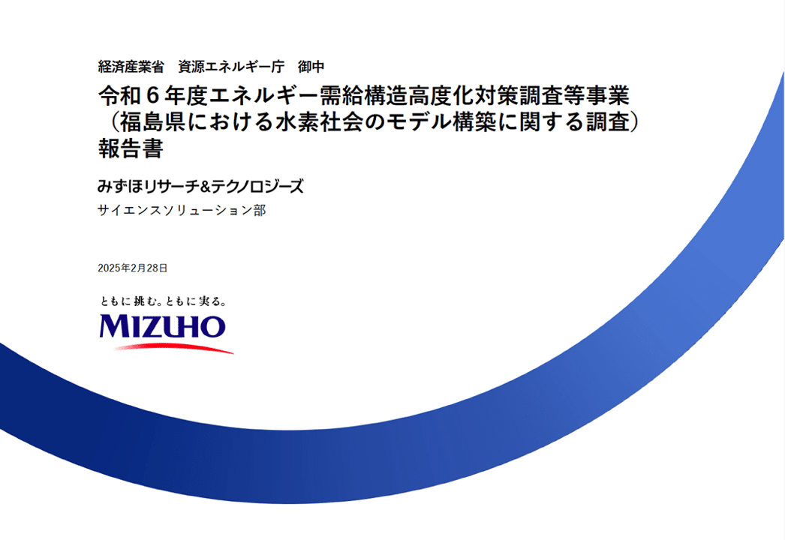
> 引用元：[> 令和６年度エネルギー需給構造高度化対策調査等事業（福島県における水素社会のモデル構築に関する調査）報告書](https://www.meti.go.jp/meti_lib/report/2024FY/000728.pdf)

*https://www.meti.go.jp/meti_lib/report/2024FY/itakuichiran2024FY.pdf*

### 目的と調査内容のスライド

目的と事業内容について３枚にわたって記載されたスライドです。本事業は過去数年間の調査を経て継続的に行われている事業のため、**目的と事業内容のスライドの間に、令和２年から令和５年までの過去の調査内容をまとめた**スライドがあるわけですね。

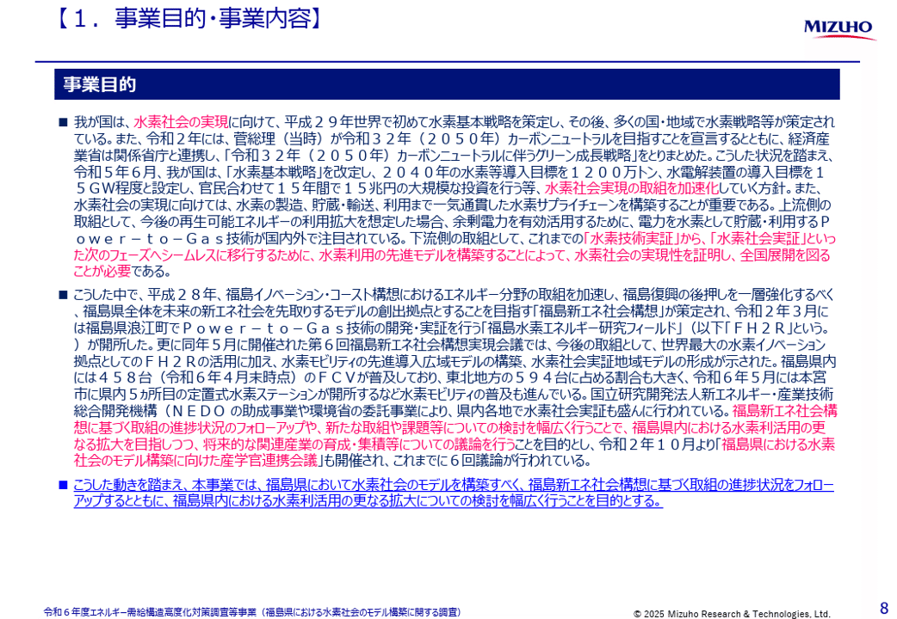

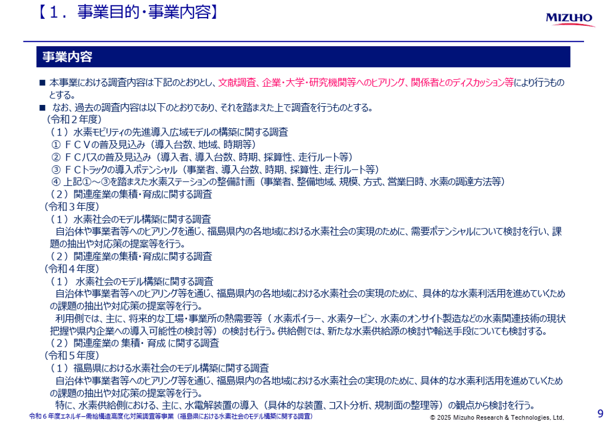

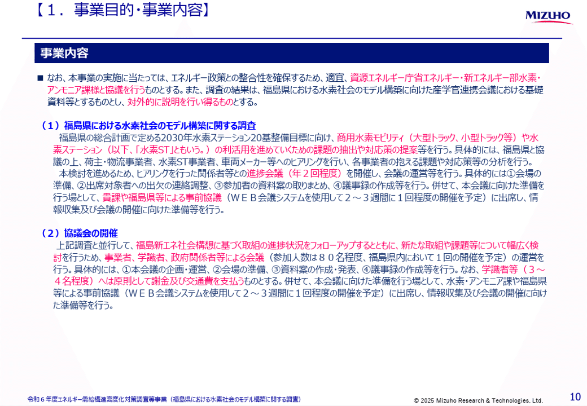
構成としては、上部にスライドタイトル、その下に「事業目的」などのボディタイトル、その下に「事業目的」の内容などのボディとなっています。

文字のハイライトには青色とピンク色が使われていますが、**サマリーやタイトルは青色、文字のハイライトはピンク色と使い分けられて**います。

### 事例調査結果のスライド

こちらの調査資料は、海外事例調査を行ったうえで、福島県の実態の分析と、実態を踏まえた提案という流れで構成されています。その中の事例調査結果のスライドです。

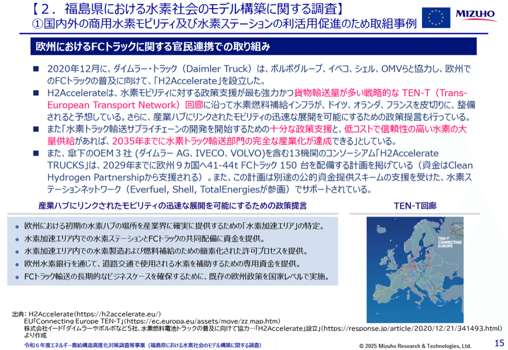

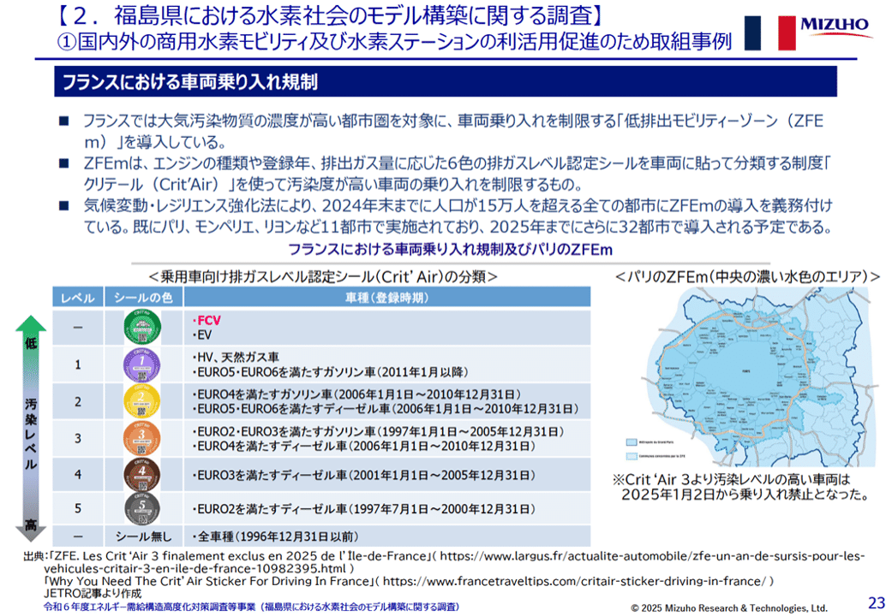
構造としては、上部にセクションタイトルとスライドタイトル、下にボディタイトルとサマリー、その下にファクトの引用となっています。
**ファクト部分はテキストでまとめているものや、表でまとめているもの、地図などのビジュアルでまとめているものなど様々**です。

### 分析内容のスライド

福島県における水素社会のモデル構築に関し、商用水素モビリティ及び水素ステーションの利活用の可能性を調査すべく、基本情報を整理し提案につなげています。
**エリアごとに交通量のデータ、物流拠点の位置などを整理したうえで、どのエリアがいいのか、仮説を立てている**わけですね。

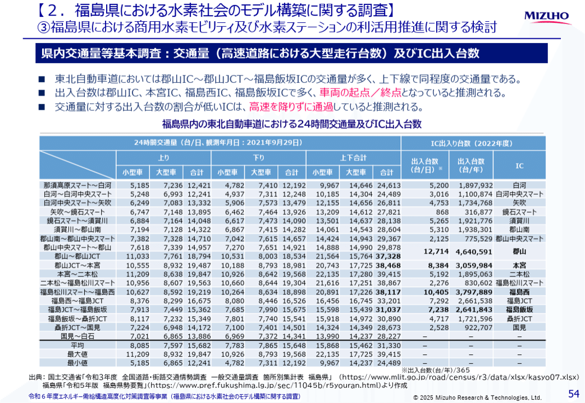

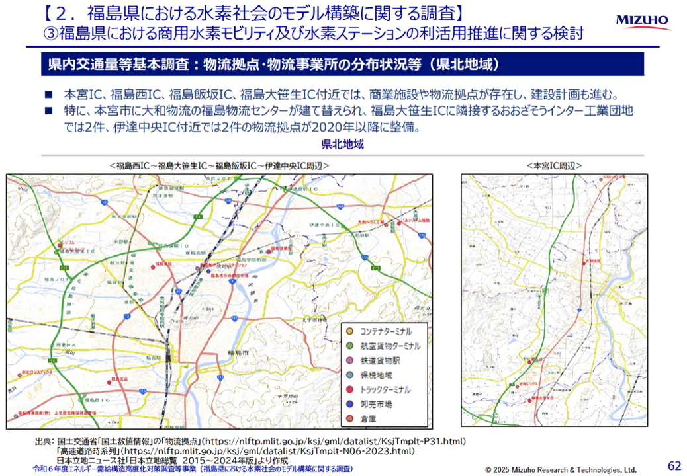

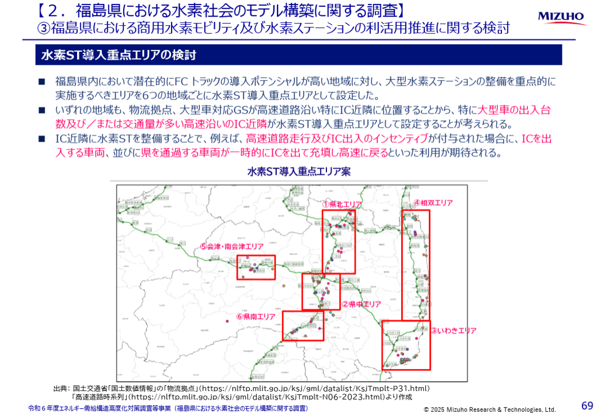
スライドの構成は、上部にチャプタータイトルとスライドタイトル、ボディにボディタイトルとスライドのサマリー、それに分析内容の詳細となっています。

サマリーの中でも強調したいテキストはピンク色の文字となっています。**水素ＳＴ導入重点エリアをどこにすべきか、またその利活用を促進する上でどのようなことが考えられるかがピンクで強調**されていますね。

### 課題整理のスライド

分析内容を踏まえて、福島県における商用水素モビリティや水素ステーションの利活用における課題を整理したスライドです。提言につなげる上での基礎となる非常に重要なスライドです。

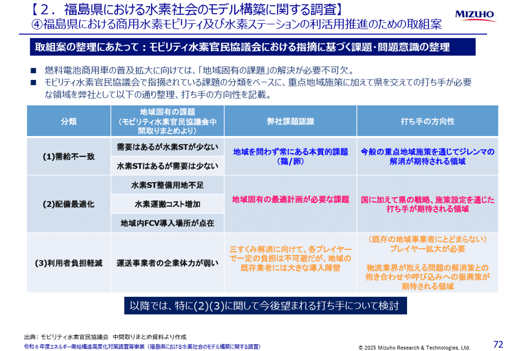
これまでと同じ構成でのスライドですが、サマリーページとして、課題の全体像と打ち手の方向性がまとまっています。**このページをまとめとして、表にある課題の詳細が一つ一つ説明**されていきます。

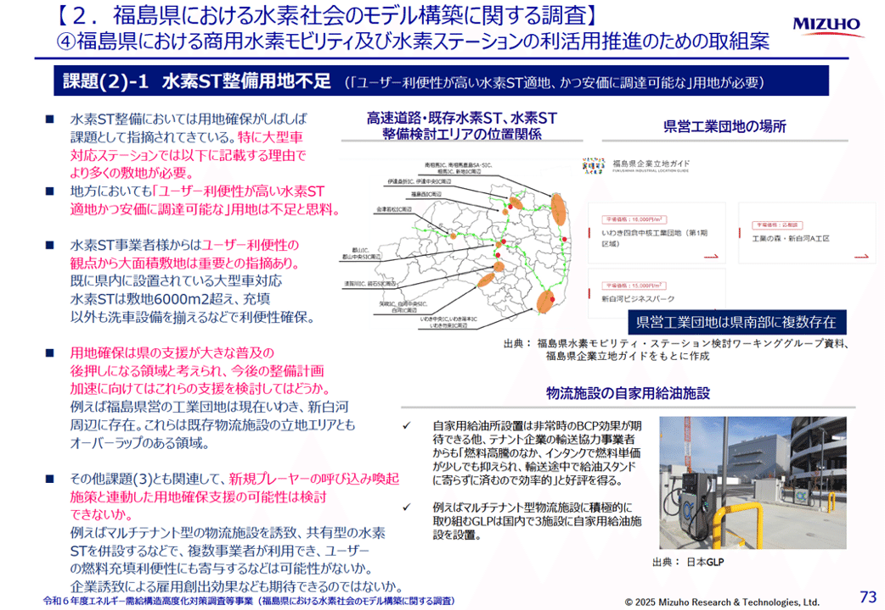
このスライドは少し構成が変わっていて、スライドのサマリーテキストがページの左半分に来て、縦長になっています。**５つのテキストがあるため、上部に置くとそれだけでボディの上半分を消費してしまう**ことから、あえてこのような構成にしていると考えられます。

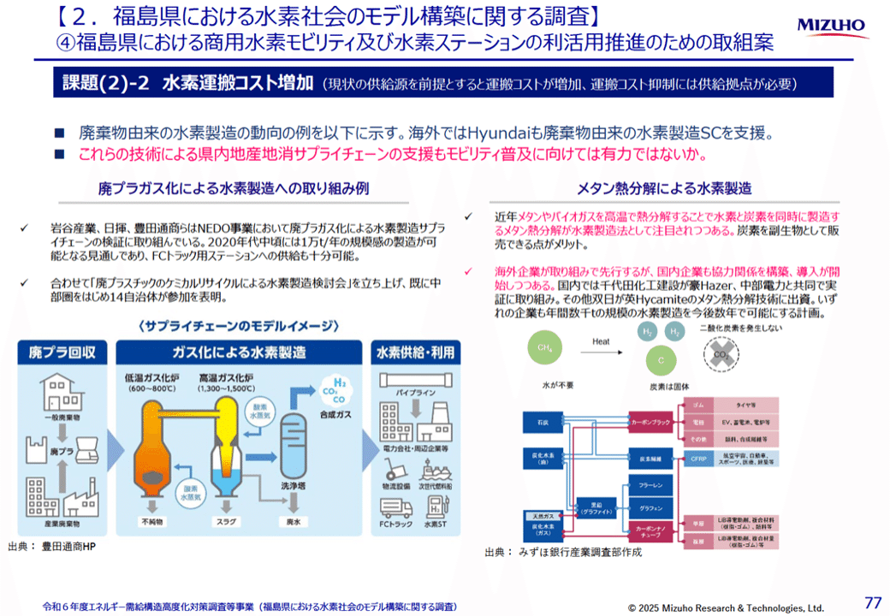
こちらのスライドでは、サマリーテキストが上部に戻っています。
ボディはすでに出来上がっているイメージ図を引用することで、あえて手間を掛けずともわかりやすく伝えることができています。

### 提案内容のスライド

最後に取組案をまとめたスライドです。
FCトラックと水素STについて、これまで整理した課題をまとめた上で、全体、国、福島県、ST事業者、OEM、ユーザーそれぞれ何をやっていくと、商用水素モビリティ及び水素ステーションの利活用が活性化するか、まとめています。

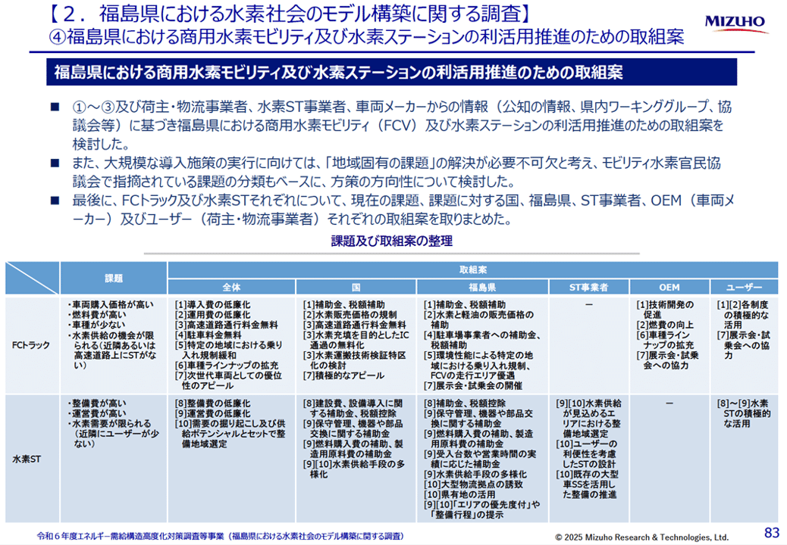

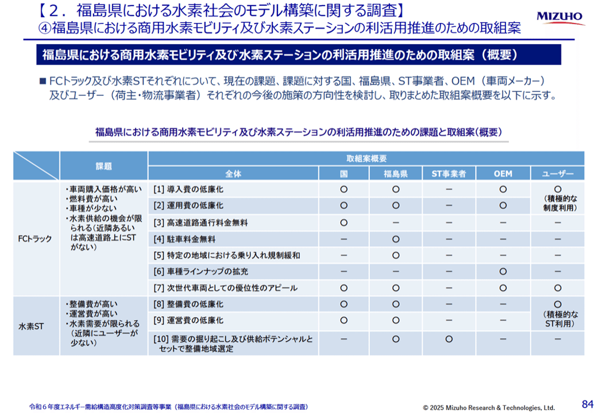
最後の表については、パワーポイントに標準で入っているテーブルを使っています。**シンプルなマルバツ表で、メリハリを示すよりは全体像が大事といったケースでは、標準のテーブルを使うのも手**ですね。

コンサルティングファームやシンクタンクへの転職を検討されている方は[こちら](https://www.career-adv.jp/lp/casual/?utm_source=note&utm_medium=referral&utm_campaign=note_pp)から。

## みずほ銀行の産業調査レポート

続いてみずほ銀行の産業調査レポートを見ていきましょう！「日本産業が直面する制約を乗り越えるために　～人口減少を好機ととらえ生産性向上へ～」のパワーポイントを見ていきます。

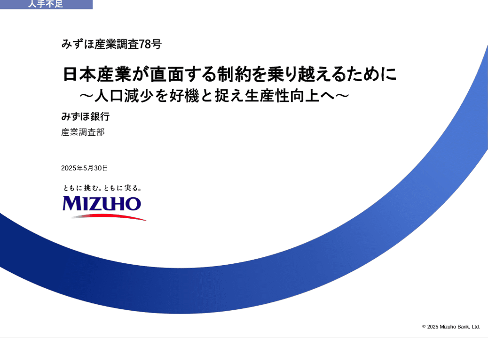
> 引用元：[> 日本産業が直面する制約を乗り越えるために　～人口減少を好機ととらえ生産性向上へ～](https://www.mizuhobank.co.jp/corporate/industry/sangyou/pdf/1078_all.pdf)

*https://www.mizuhobank.co.jp/corporate/industry/sangyou/m1078.html*

### レポートの全体像のスライド

パワーポイント全体の構成としては、「世界観」という全体像のスライドがあり、調査の前提条件、分析内容、分析結果、提案内容という流れになっています。
その最初のスライドが、**「明日の」日本産業に向けてトランスフォームを遂げるため、直面する制約を乗り越える必要**、というレポートの世界観をまとめたものです。

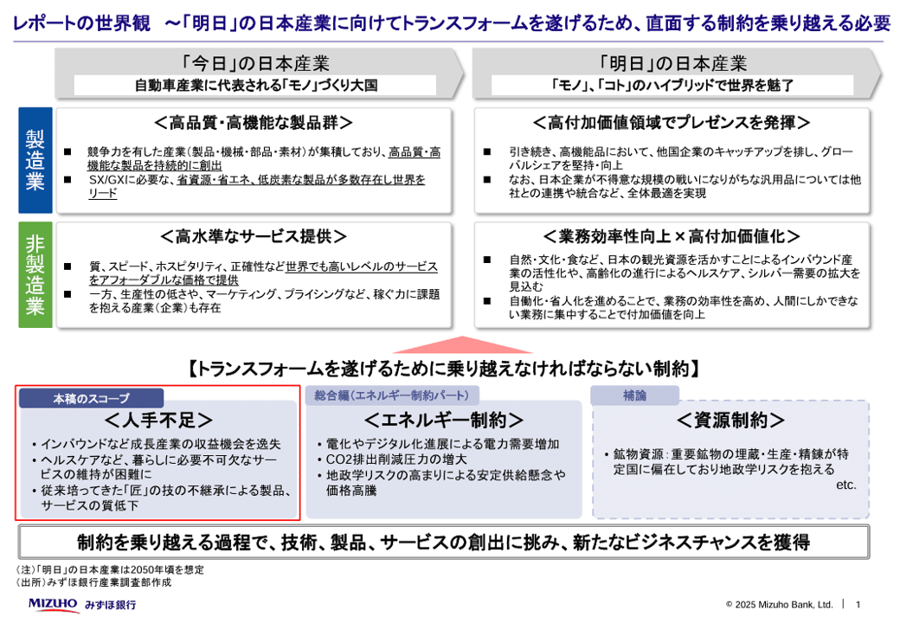
いわゆる調査の目的と概要といったまとめに近いスライドであり、スライドの構造もスライドタイトルとボディというシンプルなものになっています。
ボディについては、**ボックスによる表形式の構造**となっていますが、**「今日」「明日」と「製造業」「非製造業」の２×２のマトリックス**を使うといった工夫がみられます。

現状と将来のあるべき姿を示したうえで、そのギャップに対する課題を示すという構造はよくあるシンプルな構造ですが、製造業と非製造業の掛け算が合わさっていることで、少し構造が複雑になっています。

### 調査の前提条件のスライド

続いて前提条件のスライドです。ここからの分析について説明していく上で、読み手に前提を伝えるためのスライドなので、多少情報はビジーになっています。

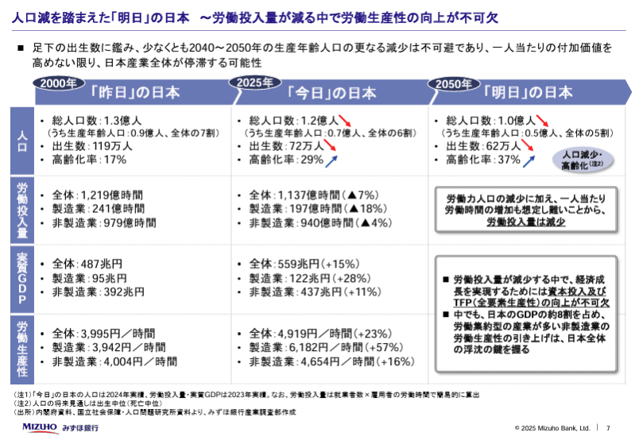
２５年ごとに、「昨日」「今日」「明日」に時間軸を分け、「人口」「労働投入量」「実質ＧＤＰ」「労働生産性」を数値で表しています。
ポイントとして、**今回の議論のメインである「今日」「明日」だけでなく「昨日」を入れる**ことで、２５年前と今がどのように変化しているのか、どのような未来が想定されるのか、わかりやすくしています。

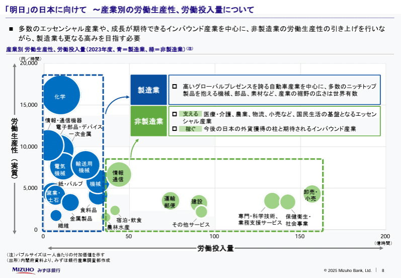
労働生産性と労働投入量を分けたマトリックスです。**労働投入量が大体４０億時間のあたりに製造業と非製造業の壁がある**ことが一目でわかる絵になっています。
逆に労働生産性については平均でいうと製造業の方が高いものの、いずれもばらつきがあり、産業によっては製造業の方が低いということもこの図を見ればわかるようになっています。

### 分析内容のスライド

ここからは分析内容のスライドです。人手不足の現状を把握したうえで、ロボットやAIがどのように人間のタスクを代替や補助してくれるかをまとめています。

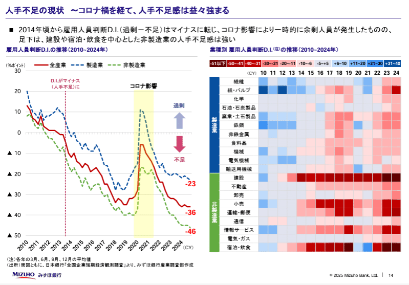
産業別の人手不足の現状を、製造業と非製造業という大分類と、より細かい産業別の小分類で見ています。**小分類については、インデックスを赤から青のグラデーションにしてヒートマップ的に見せています**が、有効なフォーマットなので覚えておくとよいでしょう。

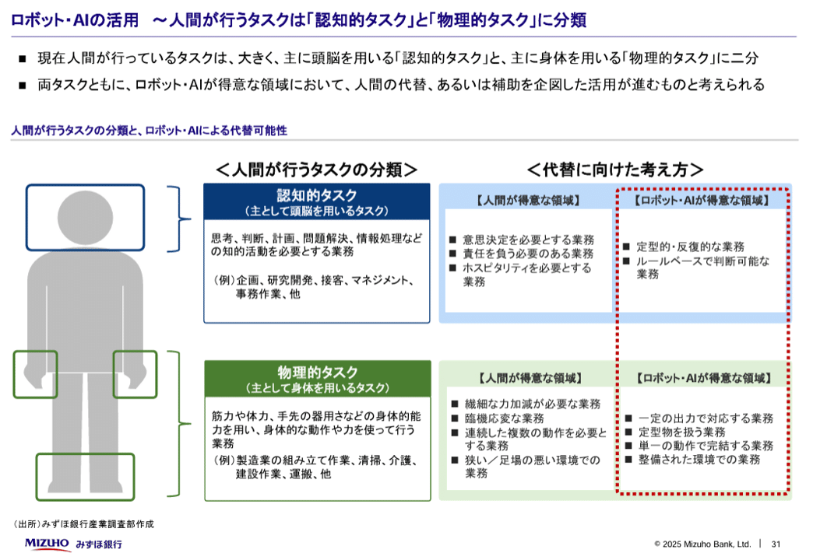
人間が行うタスクについて、どういったタスクがロボット・ＡＩが得意とするものか、イラストと表でまとめています。代替に向けた考え方は再びマトリックス的な構造で見せています。

### 分析結果のスライド

実際にロボットやＡＩによる代替可能性がどの程度あるのか、どういった産業で期待されるのかについて、分析結果をまとめています。

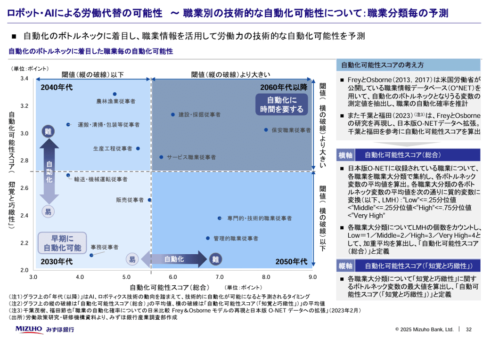

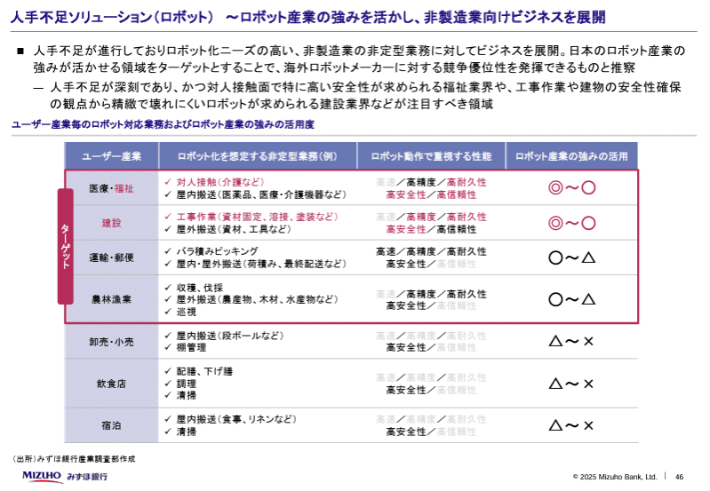
結果の部分なのでどうしてもテキストが多くなりますが、**マトリックスや表を使うことで見やすく**仕上げています。特にホットな領域は赤枠で囲ったうえで、さらに赤文字でも強調していますね。

### 提案内容のスライド

最後に提案内容です。世界の環境変化と日本の強みという、マクロ的な視点とミクロ的な視点を組み合わせたうえで、最終的に日本産業がとりうる戦略にまとめています。**構造的にどうしても複雑になるため、流れがわかりやすいようにタグや矢印を入れて**います。

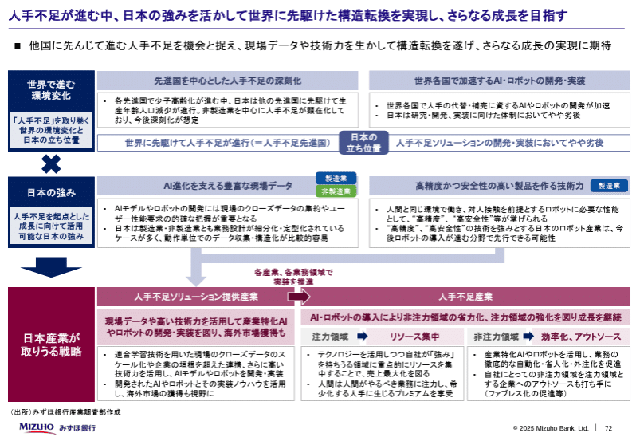

## みずほフィナンシャルグループのIR資料

最後にみずほ銀行のIRプレゼンテーションを見ていきましょう！「MIZUHO IR Day 2025」のパワーポイントを見ていきます。

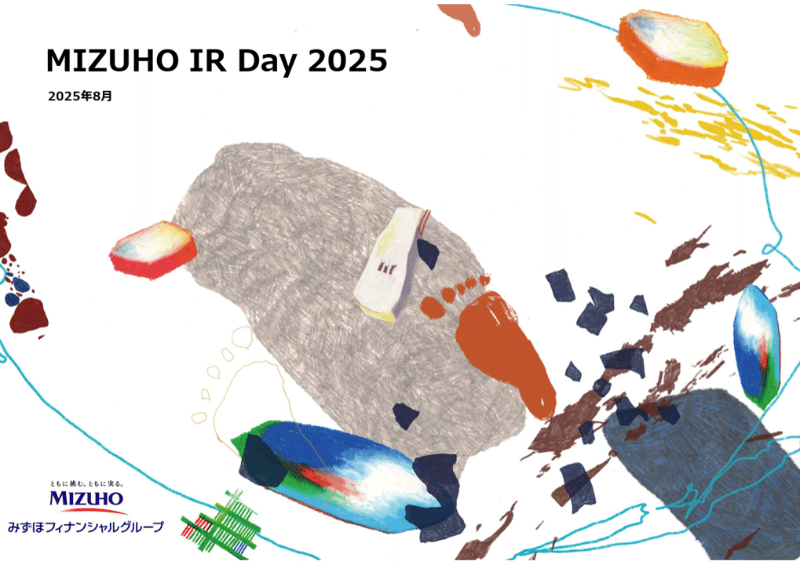
> 引用元：[> MIZUHO IR Day 2025](https://www.mizuho-fg.co.jp/investors/financial/briefing/pdf/20250825_1.pdf)

*https://www.mizuho-fg.co.jp/investors/financial/briefing/index.html*

### 事業目標のスライド

最初に事業目標のスライドです。PBR１倍を超えて企業価値を高めていくために、競合と比較した自社の現在地を明確にしたうえで、何をするかをまとめています。競合比較はROEとPERの2軸の散布図を使い、グローバルの競合名をプロットしています。
**ポイントとして、PBR1倍、1.25倍、1.5倍、2.0倍のラインを示すと同時に、目標にしているROE10％超のエリアの線を引く**ことで、自社のポジションと目指す位置がイメージしやすいようにしていますね。

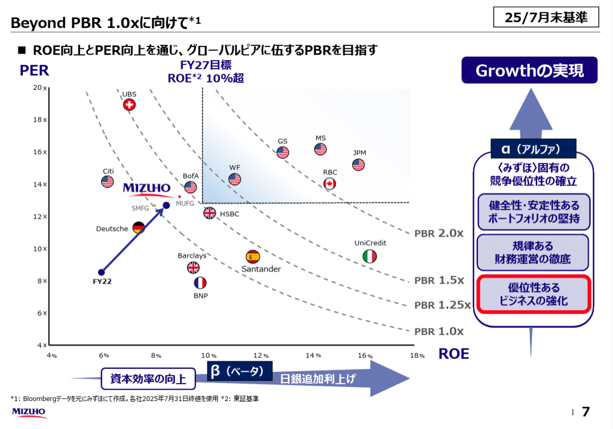

### 個人向けマスリテール部門のスライド

まずは個人向けマスリテール部門のスライドです。リテール・事業法人カンパニーとアセットマネジメントカンパニーの資料ですね。
基本構造は上部にタイトルとセクションのタグ、ボディは左右に分かれておりボディタイトルとボディとなっています。**ボディの中は、メッセージとサポートファクトを一つのブロックとして、それが何周かする構造です。**

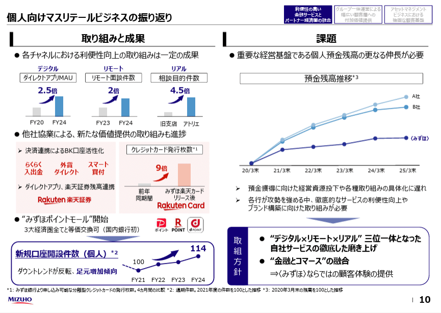
「各チャネルにおける利便性構造の取り組みは一定の成果」のテキストの後にサポートとなるグラフがあり、その下は「他社協業による、新たな価値提供の取り組みも進捗」のテキストの後にサポートとなるグラフがあります。

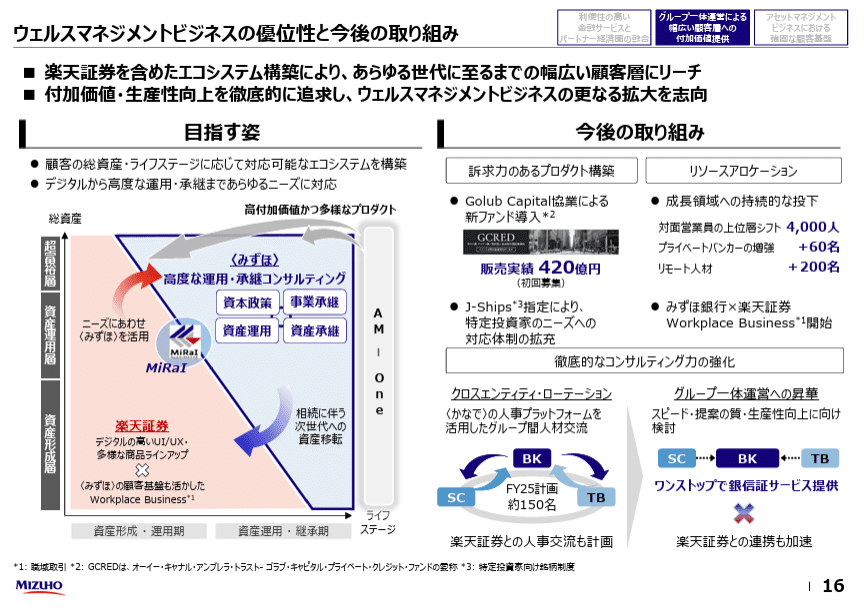

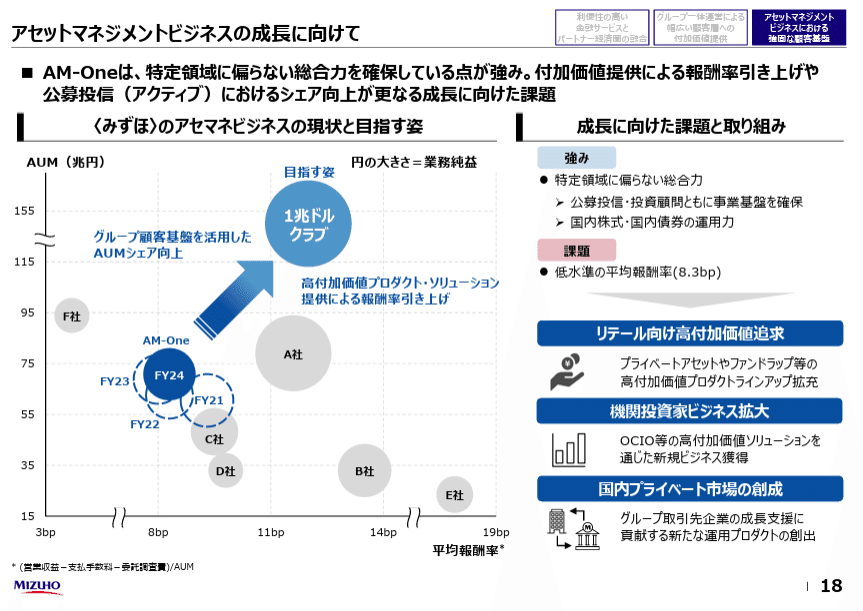

### 日本法人向け部門のスライド

続いて日本法人向け部門のスライドです。コーポレート＆インベストメントバンキングカンパニーとリテール・事業法人カンパニーの資料です。
構造は個人向けマスリテールと似ていますが、**上部右のレジェンドが先ほどのタグ形式から、ピラミッド形式**に変わっています。

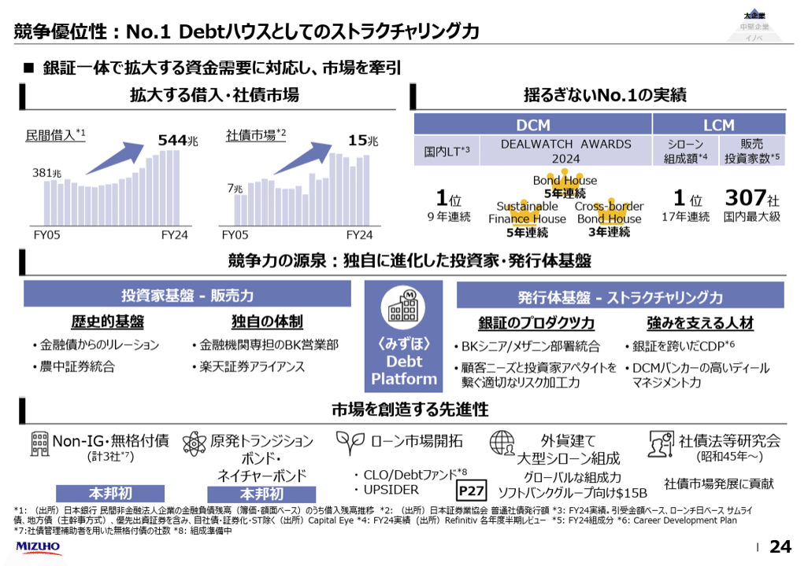

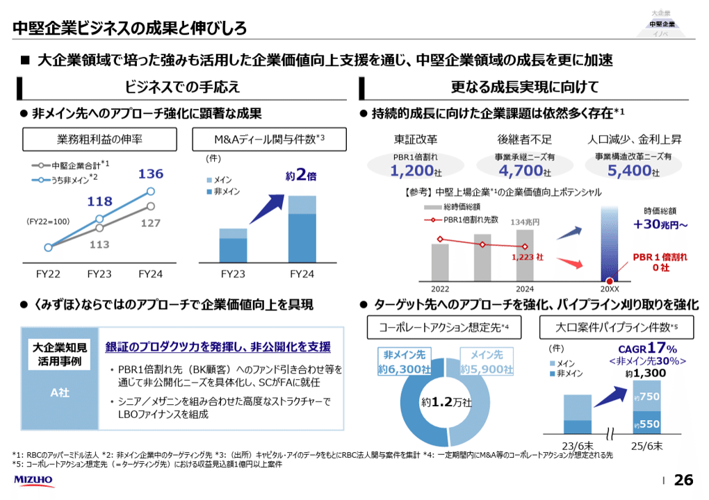

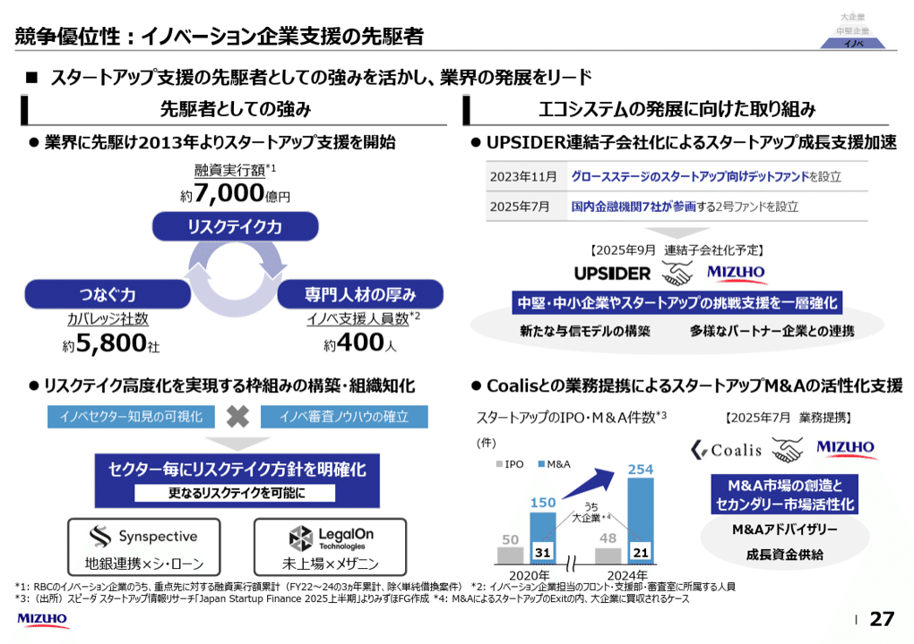

### 外国法人向け部門のスライド

最後に外国法人向け部門のスライドです。グローバルコーポレート＆インベストメントバンキングカンパニーとグローバルマーケッツカンパニーのスライドですね。今度は右上のレジェンドが矢羽型になっています。カンパニーによって微妙な違いがありますね。

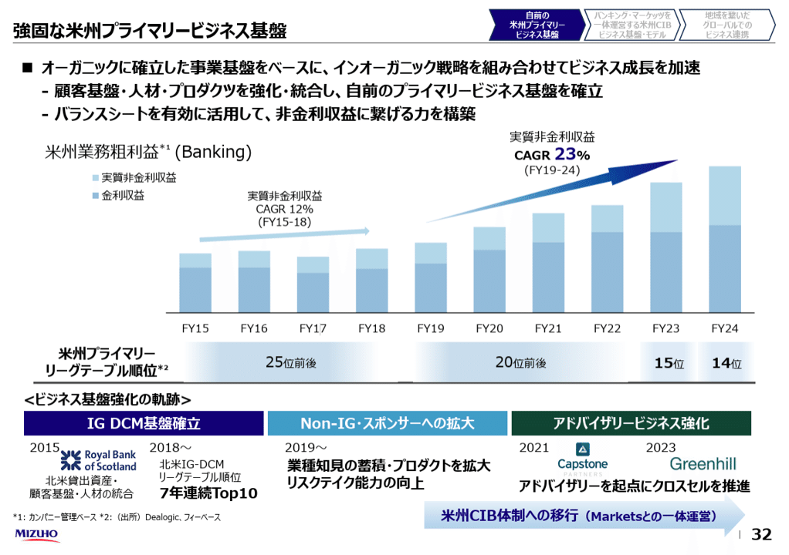

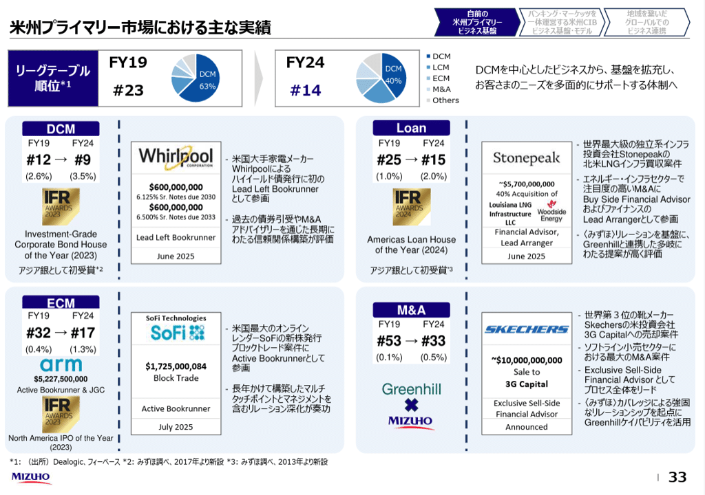
グローバルビジネスはチャレンジャーのポジションなので、これまでのようなスライドとはテイストの異なるスライドもあります。米州プライマリー市場における実績については、**着実にポジションを上げていることを、ランキングと実績で一つづつ示していますが、チャレンジャーとして前進しているのを見せる上ではとても良いフォーマット**ですね。

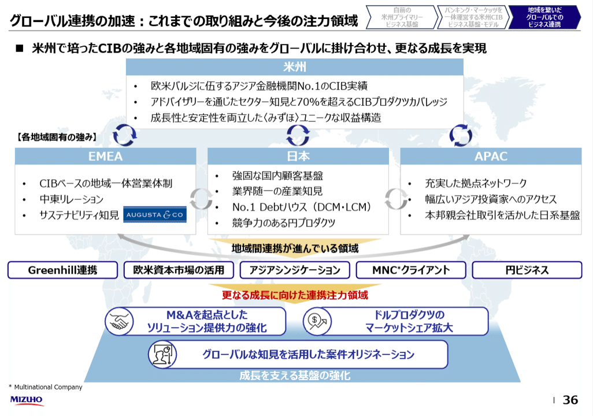

## メガバンクグループに転職を考えている方へ

パワポ研は株式会社レックスアドバイザーズが運営しています。
**レックスアドバイザーズはコンサルタントや会計経理人材の転職支援に強みを持つ転職エージェント**です。メガバンク系のコンサルティングファームやメガバンクへの転職を考えている方は、[無料相談フォーム](https://www.career-adv.jp/job_search/entryform_exp/?utm_source=note&utm_medium=referral&utm_campaign=note_pp)から相談してみてくださいね。

*レックスアドバイザーズのサービスサイトはこちら*

**> 求人紹介をご希望の方　**[> 無料転職サポート](https://www.career-adv.jp/job_search/entryform_exp/)**
> 採用支援をご希望の方　**[> 採用サポート](https://www.career-adv.jp/request3/)
**> その他　**[> お問い合わせフォーム](https://www.rex-adv.co.jp/contact)

## パワポ研オリジナルテンプレート

パワポ研では「ビジネスシーンで使える」パワーポイントテンプレートを公開しております。デザインを整えるのみならず、**ロジックやストーリーを整理するのにも役立つパッケージになっております**ので、関心のある方は下記ページも併せてご覧ください！

[
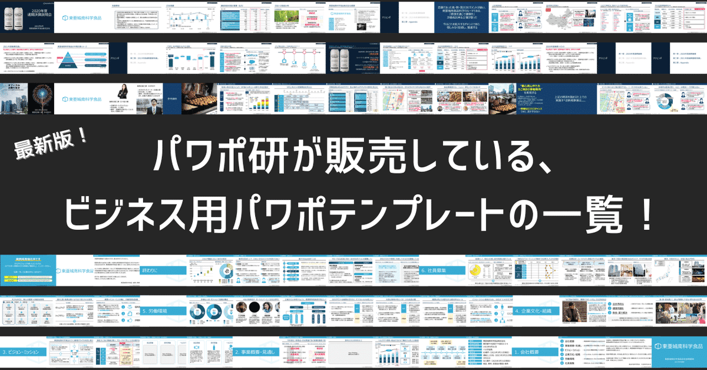
](https://note.com/powerpoint_jp/n/n7300a1293e8e)またパワポ研では、上記の記事のように、noteでは**フォローしているだけでビジネスにおける「資料作成のコツ」と「デザインのセンス」が身に付くアカウント**を目指して情報配信を行っています。
今後もコンスタントに記事を配信していく予定なので、関心のある方は是非アカウントのフォローをお願いします！

**> Template販売　**[> https://powerpointjp.stores.jp/](https://powerpointjp.stores.jp/%EF%BF%BCnote)
**> note　**[> パワポ研の資料作成術](https://note.com/powerpoint_jp/m/mc291407396da)
**> X（旧Twitter)　**[> https://twitter.com/powerpoint_jp](https://twitter.com/powerpoint_jp)
**> その他　**[> お問い合わせフォーム](https://www.rex-adv.co.jp/contact)
**> 書籍　**[> 注目企業の実例から学ぶパワポ作成術](https://www.amazon.co.jp/dp/4046060476)

