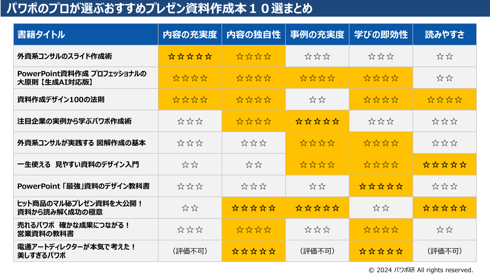
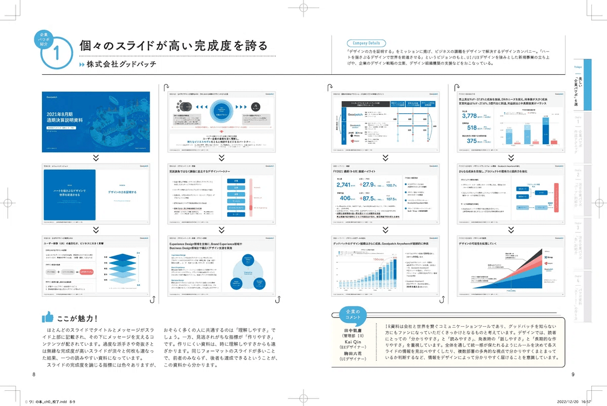
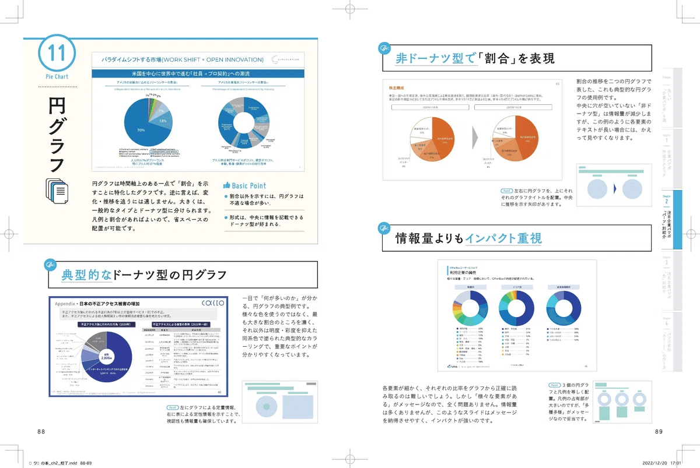

# パワポのプロが選ぶおすすめプレゼン資料作成本１０選 （2026年更新）

[note原文](https://note.com/powerpoint_jp/n/n2428839e0795)

みなさん、こんにちは。
パワーポイントの資料作成や、プレゼン資料のデザイン研究に取り組む、パワーポイントのスペシャリスト、パワポ研です。

今回は**「プロが選ぶおすすめパワポ資料作成本10選」**と題し、**パワーポイントのプレゼンテーション資料作成に関するおすすめ書籍**を紹介します。

*今回ご紹介する書籍の一覧*

パワポの資料作成スキルを上げるには、資料を作成すること（アウトプット）と、パワーポイントに関する書籍等から学ぶこと（インプット）の両方をバランスよく行うことが大切です。**プレゼン資料の作成をする機会は多いがスキルが不安、伸び悩んでいるといった方**は、インプットが足りていないかもしれないので、是非自分に合う一冊を見つけてくださいね。

なお今回は大きく、①総合的な書籍、②具体例重視の書籍、③特定ニーズ向けの書籍の３つに分けて紹介していきます。

- 総合的な書籍：パワーポイントによるわかりやすいプレゼン資料作成の考え方から、具体的なプレゼン資料のデザインまで、総合的にカバーしており、論理的あるいは体系的な学習が可能な書籍

- 具体例重視の書籍：具体的なプレゼン資料のデザイン例を多く入れ、プレゼン資料デザイン例から、パワポの資料作成方法を学ぶスタイルで、視覚的あるいは直感的な学習が可能な書籍

- 特定ニーズ向けの書籍：広告代理店のプレゼン資料デザインや、売れる営業資料の作り方など、パワポの資料作成の中でも特定の部分や用途に特化した書籍

なお今回ご紹介する１０の書籍はパワポ研の独断と偏見で、**「内容の網羅性」「内容の充実度」「事例の充実度」「学びの即効性」「読みやすさ」の５つの観点で評価**を行っておりますので、購入する際は参考にしてみてください。

- 内容の充実度：パワーポイントのプレゼン資料を作成する上で学ぶべき要素が体系的にカバーされているか、本質的な内容となっているか

- 内容の独自性：パワーポイントのプレゼン資料作成について学ぶうえで、その書籍からしか得られない内容があるか

- 事例の充実度：パワーポイントのプレゼン資料デザインを学ぶうえで、直感的に理解できるような具体例がどれだけ載っているか

- 学びの即効性：パワーポイントのプレゼン資料作成にすぐ活かせるレベルまで嚙み砕かれているか、すぐ資料作成に使えるTIPSに落ちているか

- 読みやすさ：プレゼン資料の作り方を学ぶ書籍として、どの程度読みやすいか

では早速行きましょう！

## パワポの資料作成における総合的な書籍

まずはパワポのプレゼン資料作成における教科書的な書籍から紹介していきます。教科書なので、そもそもプレゼン資料の作成とはといった考え方の部分から、具体的なパワポの資料デザインの話まで網羅している３冊です。

### 外資系コンサルのスライド作成術

 
[
**
外資系コンサルのスライド作成術―図解表現23のテクニック
**

www.amazon.co.jp

 
2,200円

(2026年02月05日 03:50時点
詳しくはこちら)

 
 
 
 

Amazon.co.jpで購入する

 
 
 
](https://www.amazon.co.jp/dp/4492557202?tag=note0e2a-22&linkCode=ogi&th=1&psc=1&language=ja_JP)

 
- 内容の充実度：☆☆☆☆☆　最低限これだけ読んでおけば大丈夫

- 内容の独自性：☆☆☆☆　　戦略コンサルによる資料作成書籍の走り

- 事例の充実度：☆☆☆　　　スライド例を参照しながら進めるスタイル

- 学びの即効性：☆☆☆　　　本質的な内容も多く体得には時間がかかる

- 読みやすさ　：☆☆　　　　文字が多く、読みやすいとは言えない

今回紹介の中で最もお勧めしたい一冊です。著者は戦略コンサルティングファーム出身の山口周氏ですが、ブーズ・アレン・ハミルトン、ボストン・コンサルティング、A. T. Kearney、ベイン・アンド・カンパニーと様々なファームを渡り歩いており、そのエッセンスが詰まっています。

**この一冊だけ読めば、パワポにおける資料の作り方はほぼ全て押さえることが出来る**と言っても過言ではありません。スライド資料作成の基本を第一章で伝えて、その後グラフやチャートの解説を実施したのちに、もうワンランクレベルを上げるための技法を段階的に解説してくれます。巻末の練習問題は好みが合えばこなすとよいでしょう。

問題は、**文章量が多く少し読みこなすのに時間がかかる**こと。図表も豊富と言えば豊富なのですが、いかんせん情報量が多い。パワポのプレゼン資料作成にこれから挑戦するぞ！という人の初めての一冊としては少しおすすめしづらいかもしれません。多少パワーポイントを触っている学生や社会人一年目の方が、時間があるときにゆっくり読むべき本という位置づけですかね。

### PowerPoint資料作成 プロフェッショナルの大原則 【生成AI対応版】

 
[
**
PowerPoint資料作成 プロフェッショナルの大原則 【生成AI対応版】
**

www.amazon.co.jp

 
2,970円

(2026年04月29日 23:19時点
詳しくはこちら)

 
 
 
 

Amazon.co.jpで購入する

 
 
 
](https://www.amazon.co.jp/dp/4297146371?tag=se&linkCode=ogi&th=1&psc=1&language=ja_JP)

 
- 内容の充実度：☆☆☆☆　　充実の600ページ

- 内容の独自性：☆☆☆☆　　生成AI特集あり

- 事例の充実度：☆☆☆☆　　ビフォーアフターが充実

- 学びの即効性：☆☆☆☆　　ダウンロード特典あり

- 読みやすさ　：☆☆　　　　もはや辞書のボリューム

今回紹介の中で最も内容の網羅性が高い一冊です。著者はモニターグループ（日本法人撤退前）出身で、独立してコンサルティングを行っている松上純一郎氏です。

もはや図鑑ともいえる600ページの超大作で、生成AI関連のページあり、ダウンロード特典ありと、非常に有用な書籍ですね。現状、**パワポのプレゼン資料作成に関する書籍で、資料の作り方の基礎を学べたうえでAIでの資料作成まで学べる書籍**はほとんどないので、その点でも稀有な書籍といえます。

問題は、やはり量が非常に多いこと。書籍を端から端まで読もうとすると最後まで読み切れない分量なので、ある程度パワポの資料作成の基礎ができていて、資料作成に悩んだタイミングで使うという使い方がおすすめです。

### 資料作成デザイン100の法則

 
[
**
資料作成デザイン100の法則
**

www.amazon.co.jp

 
1,870円

(2026年04月29日 23:28時点
詳しくはこちら)

 
 
 
 

Amazon.co.jpで購入する

 
 
 
](https://www.amazon.co.jp/dp/4800593581?tag=se&linkCode=ogi&th=1&psc=1&language=ja_JP)

 
- 内容の充実度：☆☆☆☆　　資料作成の基本が一通り学べる

- 内容の独自性：☆☆☆☆　　社内向けと社外向けの違いなど

- 事例の充実度：☆☆　　　　グラフやビジュアルのパートは少なめ

- 学びの即効性：☆☆☆☆　　ダウンロード特典あり

- 読みやすさ　：☆☆☆☆　　ライトで読みやすい

コンサル目線の２冊に対し、事業会社目線で作成された良本です。著者の前田鎌利氏はソフトバンクグループ出身で、孫正義社長の前でプレゼンをしたことがある、ということを売りにしています。大事なのは、プレゼンを「したことがある」ということではなく、プレゼンを「何度もできた」ほど資料が洗練されているということ。立場が上の人間ほど時間がなく、孫正義社長はその最たる例です。エレベータートークとはよく言いますが、**時間がない中で必要十分な情報を伝え、意思決定を促すのはプレゼン作成の技術の見せどころ**です。

過去に出版され、パワポ研でも取り上げていた「社内プレゼンの資料作成術」と「社外プレゼンの資料作成術」を合体させた集大成のような資料です。第一章で**「そもそもプレゼン資料の作り方とは」ということを約30ページにわたって述べている点**は変わりません。他の多くの書籍は「余白がどう」「色使いがどう」というデザインに尖って説明がされますが、本書では「そもそも資料としてどうあるべきか」ということを解説してくれます。資料作成に慣れていない方も、自分で「出来ている気がする人」も一度立ち止まってしっかりと読み砕けば、必ず血肉になるでしょう。

 
[
**
社内プレゼンの資料作成術【完全版】
**

www.amazon.co.jp

 
1,980円

(2025年09月09日 16:18時点
詳しくはこちら)

 
 
 
 

Amazon.co.jpで購入する

 
 
 
](https://www.amazon.co.jp/dp/447811515X?tag=note0e2a-22&linkCode=ogi&th=1&psc=1&language=ja_JP)

 
 
[
**
社外プレゼンの資料作成術【完全版】
**

www.amazon.co.jp

 
1,980円

(2025年09月09日 16:19時点
詳しくはこちら)

 
 
 
 

Amazon.co.jpで購入する

 
 
 
](https://www.amazon.co.jp/dp/4478115141?tag=note0e2a-22&linkCode=ogi&th=1&psc=1&language=ja_JP)

 
一方、上記で述べたような**細かいデザインに関しては若干情報量に乏しい**ので、そこは別の本で補完が必要です。また、実際のパワーポイントの画面で説明してくれるわけではないので、そこの理解もすこし手間がかかるかもしれません。ただし今回の書籍では、「マネするだけ！ 作例集」の付録が添付されており、すぐ使えるテンプレートが入っています。

## パワポの資料作成における具体例重視の書籍

ここからは、パワポのプレゼン資料デザインにおける具体例に軸を置いた書籍を紹介していきます。様々なデザインを見て引き出しを増やしたい方、すぐ使えるTIPSを学びたい方向けの書籍です。最初に出てきた総合的な書籍を補完する書籍としてもよいですよ。

### 注目企業の実例から学ぶパワポ作成術

 
[
**
注目企業の実例から学ぶパワポ作成術
**

www.amazon.co.jp

 
1,980円

(2023年01月29日 13:09時点
詳しくはこちら)

 
 
 
 

Amazon.co.jpで購入する

 
 
 
](https://www.amazon.co.jp/dp/4046060476?tag=note0e2a-22&linkCode=ogi&th=1&psc=1&language=ja_JP)

 
- 内容の充実度：☆☆☆　　　教科書的な解説は少なめ

- 内容の独自性：☆☆☆☆　　実際の企業のIR資料を題材としている

- 事例の充実度：☆☆☆☆☆　実際の企業のIR資料を題材としている

- 学びの即効性：☆☆☆　　　事例中心なので参考となるデザイン多数

- 読みやすさ　：☆☆☆　　　画像中心なので比較的読みやすい

パワポ研で執筆した書籍です。パワポ研は様々なパワーポイントの研究をしたり、書籍を読んだりしていますが、**実際にIRの第一線で使われているプレゼン資料に触れられる書籍**が少ないと感じたことから、本書の執筆に至りました。

本書の特徴として、プレゼン資料作成に優れた上場企業が公開しているパワーポイント資料を例に解説を行っています。スライドの目的や、スライドのパーツ、スライドの配色など、様々な切り口からプレゼン資料のデザインを紹介しているので、自分の中のパワポの資料作成の引き出しを増やしたい方にはもってこいの書籍といえますね。

### 外資系コンサルが実践する 図解作成の基本

 
[
**
外資系コンサルが実践する 図解作成の基本
**

www.amazon.co.jp

 
3,080円

(2026年04月29日 23:36時点
詳しくはこちら)

 
 
 
 

Amazon.co.jpで購入する

 
 
 
](https://www.amazon.co.jp/dp/4799106511?tag=se&linkCode=ogi&th=1&psc=1&language=ja_JP)

 
- 内容の充実度：☆☆☆　　　図解の資料デザインに特化

- 内容の独自性：☆☆☆　　　図解キューブというオリジナルモデル

- 事例の充実度：☆☆☆☆　　ビフォーアフターの例が充実

- 学びの即効性：☆☆☆☆　　プレゼン資料デザインのHowが詰まっている

- 読みやすさ　：☆☆☆　　　画像中心なので比較的読みやすい

外資系コンサルティングファームで勤務されている吉澤準特氏の書籍です。外資系コンサルティングファームがどのファームなのかはオープンにされていないようです。とはいえ2010年代からたくさんのビジネス書を執筆されており、外資系コンサルが作成する資料作成の基本といった書籍もあります。

 
[
**
外資系コンサルが実践する 資料作成の基本 パワーポイント、ワード、エクセルを使い分けて「伝える」→「動かす」王道70
**

www.amazon.co.jp

 
2,200円

(2026年04月30日 17:51時点
詳しくはこちら)

 
 
 
 

Amazon.co.jpで購入する

 
 
 
](https://www.amazon.co.jp/dp/4820748998?tag=note0e2a-22&linkCode=ogi&th=1&psc=1&language=ja_JP)

 
内容としては、図解キューブという理論で、パワポのプレゼン資料デザインを整理し、資料作成におけるデザインのノウハウを整理しています。それぞれの項目でビフォーアフターをしっかり見せてくれるので、初心者がすぐに活用できる、即効性の高い書籍といえます。一方でデザインに関しては非常に広さと深さ両方の観点でレベルが高く、図形がそれぞれどのような意味を持っていてどのようなデザインに役立つのかといった話もあります。

### 一生使える　見やすい資料のデザイン入門

 
[
**
一生使える 見やすい資料のデザイン入門
**

www.amazon.co.jp

 
1,870円

(2025年02月02日 15:03時点
詳しくはこちら)

 
 
 
 

Amazon.co.jpで購入する

 
 
 
](https://www.amazon.co.jp/dp/484433963X?tag=note0e2a-22&linkCode=ogi&th=1&psc=1)

 
- 内容の充実度：☆☆　　　　情報自体は一般的

- 内容の独自性：☆☆　　　　情報自体は一般的

- 事例の充実度：☆☆☆☆　　全編ビフォーアフター

- 学びの即効性：☆☆☆☆　　すぐ使えるTIPS多数

- 読みやすさ　：☆☆☆☆☆　全編ビフォーアフターで読みやすい

教育工学や認知科学の知見がベースとなっている、プレゼン資料作成の書籍としては珍しい出で立ちの書籍です。著者の森重湧太氏が作成した「プレゼン資料作成ノウハウ」の資料がバズったことがきっかけになっており、森重氏はスマートキャンプの運営する法人向け資料作成代行サービス「SKET」の運営にも携わっています。

特徴はとにかく読みやすく、すぐに使えるノウハウがたくさん入っている点です。すべての項目がビフォーアフターで説明されており、かつ極めてシンプルです。
具体的な事例を扱ったというよりは、**「ここが悪いスライド」を良くしました、という体裁**で書かれているので、具体的にどういうスライドが悪くて、それをどう改善するのかが非常に分かりやすく記載されています。パワポ資料作成の初心者が陥りやすい間違いを細かく解説してくれている、という印象です。

一方で、初学者向けということで**情報量としては、中・上級者にとっては少し不足する**かもしれません。なので、まず一冊この本を使って目に付きやすい弱点をつぶして、もっと細かいルールが記載されている書籍にステップアップ、というやり方がよいのではないでしょうか。もちろん、いつでもこの本に立ち戻っても構わないと思います。タイトルの「一生使える」は伊達ではありません。

## パワポの資料作成の特定ニーズに向けた書籍

ここからは、パワポのプレゼン資料作成の中でも、特に一部のニーズや用途に特化した書籍を紹介していきます。特化しているだけあって、深い知見が得られること間違いなしです。

### PowerPoint 「最強」資料のデザイン教科書

 
[
**
PowerPoint 「最強」資料のデザイン教科書
**

www.amazon.co.jp

 
2,970円

(2026年04月29日 23:32時点
詳しくはこちら)

 
 
 
 

Amazon.co.jpで購入する

 
 
 
](https://www.amazon.co.jp/dp/4297123576?tag=se&linkCode=ogi&th=1&psc=1&language=ja_JP)

 
- 内容の充実度：☆☆☆　　　パワポの資料作成におけるデザインに特化

- 内容の独自性：☆☆☆　　　細かいTIPSがあるがメインはパワポの話

- 事例の充実度：☆☆　　　　細かいテクニックの話も多い

- 学びの即効性：☆☆☆☆☆　TIPS多数

- 読みやすさ　：☆☆☆　　　読みやすいがややマニアよりのテーマも

タイトルの通り、資料作成全般ではなく、パワーポイントの資料作成におけるプレゼン資料デザインに特化した資料です。著者は日本IBMにて提案書作成の部門をリードする福元雅之氏です。

パワーポイントの資料作成に特化しているだけあって、スライドマスターの話が１章分あるほか、「段落前後間隔」「禁則処理」など、パワーポイントの機能の話もバンバン出てきます。読むことで間違いなくパワーポイントを使ってのデザインスキルは上がるので、パワーポイントのスキルを上げたいというニーズにはストレートのマッチするはずです。

### ヒット商品のマル秘プレゼン資料を大公開！資料から読み解く成功の極意

 
[
**
ヒット商品のマル秘プレゼン資料を大公開! -資料から読み解く成功の極意-
**

www.amazon.co.jp

 
1,760円

(2025年09月09日 16:25時点
詳しくはこちら)

 
 
 
 

Amazon.co.jpで購入する

 
 
 
](https://www.amazon.co.jp/dp/4295005916?tag=note0e2a-22&linkCode=ogi&th=1&psc=1&language=ja_JP)

 
- 内容の充実度：☆☆　　　　資料の紹介

- 内容の独自性：☆☆☆☆☆　他では見ることのできない資料に触れられる

- 事例の充実度：☆☆☆☆☆　事例集

- 学びの即効性：☆☆　　　　参考にはなるが、活かせるかどうかは別

- 読みやすさ　：☆☆☆☆☆　プレゼン資料の紹介なので読みやすい

有名企業のプレゼン資料を取り扱っている書籍ですが、パワポ研の書籍とは異なり、これまで社外に出ることが無かったプレゼン資料を扱っているという点で、唯一無二の書籍です。著者が取材を行って、ヘルシオやアイスの実といった商品のプレゼン資料を紹介しています。

構成としては、全１７社のプレゼン資料を記載し、その中で特に意識して作成したスライドがどのように生まれたか、そしてどうスライドという形式に落とし込まれたかを解説したもの。要すれば、**本科的な資料の作り方を具体例を用いて紹介している**という書籍です。

また、プレゼン資料に出てくる企業も、JALやソニーやリコーなど日本を代表する企業ばかりなので、都合の良い資料のみをピックアップしたというわけではありません。いずれもヒット商品（あるいは、それに近い）ものを紹介しておりますので、良いプレゼン資料の好例と断言できます。

ネットにはプレゼン資料を集めたというサイトはよくあります（パワポ研もその一つ）が、ここまで作り方の背景まで細かく説明したというサイトは私は見たことがありません。**関係者にまでインタビュー出来ている**ので、臨場感は並みではありません。

### 売れるパワポ　確かな成果につながる！営業資料の教科書

 
[
**
売れるパワポ　確かな成果につながる！営業資料の教科書
**

www.amazon.co.jp

 
2,134円

(2026年04月29日 23:13時点
詳しくはこちら)

 
 
 
 

Amazon.co.jpで購入する

 
 
 
](https://www.amazon.co.jp/dp/B0FNCS9H6Y?tag=se&linkCode=ogi&th=1&psc=1&language=ja_JP)

 
- 内容の充実度：☆☆☆　　　パワポの営業資料作成に特化

- 内容の独自性：☆☆☆☆　　もはや経営の話も含んでいる

- 事例の充実度：☆☆☆　　　どちらかというとノウハウより

- 学びの即効性：☆☆☆☆　　使えるノウハウやTIPS多数

- 読みやすさ　：☆☆　　　　ライトに見えて文字が多め

パワポのプレゼン資料作成の中でも、特に**営業資料の作成に特化した書籍**です。他の資料にはない、顧客を理解するというチャプターや、営業資料を使って組織を変革するといったチャプターがあり、マーケティングや組織論のような話まで入っているのが特徴です。

多くのパワポの資料作成書籍では、「いきなり作らず、まずはストーリーを考えましょう」となりますが、本書籍では「提案資料を作る前に顧客を理解しましょうね」と来ます。営業資料作成という文脈では最も本質的な指摘といえますね。最初に顧客理解のフレームワークがあり、そのあとに営業資料作成のフレームワークが来るため、即効性も高い資料となっています。

### 電通アートディレクターが本気で考えた！美しすぎるパワポ

 
[
**
電通アートディレクターが本気で考えた！美しすぎるパワポ
**

www.amazon.co.jp

 
2,420円

(2026年04月29日 23:12時点
詳しくはこちら)

 
 
 
 

Amazon.co.jpで購入する

 
 
 
](https://www.amazon.co.jp/dp/4594093132?tag=se&linkCode=ogi&th=1&psc=1&language=ja_JP)

 
- 内容の充実度：　　　　　　評価困難

- 内容の独自性：☆☆☆☆☆　アートディレクターのデザインが手に入る

- 事例の充実度：　　　　　　評価困難

- 学びの即効性：☆☆☆☆☆　そのまま使える

- 読みやすさ　：　　　　　　評価困難

もはや書籍として消化していいのか？という気もしますが、今まで上げてきた書籍で、パワポのプレゼン資料デザインの話は網羅的にカバーできていることから、最後は変わり種の書籍を紹介します。

著者は電通クリエイティブ部門の現役アートクリエイター10名で、**現役のアートディレクターが本気で考えたパワーポイントの資料テンプレートがダウンロードできる書籍**です。テンプレートは全10種122スライドです。

CANVAで無数のテンプレートにアクセスできるようになった今だからこそ、アートディレクターが本気で作ったテンプレートを見て、違いを学ぶ必要があるのかもしれません。ただ正直、消費財の新商品のプレゼン資料とかそのレベルでなければ、CANVAで事足りてしまうのかもしれません。
いずれにせよ、**テンプレートそのものが欲しい方もそうですが、プロのデザインを学びたい方におススメの一冊**です。

## パワポのプロが選ぶおすすめプレゼン資料作成本１０選まとめ

最後に、紹介してきた書籍の評価一覧を掲載します。最初に記載の通り、パワポ研の独断と偏見によるものですので、異論はあると思います。
いずれも誰かに必要な本と思いますので、値段はあえて記載しません。
こと**パワーポイントにおいては基本的な考え方やデザインのストックは早めに習得しておいた方が加速度的な成長につながる**ので、気になるものがあればなるはやで手に取ってみるとよいでしょう。

*パワポ研による各書籍の評価*

**これ一冊で全てをカバーできる、という書籍は当たり前ですが存在しません**。よしんばそういう書籍があったとしても、検索性に欠けるはずで、実用にはほど遠くなります。また、読み手のニーズに答えられるページはごく少なくなります。そういう意味でも、自分にあった書籍を選ぶのが大切なのです。まずは総合的な書籍を１冊と行きたいですが、手に取ってみてハードルが高いようであれば、具体例重視の書籍から入るのも手ですし、それらを併用するのも手です。

## パワポ研が制作したおすすめ書籍

最後に改めて、パワポ研がKADOKAWA様から出版している「注目企業の実例から学ぶパワポ作成術」という書籍を紹介させてください！
**2023年に出版した本ですが、今なお多くの方のパワポの資料作成に役立てて頂き、2025年11月に再び重版**して第４刷となりました。

実際に多くの上場企業のIR部門に使用利用の許諾を取って作成した書籍となっており、今なお類似の書籍はないのではと思います。パワーポイントのプレゼン資料作成のレベルアップに向けて引き出しを増やしたい、IRに挑戦していく上で様々な事例を学びたいといった方は是非手に取っていただければと思います。

 
[
**
注目企業の実例から学ぶパワポ作成術
**

www.amazon.co.jp

 
1,980円

(2023年01月29日 13:09時点
詳しくはこちら)

 
 
 
 

Amazon.co.jpで購入する

 
 
 
](https://www.amazon.co.jp/dp/4046060476?tag=note0e2a-22&linkCode=ogi&th=1&psc=1&language=ja_JP)

 

*ページサンプル：企業別ページ*

*ページサンプル：タイプ別ページ*

またパワポ研ではテーマ別のおすすめスライド事例をたくさん紹介しているので、気になる方はこちらのまとめページを見てみてくださいね。Note内のストアにはそのまま使えるテンプレートなども用意しています。

**> Template販売　**[> https://powerpointjp.stores.jp/](https://powerpointjp.stores.jp/%EF%BF%BCnote)
**> note　**[> パワポ研の資料作成術](https://note.com/powerpoint_jp/m/mc291407396da)
**> X（旧Twitter)　**[> https://twitter.com/powerpoint_jp](https://twitter.com/powerpoint_jp)
**> その他　**[> お問い合わせフォーム](https://www.rex-adv.co.jp/contact)

## レックスアドバイザーズからのお知らせ

パワポ研は株式会社レックスアドバイザーズが運営しています。
レックスアドバイザーズは**経営企画職や経営管理職に特化した転職エージェント**です。
上場企業や上場準備企業を中心に、**経営企画、IR、経理財務、法務、内部監査等の職種の求人**をご紹介しているほか、**CFOなどのコンフィデンシャル求人**もご紹介可能です。
またコンサルティングファームや監査法人、会計事務所の求人も豊富にあるため、プロフェッショナルファームを目指す方のご支援も得意です。
求人紹介やキャリア相談を希望の方は、[**無料転職サポート**](https://www.career-adv.jp/job_search/entryform_exp/)よりサービス利用登録をしてみてください。

*レックスアドバイザーズのサービスサイトはこちら*

**> 求人をご希望の方　**[> 無料転職サポート](https://www.career-adv.jp/job_search/entryform_exp/)**
> 採用支援をご希望の方　**[> 採用サポート](https://www.career-adv.jp/request3/)
**> その他　**[> お問い合わせフォーム](https://www.rex-adv.co.jp/contact)

