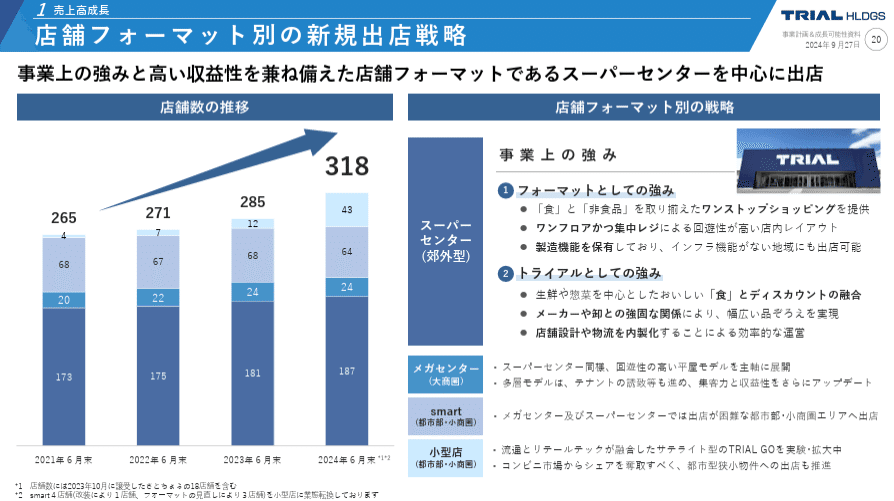
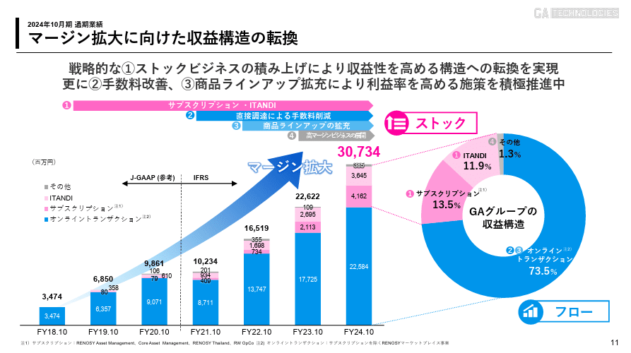
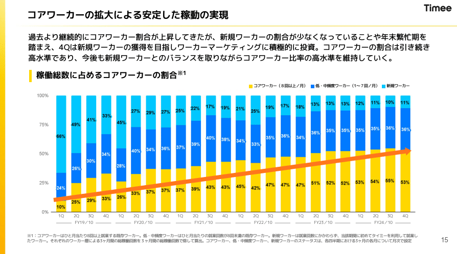
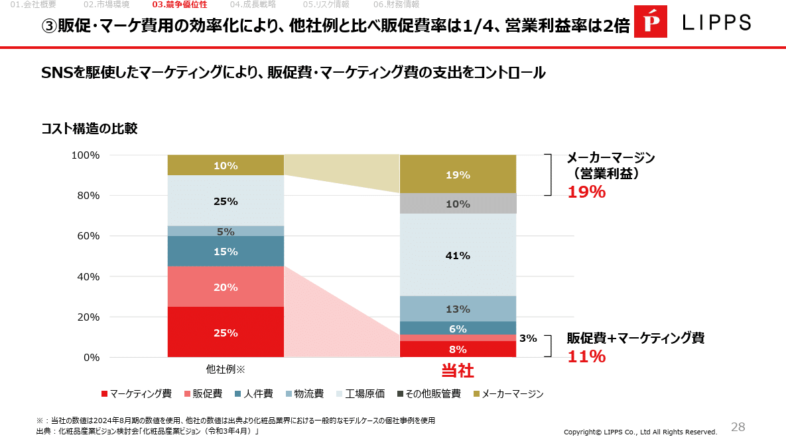
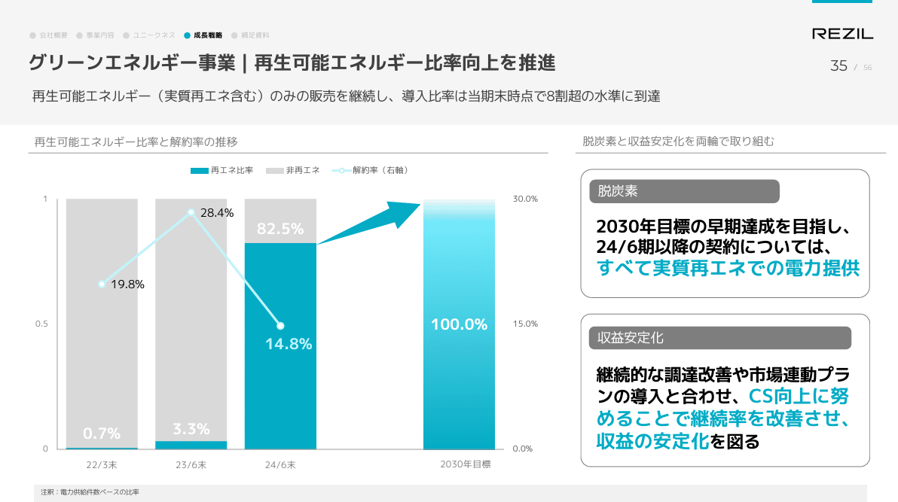
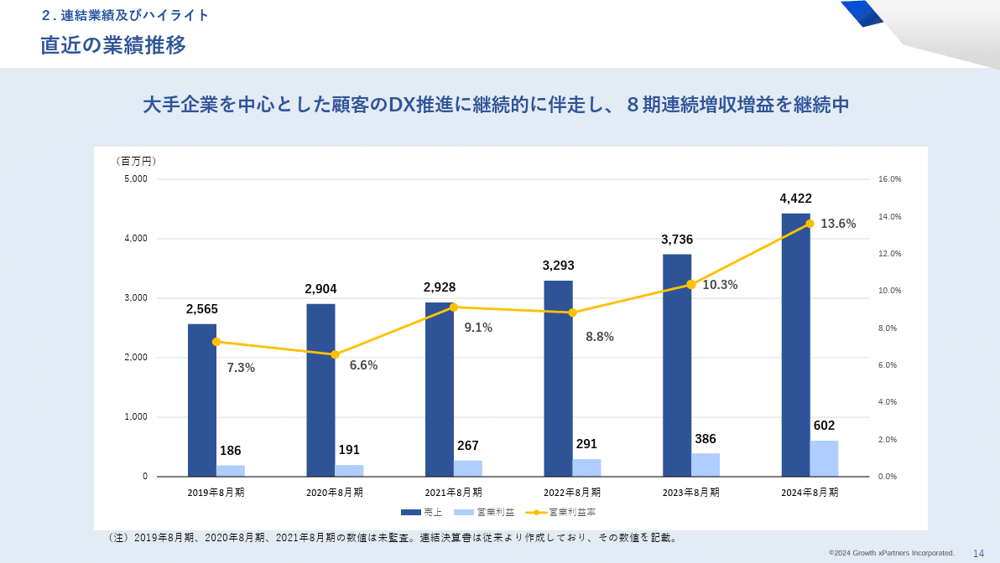

# 【マネしたい】見やすいパワポの「棒グラフ」「複合グラフ」スライド９選 （2025年更新）

[note原文](https://note.com/powerpoint_jp/n/n285958fc3427)

みなさん、こんにちは。
資料デザインのリサーチや分析に取り組むパワーポイントのスペシャリスト、パワポ研です。

今回は、**パワポの「棒グラフ」と「複合グラフ（棒＋折れ線グラフ）」スライドに焦点を当て、上場企業のIR資料から参考になりそうな抜粋**して紹介しながら、デザインのコツと正解パターンについて解説していきます。パワポ研の方で難易度を三段階に設定しておりますので、各自のパワポレベルに応じてご参照ください。

同じように好評いただいているテーマ別のスライド紹介の記事は、2025年9月より最新事例へのアップデートを進めています。今どんな記事があり、どの記事がアップデートされているか知りたい方は下記のノートを参照ください。

それでは早速見ていきましょう。

## 同系色でまとめると見やすい棒グラフになる

### トライアル 東証グロース 141A （難易度★☆☆）

まずは基本的な棒グラフから見ていきましょう。
棒グラフにおいては、内訳を記載することが多いですが、今回のように青のグラデーションにするなど、**同系統の配色にするとすっきりと見やすくなります**。その他など重要でないセグメントについては薄い灰色やベージュなど、色なじみのよい色を使うときれいなデザインにまとまります。
またこのスライドのように、グラフに関する補足情報を入れる場合は、**補足情報の色をグラフと同じ配色でそろえることで**、スライド全体が見やすくまとまります。

> 引用元：[> 2025年6月期 決算説明資料](https://pdf.irpocket.com/C141A/hGOm/hHO6/ZWXe.pdf)

*https://trial-holdings.inc/ir/library/projection/*

### ユカリア 東証グロース 286A （難易度：★★☆）

こちらは緑と赤と青色を使っていて同系色ではないと思われるかもしれませんが、**淡い色で統一することで全体をすっきりとまとめたデザイン**です。
この事例のようにセグメント間の比較をする場合、同系色だとわかりづらいため、複数の色を使う必要があります。複数の色を使ってもけばけばしくならないようにするために淡い色で統一するわけですね。
もう一つこの事例から学びたいのは、**セグメント間比較をする場合は、グラフのスケールを統一した方がいい**ということです。スケールを統一することによって、どの事業が一番大きいのか、またどの事業が成長事業なのかなど、一目で横比較ができ、みやすいスライドになります。
ユカリアは[【マネしたい】見やすいパワポの「表」スライド９選](https://note.com/powerpoint_jp/n/nfbd66d194ff2)でも紹介しましたが、色使いがすごく参考になりますね。

> 引用元：[> 2024年12月期 通期決算説明資料](https://contents.xj-storage.jp/xcontents/AS96593/db79aabf/80ad/494d/8a69/57f6fa3e8ead/140120250226583009.pdf)

*https://eucalia.jp/ir/presentations/*

## 反対色を使うと重要な情報を強調できる

### GA Technologies 東証グロース 3491 （難易度：★★☆）

棒グラフの一部を強調したい場合、ベースカラーと反対色を使うことが効果的です。その場合、**ベースの色を薄い灰色やベージュなど、どの色とも相性が良くスライド全体の雰囲気を乱すことがない色**にすると、より強調したい項目が目立って、見やすいスライドなります。逆にベースとなる項目も説明したい場合は、**コーポレートカラーなど通常の色を使う**とよいです。
このスライドでは、注力しているストック事業が伸びていることを強調するためにピンク系の色を使っています。一方でフロービジネスも伸びていることを見せたいんので、そちらも薄い灰色などにはせず、明るいブルーを使っているわけですね。

[> 2024年10月期通期 決算説明資料](https://ssl4.eir-parts.net/doc/3491/tdnet/2538914/00.pdf)

*https://www.ga-tech.co.jp/ir/library/presentation/#target_id_area_presentation_005_1*

### タイミー 東証グロース 215A （難易度：★★☆）

こちらも反対色を使って重要指標を強調している例ですが、**反対色の側にコーポレートカラーである黄色を持ってきている**ほか、そこに同系統のオレンジの矢印を重ねることで、稼働総数の中でコアワーカーの比率が高まっていることを鮮明に表しています。
もう一つ工夫が見える点として、伸びを強調したい「コアワーカー」を**100％棒グラフの一番下に持ってくる**ことで、確実に伸びていることが見やすいようにデザインしています。一番下に置くことでスタート地点が水平になるため差分が見やすいわけですね。
[【マネしたい】おしゃれなパワポの表紙３０選](https://note.com/powerpoint_jp/n/na7d0cb4925f3)でもタイミーのスライドを取り上げましたが、コーポレートカラーを効果的に使うのが非常にうまく、参考になります。

> 引用元：[> 2024年10月期 通期決算説明資料（Appendixあり）](https://contents.xj-storage.jp/xcontents/AS05113/8d897c2b/a739/4b80/a2ed/699df8bd144b/20241212122144749s.pdf)

*https://corp.timee.co.jp/ir/*

### リップス 東証グロース 373A （難易度：★★★）

次はも同じように反対色を使って強調しているスライドですが、2つの項目を強調するデザインです。
このように強調したい項目が2つある場合、**より強調したい項目を反対色に、もう一つの項目はベージュなど落ち着いた系統で濃い目の色**にすることで全体のバランスを取ることができます
またこのスライドのポイントですが、**棒グラフを100％グラフとして使い、内訳の比較に使っています**。同じような構成の場合、円グラフを使うこともありますが、棒グラフを使うメリットとして「一番下に置いた項目の違いが見やすいというのは、タイミーの事例で見たとおりです。ここでは右に「販管費＋マーケティング費 11%」「メーカーマージン（営業利益） 19%」といったメッセージを入れることで、強調している点もポイントですね。

> 引用元：[> 事業計画及び成長可能性に関する事項](https://contents.xj-storage.jp/xcontents/AS83314/f142e7e4/91cd/4271/956e/c01b106ffaef/20250704131926507s.pdf)

*https://lipps.co.jp/ir/news/*

## 複合グラフも同系色ですっきりと見せよう

### Hmcomm 東証グロース 265A （難易度★☆☆）

先ほども書いた通り、**「色数はできるだけ抑える」**というのは資料作成の鉄則の1つですが、組み合わせグラフについても同様です。コーポレートカラーなどに合わせて**棒グラフと折れ線グラフで同系色を使う**ことですっきり見せるわけですね。縦軸など不要な要素は取り払っており、グラフの存在感を消さないような工夫もされています。
特にこの事例のように、顧客数と平均単価といったKPIの要素の組み合わせで棒グラフと組み合わせグラフを組み合わせる場合は、同系色を使うことは有効な手段になります。

> 引用元：[> 2024年12月期 決算説明資料](https://ssl4.eir-parts.net/doc/265A/tdnet/2568211/00.pdf)

*https://hmcom.co.jp/ir/library/presentation/*

### レジル 東証グロース 176A （難易度：★★★）

こちらの事例は、コーポレートカラーである**スカイブルー系統の濃淡だけ**でグラフを区別しています。棒グラフにはスカイブルー、折れ線グラフにはより薄いライトブルーを使い、各グラフが綺麗に区別できるデザインとなっています。
ポイントとしては、強調したい再生可能エネルギーの比率を目立たせるために**残りの部分は灰色にしている**点、また**折れ線グラフの数値の色を背景に合わせて変えている**点が挙げられます。灰色の上は黒で記載しスカイブルーの上は白で記載するといった点が挙げられます。
また将来目標である100％へ向かうことがイメージできるよう、2030年目標のグラフはスカイブルーのグラデーションにして、上がっていくイメージにしているのも細かいですが有効な工夫です。

> 引用元：[> 2025年６月期 通期決算説明資料](https://contents.xj-storage.jp/xcontents/AS92520/1e4e14b8/3a48/445f/bb7d/b67c2f040418/140120250820544649.pdf)

*https://rezil.co.jp/ir/presentations/*

## 棒と折れ線の配色で見せたい情報を強調する

### グロースエクスパートナーズ 東証グロース 244A

### （難易度★☆☆）

ここからは折れ線グラフと棒グラフを全く異なる色で区別している例を紹介します。シンプルな印象を与える同系色の組み合わせと比較すると、**区別がより明確になり、メリハリの効いた資料**になっていることが確認できると思います。
この事例では、ベースとなる棒グラフを青で、営業利益率を反対色のオレンジで示しており、**売上や営業利益の絶対値よりも、営業利益率を強調したい**というのが見て取れます。反対色であるオレンジを使って営業利益率に読み手の注意を向け、営業利益率の伸びが深く印象に残るようにしています。

> 引用元：[> 2024年８月期通期決算説明資料](https://contents.xj-storage.jp/xcontents/AS05872/1d84a6b7/7899/4301/8a6d/fcbf85055273/140120241031507978.pdf)

*https://www.gxp-group.co.jp/ir/library/presentations/*

### ウェルネスコミュニケーションズ 東証グロース 366A 

### （難易度：★★☆）

同じく棒グラフと折れ線グラフで異なる色を使っているケースですが、こちらは折れ線グラフではなく棒グラフの方に明るい色を使って強調しています。
棒グラフを強調したいのであればそもそも折れ線がなくてもよいという考え方もありますが、当社の場合は「売上が急成長する中でも営業利益率をキープしている」ということを見せるために複合グラフにしています。
そのメッセージを出すうえでは、**営業利益率が下がっていないということだけ見えればよいので、そこは灰色で強調していない**わけですね。
逆にメインである売上成長においては、二つのセグメントにそれぞれ強い色を使うと同時に、**2025年3月の横にCAGRの円を作り、円の大きさも微妙に変えて強調している**点もマネしたいですね。

> 引用元：[> 事業計画及び成長可能性に関する事項](https://contents.xj-storage.jp/xcontents/AS05024/f07105d4/224b/4949/bb38/3f16e6c11299/140120250620595058.pdf)

*https://wellcoms.jp/ir/news/*

## 【マネしたい】見やすいパワポの「棒グラフ」「複合グラフ」スライド９選まとめ

今回は「折れ線グラフ＋棒グラフ」の複合グラフについて、公表されているパワーポイントを例に出しながら、その作成のポイントについて解説してきました。その結果、概ね下記の点について、考慮しながら作成すると良いということが分かりました。

- **なにを強調したいか**

- **同系色でまとめるか反対色や補色を使うか**

- **数字をどのように記載するか**

皆様の参考になりそうな事例が一つでもあれば、幸いです。

## パワポ研オリジナルテンプレート

パワポ研では、「ビジネスシーンで使える」パワーポイントテンプレートを公開しております。デザインを整えるのみならず、**ロジックやストーリーを整理するのにも役立つパッケージ**になっておりますので、関心のある方は下記ページも併せてご覧ください！

上記の記事のように、noteでは**フォローしているだけでビジネスにおける「資料作成のコツ」と「デザインのセンス」が身に付くアカウント**を目指して情報配信を行っています。
今後もコンスタントに記事を配信しいく予定なので、関心のある方は是非アカウントのフォローをお願いします！

**> Template販売　**[> https://powerpointjp.stores.jp/](https://powerpointjp.stores.jp/%EF%BF%BCnote)
**> note　**[> パワポ研の資料作成術](https://note.com/powerpoint_jp/m/mc291407396da)
**> X（旧Twitter)　**[> https://twitter.com/powerpoint_jp](https://twitter.com/powerpoint_jp)

## レックスアドバイザーズからのお知らせ

パワポ研は株式会社レックスアドバイザーズが運営しています。
レックスアドバイザーズは**経営企画職や経営管理職に特化した転職エージェント**です。
上場企業や上場準備企業を中心に、**経営企画、IR、経理財務、法務、内部監査等の職種の求人**をご紹介しているほか、**CFOなどのコンフィデンシャル求人**もご紹介可能です。
またコンサルティングファームや監査法人、会計事務所の求人も豊富にあるため、プロフェッショナルファームを目指す方のご支援も得意です。
求人紹介やキャリア相談を希望の方は、[**無料転職サポート**](https://www.career-adv.jp/job_search/entryform_exp/)よりサービス利用登録をしてみてください。

*レックスアドバイザーズのサービスサイトはこちらから*

**> 求人をご希望の方　**[> 無料転職サポート](https://www.career-adv.jp/job_search/entryform_exp/)**
> 採用支援をご希望の方　**[> 採用サポート](https://www.career-adv.jp/request3/)
**> その他　**[> お問い合わせフォーム](https://www.rex-adv.co.jp/contact)
**> 書籍　**[> 注目企業の実例から学ぶパワポ作成術](https://www.amazon.co.jp/dp/4046060476)

