# 【マネしたい】おしゃれなパワポの「循環図」デザイン９選

[note原文](https://note.com/powerpoint_jp/n/n2ccf8fd39c73)

みなさんこんにちは。
資料デザインのリサーチや分析に取り組むパワーポイントのスペシャリスト、パワポ研です。

パワポ研ではテーマやデザイン別に様々なパワーポイントスライドを紹介していますが、今回は**パワポの「循環図」のスライドに焦点を当て、上場企業のIR資料からおしゃれなデザインを紹介**していきます。

IRのパワーポイントにおいて**循環図のデザインがよく使われるのは、成長戦略や競争優位性のスライド**になります。「循環図」のデザインを通じて、フライホイールやフライウィール（手押し車）、つまり「事業サイクルが回るほどにデータや経験が蓄積し、成長が加速する」ことを表現し、成長性や競争優位性をアピールするわけですね。

## おしゃれな「循環図」のデザイン例３選

では早速、おしゃれな「循環図」スライドの具体例を見ていきましょう。
まずは基本形となる「循環図」のスライド例からです。

### シンプルな「循環図」スライドの例

まずは株式会社プレイドのパワポにおける「循環図」のデザインから見ていきましょう。
2025年9月期第4四半期決算説明資料のパワーポイントにある、事業展開の振り返りのスライドです。

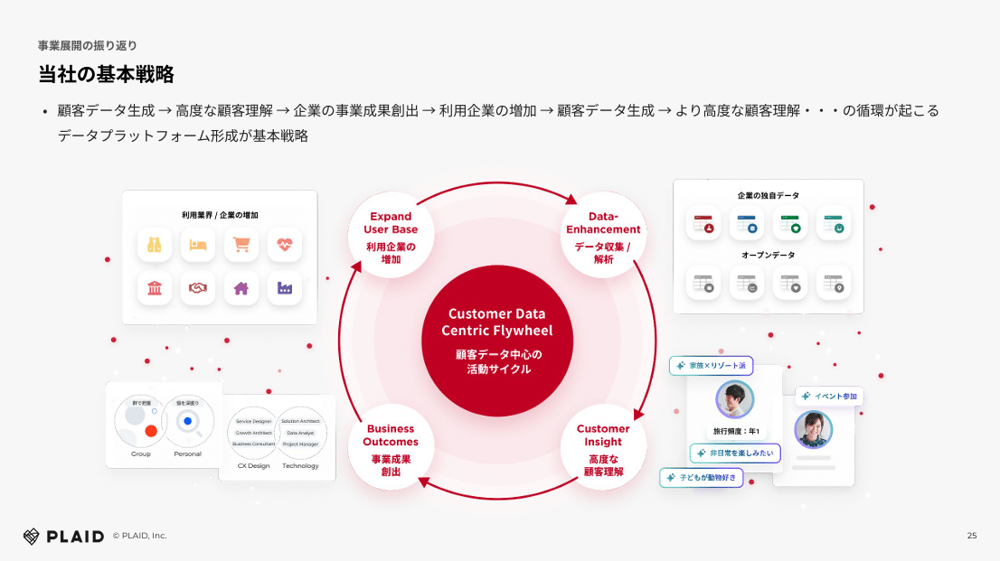
*株式会社プレイドのパワポにおける「循環図」のスライド*

> 引用元：[> 2025年9月期第4四半期決算説明資料](https://pdf.irpocket.com/C4165/PDLX/jLGV/BCsM.pdf)

*https://plaid.co.jp/ir/*

「循環図」スライドの特徴としては、**とにかくシンプルでビジュアル中心である**点が挙げられます。テキストは循環図の４つの円とその中心の円のみにあり、それ以外は画像などのビジュアルを見せています。4つの円は「データ収集と解析」「高度な顧客理解」「事業成果」「利用企業の増加」となっており、これらが循環することで成長につながるということですね。

配色としては、灰色の背景に対し、循環図の中心が赤色の円に白文字、そこからグラデーションで円が広がっています。循環図の４つの円は白色の背景に赤文字となっており、グレー色と赤色をうまく組み合わせたおしゃれなパワポになっています。

### テキスト中心の「循環図」スライドの例

続いて株式会社ROXXのパワポにおける「循環図」のデザインを見ていきましょう。
2025年９月期通期 決算説明資料のパワーポイントにある、求職者・選考のデータのスライドです。

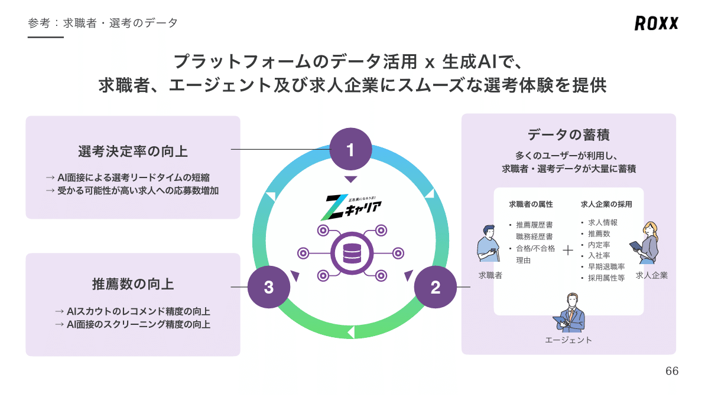
*株式会社ROXXのパワポにおける「循環図」のスライド*

> 引用元：[> 2025年９月期通期 決算説明資料](https://contents.xj-storage.jp/xcontents/AS04024/9e62dca3/6e71/4e16/9a36/6e6c51c83463/140120251110594542.pdf)

*https://roxx.co.jp/ir/library/presentation/*

「循環図」スライドの特徴として、**中心に循環図があり、具体的な内容は循環図の外側でテキストで記載している**点が挙げられます。「選考決定率の向上」「データの蓄積」「推薦数の向上」のループが回ることで、AIの精度が向上し、好循環が生まれています。

配色は、ROXXのコーポレートカラーの紫と、サービス名であるZキャリアの青色と緑のグラデーションの組み合わせです。循環図の矢印がグラデーションになっていることでスパイラル感も出ており、おしゃれなスライドとなっています。

### 業務課題の「循環図」スライドの例

続いて株式会社ジーニーのパワポにおける「循環図」のデザインです。
2025年3月期 決算説明資料のパワーポイントにある、ジーニーが目指す姿のスライドを見てみましょう。

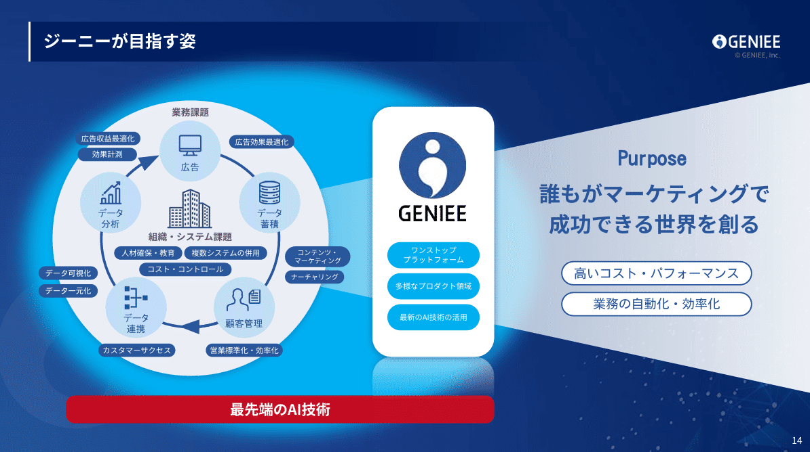
*株式会社ジーニーのパワポにおける「循環図」のスライド*

> 引用元：[> 2025年3月期 決算説明資料](https://geniee.co.jp/wp/wp-content/uploads/datas/library_briefing/pdf/020250514234259_68p0.pdf)

*https://geniee.co.jp/ir/library/briefing/*

「循環図」スライドの特徴としては、**循環図が顧客の業務プロセスとなっている点**が挙げられます。顧客の業務プロセスに対しジーニーが価値提供し、「誰もがマーケティングで成功できる世界を創る」というパーパスを実現するとなっているわけですね。

ジーニーのスライドは【徹底解説】背景の色や画像がおしゃれなパワポのスライド５選でも取り上げましたが、深い青色ベースの背景に水色や白色、赤色を組み合わせるデザインでおしゃれですね。

## 情報リッチな「循環図」のデザイン例３選

続いて、「循環図」を使ってより複雑なコンセプトを説明しているパワポ例を見ていきましょう。循環図の組み合わせやカテゴライズなどの工夫がされているほか、テキストは多めの事例が多いです。

### 「循環図」を組み合わせたスライドの例

まずはＡＲアドバンストテクノロジ株式会社のパワポにおける「循環図」のデザインから見ていきます。
事業計画及び成長可能性に関する説明資料のパワーポイントにある、競争力の源泉（強み・優位性）のスライドになります。

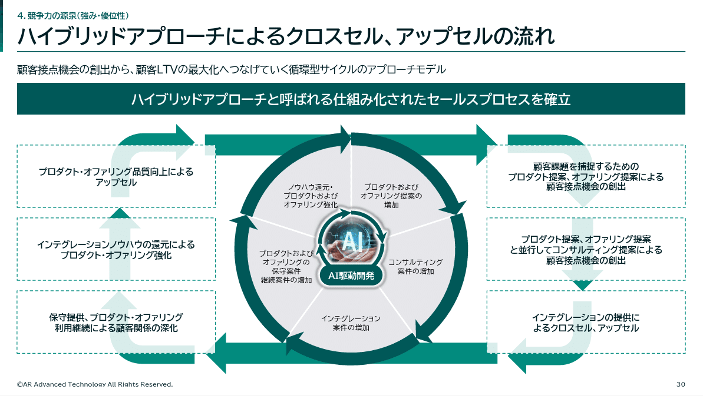
*ＡＲアドバンストテクノロジ株式会社のパワポにおける「循環図」のスライド*

> 引用元：[> 事業計画及び成長可能性に関する説明資料](https://ssl4.eir-parts.net/doc/5578/tdnet/2725816/00.pdf)

*https://ari-jp.com/ir/news/index.php*

「循環図」スライドの特徴としては、**2つの循環図を組み合わせていること**が挙げられます。外側は顧客接点における事業機会の循環図、内側がAI駆動開発における機能強化の循環図となっています。

サービスオファリングを拡大することで、事業機会がどのように増えてフライホイールが回るのか、内側の構造を入れることでわかりやすく示しているわけですね。

### 「循環図」とカテゴリーのスライドの例

続いて株式会社スタートラインのパワポにおける「循環図」のデザインを見ていきましょう。
事業計画及び成長可能性に関する事項についてのパワーポイントにある、支援力のまとめのスライドです。

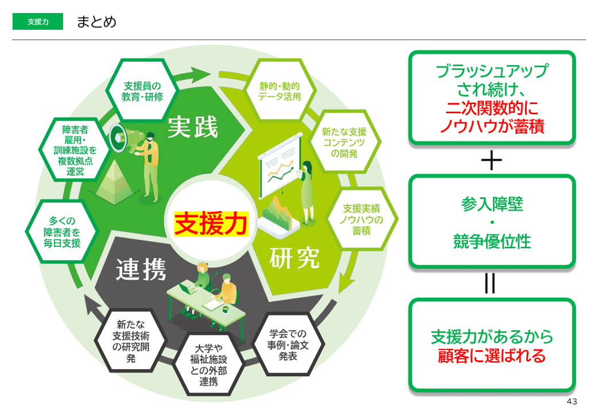
*株式会社スタートラインのパワポにおける「循環図」のスライド*

> 引用元：[> 事業計画及び成長可能性に関する事項について](https://ssl4.eir-parts.net/doc/477A/tdnet/2733547/00.pdf)

*https://start-line.jp/ir/*

「循環図」スライドの特徴としては、**循環図の内側にカテゴリーの記載があること**が挙げられます。スタートラインの支援力について、「研究」「連携」「実践」の3つのカテゴリーの支援が可能であり、それがフライホイール的に循環していることを示しています。

循環図は珍しい六角形を使っており、かつカテゴリーの部分も塗りつぶしの矢羽とイラストを使うなど、独自性のあるおしゃれなデザインとなっています。

### 「循環図」と詳細ロジックのスライドの例

最後はベルトラ株式会社のパワポにおける「循環図」のデザインです。
決算説明資料のパワーポイントにある、OTA事業：経営資源を高めるサイクルのスライドです。

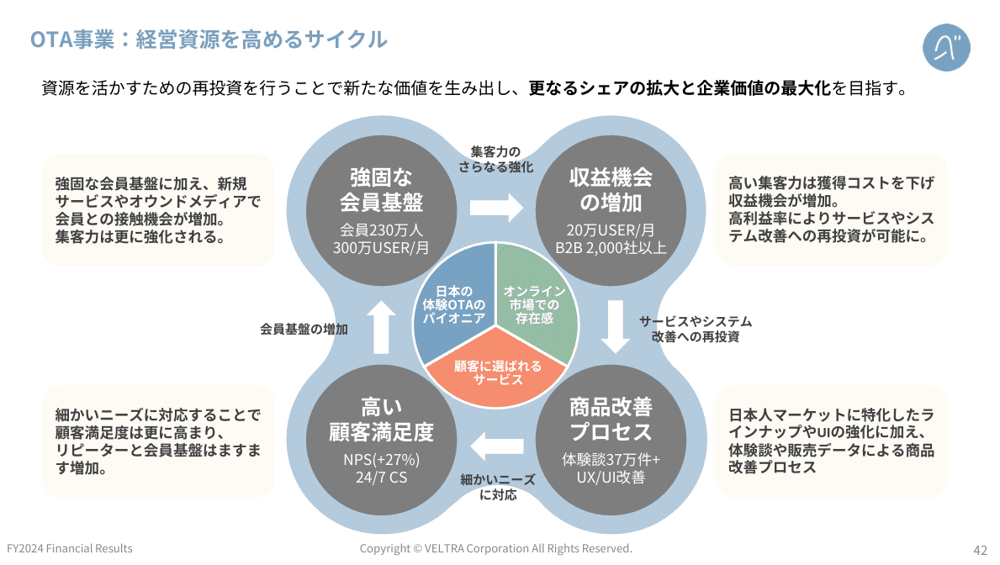
*ベルトラ株式会社のパワポにおける「循環図」のスライド*

> 引用元：[> 決算説明資料](https://data.swcms.net/file/veltra-ir/dam/jcr:95350bfc-2b1e-43ed-a6ac-2ecc41da60e8/140120250211569179.pdf)

*https://corp.veltra.com/ja/ir/library/briefing-movie.html*

「循環図」スライドの特徴としては、**循環図のロジックがテキストで詳細に記載されている点**が挙げられます。どのような仕組みでフライホイールが回るのか、流れがよく理解しやすくなっていますね。循環図の円には「会員数」「ユーザー数」「体験談数」「NPS」といった定量数値が入っており、より具体な理解が可能です。

循環図はハンドスピナーのようなデザインで、フライホイールがどんどん回転していきそうな印象を受けますね。

## フライホイール効果の「循環図」例３選

ここからは「循環図」をフライホイール（フライウィール）として記載している事例を紹介します。フライホイールのパワポは、複数の循環図が合わさるようなデザインが多いですね。

### シンプルなフライホイールのスライド例

まずは株式会社Funddinoのパワポにおける「フライホイール」効果のデザインから見ていきましょう。
事業計画及び成長可能性に関する事項のパワーポイントにある、競争優位性　成長の好循環モデルのスライドです。

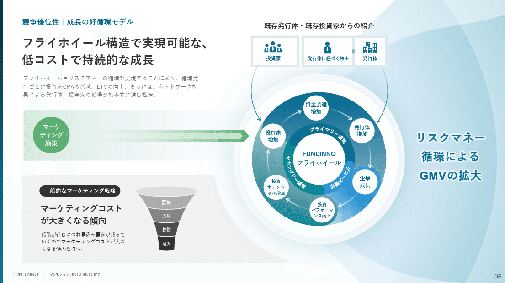
*株式会社Funddinoのパワポにおける「フライホイール」のスライド*

> 引用元：[> 事業計画及び成長可能性に関する事項](https://ssl4.eir-parts.net/doc/462A/tdnet/2728142/00.pdf)

*https://corp.fundinno.com/ir/news/*

「フライホイール」効果スライドの特徴としては、**循環図に対して外側から複数のインプットがある点**が挙げられます。フライホイールが回るための最初のインプットである「マーケティング施策」「投資家」「発行体に基づく株主」「発行体」から矢印が伸びています。

フライホイール効果のデザインとしては、青色をベースとしたグラデーションで、青空のような可能性の広がりを見せており、おしゃれなスライドになっています。

### 複合的なフライホイール効果のスライド例

続いて株式会社ジグザグのパワポにおける「フライホイール」効果のデザインです。
事業計画及び成長可能性に関する事項（訂正版）のパワーポイントにある、フライウィールのスライドを見ていきましょう。

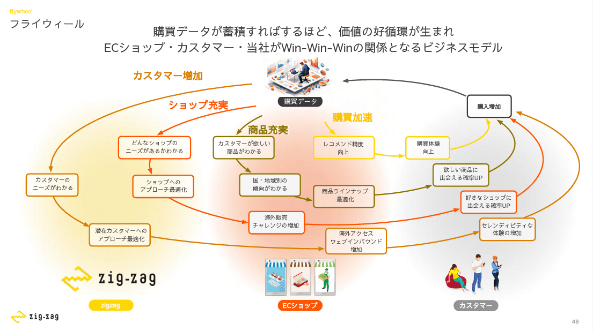
*株式会社ジグザグのパワポにおける「フライホイール」のスライド*

> 引用元：[> 事業計画及び成長可能性に関する事項（訂正版）](https://ssl4.eir-parts.net/doc/340A/ir_material_for_fiscal_ym/182957/00.pdf)

「フライホイール」スライドの特徴としては、**購買データを起点に複数の循環がある点**が挙げられます。「カスタマー増加」「ショップ充実」「商品充実」「購買加速」それぞれのフライホイールが回って購入増加につながり、さらにデータが蓄積されることで、加速度的にビジネスが進化していくわけですね。

### 弾み車の「循環図」デザインの例

最後は株式会社PKSHA Technologyのパワポにおける「弾み車」のデザインを見ていきましょう。弾み車というのはフライホイールの日本語なので、フライホイールのスライドと同義です。
2025年９月期 決算説明資料のパワーポイントにある、AI SolutionとAI SaaSの両セグメントの相乗効果のスライドです。

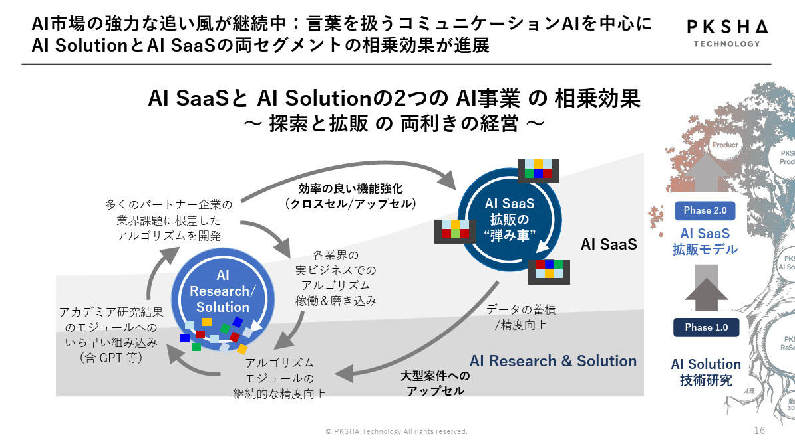
*株式会社PKSHA Technologyのパワポにおける「フライホイール」のスライド*

> 引用元：[> 2025年９月期 決算説明資料](https://contents.xj-storage.jp/xcontents/AS81483/0332a946/609d/4a9c/81aa/0724187d6c2b/20251113155806160s.pdf)

*https://www.pkshatech.com/ir/library/*

「循環図」スライドの特徴としては、**二つの循環図があり、相互に関係している点**が挙げられます。それぞれが独立のフライホイールとしても回っている中で、AI Solution側からの「効率の良い機能強化」があり、逆にAI SaaS側からは大型案件のアップセルがある、ということを示しています。

AI Solutionの側でバラバラに存在しているニーズやソリューションの種が、AI SaaS側ではブロックのようにくっついているのも、おしゃれなアナロジーですね。

## 【マネしたい】おしゃれなパワポの「循環図」デザイン９選まとめ

以上、様々な「循環図」「フライホイール」のデザイン例を見てきました。
比較的シンプルなものから、情報を入れ込んだものまで見てきましたが、この辺りはビジネスのわかりやすさや資料のトーンによっても変わってきますので、是非自社のビジネスに合う「循環図」のデザインを見つけてみてください。

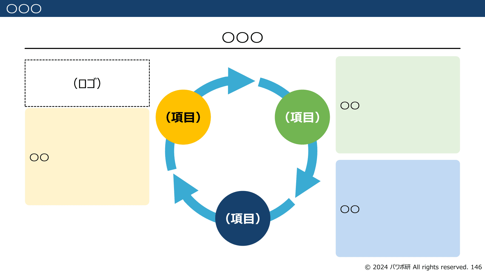
*パワポ研テンプレートの循環図スライド（丸３つ）*

ちなみに**パワポ研で提供しているテンプレート集には、以下のようなそのまま使える「循環図」のテンプレートもあります**ので、気になる方は下で紹介しているオリジナルテンプレートのNoteも見てみてくださいね。

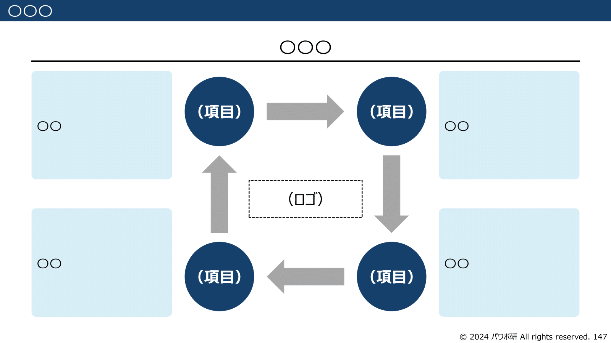
*パワポ研テンプレートの循環図スライド（丸４つ）*

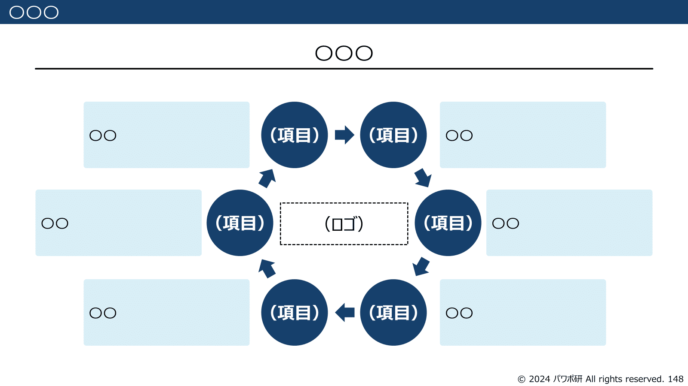
*パワポ研テンプレートの循環図スライド（丸６つ）*

*パワポ研テンプレートの循環図スライド（四角４つ）*

## パワポ研オリジナルテンプレート

パワポ研では「ビジネスシーンで使える」パワーポイントテンプレートを公開しております。デザインを整えるのみならず、**ロジックやストーリーを整理するのにも役立つパッケージ**になっておりますので、関心のある方は下記ページも併せてご覧ください！

上記の記事のように、noteでは**フォローしているだけでビジネスにおける「資料作成のコツ」と「デザインのセンス」が身に付くアカウント**を目指して情報配信を行っています。
今後もコンスタントに記事を配信していく予定なので、関心のある方は是非アカウントのフォローをお願いします！

**> Template販売　**[> https://powerpointjp.stores.jp/](https://powerpointjp.stores.jp/%EF%BF%BCnote)
**> note　**[> パワポ研の資料作成術](https://note.com/powerpoint_jp/m/mc291407396da)
**> X（旧Twitter)　**[> https://twitter.com/powerpoint_jp](https://twitter.com/powerpoint_jp)

## レックスアドバイザーズからのお知らせ

パワポ研は株式会社レックスアドバイザーズが運営しています。
レックスアドバイザーズは**経営企画職や経営管理職に特化した転職エージェント**です。
上場企業や上場準備企業を中心に、**経営企画、IR、経理財務、法務、内部監査等の職種の求人**をご紹介しているほか、**CFOなどのコンフィデンシャル求人**もご紹介可能です。
またコンサルティングファームや監査法人、会計事務所の求人も豊富にあるため、プロフェッショナルファームを目指す方のご支援も得意です。
求人紹介やキャリア相談を希望の方は、[**無料転職サポート**](https://www.career-adv.jp/job_search/entryform_exp/)よりサービス利用登録をしてみてください。

*レックスアドバイザーズのサービスサイトはこちら*

**> 求人をご希望の方　**[> 無料転職サポート](https://www.career-adv.jp/job_search/entryform_exp/)**
> 採用支援をご希望の方　**[> 採用サポート](https://www.career-adv.jp/request3/)
**> その他　**[> お問い合わせフォーム](https://www.rex-adv.co.jp/contact)
**> 書籍　**[> 注目企業の実例から学ぶパワポ作成術](https://www.amazon.co.jp/dp/4046060476)

