# 【マネしたい】パワポの「市場シェア」「市場占有率」スライド例９選

[note原文](https://note.com/powerpoint_jp/n/n35b4fd1cb8e4)

みなさんこんにちは。
資料デザインのリサーチや分析に取り組むパワーポイントのスペシャリスト、パワポ研です。

今回は、**パワポの「市場シェア」スライドに焦点を当て、上場企業のIR資料から参考事例を紹介**していきます。
市場シェアとは、マーケットシェアや市場占有率と呼ばれ、その商品が競合商品に対してどのくらい使われているかを示す指標です。市場シェア（マーケットシェア、市場占有率）のスライドはIR資料や資金調達資料で使われることが多いです。

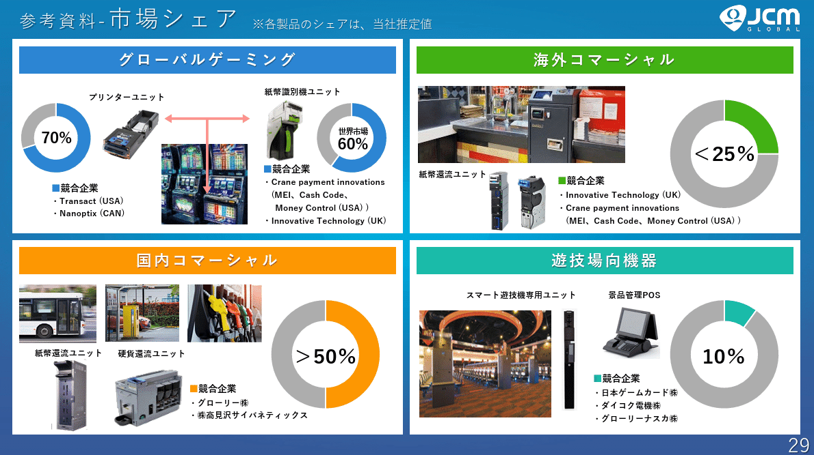
*日本金銭機械株式会社のマーケットシェアのスライド*

> 引用元：[> 2025年３月期 通期決算説明会資料](https://www.jcm-hq.co.jp/ja/ir/news/news-3151439554118340051/main/0/link/Financial_ResultsBriefing_FY2024.pdf)

*https://www.jcm-hq.co.jp/ja/ir/news.html*

一般にパワポの市場シェアのスライドというと、円グラフのイメージが強いかもしれませんが、実はそんなことはありません。今回の市場シェアのスライド例では、円グラフに加えて、表や折れ線グラフ、またNo1表示のスライド例も紹介します。

では早速行きましょう！

## 円グラフの市場シェアのデザイン例３選

とはいえ、まずはパワポの「市場シェア」スライドで最もベーシックな円グラフのデザインから見ていきましょう。円グラフを使ったデザインにもいくつかポイントがあり、競合の記載の仕方や、市場シェアの計算方法、セグメント間のレイアウトなど、デザインの工夫があります。

### 国ごとの市場シェアを見せるスライド例

まずはピジョン株式会社のパワポにおける「市場シェア」のデザイン例から見ていきましょう。
2025年12月期（69期） 決算・第9次中期経営計画説明会資料のパワーポイントにある長期的にありたい姿のスライドです。

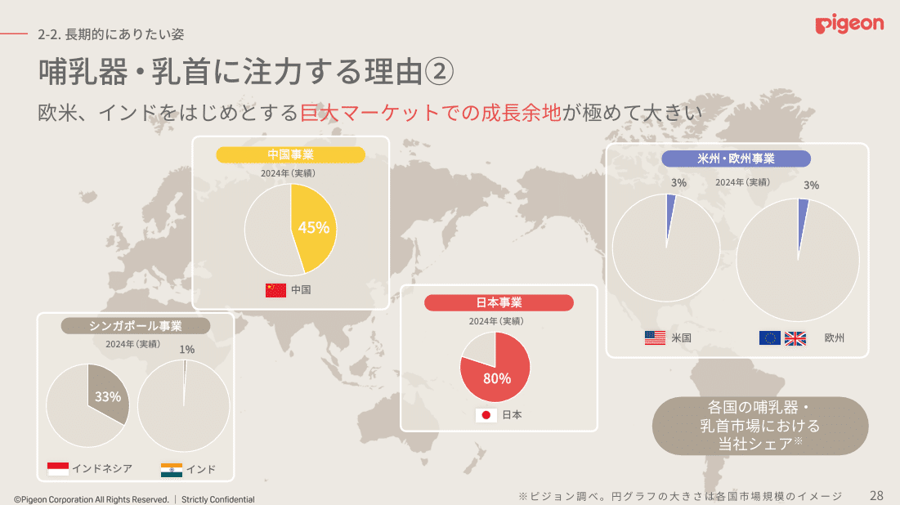
*ピジョン株式会社のマーケットシェアのスライド*

> 引用元：[> 2025年12月期（69期） 決算・第9次中期経営計画説明会資料](https://www.pigeon.co.jp/ir/files/pdf/kessan20260213.pdf)

*https://www.pigeon.co.jp/ir/library/kesan_setumei/*

「市場シェア」スライドのデザインの特徴としては**、世界地図に合わせて円グラフで自社の市場占有率を見せている点**が挙げられます。世界地図の上で、日本、中国、シンガポール、米州・欧州それぞれの場所に円グラフを置き、市場シェアを率で見せています。市場シェアの計算方法はピジョン調べとなっており詳細はわかりません。

また市場占有率を表す円グラフは各国の市場規模イメージに合わせてサイズを変更しており、円グラフのサイズと市場シェアを掛け合わせることで、実際の事業サイズがわかるようになっています。

### ランキング重視の市場シェアのスライド例

続いてローランド株式会社のパワポにおける「市場シェア」のデザイン例です。
2026年12月期－2028年12月期 中期経営計画説明資料のパワーポイントにある、主要製品カテゴリーで高い市場シェアを維持のスライドを見てみましょう。

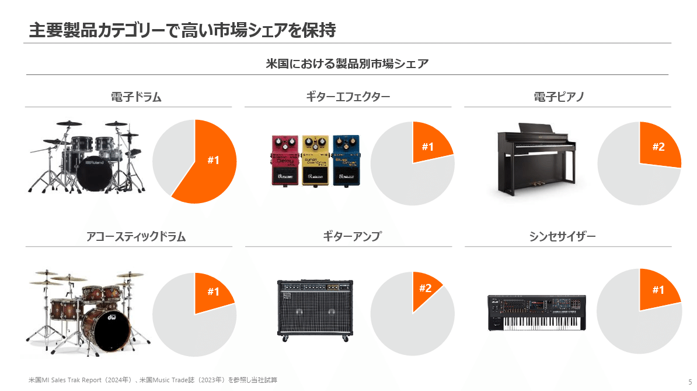
*ローランド株式会社のマーケットシェアのスライド*

> 引用元：[> 2026年12月期－2028年12月期 中期経営計画説明資料](https://ir.roland.com/ja/ir/news/news3789159793319840105/main/0/link/MTP_2026-2028_J.pdf)

*https://ir.roland.com/ja/ir/news.html*

「市場シェア」スライドのデザインの特徴としては**、あえて市場シェアの率は示さずに市場シェアのランキングのみ記載している点**が挙げられます。電子ドラム、ギターエフェクター、電子ピアノ、アコースティックドラム、ギターアンプ、シンセサイザーの６つの製品群ごとに円グラフで市場シェアを見せつつ、市場シェアのランキングを記載しています。市場シェアの計算方法は、「米国MI Sales Trak Report（2024年）、米国Music Trade誌（2023年）を参照し当社試算」となっています。

円グラフの特徴として、ピジョン社のように円のサイズを変えることもできますが、逆に円のサイズを一定にすることで、比較がしやすくなります。ここでは製品ごとの市場シェアを比較できるように、円を同じサイズにし、かつグレーの背景にオレンジ色でシェアを示すことで、視覚的に事業ごとの市場シェアがわかるようになっています。

### 市場シェアとポートフォリオのスライド例

次にユキグニファクトリー株式会社のパワポにおける「市場シェア」のデザイン例を見てみましょう。
2025年3月期 決算説明資料のパワーポイントにある、基本方針Ａ国内きのこ市場（当社のプレミアムポジション）のスライドです。

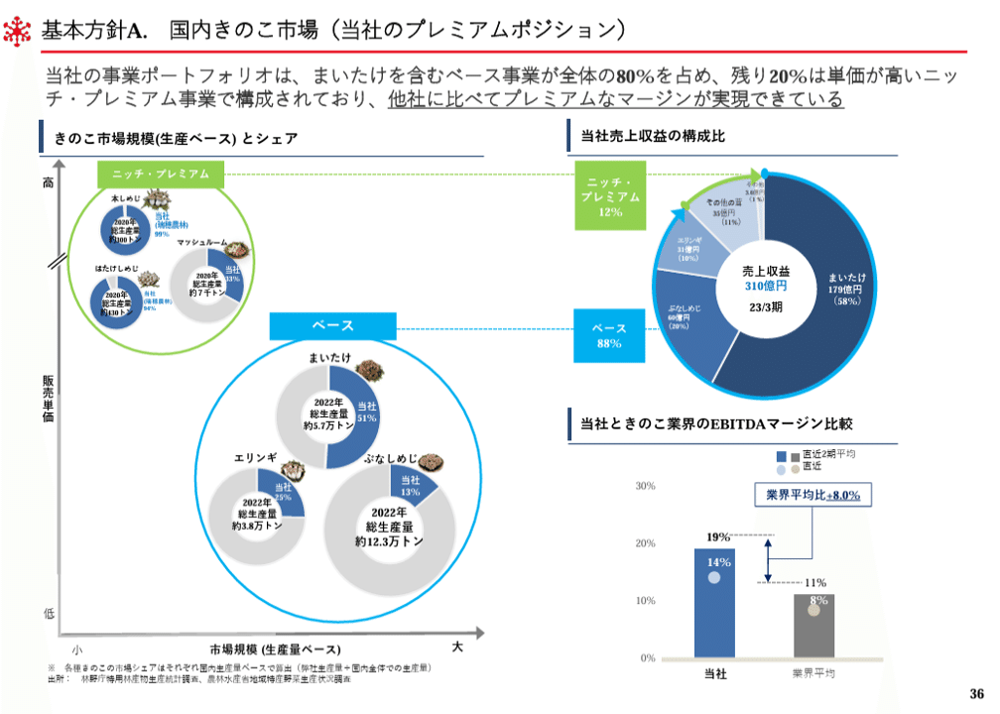
*ユキグニファクトリー株式会社のマーケットシェアのスライド*

> 引用元：[> 2025年3月期 決算説明資料](https://ssl4.eir-parts.net/doc/1375/tdnet/2606620/00.pdf)

*https://www.yukiguni-factory.co.jp/ir/news/*

「市場シェア」スライドのデザインの特徴としては、**各製品の市場シェアにを示す円グラフを２軸のマトリックスの中にプロットして事業ポートフォリオの説明につなげている点**が挙げられます。６つの製品群の市場シェアを円グラフで示した上で、市場規模と販売単価のマトリックス上にプロットし、国内きのこ市場における自社のポジションニングの説明をしています。市場シェアの計算方法は林野庁のキノコの生産量データに対する自社生産量の比率となっています。

販売数量の多いベース商品群と、販売単価の高いニッチ・プレミアム商品群に分類したうえで、それらを円グラフにまとめていますが、円グラフのサイズを市場規模と連動させていることで、最終的な売上構成の円グラフへとスムーズに理解が進みます。
また右下ではEBITDAマージンを競合と比較しており、バランスの取れたポートフォリオが収益性につながっていることも説明しています。

## 表やグラフの市場シェアのデザイン例３選

続いては市場シェアを、円グラフではなく、表形式や折れ線グラフなどのデザインで見せるスライド例を見ていきましょう。市場占有率を見せるにあたって表を使うメリットは、計算方法などの定量情報を具体的に示すことができる点です。他にも折れ線で市場占有率の変化を見せるなど、目的によって合致するデザインが変わる点を覚えておきましょう。

### クラウド事業の市場シェアのスライド例

まずは株式会社マネーフォワードのパワポにおける「市場シェア」のデザイン例を見てみましょう。
2025年11月期 通期決算説明資料のパワーポイントにある、バックオフィスSaaSの潜在市場規模のスライドです。

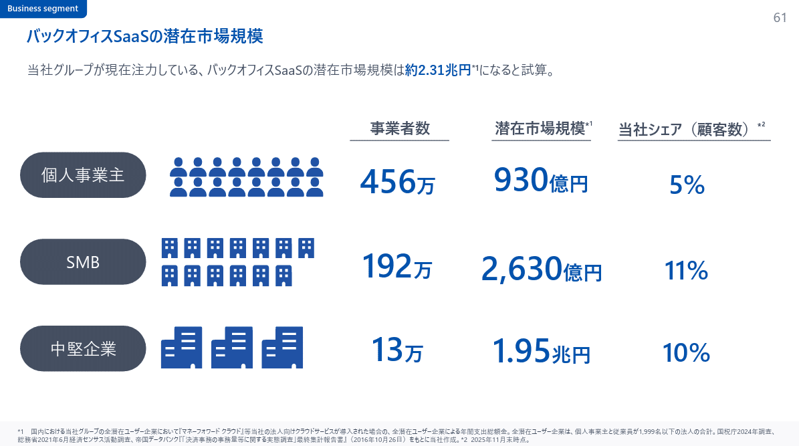
*株式会社マネーフォワードのマーケットシェアのスライド*

> 引用元：[> 2025年11月期 通期決算説明資料](https://contents.xj-storage.jp/xcontents/AS71106/781f04a3/4fb3/409e/83f7/aa7360811159/140120260114533742.pdf)

*https://corp.moneyforward.com/ir/*

「市場シェア」スライドのデザインの特徴としては、**表形式で市場シェアと関連情報を入れている点**が挙げられます。個人事業主、SMB、中堅企業の３つのセグメントで、潜在市場規模と市場シェアに加えて、事業者数を記載しています。市場シェアの計算方法は、事業者数に対する自社のサービス利用者数の率で計算しています。

クラウドサービスの場合、オンプレミスのサービス利用者も含めた全利用者の中から市場占有率を計算することになるため、事業者数を分母とする市場シェアの計算方法がマッチしやすいです。事業者数のデータは統計情報として取得できるため、市場占有率の計算に向いています。

### 市場シェア目標値がわかる表スライド例

次は株式会社ＰＯＰＥＲのパワポにおける「市場シェア」のデザイン例を見ていきます。
2025年10月期 通期決算説明資料のパワーポイントにある、学習塾市場における目標マーケットシェアのスライドです。

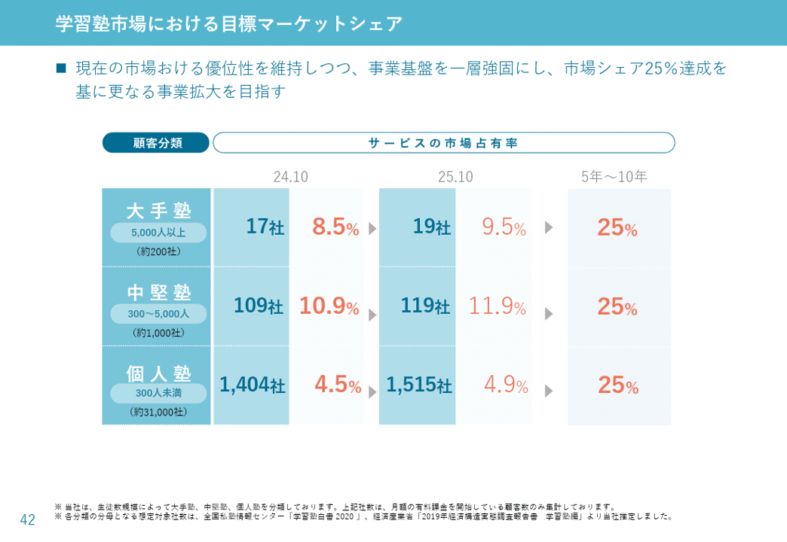
*株式会社ＰＯＰＥＲのマーケットシェアのスライド*

> 引用元：[> 2025年10月期 通期決算説明資料](https://ssl4.eir-parts.net/doc/5134/tdnet/2729895/00.pdf)

*https://poper.co/ir/news/*

「市場シェア」スライドのデザインの特徴としては、**表形式で実績とも評値を示している点**が挙げられます。大手塾、中堅塾、個人塾の３つのセグメントで、2024年の市場シェア実績、2025年の市場シェア実績、長期での市場シェア目標値を記載しています。市場シェアの計算方法は、自社の導入客数を国内の事業者数で割り戻すというシンプルなものです。

成長著しいベンチャー企業の場合、年々市場占有率が高まっていくため、実績の伸びを見せることが、長期的に市場シェアの目標値に近づく力があることを見せる上で効果的です。そこで表を使って、市場シェアの計算方法や実績を具体的に見せるデザインにしているわけですね。

### 自社と競合の市場シェア推移のスライド例

続いて株式会社リップスのパワポにおける「市場シェア」のデザイン例を見てみましょう。
2025年10月期 通期決算説明資料のパワーポイントにある、「男性×美意識」がターゲット、スタイリング剤市場のシェアは続伸のスライドです。

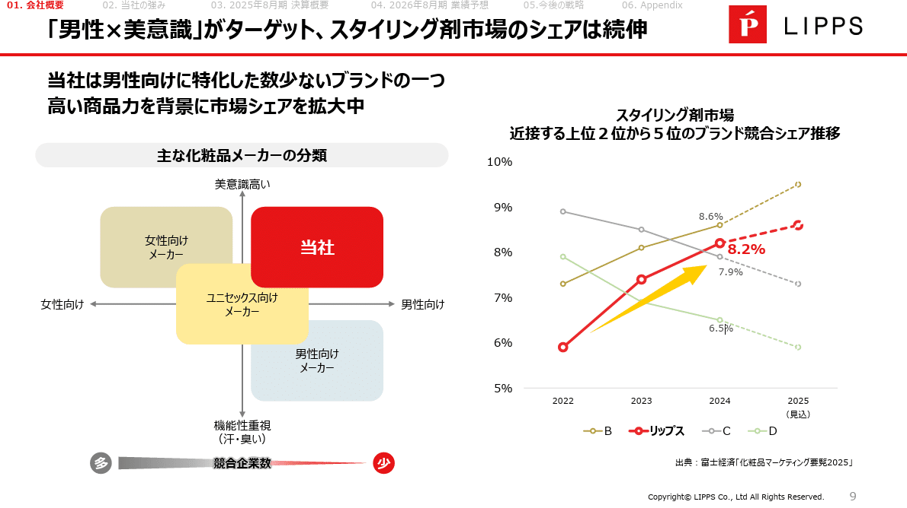
*株式会社リップスのマーケットシェアのスライド*

> 引用元：[> 2025年8月期 決算説明資料 （事業計画及び成長可能性に関する事項）](https://contents.xj-storage.jp/xcontents/AS83314/01e25629/8f3d/43c7/b864/caa7fe055679/140120251015573538.pdf)

*https://lipps.co.jp/ir/news/*

「市場シェア」スライドのデザインの特徴としては、**折れ線グラフで自社と競合の市場シェアの推移を見せている点**が挙げられます。スタイリング剤市場における、自社と競合３社の市場占有率を、2022年から2025年の見込みまで４年間分プロットしています。市場シェアの計算方法は、富士経済「化粧品マーケティング便覧2025」からの引用となっています。

自社が市場シェアを奪って成長している場合、競合が相対的に市場シェアを下げているということになるので、競合も含む折れ線グラフを使うと、自社の勢いがよく伝わります。
左側で競合を含む化粧品メーカーを分類し、それぞれのジャンルから競合を持ってきて折れ線グラフにプロットすることで、当社自体の強さとカテゴリーの強さが同時に伝わる様なデザインになっています。

## 市場シェアNo1のスライドデザイン例３選

最後は少し市場シェアのスライドの中でも、市場シェアNo1に特化したスライドのデザイン例を紹介していきます。**No1表記は表示に関して様々なガイドライン**がありますが、そちらを満たしたうえでどのようなデザインにするのか、いくつかのパターンがあります。

### No1表示と画像が中心のデザイン例

まずは株式会社イルグルムのパワポにおける「市場シェアNo1」のデザイン例を見てみましょう。
2025年 9月期年通期決算説明資料のパワーポイントにある、「EC-CUBE」：サービス概要のスライドです。

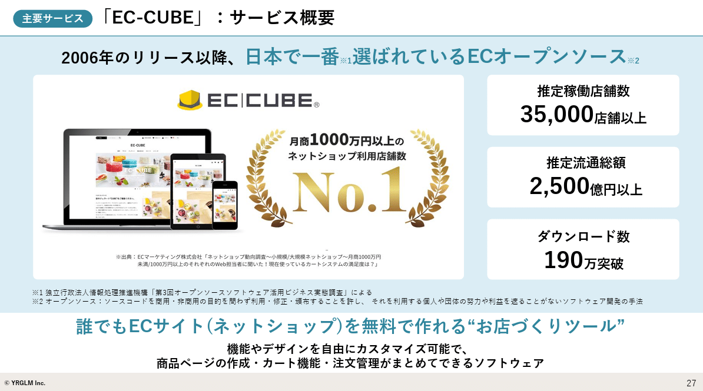
*株式会社イルグルムのマーケットシェアのスライド*

> 引用元：[> 2025年 9月期年通期決算説明資料](https://ssl4.eir-parts.net/doc/3690/tdnet/2708482/00.pdf)

*https://yrglm.co.jp/ir/library/presentation/*

「No1」スライドのデザインの特徴としては、**市場シェアNo1の表記と画像をメインにしつつ、右側でインパクトのある定量情報を見せている点**が挙げられます。2026年のリリース以降、日本で一番選ばれているECオープンソースというメッセージに合わせて、ボディ大半はサービス画像とNo1表示のロゴ及びガイドラインを遵守するための説明書きとなっています。右側には、推定稼働店舗数、推定流通総額、ダウンロード数といった、具体的な数値が並びます。市場シェアNo1の計算方法は、ECマーケティング株式会社の調査よりとなっています。

市場シェアのNo1表記を使う場合、それだけで十分なインパクトがあるため、まずはNo1表示のガイドラインに沿った表示を行うことが最優先されます。その上で、よりインパクトを出すために付加情報を載せることが大事になりますが、このように**業歴が長いと累計の支援数も多くなるため、累計の数値を見せるデザイン**が効果的です。

### No1表示とランキンググラフのデザイン例

まずは株式会社マネーフォワードココナラのパワポにおける「市場シェアNo1」のデザイン例を見てみましょう。
2025年8月期 通期決算説明資料のパワーポイントにある、実績_流通総額のスライドです。

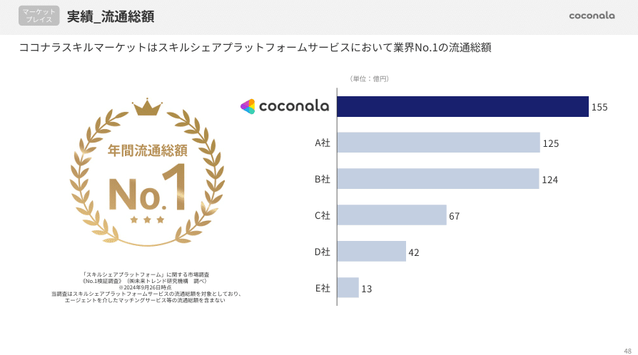
*株式会社ココナラのマーケットシェアのスライド*

> 引用元：[> 2025年8月期 通期決算説明資料](https://ssl4.eir-parts.net/doc/4176/tdnet/2697472/00.pdf)

*https://coconala.co.jp/ir/library/*

「No1」スライドのデザインの特徴としては、**市場シェアNo1表示のロゴに合わせてランキングのグラフを記載している点**が挙げられます。左側にNo1表示とガイドラインを満たすための補足、右側には自社と競合５社のスキルシェア流通総額のランキンググラフを入れています。市場シェアNo1の計算方法は、株式会社未来トレンド研究所の調査よりとなっています。

市場シェアNo1表示は、市場占有率が１位であることはわかる一方、それがどのくらいの規模なのかはわかりません。そこで競合も含む流通総額をランキンググラフで見せつつ、具体的な流通額を見せるデザインにしているわkですね。

### No1表示と競合比較表のデザイン例

まずは株式会社サイエンスアーツのパワポにおける「市場シェアNo1」のデザイン例を見てみましょう。
2025年８月期　通期決算説明資料のパワーポイントにある、競合比較（IP無線アプリ）のスライドです。

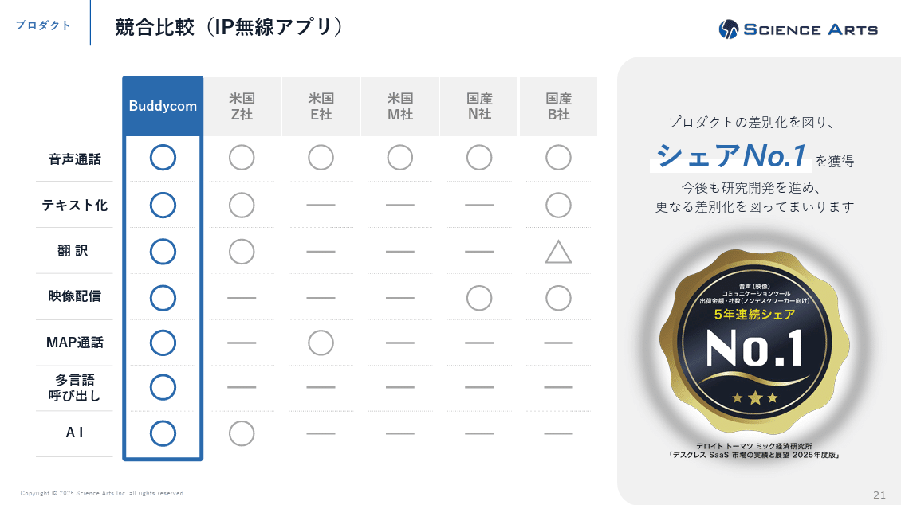
*株式会社サイエンスアーツのマーケットシェアのスライド*

> 引用元：[> 2025年８月期　通期決算説明資料](https://contents.xj-storage.jp/xcontents/AS82476/9d76d772/745f/4d44/99e2/65f3de994db4/140120251015573814.pdf)

*https://science-arts.com/ir/presentations/*

「No1」スライドのデザインの特徴としては、**市場シェアNo1表示のロゴに合わせて競合比較の表を載せている点**が挙げられます。左側に競合と機能面を比較した表、右側にNo1表示とガイドラインを満たすための補足を入れています。市場シェアNo1の計算方法は、デロイトトーマツミック研究所のレポートよりとなっています。

市場シェアNo1表示に合わせて、具体的な機能の比較表を入れることで、市場占有率が１位であることの機能面での裏付けを行っています。比較表を見ると競合に比べて圧倒的に機能が多いので、No1でこれだけ機能もあるのだから安心という、信頼醸成効果もありそうです。

## 【マネしたい】パワポの「市場シェア」「市場占有率」スライド例９選

ベーシックな円グラフの市場シェアから、表や折れ線グラフの市場シェア、市場シェアNo1のスライドまで、様々なスライドを紹介しました。市場シェアのスライドはメッセージによって適切なデザインが変わってくるので、是非メッセージに合わせたスライドを選んでくださいね。

またパワポ研のオリジナルテンプレートには、市場シェアのスライドに使えるフォーマットも多数あるので、気になる方は下記のリンクから見てみてくださいね。

*パワポ研オリジナルテンプレートの競合あり市場シェアのスライド*

*パワポ研オリジナルテンプレートの市場シェアと目標値のスライド*

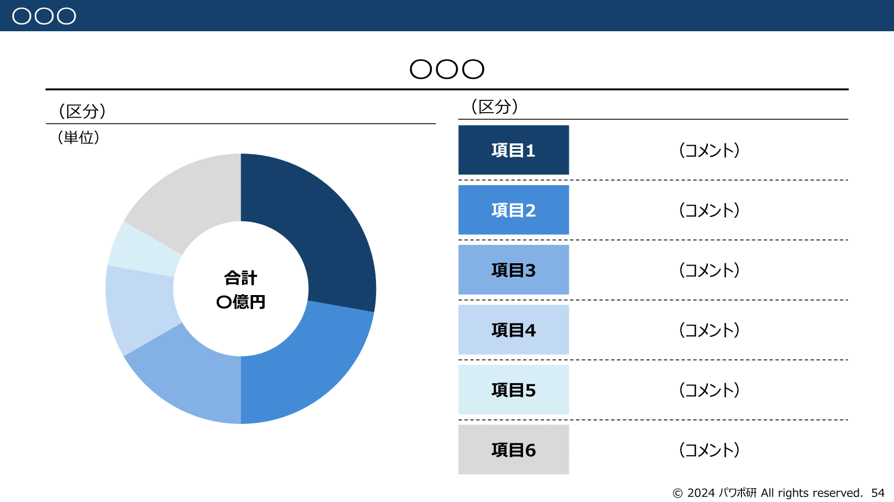
*パワポ研オリジナルテンプレートの市場シェアと競合特徴のスライド*

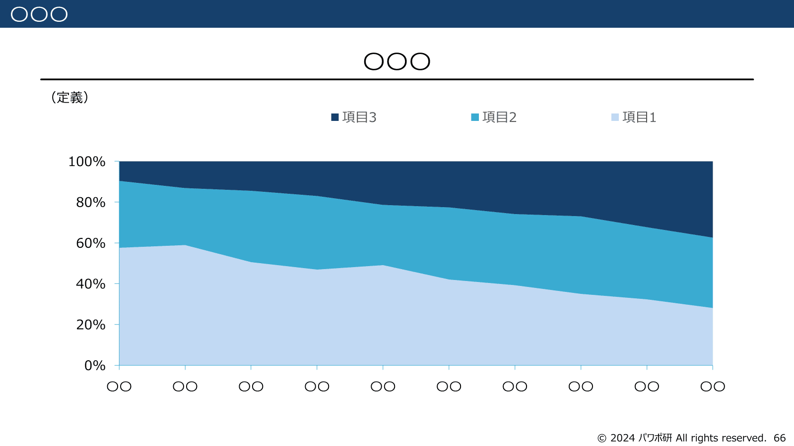
*パワポ研オリジナルテンプレートの市場シェア推移のスライド*

## パワポ研オリジナルテンプレート

パワポ研では、「ビジネスシーンで使える」パワーポイントテンプレートを公開しております。デザインを整えるのみならず、**ロジックやストーリーを整理するのにも役立つパッケージ**になっておりますので、関心のある方は下記ページも併せてご覧ください！

上記の記事のように、noteでは**フォローしているだけでビジネスにおける「資料作成のコツ」と「デザインのセンス」が身に付くアカウント**を目指して情報配信を行っています。
今後もコンスタントに記事を配信していく予定なので、関心のある方は是非アカウントのフォローをお願いします！

**> Template販売　**[> https://powerpointjp.stores.jp/](https://powerpointjp.stores.jp/%EF%BF%BCnote)
**> note　**[> パワポ研の資料作成術](https://note.com/powerpoint_jp/m/mc291407396da)
**> X（旧Twitter)　**[> https://twitter.com/powerpoint_jp](https://twitter.com/powerpoint_jp)

## レックスアドバイザーズからのお知らせ

パワポ研は株式会社レックスアドバイザーズが運営しています。
レックスアドバイザーズは**経営企画職や経営管理職に特化した転職エージェント**です。
上場企業や上場準備企業を中心に、**経営企画、IR、経理財務、法務、内部監査等の職種の求人**をご紹介しているほか、**CFOなどのコンフィデンシャル求人**もご紹介可能です。
またコンサルティングファームや監査法人、会計事務所の求人も豊富にあるため、プロフェッショナルファームを目指す方のご支援も得意です。
求人紹介やキャリア相談を希望の方は、[**無料転職サポート**](https://www.career-adv.jp/job_search/entryform_exp/)よりサービス利用登録をしてみてください。

*レックスアドバイザーズのサービスサイトはこちらから*

**> 求人をご希望の方　**[> 無料転職サポート](https://www.career-adv.jp/job_search/entryform_exp/)**
> 採用支援をご希望の方　**[> 採用サポート](https://www.career-adv.jp/request3/)
**> その他　**[> お問い合わせフォーム](https://www.rex-adv.co.jp/contact)
**> 書籍　**[> 注目企業の実例から学ぶパワポ作成術](https://www.amazon.co.jp/dp/4046060476)

