# 【コンサルのパワポ紹介】日系シンクタンク５社のスライド資料

[note原文](https://note.com/powerpoint_jp/n/n3812d14a0c0d)

みなさんこんにちは。
資料デザインのリサーチや分析に取り組むパワーポイントのスペシャリスト、パワポ研です。

戦略コンサルティングファームや上場経営コンサルティングファーム、BIG4のパワポ資料を紹介してきた【コンサルのパワポ紹介】シリーズですが、今回はシンクタンクの資料を紹介していこうと思います。

シンクタンクというと、コンサルティングファームとはややレイヤーが異なる一方で、実はコンサルティングファームとバッティングするような仕事も請け負っています。

そこで今回は、コンサルティングの仕事も行うような大手のシンクタンクのパワポ資料を見ていきます。野村総合研究所、三菱総合研究所、日本総合研究所、三菱ＵＦＪリサーチ＆コンサルティング、みずほリサーチ＆テクノロジーズの資料を見ていきます。
パワーポイント資料はいつものように経産省の委託調査資料から紹介していきますよ。

それでは早速見ていきましょう！

## 株式会社野村総合研究所の資料

まずは野村総合研究所（NRI）の調査報告資料を見ていきましょう。ここでは「令和６年度エネルギー需給構造高度化対策調査等事業（特定荷主等のエネルギーの使用合理化・非化石転換等の現状分析調査）」のパワーポイントを見ていきます。

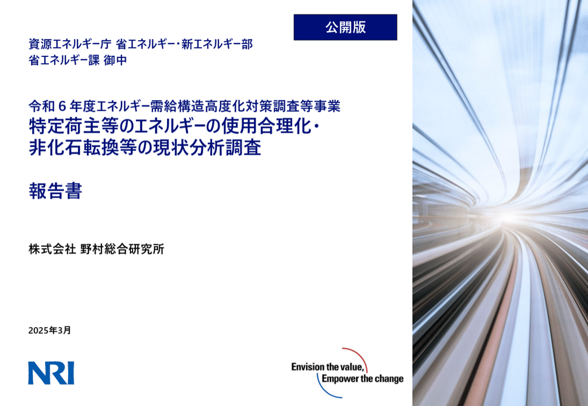
[> 引用元：令和６年度エネルギー需給構造高度化対策調査等事業（特定荷主等のエネルギーの使用合理化・非化石転換等の現状分析調査）](https://www.meti.go.jp/meti_lib/report/2024FY/000350.pdf)

*https://www.meti.go.jp/meti_lib/report/2024FY/itakuichiran2024FY.pdf*

### 目的と調査概要のスライド

まずは目的と調査概要のスライドから見ていきましょう。運輸部門のエネルギー使用の合理化と非化石エネルギーへの転換を図るための検討であるということが書いてあります。
調査の内容としては３つのパートがあり、「省エネ法施策の見直しに向けた分析・整理」「定期報告書などのデータベース構築と分析」「荷主によるさらなる省エネ・非化石検討促進に向けた方策の検討」となっています。

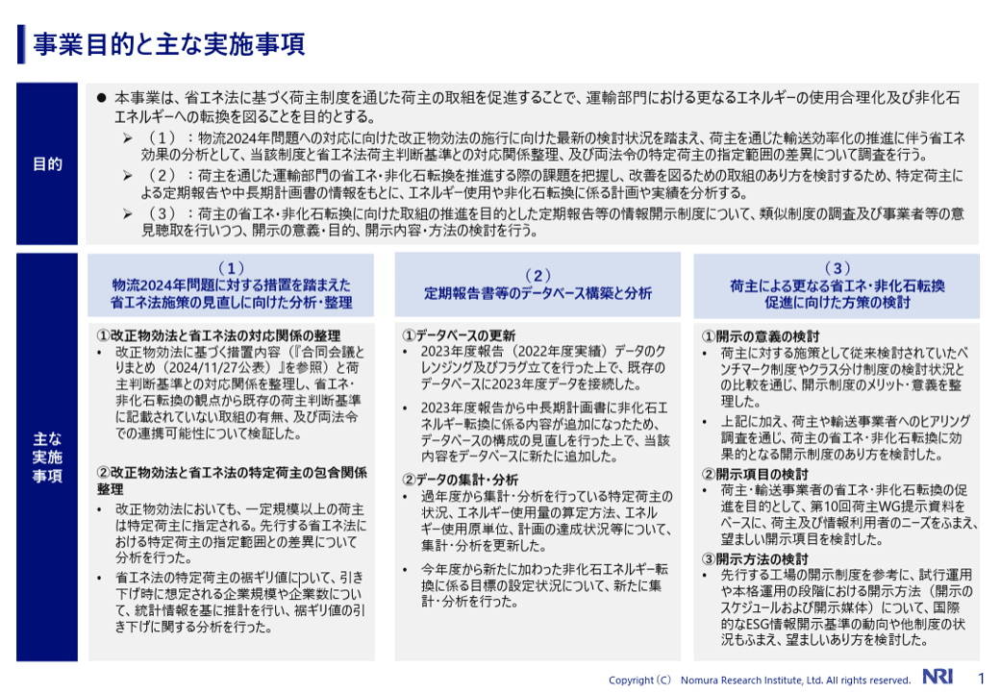
パワーポイント上部はスライドタイトルのみ、その下に目的と業務内容がテキストで記載されています。ボックスで最低限の構造化をした上で、みっちりとテキストが記載されています。

### 調査スケジュールのスライド

調査業務のスケジュールを示したスライドです。12週間のプロジェクトの課でどのように調査業務を進めていくのかを、週単位のガントチャートで整理しています。

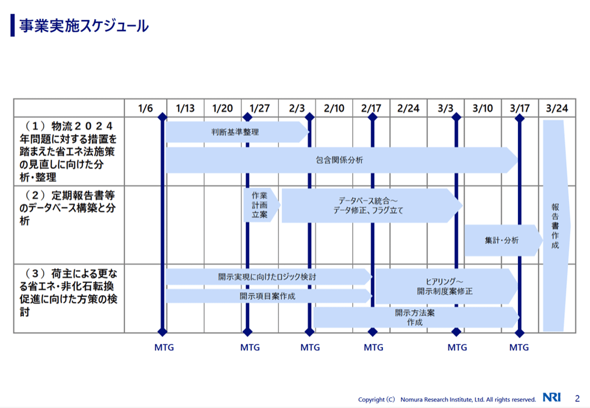
タイトルとボディのみのシンプルな構成のスライドです。スケジュールのスライドはボディがメインなので、メッセージがない事も多いです。
３つの業務について、それぞれ12週間の中で何をやるのか、「判断基準整理」「包含関係分析」「ヒアリング」等やることを矢羽の中に記載して見せています。
またプロジェクトにおいては定期的にクライアントとＭＴＧをして経過報告と方向性の調整をする必要があるので、ＭＴＧのタイミングを縦の青い太線で記載しています。**横にスケジュールを取り、矢羽と縦線で見せるスタイルはコンサルの定番スライド**ですね。

### 業務内容のスライド

業務内容のスライドです。前段で整理した大枠に対して、より具体的なタスクへの分解をしています。ここでは改正物効法と省エネ法の対応関係の整理を行うにあたって、省エネ法を軸にした整理と、改正物効法を軸にした整理の二つを行っています。

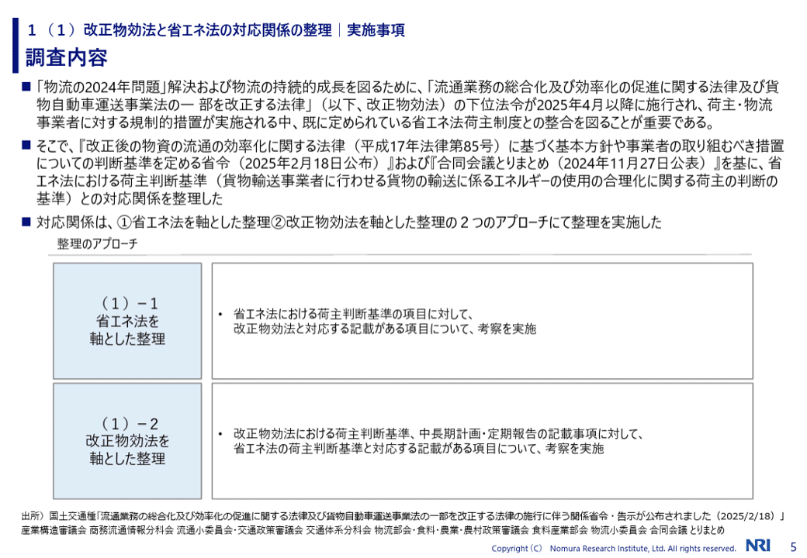
構造としては、上部にチャプターとタイトル、サマリーはなくボディのテキストが来ています。
業務内容の書き下しなので、テキスト中心になっています。経緯の部分はどうしても長くなってしまうのでそのままテキストで記載しています。

### 分析結果サマリーのスライド

続いて最後に調査報告資料の成果である、分析結果のスライドを見ていきましょう。それぞれのパートについて、分析結果が一目でわかるようにまとめられています。

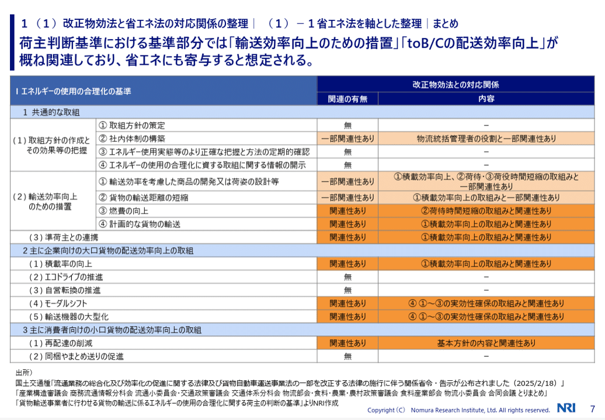
分析結果のスライドなのでチャプターとタイトルがグッと上にまとまり、その下にメインメッセージ、その下にボディとなる表がある構成です。
ボディとなる表は、官庁の資料としてそのまま出てきそうなかっちりとしたデザインです。**かっちりとしたデザインでも見やすいように色を絞ってグラデーションで見せて**います。

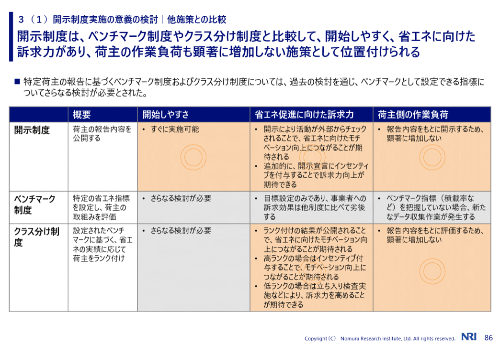
こちらは同じような構成ですが、ボディの表の上にも補足説明のテキストがあります。３つの評価項目に対しての評価を、背景色と二重丸で見せています。図形は背景色のサポートになっており、別の意味は持っていないので、控えめになっています。

### 分析詳細のスライド

最後に分析詳細のスライドです。過去資料のデスクトップリサーチや、主要事業者へのヒアリングなど、様々な手法で分析を行っています。

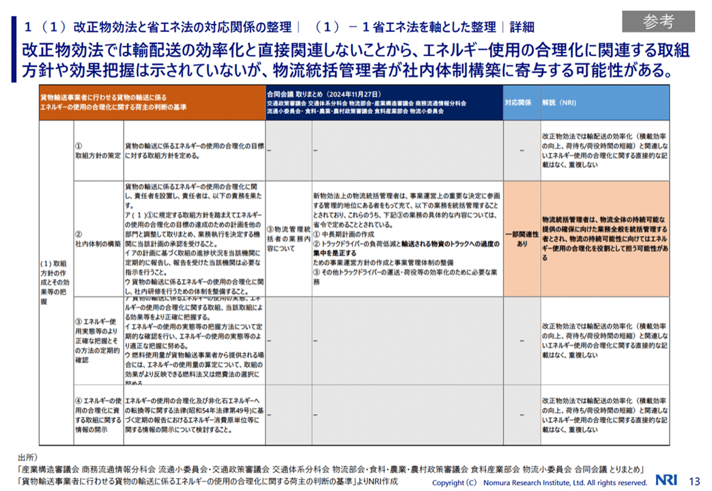

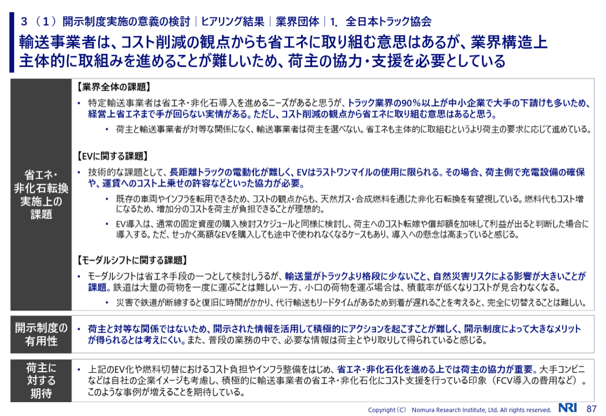
まとめ同様、チャプターとスライドタイトルが最上位、その下にスライドメッセージ、その下に表という構造です。
詳細スライドは、とにかく情報を漏れなく伝えることが重要になってくるので、このようにテキストで見せてしまうことも多いです。**ヒアリング結果については示唆につながる重要なファインディングスを青文字に**しています。

## 株式会社三菱総合研究所の資料

続いて三菱総合研究所（MRI）の調査報告資料を見ていきましょう！「令和６年度再生可能エネルギー導入拡大・分散型エネルギーリソース導入支援等事業（定置用蓄電システム等電力貯蔵システムの普及拡大に向けた調査）報告書」のパワーポイントを見ていきます。

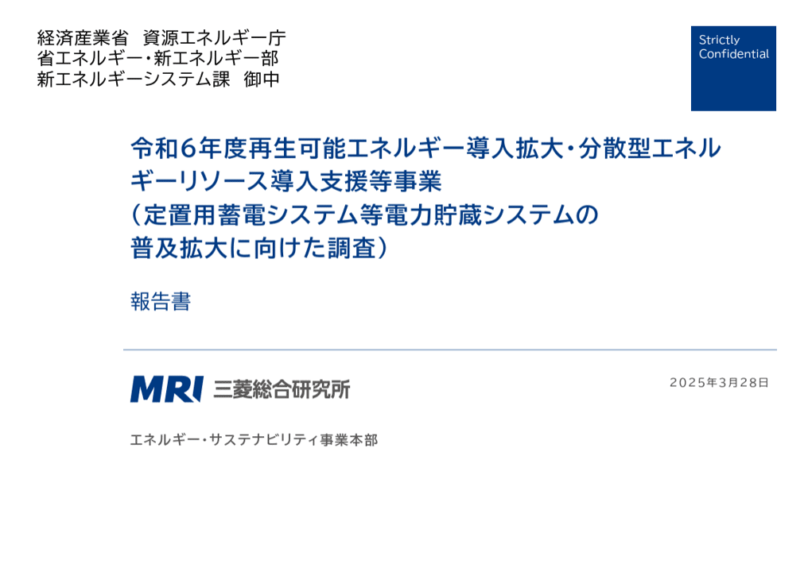
> 引用元：[> 令和６年度再生可能エネルギー導入拡大・分散型エネルギーリソース導入支援等事業（定置用蓄電システム等電力貯蔵システムの普及拡大に向けた調査）報告書](https://www.meti.go.jp/meti_lib/report/2024FY/000325.pdf)

*https://www.meti.go.jp/meti_lib/report/2024FY/itakuichiran2024FY.pdf*

### 目的のスライド

まずは目的のスライドから見ていきます。今回は国内外に電力貯蔵システムを取り巻く環境や政策を把握し、政策をアップデートしていくことが目的と書かれています。

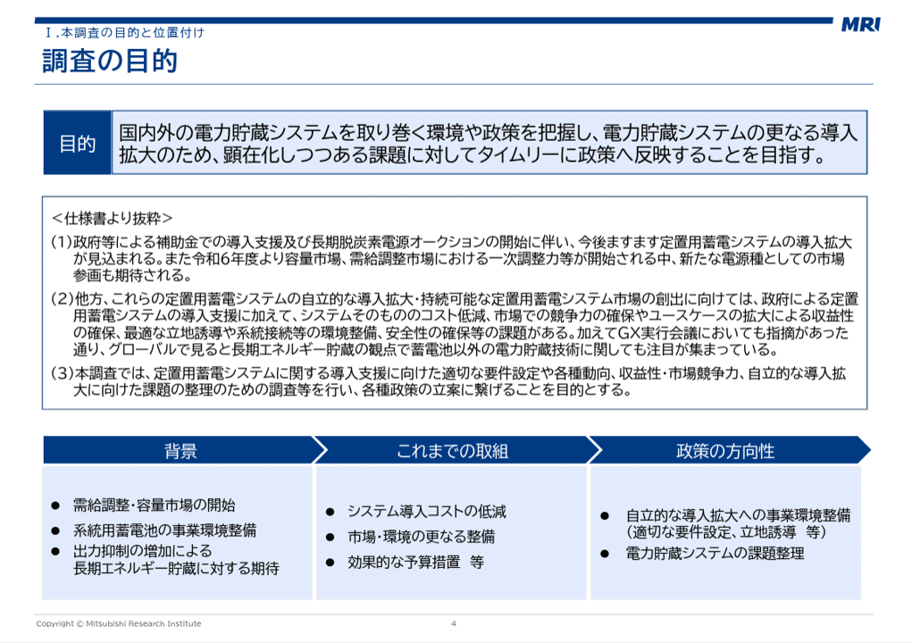
チャプターとタイトルが上にあり、ボディがある構造です。ボディは最上部に目的のサマリーを描いたうえで、仕様書の抜粋と、それを時系列に書き下したフローを書くことでわかりやすくまとめています。

### 論点とスコープのスライド

続いて論点のスライドと作業スコープのスライドです。調査における４つの項目ごとに主要論点を整理したうえで、蓄電システムの中でも定置用が対象であることを示しています。

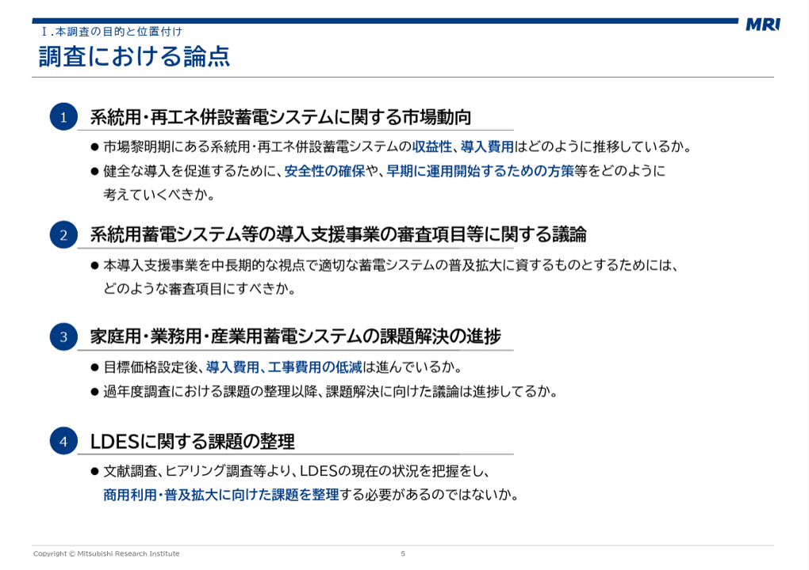
４つのタスクを太字にするだけでなく、ナンバーボール、下線などを入れることで、極めてスタイリッシュにまとめています。行間の設定も絶妙ですね。論点の中でもポイントになる部分は青文字にしています。

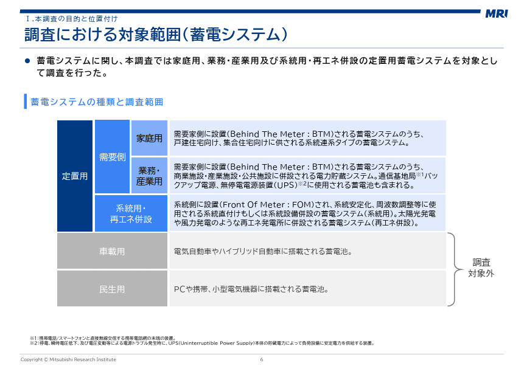
こちらはチャプターとタイトルの下にスライドメッセージも入っています。蓄電システムの種類を３階層で分類することで、**対象と対象外の違いがわかるだけでなく、対象の中の区分もわかる**ようになっています。

### 分析内容のスライド

分析内容のスライドです。調査業務を通じて明らかにすべき論点に対して買いを出すために、様々な角度からの分析が行われています。

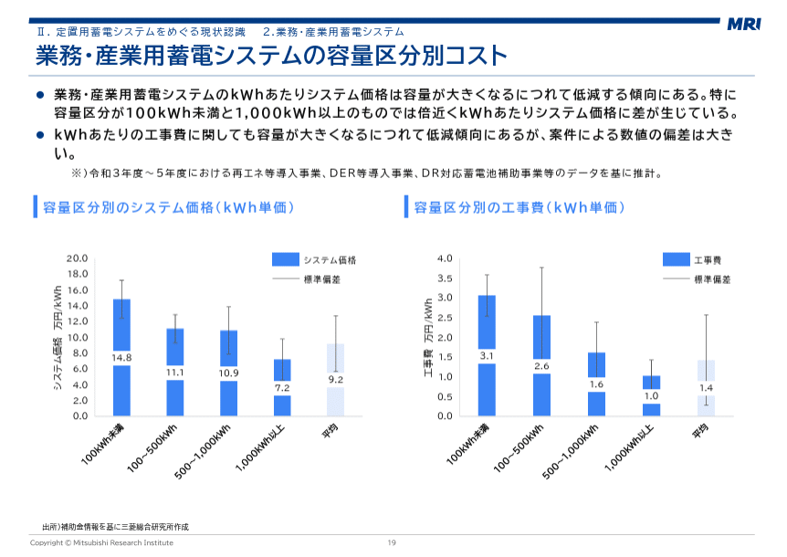
小文字チャプターとタイトル、スライドメッセージ、ボディのグラフが２つのという構造のスライドです。スライドタイトルに加えてボディのタイトルも青系統にして統一感を出しています。
**グラフは平均単価を棒グラフに、標準偏差の線を追加するデザインですが、標準偏差が大きい場合に効果的な見せ方**です。

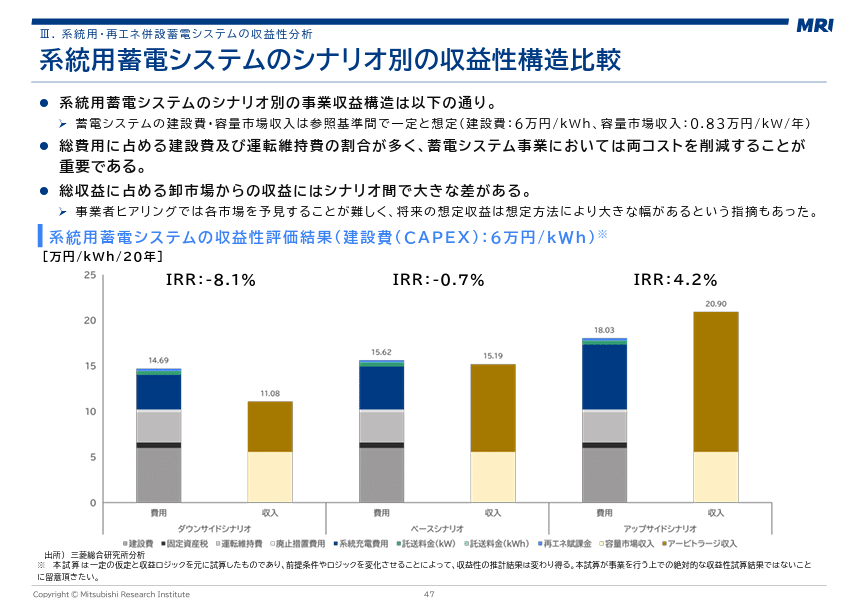
シナリオ別の費用と収入のバランスを棒グラフで見せています。棒グラフの内訳を詳細に見せていますが、グラフ内に記載してしまうとごちゃつくので、凡例で下に記載しています。
**グラフ自体はやや見づらいですが、メッセージがメインでありグラフは読みたい人が読めばいいという位置づけ**と考えられます。

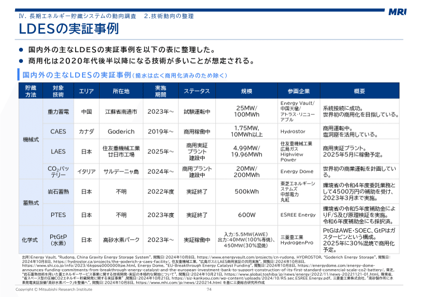
表形式で実証事例をまとめています。現時点でどれが優勢ということもないため、評価は記載されていません。あくまで情報として全体像を把握するための位置づけです。

### 課題整理と提案内容のスライド

最後に調査事業の成果である課題整理と提案内容のサマリーです。まず課題がまとめられ、そのうえで提案内容が整理されています。

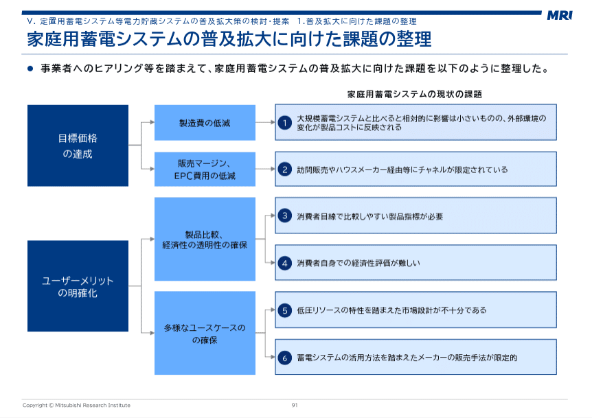
構成はこれまでと変わりませんが、ボディをしっかりと見せるスライドのため、スライドメッセージが上にギュッと詰まって、ボディの面積が大きくなっています。
**課題ごとにナンバーボールをつけることで、次の課題解決に向けたアイデアのページとつながる**ようになっています。

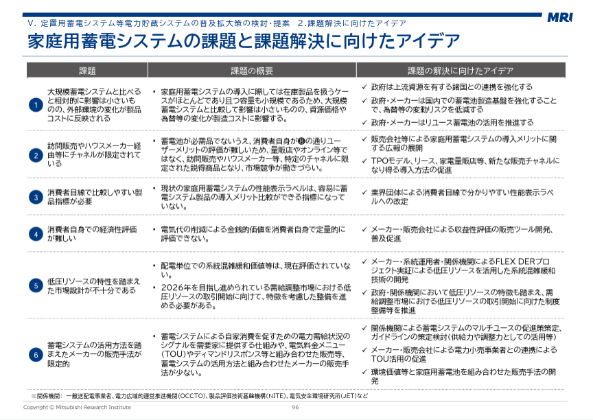
課題解決に向けたアイデアの一覧ということで、スライドメッセージは無く、課題、課題の概要、課題解決に向けたアイデアという構成の表がメインになっています。
**テキストは上揃えではなく上下中央揃えになっていますが、これまでのページとの一貫性を持たせる**ために中央揃えになっていると考えられます。

## 株式会社日本総合研究所の資料

最後に日本総合研究所のパワーポイント資料を見ていきましょう！「令和６年度商取引・サービス環境の適正化に係る事業 福祉用具の市場維持・拡大に向けた施策の在り方に関する調査」という報告資料です。日本総研はSMBCグループのシンクタンクですね。

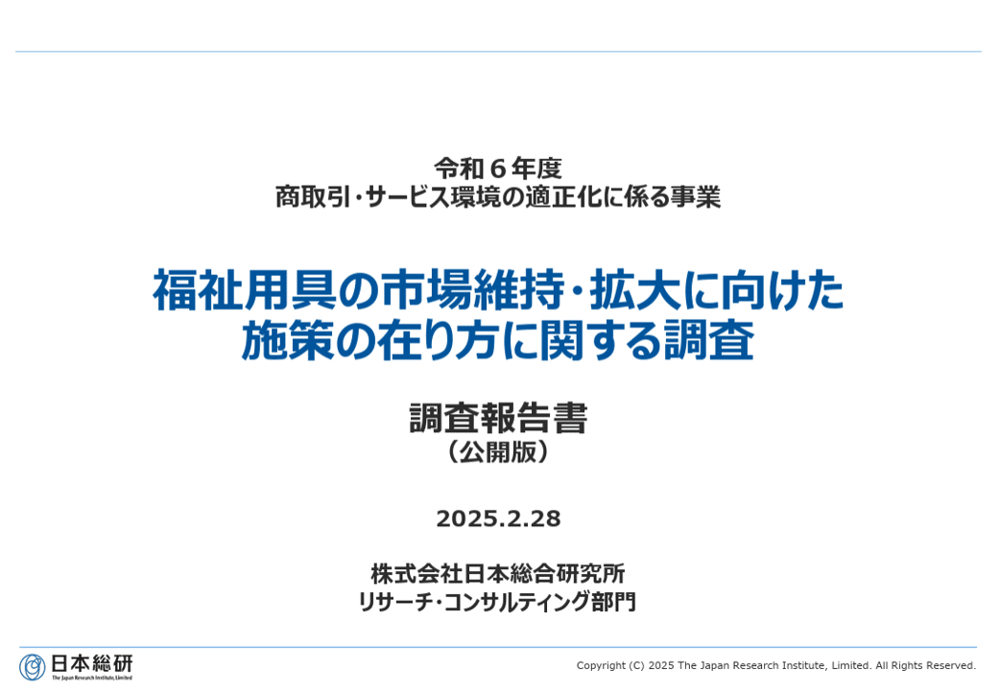
> 引用元：[> 令和６年度商取引・サービス環境の適正化に係る事業（福祉用具の市場維持・拡大に向けた施策の在り方に関する調査）調査報告書（公表用）](https://www.meti.go.jp/meti_lib/report/2024FY/1000017.pdf)

*https://www.meti.go.jp/meti_lib/report/2024FY/itakuichiran2024FY.pdf*

### 背景と目的のスライド

まずは背景と目的のスライドから見ていきましょう。仕様書のサマリーとして、国内の人口減少を背景に、福祉用具について検討が必要であるということが記載されています。

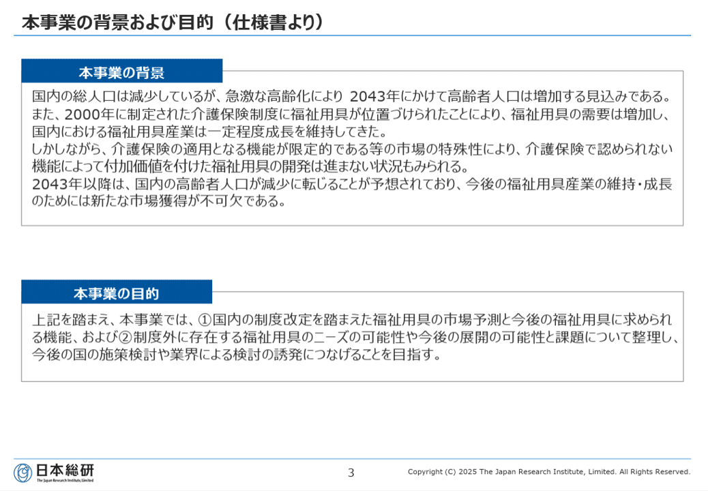
タイトルとボディのみのシンプルな構造のスライドです。仕様書の抜粋のため、既に先方も理解している内容になるので、さらっと書かれています。

### 調査内容とスケジュールのスライド

続いて調査内容と検討スケジュールのスライドです。福祉用具業界の課題と、市場維持拡大に向けた施策という二つのパートのサブテーマが計９つあり、それらに対して情報収集と報告書作成、そして検討委員会やワーキンググループの開催をしていくということが書かれています。

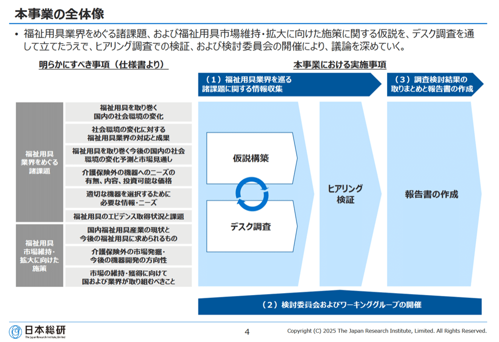
矢羽が統一なので、もう少しギュッとまとめてもよいとも思われますが、おそらく左側の９つの課題をきちんと書き下して見せることが目的でこのような構造にしたと推察されます。１行になるようにすると、右側がだいぶ圧縮されてしまうのでしょうね。

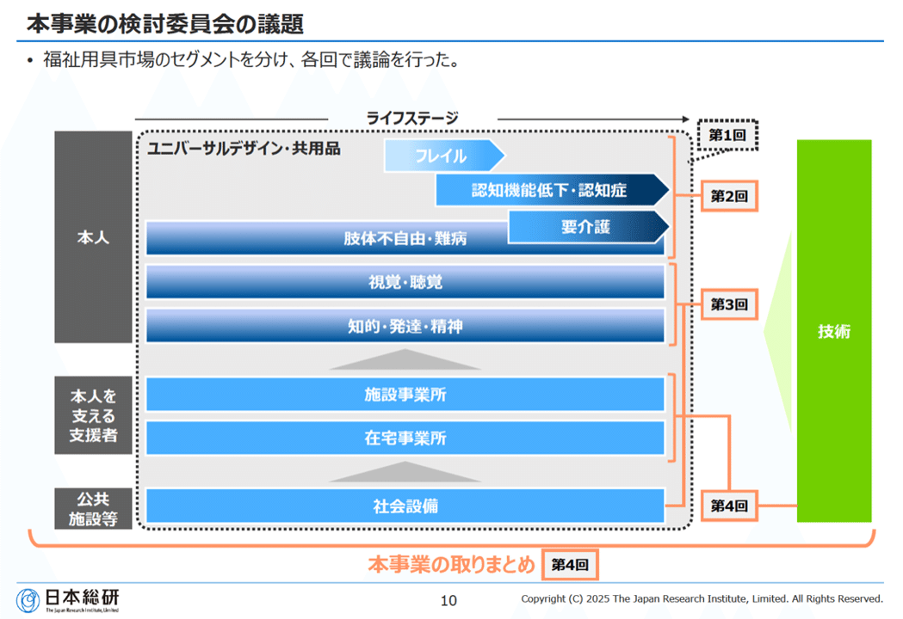
全４回の検討委員会がどのように進んでいくのかを、検討内容の全体像に合わせて見せているスライドです。
まず**横軸にライフステージ、縦軸にステークホルダーを取り、検討内容をまとめて**いますが、非常にわかりやすい構造になっています。ここにさらに**第１回から第４回にどこを対象とするのかプロットする**ことで、全体像が非常にわかりやすいです。

### 分析内容のスライド

続いて分析内容のスライドです。福祉用具をめぐる現状について、既存施策の整理や国がとるべき施策をまとめています。

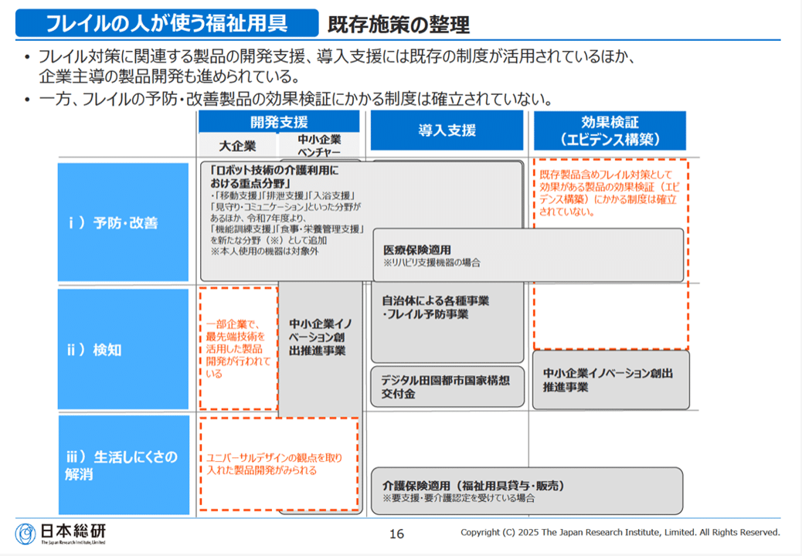
チャプターとタイトル、スライドメッセージ、ボディとなるマトリックスという構造のスライドです。既存施策は、**付加価値のフローも支援のバリューチェーンもまたぐようなものが多数あるため、マトリックス形式でプロットするのが効果的**ですね。

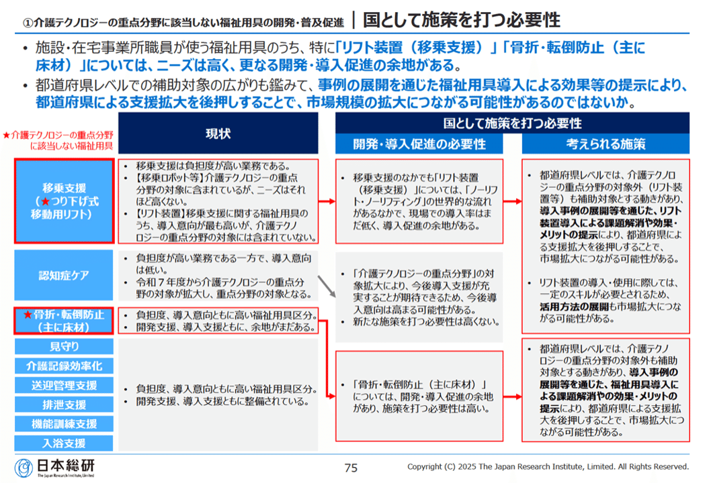
スライドの構造は同じですが、メッセージの強調部分には青色の太文字を使っています。ボディはフローっぽい表になっていますが、特にポイントとなる部分を赤枠で囲って強調しています。

### 分析結果のスライド

分析内容をまとめた分析結果のスライドです。抽出された論点ごとに、現状課題と課題解決への施策案を１枚にまとめたスライドと、技術調査の結果のスライドです。

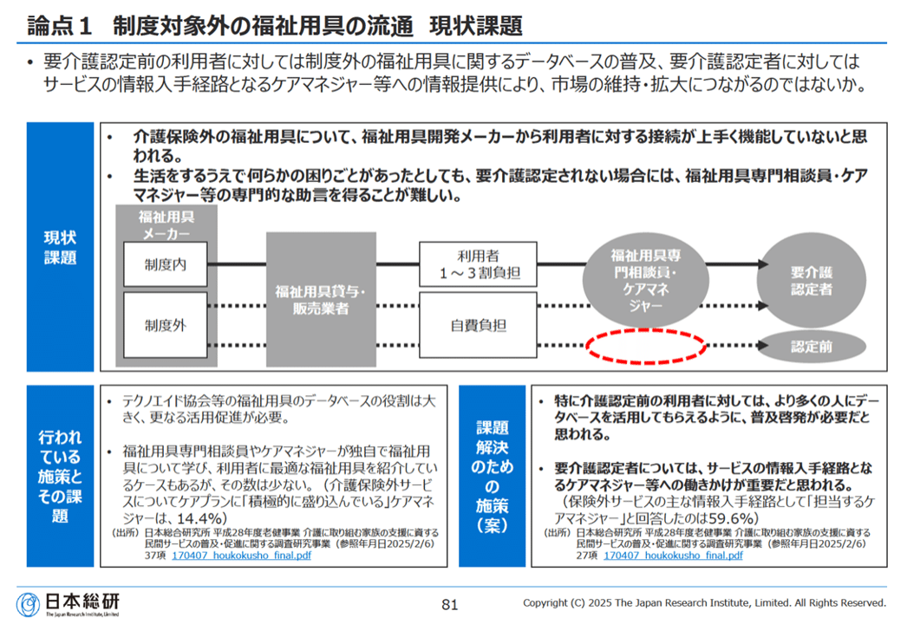
上部に論点を記載し、その回答をスライドメッセージとしてその下に、そして「現状課題」「行われている施策とその課題」「課題解決のための施策（案）」の３つのブロックをボディに記載しています。
「現状課題」の部分は概念図で大きめにわかりやすくまとめる一方で、「行われている施策とその課題」「課題解決のための施策（案）」はテキストで詳細に書き下していますが、まずわかりやすい図から読ませて、そのあとはテキストを読ませるという、**読み手の心理的なハードルを下げて読ませる資料構成**になっています。

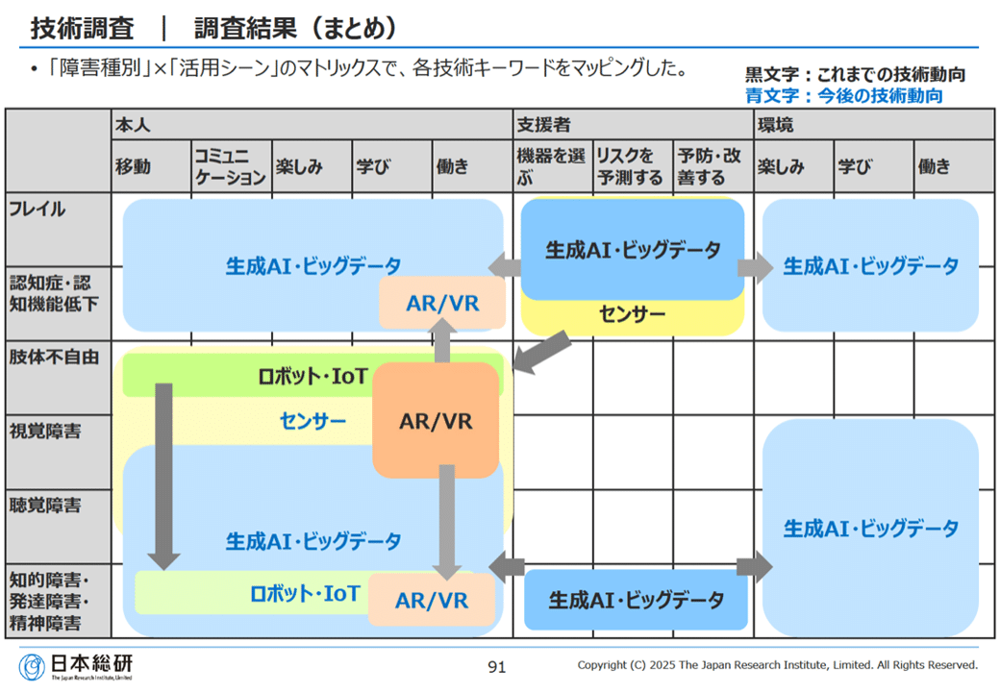
技術調査についても、要素が多岐にわたるため、マトリックスを使って整理しています。マトリックスで「現状」「将来」とその矢印をプロットすることで技術動向をわかりやすく整理しています。

### 考察と提案内容のスライド

最後に調査結果からの考察と提案内容のスライドです。調査業務の集大成のスライドなので、情報もかなりリッチです。

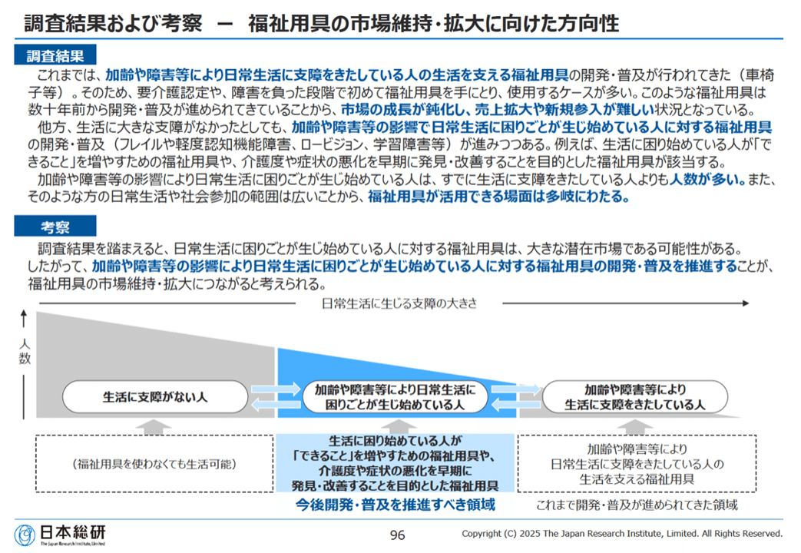
調査結果については、テキストでストーリ的にまとめ、そのうえで考察については図も使いながら整理をしています。テキストが多いので、青文字や太文字も使いつつ、読み手が何とか読み切れるような工夫がされています。
**先ほどの図から入らせるものとは逆で、下に図があることで、最初にテキストから入ってもなんとか読み進められる**という構造になっています。

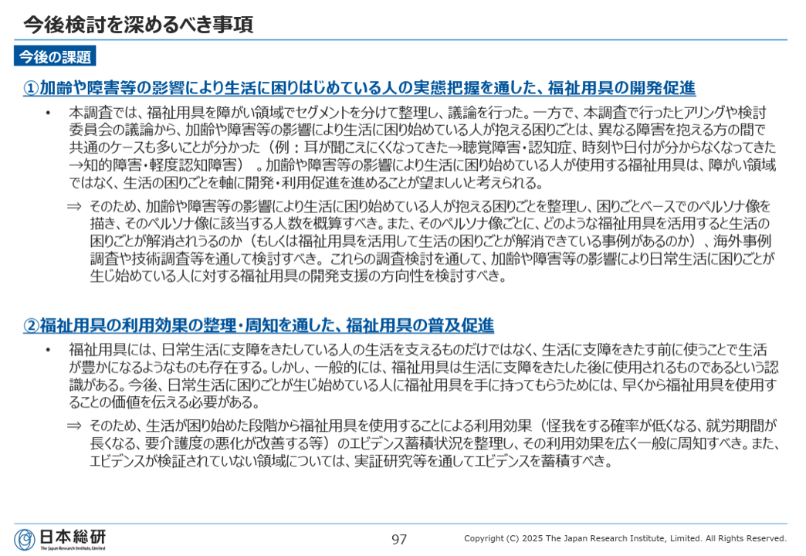
今後検討を深めるべき事項については、大きく二つのテーマを取り上げてテキストで詳細に記載しています。もう少し構造化の余地がありそうであありますが、おそらく内容の検討含めそこまで時間を掛けられなかったのではと想定されます。**内容が練り切れていない場合に、テキストでストーリー的に見せるのは有効な手段**なので覚えておきましょう。

## 三菱ＵＦＪリサーチ＆コンサルティング株式会社の資料

三菱UFJリサーチ＆コンサルティングの資料については、【メガバンクのパワポ紹介】三菱UFJグループのプレゼン資料のNoteですでに紹介しているので、そちらをご覧ください。

## みずほリサーチ＆テクノロジーズ株式会社の資料

みずほリサーチ＆テクノロジーズの資料についても同様に、【メガバンクのパワポ紹介】みずほグループのプレゼン資料のNoteですでに紹介しているので、そちらをご覧ください。

## 【コンサルのパワポ紹介】日系シンクタンク５社のスライド資料のまとめ

xxx。

## パワポ研オリジナルテンプレート

パワポ研では**「ビジネスシーンで使える」パワーポイントテンプレート**を公開しております。デザインを整えるのみならず、**ロジックやストーリーを整理する**のにも役立つパッケージになっておりますので、関心のある方は下記ページも併せてご覧ください！

上記の記事のように、noteでは**フォローしているだけでビジネスにおける「資料作成のコツ」と「デザインのセンス」が身に付くアカウント**を目指して情報配信を行っています。
今後もコンスタントに記事を配信していく予定なので、関心のある方は是非アカウントのフォローをお願いします！

**> Template販売　**[> https://powerpointjp.stores.jp/](https://powerpointjp.stores.jp/%EF%BF%BCnote)
**> note　**[> パワポ研の資料作成術](https://note.com/powerpoint_jp/m/mc291407396da)
**> X（旧Twitter)　**[> https://twitter.com/powerpoint_jp](https://twitter.com/powerpoint_jp)

## レックスアドバイザーズからのお知らせ

パワポ研は株式会社レックスアドバイザーズが運営しています。
レックスアドバイザーズは**経営企画職や経営管理職に特化した転職エージェント**です。
上場企業や上場準備企業を中心に、**経営企画、IR、経理財務、法務、内部監査等の職種の求人**をご紹介しているほか、**CFOなどのコンフィデンシャル求人**もご紹介可能です。
またコンサルティングファームや監査法人、会計事務所の求人も豊富にあるため、プロフェッショナルファームを目指す方のご支援も得意です。
求人紹介やキャリア相談を希望の方は、[**無料転職サポート**](https://www.career-adv.jp/job_search/entryform_exp/)よりサービス利用登録をしてみてください。

*レックスアドバイザーズのサービスサイトはこちら*

**> 求人をご希望の方　**[> 無料転職サポート](https://www.career-adv.jp/job_search/entryform_exp/)**
> 採用支援をご希望の方　**[> 採用サポート](https://www.career-adv.jp/request3/)
**> その他　**[> お問い合わせフォーム](https://www.rex-adv.co.jp/contact)
**> 書籍　**[> 注目企業の実例から学ぶパワポ作成術](https://www.amazon.co.jp/dp/4046060476)

