# 【マネしたい】カッコいいパワポの「青色系」プレゼン３選（2025年更新）

[note原文](https://note.com/powerpoint_jp/n/n38223e35b2b4)

みなさんこんにちは。
資料デザインのリサーチや分析に取り組むパワーポイントのスペシャリスト、パワポ研です。

今回は、**青色系のパワポに焦点を当て、上場企業のIR資料から参考になりそうな抜粋して紹介**していきます。カラーコードについても記載していきますので、見栄えの良い「色」について、パワポ作成の参考になれば幸いです。

同じように好評いただいているテーマ別のスライド紹介の記事は、2025年9月より最新事例へのアップデートを進めています。今どんな記事があり、どの記事がアップデートされているか知りたい方は下記のノートを参照ください。

ちなみに青色のプレゼンテーション資料としては、「もはやパワポが芸術的な領域に達している３社 」で取り上げた、メルカリとGoodpatchも素晴らしいのですが、重複を避けるため今回は取り上げませんでした。気になる方はリンクから飛んでみてくださいね。

## グラデーションが美しいスライド見本

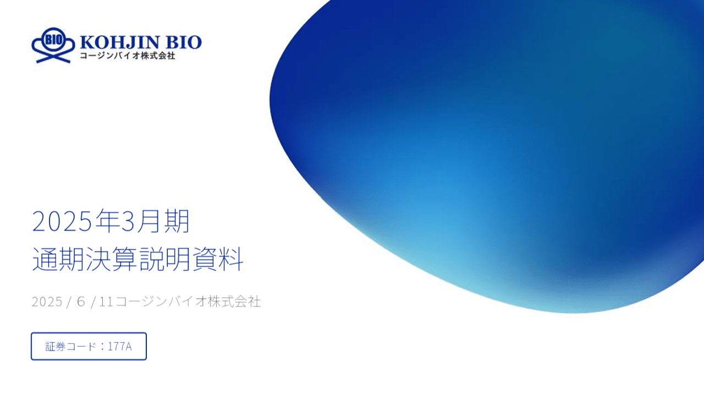
*コージンバイオ 東証グロース 171A*

> 引用元：[> 2025年３月期通期決算説明資料](https://kohjin-bio.jp/wp-content/uploads/2025_03_Financial_Report.pdf)

*https://kohjin-bio.jp/ir/presentations/*

コージンバイオの決算説明資料は、青色をベースにしつつ、グラデーションで見せるのが非常にうまいです。ディバイダーやエグゼクティブサマリーは青色の背景に白抜き文字、数値や戦略を見せるページは白色の背景に黒文字で、強調したいポイントを青文字で記載しています。

- 濃い青色のカラーコード：#0F2D93

- 薄い青色のカラーコード：#FF9101

- ターコイズのカラーコード：#00ACD2

### サマリーは濃い青色メインでデザイン

事業内容や事業戦略におけるまとめページは、濃い青色をメインにデザインされています。濃い青色を前面に押し出しつつ、グラデーションや、ピンポイントで水色を使うことで、メリハリのついたスライドになっています。

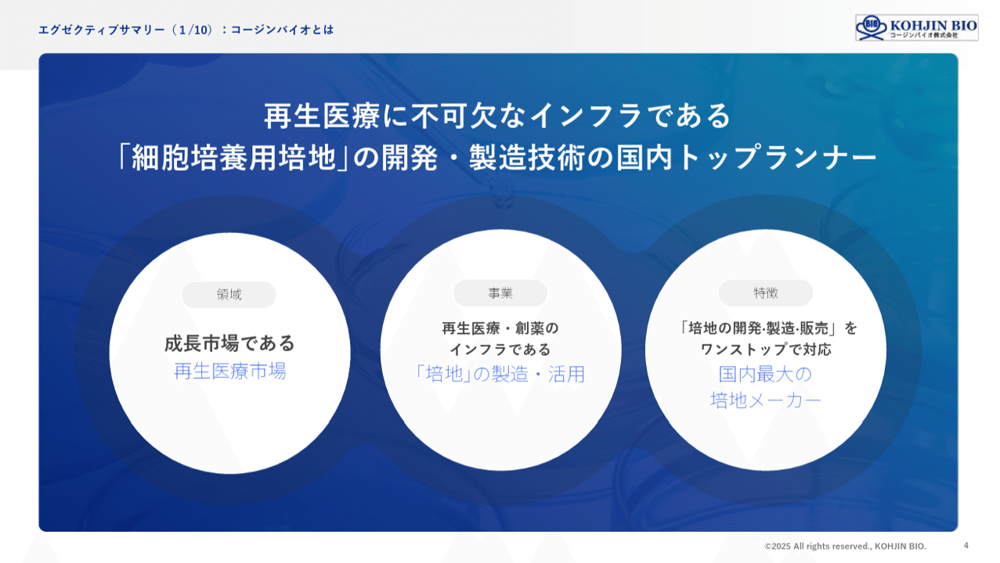

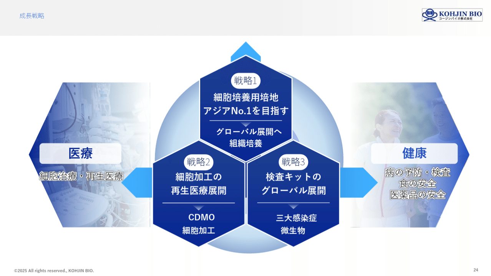

### 全体数字は青のグラデーションでデザイン

全てのセグメントを合わせた、企業全体の合計値のスライドは、青色のグラデーションで構成されています。円グラフにおいては、自社のコアターゲットから周辺に向けて徐々に青色が薄くなるデザインでとても見やすいです。

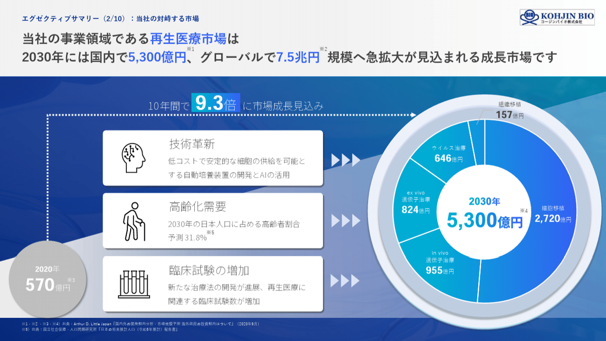

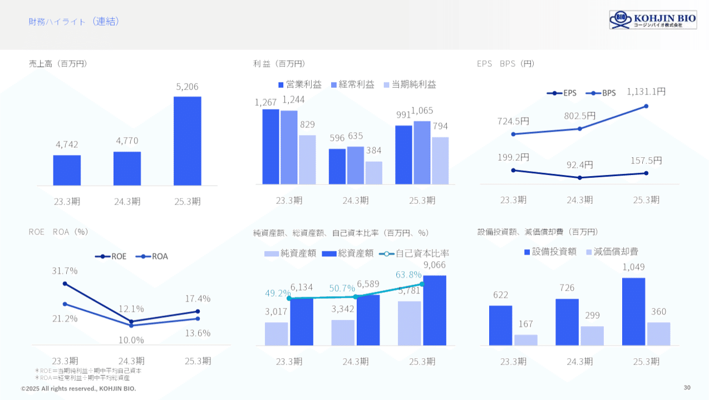

### セグメント別は３色の異なる青色でデザイン

セグメント事の数字を示したページでは、比較がしやすいように、同じ青色でも、濃い青色、明るい青色、ターコイズブルーと、異なる3色を使い分けています。

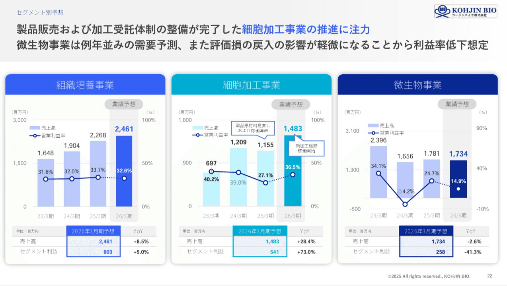

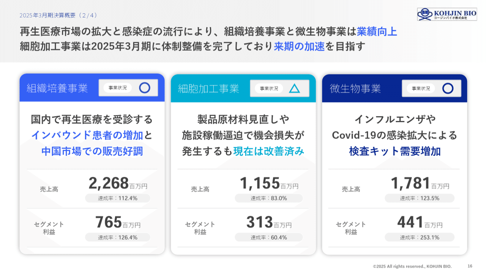

### 戦略も3色の青色の使い分けでデザイン

戦略のページについては、セグメント別の話が出てくる部分は先ほど見たセグメントごとの色、そうでないページについては、必要に応じて3色を使い分けて見せています。

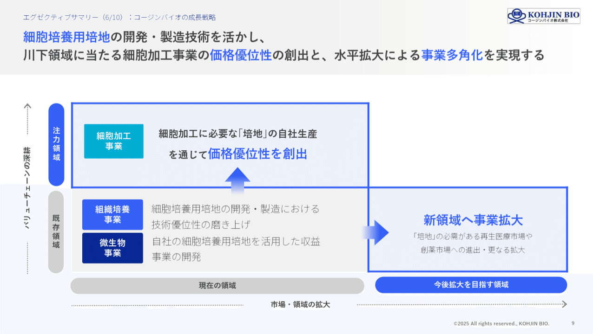

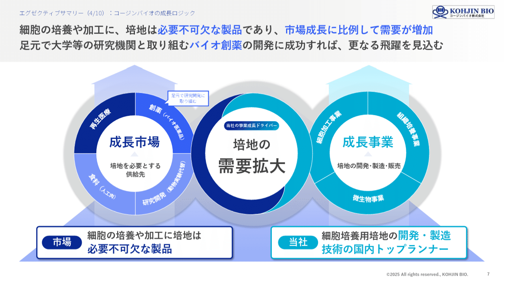

## 事業を適切に表すスライド見本

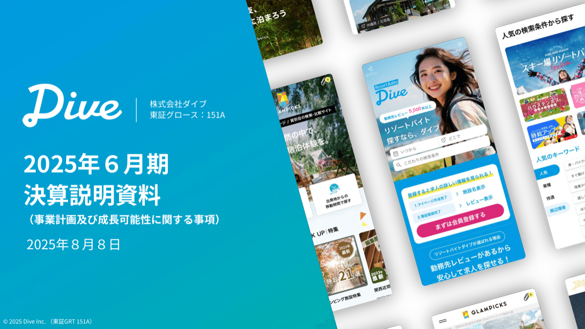
*DIVE 東証グロース 151A*

> 引用元：[> 2025年6月期 通期決算説明資料（事業計画及び成長可能性に関する事項）](https://ssl4.eir-parts.net/doc/151A/tdnet/2671665/00.pdf)

*https://dive.design/ir/library/presentation*

DIVEのプレゼンテーション資料は、[「ミッション」「ビジョン」「バリュー」スライド９選](https://note.com/powerpoint_jp/n/nb17a4621ac07#dedbac65-ea90-4308-915b-08f002ff3e04)や[「エグゼクティブサマリー」スライド９選](https://note.com/powerpoint_jp/n/nfa3e08dcd6f5)でも取り上げてきましたが、とにかく**海を想起させるターコイズブルーのカラーリングが絶妙**です。一方で過去の情報を見せる際には、見やすい水色1色にすることで、伝達すべきメッセージを明瞭に表現しています。ワンポイントカラーには黄色を使用していることも参考になります。

- 水色のカラーコード：#029FE6

- ターコイズブルーのカラーコードのカラーコード：#03ADAC

- 黄色（差し色）のカラーコードのカラーコード：#EDFF41

### サマリーは美しい海を想起させるデザイン

まとめのページは表紙と同じ、水色とターコイズブルーのグラデーションを多用しています。観光産業を主戦場とするダイブならではのカラーリングといえます。

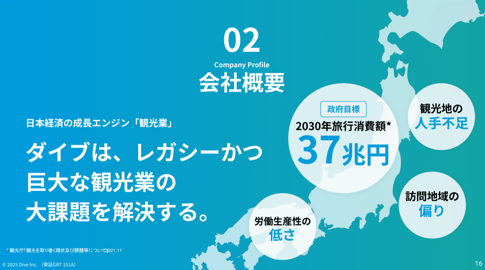

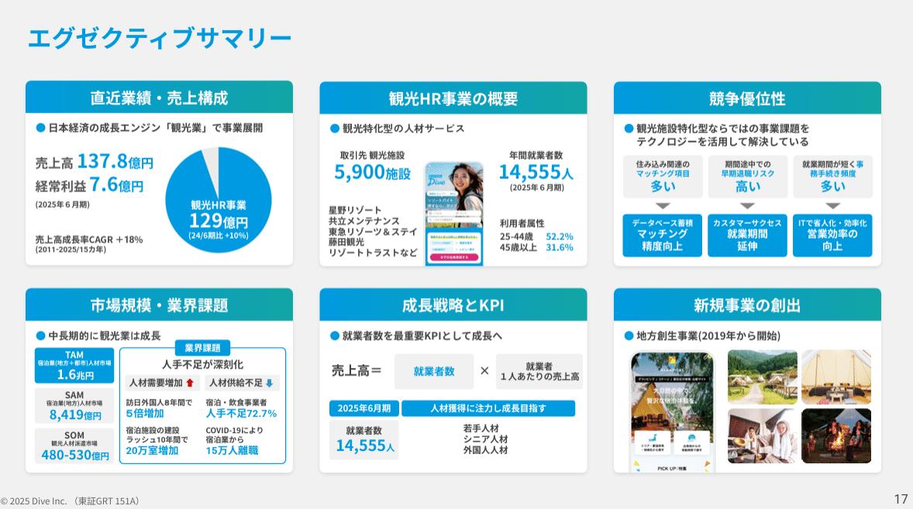

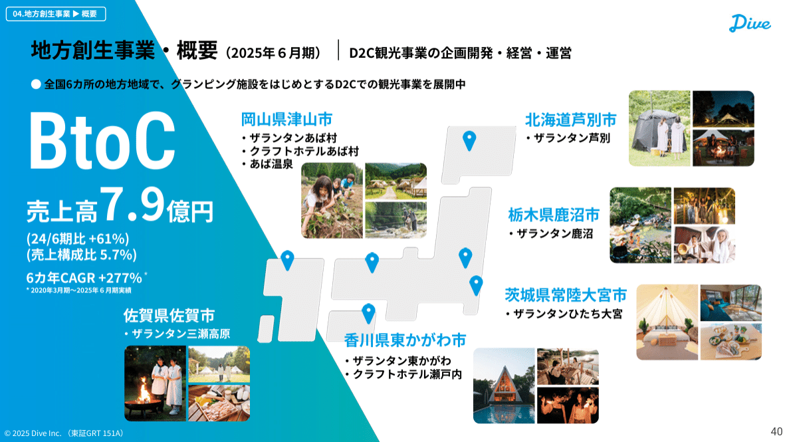

### 業績数字はすっきりと水色１色でデザイン

業績ハイライトなどフィナンシャルのページにおいては、美しさはある種ノイズになってしまいます。そうした数字を見せたいページでは**スライドを青系統の色で統一しながら、濃淡を巧みに駆使して、スライドのメッセージを伝えています**。ただしそれでは少し単調なので、黄色の差し色を入れているのもよいですね。

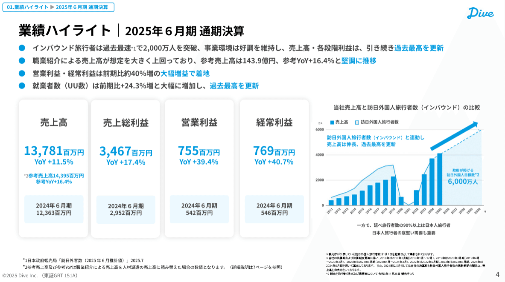

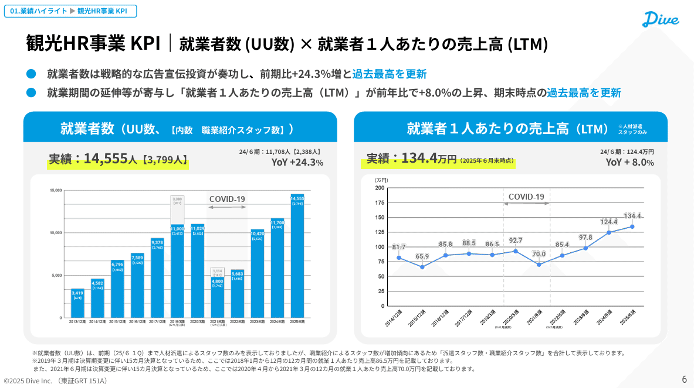

### コンセプトは2色の対比で見せるデザイン

コンセプトをまとめるページにおいては、水色とターコイズブルーの使い分けですっきりと見せることを徹底しており、非常に見やすくなっています。
統一されたルールがあるわけではなく、スライドごとに水色とターコイズブルーの役割が変わっています。

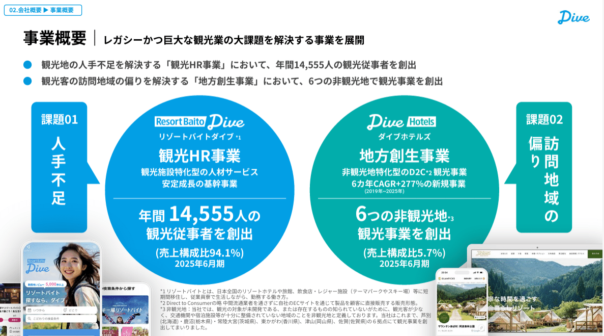

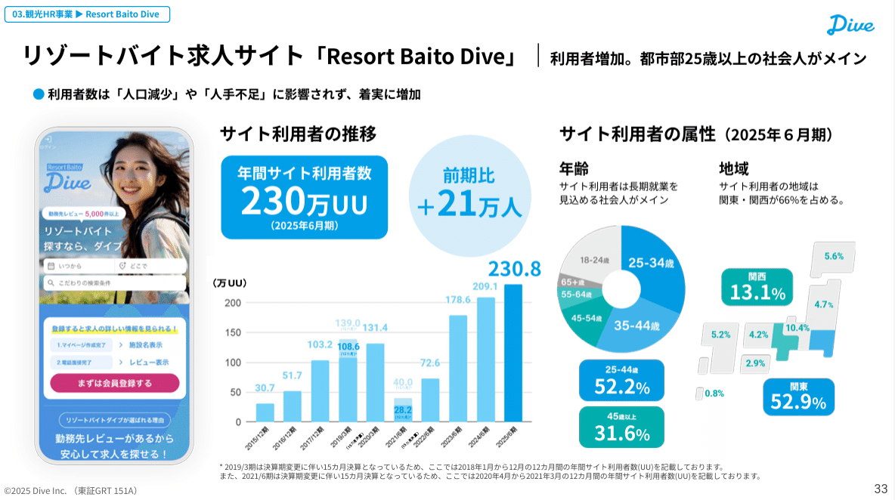

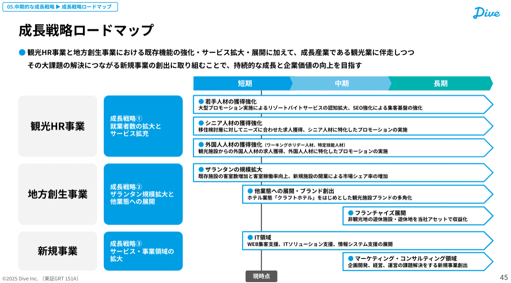

## 青系オンリーなのにカラフルなスライド見本

*Appier 東証プライム 4180*

> 引用元：[> 2024年12月期通期 決算説明資料](https://ssl4.eir-parts.net/doc/4180/tdnet/2569687/00.pdf)

*https://www.appier.com/ja-jp/ir-news*

Appierのプレゼンテーション資料は、青系統の様々な色を多用することで、青の配色でまとめながらもカラフルなデザインを実現しています。比較的情報量の多いページでも見やすいのは、**青系統で配色をまとめ、その濃淡を利用することで、メッセージとして伝えるべき項目に焦点が当たるように作成**しているからですね。

- 濃い青色のカラーコード：#0D00B0

- 青色のカラーコード：#0053F4

- 水色のカラーコード：#00AFEF

- 明るい水色ののカラーコード：#0D00B0

なお全体的に、「このシチュエーションではこの配色にする」といったルールは内容で、全体的にカラフルな仕上がりになっています。読み手を飽きさせないという観点では、有効な取り組みだと考えられます。

### 単色やグラデーションでデザイン

かっちりとしたルールはないものの、スライド自体が図をベースに構造化されている場合と、伝えたい情報がシンプルな場合に、単色やグラデーションを選んでいるような気がします。
例えば、「収益源の拡大・多様化に向けたドライバー」も、ドライバーが書いてあるものの、どちらかというと700億円という数字に注目させたいので、こうしたデザインになっているのかと思います。

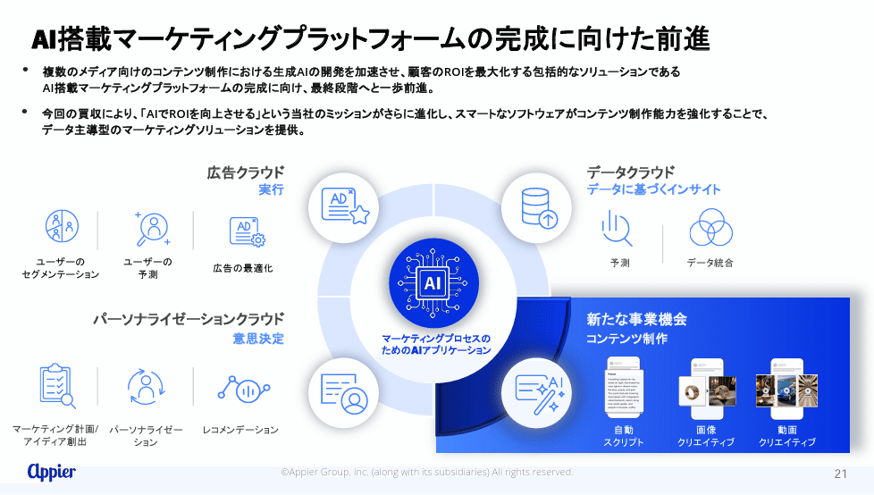

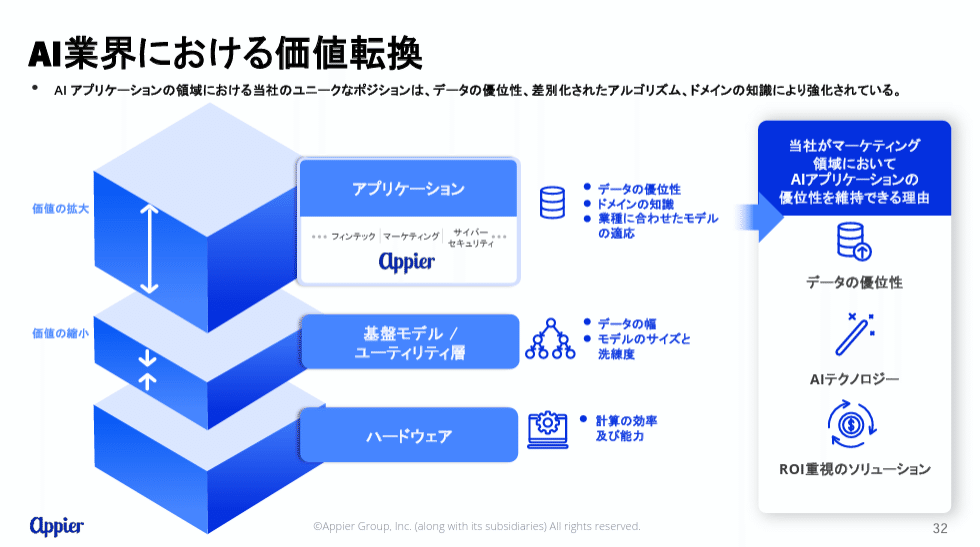

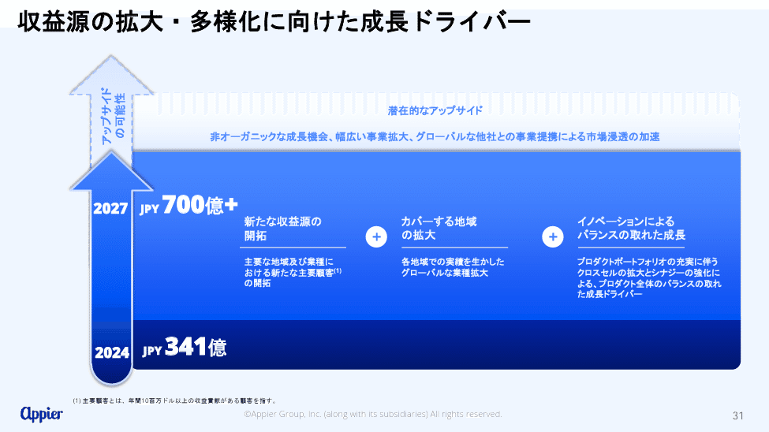

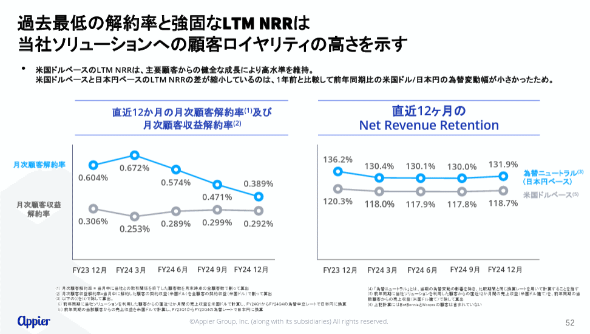

### 複数色でカラフルにデザイン

一方で、複数の要素が入ってくるサマリーや、複合グラフ、あるいは複数のメッセージがあるページにおいては、配色を増やしてカラフルにしている傾向が見て取れます。
「成長ドライバーを追加する」スライドでは、たくさんの要素があるものの、青色の濃淡でうまく情報を切り分けて伝えることで、伝わりやすいスライドになっています。

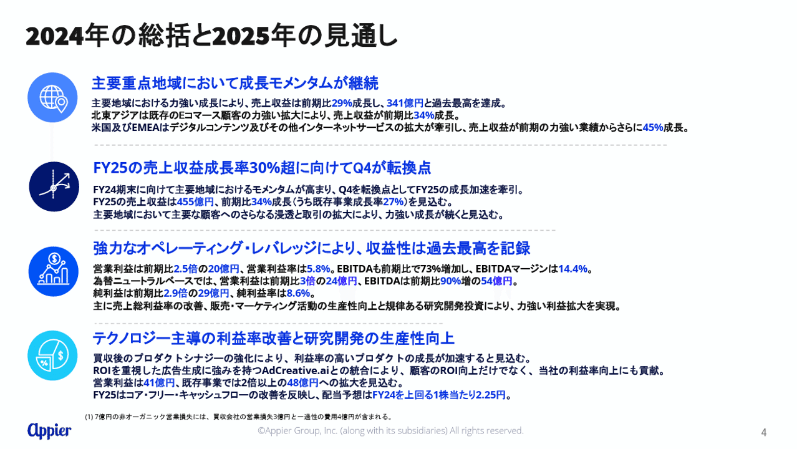

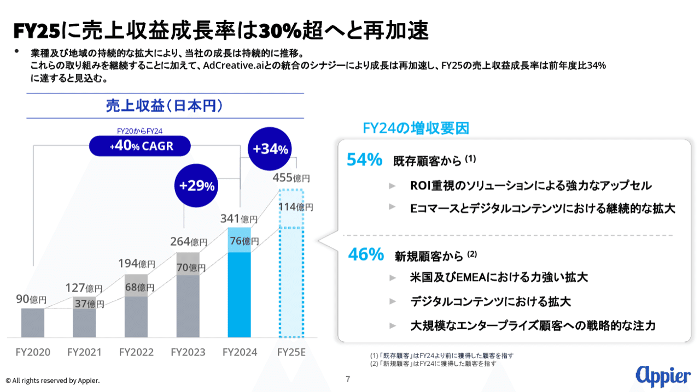

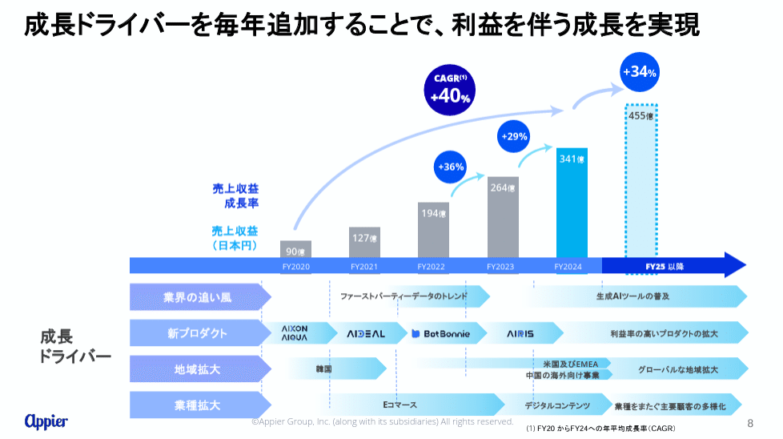

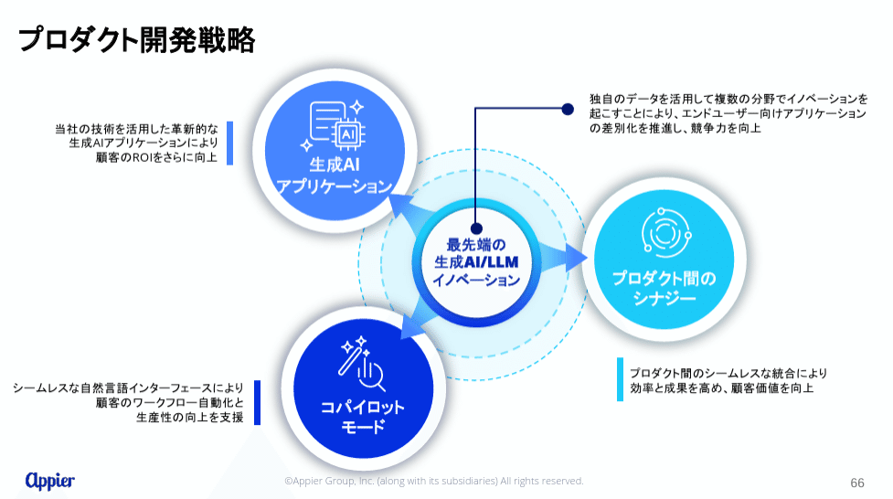

## 【マネしたい】カッコいいパワポの「青色系」プレゼン３選まとめ

いかがでしたでしょうか。青色でも様々な色があり、同じように見える青色もカラーコードを見てみると違っていたりと多くの発見があります。ワンポイントや濃淡の使い方に関しても参考にしてみて下さい。

## パワポ研オリジナルテンプレート

パワポ研では「ビジネスシーンで使える」パワーポイントテンプレートを公開しております。デザインを整えるのみならず、**ロジックやストーリーを整理するのにも役立つパッケージ**になっておりますので、関心のある方は下記ページも併せてご覧ください！

上記の記事のように、noteでは**フォローしているだけでビジネスにおける「資料作成のコツ」と「デザインのセンス」が身に付くアカウント**を目指して情報配信を行っています。
今後もコンスタントに記事を配信していく予定なので、関心のある方は是非アカウントのフォローをお願いします！

**> Template販売　**[> https://powerpointjp.stores.jp/](https://powerpointjp.stores.jp/%EF%BF%BCnote)
**> note　**[> パワポ研の資料作成術](https://note.com/powerpoint_jp/m/mc291407396da)
**> X（旧Twitter)　**[> https://twitter.com/powerpoint_jp](https://twitter.com/powerpoint_jp)

## レックスアドバイザーズからのお知らせ

パワポ研は株式会社レックスアドバイザーズが運営しています。
レックスアドバイザーズは**経営企画職や経営管理職に特化した転職エージェント**です。
上場企業や上場準備企業を中心に、**経営企画、IR、経理財務、法務、内部監査等の職種の求人**をご紹介しているほか、**CFOなどのコンフィデンシャル求人**もご紹介可能です。
またコンサルティングファームや監査法人、会計事務所の求人も豊富にあるため、プロフェッショナルファームを目指す方のご支援も得意です。
求人紹介やキャリア相談を希望の方は、[**無料転職サポート**](https://www.career-adv.jp/job_search/entryform_exp/?utm_source=note&utm_medium=referral&utm_campaign=note_pp)よりサービス利用登録をしてみてください。

*レックスアドバイザーズのサービスサイトはこちら*

**> 求人をご希望の方　**[> 無料転職サポート](https://www.career-adv.jp/job_search/entryform_exp/)**
> 採用支援をご希望の方　**[> 採用サポート](https://www.career-adv.jp/request3/)
**> その他　**[> お問い合わせフォーム](https://www.rex-adv.co.jp/contact)
**> 書籍　**[> 注目企業の実例から学ぶパワポ作成術](https://www.amazon.co.jp/dp/4046060476)

