# 【BIG4のパワポ紹介】PwCグループのプレゼン資料（2025年）

[note原文](https://note.com/powerpoint_jp/n/n3a28e61e599d)

みなさんこんにちは。
資料デザインのリサーチや分析に取り組むパワーポイントのスペシャリスト、パワポ研です。

このシリーズでは**BIG4のパワーポイント資料に焦点を当てて、デロイトトーマツ、PwC、KPMG、EYのパワポを紹介**していきます。
各グループとも、コンサルティングファーム、フィナンシャルアドバイザリーサービス（FAS）、監査法人、税理士法人を持っていますので、それぞれのファンクションのスライドを紹介していきますね。これまでに紹介したNoteは以下の通りです。

第二弾はPwCグループです！今回は４つの法人のパワーポイントを見ていきます。

- PwCコンサルティング合同会社

- PwCアドバイザリー合同会社

- PwC Japan有限責任監査法人

- PwC税理士法人

資料はいつものように、[経産省の委託調査報告書](https://www.meti.go.jp/topic/data/e90622aj.html)から引用しております。

## PwCコンサルティング合同会社の資料

まずはPwCコンサルティングの調査報告資料を見ていきましょう。ここでは「令和６年度製造基盤技術実態等調査事業（我が国ロボット産業の基盤強化に向けた調査事業）」のパワーポイントを見ていきます。

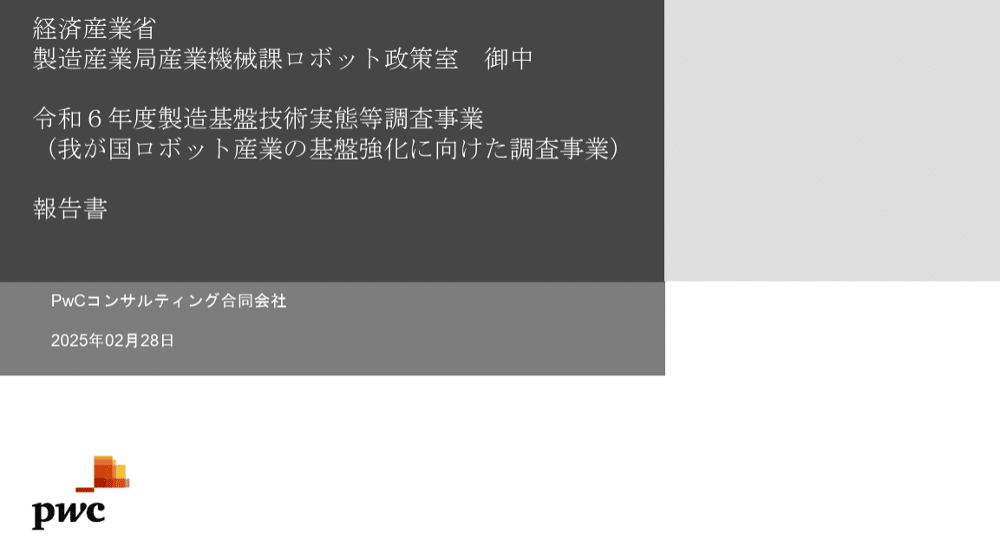
> 引用元：[> 令和６年度製造基盤技術実態等調査事業（我が国ロボット産業の基盤強化に向けた調査事業）](https://www.meti.go.jp/meti_lib/report/2024FY/000698.pdf)

*https://www.meti.go.jp/meti_lib/report/2024FY/itakuichiran2024FY.pdf*

### 背景と目的のスライド

まずは背景と目的のパワポから見ていきましょう。ロボットの導入・実装の拡大に資するオープン開発環境の構築を念頭に、強調領域のなりうる領域の特定や企業間で取り組むべき方策などについて調査するとなっています。

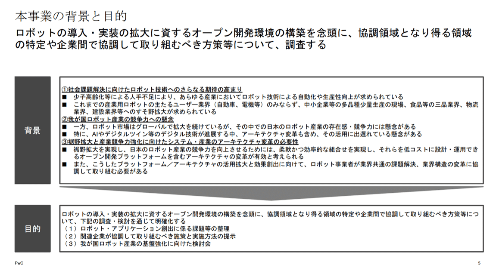
パワーポイント上部はスライドタイトル＋サマリーとなっていて、その下に背景と目的がテキストで記載されています。
テキストベースですが、**行間がほとんどないため、ややビジーな印象**を受けますが、多くの読者にとってはそこまで重要ではないため、問題ないといえますね。配色はモノクロで固めの印象を受けます。

### 業務内容のスライド

調査業務の全体像を示したパワポです。どのような業務を行うのか、またどのようなスケジュールで行うのかをまとめています。

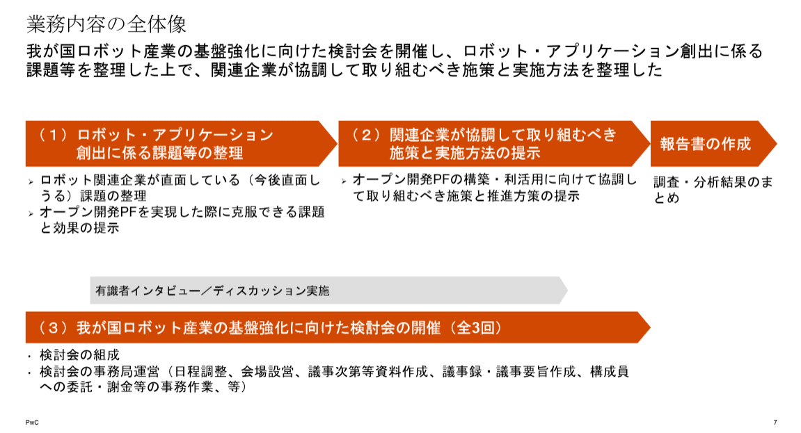
上段は大きな検討の流れとして、「課題の整理」「施策と実施方法の提示」「報告書の作成」を進めていくことを示しています。並行して検討会を実施することを示すために、**下段には全３回の検討会の矢羽を、「課題の整理」「施策と実施方法の提示」と同じ長さで示して**います。

また「有識者インタビュー／ディスカッション」を実施することを示していますが、プロジェクト開始直後ではなく、少し経ってから実施することを示すために、**矢羽の左端を少し遅れてスタート**させています。配色は全体をブランドカラーのオレンジにしつつ、有識者インタビューのような作業の部分は灰色にするという工夫をしています。

### 分析内容のスライド

つづいて分析内容のスライドです。最初に整理学として、どのように課題を整理するかまとめていますが、ここではMETIの過去資料で示されているロボットSIのバリューチェーンを引用してまとめています。**フレームワーク設定が難しいときに、METI等の過去の整理を使うのはコンサルでは割とベーシックな手法**ですね。

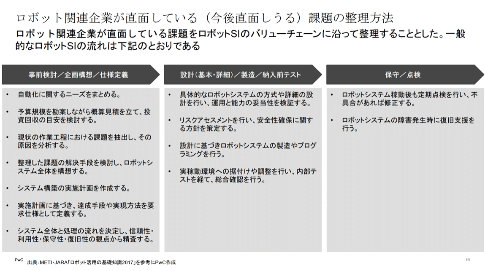
ここでは矢羽とテキストでシンプルにまとめています。作業工程なので、あえて構造化などはせず、作業手順のような感じでまとめていますね。色合いも引き続きモノクロで淡々とした印象です。

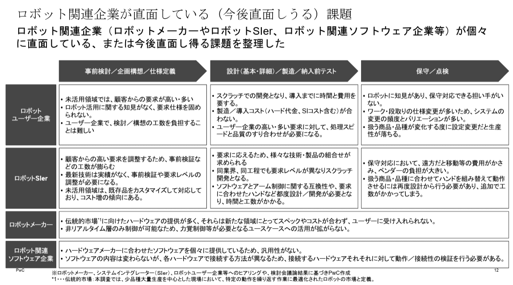
続いて前頁の整理に基づいて課題をまとめたスライドですが、こちらも同じフレームを踏襲しつつ、左側にプレイヤーを入れています。
もう少し構造化した方が見やすくはなるものの、**ここではあえて課題を生々しく伝えてインパクトを出すため**に、テキストの羅列という手法を取っています。

意図的かはわかりませんが、**腰の重い聞き手にインパクトを与えるにはきれいにまとめすぎない方がよいこともあり**、高等テクニックとして覚えておいてもよいでしょう。

### 提案内容のスライド

最後に調査報告資料の成果である、提案内容のスライドを見ていきましょう。この報告書ではそこまで途中の分析内容は出てきませんが、提案内容は非常に読みごたえがあります。

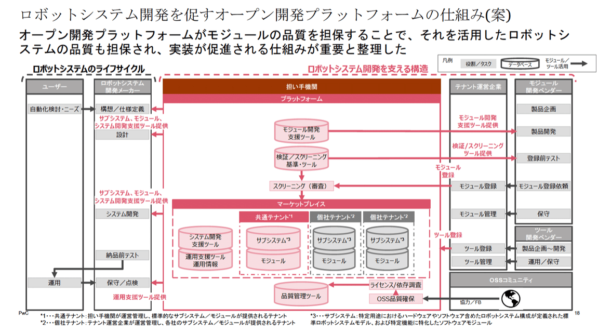
開発オープンプラットフォームに関する仕組み案のスライドです。プラットフォームの担い手がどのような機能を持つべきか、またどのようにエコシステムの中で価値提供していくかを、円柱と矢印で示しています。
**全体を灰色にする中で、真ん中を赤系で強調しているだけでなく、実線と点線を駆使して、様々な情報を付加している**点も参考になります。

提案内容におけるキーとなるスライドを「キラーチャート」と呼ぶこともありますが、まさしくキラーチャートですね。恐らく作成にそれなりの時間がかかっていることでしょう。余談ですが、真ん中の配色が、某戦略ファームの昔の独特な色遣いに似ている点が気になってしまいました。某ファームからの転職者が参画していたのでしょうか。笑

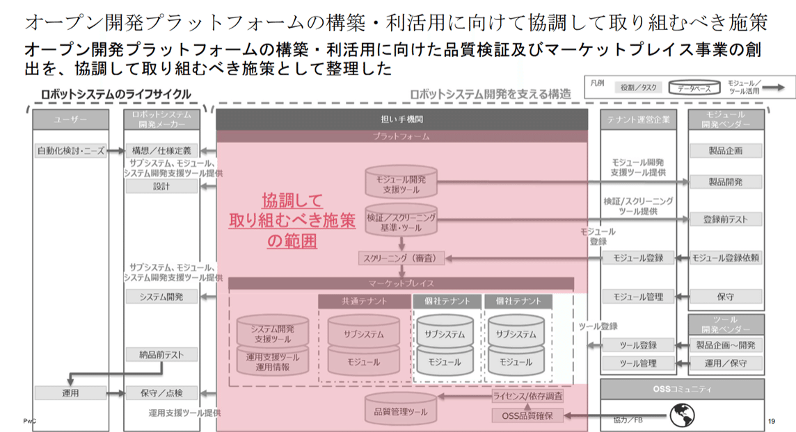
次のスライドでは、**前頁の図をそのままに色を薄くし、その上からピンクのシャドーで網掛けをして、「協調して取り組むべき施策の範囲」を示して**います。パワーポイントを使いながら２ページで動的に見せることができるので、非常に有効なテクニックです。印刷する場合は、上下にこの２スライドが来るようにページを工夫したいですね。

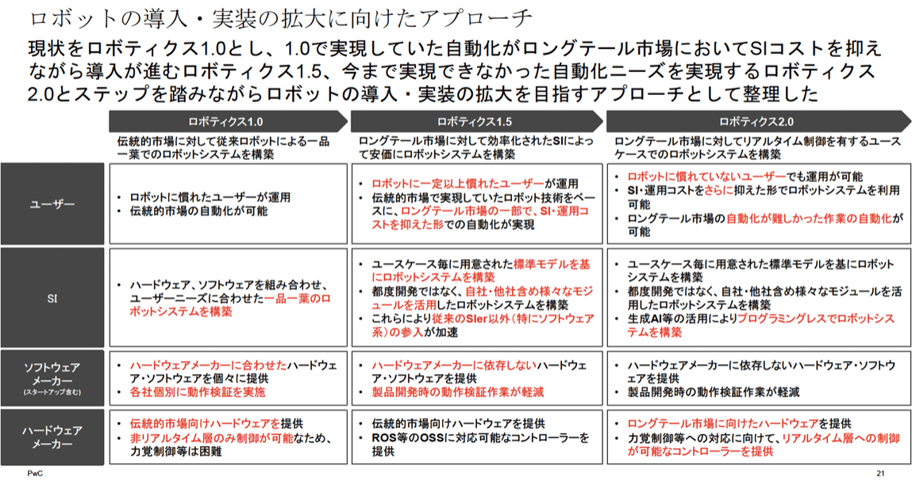
続いてロボットの導入や実装の拡大を目指すステップについてまとめています。ここでは「ロボティクス1.0」「ロボティクス1.5」「ロボティクス2.0」とすることでステップをわかりやすく示しています。**ラベリングはコンサルタントの腕の見せ所ですが、バージョンぽく見せるのはよくある手法**です。

着目すべきは、オレンジ色でテキストをハイライトしている点です。先ほどモノクロのスライドを、あえて構造化せずにインパクトを出していると説明しましたが、ここでオレンジを使っているのを見るに、先ほどのスライドはあえて白黒にしているのでしょう。

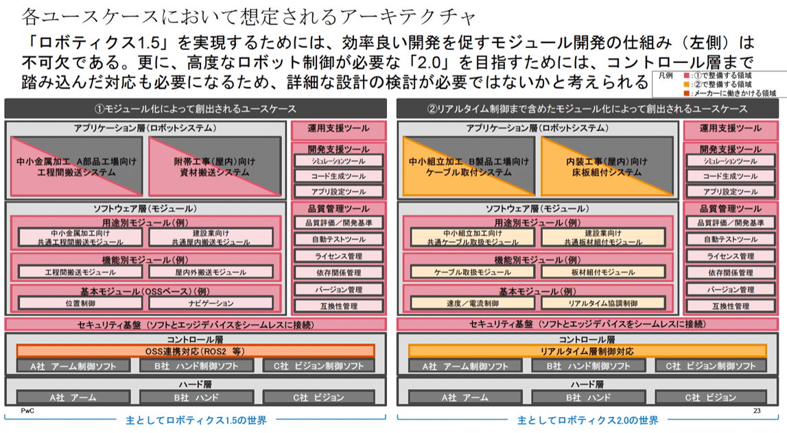
最後にもう一枚のキラーチャートです。ここではモジュールによって創出されるユースケースと、リアルタイム制御まで含めたモジュールによって創出されるユースケースに分けたうえで、どのように進めていくべきかを配色を変えて見せています。
**全く同じ構造の図を左右に並べつつ、色合いの違いで差分を見せる、高等テクニック**ですね。

## PwCアドバイザリー合同会社の資料

次はPwCアドバイザリーの調査報告資料を見ていきましょう。ここでは「令和２年度新エネルギー等の導入促進のための広報等事業（洋上風力発電導入拡大に向けた広報事業）」のパワーポイントを見ていきます。

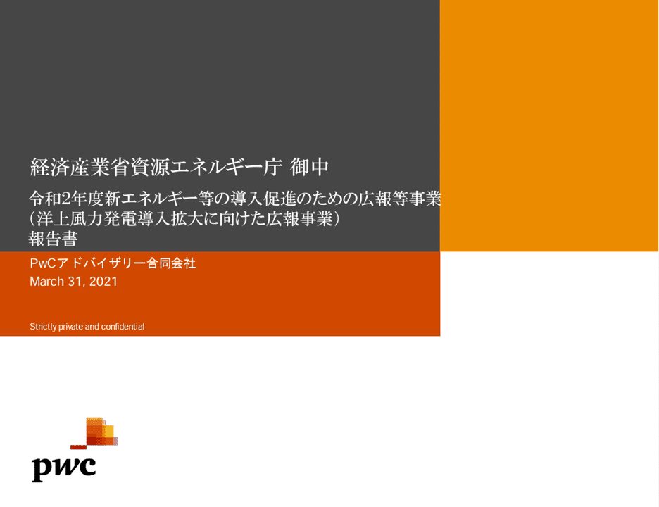
> 引用元：[> 令和２年度新エネルギー等の導入促進のための広報等事業（洋上風力発電導入拡大に向けた広報事業）報告書](https://www.meti.go.jp/meti_lib/report/2020FY/000567.pdf)

*https://www.meti.go.jp/meti_lib/report/2020FY/itakuichiran2020FY.pdf*

### 背景と目的のスライド

まずは目的と論点です。テキストベースでびっしりと事業の背景や目的が記載されています。

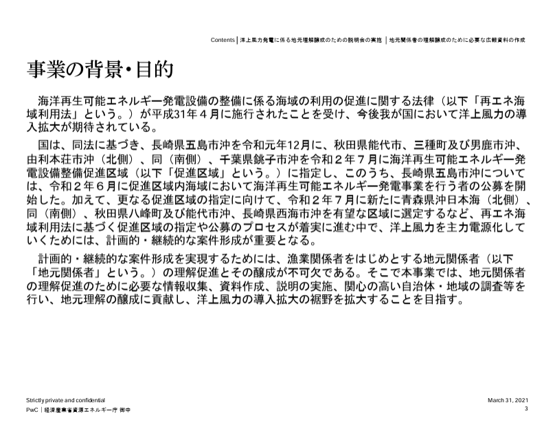
本件調査資料ということもあり、全体的に文字が多いスライドとなっています。**財務DDなどでも前提条件は丁寧に前段でまとめますが、それと同じような印象**を受けます。

### 業務内容のスライド

次に調査業務のフローを示したスライドです。どういった手順で調査が進むのかをフロー図で示しています。

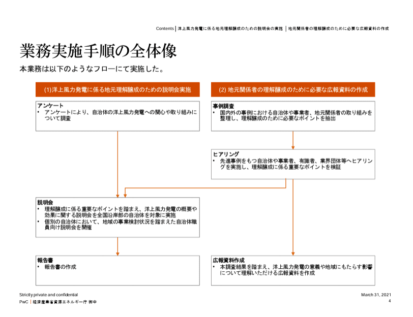
PwCコンサルティングは横にフローが流れていましたが、PwCアドバイザリーは縦に流しています。どちらが正解というものではなく、目的に応じて使い分けるとよいですね。

このプロジェクトでは、**「説明会の実施」と「広報資料の作成」という大きな２つの幹があるため、それぞれがわかりやすいように縦のフローにしている**のかなと思います。またステップが4つあるので、横に流すと各ボックスが縦長になって行数が増えてしまうというのもありますね。

### エグゼクティブサマリーのスライド

調査結果を１枚にまとめたスライドです。地元関係者の理解促進に向けた５つの重要な要素がまとめられています。

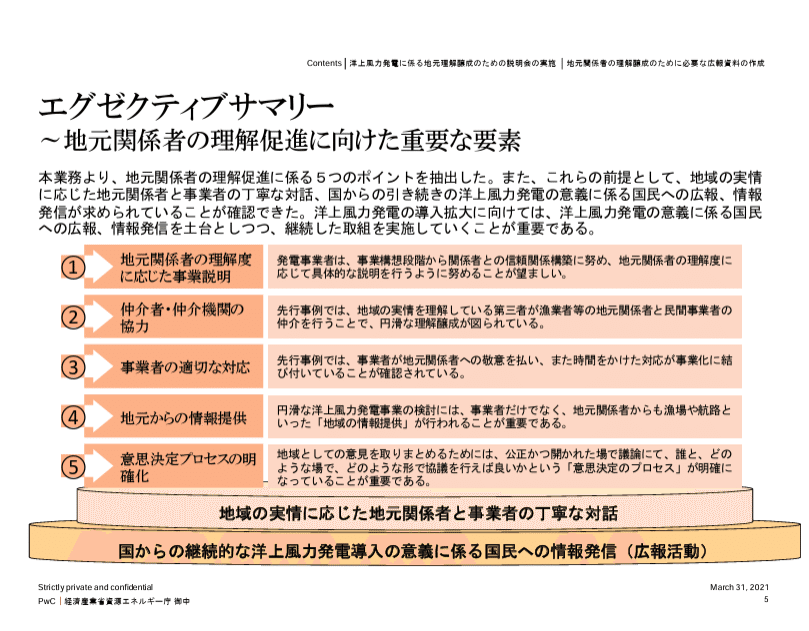
上部にタイトルとまとめ、ボディに具体的な要素、下段その前提となる土台という構成になっています。テキストの下に土台があるのは珍しいです。

スライドのまとめが４行になっていてやや長い印象を受けますが、サマリーなのでテキストが多くなってしまうのは仕方ないですね。

### 分析内容のスライド

分析内容のスライドを見ていきましょう。デスクトップリサーチと、成功事例へのヒアリングが行われています。

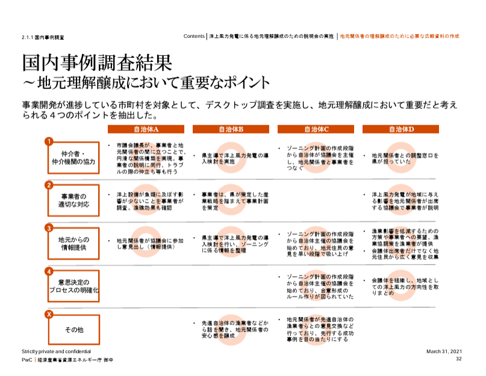
ここでは自治体が重要だと考えているポイントを把握するために、事業開発が進んでいる市町村を対象にHP等の調査をしています。

結果として導き出された要素を左に並べたうえで自治体ごとに見られた内容を入れています。表形式のスライドで、各項目に丸や✕を入れるのはよくありますが、このように**透過性を上げることで、評価とその理由を一緒に示すこと**ができます。

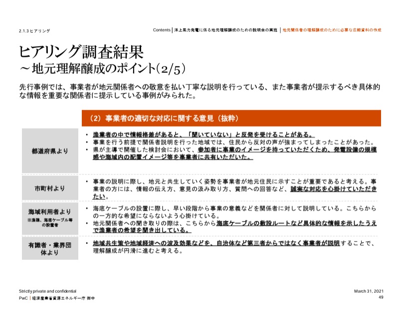
ヒアリング調査の結果をまとめたスライドです。意見のスライドなので、PwCコンサルの時にもあったように、**あえてきれいに構造化することはせずテキストをそのまま記載しています**。重要なポイントは太字と下線で強調していますね。

PwCアドバイザリーへの転職を検討されている方は[こちら](https://www.career-adv.jp/lp/casual/)から。

## PwC Japan有限責任監査法人の資料

続いてPwC Japan有限責任監査法人の調査報告資料を見ていきましょう！「コーポレートガバナンス改革の実質化に向けた調査」のパワーポイントを見ていきます。

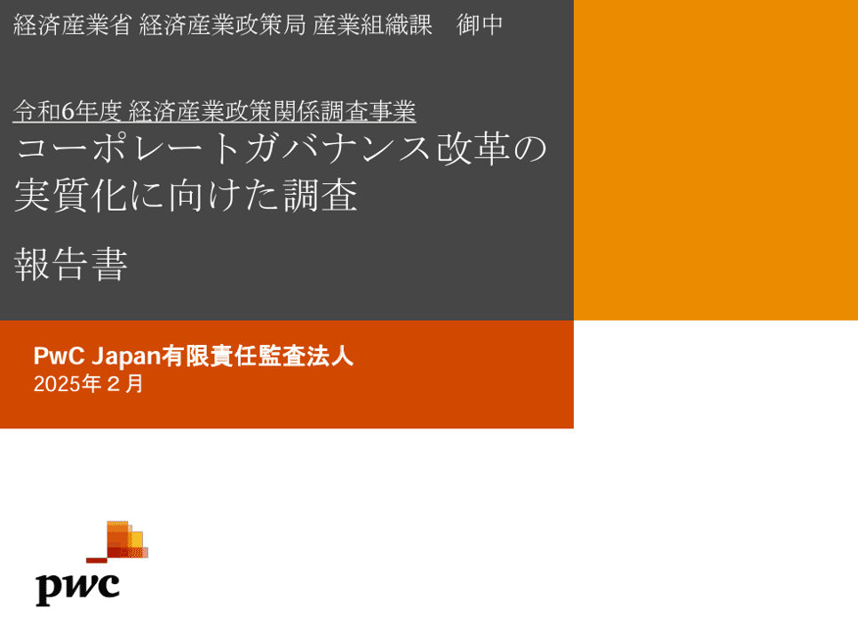
> 引用元：[> コーポレートガバナンス改革の実質化に向けた調査報告書](https://www.meti.go.jp/meti_lib/report/2024FY/1000049.pdf)

*https://www.meti.go.jp/meti_lib/report/2024FY/itakuichiran2024FY.pdf*

### 調査概要のスライド

まずは調査概要について見ていきます。背景と目的や、枠組みが記載されています。

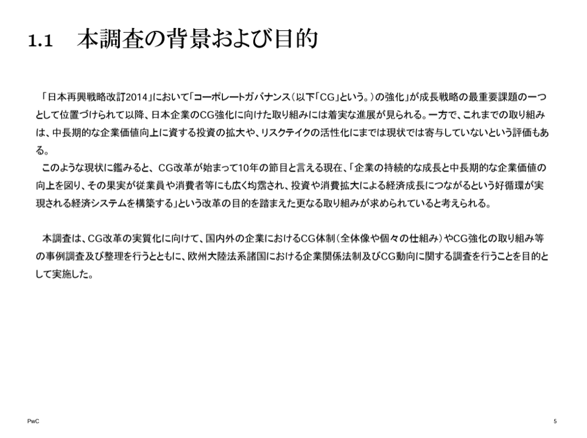
背景と目的のスライドは、PwCの他の最終報告書同様に、テキストベースで記載されています。次のページで詳細な枠組みが記載されていることもあり、軽く流す位置づけのスライドです。

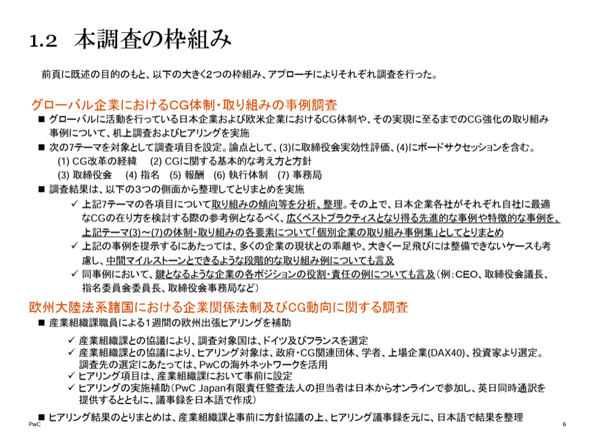
調査内容については、大項目、中項目、小項目及び詳細という形で構造化がされています。また大項目はオレンジでハイライトされています。

この資料はまさに調査という感じで、この後も詳細な調査結果が並んでいくので、このページで調査の構造を理解させることが重要です。**構造化がしっかりしているので読みやすいスライド**となっています。

### 分析内容のスライド

続いて調査内容の詳細のスライドです。極めて専門的な内容です。

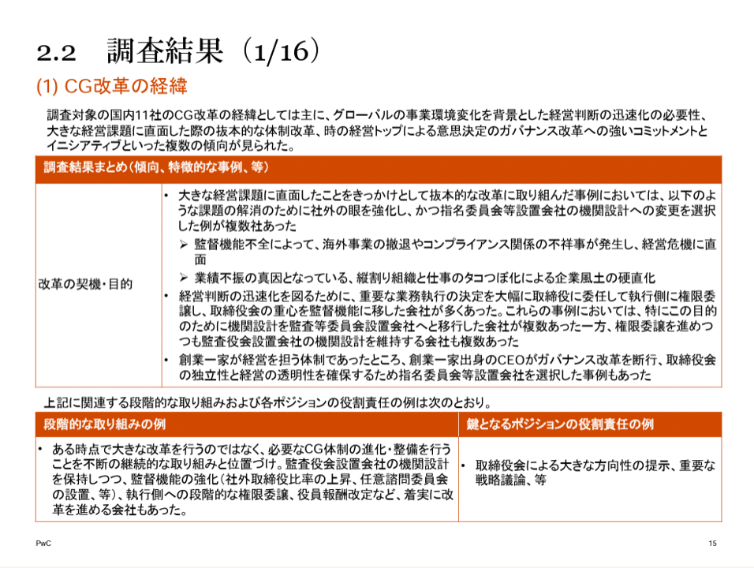
調査結果について、詳細にテキストで記載をされています。一応表形式は取っているものの、ほぼほぼテキストオンリーのスライドで、**まさに監査法人といった感じ**です。

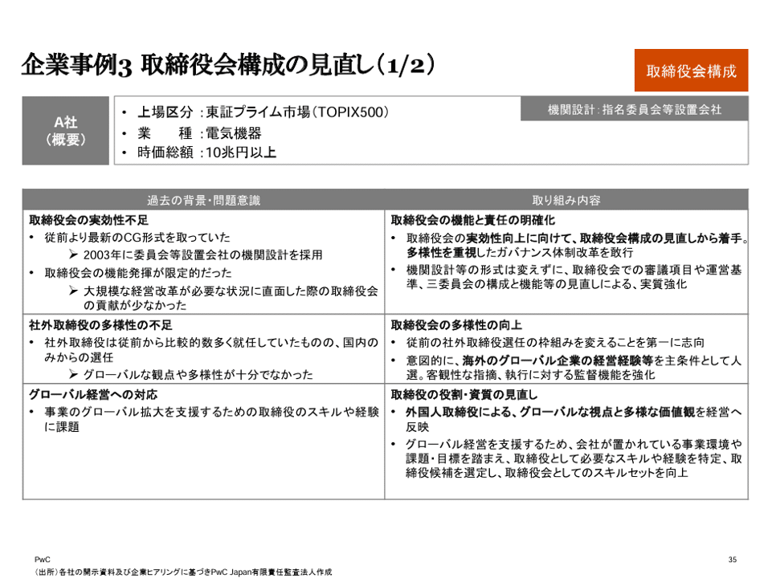

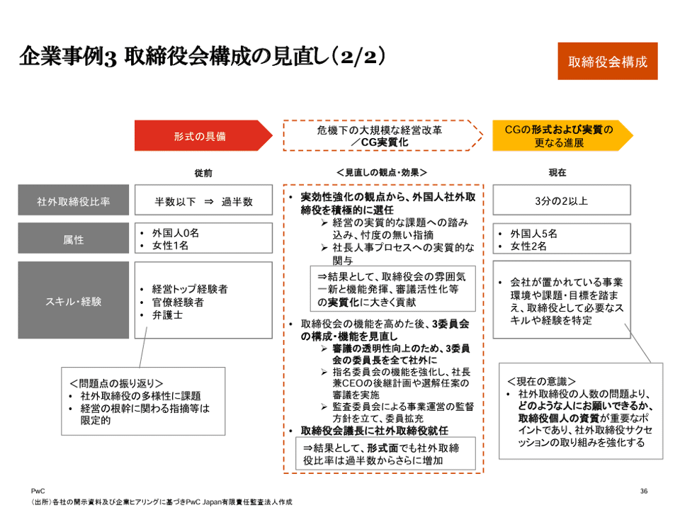
ここからは事例のスライドが続きますが、上段にタイトルと調査カテゴリ、その下に事例となった企業の概要、その下に事例の内容となっています。
１ページ目はテキストオンリー、２ページ目に変革の内容をタイムライン形式で示していますが、こちらもほぼほぼテキストで構成されています。

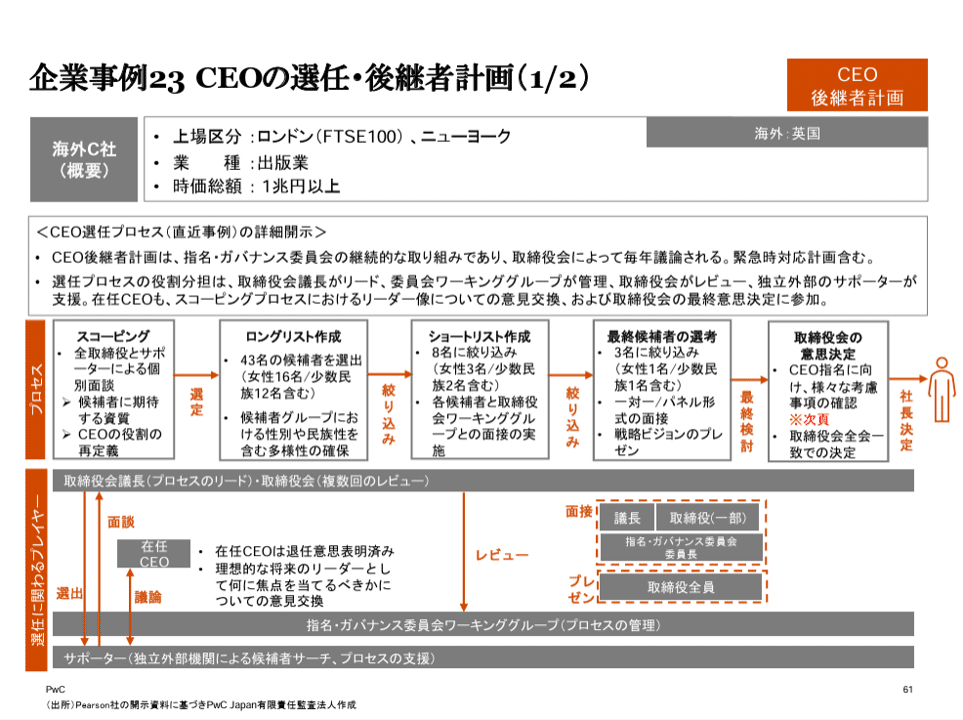
フローチャートが使われたスライドです。監査やガバナンスの観点では、**どのようにガバナンスが効いているかフローチャートで示すことが多い**ですが、こちらも監査法人っぽいスライドです。

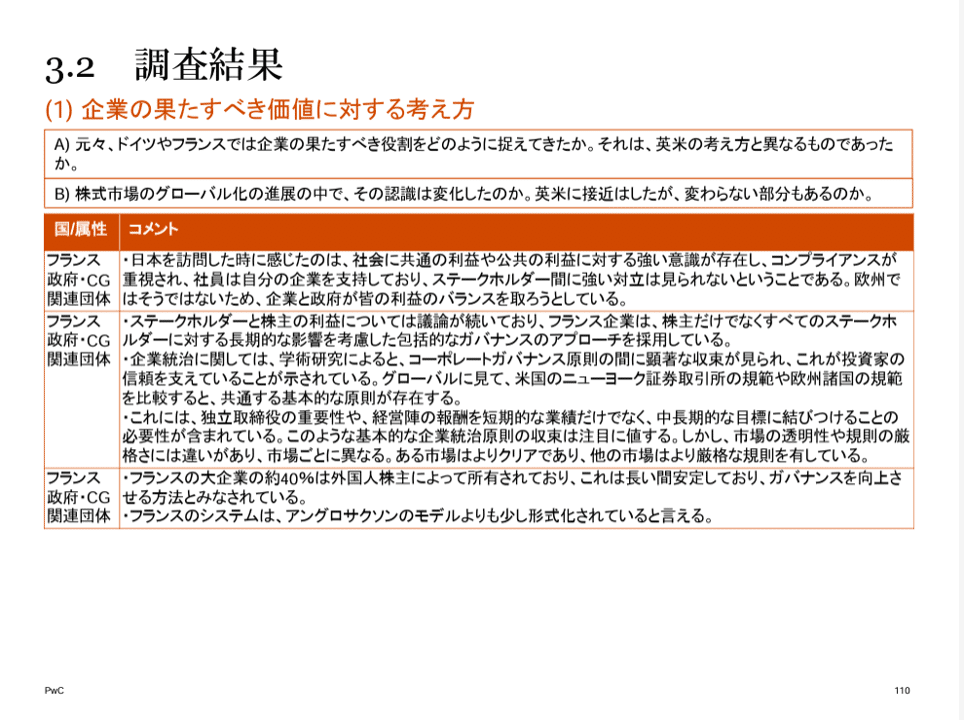
ヒアリング調査の結果のページも同じような構成で、上部にタイトル、その下にヒアリング内容、その下にコメントという構造になっています。
**コメント自体に価値があるスライドなので、構造化などはせず生の声を記載**しています。

PwC Japan有限責任監査法人への転職を検討されている方は[こちら](https://www.career-adv.jp/lp/casual/)から。

## PwC税理士法人の資料

最後にPwC税理士法人の調査報告資料を見ていきましょう！あまりパワーポイント資料がなかったのですが、いくつか拾い集めてみました。

### 調査内容のまとめスライド

暗号資産について、税制、会計、法規制の観点からまとめたスライドです。おそらく弁護士法人ともセットで作成したものでしょう。

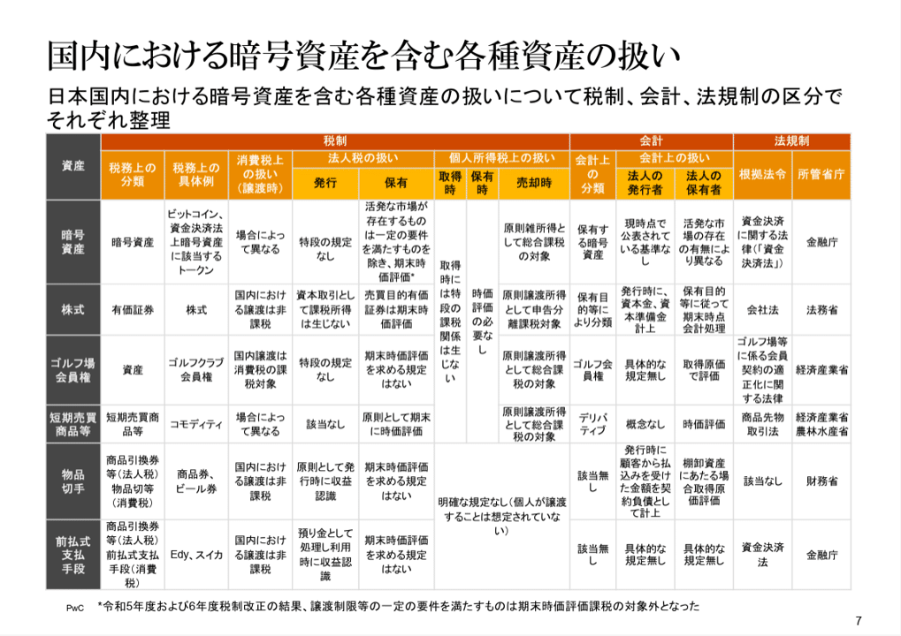
> 引用元：[> 内外一体の経済成長戦略構築にかかる国際経済調査事業（Web3.0 促進のための政策手法等に係る調査等事業）](https://www.meti.go.jp/meti_lib/report/2023FY/000634.pdf)

*https://www.meti.go.jp/meti_lib/report/2023FY/itakuichiran2023FY.pdf*

項目が多岐にわたるため、以下に１枚のスライドにまとめるかがカギになります。ここではセルを一体化しても問題ない部分を一体化していくことで紙面を有効活用するなどして、何とか１枚にまとめています。

### スケジュールのまとめスライド

令和３年度大阪・関西万博 政府開催準備事業 （２０２５年大阪・関西万博における課税に関する特別 措置に関する調査）から引用してきたスケジュールのスライドです。報告書自体はワードですが、その中にある画像を引用しています。

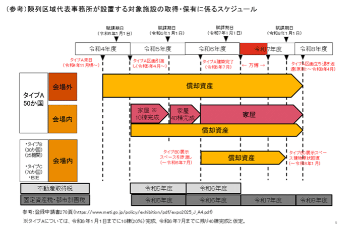

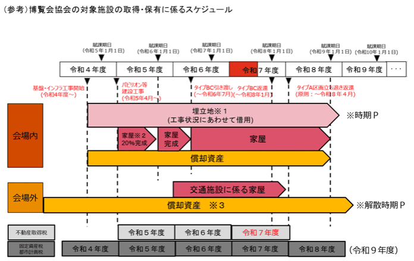
> 引用元：[> 令和３年度大阪・関西万博 政府開催準備事業 （２０２５年大阪・関西万博における課税に関する特別 措置に関する調査）](https://www.meti.go.jp/meti_lib/report/2021FY/000440.pdf)

*https://www.meti.go.jp/meti_lib/report/2021FY/itakuichiran2021FY.pdf*

万博における施設の取得・保有スケジュールと、それに対して不動産取得税や固定資産税がどのように発生するかをタイムラインでまとめています。少し色が多めですが、会場の中か外か、また埋立地か家屋か、といった区分をわかりやすく見せるには仕方ない部分がありますね。

PwC税理士法人への転職を検討されている方は[こちら](https://www.career-adv.jp/lp/casual/)から。

## PwCグループへの転職を考えている方へ

パワポ研は株式会社レックスアドバイザーズが運営しています。
**レックスアドバイザーズは会計ファームへの転職支援に強みを持つ転職エージェント**です。PwCアドバイザリー、PwC Japan有限責任監査法人、PwC税理士法人、への転職を考えている方は、[無料相談フォーム](https://www.career-adv.jp/job_search/entryform_exp/)から相談してみてくださいね。

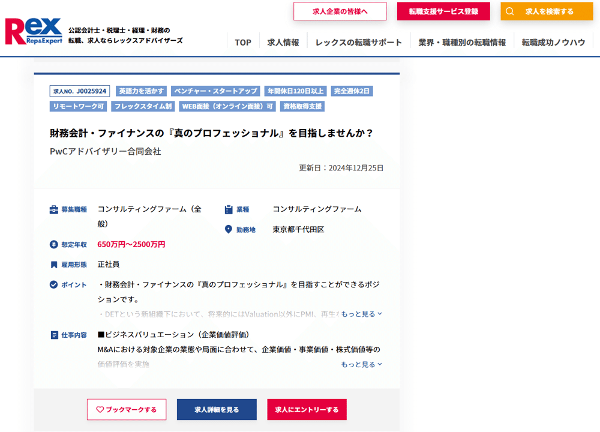
*PwCアドバイザリーの求人例*

*レックスアドバイザーズのサービスサイトはこちら*

## パワポ研オリジナルテンプレート

パワポ研では「ビジネスシーンで使える」パワーポイントテンプレートを公開しております。デザインを整えるのみならず、**ロジックやストーリーを整理するのにも役立つパッケージになっております**ので、関心のある方は下記ページも併せてご覧ください！

またパワポ研では、上記の記事のように、noteでは**フォローしているだけでビジネスにおける「資料作成のコツ」と「デザインのセンス」が身に付くアカウント**を目指して情報配信を行っています。
今後もコンスタントに記事を配信していく予定なので、関心のある方は是非アカウントのフォローをお願いします！

**> Template販売　**[> https://powerpointjp.stores.jp/](https://powerpointjp.stores.jp/%EF%BF%BCnote)
**> note　**[> パワポ研の資料作成術](https://note.com/powerpoint_jp/m/mc291407396da)
**> X（旧Twitter)　**[> https://twitter.com/powerpoint_jp](https://twitter.com/powerpoint_jp)
**> 求人紹介をご希望の方　**[> 無料転職サポート](https://www.career-adv.jp/job_search/entryform_exp/)
**> 採用支援をご希望の方　**[> 採用サポート](https://www.career-adv.jp/request3/)
**> その他　**[> お問い合わせフォーム](https://www.rex-adv.co.jp/contact)
**> 書籍　**[> 注目企業の実例から学ぶパワポ作成術](https://www.amazon.co.jp/dp/4046060476)

