# 【マネしたい】おしゃれなパワポの「黄色」プレゼン３選 （2025年更新）

[note原文](https://note.com/powerpoint_jp/n/n479a7aaacc39)

みなさんこんにちは。
資料デザインのリサーチや分析に取り組むパワーポイントのスペシャリスト、パワポ研です。

今回は、**黄色系のパワポに焦点を当て、上場企業のIR資料から参考になりそうな抜粋して紹介**していきます。カラーコードについても記載していきますので、見栄えの良い色や配色について、パワポ作成の参考になれば幸いです。

【マネしたい】シリーズのまとめ記事はこちら。

では早速行きましょう！

## 黄色が映えるデザインのスライド見本

まずは株式会社タイミーのパワーポイントを見ていきましょう。黄色はパワーポイントの資料においては、下手すると見にくい色となりがちですが、タイミー社は**黄色を多用しつつも明るく見やすい**デザインを実現しています。

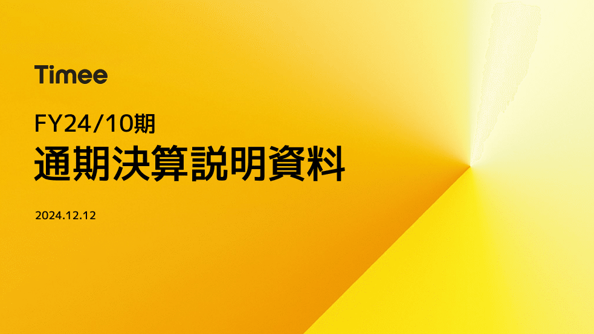
*株式会社タイミーのプレゼンテーション資料*

> 引用元：[> 2024年10月期 通期決算説明資料（Appendixあり）](https://contents.xj-storage.jp/xcontents/AS05113/8d897c2b/a739/4b80/a2ed/699df8bd144b/20241212122144749s.pdf)

*https://corp.timee.co.jp/ir/presentations/*

- メインの黄色：カラーコード#fed700、rgb（254,215,0）

- 濃い黄色：カラーコード#ffbc01、rgb（255,188,1）

- 薄い黄色：カラーコード#fff3a3、rgb（255,243,163）

### パワポの背景に黄色を使うデザイン

タイミー社のパワポの特徴として、**スライドの背景に黄色を使う**デザインが挙げられます。比較的濃い目の黄色ですが、黒色の文字とは相性がいいので、見やすいパワポに仕上がっています。
文字だけでなく、**黒色の箱に白抜き文字の組み合わせも黄色と組み合わせやすい**ので、スライドの背景に黄色を使うときは覚えておきましょう。

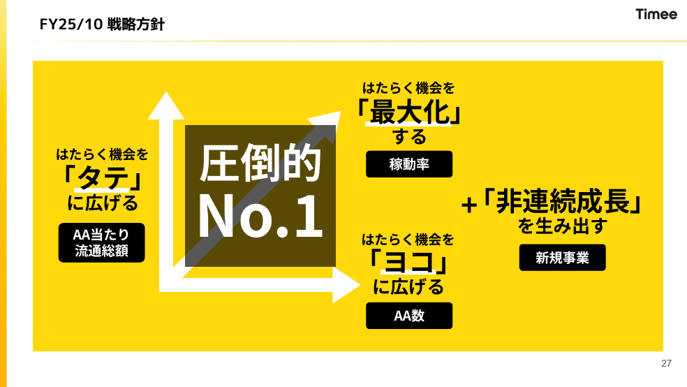

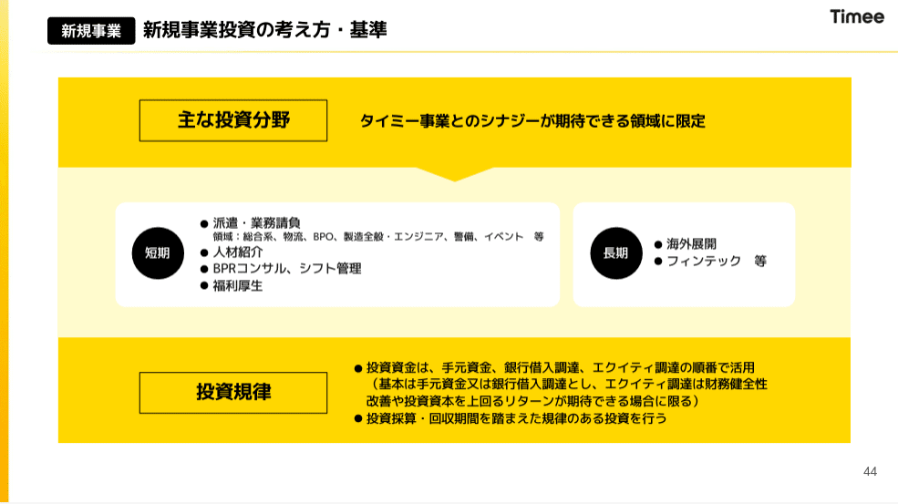

### 黄色のマーカーを使うパワポデザイン

パワポに限らず、黄色はマーカーとしてよく使われます。プレゼンテーションのスライドにおいても、下線を引いて強調することはよくありますが、**黄色のマーカーはパワーポイントでの強調**に向いています。

タイミー社のパワーポイントでは、**白色の背景と黒色の太字に黄色のマーカーを組み合わせたスライド**がよく登場します。黒色の太字自体が割とインパクトがありますが、それを少し中和するような役割を持っていますね。

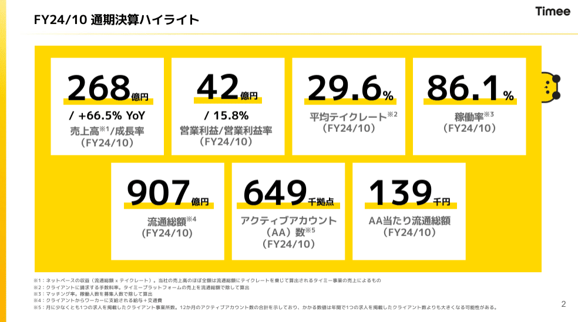
黄色の背景に、白色の箱、黒色の太字、黄色のマーカーとフルセットになっているパワポです。右上から覗いているキャラクターもチャーミング。

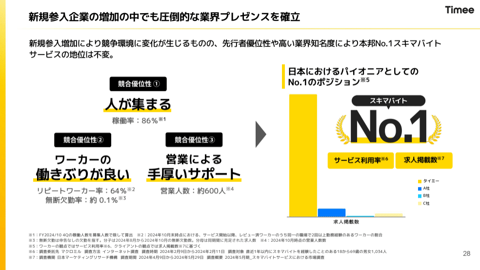
左側の３つのポイントと、右のNo1、両方に黄色のマーカーが引かれています。協調ポイントが多いですがそこまでうるさくないですね。

### 黄色でハイライトするパワポデザイン

またタイミー社のスライドでは、黄色を使ってグラフや表の強調したい部分をハイライトするような使い方も見られます。黄色はインパクトのある色なので、**グラフや表にピンポイントで使うことで、見やすいデザイン**にすることができるわけですね。

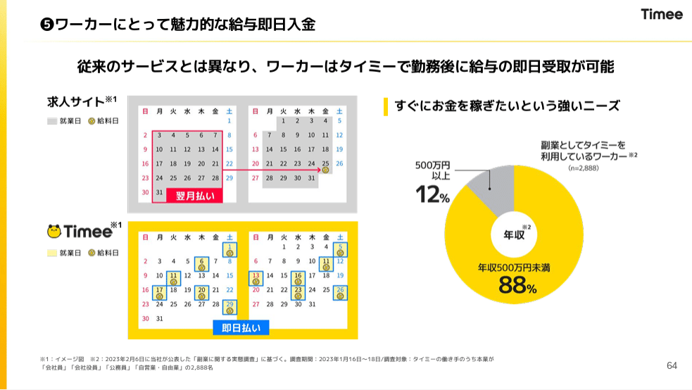
[【マネしたい】見やすいパワポの「円グラフ」スライド９選](https://note.com/powerpoint_jp/n/n6bafe5e67864)でも紹介したスライドですが、非常に効果的に黄色を使ったデザインです。**左のタイミー社のカレンダーの背景に黄色を使う一方、同じ色を右側の円グラフで使うことで、関連性を見せています**。

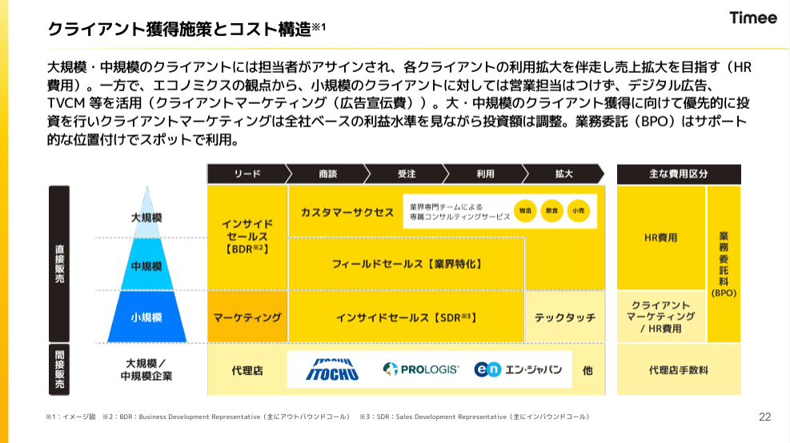
バリューチェーンにおける自社のカバー範囲を黄色でハイライトしています。ここではピンポイントでの強調というより、バリューチェーンを広くおさえていることをみせるために面で強調するということをしています。

### 黄色のグラデーションで見せる表デザイン

最後にタイミー社の表スライドも見てみましょう。表においてはタイトルやカテゴリーを濃い黄色、数値や詳細を薄い黄色というデザインにしています。各スライドの左側の黄色グラデーションと相まって、全体に統一感のあるデザインとなっています。

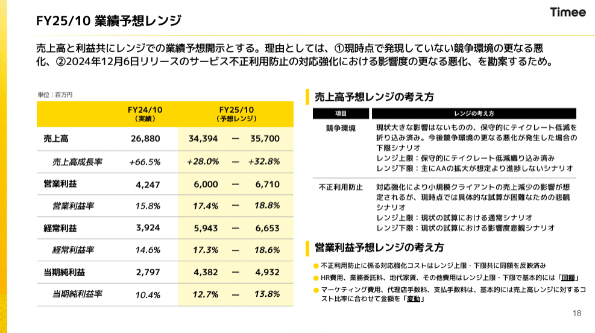

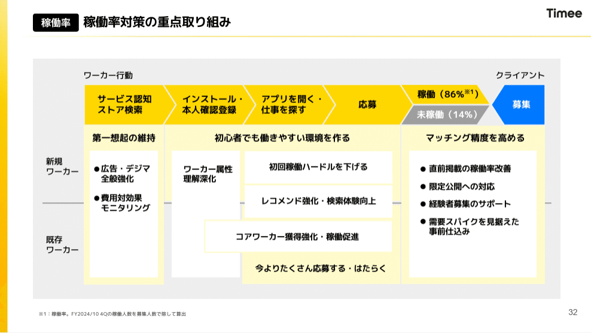

## 黄色と灰色のデザインのスライド見本

次は株式会社ジグザグのパワーポイントを見ていきましょう。パワポ全体を通して、黄色を背景にしているのは表紙やミッションだけで、各スライドでは黄色は強調に使われています。
**黄色は灰色と非常に相性が良いですが、**ジグザグ社のスライドは特に黄色と灰色の組み合わせで見やすいパワポとなっています。**箱の背景色を黄色にしたり、黄色のマーカーを引いたりすることで**、強調の効果を出しています。

*株式会社ジグザグのプレゼンテーション資料*

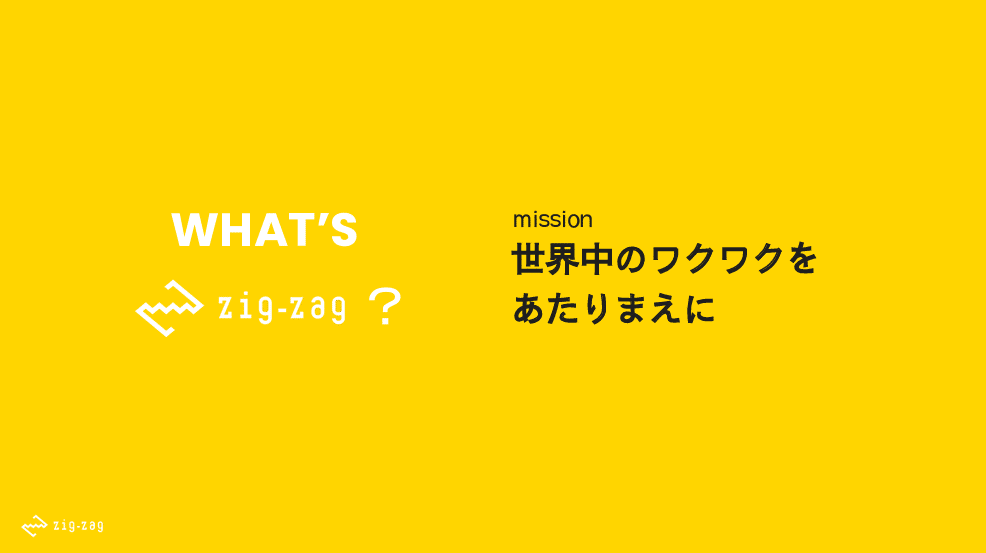
*黄色を背景に使うパワポのデザイン*

> 引用元：[> 2025年5月期 通期決算説明資料（訂正版）](https://ssl4.eir-parts.net/doc/340A/ir_material_for_fiscal_ym/182956/00.pdf)

*https://ir.zig-zag.co.jp/library/presentation/*

- メインの黄色：カラーコード#fdd603、rgb（253,214,3）

- 薄めの黄色：カラーコード#fdea7e、rgb（253,234,126）

- 薄い黄色：カラーコード#fff7cc、rgb（255,247,204）

### 濃い黄色と灰色の背景のデザイン

ジグザグ社のパワポは黄色と灰色の組み合わせが素晴らしいのですが、その中にも濃い黄色を使っているパターンと薄い黄色を使っているパターンがあります。まずは濃い黄色を使ったスライドを見ていきましょう。
このスライドでは、灰色の背景に濃い黄色のラベルや箱で強調するデザインにしています。

このパワポは、灰色の背景の部分と薄い黄色の背景の部分が分かれているデザインですが、**左の丸の濃い黄色と右のラベルの濃い黄色の色をそろえる**ことで、つながりがわかりやすくなっています。

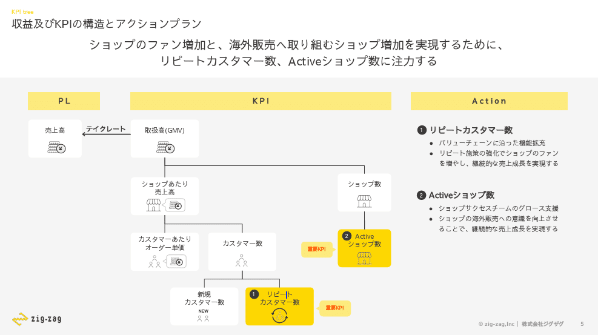
このパワポは白色の背景の箱でKPIの構造を示していますが、その中で営業KPIとなっている部分を濃い黄色の背景の箱にすることで強調するデザインとなっています。

### 薄い黄色と灰色の背景のデザイン

続いて薄い黄色と灰色の背景の組み合わせのパワポを見ていきましょう。
黄色を多用する場合、灰色の背景と直接組み合わせるとやや見づらくなってしまうので、白色の背景を組み合わせるのが効果的ですね。

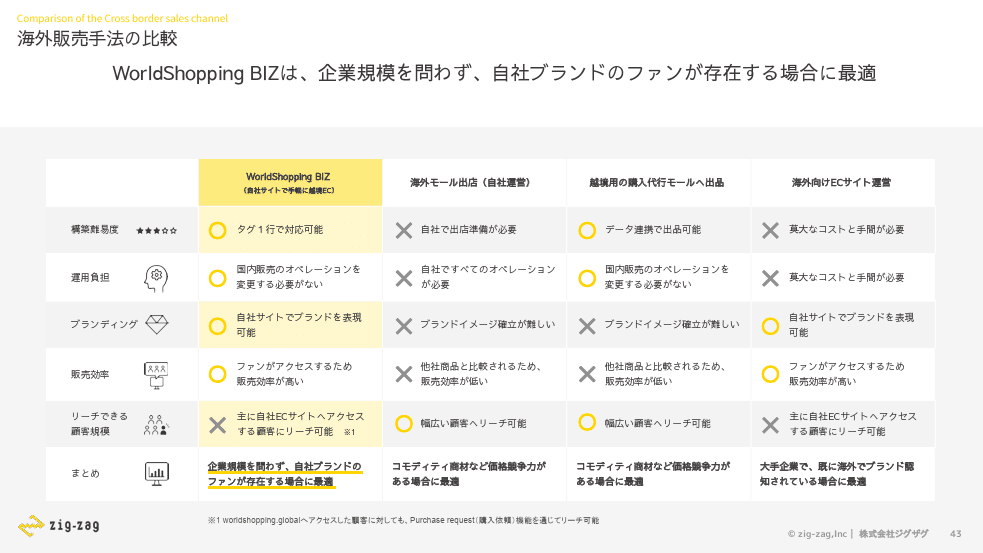

### 黄色のマーカーは白色の背景が合う

タイミー社のスライドで、パワポに黄色のマーカーを使うのが効果的であるという話をしましたが、**黄色のマーカーと灰色の背景の組み合わせのパワポはやや見づらいです**。
黄色のマーカーをパワポに使う際は背景は白色にした方が効果的ですね。

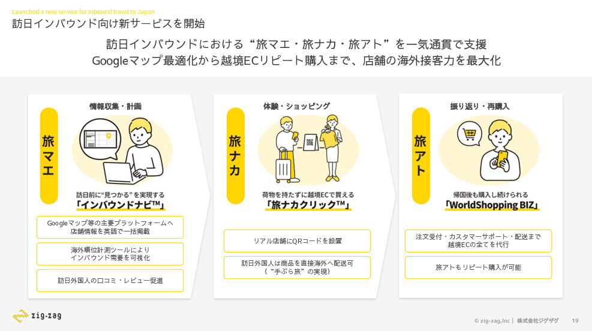

## 黄色のグラデーションが美しいスライド見本

最後は株式会社Liberawareのパワーポイントを見ていきましょう。Liberaware社はオレンジに近い赤みがかかった黄色を使うデザインで、黄色のグラデーションで見せるパワポが上手いです。

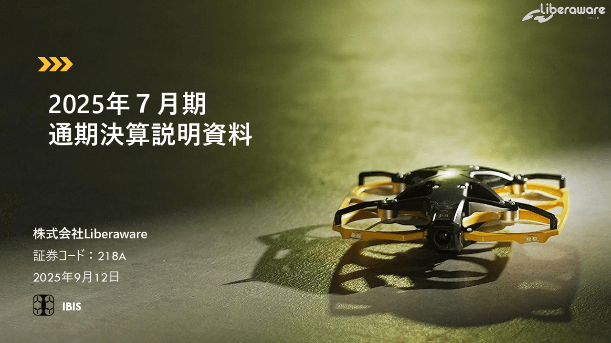
*株式会社Liberawareのプレゼンテーション資料*

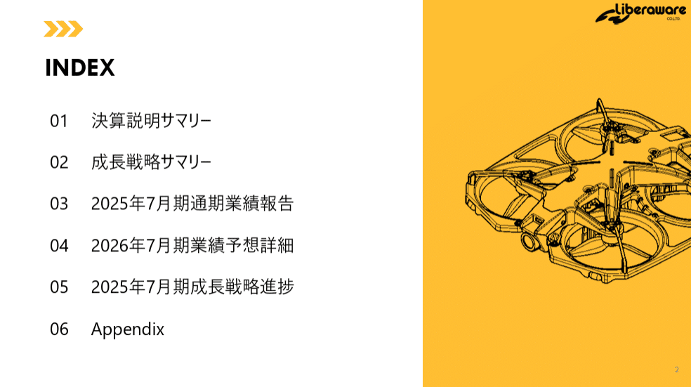
> 引用元：[> 2025年7月期 通期決算説明資料](https://ssl4.eir-parts.net/doc/218A/tdnet/2687217/00.pdf)

*https://liberaware.co.jp/ir/library/presentation/*

- メインの黄色：カラーコード#ffbe33、rgb（255,190,51）

- 薄めの黄色：カラーコード#ffd985、rgb（255,217,133）

- 薄い黄色：カラーコード#ffefd6、rgb（255,239,214）

### 黄色のグラデーションのデザイン

まずはシンプルに黄色のグラデーションでデザインされたパワポから見ていきましょう。**既存の領域をメインカラーである濃い目の黄色にし、そこからより遠い将来に行くにつれて黄色が薄く**なっていきます。

工夫として、より将来の領域であっても、**円の枠線は濃い黄色のままにする**ことで、パワポ全体として統一感のあるみやすいデザインに仕上がっています。また矢印なども濃い黄色にすることで、あくまでメインカラーは濃い黄色であるということも伝わりやすくなっていますね。

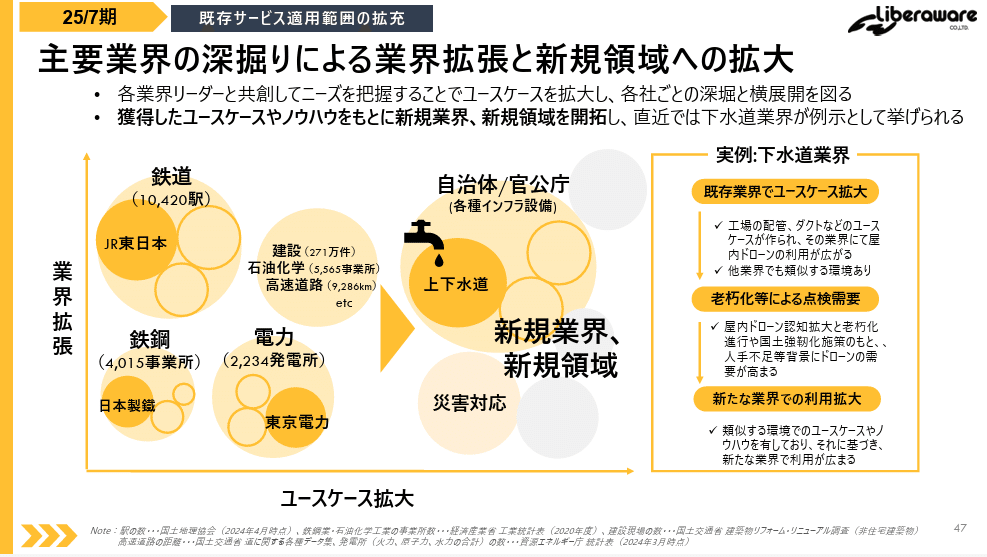

### 黄色と茶色のグラデーションのデザイン

複数の成長ドライバーを示すスライドでは、黄色を軸に、黄色から茶色までのグラデーションで見やすいデザインにしています。成**長ドライバーを描き分ける上では、黄色系統だけだとやや差分が見づらい**ので、そこを意識しての工夫ですね。

黄色は茶色以外にも、オレンジ色系や赤色系とも組み合わせやすいので、グラデーションのデザインも複数通り考えられます。

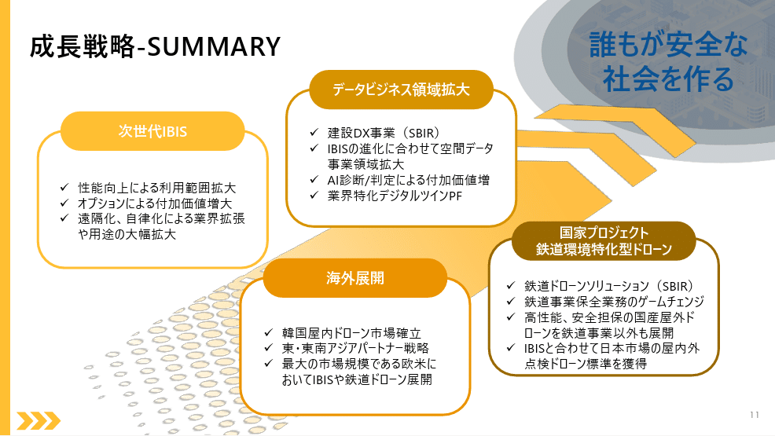

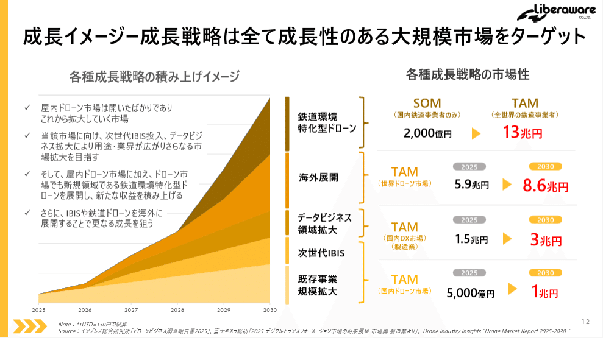

### 黄色のグラデーションと灰色のデザイン

これまで、灰色と黄色の組み合わせが見やすいという話をしてきましたが、黄色のグラデーションと灰色の組み合わせも見やすいです。

ここではラベルや矢印に灰色を使い、黄色のグラデーションと組み合わせるデザインを取っていますが、見やすいパワポに仕上がっていますね。

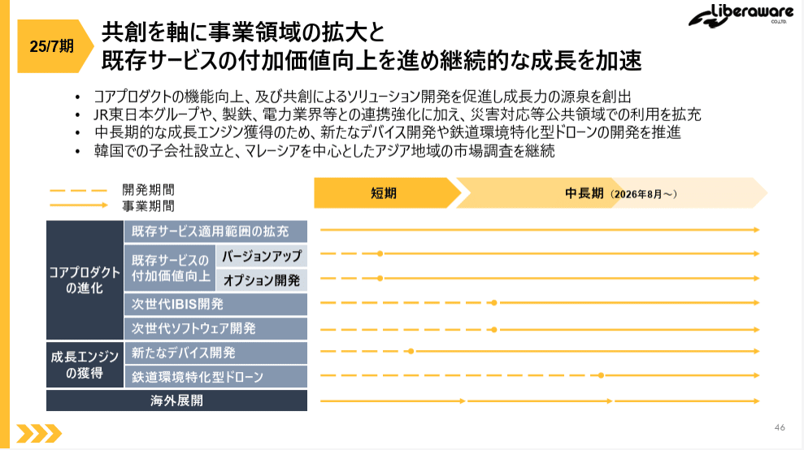

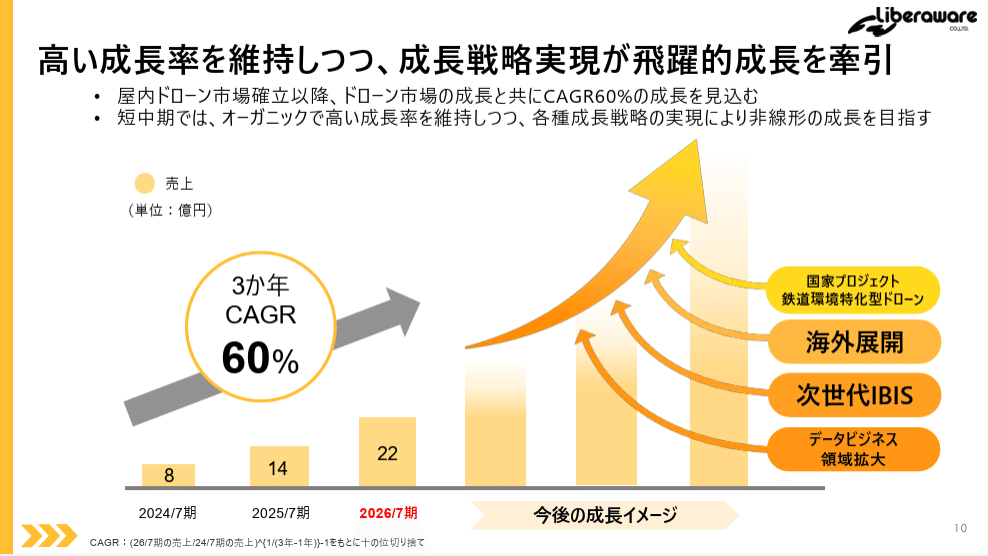

## 【マネしたい】おしゃれなパワポの「黄色」プレゼン３選まとめ

いかがでしたでしょうか。黄色の背景に黒色の太字のパワポがデザインとして見やすいこと、灰色と黄色の組み合わせがよいこと、黄色のグラデーションには様々なデザインが可能なことなど、黄色を使ったパワーポイントの可能性が伝わっていれば幸いです。

## パワポ研オリジナルテンプレート

パワポ研では、「ビジネスシーンで使える」パワーポイントテンプレートを公開しております。デザインを整えるのみならず、**ロジックやストーリーを整理するのにも役立つパッケージ**になっておりますので、関心のある方は下記ページも併せてご覧ください！

上記の記事のように、noteでは**フォローしているだけでビジネスにおける「資料作成のコツ」と「デザインのセンス」が身に付くアカウント**を目指して情報配信を行っています。
今後もコンスタントに記事を配信していく予定なので、関心のある方は是非アカウントのフォローをお願いします！

**> Template販売　**[> https://powerpointjp.stores.jp/](https://powerpointjp.stores.jp/%EF%BF%BCnote)
**> note　**[> パワポ研の資料作成術](https://note.com/powerpoint_jp/m/mc291407396da)
**> X（旧Twitter)　**[> https://twitter.com/powerpoint_jp](https://twitter.com/powerpoint_jp)

## レックスアドバイザーズからのお知らせ

パワポ研は株式会社レックスアドバイザーズが運営しています。
レックスアドバイザーズは**経営企画職や経営管理職に特化した転職エージェント**です。
上場企業や上場準備企業を中心に、**経営企画、IR、経理財務、法務、内部監査等の職種の求人**をご紹介しているほか、**CFOなどのコンフィデンシャル求人**もご紹介可能です。
またコンサルティングファームや監査法人、会計事務所の求人も豊富にあるため、プロフェッショナルファームを目指す方のご支援も得意です。
求人紹介やキャリア相談を希望の方は、[**無料転職サポート**](https://www.career-adv.jp/job_search/entryform_exp/)よりサービス利用登録をしてみてください。

*レックスアドバイザーズのサービスサイトはこちらから*

**> 求人をご希望の方　**[> 無料転職サポート](https://www.career-adv.jp/job_search/entryform_exp/)**
> 採用支援をご希望の方　**[> 採用サポート](https://www.career-adv.jp/request3/)
**> その他　**[> お問い合わせフォーム](https://www.rex-adv.co.jp/contact)
**> 書籍　**[> 注目企業の実例から学ぶパワポ作成術](https://www.amazon.co.jp/dp/4046060476)

