# 【マネしたい】おしゃれなパワポの「マーカー」スライド９選

[note原文](https://note.com/powerpoint_jp/n/n4b2540bb1e83)

みなさんこんにちは。
資料デザインのリサーチや分析に取り組むパワーポイントのスペシャリスト、パワポ研です。

今回は、**パワポの「マーカー」に焦点を当て、上場企業のIR資料からおしゃれなスライドを紹介**していきます。テキストに関しては、以前【マネしたい】おしゃれなパワポの「箇条書き」スライド９選も公開していますので、気になる方は読んでみてくださいね。

パワポ例を紹介した後には、パワーポイントのマーカー機能を含め、テキストの下半分にマーカーを引く場合や、画像の上にマーカーを引く場合、手書き風のマーカーを引く場合のパワポの機能についても説明します。では早速行きましょう！

## マーカーが下線のパワポ例３選

まずはパワポのマーカーの利用例として、テキストの下半分にマーカーを使い、下線のようなスタイルで強調しているスライドから見ていきましょう。

### 蛍光色のマーカーで強調するパワポ例

続いて株式会社TWOSTONE&Sonsのパワポのマーカー例を見ていきましょう。
2025年８月期 通期決算説明資料（事業計画及び成長可能性に関する事項）のパワーポイント資料にある、通期業績概要のスライドです。

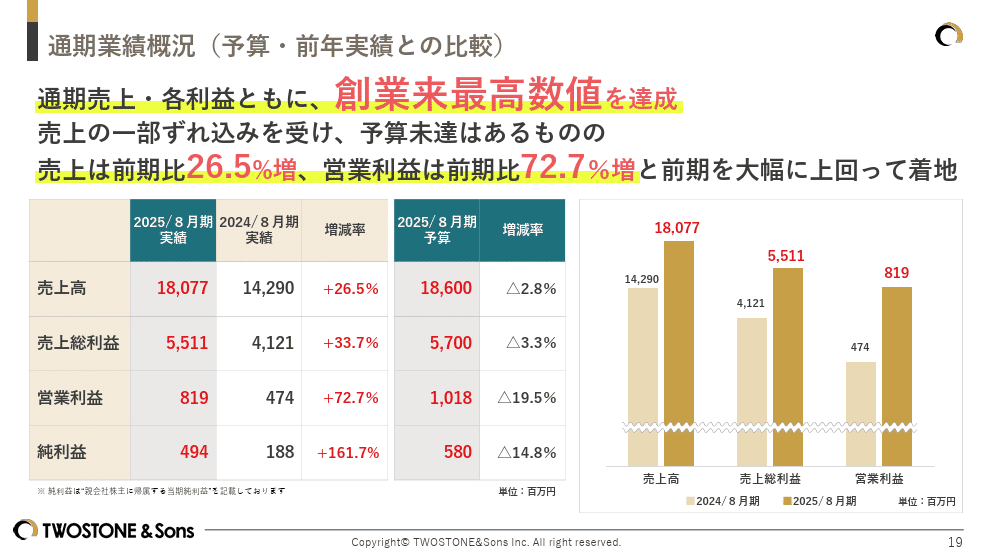
> 引用元：[> 2025年８月期 通期決算説明資料（事業計画及び成長可能性に関する事項）](https://contents.xj-storage.jp/xcontents/AS08579/c3e03c77/9cb5/4565/8125/c60c69454e2a/140120251015573956.pdf)

*https://twostone-s.com/ir/presentations/*

パワポのマーカーの特徴として、テキストの下半分に蛍光色のマーカーを使っています。赤い大文字での強調も同時に行っており、見せたいテキストはダブルで強調しています。

テキストを強調したい場合、**特にこだわりがなければ、蛍光色の黄色のマーカーで下線を引く**ことで、伝わりやすいパワポになります。黄色の蛍光マーカーはノートで下線を引く際にも一般的によく使われるので、「マーカーが引いてあるということは重要なのね」と認識してもらいやすいからです。

### マーカーとボディの色を合わせたパワポ例

次は株式会社スカラのパワポのマーカー例です。
2025年6月期 通期決算説明会のパワーポイント資料にあるセグメント別通期予想比グラフのスライドです。

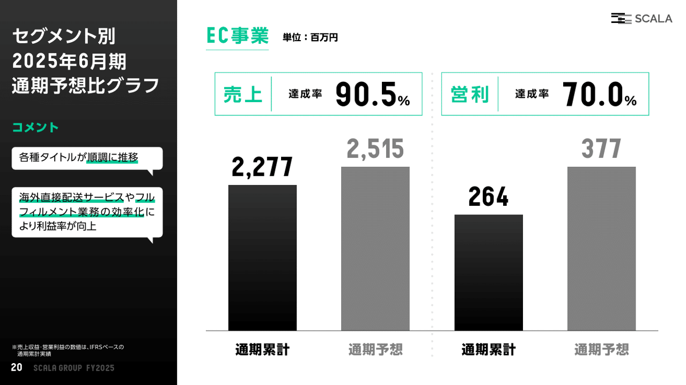
> 引用元：[> 2025年6月期 通期決算説明会](https://scalagrp.jp/20250819-irnews/)

*https://scalagrp.jp/ir/documents/*

パワポのマーカーの特徴として、**テキスト下半分のマーカーにスライド本体のタイトルと同じ色**が使われています。それによって、パワーポイント内で使われる色の数が減り、スタイリッシュでおしゃれなデザインに見えるわけですね。

なおスカラ社のように、独特でおしゃれな色の組み合わせのパワーポイント例については、【マネしたい】色の組み合わせがおしゃれなパワポのプレゼン９選で取り上げているので、気になる方はこちらも見てみてください。

### 画像にマーカーを引くパワポ例

次は株式会社チームスピリットのパワポのマーカー例です。
2025年8月期 通期 決算説明資料及び中期経営計画アップデートと2026年8月期業績予想について（事業計画及び成長可能性に関する事項のアップデート）にある市場トレンドのスライドを見てみましょう。

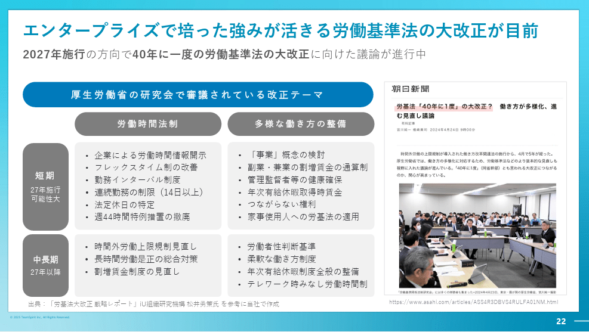
> 引用元：[> 2025年8月期 通期 決算説明資料及び中期経営計画アップデートと2026年8月期業績予想について（事業計画及び成長可能性に関する事項のアップデート）](https://contents.xj-storage.jp/xcontents/AS08579/c3e03c77/9cb5/4565/8125/c60c69454e2a/140120251015573956.pdf)

*https://corp.teamspirit.com/ir/ir-library/presentation/*

パワポのマーカーの特徴として、**パワーポイントに貼られた画像の上にマーカー**が使われています。

画像のテキストにマーカーで下線を引くのは無理なので、この場合は**パワーポイントの図形の機能で細長い長方形を作り、それをマーカー代わり**にします。マーカーに使う長方形の透明度によって強調度合と元の文字の見やすさが変わるので、このあたりの調整が肝ですね。

## マーカーの下線の色がおしゃれなパワポ４選

ここからはパワポの下線マーカーの色に工夫がされているIR資料を見ていきましょう。基本的にはマーカー下線の色をコーポレートカラーにしているパワポが多いです。

### ベース色をマーカー下線に使うパワポ例

最初は株式会社タイミーのパワポのマーカー例を見ていきましょう。
事業計画及び成長可能性に関する事項のパワーポイント資料の強みに関するスライドです。

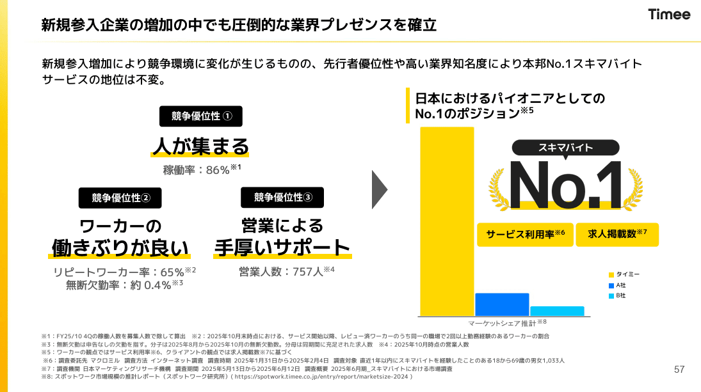
> 引用元：[> 事業計画及び成長可能性に関する事項](https://contents.xj-storage.jp/xcontents/AS05113/edac4ae8/c8d8/4d42/ae51/e2d031c7c2ff/140120251211518011.pdf)

*https://corp.timee.co.jp/ir/*

パワポのマーカーの特徴として、**マーカーの色がコーポレートカラーである黄色**になっています。タイミー社のようにコーポレートロゴやカラーが単色である場合、有効なデザインです。

これまでの事例同様、パワーポイント全体で色が統一されており、かつマーカーも含めて使われている色が少ない方がおしゃれに見えるので、タイミー社はその典型といえますね。

### 文字とマーカーでロゴ色となるパワポ例

続いて株式会社TENTIALのパワポのマーカー例を見ていきましょう。
2025年8月期 通期決算説明資料（事業計画及び成長可能性に関する資料）のパワーポイント資料にある市場規模のスライドです。

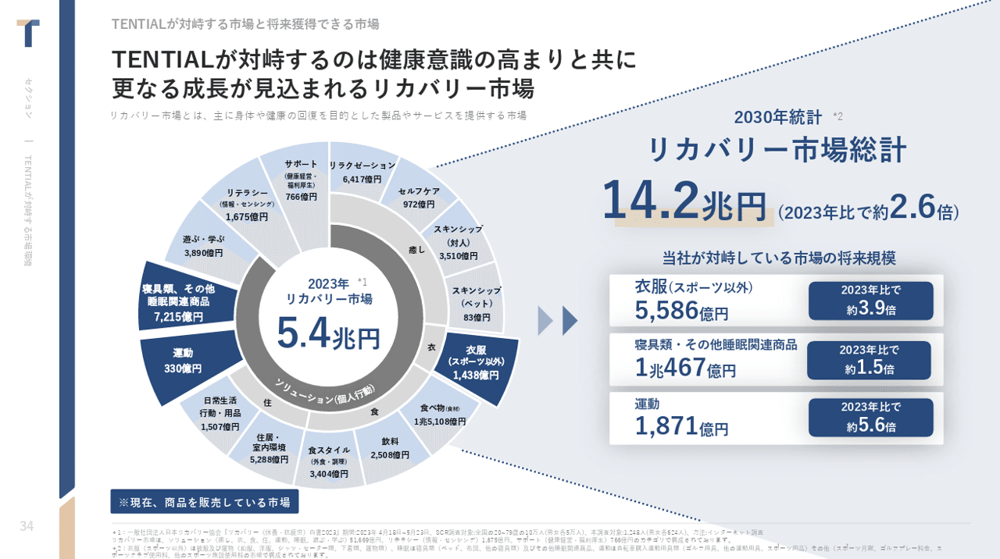
> 引用元：[> 2025年8月期 通期決算説明資料（事業計画及び成長可能性に関する資料）](https://xn--20258%20()-783i9gwdxpi680b7sra9rar82mo0gnjk4ktka39xl1ipqad840nx9t861dj4zbm88aoq1dqoewtvpa8271a567b2lb/)

*https://corp.tential.jp/ir/library/presentations/*

パワポのマーカーの特徴として、**文字色がロゴのメインカラーである紺色、下線のマーカー色がロゴのサブカラーである金色**となっています。通常の文字色も黒色と紺色ですが、特に強く強調したい場合に紺色の文字と金色マーカーの組み合わせになるようです。

青色ベースで構成されているところに金色のマーカーの下線が入ることでスライド全体が引き締まっており、おしゃれなパワポに仕上がっています。

### 文字とマーカーの構造がロゴ風のパワポ例

続いてSansan株式会社のパワポのマーカー例を見ていきましょう。
通期決算説明資料のパワーポイント資料にある、主要指標の状況のスライドです。グラフ上の数値に下線のマーカーが引かれています。

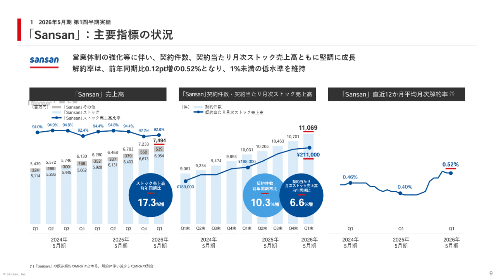
> 引用元：[> 決算説明資料](https://data.swcms.net/file/corp-sansan-ir/dam/jcr:6b9509c2-7708-4fef-bacf-9ebb56def1d7/140120250714513500.pdf)

*https://ir.corp-sansan.com/ja/ir/library/presentation.html*

パワポのマーカーの特徴として、**Sansan社のロゴと全く同じような赤い下線がマーカーとして引かれて**います。文字色が青色になれば、数値と赤い下線のマーカーでロゴのような見た目になります。

この事例はロゴの下に赤い下線のマーカーがあるSansan社だからこそできるデザインではありますが、**マーカーに限らずこうした遊び心を入れるとおしゃれなパワポ**に仕上がりますね。

### マーカーを引くことで仕切るパワポ例

まずは株式会社GA technologiesのパワポのマーカー例を見ていきましょう。
コーポレートストーリー（新規投資家向け会社説明資料）のパワーポイント資料にあるカンパニーハイライトのスライドです。

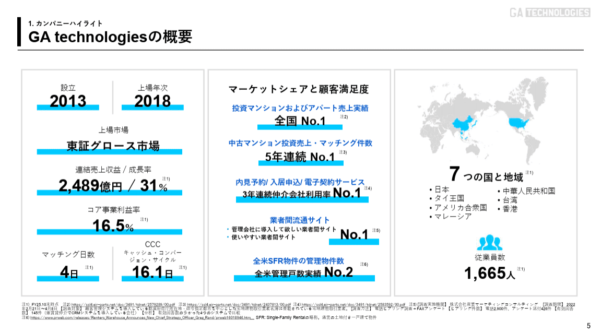
> 引用元：[> コーポレートストーリー（新規投資家向け会社説明資料）](https://ssl4.eir-parts.net/doc/3491/ir_material_for_fiscal_ym/189981/00.pdf)

*https://www.ga-tech.co.jp/ir/news/*

パワポのマーカーの特徴として、**一部を強調するのではなく主要なテキスト全ての下半分にマーカー**を使っています。それによって、**下線のマーカーが仕切り線のような役割を果たし**、仕切り線が不要になります。スライドは仕切りがないほどおしゃれに見えるので、そうした効果が期待できますね。

**マーカーの色はコーポレートカラーと同じ水色**ですが、Webサイトを見ると、ロゴのTechnologiesの部分の背景が水色になっていたり、タブのGAの下の部分に水色の下線が入っていたり、コーポレートブランディング上の見せ方が一貫している点もおしゃれですね。

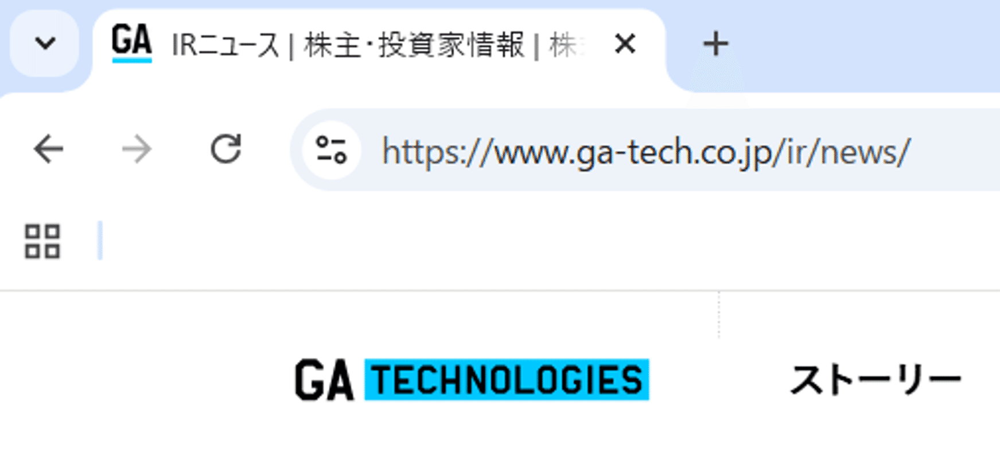
*GA technologiesのWebサイト*

## マーカーが背景色になっているパワポ２選

最後はマーカーが下線や下半分ではなく、テキスト全体の背景になっているスライドを紹介します。おしゃれさよりもインパクト重視の場合に使われるデザインです。

### マーカー背景色と文字色が同じパワポ例

まずは株式会社クラウドワークスのパワポのマーカー例を見てみましょう。
2025年9月期 決算説明資料のパワーポイント資料にある、業績拡大サイクルのグラフのスライドです。

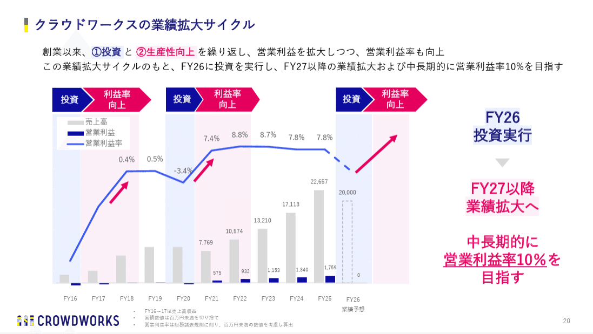
> 引用元：[> 2025年９月期通期 決算説明資料](https://contents.xj-storage.jp/xcontents/AS80447/3d3c95f4/389d/4f7c/8ed9/dfe4b4a7c1e9/20251114133622897s.pdf)

*https://crowdworks.co.jp/ir/results*

パワポのマーカーの特徴として、**文字色を青色やピンク色にしたうえで、その背景に薄い青色やピンク色のマーカーを入れて**います。上部のメッセージと右側のボディサマリーの両方でマーカーを使っています。

このパワポでは、ただ文字色とマーカーの色をそろえるだけでなく、**スライドのメッセージとボディで同じ仕組みを入れることにより、メッセージとボディを連動させている**点もポイントです。

### 文字とマーカーでロゴ色となるパワポ例

最後は株式会社Macbee Planetのパワポのマーカー例です。
2025年４月期 通期 決算説明資料のパワーポイント資料を見てみましょう。

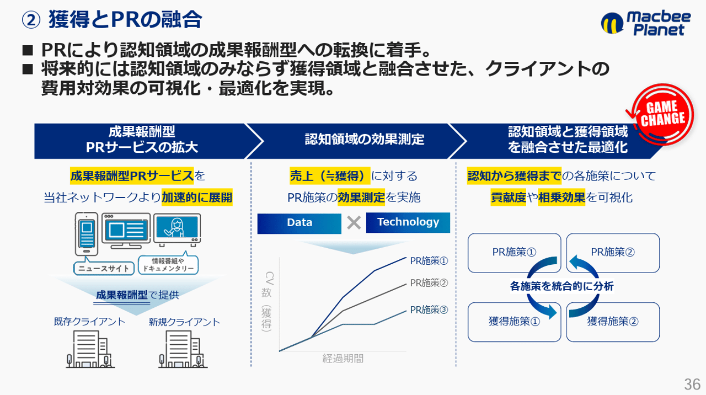
> 引用元：[> 2025年４月期 通期 決算説明資料](https://macbee-planet.com/ir/upload_file/tdnrelease/7095_20250612588262_P01_.pdf)

*https://macbee-planet.com/ir/library/briefing_materials.html*

パワポのマーカーの特徴として、文字色が青色、背景のマーカー色が黄色で、ロゴと同じ色調となっています。TENTIAL社でみた事例と同じパターンですね。

Macbee Planet社のように、ロゴに黄色が入っていると、その黄色をマーカーに使って強調しやすいので、おススメのデザインです。

## パワポのマーカーを引く方法

最後にパワーポイントのマーカーを引く方法について簡単に説明します。
シーンごとに最適な方法が変わるので、シーン別にマーカーを引く方法を紹介します。

### 下線や下半分にまっすぐマーカーを引く

パワポの下線や下半分にまっすぐマーカーを引く場合、大きくは二つの方法があります。**一つはパワーポイントの図形の機能でマーカーを作る方法、もう一つはテキストボックスを塗りつぶす方法**です。

パワーポイントの図形の機能を使う場合は、図形の機能から線を選んで太さを太くする、あるいは四角形を選んで細長くすることでマーカーを作り、テキストに合わせます。**パワポの線を太くするパターンですべて応用可能ですが、四角形の方が水平にまっすぐマーカーを引きやすいという特徴があります。**

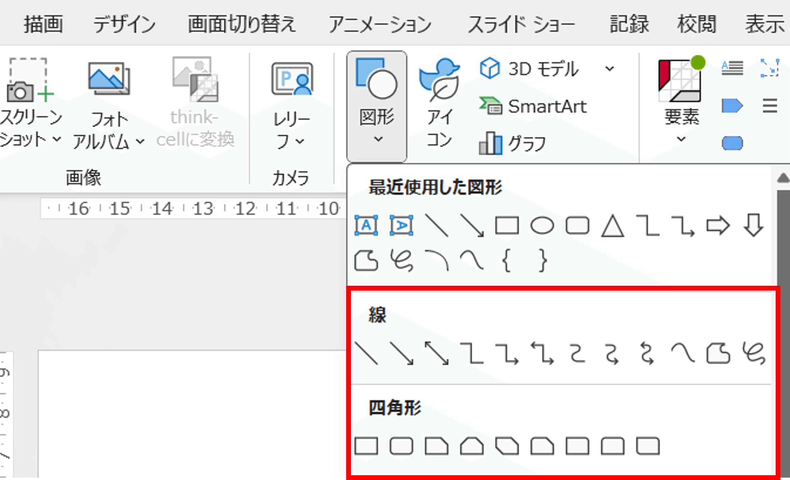
*図形の機能から線や四角形を選ぶ*

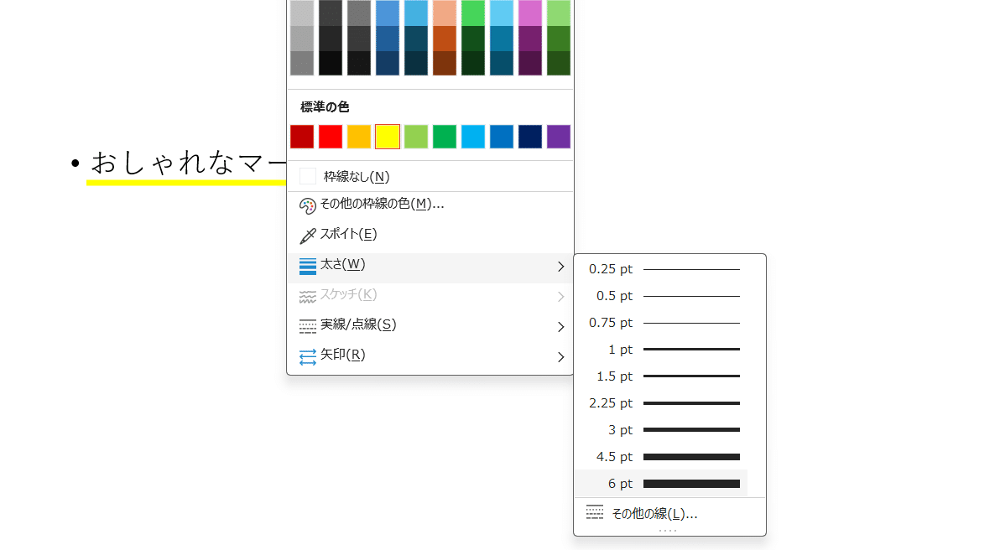

*図形の直線を使う場合①線の太さ調整の機能でマーカーの太さを調整する*

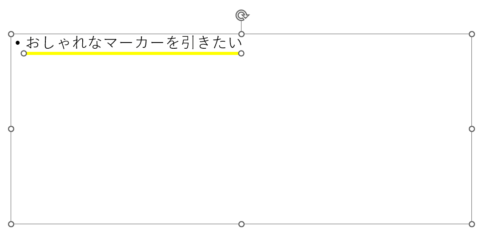

*図形の直線を使う場合②マーカーの線をテキストの下に合わせる*

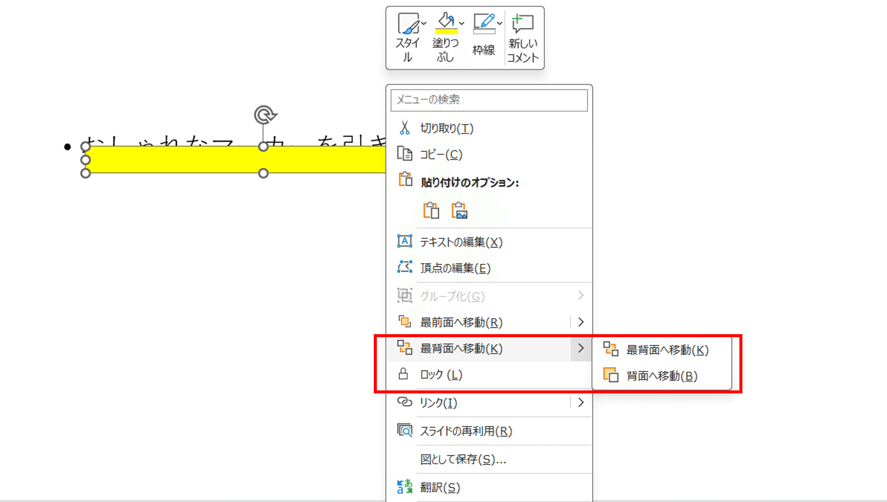

*図形の四角形を使う場合①四角形を作ったうえでテキストボックス（背景無し）の背面に移動させる*

*図形の四角形を使う場合②マーカーの四角形がテキストの背面に行き下半分を覆う*

テキストボックスを塗りつぶす方法は、テキストボックスを文字よりも小さくしておいて、テキストボックスを塗りつぶしてしまいます。ただ**この方法はマーカーが必要なごとにテキストボックスを用意する必要がある**ので、使い勝手はあまりよくありません。

*文字よりも小さいテキストボックスを用意する*

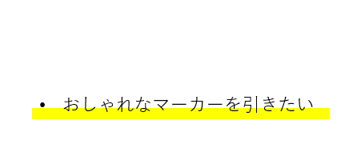
*枠を消して塗りつぶすことでマーカーが完成*

### 背景全体にマーカーの色を付ける

続いて背景全体にマーカーの色を付ける場合です。背景全体に色を付けたい場合はフォントの蛍光ペンの機能を使いましょう。

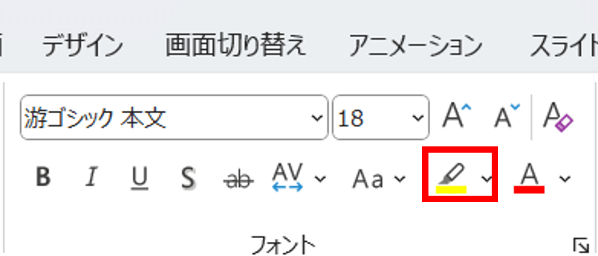
*パワーポイントのフォント機能にある蛍光ペンの機能*

*蛍光ペンの機能を使ったマーカーの例*

蛍光ペンの機能はすごく使いやすい一方、マーカーをテキストの下半分にするといったことができないので、用途としては限定的ですね。

### パワポの画像の上にマーカーを引く

チームスピリット社の例で紹介しましたが、パワポの画像の上にマーカーを引く場合は、パワーポイントの図形の機能を使います。**四角形を選んでマーカーの色で塗りつぶしたうえで透明度を上げ、画像にかぶせましょう**。

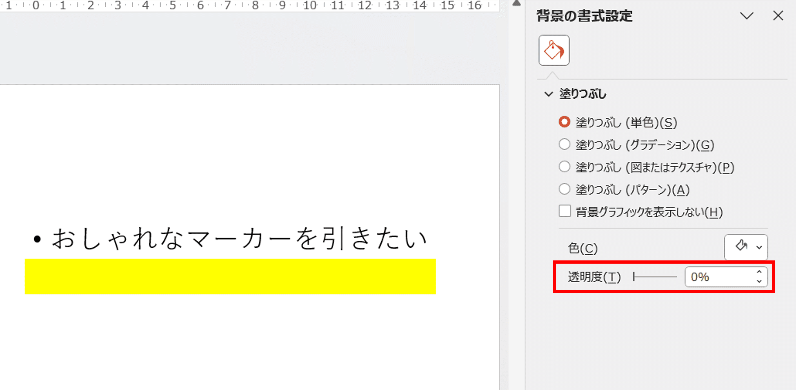
*画像にかぶせるマーカーの透明度を変更する*

*パワポの画像の上にマーカーを合わせる例*

透明度を上げた四角形をマーカーとして使う場合は、かぶせた下のテキストは見づらくなるので、画像に合わせるような特殊なケース以外は避けた方が無難です。

### パワポに手書き風のマーカーを引く

最後に手書き風のマーカーを引く場合について見ていきましょう。手書き風のマーカーを引く場合には、パワーポイントの描画タブにある描画ツールの蛍光ペンの機能を使うのがよいです。

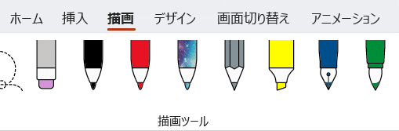
*描画タブの描画ツール*

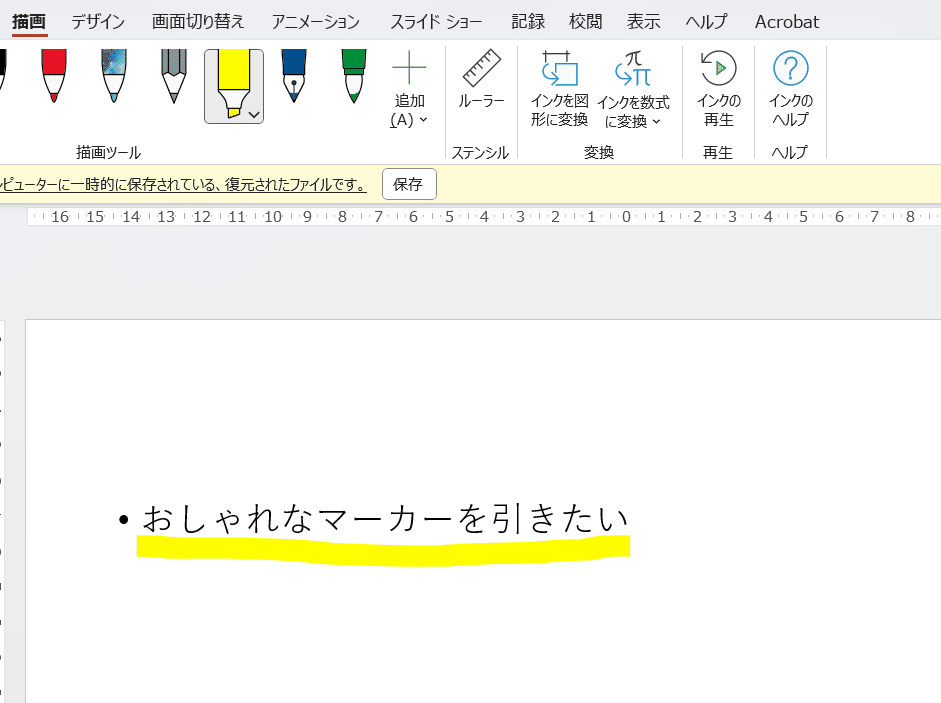
*描画ツールでマーカーを引く*

IR資料などの公式資料ではあまり手書き風のマーカーは見かけないですが、一応パターンとして持っておいて損はないです。なお**描画ツールはフリーハンドになるため、パワポにまっすぐなマーカーを引くことは難しい**点も覚えておきましょう。

## 【マネしたい】おしゃれなパワポの「マーカー」スライド９選まとめ

今回はパワーポイントのマーカーに絞って、色々なマーカーの使い方について見てきました。**マーカーは使うシチュエーションによって合う使い方がはっきりしている**ので、慣れてしまえば自由に使えるようになりますよ。
今回のNoteを読んでマーカーの使い方の理解が深まっていれば幸いです。

## パワポ研オリジナルテンプレート

パワポ研では、「ビジネスシーンで使える」パワーポイントテンプレートを公開しております。デザインを整えるのみならず、**ロジックやストーリーを整理するのにも役立つパッケージ**になっておりますので、関心のある方は下記ページも併せてご覧ください！

[
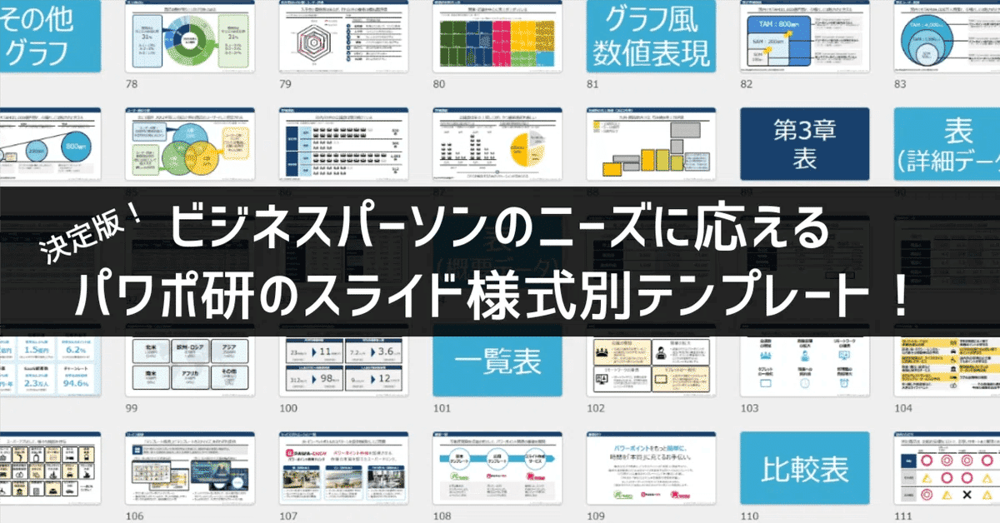
](https://note.com/powerpoint_jp/n/n7300a1293e8e)上記の記事のように、noteでは**フォローしているだけでビジネスにおける「資料作成のコツ」と「デザインのセンス」が身に付くアカウント**を目指して情報配信を行っています。
今後もコンスタントに記事を配信していく予定なので、関心のある方は是非アカウントのフォローをお願いします！

**> Template販売　**[> https://powerpointjp.stores.jp/](https://powerpointjp.stores.jp/%EF%BF%BCnote)
**> note　**[> パワポ研の資料作成術](https://note.com/powerpoint_jp/m/mc291407396da)
**> X（旧Twitter)　**[> https://twitter.com/powerpoint_jp](https://twitter.com/powerpoint_jp)

## レックスアドバイザーズからのお知らせ

パワポ研は株式会社レックスアドバイザーズが運営しています。
レックスアドバイザーズは**経営企画職や経営管理職に特化した転職エージェント**です。
上場企業や上場準備企業を中心に、**経営企画、IR、経理財務、法務、内部監査等の職種の求人**をご紹介しているほか、**CFOなどのコンフィデンシャル求人**もご紹介可能です。
またコンサルティングファームや監査法人、会計事務所の求人も豊富にあるため、プロフェッショナルファームを目指す方のご支援も得意です。
求人紹介やキャリア相談を希望の方は、[**無料転職サポート**](https://www.career-adv.jp/job_search/entryform_exp/)よりサービス利用登録をしてみてください。

*レックスアドバイザーズのサービスサイトはこちら*

**> 求人をご希望の方　**[> 無料転職サポート](https://www.career-adv.jp/job_search/entryform_exp/)**
> 採用支援をご希望の方　**[> 採用サポート](https://www.career-adv.jp/request3/)
**> その他　**[> お問い合わせフォーム](https://www.rex-adv.co.jp/contact)
**> 書籍　**[> 注目企業の実例から学ぶパワポ作成術](https://www.amazon.co.jp/dp/4046060476)

