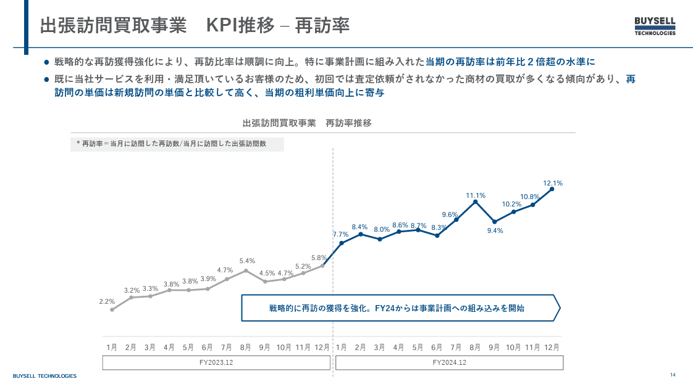
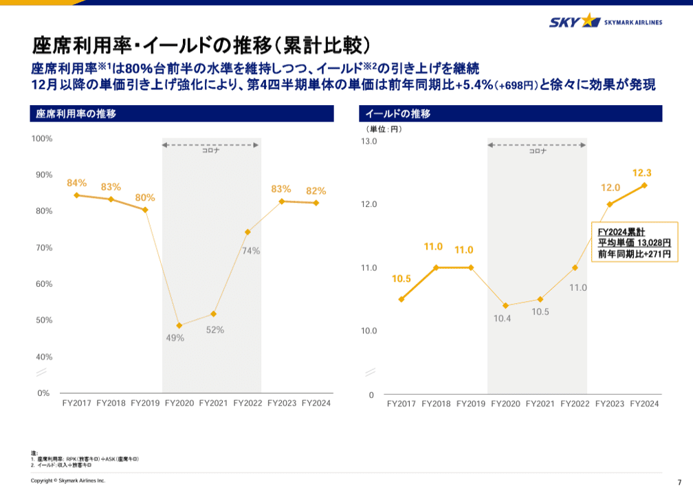
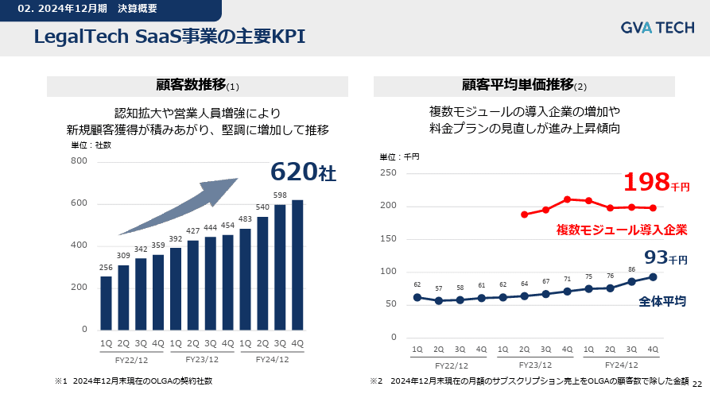
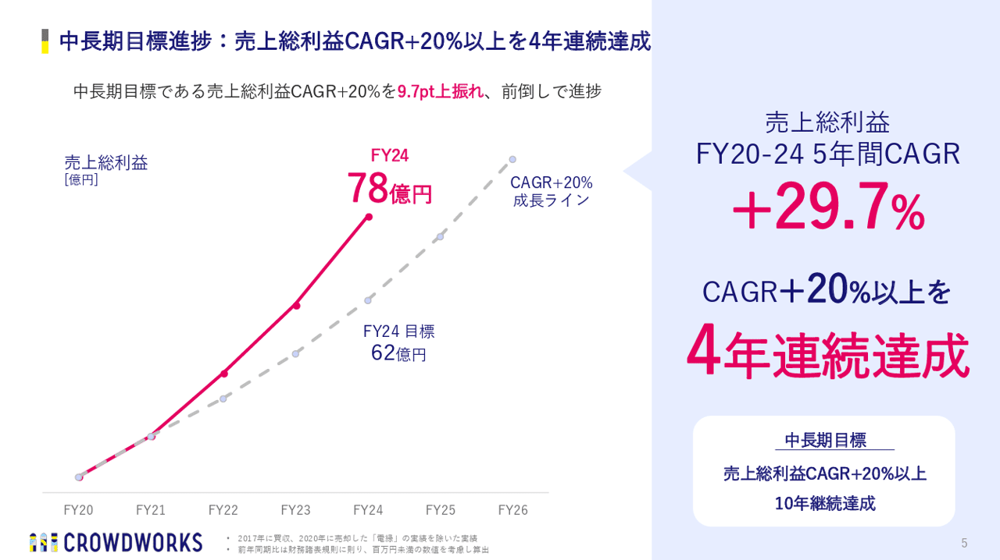
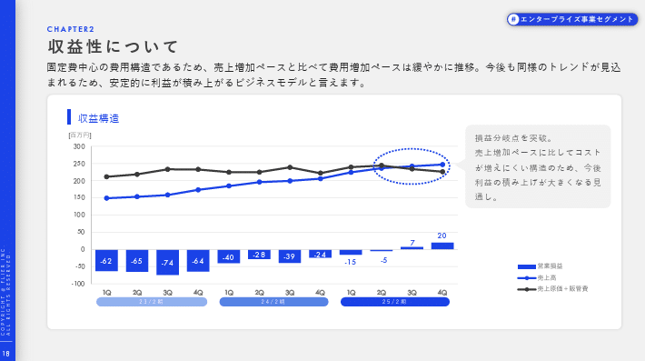
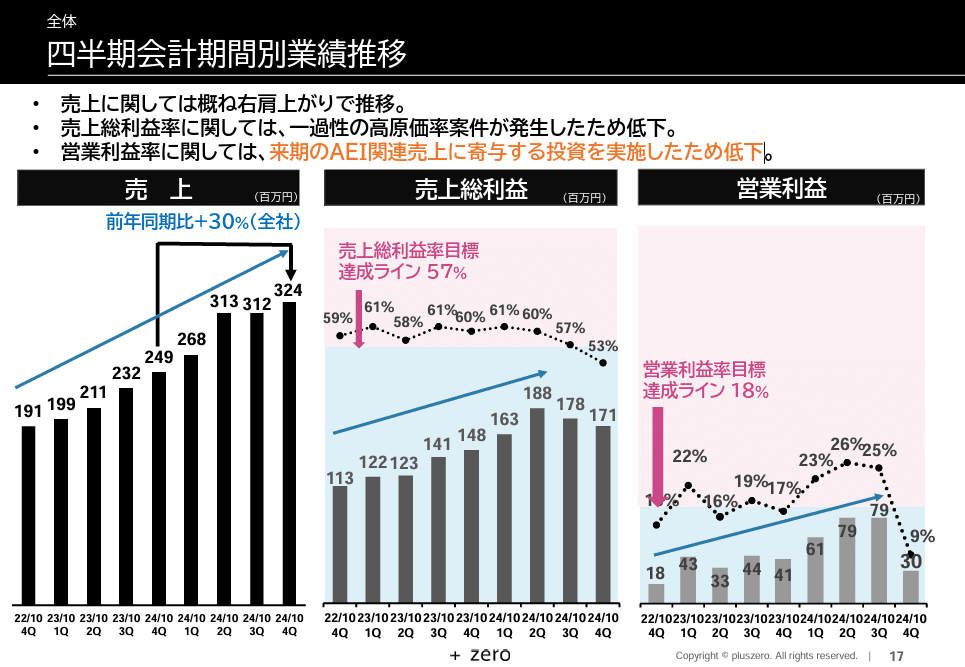
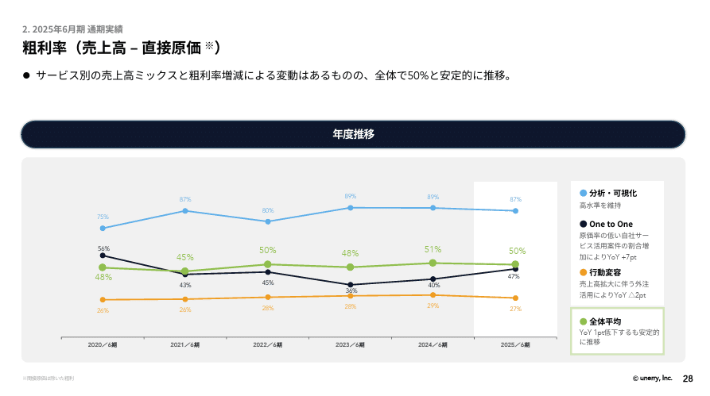
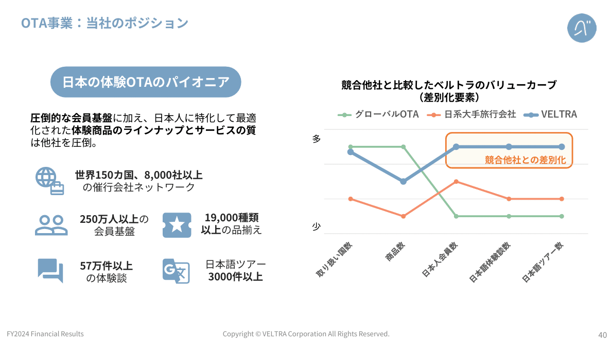
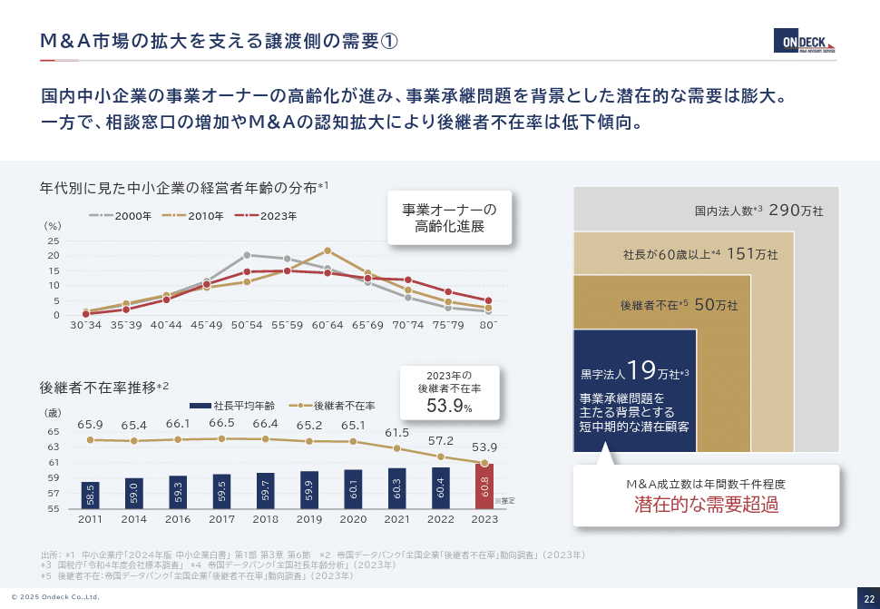

# 【マネしたい】おしゃれなパワポの「折れ線グラフ」スライド９選 （2025年更新）

[note原文](https://note.com/powerpoint_jp/n/n4d105e11f613)

みなさんこんにちは。
資料デザインのリサーチや分析に取り組むパワーポイントのスペシャリスト、パワポ研です。

今回は、パワポの**「折れ線グラフ」スライド**に焦点を当て、上場企業のIR資料から参考になるものを抜粋して紹介していきます。

テーマ別スライドのまとめ記事はこちら。

折れ線を使った複合グラフについての記事はこちら。

では早速行きましょう！

## パワポの折れ線グラフの特徴と見せ方

決算説明資料など、数値に関するプレゼン資料のデザインによく使われる折れ線グラフですが、**実は使うべきシーンや見せ方は限られています**。ではどんな見せ方がよいかというと、以下の４つのケースが挙げられます。

- 指数やパーセントの変化を見せたいとき

- 経年データを比較したいとき

- 複数パラメーターのあるデータを比較したいとき

- 左右で別の２軸を設定したいとき

４つ目の使い方については棒グラフとの複合グラフが圧倒的に多いので、気になる方は[見やすいパワポの「棒グラフ」「複合グラフ」スライド９選](https://note.com/powerpoint_jp/n/n285958fc3427)を見ていただくとして、今回のNoteでは**「指数やパーセントの変化を見せたいとき」「データを比較したいとき」**の２つについてスライド事例を紹介していきますね。

## パワポの折れ線グラフの作り方のポイント

折れ線グラフのポイントは3つです。これらをきちんと守るだけで、**おしゃれな折れ線グラフになる**こと間違いなし。

- **「線」の色は同系色でまとめつつ、協調ポイントに反対色を入れる**

- **「点」の形は大きめにし、場合によっては折れ線ごとに変える**

- **「点の説明」がノイズにならないよう位置や文字サイズに注意する**

またスライド全体のデザインでいうと、折れ線グラフを使ってメッセージを伝えるにあたり、**どのように情報を補足するか、またどのようにメッセージを強調するか**といった点がポイントになります。
補足のための折れ線を入れる、色を変える、線の種類を変える、背景に色を付けるなど様々なデザインがあるので、事例を紹介していきますね。

## 折れ線に情報を追加するスライド見本３選

### 株式会社BuySell Technologiesのスライド例

まずは折れ線グラフを使ったパワーポイントの基本事例から見ていきます。
折れ線は比率やパーセントの変化を見せるのに向いています。棒グラフでも作成できますが、折れ線の方が直感的に理解しやすいですね。
このスライドでは、2024年にKPIが上昇しているのを見せるために、2**023年を灰色に、2024年を青にすることで2024年を強調**しています。

下に図形の矢羽で解説のコメントを入れている点、数値を点の上下に出し分けているのもポイントです。数値は基本的に点の上に表示していますが、2024年9月だけは下に表示していますよね。
またこの折れ線グラフのように、すべての点に数値を表示する場合はグラフの縦軸が不要になるので、縦軸を消しておしゃれに見せています。

> 引用元：[> 2024年12月期 通期決算説明資料](https://ssl4.eir-parts.net/doc/7685/tdnet/2568273/00.pdf)

*https://buysell-technologies.com/ir/settlement/*

### スカイマーク株式会社のスライド例

次は折れ線グラフに背景色を追加して見やすいデザインにする事例です。
複数年の業績やKPI推移を示すにあたって、大型投資やコロナウィルス等の外部要因で、折れ線グラフに特異点が発生してしまうことはよくあります。

この事例では、**特異点となる期間の背景を灰色にして、グラフを見る上で気にしなくていい期間である**ということが一目でわかるようにしています。矢印を使って「コロナ」という補足もしていますね。
また棒グラフについても、**灰色の期間は「線」と「点」を薄くする**ことで、それ以外の期間に注目してもらえるようにデザインしていますね。

> 引用元：[> 2025年3月期 決算補足説明資料](https://contents.xj-storage.jp/xcontents/AS92008a/8fcee100/eb12/48ff/b7d0/9c6cbe762865/20250515151953313s.pdf)

*https://ir.skymark.co.jp/library/presentations.html*

### GVA TECH株式会社のスライド例

お次は少し変わった事例です。折れ線グラフが伸びている理由を説明するために、**折れ線グラフを一本増やす**ということをしています。
ここでは顧客平均単価が上がっている理由である、「複数モジュールの導入企業」の平均単価見せるために折れ線グラフを増やしています。赤色を使うことで今後さらに上がる期待を持たせています。

またグラフ自体も基本に忠実に、**太めの「線」に対して同系色の大きなサイズの「点」を置くことで、折れ線グラフの与える印象を強調しつつ、もう一本の折れ線グラフを反対色で目立たせるようにしています**。

> 引用元：[> 2024年12月期決算説明資料](https://contents.xj-storage.jp/xcontents/AS83525/83c2adfa/3315/4769/abc9/7cf660181759/140120250214575087.pdf)

*https://gvatech.co.jp/ir/presentation-materials*

## 折れ線に基準線を足すスライド見本３選

### 株式会社クラウドワークスのスライド例

次は基準線として、折れ線グラフをパワポ上に増やす事例です。FY23を起点として折れ線同士をつなげています。
経営目標に対して大きく上振れていることを見せるために、**経営目標を灰色の点線で示す一方、実績の線は目立つピンクで強調**しています。
特徴的なのは、**「点の説明」の中でも、今期の数値を表示して強調していること**です。FY22もFY23も目標比で上振れていますが、最も大きく上振れているFY24を強調するために、それまでの年では数値の表示を省いています。

また「点」のサイズをあえて小さくしているのもFY24を際立たせることに役立っています。読み手にとっては、瞬時にスライドでの「言いたいこと」を直感的に理解できるようになっており、おしゃれなスライドといえますね。

> 引用元：[> 2024年９月期 通期決算説明資料](https://contents.xj-storage.jp/xcontents/AS80447/4d07beaa/9ce3/4eb5/8acd/f38d4b90671c/20241105141550707s.pdf)

*https://crowdworks.co.jp/ir/results*

### 株式会社フライヤーのスライド例

次は事業コストの折れ線グラフを増やすことで、基準となる損益分岐点を示している事例です。
この事例では、**売上がコストと逆転したことをわかりやすく見せる**ために、売上とコストのグラフを折れ線で見せています。**ベンチャーの場合いつ黒字転換するかは投資家の関心事項**のため、あえてこのように見せて強調するという手段が効果的です。数値が重要なわけではないので点の数値は表示せず、縦軸を表示しています。

このスライドを見ると、コストが一定な中で売上が伸びて黒字転換したことが一目でわかるため、今後さらに売上が上がることで営業利益率が上がっていくであろうという期待を持たせることに成功しています。

> 引用元：[> 2025年2月期通期 決算説明資料](https://contents.xj-storage.jp/xcontents/AS09236/24cdcf14/f994/4987/a156/26a1dccbaddc/140120250414515013.pdf)

*https://corp.flierinc.com/ir/library/presen*

### 株式会社pluszeroのスライド例

次は基準線を置くのではなく、基準線の上下に背景色を足すことで基準線の役割を持たせています。パワポの折れ線グラフをおしゃれに見せるテクニックとして覚えておくとよいでしょう。

損益分岐点や目標の利益率に対して実績がどうかを見る上では、横線のガイドラインを入れることは有効な手段です。特に棒グラフに対してガイドラインの横線は有効ですが、**折れ線グラフや複合グラフにおいては、グラフ自体が線であることから、横線を引くと逆に見にくくなる**リスクがあります。

そこでこの事例では、売上総利益率目標と営業利益率目標のラインは設定しつつも線は引かず、**基準より上をピンク、基準より下を水色とする**ことで、基準線を引きつつもすっきりとしたデザインにしています。点の上に数値を表示し、かわりに縦軸は表示していません。
Pluszeroは[【マネしたい】見やすいパワポの「円グラフ」スライド９選](https://note.com/powerpoint_jp/n/n6bafe5e67864#da0fe7d1-b184-4fb6-b60a-ca396b1b5d55)でも紹介した通り、1枚のスライドに情報をまとめて見せるのが上手いですね。

> 引用元：[> 2024年10月期通期 決算説明資料](https://contents.xj-storage.jp/xcontents/AS09142/fb77e3e2/d342/4ef7/9f3b/311c0b5c402a/140120241211536803.pdf)

*https://plus-zero.co.jp/ir/presentations/*

## 折れ線グラフによる比較スライド見本３選

### 株式会社Unerryのスライド例

ここからは複数の折れ線グラフを使って比較をしている事例を見ていきましょう。まずはすぐに使える、サービスごとの収益性比較の事例です。
**サービスごとの収益性を経年で比較したい場合、数値の推移の比較となるため、折れ線グラフを使うことでおしゃれに見せる**ことができます。

この場合、事業ごとの数値そのものにも意味があるため折れ線グラフごとの色合いはある程度区別できるようにする必要があります。一方で色が多いと見づらくなってしまうため、ここでは薄めの色で統一することで、全体の統一感を保っています。

> 引用元：[> 2025年6月期通期 決算説明資料](https://contents.xj-storage.jp/xcontents/AS82460/42cb224e/d3dc/493d/aced/dd7acff9c7b3/140120250812539357.pdf)

*https://www.unerry.co.jp/ir/news/*

### ベルトラ株式会社のスライド例

次の事例は、自社と競合のサービスの比較に折れ線グラフを使っている事例です。価値曲線や戦略キャンバスなどとも呼ばれます。
**グラフの横軸には、価値提供につながる要素を選び、それぞれの要素に対して、縦軸で自社が競合に対しどんなポジションにあるのか**を見せます。

この事例では、ベルトラは商品数ではグローバルOTAに負けるものの、日本人の会員数や日本語のツアー数では圧倒的に強いということを折れ線グラフで可視化しています。
元々はブルーオーシャン戦略のイエローテイルの事例で有名になった使い方ですが、今でも**マーケティング戦略における差別化やポジショニングの議論**でもよく使われる手法ですね。

> 引用元：[> 2024年12月期 決算説明資料](https://pdf.irpocket.com/C7048/CRpO/BUMZ/NYQO.pdf)

*https://corp.veltra.com/ir/library/briefing-movie/*

### 株式会社オンデックのスライド例

最後も少し変わった使い方になりますが、**折れ線グラフを使って分布の違いを比較**しています。
ここでは事業オーナーの経営者年齢の分布を、2000年、2010年、2020年と重ねて見せることで、2000年から2020年にかけて大幅に高齢化が進んでいることを見せています。もちろんシンプルに「65歳以上の比率」を棒グラフや折れ線グラフで見せることもできますが、**分布でみせることにより、全体的に高齢に寄っていることが可視化できる**ので、折れ線の特性を生かしたよい事例といえますね。

> 引用元：[> 2024年11月期　決算説明資料](https://contents.xj-storage.jp/xcontents/AS04983/9a14a9ae/d1de/43a8/80cb/0a55aba970a6/140120250110548974.pdf)

*https://www.ondeck.jp/ir/presentations*

## 【マネしたい】おしゃれなパワポの「折れ線グラフ」スライド９選まとめ

いかがでしたでしょうか。パワポの折れ線グラフと一言で言っても様々な見せ方ができること、**「線」の色や、「点」の形や、「点の説明」の位置に注意するとおしゃれなグラフになる**ことが伝わったのではないかと思います。

またメッセージが伝わるデザインにするためには、背景に色や文字を入れたり、補助線を足したり、「点の説明」の文字をコントロールすることが重要であること、「点」の色を白色に統一することでグラフ全体のバランスを整えることが可能なこともわかりました。必要に応じて折れ線グラフの数値を表示して縦軸を消したり、逆に数値を表示せず縦軸を出したりするのも、オシャレなパワポを作るうえで考えたいですね。

今回の事例が皆様のパワポ作成に少しでも役立っていれば幸いです。

## パワポ研オリジナルテンプレート

パワポ研では、「ビジネスシーンで使える」パワーポイントテンプレートを公開しております。デザインを整えるのみならず、**ロジックやストーリーを整理するのにも役立つパッケージ**になっておりますので、関心のある方は下記ページも併せてご覧ください！

上記の記事のように、noteでは**フォローしているだけでビジネスにおける「資料作成のコツ」と「デザインのセンス」が身に付くアカウント**を目指して情報配信を行っています。
今後もコンスタントに記事を配信していく予定なので、関心のある方は是非アカウントのフォローをお願いします！

**> Template販売　**[> https://powerpointjp.stores.jp/](https://powerpointjp.stores.jp/%EF%BF%BCnote)
**> note　**[> パワポ研の資料作成術](https://note.com/powerpoint_jp/m/mc291407396da)
**> X（旧Twitter)　**[> https://twitter.com/powerpoint_jp](https://twitter.com/powerpoint_jp)

## レックスアドバイザーズからのお知らせ

パワポ研は株式会社レックスアドバイザーズが運営しています。
レックスアドバイザーズは**経営企画職や経営管理職に特化した転職エージェント**です。
上場企業や上場準備企業を中心に、**経営企画、IR、経理財務、法務、内部監査等の職種の求人**をご紹介しているほか、**CFOなどのコンフィデンシャル求人**もご紹介可能です。
またコンサルティングファームや監査法人、会計事務所の求人も豊富にあるため、プロフェッショナルファームを目指す方のご支援も得意です。
求人紹介やキャリア相談を希望の方は、[**無料転職サポート**](https://www.career-adv.jp/job_search/entryform_exp/)よりサービス利用登録をしてみてください。

*レックスアドバイザーズのサービスサイトはこちらから*

**> 求人をご希望の方　**[> 無料転職サポート](https://www.career-adv.jp/job_search/entryform_exp/)**
> 採用支援をご希望の方　**[> 採用サポート](https://www.career-adv.jp/request3/)
**> その他　**[> お問い合わせフォーム](https://www.rex-adv.co.jp/contact)
**> 書籍　**[> 注目企業の実例から学ぶパワポ作成術](https://www.amazon.co.jp/dp/4046060476)

