# 【マネしたい】おしゃれなパワポの「緑色系」プレゼン３選（2025年更新）

[note原文](https://note.com/powerpoint_jp/n/n4f81d5e2165a)

みなさんこんにちは。
資料デザインのリサーチや分析に取り組むパワーポイントのスペシャリスト、パワポ研です。

今回は、**緑系のパワポに焦点を当て、上場企業のIR資料から参考になりそうな抜粋して紹介**していきます。カラーコードについても記載していきますので、見栄えの良い色や配色について、パワポ作成の参考になれば幸いです。

【マネしたい】シリーズのまとめ記事はこちら。

また緑色のデロイトトーマツグループのスライドまとめはこちら。

では早速行きましょう！

## グラデーションがおしゃれなスライド見本

まずは株式会社三井住友フィナンシャルグループのパワーポイントを見ていきましょう。**緑色のグラデーションをベースにピンポイントではオレンジの差し色を効果的に使う配色**となっています。

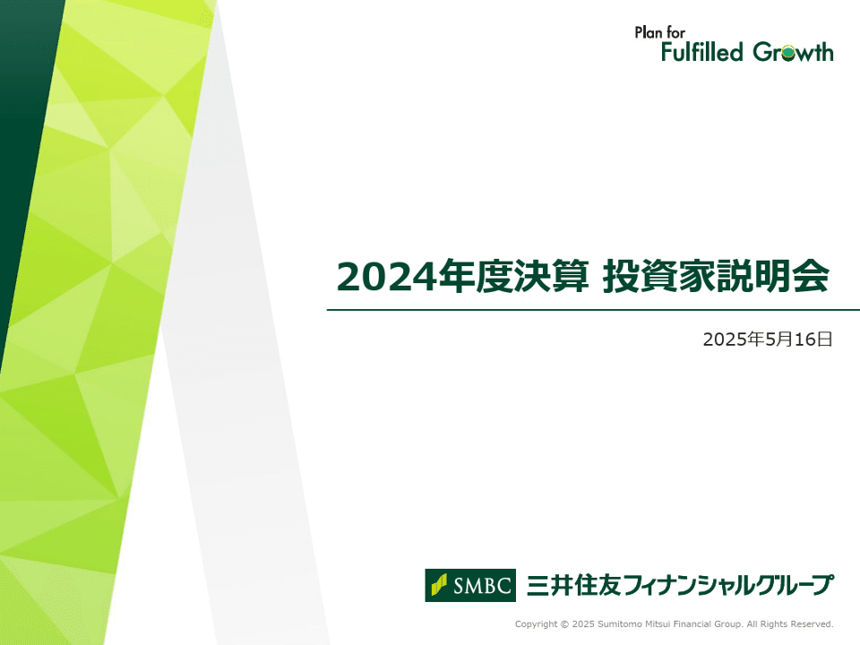
*株式会社三井住友フィナンシャルグループのプレゼンテーション資料*

> 引用元：[> プレゼンテーション資料](https://www.smfg.co.jp/investor/financial/latest_statement/2025_3/2025_fy_setumei.pdf)

*https://www.smfg.co.jp/investor/financial/presentation.html*

- 濃い緑色：カラーコード#004832、rgb（0,72,50）

- 緑色：カラーコード#13542b、rgb（19,84,43）

- オリーブ色：カラーコード#c4d600、rgb（196,214,0）

- 黄緑色：カラーコード#e0eb7e、rgb（224,235,126）

### 階層構造はグラデーションでデザイン

SMFG社のスライドは、全体的にしっかりと構造化されており、**構造に合わせて緑色のグラデーションが使われて**います。スライドタイトルや大カテゴリには、コーポレートカラーの濃い緑色が使われ、階層が下がる時や、背景に色を使いたいときにはオリーブ色や黄緑色が使われています。
コーポレートカラーにも使われている配色でおしゃれなのはもちろん、**スライド上部のタイトル部分もその配色になっている**ため、全体的に統一感のあるスライドとなっています。

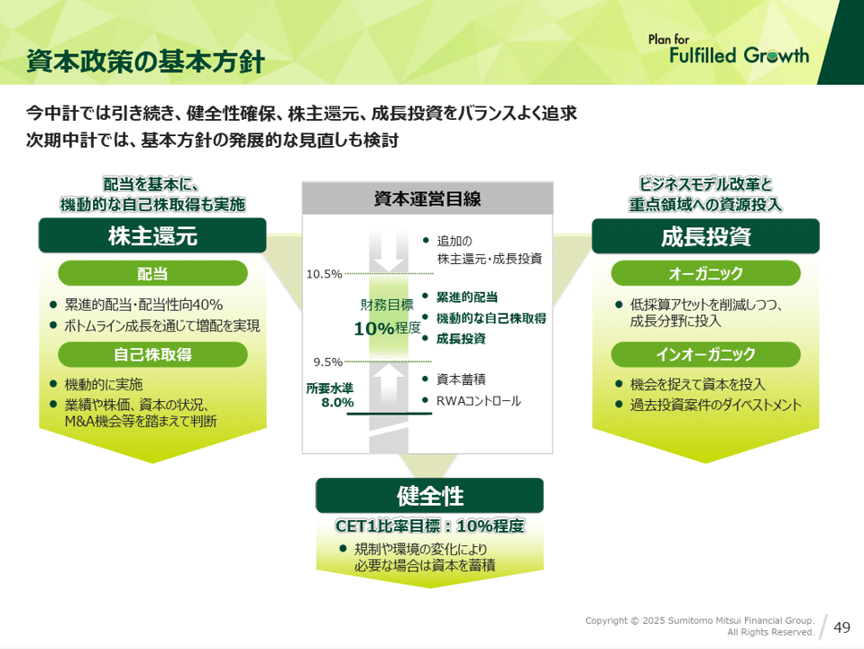

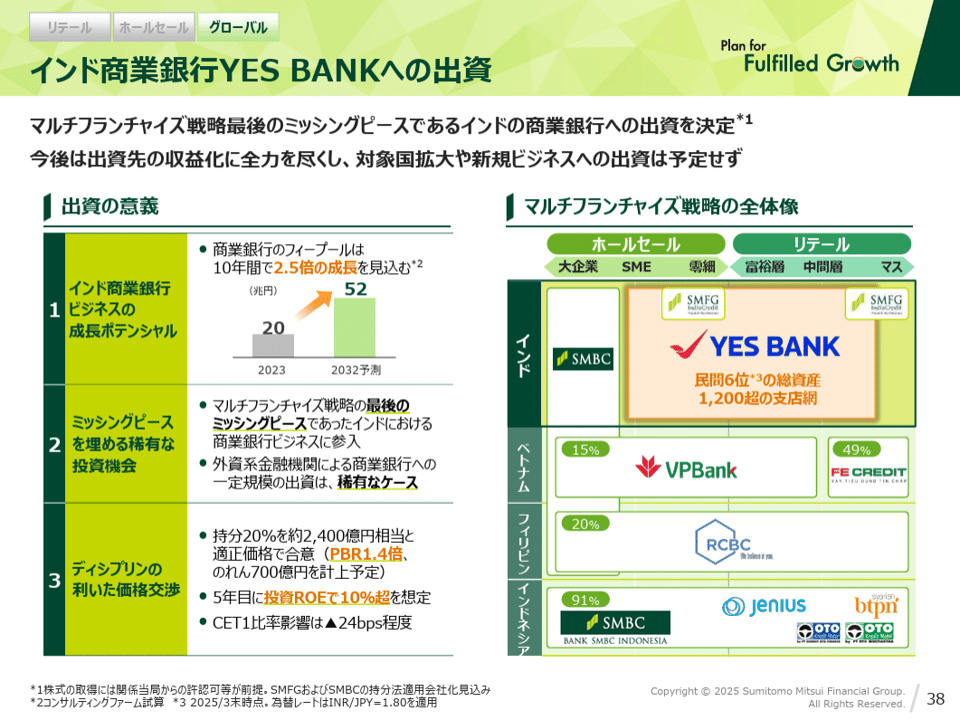

### オレンジ色で重要数値や重要事項を強調

SMBCのスライドの特徴としては、ベースの色を黄緑やオリーブ色にしつつ、数値や強調したい事項にはオレンジ色の差し色を使うというものがあります。**濃淡を問わず、緑色に合う色の筆頭がオレンジ色**なので、素晴らしい配色といえますね。

緑とオレンジの配色で全体を引き締めていることに加え、**フォントの大小や太字、四角や角丸のタグ、グラフと表の組み合わせ、ロゴの差し込みなどがうまく**、大量の情報を入れながらも見やすいパワポとなっています。

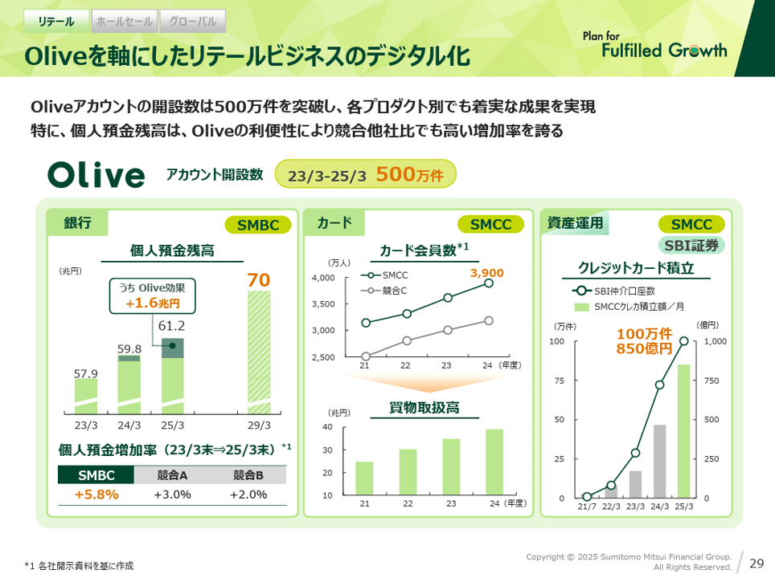

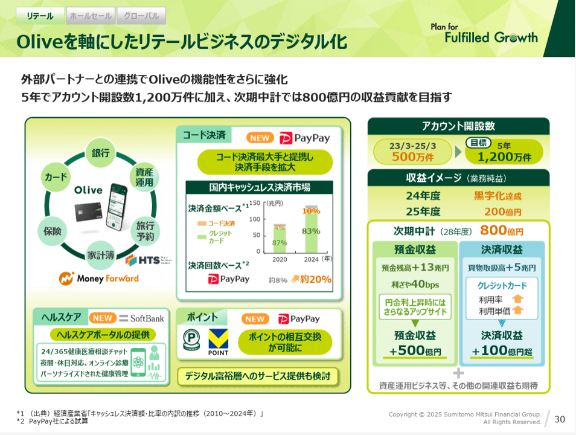

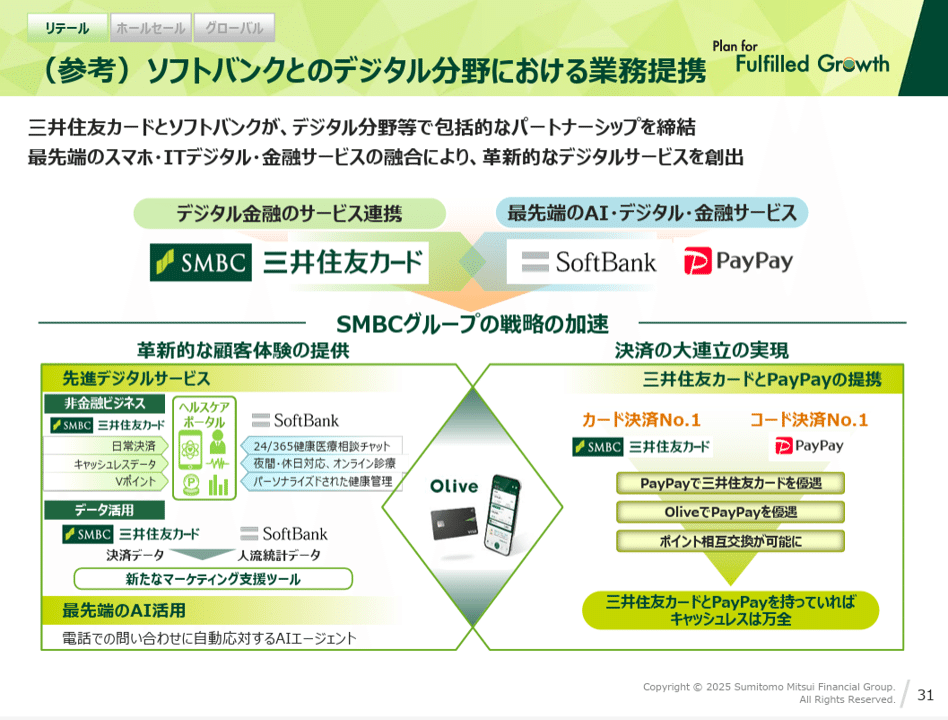

### 補足情報は青系の色でデザイン

強調はオレンジ色を使っている一方、補足は青系の色を使っているのもSMFGの特徴です。**反対色として緑色に合う色はオレンジが挙げられますが、同系統で緑色に合う色といえば青**ですよね。
ここでは黄緑からのグラデーションの延長のような感じで薄めの青を使っており、統一感のあるデザインとなっています。

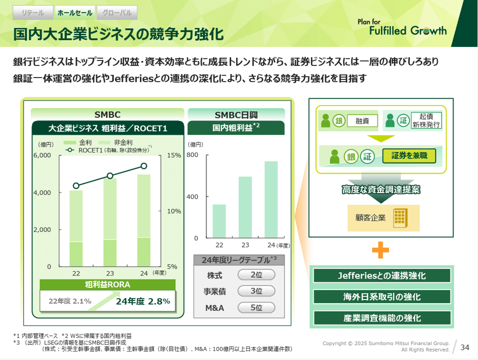

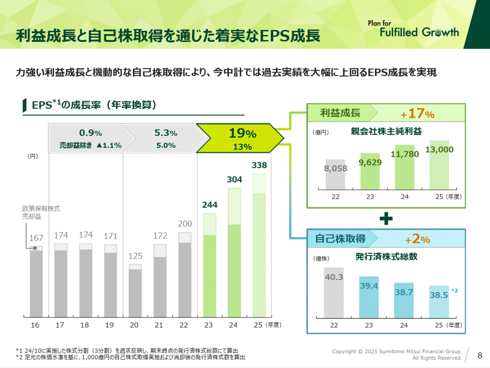

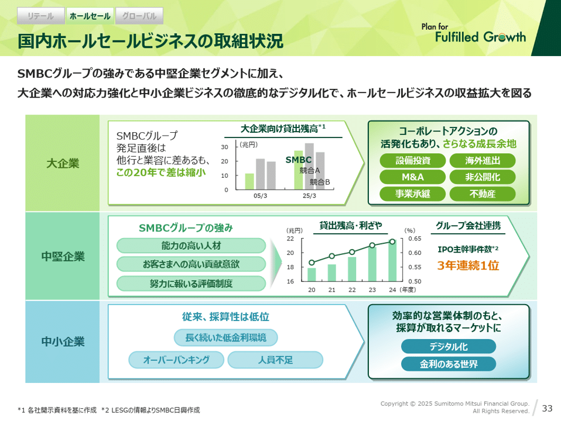

## 緑と青の配色が絶妙なスライド見本

続いては株式会社ユカリアの決算補足説明資料のパワーポイントを見ていきましょう。特徴はコーポレートロゴにあるように、緑と青のグラデーションを多用していることです。SMFG社の説明でも説明した通り、緑色に合う色として青は間違いありませんが、**グラデーションで見せることでより色なじみがよくなって**います。緑はエメラルドグリーンっぽい色ですね。

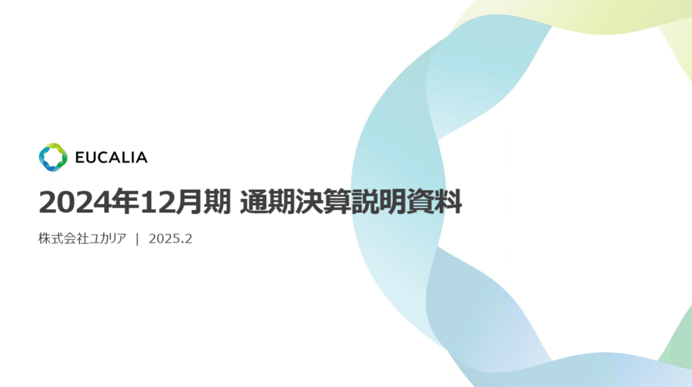
> 引用元：[> 2024年12月期 通期決算説明資料](https://contents.xj-storage.jp/xcontents/AS96593/db79aabf/80ad/494d/8a69/57f6fa3e8ead/140120250226583009.pdf)

*https://eucalia.jp/ir/presentations/*

- 緑色：カラーコード#00a63a、rgb（0,166,58）

- 黄緑色：カラーコード#abcd03、rgb（171,205,3）

- 青色：カラーコード#0075c2、rgb（0,117,194）

### 効果的な差し色として緑色を使うデザイン

ミッションビジョンバリューのスライドや目指す姿のスライドにおいては、写真などのビジュアルやキーチャートが重要になります。ユカリアのスライドにおいては、無理に色を入れることはせず、ミッションなどのタイトル部分にのみ緑色と青色のグラデーションを入れています。

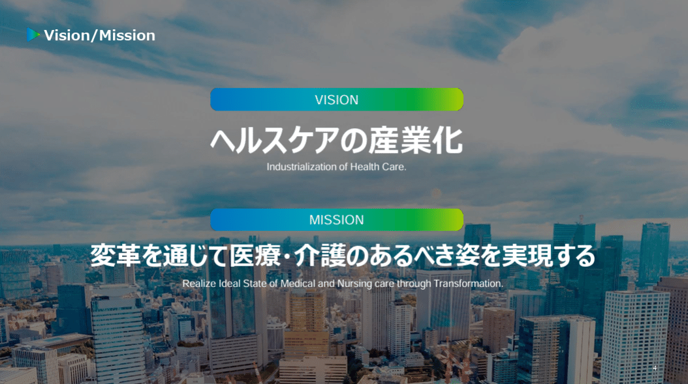

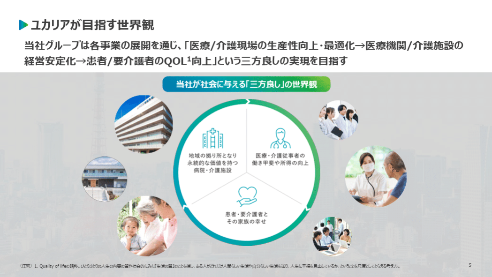

### 複数の要素は緑と青のグラデーション

ユカリアのパワーポイントの特徴が緑色と青色のグラデーションにあることはすでに触れていますが、特に複数の要素を説明するスライドにおいては力を発揮します。

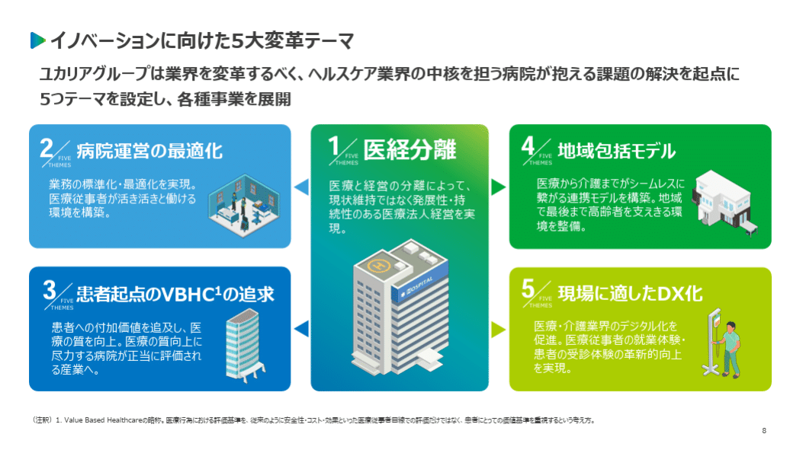
イノベーションに向けた５大変革テーマのスライドにおいては、５色を使う必要がありますが、**５色を緑色のみのグラデーションで示すことは難しい**ですよね。
またこのパワポの構成においては、真ん中に医経分離という中心のテーマがあるため、並列構造というよりは医経分離を中心とした構造になります。

そこでユカリアは、**左側を青色と水色、右側を緑色と黄緑色、真ん中の医経分離を緑と青のグラデーション**にすることでおしゃれに仕上げています。それぞれにイラストを入れることで文字中心でも見やすくしているのも、地味にポイントが高いです。

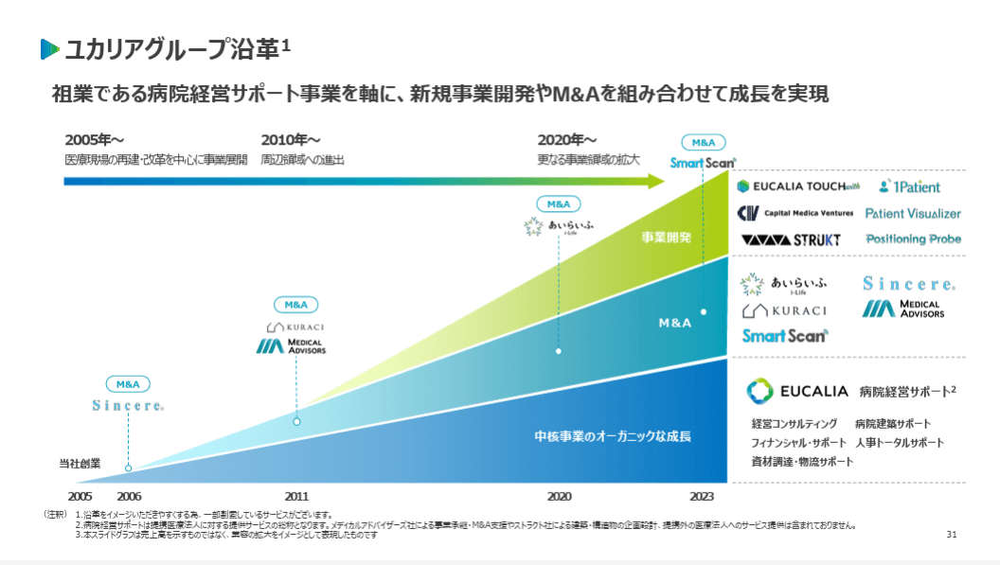

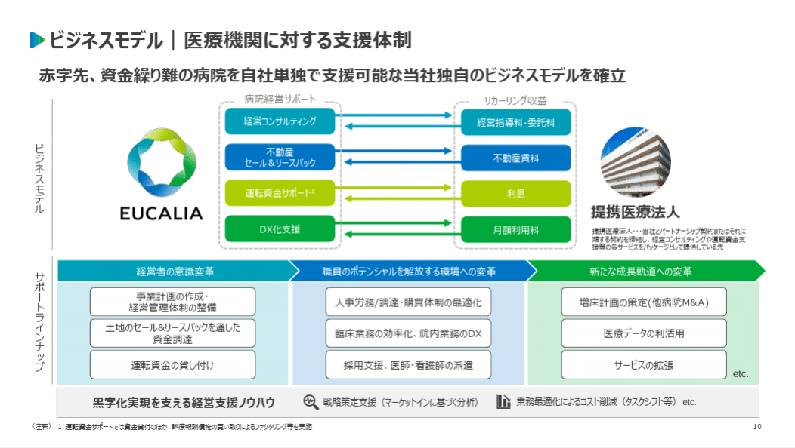
沿革やビジネスモデルのスライドにおいても、複数の色を入れながら色なじみがよいのは、**青が緑色に合う色であると同時に、同じ配色のコーポレートロゴを配している**からですね。

### タイトルにグラデーションを使うデザイン

表スライドにおいては、表のタイトルに緑色と青色のグラデーションを使っています。これは意図があるというよりは、オシャレに見せるための工夫とみてよいでしょう。**エメラルドグリーンとグレーの相性が良く**、表の見栄えが非常に良い仕上がりになっています。

通常強調においては、比較的強めの赤色や青色を使うことが多いですが、ユカリアの場合は薄緑を使っています。全体が緑色や青色のトーンとなっているため、薄緑でも十分に強調ができるわけですね。

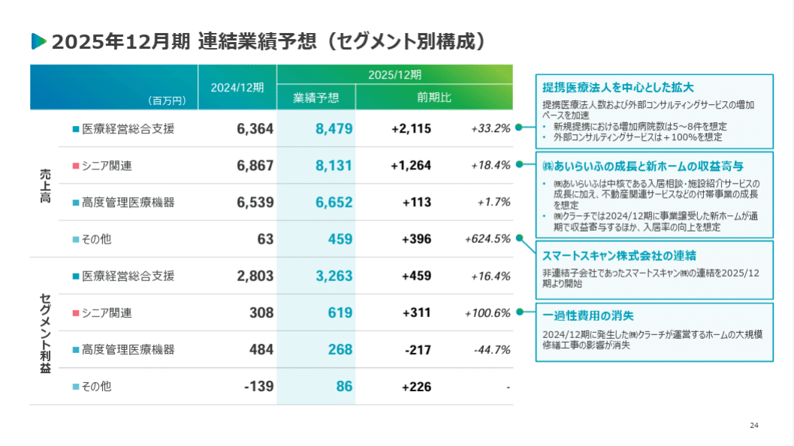

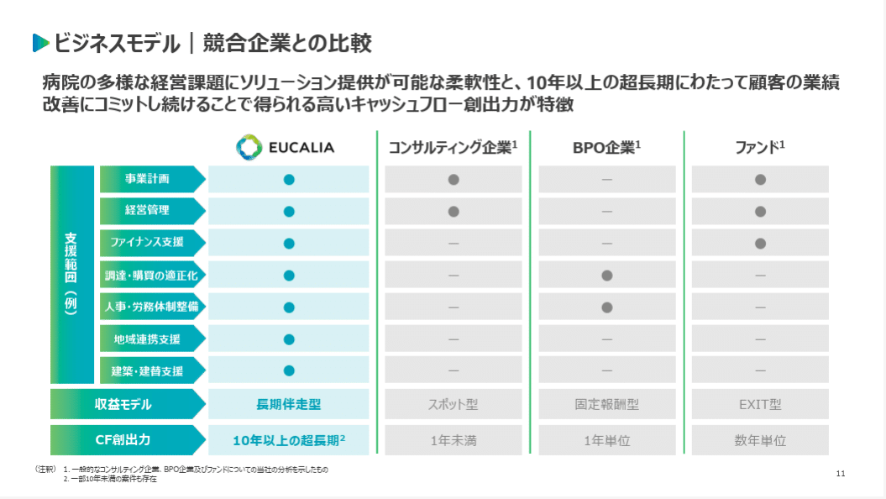

## 黒と緑の近未来的なデザインのスライド見本

最後に、インフォメティス株式会社のパワーポイントを見ていきましょう。蛍光色要素の強い緑色がコーポレートカラーとして採用されており、読み手にも明るい印象を与えるパワポです。**黒に緑という配色はSF映画などでよく使われる組み合わせであり、黒も緑色に合う色**といえますね。

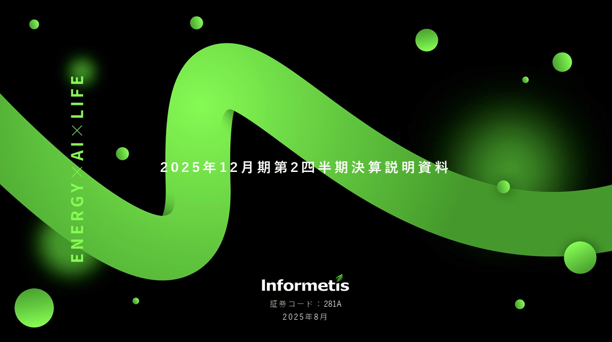
> 引用元：[> 2025年12月期第２四半期決算説明資料](https://pdf.irpocket.com/C281A/hGOm/w2ey/WH0i.pdf)

*https://www.informetis.com/ir/library/briefing/*

- 緑色：カラーコード#0a9f0a、rgb（10,159,10）

- 黄緑色：カラーコード#cfffc4、rgb（207,255,196）

- 黒色：カラーコード#000000、rgb（0,0,0）

- 灰色：カラーコード#f1f1f1、rgb（241,241,241）

### 緑色の文字でおしゃれに見せるデザイン

インフォメティス社の資料においては、文字に緑色が多用されています。蛍光色の強い緑色の文字だけだとチカチカしてしまうのですが、**緑色に合う色である黒やグレーがベースになっている**こと、緑色はタイトル等にとどめて詳細は黒文字にすることで、見やすく仕上がっています。

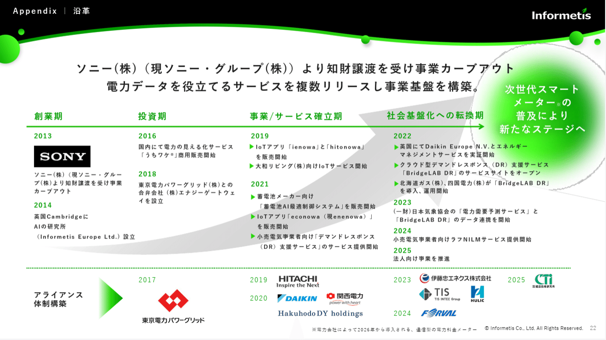

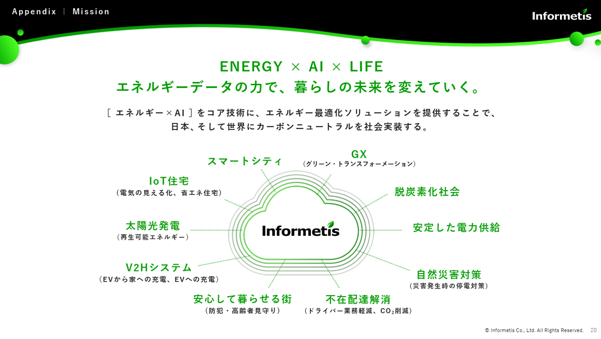

### 黄緑色の背景と黒文字の配色のデザイン

インフォメティス社のパワポの２つ目の特徴が、図における黄緑色の使い方です。図においては、背景色として黄緑色を使うことで、読み手の注意をそちらに向けることができています。

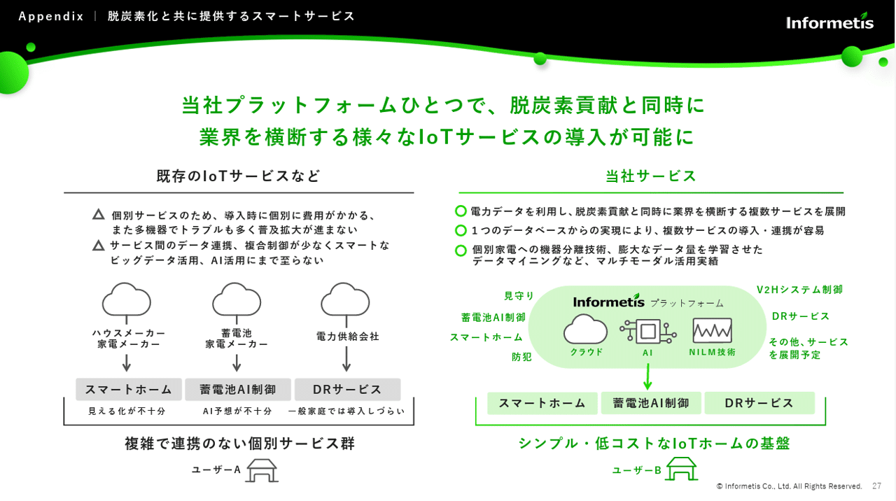
競合比較のスライドにおいては、**競合を黒文字に背景無し、自社サービスを緑文字に黄緑色の背景とする**ことで、差分がよりわかりやすいようにしています。

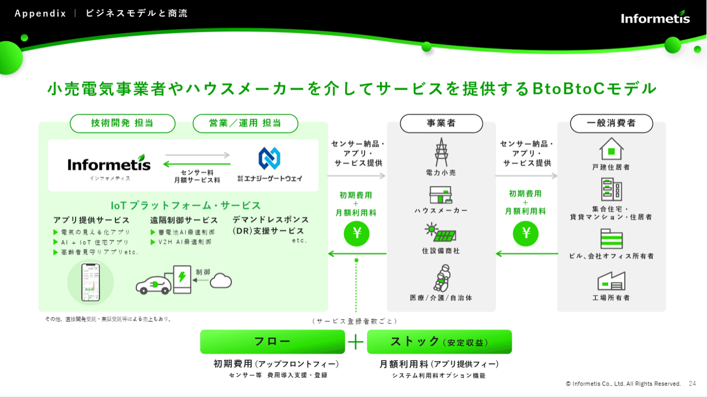
ビジネスモデル図においても、ステークホルダーは灰色の背景に黒文字、自社のサービスは黄緑色の背景に緑文字として、図全体をすっきりとまとめています。ステークホルダー側においても、**アイコンにピンポイントで緑色を使うことで、お金の流れの緑色の線との連関をわかりやすくしており**、これも地味なポイントといえますね。

### 文字以外を緑色にして強調するデザイン

インフォメティス社の最後のポイントとしては、ポイントポイントで緑色の使い方が変わることです。

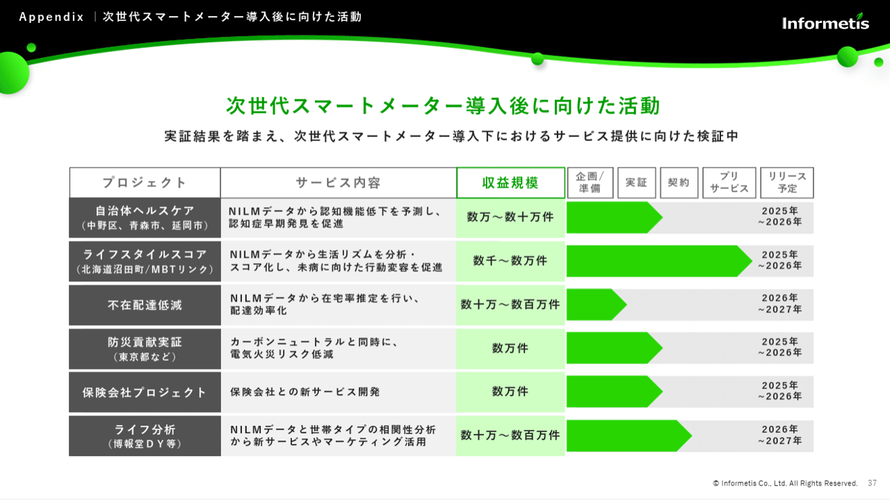
プロジェクトのパイプラインを見せる資料においては、金額感と実行のフェーズが重要であることから、**プロジェクトの中身は黒と灰色、収益規模と進捗を緑色にして**、そちらに目が向くようしています。進捗の背景は灰色となっていますが、やはりグレーは緑色とよく合う色なので、パワポ資料作成においても組み合わせやすいといえます。

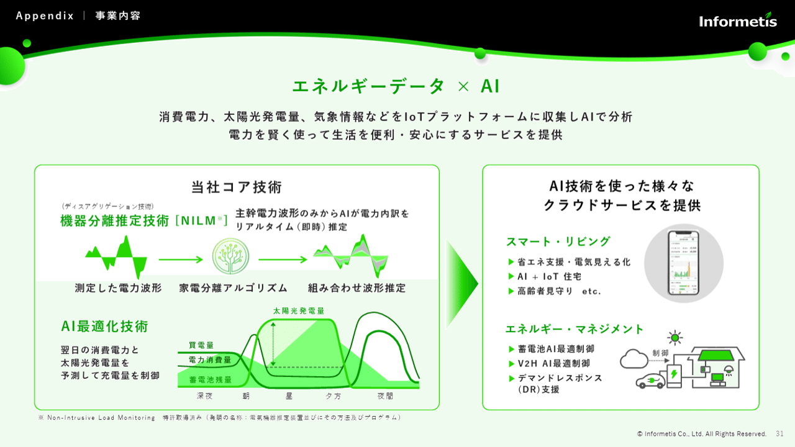
事業内容においては、機器分離推定技術やAI最適化技術といった、やや難解な技術の説明をしているため、イメージ図やイメージグラフの方に焦点を当てています。そのため緑色もそちらに使っていますね。

## 【マネしたい】おしゃれなパワポの「緑色系」プレゼン３選まとめ

いかがでしたでしょうか。濃い緑、エメラルドグリーン、蛍光色とみてきましたが、それぞれの緑色に合う色がわかり、どのような配色にするとおしゃれなパワポになるのか、伝わったのではないかと思います。
また緑色は濃淡にかかわらず、テキスト色としても利用しやすい色でもあるので、スライド作成時には使いやすいですね。

## パワポ研オリジナルテンプレート

パワポ研では「ビジネスシーンで使える」パワーポイントテンプレートを公開しております。デザインを整えるのみならず、**ロジックやストーリーを整理するのにも役立つパッケージ**になっておりますので、関心のある方は下記ページも併せてご覧ください！

[
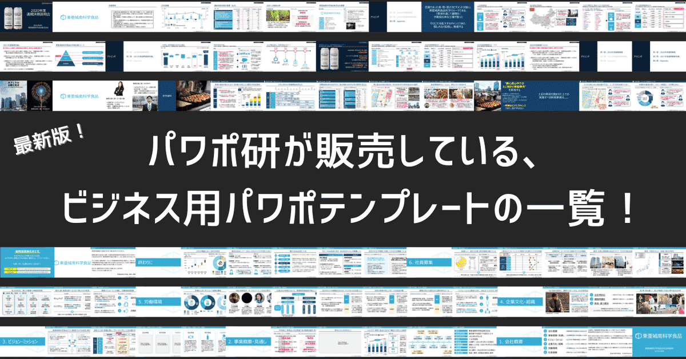
](https://note.com/powerpoint_jp/n/n7300a1293e8e)上記の記事のように、noteでは**フォローしているだけでビジネスにおける「資料作成のコツ」と「デザインのセンス」が身に付くアカウント**を目指して情報配信を行っています。
今後もコンスタントに記事を配信していく予定なので、関心のある方は是非アカウントのフォローをお願いします！

**> Template販売　**[> https://powerpointjp.stores.jp/](https://powerpointjp.stores.jp/%EF%BF%BCnote)
**> note　**[> パワポ研の資料作成術](https://note.com/powerpoint_jp/m/mc291407396da)
**> X（旧Twitter)　**[> https://twitter.com/powerpoint_jp](https://twitter.com/powerpoint_jp)

## レックスアドバイザーズからのお知らせ

パワポ研は株式会社レックスアドバイザーズが運営しています。
レックスアドバイザーズは**経営企画職や経営管理職に特化した転職エージェント**です。
上場企業や上場準備企業を中心に、**経営企画、IR、経理財務、法務、内部監査等の職種の求人**をご紹介しているほか、**CFOなどのコンフィデンシャル求人**もご紹介可能です。
またコンサルティングファームや監査法人、会計事務所の求人も豊富にあるため、プロフェッショナルファームを目指す方のご支援も得意です。
求人紹介やキャリア相談を希望の方は、[**無料転職サポート**](https://www.career-adv.jp/job_search/entryform_exp/)よりサービス利用登録をしてみてください。

**> 求人をご希望の方　**[> 無料転職サポート](https://www.career-adv.jp/job_search/entryform_exp/)**
> 採用支援をご希望の方　**[> 採用サポート](https://www.career-adv.jp/request3/)
**> その他　**[> お問い合わせフォーム](https://www.rex-adv.co.jp/contact)
**> 書籍　**[> 注目企業の実例から学ぶパワポ作成術](https://www.amazon.co.jp/dp/4046060476)

