# 【決定版】そのまま使えるグラフやチャート！パワポ研のスライド様式別テンプレート

[note原文](https://note.com/powerpoint_jp/n/n50d02ec3162f)

みなさんこんにちは。
資料デザインのリサーチや分析に取り組むパワーポイントのスペシャリスト、パワポ研です。日々noteやTwitterでパワポに関する情報発信をしています。

この度、パワポ研が三年ぶりに**パワーポイントテンプレートの新作**を完成させましたので、是非とも皆様にお使いいただきたく、その解説を行いたいと思います。

以前より販売しておりますテンプレートは「資金調達ピッチ資料」「決算説明資料」「新規事業計画資料」「会社説明/採用資料」というように、シチュエーション別に分かれているものでしたが、今回の新作は「グラフ」や「ガントチャート」「マトリクス」などのように、様式別にパワーポイントのスライドを展開しております。

（なお「**解説はいらないからすぐに使いたい！」**という人は**「**[**こちら**](https://powerpointjp.stores.jp/)**」**から「【34セクション・184枚】パワーポイント素材スライドテンプレート集」を選択ください）

## パワポ研様式別テンプレートの構成

今回パワポ研が作成したのは「**あらゆる場面で使える汎用的なスライド集**」です。スライドのテンプレートというと、巷ではグラフや一部の図形など、数枚～数十枚に留まった、テンプレート集というには心もとない数であったり、あるいは中身が空欄ばかりで具体的に何を書いてよいのかわからないような、スライドの構造体だけを配布するものがしばしばみられます。

パワポ研は、全184種類のスライドを用意したので、かなり広範なシチュエーションでも対応できると自負しています。この184のスライドの中のどれかは、ユーザーが探しているスライドに近しいものが見つかると思いますので、ユーザーは「**それをちょっと改変するだけ**」でご自身の資料としてお使いいただけます。また、完成形に自分の伝えたいことを当てはめていくことで、**構造化やロジックの整理ができる**という点も大きなメリットです。

パワポ研で展開する様式別テンプレートは、以下のラインナップで構成されています。なるべく多くのシチュエーションを網羅できるようにラインナップを構築しました。

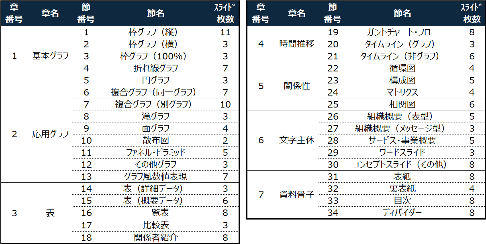
なお、テンプレートのサンプル（PDF抜粋版）は以下よりダウンロードできます。

   [    **様式別パワーポイントスライド実例集（サンプル）.pdf** 2.15 MB  ファイルダウンロードについて      

ダウンロード
   ](https://note.com/api/v2/attachments/download/f16fa9ecbd8a76be06ff843d035cb086)   もちろん、「空欄が多い資料が良い」というニーズもあると思います。様々なニーズに対応するため、パワポ研は以下のパッケージをバンドルして提供します。

> 「フルパッケージ」資料（パワーポイント）
> 「解説ノート付きフルパッケージ」資料（パワーポイント）
> 「ブランクパッケージ」資料（パワーポイント）
> 「フルパッケージPDF」資料（PDF）

上記4点で1セットとして提供します。なお、それぞれは以下のようなイメージと特徴になっております。
（※なお、本noteに記載の画像は実際の商品と一部異なる場合がございます）

### 「フルパッケージ」資料（パワーポイント）

[
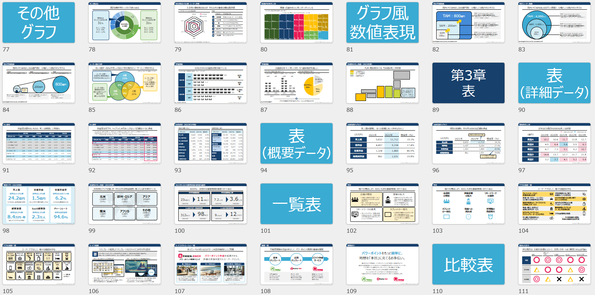
](https://powerpointjp.stores.jp/items/6688a980d8e56a0a613d9097)
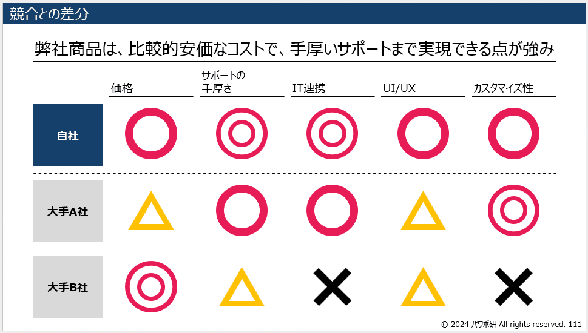
・テンプレートとして使うためのスライドのみを掲載した資料です。こちらのスライドをコピーしてご自身の資料に加えたりしてください
・スライドそのものに無関係な説明や解説は入っておりません（＝「ノート」部分に記載はありません）

### 「解説ノート付きフルパッケージ」資料（パワーポイント）

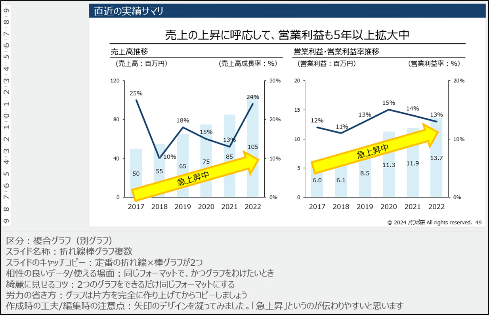

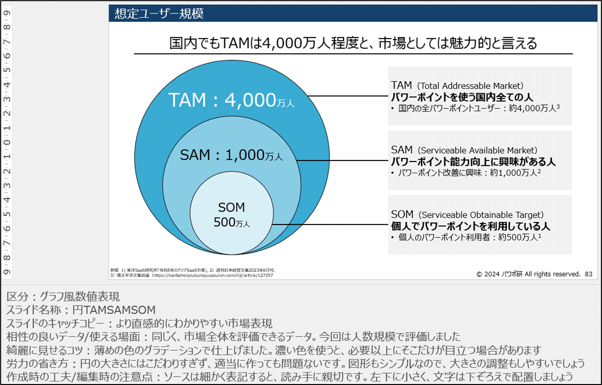
・「フルパッケージ」に各スライドごとの解説資料として「ノート」（スライド下部の説明書き）」を加えたものです
・スライド作成や編集、活用のポイントなどを記載しています
・具体的には、「区分」「スライド名称」「スライドのキャッチコピー」「相性の良いデータ/使える場面」「綺麗に見せるコツ」「労力の省き方」「作成時の工夫/編集時の注意点」が各スライドに記載してあります

### 「ブランクパッケージ」資料（パワーポイント）

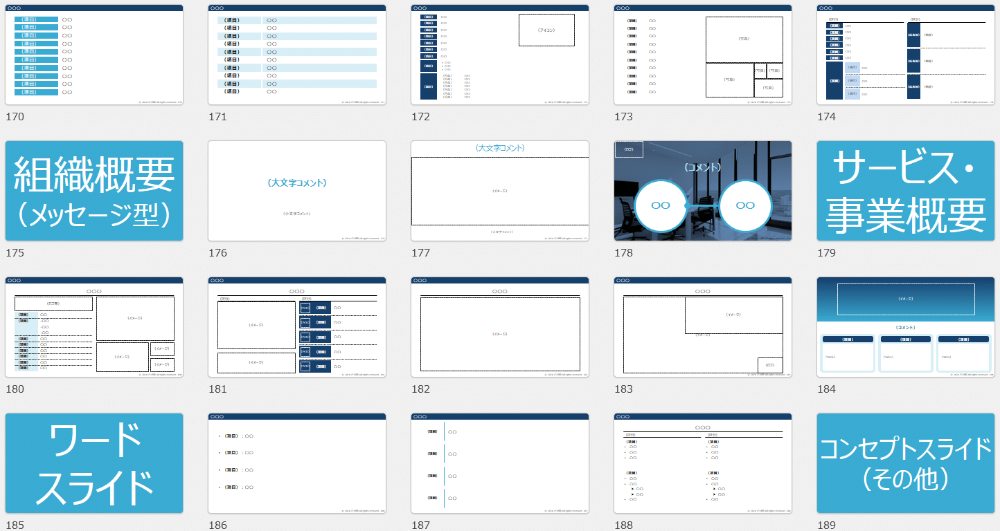

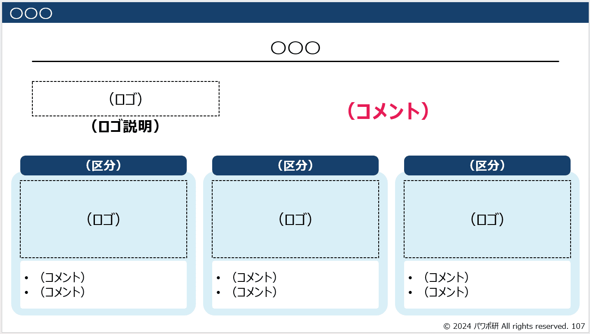
・フルパッケージから、文言などを取り除いたものです（グラフを維持するためのデータなどはそのまま）
・いちいち画像や文字を消去することなく、ご自身の資料に取り込めます
・中に文言が入っていないため、先入観なくスライドを様式として活用できます

### 「フルパッケージPDF」資料（PDF）

・「フルパッケージ」のPDF版です。記載内容は、「フルパッケージ」と全く同じです
・パワーポイントよりファイルサイズが小さい（軽い）ので、パラパラと閲覧する分には見やすいかと思います
・当社noteなどで、サンプルとして無料で閲覧できるものがあります

以上の4資料で1つのコンテンツとなっております。

## パワポ研テンプレートの特徴

このテンプレートには、3つの大きな特徴があります。

まず1つ目は、「**あらゆるシチュエーションに対応している**」ということです。前述しましたが、これまで世の中にあった既存のテンプレートは網羅性が低いと言えます。グラフや図形など一部に特化しすぎたものであったり、あるいはよく使いそうな様式でも収録されていないようなスライドがあったかと思います。

しかし、パワポ研の新テンプレートは**網羅性はかなり広い**です。グラフや図形だけではなく、よく使われるワードスライドや、資料骨子となる表紙やディバイダーまでも収録しています。ここまで網羅が徹底されたテンプレート集は他にないでしょう。このテンプレートから、スライドをいくつかピックアップするだけでも、大概の資料を完成させることができます。

2つ目は、「**丁寧な解説がある**」ということです。既存のテンプレートは大量のスライドだけを用意して「さあどうぞ使ってください」というものが多く、ユーザーフレンドリーとは言えませんでした。しかしパワポ研のテンプレートでは、**どこに何を書くべきか**が明確に分かり、更に例として実際のビジネスの現場で直ぐに使えるような中身がサンプル的に記載されているので、ユーザーの指針となります。

3つ目は、「**どのような場面にも転用できる**」ことです。なるべく「グラフ」や「ワードスライド」など、汎用的な見た目の区分でスライドをとりまとめました。これが「市場規模」や「商品の説明」など、用途を限定してしまっては、そのシチュエーションでしか使えないと思われるかもしれません。本スライド集では、なるべくシチュエーションを絞らず、どのような場面であっても活用いただけるような汎用的な構成にしております。

## 想定するユーザー

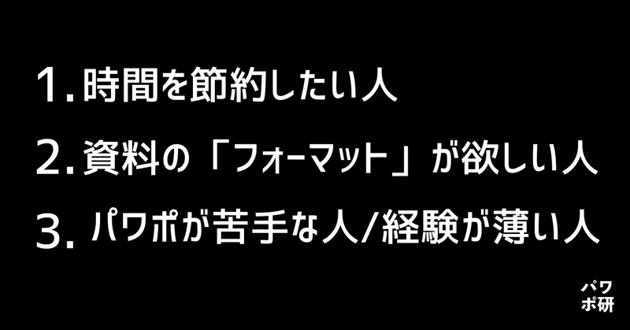
さて、ここまではテンプレートの構成と特徴を記載してきましたが、本章では「どのような人に使って欲しいか」ということを記載します。本音を言えば、「パワーポイントを使う全ての人」に使って欲しいのですが、実際のところ全ての人にFitするプロダクトは、逆に言えばだれにもぴったりとははまらないものです。そのため、パワポ研は以下のような人をターゲットとして想定しています。
（このあたりの思いは、パワポ研が既存で販売しているテンプレートと同様です）

**1. 時間を節約したい人**

全てのビジネスパーソンや研究者は限りなく時間に追われていますが、その時間の一部を使ってパワーポイントを作成しています。そして、ほとんどの人が「資料作成」を本業としているわけではなく、**「創造的」な仕事を本業としている**はずです。そして、**テンプレートを使うことで本業ではない「資料作成」の時間を削り、より生産性の高い働き方を実現**できます。実際のところ、「資料作成」というのは（デザイナーなどそれを本業とする方を除き）なんら本質的な作業ではありません。あくまで物事を伝えるための手段であり、そのようなことに時間をかけるのはナンセンスであると我々は考えています。その**時間節約の一助にこのテンプレートを活用して欲しい**のです。

裏返せば「時間を大量に消費して徹底的にデザインに拘りたい人」にはこのテンプレートはおすすめしません。

**2. 資料の「フォーマット」が欲しい人**

資料作成作業では、**「全体の構成決定」**と**「細部の詰め」**の2つの山場が存在します。「全体の構成決定」というのは、どのような流れでプレゼン資料を組み立てるかを指し、また「細部の詰め」はフォントや色などよりデザインに寄った細かい作業を指します。

そして、**このテンプレートは両方の山場に有用**です。

まず、あらゆるシチュエーションに対応できるスライドを詰め込んでいるため、ピックアップするだけで資料の骨子が完成します。構成を決定するのには間違いなく有用でしょう。

また、このテンプレートを使うことで、細部の詰めに関して迷いは一切なくなります。全て「メッセージが明確なスライド」と「視認性の高いフォントと色」でパッケージが構成されているので、些末なことで悩んだり時間を費やしたりする必要は一切なくなります。

要すれば、「フォーマット」として完成しているため、それを活用したいという人には最適なものになっているはずです。

**3. パワーポイントが苦手な人/経験が薄い人**

そもそも本テンプレートは、**パワポ初心者の方でも簡単に利用できる**ということをコンセプトに開発されました。そのため、オブジェクトを一々作成したり、スライドのレイアウトに悩んだりする必要が一切なくなり、**この資料をベースにすれば手間をかけずにスライドを作成すること**が出来るでしょう。

また、「解説付きノート付きフルパッケージ」を利用して**パワーポイント資料の作り方を学ぶ**ことも可能です。また、「ブランクパッケージ」は、できる限り構造を単純化しています。これらを参照することで、資料作成のスピードを上げることも将来的には可能になるでしょう。

## テンプレートの使い方

ここまでの説明で、おおよそテンプレートの使い方はご理解いただけたかと思いますが、改めて使い方を以下にまとめます。

まず、基本的には**業務に活用すること**を想定しています。日々のパワーポイント作成にご活用いただく、ということです。ある種の資料を作る必要があり、その発射台としての利用を主に想定しています。

具体的には、本スライド集は、ご自身の既存の資料のために、いくつかのスライドをピックアップして利用されることを想定しています。「ここにスライドを入れたいけど、ゼロから作るのは面倒だな……」というときに、本スライド集からピックアップして、データや情報を流し込んでそのままお使いいただけます。また、「そもそもの土台が全く手元にない」という状態でも、表紙などの資料骨子を含めて、**本スライド集から素材をかき集めるだけで**、それなりの資料があっと言う間に完成します。

なお、パワポ研がすでに販売している「資金調達ピッチ資料」「決算説明資料」「新規事業計画資料」「会社説明/採用資料」などのシチュエーション別のテンプレートに、本テンプレートのスライドを組み込むことで、より増補・拡張することもできます。

また、副次的に**パワーポイント作成の勉強材料としての活用**も可能です。前述の通り、4つのフルパッケージについて「書くべき内容」と「作成のポイント」を全てのスライドについて記載しています。また、「一般的な資料一連の流れ」を理解することもできます。

## テンプレート作成の背景

少し脇道に逸れますが、なぜパワポ研がわざわざテンプレートを作成したのかということを念のため記載しておきます。

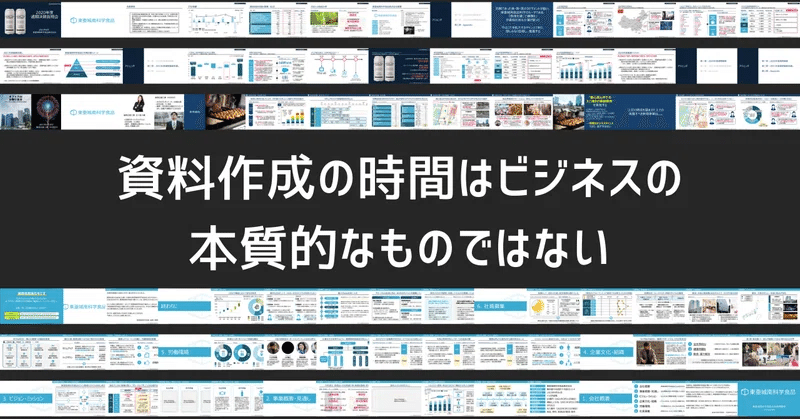
まず第一に、パワポ研は**資料作成の時間はビジネスの本質的なものではない**、と考えています。前述の通り、限りある時間の中では創造的な業務に注力することがビジネスパーソンとしての価値に繋がります。

そして、パワーポイント資料作成はその本質的ではない時間の最たるものです。同じような作業の繰り返しに近く、それは創造的とは言えません。あくまでパワポ資料というのはアイデアや結果を「見せる」ためのものなので、そこに独創性や創造性は求められていません。しかし、パワポ資料があると説明もし易いし、理解もしてもらい易い。だからビジネスパーソンは時間を割いて資料を作るのです。

そして、ある種の**テンプレートがあれば「分かりやすい」資料を「最小の労力で」作成することが出来る**と考えました。なので、パワポ研としても世の中のテンプレートを探し、いいものを紹介できれば……と考えていました。

しかし前述の通り、世の中に無料のテンプレートはいくつか散見できますが、どれも一長一短があり、パワポ研が「これぞ！」と思うものはなかなか見つかりませんでした。図形の寄せ集めであったり、ごく一部の極端にデザイン性の高いスライドの集まりであったり、あるいは特定の役割にフォーカスし過ぎていたり……などなど。

そのため、「じゃあゼロからテンプレートを作って配布しよう」ということで、この度テンプレートの作成に至ったわけであります。

## テンプレートの価格/購入方法/スペック

購入価格とコンテンツは以下のようになっております。

[【34セクション、184種類のテンプレート】：**5,980円**](https://powerpointjp.stores.jp/items/6688a980d8e56a0a613d9097)**
**（PPTサイズ　16:9、ページ数 230（説明スライド含む）、ZIPファイル形式）

以下の7つのカテゴリー（章）のテンプレートがまとめて収録されている素材集です。
（1）基本グラフ（棒グラフ、折れ線グラフ、円グラフ　等）
（2）応用グラフ（複合グラフ、滝グラフ、面グラフ　等）
（3）表（一覧表、比較表、関係者紹介　等）
（4）時間推移（ガントチャート・フロー、タイムライン　等）
（5）関係性（循環図、構成図、マトリクス、相関図　等）
（6）文字主体（組織概要、サービス・事業概要、ワード、コンセプト）
（7）資料骨子（表紙、裏表紙、目次、ディバイダー）

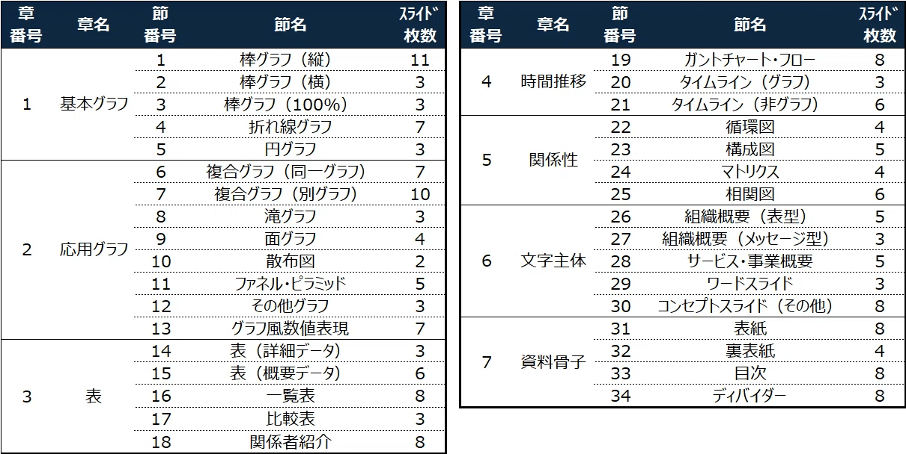
購入は下記のページもしくはnoteクリエイターページのストアよりお願いいたします。

過去のテンプレートも含めたお得なパッケージングセットも販売します。**
**[【全商品】パワポ研テンプレート全部買いセット**：9,980円**](https://powerpointjp.stores.jp/items/66893d8ab4efa21638ab2251)

[
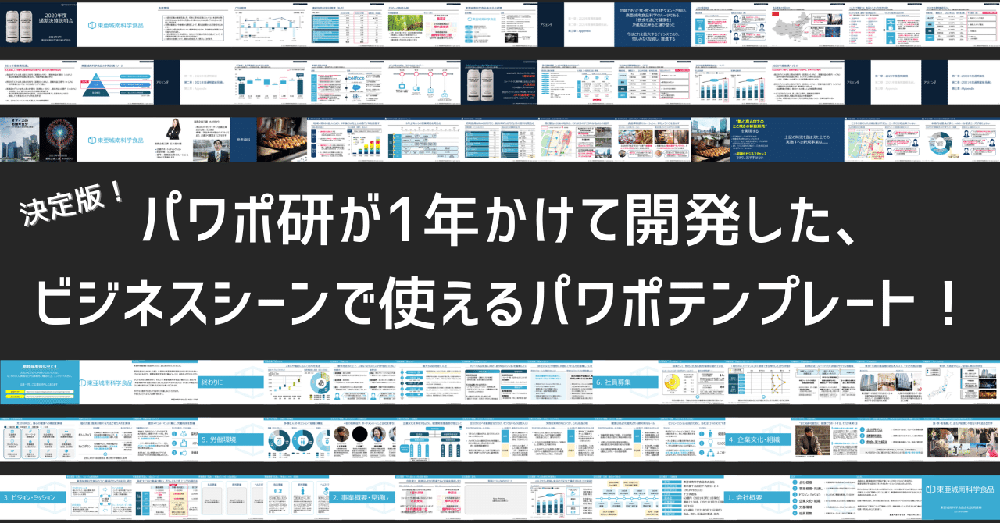
](https://note.com/powerpoint_jp/n/n0380d0556127)これは、現在パワポ研で販売している下記（1）〜（5）のテンプレートが全て含まれるパッケージとなります。合計15,980円のところを、[**まとめ買い割引で9,980円**](https://powerpointjp.stores.jp/items/66893d8ab4efa21638ab2251)となっており、大変お買い求め安くなっています。
（1）パワーポイント素材スライドテンプレート集：5,980円
（2）資金調達ピッチ資料テンプレート：2,500円
（3）会社説明・採用資料テンプレート：2,500円
（4）新規事業計画資料テンプレート：2,500円
（5）決算説明資料テンプレート：2,500円

## おわりに

パワポ研noteでは**フォローしているだけでビジネスにおける「資料作成のコツ」と「デザインのセンス」が身に付くアカウント**を目指して情報配信を行っています。
今後もコンスタントに記事を配信しいく予定なので、関心のある方は是非アカウントのフォローをお願いします！

**> Template販売　**[> https://powerpointjp.stores.jp/](https://powerpointjp.stores.jp/%EF%BF%BCnote)
**> note　**[> パワポ研の資料作成術](https://note.com/powerpoint_jp/m/mc291407396da)
**> X（旧Twitter)　**[> https://twitter.com/powerpoint_jp](https://twitter.com/powerpoint_jp)

## レックスアドバイザーズからのお知らせ

パワポ研は株式会社レックスアドバイザーズが運営しています。
レックスアドバイザーズは**経営企画職や経営管理職に特化した転職エージェント**です。
上場企業や上場準備企業を中心に、**経営企画、IR、経理財務、法務、内部監査等の職種の求人**をご紹介しているほか、**CFOなどのコンフィデンシャル求人**もご紹介可能です。
またコンサルティングファームや監査法人、会計事務所の求人も豊富にあるため、プロフェッショナルファームを目指す方のご支援も得意です。
求人紹介やキャリア相談を希望の方は、[**無料転職サポート**](https://www.career-adv.jp/job_search/entryform_exp/)よりサービス利用登録をしてみてください。

*レックスアドバイザーズのサービスサイトはこちらから*

**> 求人をご希望の方　**[> 無料転職サポート](https://www.career-adv.jp/job_search/entryform_exp/)**
> 採用支援をご希望の方　**[> 採用サポート](https://www.career-adv.jp/request3/)
**> その他　**[> お問い合わせフォーム](https://www.rex-adv.co.jp/contact)
**> 書籍　**[> 注目企業の実例から学ぶパワポ作成術](https://www.amazon.co.jp/dp/4046060476)

