# 【コンサルのパワポ紹介】上場している経営コンサルファームのスライド資料

[note原文](https://note.com/powerpoint_jp/n/n53e8677a8d85)

みなさんこんにちは。
資料デザインのリサーチや分析に取り組むパワーポイントのスペシャリスト、パワポ研です。

パワポ研ではこれまで、戦略コンサルティングファームやBIG4のパワーポイント資料など、プロフェッショナルファームの資料を紹介してきましたが、今回は上場している経営コンサルティングファームの資料を紹介していこうと思います。

上場している経営コンサルティングファームの資料を見て学びたい方、経営コンサルに転職したい方など、ぜひ最後まで読んでいただければと思います！では早速行きましょう！

## 株式会社ドリームインキュベータの資料

まずはドリームインキュベータのパワポスライドを見ていきましょう。
ドリームインキュベータはＢＣＧ出身の堀紘一氏が2000年に立ち上げた経営コンサルティングファームで、新規事業のインキュベーションやベンチャー支援に強みを持っています。

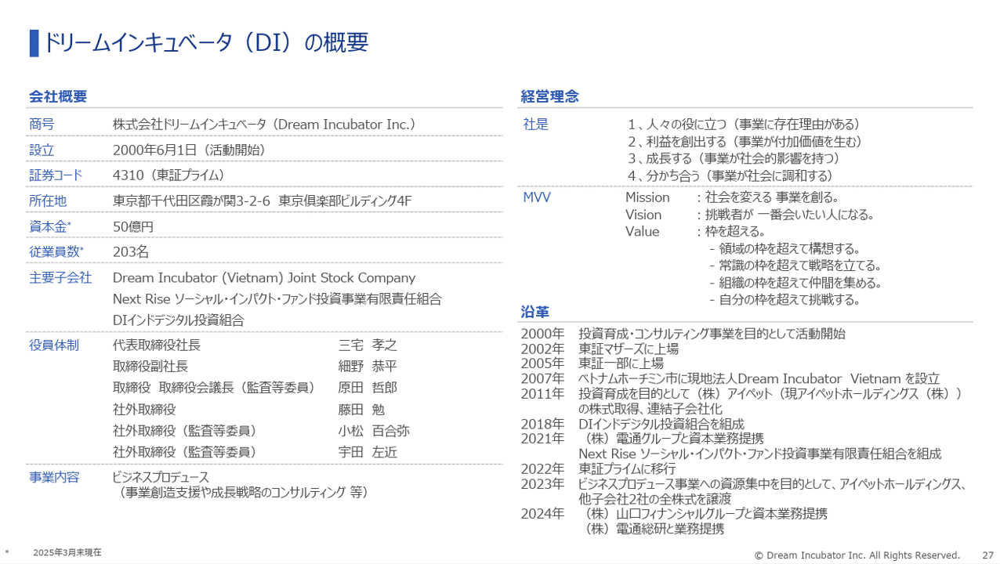
> 引用元：[> 決算説明会資料](https://www.dreamincubator.co.jp/wp/wp-content/uploads/2025/05/20250515-DIIR_4Q_KS.pdf)

*https://www.dreamincubator.co.jp/ir/library/*

パワポのスライドはHPの支援事例一覧から引用しています。

 
[
**
支援事例 アーカイブ | ドリームインキュベータ
**

www.dreamincubator.co.jp

](https://www.dreamincubator.co.jp/business/support_case/)

 

### 新規事業部門の立ち上げ支援のスライド

大手企業における新規事業部門立ち上げ支援のプロジェクト事例のスライドから見ていきましょう。オムロンの支援事例とエクシオグループの支援事例の二つがあります。

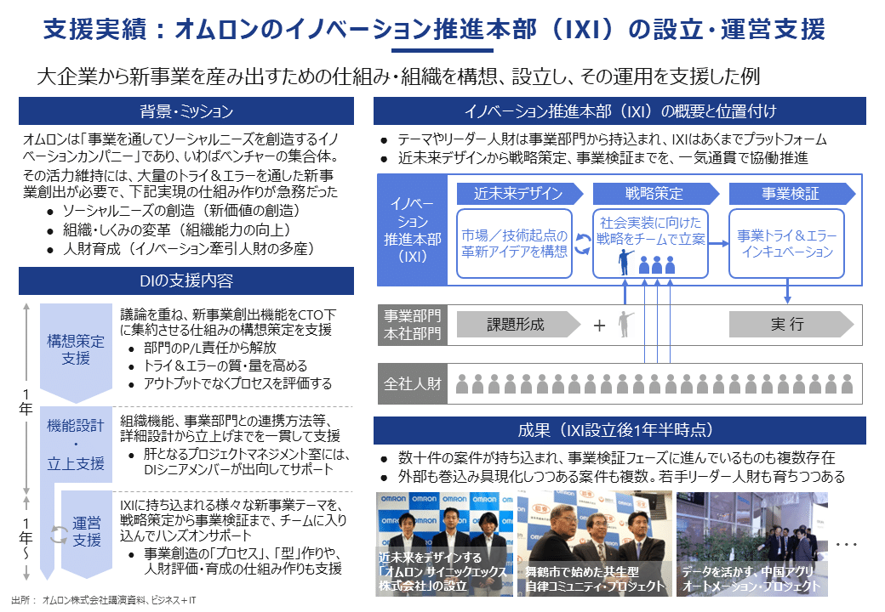
オムロンへの支援内容をまとめたパワポスライドです。**クライアント企業の置かれた状況と、ドリームインキュベータの支援内容と成果**がまとめられています。

実際に類似のプロジェクトの提案機会がある際に支援事例として提案書に入れているスライドだと思うので、**経営コンサルファームのリアルな提案資料**とも言えますね。

プロジェクト成果により紙面を割くために、背景と支援内容は紙面の半分以下にギュッと凝縮し、プロジェクト成果を図や写真のビジュアルでしっかりと見せています。

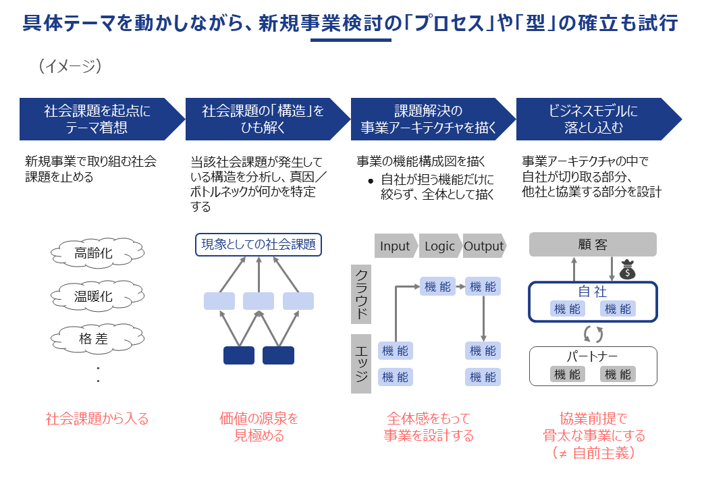
同じくプロジェクト成果である、組織プロセス構築のスライドです。単なる提案内容ではなく、実際に伴走支援を行ったうえで作り上げたプロセスであるということをトップラインメッセージに入れています。

あくまで外部向けに公開されたスライドであり、提案やプロジェクト内で使われたスライドそのものではないですが、**実際の報告資料とかなり近しいスライド**とみてよいでしょう。

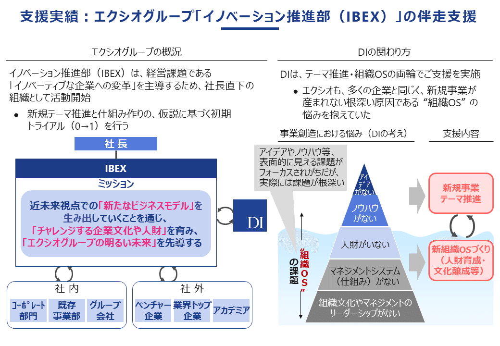
大手通信建設会社であるエクシオグループへの支援内容をまとめたパワポスライドです。**クライアント企業の置かれた状況と、ドリームインキュベータの支援内容**がまとめられています。

こちらはプロジェクトの提案書あるいはキックオフ資料に使われたスライドではないかと思います。先ほどのオムロンの資料とトンマナが異なりますが、経営コンサルティングファームは他社からの転職者も多いので、こうしたトンマナの違いはよく発生します。

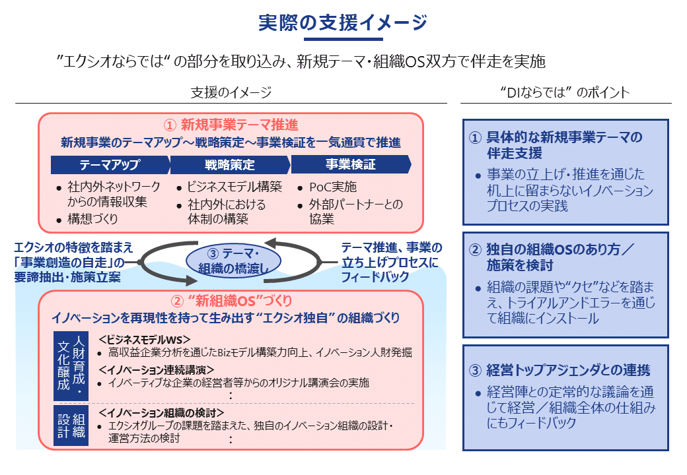
実際の支援イメージとDIならではの価値提供のポイントをまとめています。
支援イメージでは、大きく新規事業テーマの推進と、新組織のOS作りという二つのパートに分けて、**どのような支援をしたのかを、バリューチェーンやカテゴリに分けて記載**しています。
DIならではの価値提供の部分では、左の図にナンバリングする形でテキストを紐付けていますね。

こちらも先ほどのスライド同様、提案書に入っていたスライドとみて間違いないでしょう。何をやるのか、なぜDIを選ぶべきなのかが、詳細かつ構造的に示されています。**エクシオ自身の言葉を援用して伴走してくれそうという感覚を持ってもらう、一方で新組織OSというDIの言葉を使って専門性を見せる等**、細かな工夫も見られます。

### R&Dポートフォリオ最適化支援のスライド

続いて大手企業における、コーポレートR&Dポートフォリオの最適化支援のプロジェクト事例のスライドから見ていきましょう。

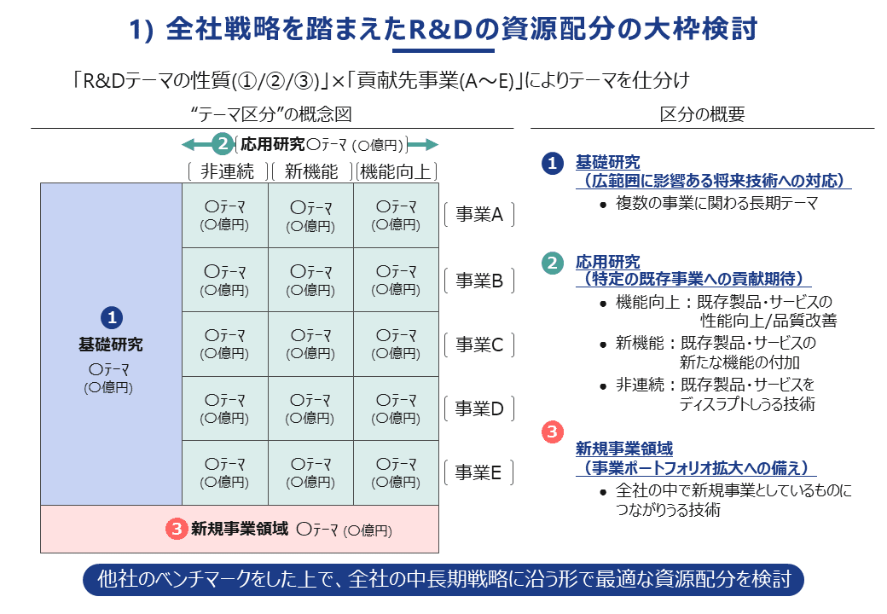
プロジェクトのアプローチとして、どのようにテーマを仕分けしていくのかをまとめたスライドです。コーポレートR&Dのテーマを、基礎研究、応用研究、新規事業に分けて仕分けをしています。応用研究も、機能向上、新機能、非連続とさらに分類しています。

こちらも提案資料からそのまま持ってきたようなスライドです。ボディのトンマナは先ほどの資料に近いですが、**メッセージがトップラインとボトムラインに分かれており、トップライン側は概要、ボトムライン側がメッセージ**になっています。

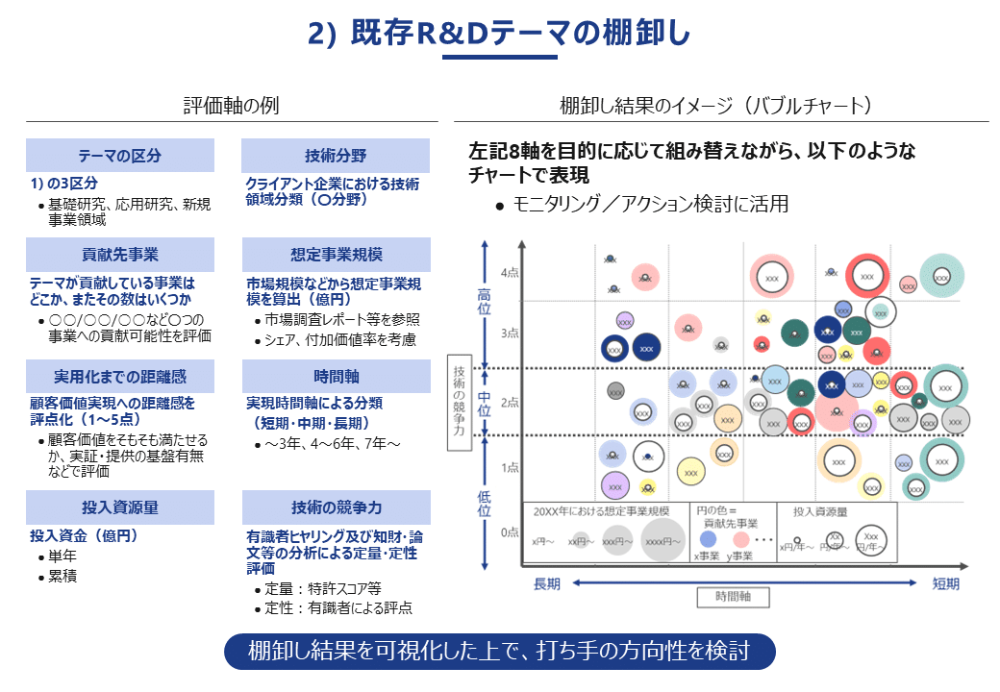
実際に評価に使った要素と評価を行った結果をまとめたスライドです。評価結果についてはバブルチャートで示しています。

こちらはプロジェクトの報告資料の中ではサマリースライドの位置づけで、中間報告などのキラーチャートになります。裏側に評価軸をより細分化して評価を行っているエクセルや、評価結果を表にまとめたスライドがあるのでしょう。

どの事業にどのくらい貢献する想定のR&Dテーマなのか、またそのテーマにいくら投入しているのかなどを一目でまとめたかなりビジーなスライドですが、**実務家からするとものすごく有益なスライド**であることは想像に難くありません。

### 投資ファンドの設立支援のスライド

ＪＩＣＡによるインパクト投資のエコシステム支援戦略の検討と、スタートアップ企業に対する実際の支援を通じた戦略のアップデートを行ったプロジェクトのスライドです。

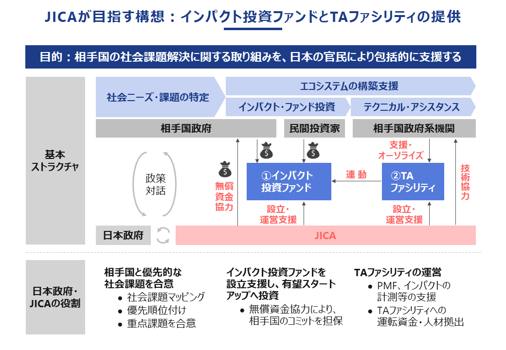
プロジェクト結果として定められたＪＩＣＡによるインパクト投資のエコシステム支援のあり方を整理したスライドです。

基本ストラクチャと日本政府やＪＩＣＡの役割を整理し、ＪＩＣＡがそのまま使っても全く違和感のないスライドとなっています。シンプルなエコシステム図です。

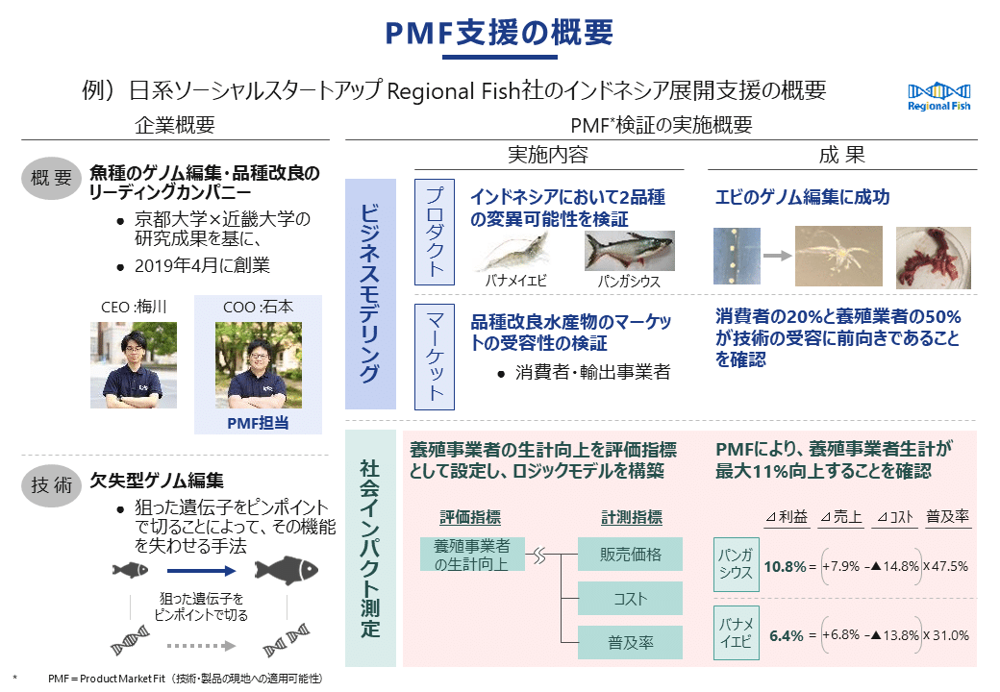
支援先の評価を行ったスライドです。リージョナルフィッシュ社のインドネシア展開支援の概要に関してまとめています。

こちらもメインであるＰＭＦ検証の実施内容に紙面を割くべく、支援先企業の概要はギュッと左に寄せて、紙面の３分の２近くを検証の仕方と検証結果に使っています。

ドリームインキュベータへの転職を検討されている方は[こちら](https://www.career-adv.jp/lp/casual/?utm_source=note&utm_medium=referral&utm_campaign=note_pp)から。

## 山田コンサルティンググループ株式会社の資料

続いて山田コンサルティンググループのパワポスライドです。
フィナンシャルプランニングからスタートした企業ですが、経営・財務・資金調達コンサルティングを立ち上げて参入し、現在では独立系経営コンサルティングファームの一角となっています。
**ＢＩＧ４はもちろん、戦略コンサルティングファームからの転職者も一定在籍するファーム**です。蛇足ですがレックスアドバイザーズも山田コンサルティンググループへの転職希望者のサポートは常に行っています。

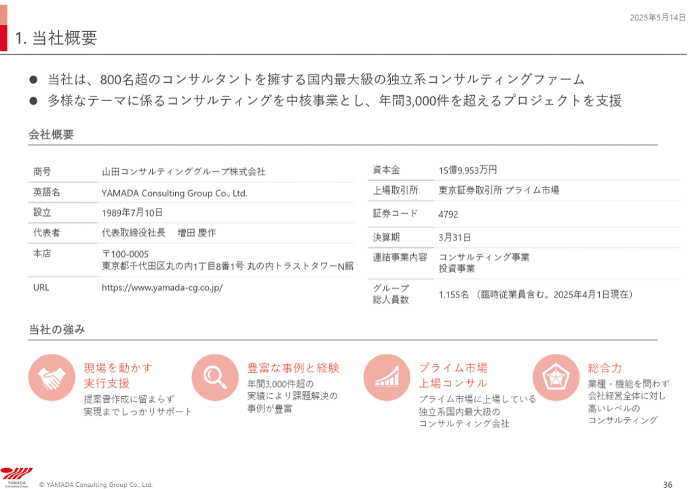
> 引用元：[> 2025年3月期 決算説明会動画](https://www.net-presentations.com/4792/20250514/fkcy437/)

*https://www.yamada-cg.co.jp/ir/library/briefing_session/*

パワポのスライドは経営ナレッジの[海外ビジネス動向](https://www.ycg-advisory.jp/learning/oversea/)のページから引用しているため、海外プロジェクトのものが中心ですがご了承ください。

### インド電動化市場に関するスライド

まずは「インド電動化市場の展望と、現調化を後押しするローカルパートナー像」のレポートを見てみましょう。山田コンサルティンググループというとドメスティックなイメージがあるかもしれませんが、グローバルファームからの転職者も多く、海外プロジェクトにも力を入れています。

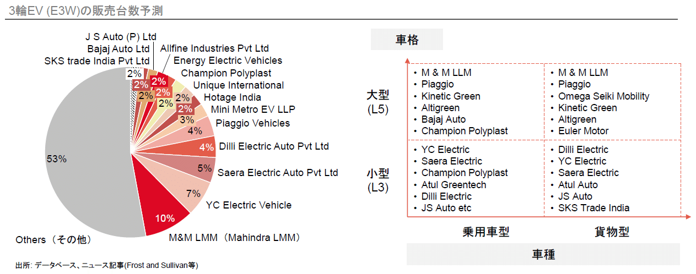
３輪ＥＶ （Ｅ３Ｗ）：主要ＯＥＭの顔触れのパートにある、販売台数予測のスライドです。台数ベースのブランド別シェアの円グラフと、各ブランドが車種と車格で見たときにどのカテゴリに属するかのマトリックスで示されています。

基礎情報をまとめたスライドではあるものの、おそらく**プロジェクトの提案書やキックオフで使われる基礎理解のスライド**から持ってきたものだと思われます。

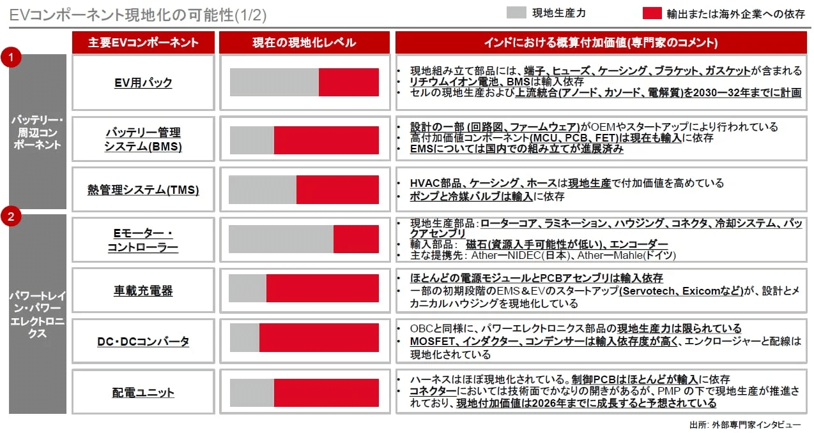
インドが現調化に苦慮している部品種別のパートにある、ＥＶの各コンポーネントの現地化状況をまとめたスライドです。専門家へのインタビューをもとに、ＥＶのコンポーネントの現地化状況を、現地化レベルと、その背景にある現地化と輸入の状況詳細についてまとめています。

これも恐らくプロジェクトのアウトプットをサニタイズしたものだと思われますが、**複数のインタビューとコンポーネント別の付加価値額をもとに現地化レベルを棒グラフでビジュアル化**しており、レベルの高いスライドといえます。

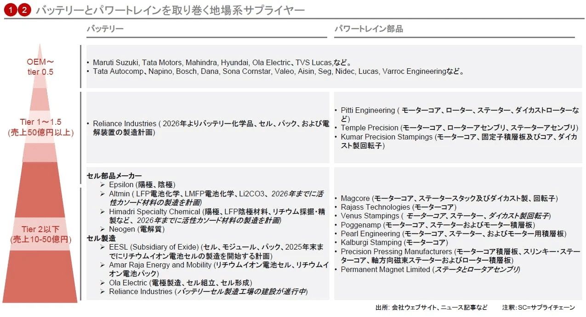
供給関係の俯瞰 ーバッテリー・パワトレ編のパートの、バッテリーとパワートレインに関する地場系サプライヤーの状況をまとめたスライドです。

地場サプライヤーをＴｉｅｒ別のピラミッド構造で整理したうえで、具体的にどの領域ができるのか、詳細に記載しており、デスクトップリサーチベースをはいえ気合の入ったスライドですね。

### タイの栄養補助食品市場のスライド

続いて「タイの栄養補助食品市場：成長と課題がもたらす新たなビジネスチャンス」のスライドを見てみましょう。
スライドタイトルは同じですが、ボディのタイトルの角が丸かったり、フォントが異なっていたり、微妙に先ほどの資料とトンマナが違います。この辺りは、**他ファームからの転職者が多い**ことも影響しているものと思われます。

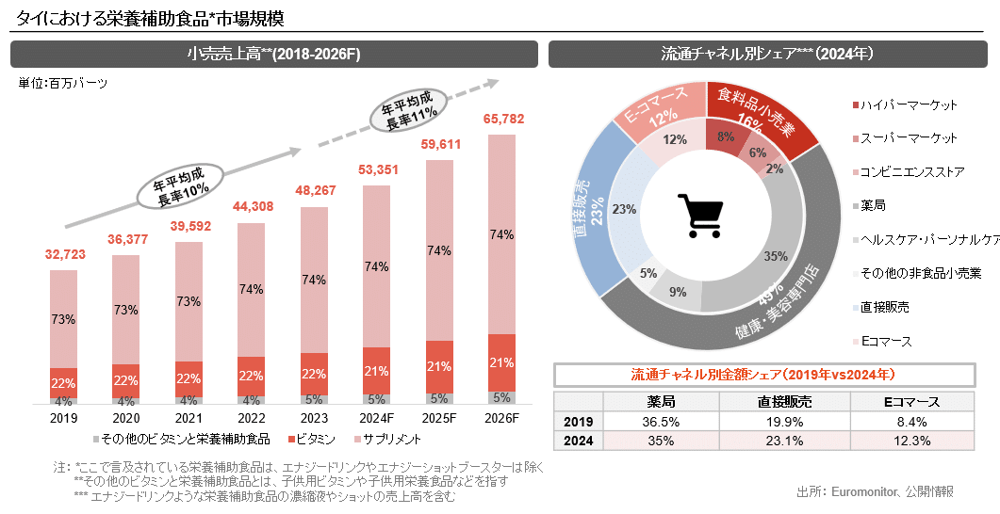
「市場の状況」のパートにある、タイの栄養補助食品市場の市場規模と内訳をまとめたスライドです。

市場を大きくサプリメント、ビタミン、その他ビタミンと栄養補助食品に分けたうえで、合計値のＣＡＧＲを取っているのは定番の棒グラフです。
**右のサンバーストグラフも、チャネルを大カテゴリと小カテゴリに分けたうえでそれぞれの割合が一目でわかる**ようになっており、見やすいスライドです。

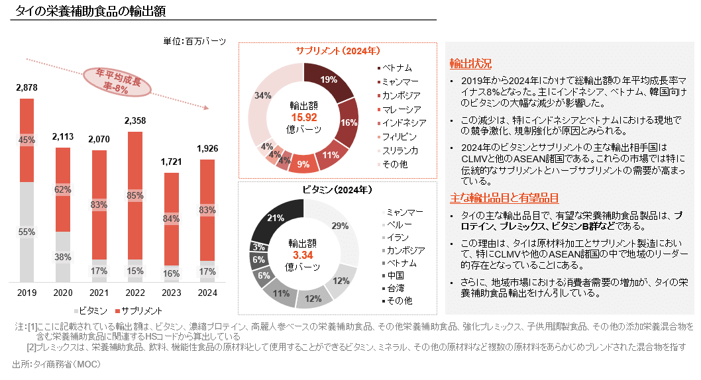
タイの栄養補助食品の輸出状況のパートにある、輸出額を整理したスライドです。輸出額をグラフでまとめた上で、右側にファインディングスや補足情報が整理されています。

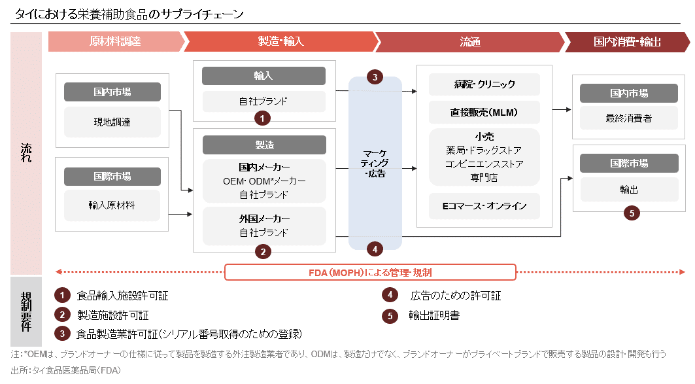
タイにおける栄養補助食品のサプライチェーンのパートにある、サプライチェーン図のスライドです。

恐らくプロジェクトのアウトプットから転用してきたスライドですが、**タイで栄養食品ビジネスを行う上で一番最初に必要となる情報**であり、プロジェクトの中でも重要な一枚と想定されますね。

### 海外の医療ツーリズム動向のスライド

最後に海外の医療ツーリズム情報をまとめた資料のスライドを見ていきましょう。東南アジアの医療に関して、価格競争力や医療施設とサービスの質、病院数等についてまとめています。

こちらの資料もボディタイトルが赤文字になるなど、また少しトンマナが異なっています。もちろん色遣いなどは統一されていますが、スライドタイトルもこれまでとは異なりヘッダーのようになっています。

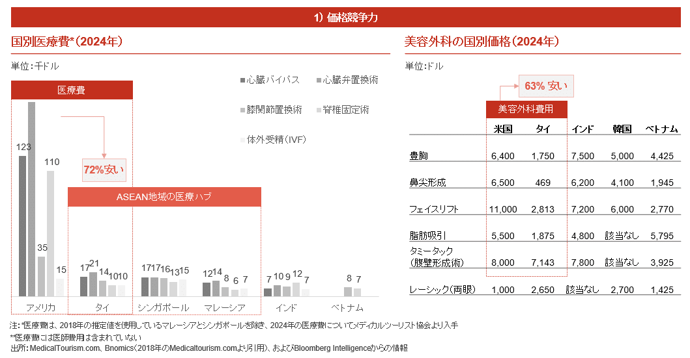
タイの競争優位性のパートにある、価格競争力のスライドです。国別の医療費と、美容外科の国別価格が記載されています。

棒グラフに対して、アメリカとタイの医療費を一つのグループに、ＡＳＥＡＮの医療費を一つのグループにするという珍しい構造を取っています。
右側の表を見ればアメリカからＡＳＥＡＮに医療ツーリズムが来る理由が一目瞭然ですね。

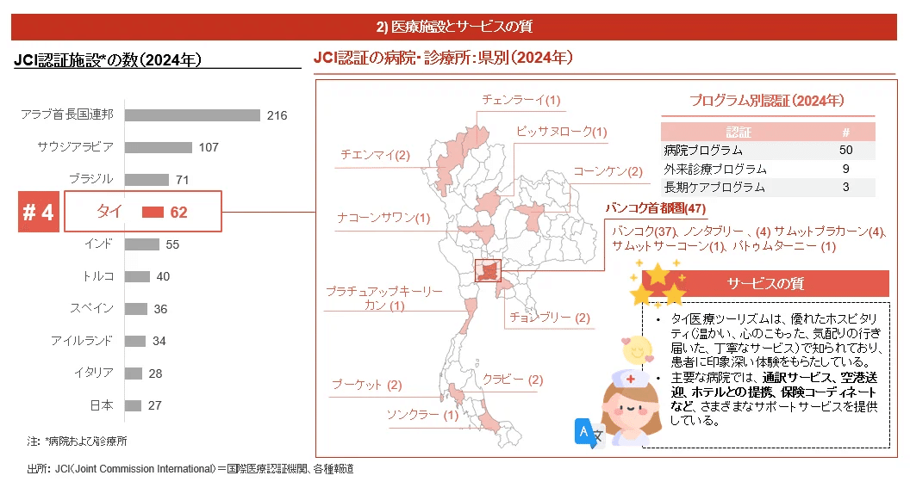
同じパートの、医療施設とサービスの質のスライドです。右の地図を使ったビジュアルが非常にインパクトがあるので、右側の棒グラフは左側にギュッと詰めてあります。

地図を使って説明するスライドはよくありますが、**タイともなると全く想像もつかないため、地図を使ってビジュアルで見せてくれる**のはありがたく、インパクトがありますね。コンサルスライドにしては珍しく、かわいいイラストもついています。

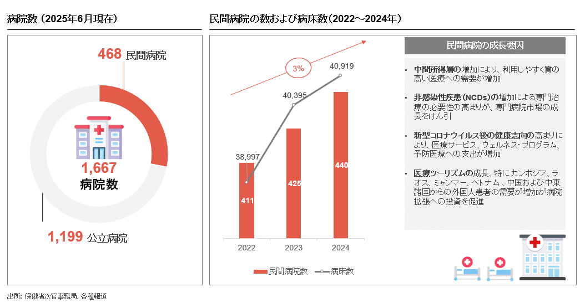
業界の動向と展望のパートにある、医療施設の定量情報です。病院数と民間病院の病床数、民間病院が増加している理由についてまとめています。

なおレックスアドバイザーズでは、**山田コンサルティンググループへの転職支援実績が多数**あります。山田グループへの転職を検討されている方は[こちら](https://www.career-adv.jp/lp/casual/?utm_source=note&utm_medium=referral&utm_campaign=note_pp)から無料転職サポートに申し込んでみてくださいね。

## フロンティア・マネジメント株式会社の資料

最後にフロンティア・マネジメント（ＦＭＩ）のパワーポイント資料を見ていきましょう！フロンティア・マネジメントについてはクライアント向けの資料は見当たらなかったものの、自社の中期経営計画がかなりコンサルティングチックな資料なので、そちらを紹介していきます。

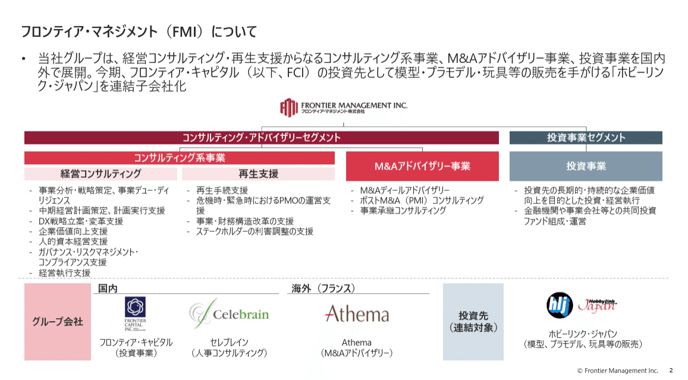
> 引用元：[> 2025年12月期第2四半期決算説明資料](https://contents.xj-storage.jp/xcontents/AS71152/16942e70/db5f/4f85/a52e/1de334e7665c/140120250812539984.pdf)

*https://www.frontier-mgmt.com/ir/news/*

### 市場理解のスライド

まずはプレゼンテーション全体の前段にあたる、市場環境をまとめたスライドから見ていきましょう。日本企業が世界の中でどのような位置づけになっているのかをまとめています。

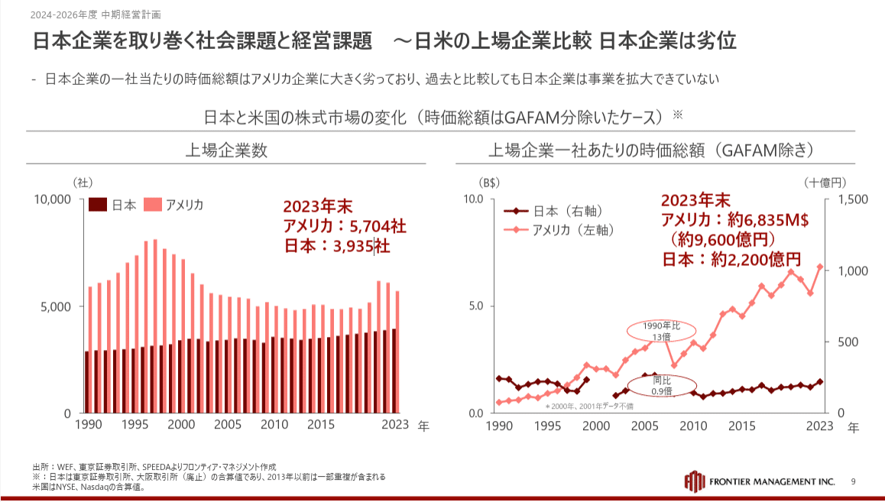
日本と米国の株式市場の変化を、棒グラフと折れ線グラフで見ています。

**上部タイトルに若干メッセージが入っているのが特徴的**ですが、タイトル下にスライドのサマリーもあります。逆に上場企業数の変化と時価総額の変化そのもののグラフに対しては、特にテキストによるサマリーはありません。

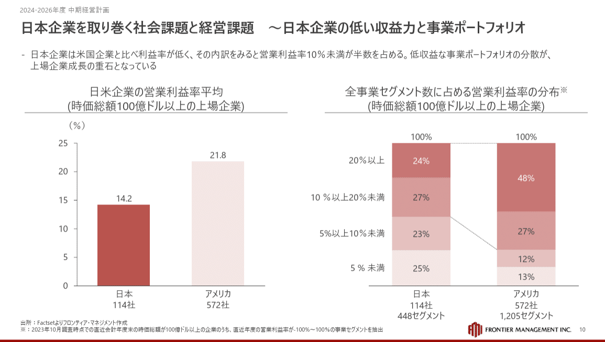
日本と米国の企業における営業利益率の違いを棒グラフや１００％棒グラフで見せています。シンプルな棒グラフですが、数字のインパクトが強いので、逆に余計なものを足していません。

### サービスラインに関するスライド

続いてサービスラインに関するスライドを見ていきましょう。どのようなサービスラインがあるのかを、様々な角度から紹介しています。

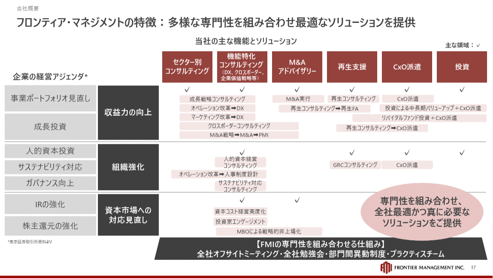
企業の経営アジェンダと、ＦＭＩの主な機能のマトリックス表に、提供できるサービスをプロットしています。経営アジェンダについては、先に大カテゴリを持って来たくなるものですが、**企業目線に立つと具体な悩みが先にある方が頭に入りやすい**ので、こうした構造になっていると思われます。

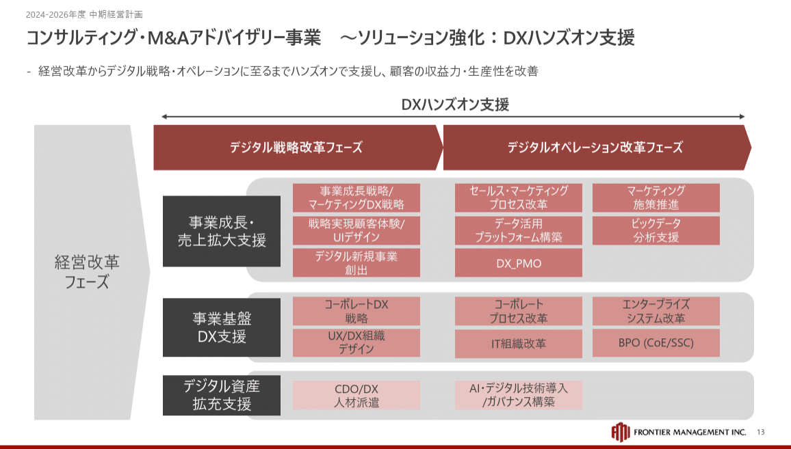
コンサルティング・Ｍ＆Ａアドバイザー部門のＤＸにおけるハンズオン支援のサービスラインを整理したスライドです。
戦略策定フェーズと実行支援フェーズでどのようなサポートが可能のなのかを、事業成長支援、DX支援、デジタル試算拡充支援の３つのカテゴリでまとめています。

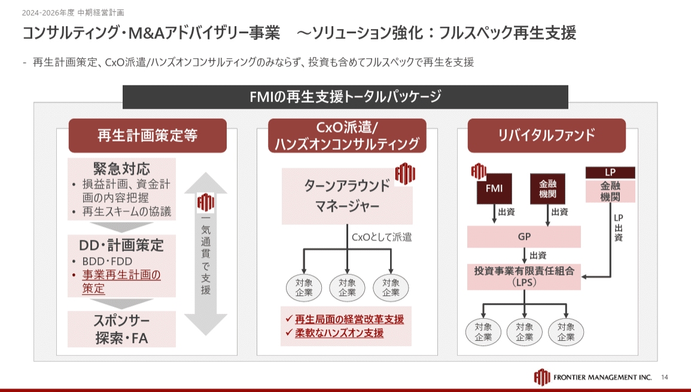
同じくコンサルティング・Ｍ＆Ａアドバイザー部門のＤＸにおけるフルスペック再生支援のサービスラインを整理したスライドです。
こちらは先ほどのようなプロットではなく具体的にどのようなサービスを行うのか、イメージ図で示しています。ロゴを使うことでＦＭＩの支援の形がわかりやすいようになっています。

### 成長戦略のスライド

フロンティア・マネジメントの成長戦略についてまとめたスライドです。
戦略イメージに加え、ポートフォリオ、数値目標のスライドなどがあります。

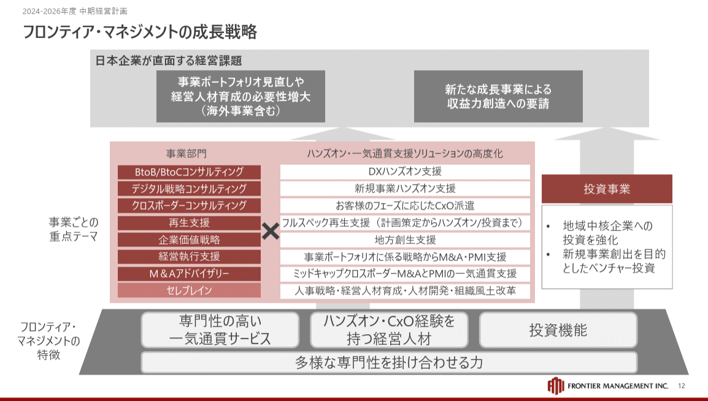
日本企業の経営課題に対し、フロンティア・マネジメントが何を武器にしてサービスを提供するのか、どのようなサービスを提供するのかをコンセプト図で見せています。コンセプト図といってもかなりテキストが多いです。

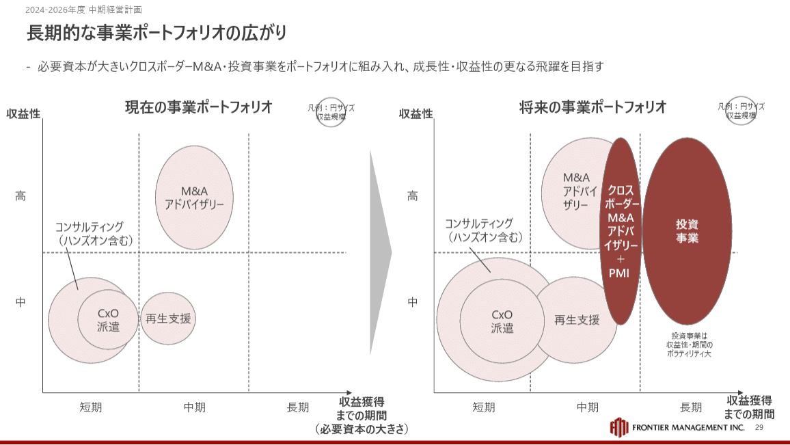
事業ポートフォリオをどのように成長させていくかをまとめたスライドです。今ある領域の円を拡大しつつ、投資事業などの新しい領域を育成していくことを見せています。

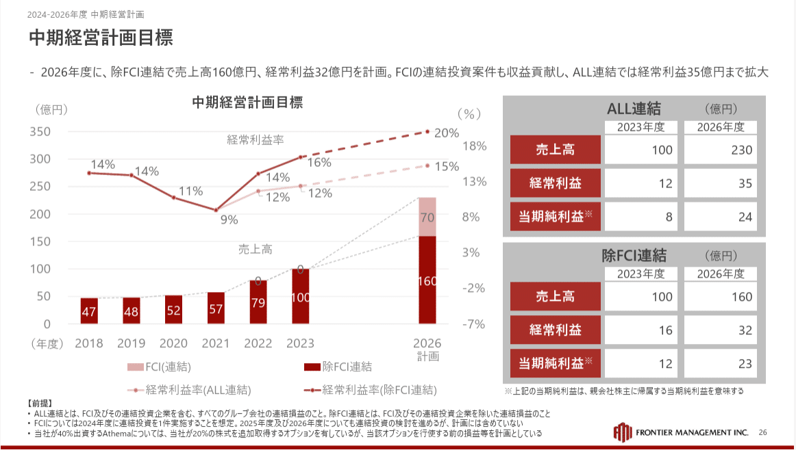
最後に数値目標のスライドです。こちらはコンサルティングプロジェクトのものというよりはIR的な色合いの強いスライドですが、連結と単体でどのような未来を描くのか、描き分けていますね。

フロンティア・マネジメントやフロンティア・キャピタルへの転職を検討されている方は[こちら](https://www.career-adv.jp/lp/casual/?utm_source=note&utm_medium=referral&utm_campaign=note_pp)から。

## 経営コンサルへの転職を考えている方へ

パワポ研は株式会社レックスアドバイザーズが運営しています。
**レックスアドバイザーズは会計ファームを中心に経営コンサルティング会社への転職支援に強みを持つ転職エージェント**です。山田コンサルティンググループなど、会計系の経営コンサルティングファームへの転職を考えている方は、[無料相談フォーム](https://www.career-adv.jp/job_search/entryform_exp/?utm_source=note&utm_medium=referral&utm_campaign=note_pp)から相談してみてくださいね。

*レックスアドバイザーズのサービスサイトはこちら*

## パワポ研オリジナルテンプレート

パワポ研では「ビジネスシーンで使える」パワーポイントテンプレートを公開しております。デザインを整えるのみならず、**ロジックやストーリーを整理するのにも役立つパッケージになっております**ので、関心のある方は下記ページも併せてご覧ください！

またパワポ研では、上記の記事のように、noteでは**フォローしているだけでビジネスにおける「資料作成のコツ」と「デザインのセンス」が身に付くアカウント**を目指して情報配信を行っています。
今後もコンスタントに記事を配信していく予定なので、関心のある方は是非アカウントのフォローをお願いします！

**> Template販売　**[> https://powerpointjp.stores.jp/](https://powerpointjp.stores.jp/%EF%BF%BCnote)
**> note　**[> パワポ研の資料作成術](https://note.com/powerpoint_jp/m/mc291407396da)
**> X（旧Twitter)　**[> https://twitter.com/powerpoint_jp](https://twitter.com/powerpoint_jp)
**> その他　**[> お問い合わせフォーム](https://www.rex-adv.co.jp/contact)
**> 書籍　**[> 注目企業の実例から学ぶパワポ作成術](https://www.amazon.co.jp/dp/4046060476)

