# 【パワポ研厳選】経産省のわかりやすい「委託調査報告書」２０選 （2026年更新）

[note原文](https://note.com/powerpoint_jp/n/n5fe611924a90)

みなさんこんにちは。
資料デザインのリサーチや分析に取り組むパワーポイントのスペシャリスト、パワポ研です。

以前、経産省の委託調査報告書は極上パワポの宝庫であり、参照にすべきというNoteを書きました。

- 経済産業省の「委託調査報告書」ページには国の委託事業に関する報告資料が**大量にアップ**されている

- その多くは大手のコンサルティングファームが手間暇かけて作ったものなので、参考にしたい**パワポ資料の宝庫**となっている

そこで今回は、具体的にどの報告書が特に参考になりそうかという目線で２０社のパワポを紹介していきたいと思います。
コンサルティングファームばかりでは面白くないので、デザイン会社の報告書や、テクノロジー企業の報告書、リサーチ・メディア企業の報告書など、様々な業界のパワーポイントを取り上げています。
コンサルティングファームやシンクタンクのスライドをとにかく見たいという方は下記のNoteをご覧ください。

では早速行きましょう！

## パワポの活動報告プレゼン資料例５選

### 株式会社博報堂の活動報告書

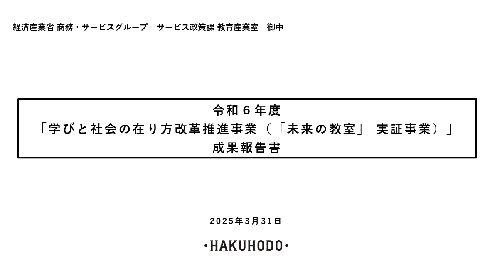
*博報堂の活動報告書の表紙スライド*

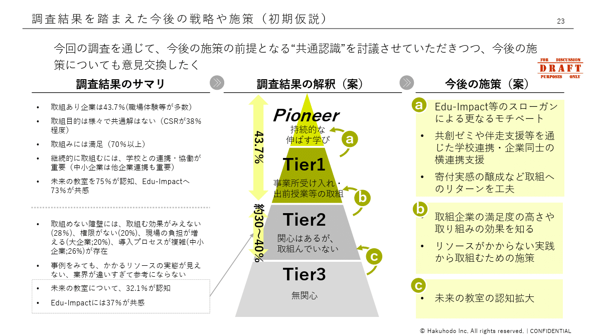
*博報堂の活動報告書のピラミッド図スライド*

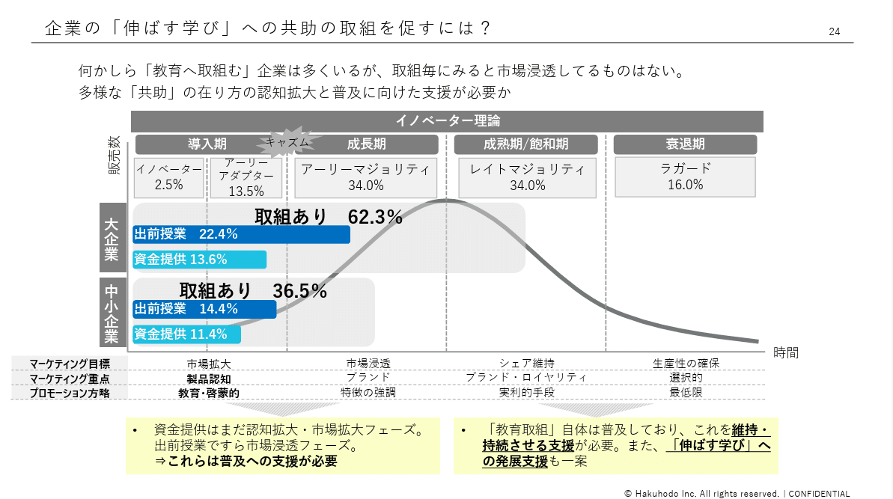
*博報堂の活動報告書のグラフ図スライド*

> 引用元：[> 令和６年度「学びと社会の在り方改革推進事業（「未来の教室」 実証事業）」成果報告書](https://www.meti.go.jp/meti_lib/report/2024FY/000281.pdf)

*https://www.meti.go.jp/meti_lib/report/2024FY/itakuichiran2024FY.pdf*

言わずと知れた広告最大手の博報堂の成果報告プレゼン資料です。博報堂の活動報告書はなかなか出てこないので、非常に珍しいパワポスライドです。

### 株式会社ロフトワークの活動報告書

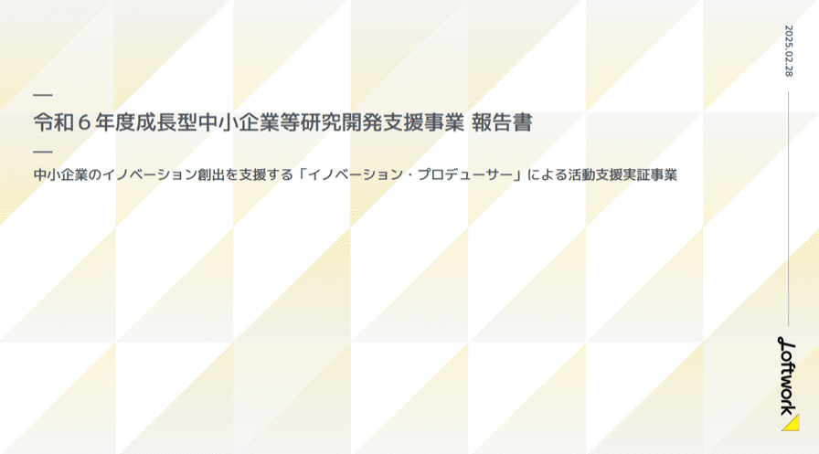
*ロフトワークの活動報告書の表紙スライド*

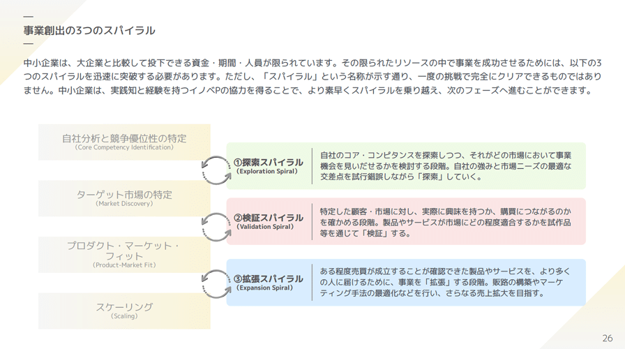
*ロフトワークの活動報告書のまとめスライド*

> 引用元：[> 令和6年度原子力国民理解促進広聴・広報事業(地域将来ビジョン調査・広報事業)報告書](https://www.meti.go.jp/meti_lib/report/2024FY/000360.pdf)

*https://www.meti.go.jp/meti_lib/report/2024FY/itakuichiran2024FY.pdf*

オープンコラボレーションを通じてWeb、コンテンツ、コミュニケーション、空間などをデザインするクリエイティブ・カンパニーの、ロフトワークの活動報告プレゼン資料です。クリエイティブカンパニーらしく、デザインが美しいパワポスライドですね。

### ダイナミックマッププラットフォーム株式会社の活動報告書

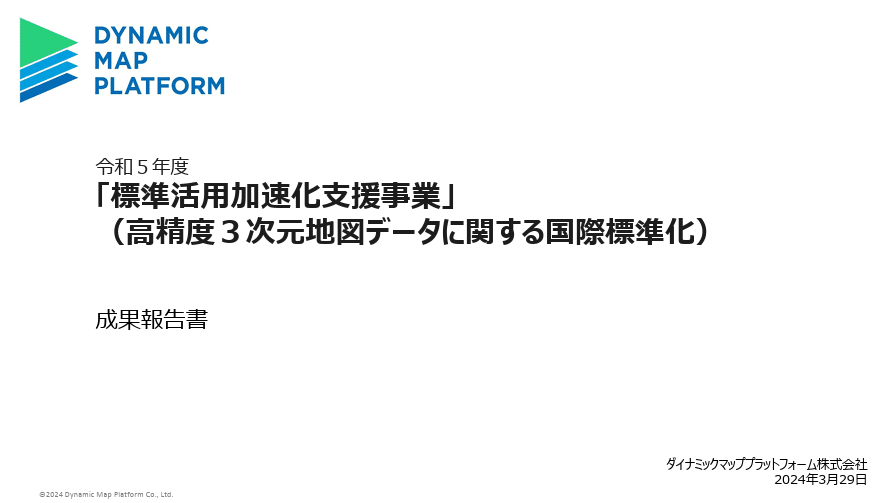
*ダイナミックマッププラットフォームの活動報告書の表紙スライド*

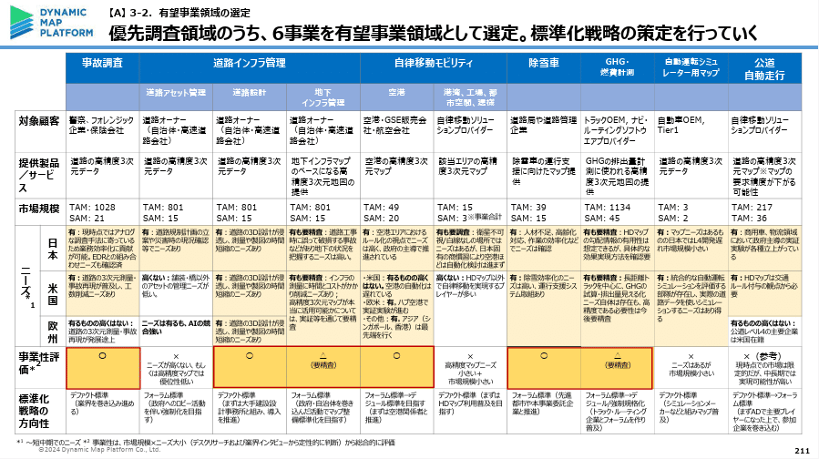
*ダイナミックマッププラットフォームの活動報告書の対象スライド*

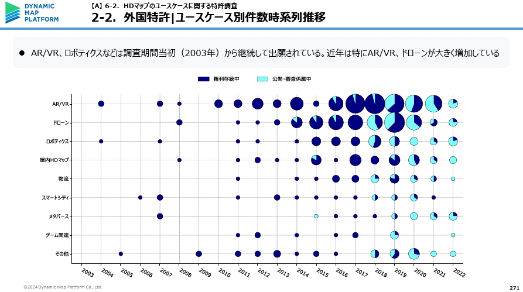
*ダイナミックマッププラットフォームの活動報告書の分析スライド*

> 引用元：[> 令和５年度「標準活用加速化支援事業（高精度３次元地図データに関する国際標準化）」報告書](https://www.meti.go.jp/meti_lib/report/2023FY/000616.pdf)

*https://www.meti.go.jp/meti_lib/report/2023FY/itakuichiran2023FY.pdf*

自動運転に利用されるHD MAPを提供するダイナミックマッププラットフォームの活動報告書プレゼン資料です。ダイナミックマッププラットフォームは日本の自動車OEMの共同出資で立ち上げられた会社のため、データが非常に豊富で、様々な分析が見られるパワポスライドとなっています。

### Xspear Consulting株式会社の活動報告書

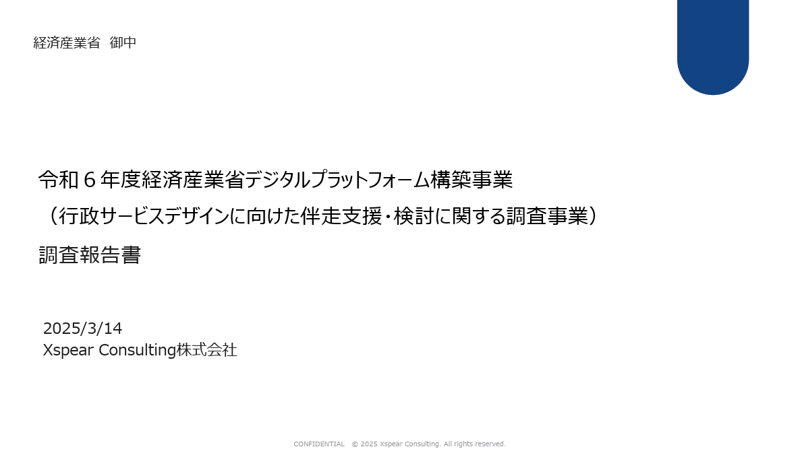
*Xspear Consultingの活動報告書の表紙スライド*

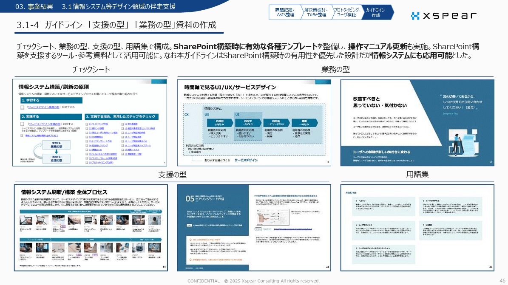
*Xspear Consultingの活動報告書の作成資料スライド*

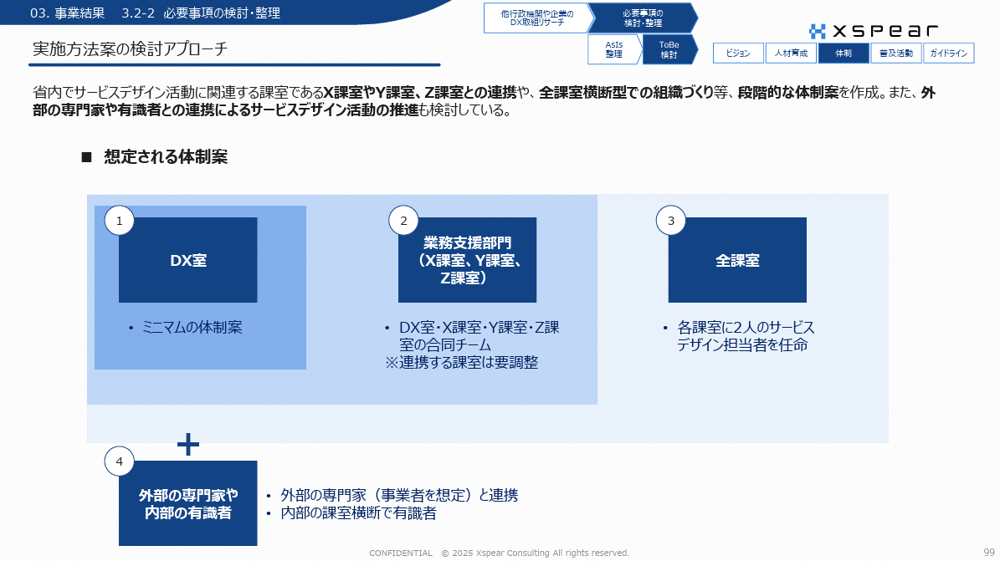
*Xspear Consultingの活動報告書の検討アプローチスライド*

> 引用元：[> 令和６年度経済産業省デジタルプラットフォーム構築事業（行政サービスデザインに向けた伴走支援・検討に関する調査事業）調査報告書](https://www.meti.go.jp/meti_lib/report/2024FY/000072.pdf)

*https://www.meti.go.jp/meti_lib/report/2024FY/itakuichiran2024FY.pdf*

東証プライム上場のシンプレクスホールディングスのDXコンサルティングを担っているXspearの活動報告プレゼン資料です。図や表が中心のかっちりしたパワポスライドが多いです。

### W Partners法律事務所の活動報告書

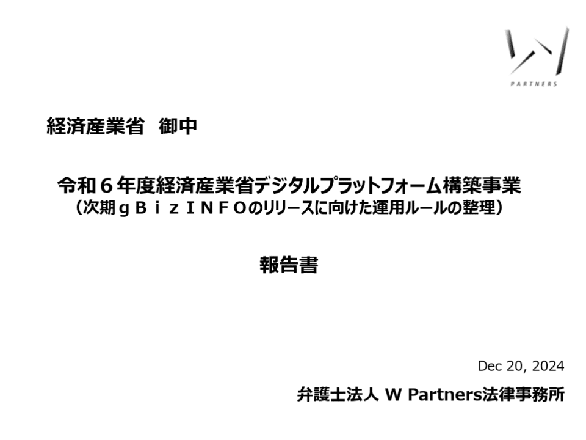
*W Partners法律事務所の活動報告書の表紙スライド*

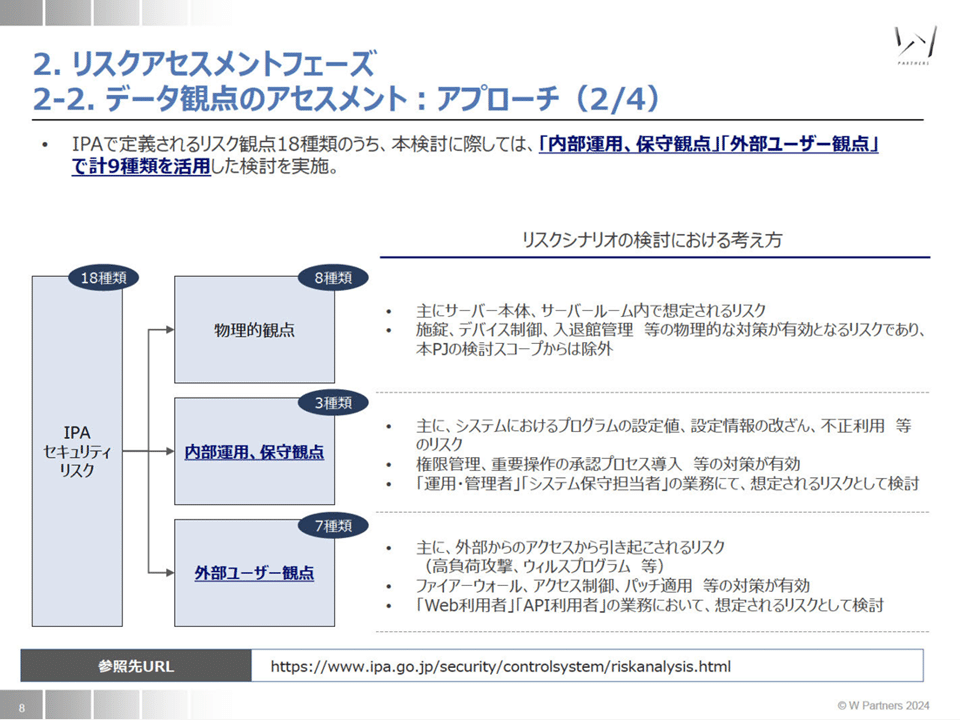
*W Partners法律事務所の活動報告書の表スライド*

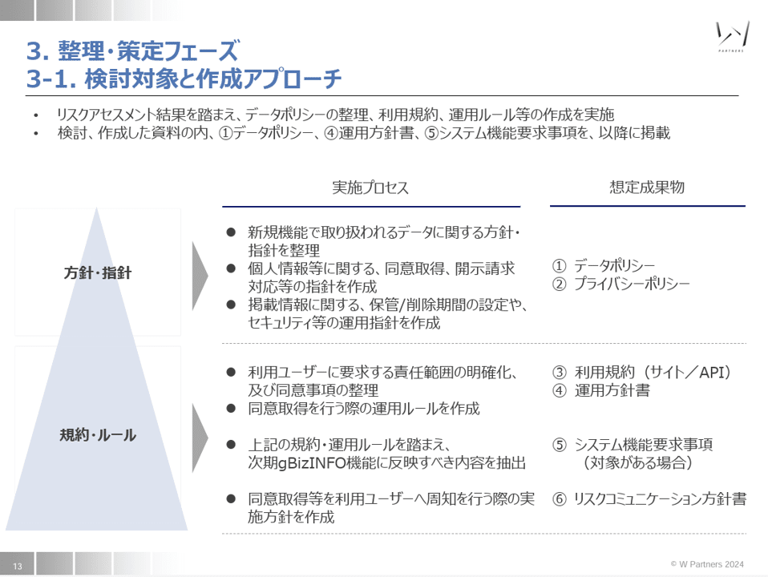
*W Partners法律事務所の活動報告書のピラミッド図スライド*

> 引用元：[> 令和６年度経済産業省デジタルプラットフォーム構築事業（次期ｇＢｉｚＩＮＦＯのリリースに向けた運用ルールの整理）報告書](https://www.meti.go.jp/meti_lib/report/2024FY/000460.pdf)

*https://www.meti.go.jp/meti_lib/report/2024FY/itakuichiran2024FY.pdf*

企業法務や戦略法務がメインの弁護士法人W Partnersの活動報告スライド資料です。弁護士法人のパワポスライドはあまりお目にかかれないので、一度見てみると面白いかなと思います。

## パワポの成果報告プレゼン資料例５選

### 株式会社ビオトープの成果報告書

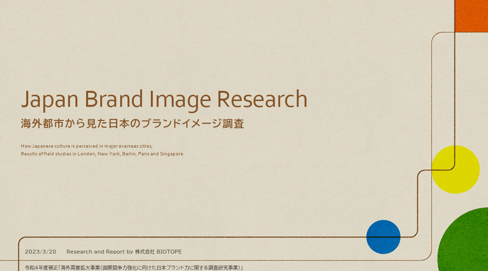
*株式会社ビオトープの成果報告書の表紙スライド*

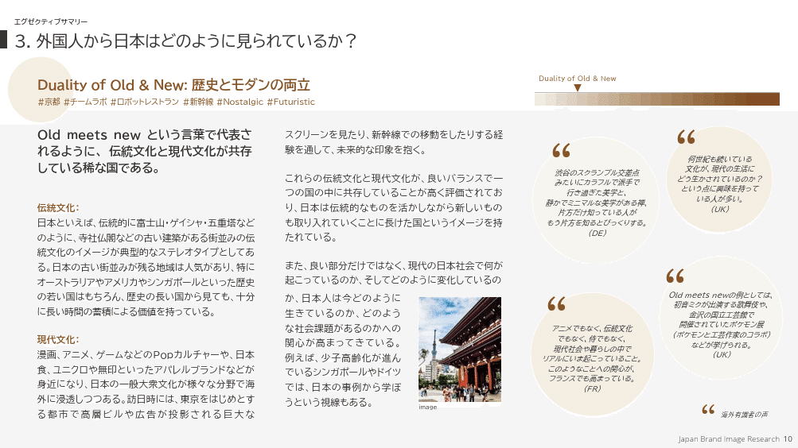
*株式会社ビオトープの成果報告書のテキストスライド*

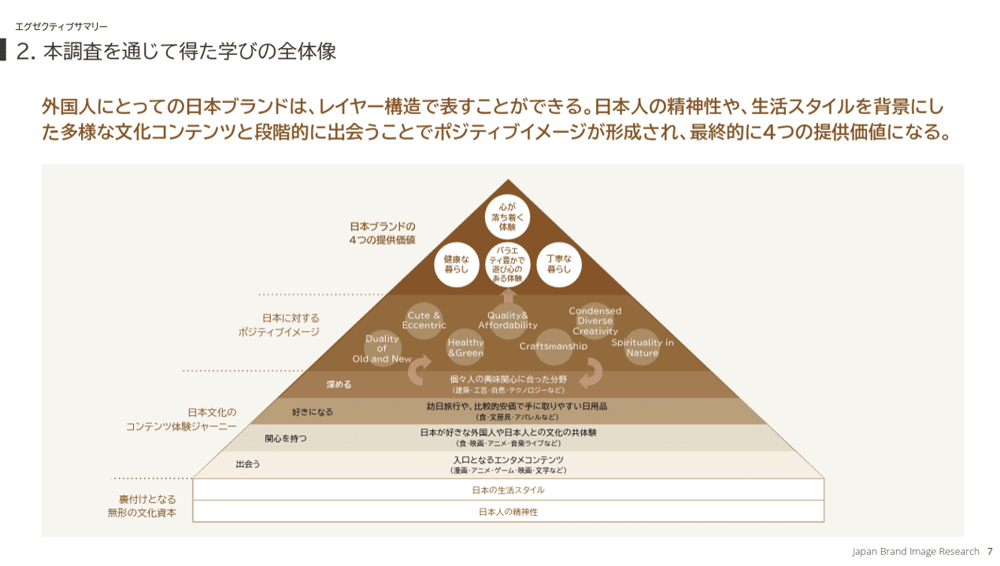
*株式会社ビオトープの成果報告書のピラミッド図スライド*

> 引用元：[> Japan Brand Image Research海外都市から見た日本のブランドイメージ調査](https://www.meti.go.jp/meti_lib/report/2022FY/000693-2.pdf)

*https://www.meti.go.jp/meti_lib/report/2022FY/itakuichiran2022FY.pdf*

組織と個人の物語を引き出すことで新しいビジョンを創造し、組織に実装し、社会に伝播させていく「共創型戦略デザインファーム」BIOTOPEの成果報告書です。自分たちが信じる世界や、自分たちらしい思想を軸とし、独自の価値を生み出し、確かな未来へと結実させることを掲げているデザインファームということもあって、非常におしゃれなパワポスライドです。

### ソラミツ株式会社の成果報告書

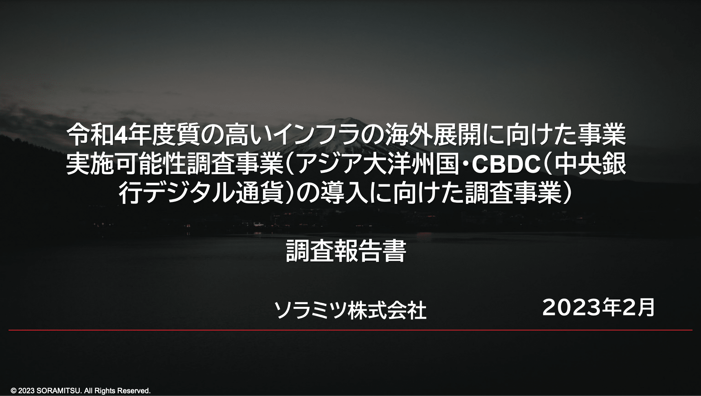
*ソラミツ株式会社の成果報告書の表紙スライド*

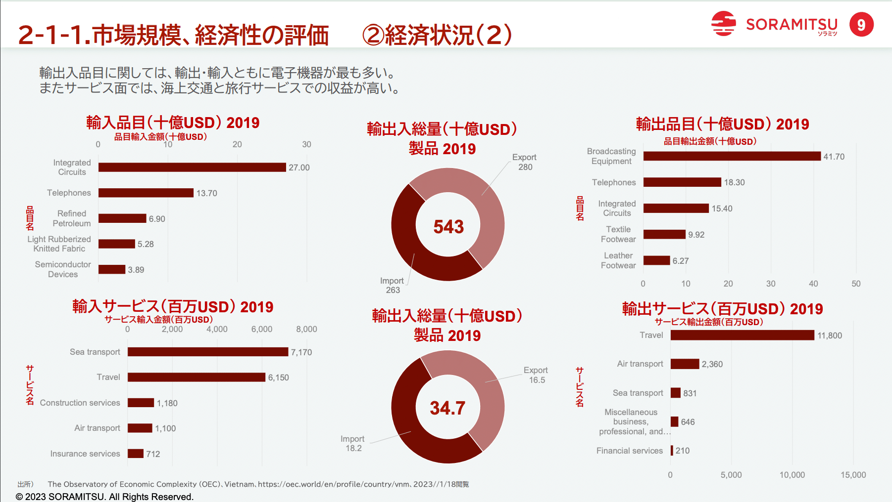
*ソラミツ株式会社の成果報告書のグラフスライド*

> 引用元：[> 令和4年度質の高いインフラの海外展開に向けた事業 実施可能性調査事業](https://www.meti.go.jp/meti_lib/report/2022FY/000311.pdf)

*https://www.meti.go.jp/meti_lib/report/2022FY/itakuichiran2022FY.pdf*

企業や大学、政府向けにブロックチェーンをベースにしたソリューションを提供する、グローバルテクノロジーカンパニーのソラミツの成果報告書です。グローバルカンパニーということもあって、各国の市場性を定量定性の両面から分析したパワポスライドとなっています。

### 株式会社オウルズコンサルティンググループの成果報告書

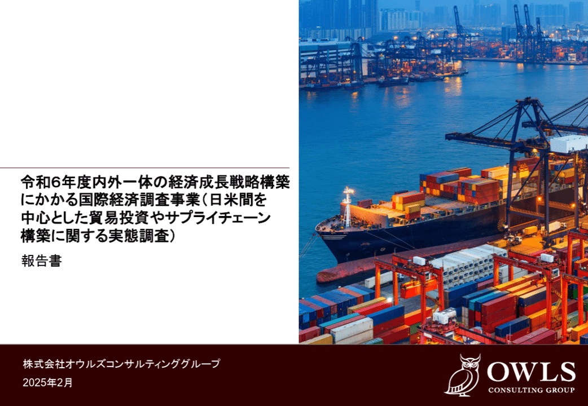
*株式会社オウルズコンサルティンググループの成果報告書の表紙スライド*

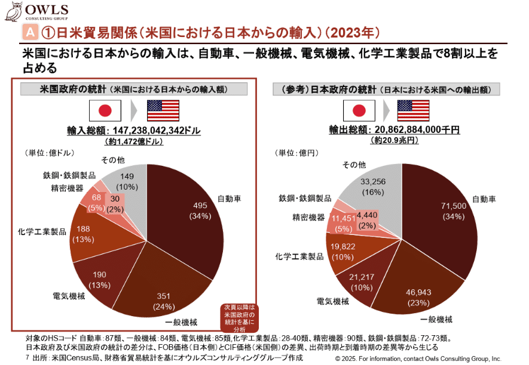
*オウルズコンサルティンググループの成果報告書のグラフスライド*

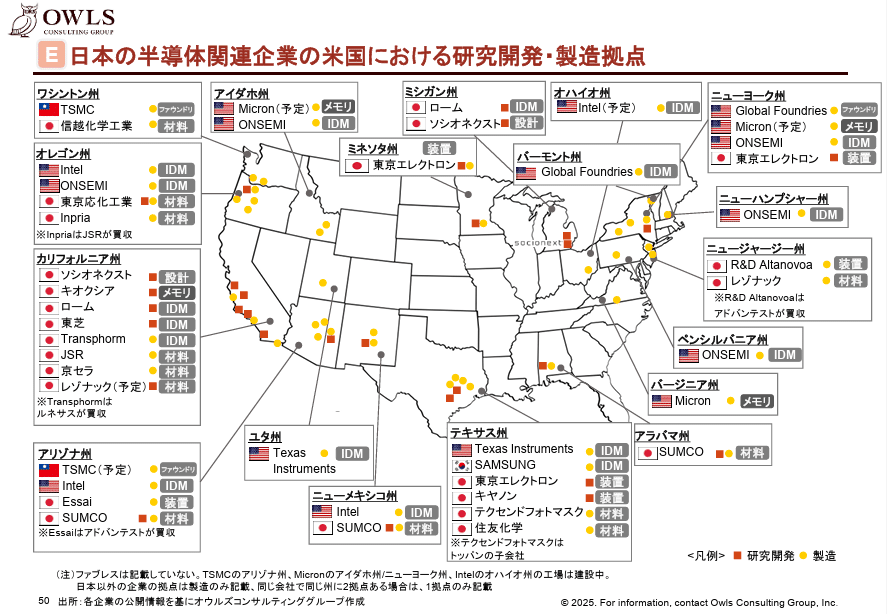
*オウルズコンサルティンググループの成果報告書の地図スライド*

> 引用元：[> 令和6年度内外一体の経済成長戦略構築にかかる国際経済調査事業（日米間を中心とした貿易投資やサプライチェーン構築に関する実態調査）報告書](https://www.meti.go.jp/meti_lib/report/2024FY/1000089.pdf)

*https://www.meti.go.jp/meti_lib/report/2024FY/itakuichiran2024FY.pdf*

社会課題解決に軸足を置き、ルールメイキングなどに強いコンサルティングファームのオウルズコンサルティングの成果報告書です。
代表がA. T. カーニーからデロイトトーマツコンサルティングという経歴で、メンバーもコンサルティングファーム出身者で構成されているため、パワポスライドのクオリティも高いです。

### 株式会社ユーザベースの成果報告書

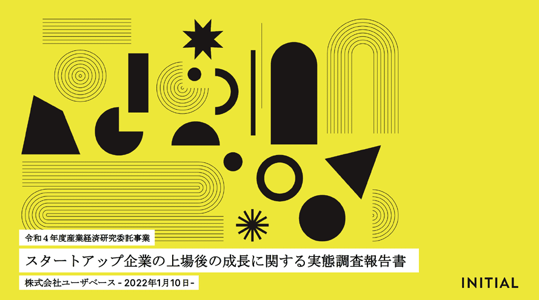
*株式会社ユーザベースの成果報告書の表紙スライド*

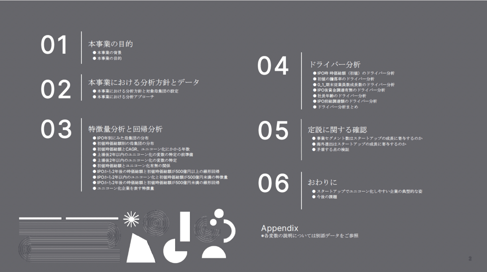
*株式会社ユーザベースの成果報告書の目次スライド*

> 引用元：[> 令和４年度産業経済研究委託事業 スタートアップ企業の上場後の成長に関する実態調査報告書](https://www.meti.go.jp/meti_lib/report/2022FY/000586.pdf)

*https://www.meti.go.jp/meti_lib/report/2022FY/itakuichiran2022FY.pdf*

SPEEDAを展開しているユーザベースの成果報告書です。様々なレイアウトのパワポスライドがあって参考になるのと、独特なデザインのディバイダーがいいですね。

### 株式会社テクノバの成果報告書

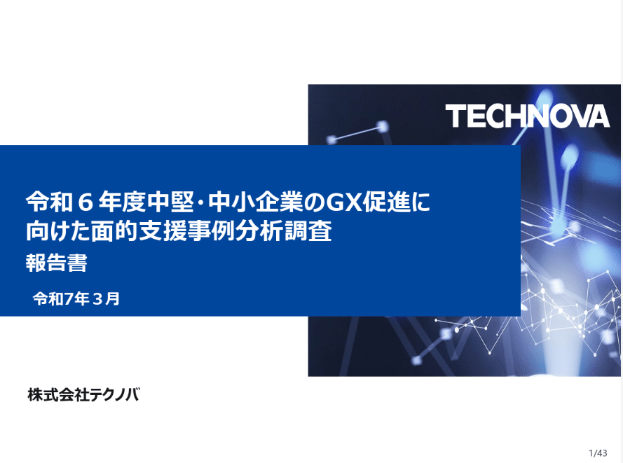
*株式会社テクノバの成果報告書の表紙スライド*

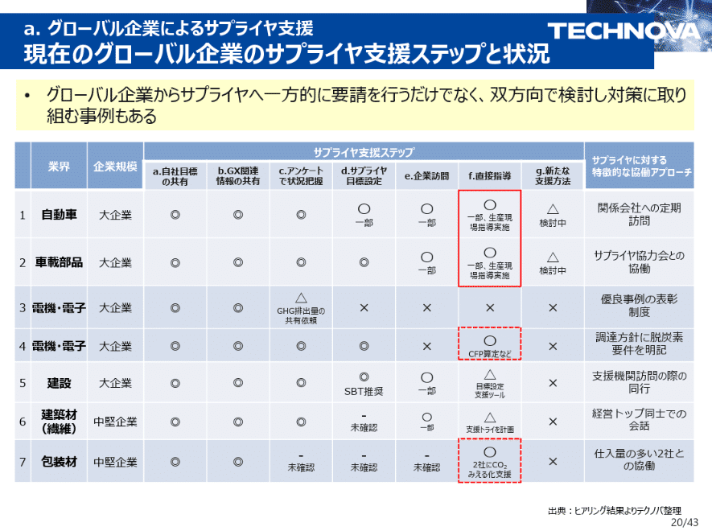
*株式会社テクノバの成果報告書の表スライド*

> 引用元：[> 令和６年度中堅・中小企業のGX促進に向けた面的支援事例分析調査](https://www.meti.go.jp/meti_lib/report/2024FY/000205.pdf)

*https://www.meti.go.jp/meti_lib/report/2024FY/itakuichiran2024FY.pdf*

アイシン系の技術シンクタンクとして、エネルギー・環境、交通、および先進技術を対象とする調査、コンサルティング、ならびにプロモーションを提供するテクノバの成果報告書です。
技術系シンクタンクということで、情報リッチな資料を表形式で見せるパワポスライドがわかりやすいですね。

## パワポの進捗報告プレゼン資料例５選

### 株式会社シグマクシスの進捗報告書

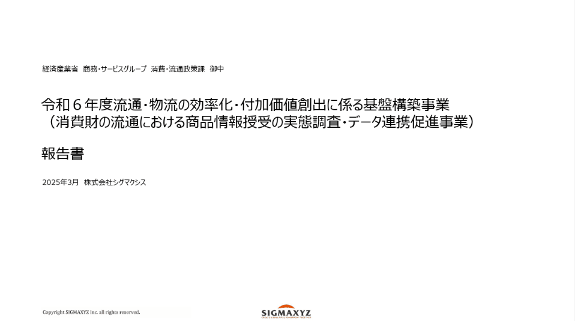
*株式会社シグマクシスの成果報告書の表紙スライド*

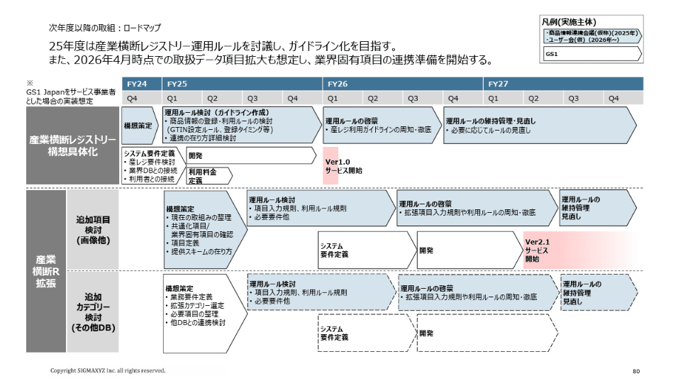
*株式会社シグマクシスの成果報告書のロードマップスライド*

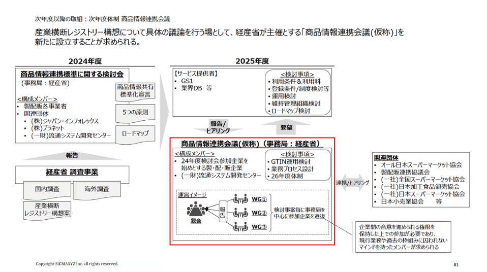
*株式会社シグマクシスの成果報告書の進捗スライド*

> 引用元：[> 令和６年度流通・物流の効率化・付加価値創出に係る基盤構築事業（消費財の流通における商品情報授受の実態調査・データ連携促進事業）](https://www.meti.go.jp/meti_lib/report/2024FY/000354.pdf)

*https://www.meti.go.jp/meti_lib/report/2024FY/itakuichiran2024FY.pdf*

上場コンサルティングファームのシグマクシスの進捗報告書です。大株主に伊藤忠商事やインターネットイニシアティブやインテックといった大手企業がいます。ガイドライン化のロードマップと進捗を含むパワポスライドです。

### アルファドライブ株式会社の進捗報告書

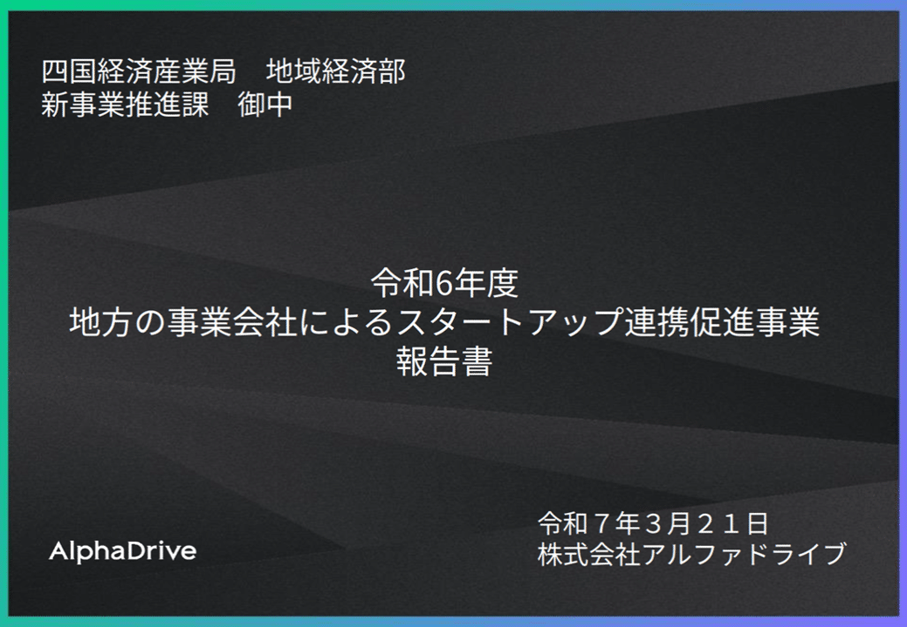
*株式会社アルファドライブの成果報告書の表紙スライド*

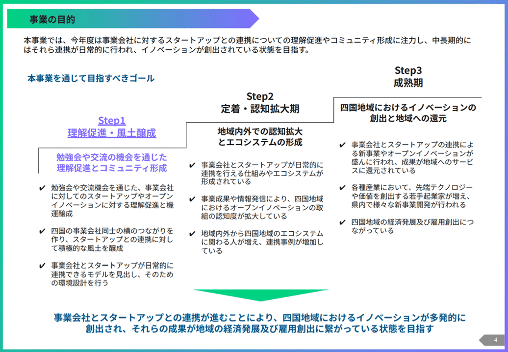
*株式会社アルファドライブの成果報告書のロードマップスライド*

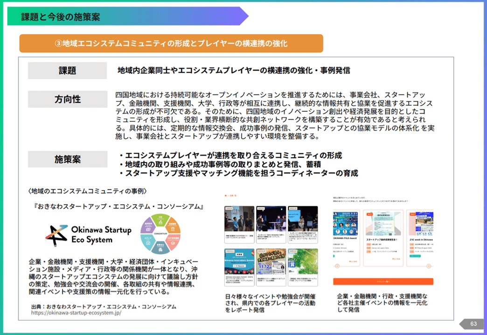
*株式会社アルファドライブの成果報告書の進捗スライド*

> 引用元：[> 令和6年度地方の事業会社によるスタートアップ連携促進事業報告書](https://www.meti.go.jp/meti_lib/report/2024FY/000047.pdf)

*https://www.meti.go.jp/meti_lib/report/2024FY/itakuichiran2024FY.pdf*

さまざまな企業や組織に向けた新規事業開発の伴走支援を提供しているアルファドライブの進捗報告書です。様々な新規事業の進捗を見せる事例系のパワポスライドに加え、アンケート結果のパワポスライドも入っています。

### リバネス株式会社の進捗報告書

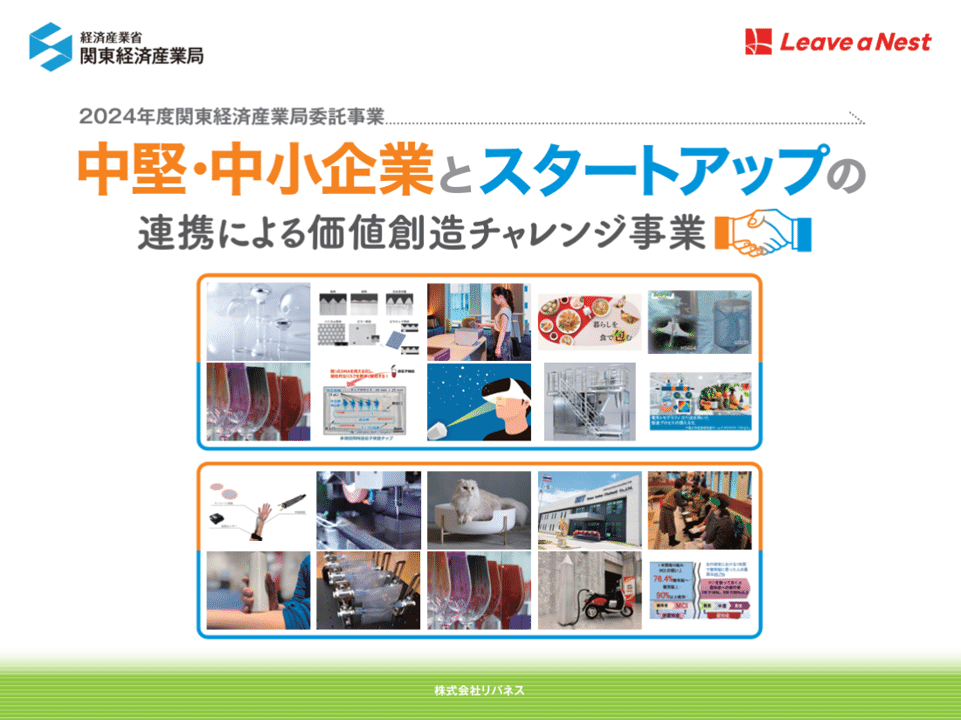
*リバネス株式会社の成果報告書の表紙スライド*

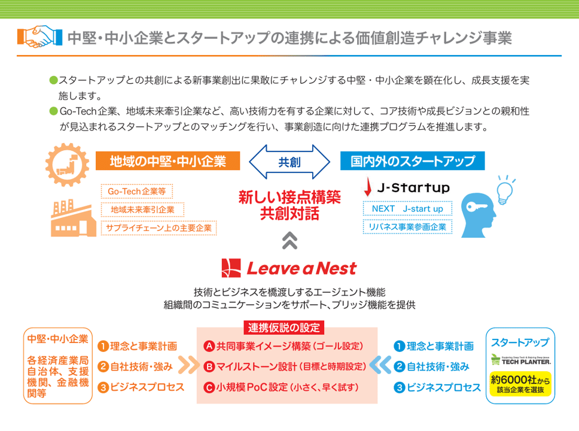
*リバネス株式会社の成果報告書の取り組みスライド*

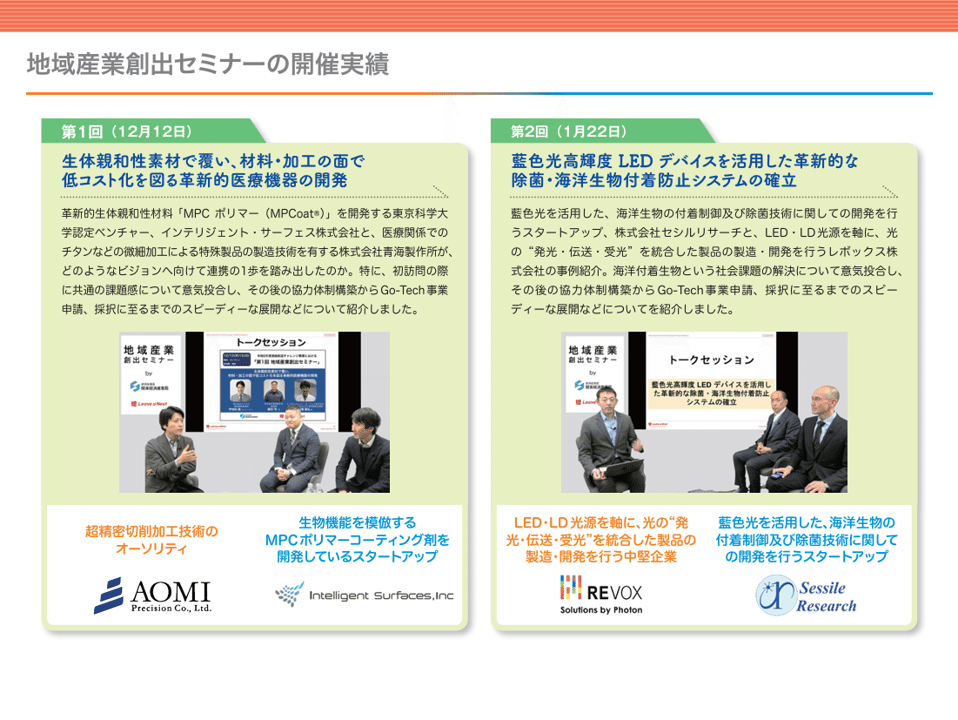
*リバネス株式会社の成果報告書の進捗スライド*

> 引用元：[> 令和６年度中堅・中小企業とスタートアップの連携による価値創造チャレンジ事業（中小企業政策推進事業委託費）報告書](https://www.meti.go.jp/meti_lib/report/2024FY/000024.pdf)

*https://www.meti.go.jp/meti_lib/report/2024FY/itakuichiran2024FY.pdf*

知識製造業を掲げ、科学技術の発展と地球貢献の実現に向けて様々なプロジェクトを推進するリバネスの進捗報告書です。
事例がメインのパワポ資料で、どちらかというとウェブサイトや紙面の様な柔らかめのデザインのスライドが多いです。

### 株式会社NX総合研究所の進捗報告書

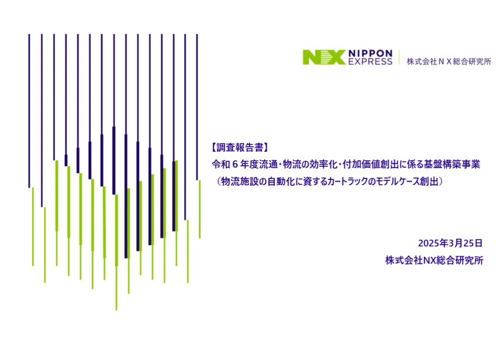
*株式会社NX総合研究所の成果報告書の表紙スライド*

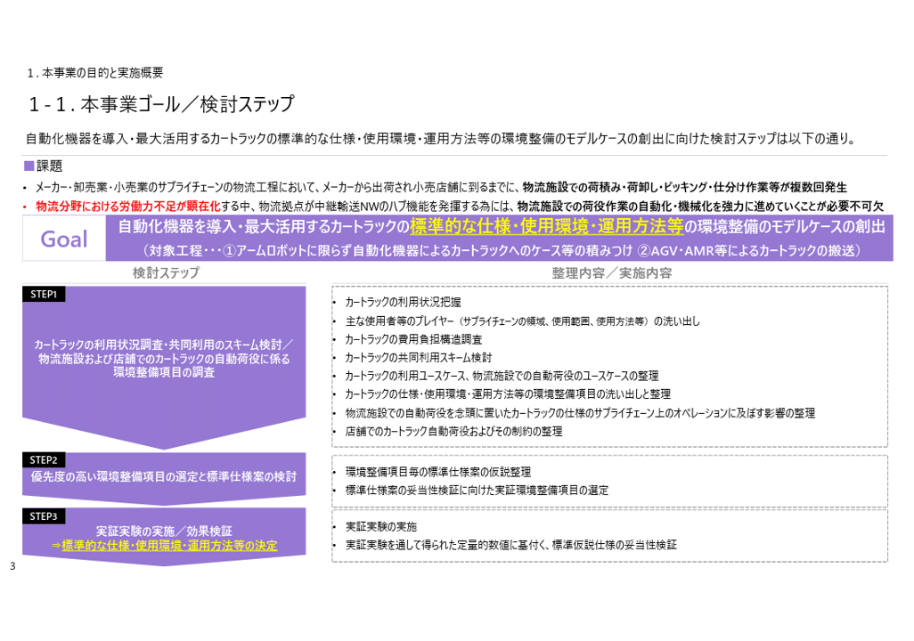
*株式会社NX総合研究所の成果報告書のロードマップスライド*

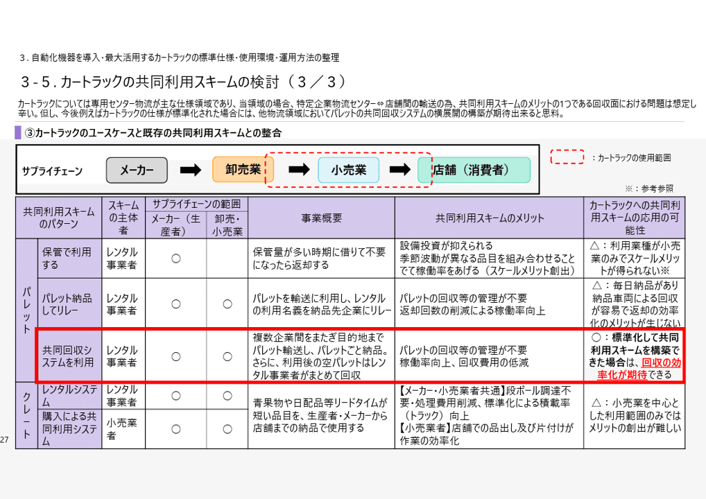
*株式会社NX総合研究所の成果報告書の進捗スライド*

> 引用元：[> 令和６年度流通・物流の効率化・付加価値創出に係る基盤構築事業（物流施設の自動化に資するカートラックのモデルケース創出）](https://www.meti.go.jp/meti_lib/report/2024FY/000144.pdf)

*https://www.meti.go.jp/meti_lib/report/2024FY/itakuichiran2024FY.pdf*

日本通運系のシンクタンクで、物流に特化した「ロジスティクスのプロ」であるＮＸ総合研究所の進捗報告書です。
実証実験についてロードマップから進捗まで、表や写真をうまく使ってまとめたパワポスライドになっています。

### 株式会社パソナの進捗報告書

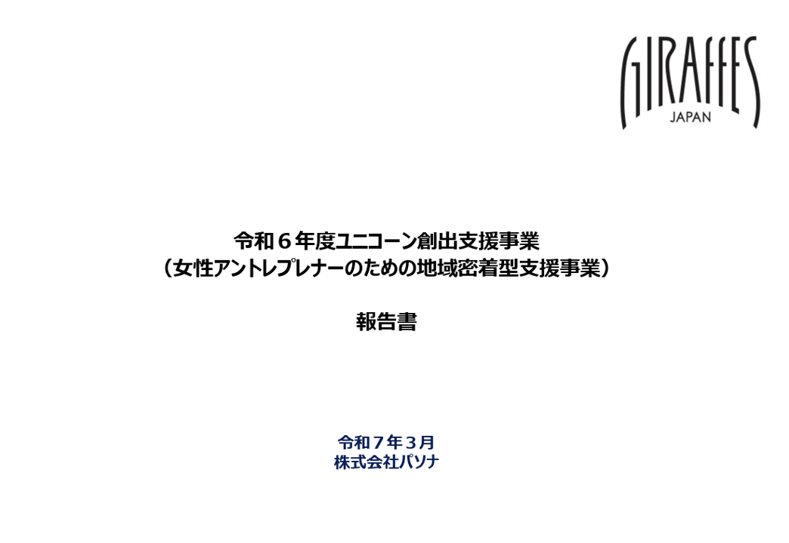
*株式会社パソナの成果報告書の表紙スライド*

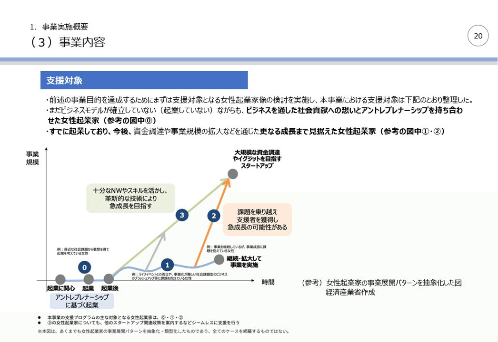
*株式会社パソナの成果報告書のロードマップスライド*

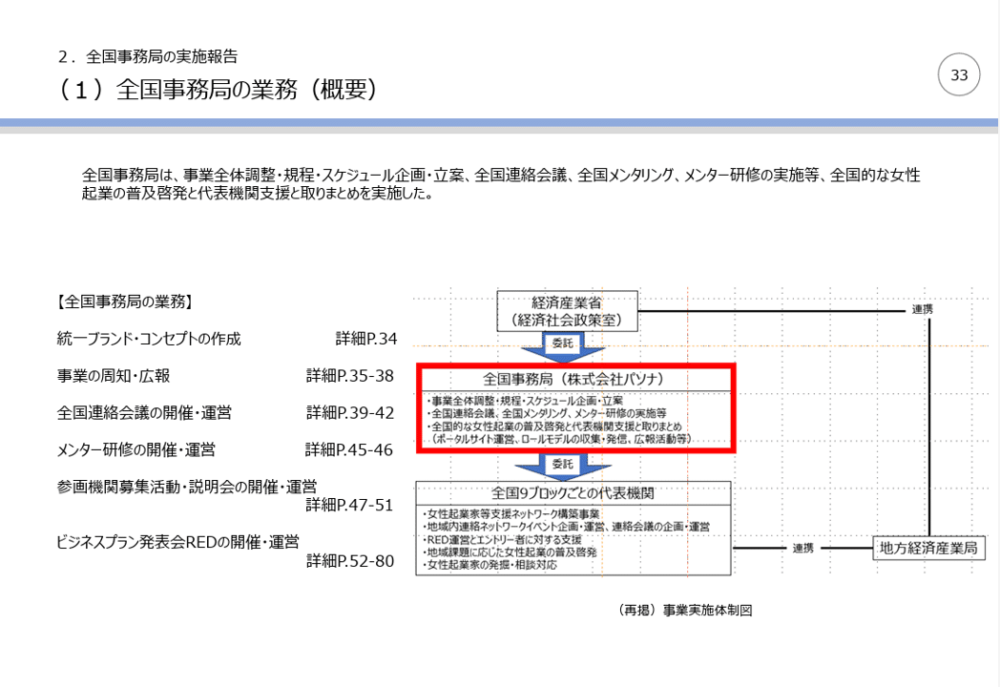
*株式会社パソナの成果報告書の進捗スライド*

> 引用元：[> 令和６年度ユニコーン創出支援事業（女性アントレプレナーのための地域密着型支援事業）報告書](https://www.meti.go.jp/meti_lib/report/2024FY/000042.pdf)

*https://www.meti.go.jp/meti_lib/report/2024FY/itakuichiran2024FY.pdf*

人材派遣大手のパソナの進捗報告書です。パソナのパワポ資料もなかなか出てこないので、見てみると面白いです。
全体的にテキストベースのスライドが多いです。

## パワポのアンケート結果プレゼン資料例５選

### インテージリサーチのアンケート結果

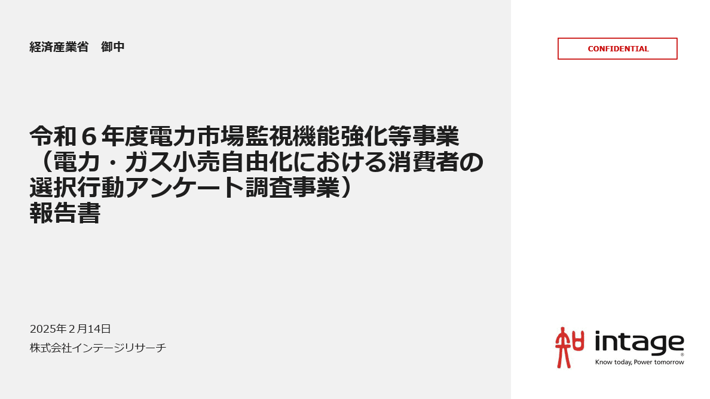
*インテージリサーチの表紙スライド*

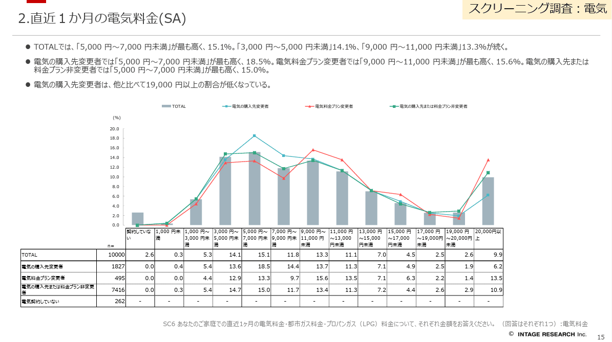
*インテージリサーチのアンケート結果グラフスライド*

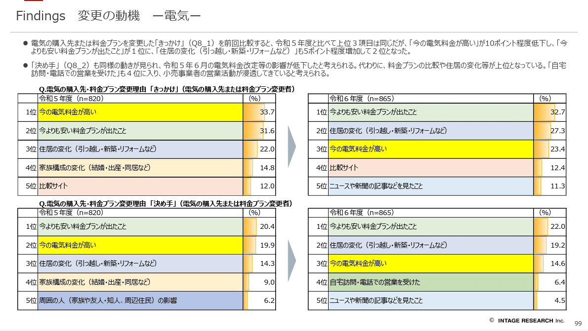
*インテージリサーチのアンケート結果表スライド*

> 引用元：[> 令和６年度電力市場監視機能強化等事業（電力・ガス小売自由化における消費者の選択行動アンケート調査事業）報告書](https://www.meti.go.jp/meti_lib/report/2024FY/1000088.pdf)

*https://www.meti.go.jp/meti_lib/report/2024FY/itakuichiran2024FY.pdf*

リサーチ大手のインテージリサーチのアンケート結果資料です。定点調査等に強みがありますが、アンケート調査も行っており、経産省の委託調査にもたまに出てきます。
アンケート調査結果を見せるパワポスライドとして、単純集計やクロス集計、グラフや表など様々なパターンがあり、参考になります。

### 帝国データバンクのアンケート結果

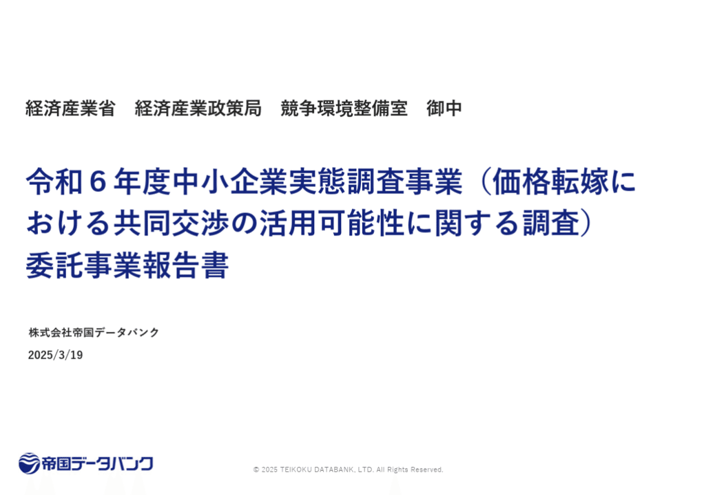
*帝国データバンク（TDB）の表紙スライド*

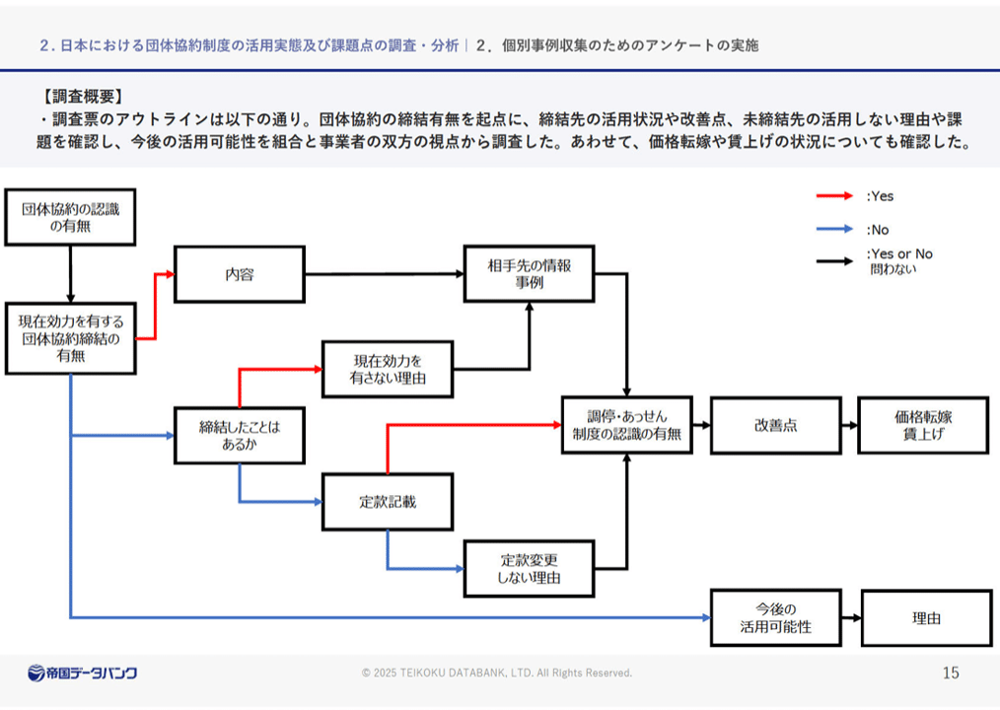
*帝国データバンク（TDB）のアンケート内容のスライド*

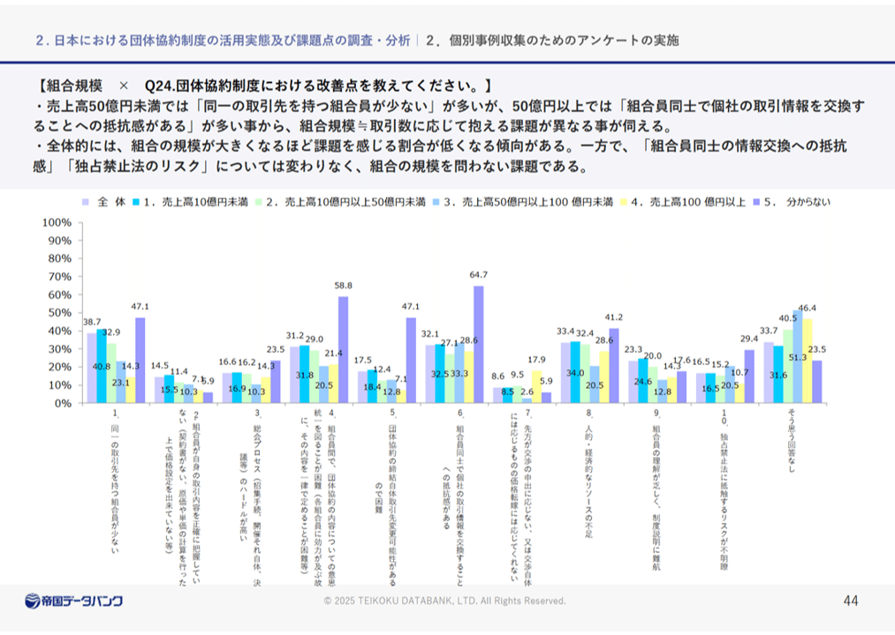
*帝国データバンク（TDB）のアンケート結果のスライド*

[> 引用元：令和６年度中小企業実態調査事業（価格転嫁における共同交渉の活用可能性に関する調査）委託事業報告書](https://www.meti.go.jp/meti_lib/report/2024FY/000049.pdf)

*https://www.meti.go.jp/meti_lib/report/2024FY/itakuichiran2024FY.pdf*

信用調査最大手の帝国データバンクのアンケート結果資料です。
会員企業とのリレーションを通じてアンケート調査ができるため、中小企業などの法人向けのアンケート調査のパワポスライドを見かけることが多いです。

### 東京商工リサーチのアンケート結果

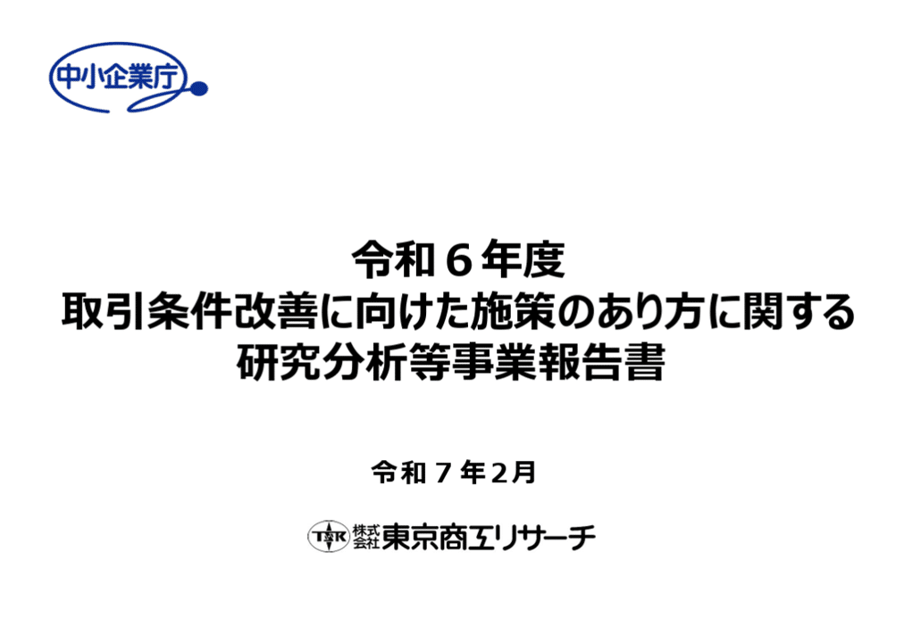
*東京商工リサーチ（TSR）のアンケート結果の表紙スライド*

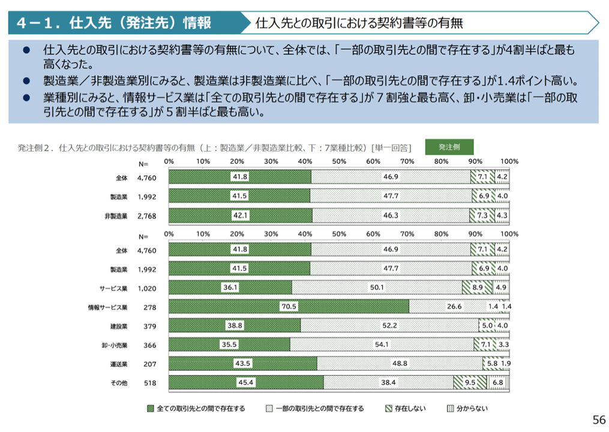
*東京商工リサーチ（TSR）のアンケート結果のグラフスライド*

> 引用元：[> 令和４年度地域デジタルイノベーション促進事業 （データに基づく地域未来牽引企業調査・分析事業） 最終報告書](https://www.meti.go.jp/meti_lib/report/2022FY/000394.pdf)

*https://www.meti.go.jp/meti_lib/report/2024FY/itakuichiran2024FY.pdf*

同じく信用調査最大手の東京商工リサーチのアンケート結果資料です。
帝国データバンク同様に中小企業などの法人向けのアンケート調査のパワポスライドを見かけることが多いです。

### 矢野経済研究所のアンケート結果

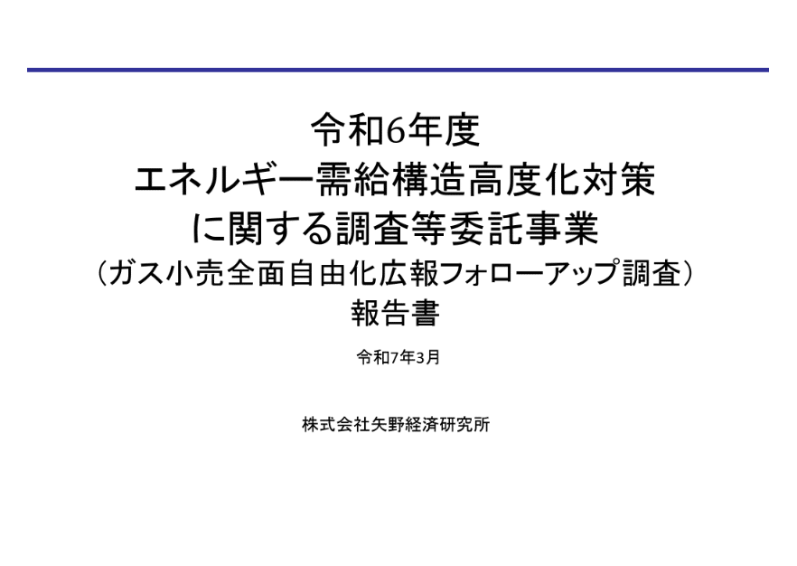
*矢野経済研究所の表紙スライド*

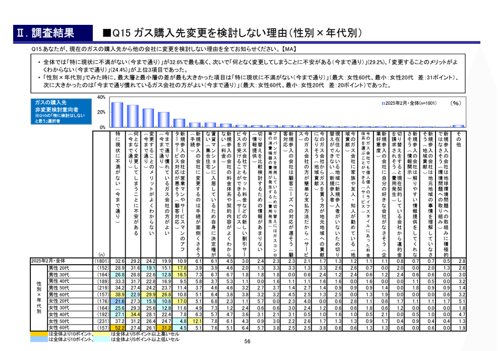
*矢野経済研究所のアンケート結果の棒グラフスライド*

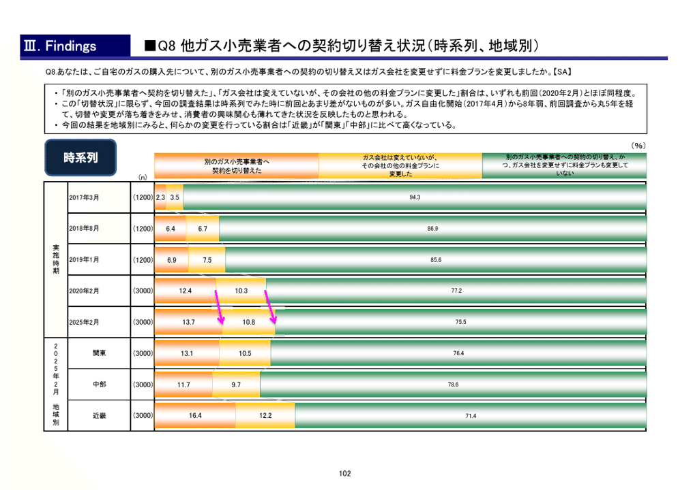
*矢野経済研究所のアンケート結果の100％棒グラフスライド*

> 引用元：[> エネルギー需給構造高度化対策に関する調査等委託事業（ガス小売全面自由化広報フォローアップ調査）報告書](https://www.meti.go.jp/meti_lib/report/2024FY/000330.pdf)

*https://www.meti.go.jp/meti_lib/report/2024FY/itakuichiran2024FY.pdf*

国内の調査レポート大手の矢野経済研究所のアンケート結果資料です。
アンケート調査に基づく市場レポートを作成しているため、こちらもアンケートに強く、B2Cのアンケート調査結果のパワポスライドなどもあります。

### playground株式会社のアンケート結果

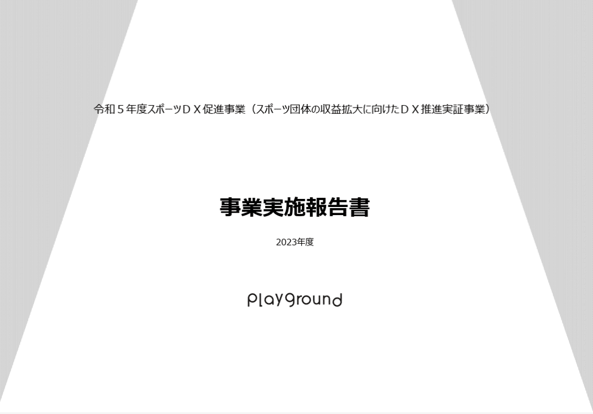
*playground株式会社の表紙スライド*

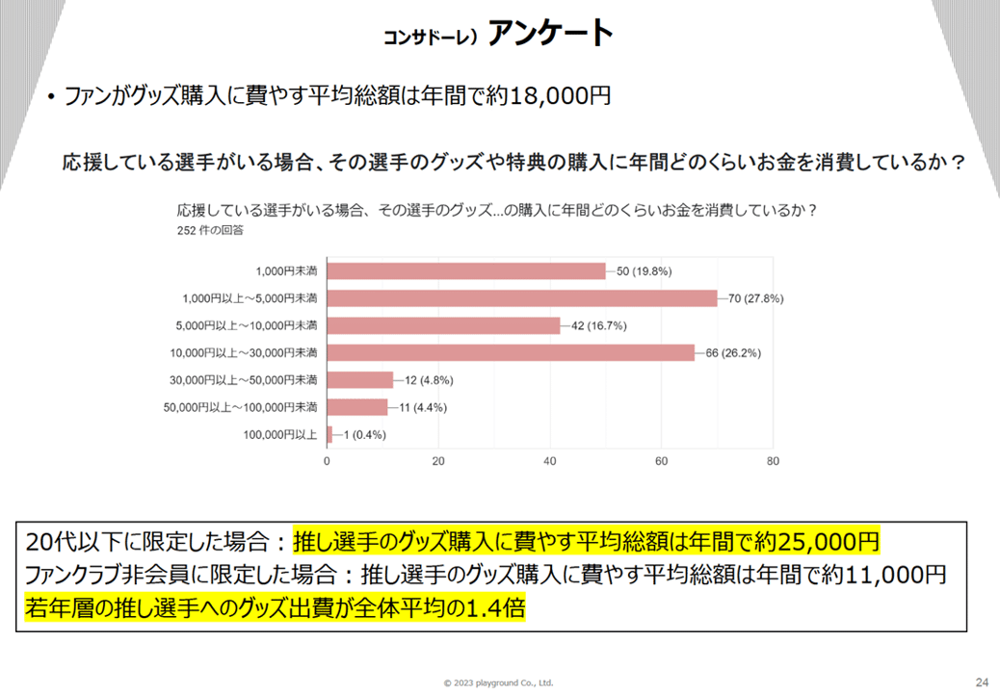
*playground株式会社のアンケート結果の棒グラフスライド*

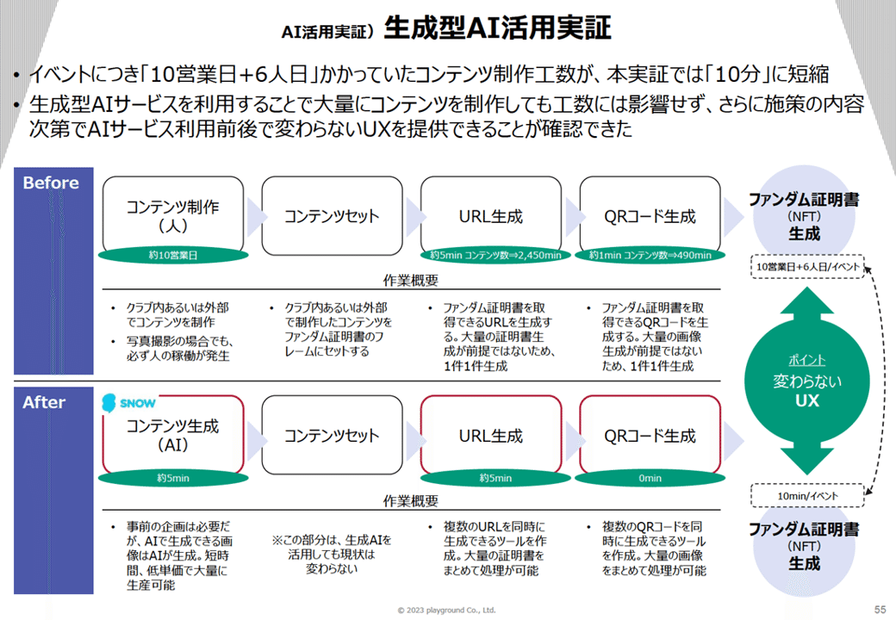
*playground株式会社の実証実験の進捗報告スライド*

> 引用元：[> 令和５年度スポーツDX促進事業（スポーツ団体の収益拡大に向けたDX推進実証事業）事業実施報告書](https://www.meti.go.jp/meti_lib/report/2023FY/000341.pdf)

*https://www.meti.go.jp/meti_lib/report/2023FY/itakuichiran2023FY.pdf*

デジタルの力でスポーツ・エンタメの収益性を高め、夢を与える仕事の市場価値向上を目指すplayground株式会社のアンケート結果スライド資料です。
アンケート結果とグラフサマリー、黄色のハイライトでわかりやすいパワポスライドになっています。

## 経産省のわかりやすい「委託調査報告書」20選まとめ

いかがでしたでしょうか。「委託調査報告書」のフォーマットはおそらく定められていないため、wordで提出する会社も多いですが、本日はその中でもパワポフォーマットで提出した会社の中から参考になりそうなものを厳選して紹介いたしました。
パワポ研では、グラフやチャートや図など、様々なシーンごとに参考になるスライド例をまとめていますので、気になる方は下のNoteから見てみてくださいね。

## パワポ研オリジナルテンプレート

パワポ研では「ビジネスシーンで使える」パワーポイントテンプレートを公開しております。デザインを整えるのみならず、**ロジックやストーリーを整理するのにも役立つパッケージ**になっておりますので、関心のある方は下記ページも併せてご覧ください！

上記の記事のように、noteでは**フォローしているだけでビジネスにおける「資料作成のコツ」と「デザインのセンス」が身に付くアカウント**を目指して情報配信を行っています。
今後もコンスタントに記事を配信しいく予定なので、関心のある方は是非アカウントのフォローをお願いします！

**> Template販売　**[> https://powerpointjp.stores.jp/](https://powerpointjp.stores.jp/%EF%BF%BCnote)
**> note　**[> パワポ研の資料作成術](https://note.com/powerpoint_jp/m/mc291407396da)
**> X（旧Twitter)　**[> https://twitter.com/powerpoint_jp](https://twitter.com/powerpoint_jp)

## レックスアドバイザーズからのお知らせ

パワポ研は株式会社レックスアドバイザーズが運営しています。
レックスアドバイザーズは経営企画職や経営管理職に特化した転職エージェントです。
上場企業や上場準備企業を中心に、**経営企画、IR、経理財務、法務、内部監査等の職種の求人**をご紹介しているほか、**CFOなどのコンフィデンシャル求人**もご紹介可能です。
また**コンサルティングファームや監査法人の求人も豊富にある**ため、プロフェッショナルファームを目指す方のご支援も得意です。
求人紹介やキャリア相談を希望の方は、[**無料転職サポート**](https://www.career-adv.jp/job_search/entryform_exp/)よりサービス利用登録をしてみてください。

*レックスアドバイザーズのサービスサイトはこちら*

**> 求人をご希望の方　**[> 無料転職サポート](https://www.career-adv.jp/job_search/entryform_exp/)**
> 採用支援をご希望の方　**[> 採用サポート](https://www.career-adv.jp/request3/)
**> その他　**[> お問い合わせフォーム](https://www.rex-adv.co.jp/contact)
**> 書籍　**[> 注目企業の実例から学ぶパワポ作成術](https://www.amazon.co.jp/dp/4046060476)

