# 【マネしたい】見せ方がおしゃれなパワポの「比較」スライド９選

[note原文](https://note.com/powerpoint_jp/n/n612694b96484)

みなさんこんにちは。
資料デザインのリサーチや分析に取り組むパワーポイントのスペシャリスト、パワポ研です。

今回は、**パワポの「比較」スライドに焦点を当て、上場企業のIR資料から参考になるデザインを紹介**していきます。パワポの比較のスライドは表形式のデザインが多いと思われがちですが、実は様々なデザインの比較の見せ方があるので、参考になる様々なデザインの比較スライドを紹介していきます。
比較に限らない、パワポの表スライド全般について紹介しているNoteはこちらから。

では早速行きましょう！

## 見やすいパワポの比較表スライド例３選

まずは基本形となる、パワポの「比較表」スライドのデザインから見ていきましょう。**競合比較や他社比較のパワポスライドにおいて、いくつかの要素でメリットデメリットを評価して、自社の優位性を説明する場合**によく使われます。今回はバリエーションとして、セグメントの違いを示すために比較表を使っているパワポスライドや、戦略の優先度をつけるために比較表を使っているパワポスライドも紹介します。

### 見やすいパワポの比較表デザイン例

まずは株式会社unerryのパワポにおける「比較」表のデザイン例から見ていきましょう。
事業計画及び成長可能性に関する説明資料のパワーポイントにある、「サービスの優位性」のスライドです。

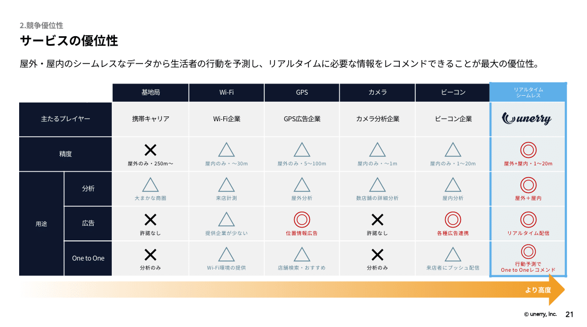
*株式会社unerryのパワポの比較表スライド*

> 引用元：[> 事業計画及び成長可能性に関する説明資料](https://contents.xj-storage.jp/xcontents/AS82460/a1aaf712/6ced/466f/b651/5d15be9204a3/140120250925562011.pdf)

*https://www.unerry.co.jp/ir/news/*

パワポの「比較」表スライドの特徴としては**、マルバツ評価に合わせて理由をテキストで入れている点**が挙げられます。精度、分析、広告、One to Oneの４つの観点から自社と競合を３段階評価で比較するパワポデザインです。

三段階評価をするにあたって、３つの記号で比較するだけでなく、赤色、青色、黒色と色も変えることで、より比較が目立つようになっています。パワポの比較表の自社部分をコーポレートカラーの水色で囲うデザインも、わかりやすくてよいですね。

### おしゃれなパワポの比較表デザイン例

続いて株式会社イズミのパワポにおける「比較」表のデザイン例です。
第三次中期経営計画のパワーポイントにある、「GMS戦略｜フォーマット別の基本的な施策の考え方」のスライドを見てみましょう。

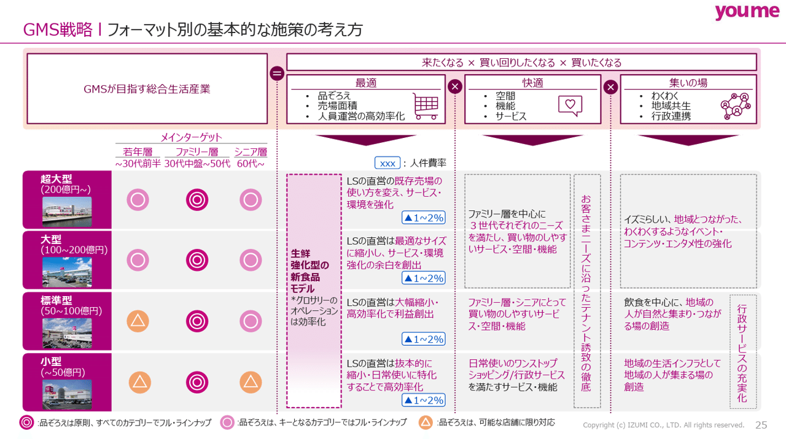
*株式会社イズミのパワポの比較表スライド*

> 引用元：[> 第三次中期経営計画策定に関するお知らせ](https://www.izumi.co.jp/ir/db8ff8a0e7d0c22f2dcfcc7fb1940dd3.pdf)

*https://www.izumi.co.jp/ir/news/*

パワポの「比較」表スライドの特徴としては**、左側で特徴の比較をした上で、右側で特徴に合わせた戦略を記載している点**が挙げられます。自社内ののフォーマットを超大型、大型、標準型、小型に分けた上で、メインターゲットが若年層なのかファミリー層なのかシニア層なのかを比較しています。
右側ではメインターゲットの違いに合わせて、「最適」「快適」「集いの場」の３つの観点から戦略の違いを比較しています。

コーポレートカラーのピンクのワントーンにしている点や、ごちゃごちゃしないように凡例を下に１行で記載している点など、パワポにおける基本的なポイントをきっちり抑えておしゃれな比較表に仕上げています。気づく人は気づく通り、BCGのパワポの比較表のテンプレートなので、戦略コンサルが考え抜いて作ったスライドとして貴重な一枚ともいえますね。

### パワポのメリットデメリットの比較表の例

次にHUMAN MADE株式会社のパワポにおける「比較」表のデザイン例を見てみましょう。
事業計画及び成長可能性に関する事項のパワーポイントにある、「中国・米国を中心に自社店舗・自社ECを展開する」のスライドです。

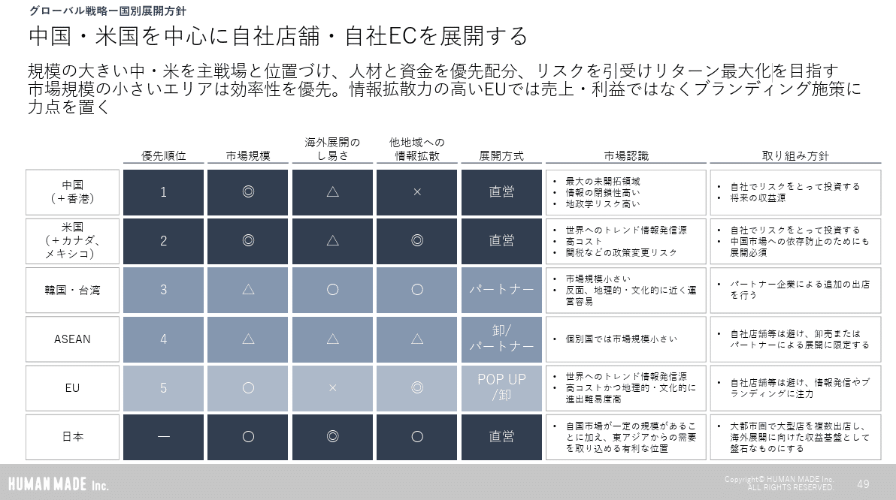
*HUMAN MADE株式会社のパワポの比較表スライド*

> 引用元：[> 事業計画及び成長可能性に関する事項](https://contents.xj-storage.jp/xcontents/AS04974/f6768737/f0ba/4026/8d86/5da9f527289e/140120260326589819.pdf)

*https://ir.humanmade.co.jp/*

パワポの「比較」表スライドの特徴としては**、優先順位を決める評価軸ごとの評価と、市場認識を合わせることで、各市場のメリットデメリット一目でわかるようにしている点**が挙げられます。進出先として、中国（＋香港）、米国（＋カナダ、メキシコ）、韓国・台湾、ASEAN、EUの５つを比較しています。評価軸として、市場規模、海外展開のしやすさ、他地域への情報拡散の３つを取って比較し、右の市場認識の項目でメリットとデメリットをテキストでまとめる比較表のデザインです。

優先度が高いエリアは、比較表の中でも濃い青色の背景色にすることで、差分がわかりやすいようにしていますが、メインマーケットの一つである日本も、比較対象として一番下に入れています。そうすることで、より比較対象である進出候補先のメリットデメリットが鮮明にわかるようになっていますね。

## ２つを対比するパワポの比較スライド例３選

続いては、複数のものではなく２つの要素を比較する、いわゆる対比型のパワポスライドのデザインを見ていきましょう。先ほどの様な比較表のデザインを応用して対比するパワポスライドもあれば、２項対立のような形で２つを対比するパワポスライドもあります。

### 他社比較や競合比較のおしゃれなパワポ例

まずはインフォメティス株式会社のパワポにおける「他社比較」のデザイン例を見ていきましょう。
事業計画及び成長可能性に関する事項のパワーポイントにある、「脱炭素化と共に提供するスマートサービス」のスライドです。

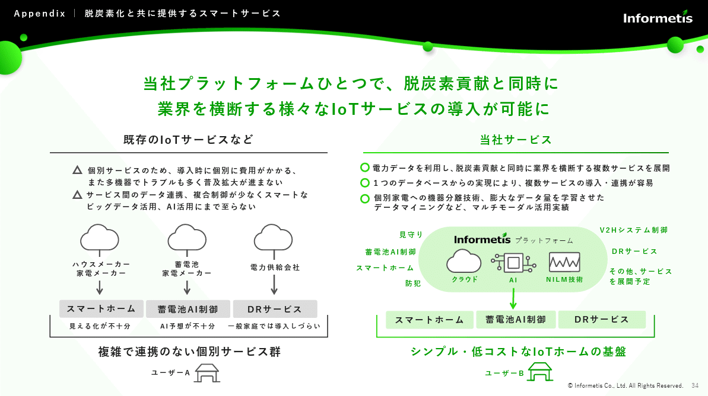
*インフォメティス株式会社のパワポの他社比較スライド*

> 引用元：[> 事業計画及び成長可能性に関する事項](https://contents.xj-storage.jp/xcontents/AS04931a/f0cdfef4/b2e0/4d91/82a0/0a4bb702abb8/140120260326590677.pdf)

*https://www.informetis.com/ir/news/*

パワポの「他社比較」スライドの特徴としては**、パワポスライドを左右に分けてテキストや図の対比で比較するデザイン点**が挙げられます。他社のIoTサービスと自社サービスを左右に置き、タイトル、テキスト、図を同じ高さに置くことで、比較表にしなくとも対比がしやすいデザインになっています。

テキストの前に三角や丸といった記号を入れることで対比をしているほか、ユーザーの家の絵、スマートフォームや蓄電池AI制御やDRサービスといった項目を左右でそろえることで対比しやすくなる等、見やすいデザインにするための工夫が随所にみられます。他社を黒色ベース、自社を蛍光色の緑色ベースにして対比するパワポデザインもおしゃれですね。。

### 比較のレイアウトがおしゃれなパワポ例

続いてセーフィー株式会社のパワポにおける「競合比較」のデザイン例を見てみましょう。
事業計画及び成長可能性に関する事項のパワーポイントにある、「Safieは現場AXソリューションを提供するプラットフォーマー」のスライドです。

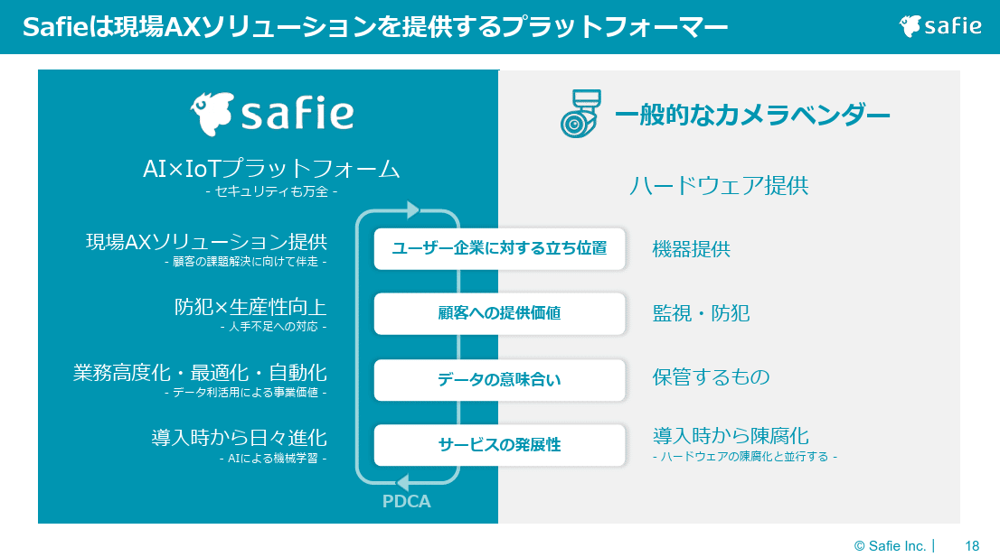
*セーフィー株式会社のパワポの競合比較スライド*

> 引用元：[> 事業計画及び成長可能性に関する事項](https://ssl4.eir-parts.net/doc/4375/tdnet/2780302/00.pdf)

*https://safie.co.jp/ir/news/*

パワポの「競合比較」スライドの特徴としては**、比較表の形をとりつつも、枠線を無くしてすっきりおしゃれなレイアウトにしている点**が挙げられます。競合のカメラベンダーと自社商品を、ユーザー企業に対する立ち位置、顧客への提供価値、データの意味合い、サービスの発展性の４項目で対比するデザインになっています。自社側にだけPDCAサイクルの矢印を入れている点もポイントですね。

パワポの比較表の枠線を取り除くだけでなく、自社側はコーポレートカラーの背景に白抜き、競合側はグレーの背景にコーポレートカラーの文字色という組み合わせにすることで、対比構造が非常にわかりやすい、おしゃれなデザインになっています。

### ビフォーアフター比較の見せ方のパワポ例

次に株式会社インティメート・マージャーのパワポにおける「ビフォーアフター比較スライド」のデザイン例です。
事業計画及び成長可能性に関する事項のパワーポイントにある、「IM-DMPの活用メリット」のスライドです。

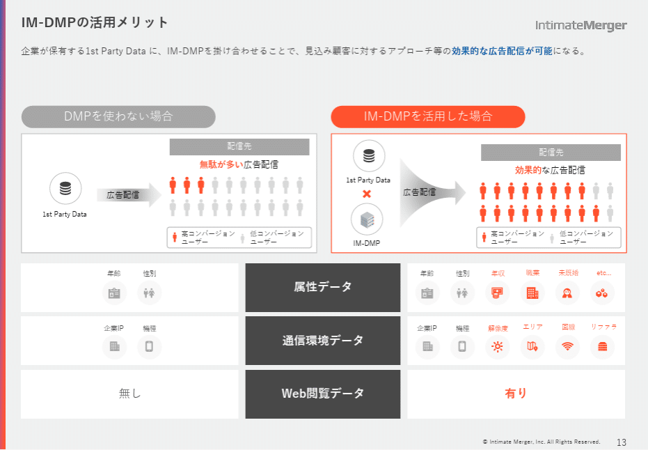
*株式会社インティメート・マージャーのパワポのビフォーアフター比較スライド*

> 引用元：[> 事業計画及び成長可能性に関する事項](https://pdf.irpocket.com/C7072/hvir/pSug/VMim.pdf)

*https://corp.intimatemerger.com/ir/lib-presen/*

パワポの「ビフォーアフター比較」スライドの特徴としては**、アイコンの色や数の増減を通じてビフォーアフターを表現している点**が挙げられます。DMPを使わない場合と、IM-DMPを使う場合の違いを、広告配信先の人の数や、使える属性データ、通信環境データ、Web閲覧データといった項目で対比するデザインです。

グレーとコーポレートのカラーの対比を使って強調するのは、パワポにおいては定番のデザインですが、特にビフォーアフターの比較をする際には有効なデザインです。またアイコンそのものを増やすのも、ビフォーアフターでの対比がしやすくなります。

## 見やすいパワポの比較スライドデザイン３選

最後は応用形として、パワポにおける様々なデザインの比較スライドを紹介していきます。比較表と図を合わせるパワポのデザインだけでなく、図の中に対比構造を作り出すパワポのデザインなど、いくつかのパターンのスライドを紹介します。

### 競合比較の見やすいパワポデザイン例

まずは株式会社ROXXのパワポにおける「競合比較」スライドのデザイン例から見ていきましょう。
事業計画及び成長可能性に関する事項についてのパワーポイントにある、「Zキャリアのポジショニング」のスライドです。

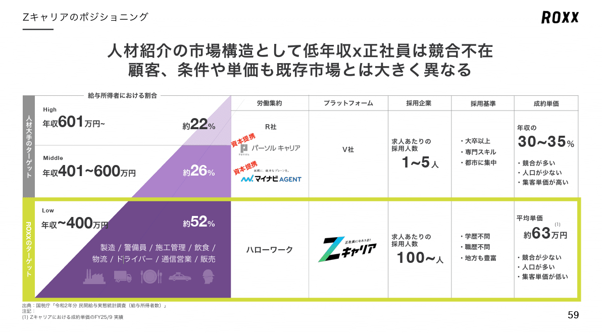
*株式会社ROXXのパワポの比較スライドのデザイン*

> 引用元：[> 事業計画及び成長可能性に関する事項](https://contents.xj-storage.jp/xcontents/AS04024/31916084/05f0/4cba/9253/8f55d97d5c1b/140120251219522523.pdf)

*https://roxx.co.jp/ir/news/*

パワポの「競合比較」スライドの特徴としては**、比較表に合わせてピラミッド図を入れることで、ターゲットの違いが見やすいデザインにしている点**が挙げられます。競合が年収400万円以上の転職者をターゲットにしているのに対し、自社が年収400万円未満をターゲットにしていることを、ピラミッド図でデザインしています。

競合に対して特異なポジショニングを取っている企業の場合、なぜそのポジショニングを取るのかの説明が重要なため、パワポにおいても比較のスライドが重要になります。その際、ピラミッド図などを使うと、セグメントの違いが見やすいパワポになるので良いですね。

### 他社比較のおしゃれなパワポデザイン例

続いて株式会社ジンジブのパワポにおける「他社比較」スライドのデザイン例を見ていきましょう。
2025年9月期　決算説明資料（事業計画及び成長可能性に関する事項）のパワーポイントにある、「ブルーオーシャンで持続成長するポテンシャルがある」のスライドです。

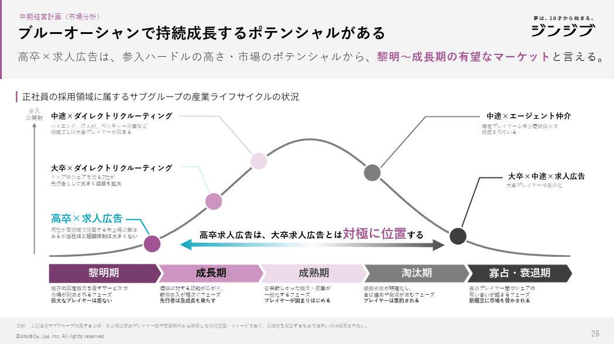
*株式会社ジンジブのパワポの比較スライドのデザイン*

> 引用元：[> 2025年３月期 通期 決算説明資料 中期経営計画 説明資料 （事業計画及び成長可能性に関する事項）](https://contents.xj-storage.jp/xcontents/AS71372/66df9bff/63fa/4747/a4db/a6bc464d4453/140120250514551463.pdf)

*https://jinjib.co.jp/ir/news/*

パワポの「他社比較」スライドの特徴としては**、ライフサイクル図を使って他社と自社のポジションを比較している点**が挙げられます。なぜ高卒の求人広告事業をやるのか、正社員の採用領域における産業ライフサイクル図を使って説明している、おしゃれな比較スライドですね。

こちらも高卒就活特化という独特なポジショニングのため、なぜ大卒就活でないのか、またなぜ求人広告なのか、大卒就活との比較で説明する必要があります。比較表の形で比較してもよいのですが、今回のようにポジショニングにより深い意図がある場合、そうした意図が伝わる図をパワポに入れ込むと、より対比が伝わりやすいデザインになりますね。

### 商品比較の見やすいパワポデザイン例

最後は株式会社ノースサンドのパワポにおける「商品比較」スライドのデザイン例を見てみましょう。
事業計画及び成長可能性に関する事項のパワーポイントにある、「カンパニーハイライト｜人にフォーカスを当てたコンサルティング」のスライドです。

*株式会社ノースサンドのパワポの比較スライドのデザイン*

> 引用元：[> 「事業計画及び成長可能性に関する事項」](https://contents.xj-storage.jp/xcontents/AS83453/04a57b47/8e2b/4bf0/8809/9ef24e1ac56c/140120251121507883.pdf)

*https://northsand.co.jp/ir/ir-news/*

パワポの「商品比較」スライドの特徴としては**、競合他社との違いをイラストを使って見せている点**が挙げられます。競合他社がスキルにフォーカスしているのに対し、ノースサンド社はスキルも見つつより人間力にフォーカスするということを、イラストで説明するデザインになっています。

今回は競合と比較して幅広いスキルにフォーカスを当てていることをイラストで示していますが、類似のデザインとして、ベン図を使うデザインやマトリックス図に自社を大きめにプロットするデザインもありますね。

## 【マネしたい】見せ方がおしゃれなパワポの「比較」スライド９選

以上、様々な企業を参考に、パワポの「比較」スライドのデザインを紹介してきました。まずはパワポの基本である比較表のデザインをマスターし、その上で必要に応じてピラミッドなどの応用形の背座員を覚えていくとよいでしょう。

ちなみに**パワポ研で提供しているテンプレート集には、以下のようなそのまま使える「比較」表のテンプレートもあります**ので、気になる方は下で紹介しているオリジナルテンプレートのNoteも見てみてくださいね。

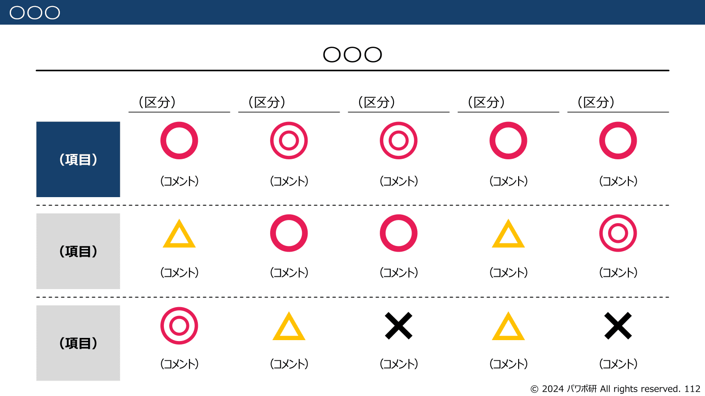
*パワポ研オリジナルテンプレート集の比較表スライド*

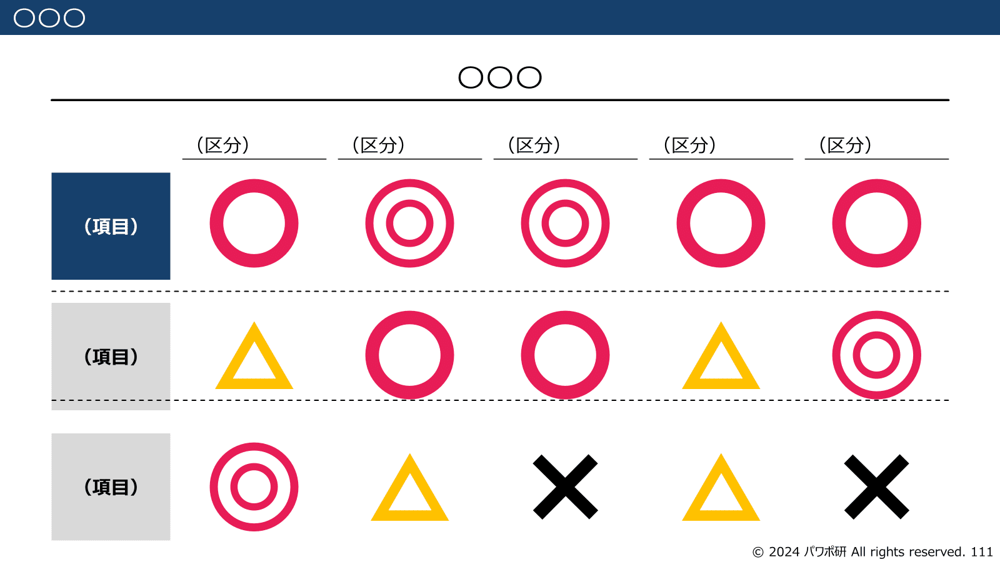
*パワポ研オリジナルテンプレート集の比較表スライド（テキスト無し）*

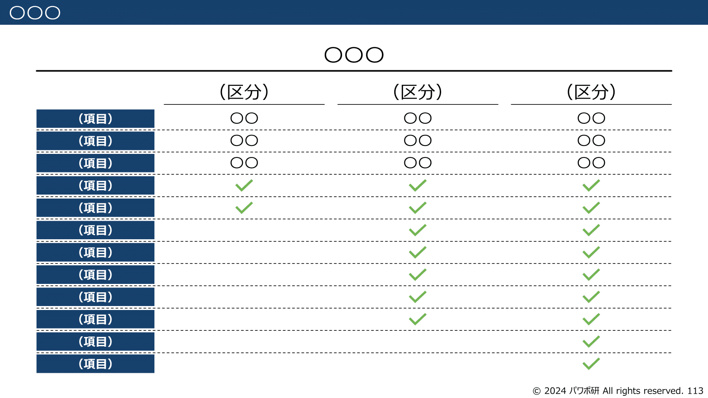
*パワポ研オリジナルテンプレート集の比較表スライド（縦型）*

## パワポ研オリジナルテンプレート

パワポ研では、「ビジネスシーンで使える」パワーポイントテンプレートを公開しております。デザインを整えるのみならず、**ロジックやストーリーを整理するのにも役立つパッケージ**になっておりますので、関心のある方は下記ページも併せてご覧ください！

上記の記事のように、noteでは**フォローしているだけでビジネスにおける「資料作成のコツ」と「デザインのセンス」が身に付くアカウント**を目指して情報配信を行っています。
今後もコンスタントに記事を配信していく予定なので、関心のある方は是非アカウントのフォローをお願いします！

**> Template販売　**[> https://powerpointjp.stores.jp/](https://powerpointjp.stores.jp/%EF%BF%BCnote)
**> note　**[> パワポ研の資料作成術](https://note.com/powerpoint_jp/m/mc291407396da)
**> X（旧Twitter)　**[> https://twitter.com/powerpoint_jp](https://twitter.com/powerpoint_jp)

## レックスアドバイザーズからのお知らせ

パワポ研は株式会社レックスアドバイザーズが運営しています。
レックスアドバイザーズは**経営企画職や経営管理職に特化した転職エージェント**です。
上場企業や上場準備企業を中心に、**経営企画、IR、経理財務、法務、内部監査等の職種の求人**をご紹介しているほか、**CFOなどのコンフィデンシャル求人**もご紹介可能です。
またコンサルティングファームや監査法人、会計事務所の求人も豊富にあるため、プロフェッショナルファームを目指す方のご支援も得意です。
求人紹介やキャリア相談を希望の方は、[**無料転職サポート**](https://www.career-adv.jp/job_search/entryform_exp/)よりサービス利用登録をしてみてください。

*レックスアドバイザーズのサービスサイトはこちら*

**> 求人をご希望の方　**[> 無料転職サポート](https://www.career-adv.jp/job_search/entryform_exp/)**
> 採用支援をご希望の方　**[> 採用サポート](https://www.career-adv.jp/request3/)
**> その他　**[> お問い合わせフォーム](https://www.rex-adv.co.jp/contact)
**> 書籍　**[> 注目企業の実例から学ぶパワポ作成術](https://www.amazon.co.jp/dp/4046060476)

