# 【マネしたい】パワポの「バブルチャート」「散布図」スライド９選

[note原文](https://note.com/powerpoint_jp/n/n637c3b546a62)

みなさんこんにちは。
資料デザインのリサーチや分析に取り組むパワーポイントのスペシャリスト、パワポ研です。

今回は、**パワポの「バブルチャート」「散布図」スライドに焦点を当て、上場企業のIR資料からおしゃれなスライドを紹介**していきます。テーマ別のスライド一覧はこちらから。

今回紹介するバブルチャートや散布図は色々な使い方があるので、まずはバブルチャートとは何か、散布図とは何か、からおさらいしていきます。
では早速行きましょう！

## バブルチャートとは

バブルチャートとは、企業やサービスや市場を比較する際に使われるテンプレートです。バブルチャートの特徴は、**縦軸と横軸に加えてプロットする円のサイズを変えられる点**が挙げられます。円のサイズも変えられることで、平面にありながら３つの要素で比較できるのがバブルチャートの特徴です。

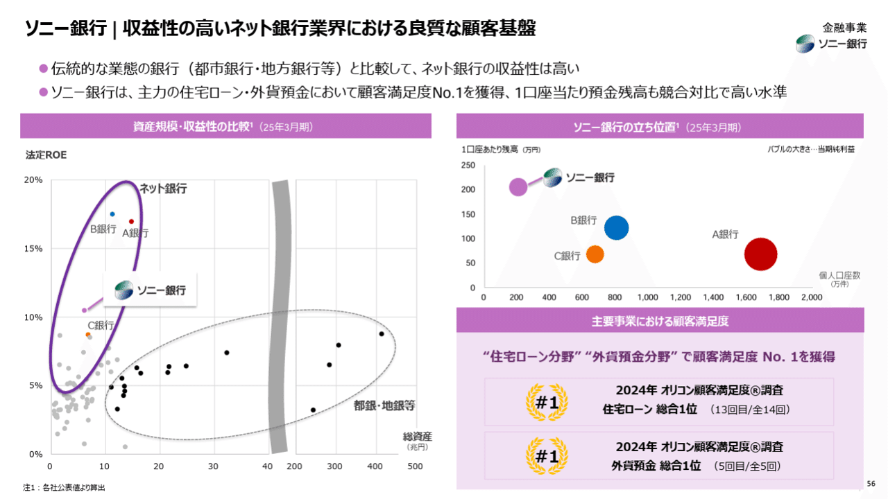
*ソニーフィナンシャルグループ株式会社のバブルチャートのデザイン例*

> 引用元：[> 金融 Investor Day 金融分野](https://www.sony.com/ja/SonyInfo/IR/library/presen/irday/pdf/2025/FinancialServices.pdf)

*https://www.sonyfg.co.jp/ja/ir/library/management_vision/*

上のデザイン例における、右上のチャートがバブルチャートです。横軸が個人口座数、縦軸が１口座当たり残高、バブルの大きさが当期純利益というデザインになっています。
バブルチャートの見方としては、**バブルの位置とサイズで、ビジネスモデルと利益の大きさを見ること**ができます。右下に行くほど小口顧客を多く抱えるモデル、左上に行くほど大口顧客を少なく抱えるモデル、その上で円の大きさが利益をどのくらい稼いでいるか、がわかります。

上のソニーフィナンシャルグループのデザイン例のように、バブルチャートは競合分析のパワポに使われることが多いです。バブルチャートの主な使い方には以下のようなものがあります。

- **ポジショニング分析など、競合との比較にバブルチャートを使う**

- **市場魅力度分析など、市場間の比較にバブルチャートを使う**

- **ポートフォリオ分析など、自社の事業間の比較にバブルチャートを使う**

つまりバブルチャートとは、企業や事業や市場など、サイズ感が重要となる比較分析のシーンで使われるテンプレートで、３つの要素を平面に表現できるのがバブルチャートの特徴といえますね。

## 散布図（スキャッターグラフ）とは

続いてバブルチャートと同じような特徴を持っているものの、少し使い方が異なる散布図についても見ていきましょう。
散布図とは、バブルチャート同様に企業やサービスや市場を比較する際に使われるテンプレートですが、**比較対象が多い場合に使いやすいという特徴**があります。なお散布図は、分布図、スキャッターグラフなどとも呼ばれます。

*ソニーフィナンシャルグループ株式会社の散布図のデザイン例*

上のデザイン例における、左側のチャートが散布図です。横軸が純資産、縦軸が法定ROEというデザインで、各銀行のポジションを比較しています。
バブルチャートとは異なり、**散布図では比較対象の点の大きさは一定です。一定にする代わりに、たくさんの点を比較できる特徴**を持っているので、散布図の使い方には統計分析などもあります。

上のソニーフィナンシャルグループのパワポ例では、散布図の使い方として、都銀や地銀とネット銀行をグループ分けしています。純資産が大きく法定ROEが比較的小さい都銀や地銀は競合ではないため、別グループとしてくくっているわけですね。

また散布図の使い方として、**強調したい対象の点だけに、データラベルを付けたり色でラベル付け**を行ったりして、デザイン上強調します。上のデザイン例では、左側の散布図で主要な点に色でラベルを付けておき、右上のバブルチャートでは対応するバブルにラベルと同じ色を付けています。

つまり散布図とは、競合比較において、よりたくさんのサンプルを比較するのに向いているという特徴があり、散布図の使い方として、グルーピングや統計分析があるということですね。

## 散布図の見方が伝わるデザインのパワポ３選

最初は、近似曲線や補助線となる直線をうまく使って、散布図の見方がわかりやすいデザインとなっているスライド例を見ていきましょう。
散布図を見ると、他社に比べて自社がどのような位置づけなのかは感覚的にわかるものの、**基準を超えているのかどうか、合格点なのかどうかは意外に判断がしづらい**です。そこで補助的に直線を入れることで、目安を作ってあげるわけですね。

### 近似曲線の使い方が上手い散布図の例

まずはJapan Eyewear Holdings 株式会社のパワポにおける「散布図」のデザインから見ていきましょう。
2026年1月期決算説明資料のパワーポイントにある、投資効率のスライドです。

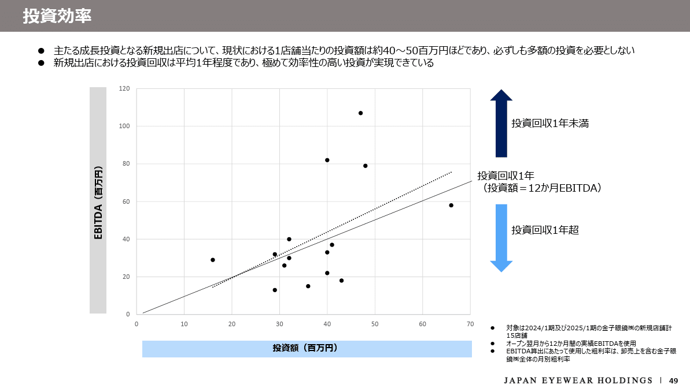
*Japan Eyewear Holdings 株式会社の散布図のデザイン例*

> 引用元：[> 2026年1月期決算説明資料](https://ssl4.eir-parts.net/doc/5889/ir_material_for_fiscal_ym/200490/00.pdf)

*https://www.japan-eyewear-holdings.co.jp/investor-relations/ir-materials/*

パワポの「散布図」の特徴としては、**近似曲線を引いた上で投資回収１年のラインと比較している点**が挙げられます。散布図のデザインは以下のようになっています。

- 散布図の縦軸：EBITDA

- 散布図の横軸：投資額

- 近似曲線：15か所の新規出店におけるEBITDAと投資額のバランスから見た近似曲線

- 散布図の基準線：投資回収１年（投資額＝12か月EBITDA）

散布図の基準線として、投資額＝12か月EBITDAのラインに直線を引いておくことで、新規出店の各店舗の投資回収に１年以上かかっているのか、１年以内に回収できているのかがわかるようになっています。
また近似曲線を引いて基準線と比較できるようにすることによって、当社全体として１年以内の投資回収ができているのかを視覚的に理解できるようになっています。

### 直線の基準線がわかりやすい散布図の例

続いてHUMAN MADE株式会社のパワポにおける「散布図」のデザインを見てみましょう。
事業計画及び成長のパワーポイントにある、業界内のポジショニングのスライドです。

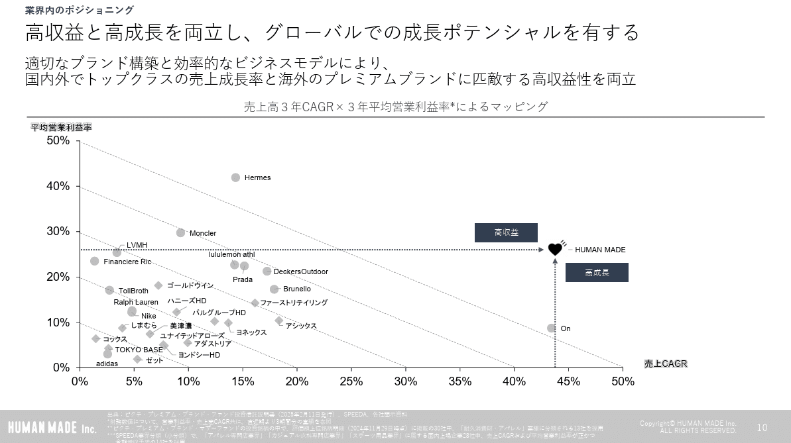
*HUMAN MADE株式会社の散布図のデザイン例*

> 引用元：[> 事業計画及び成長可能性に関する事項](https://contents.xj-storage.jp/xcontents/AS04974/40d2f000/3520/480b/96bc/5607a4183b51/140120251126509397.pdf)

*https://ir.humanmade.co.jp/news/*

パワポの「散布図」の特徴としては、**基準線として利益率と売上CAGRがイコールになるラインに直線が引かれている点**が挙げられます。散布図のデザインは以下のようになっています。

- 散布図の縦軸：平均営業利益率

- 散布図の横軸：売上CAGR

- 散布図の凡例：海外ブランドが丸、国内ブランドがダイヤモンド

- 散布図の基準線：平均営業利益率＝売上CAGRとなる線を10％おきに設定

散布図に平均営業利益率50％と売上CAGR50％を結ぶ直線があることで、高いバランスで利益率と売上CAGRを実現しているHUMAN MADE社が際立つわけですね。また散布図のラベルにも工夫がされており、自社はコーポレートロゴのハート、国内ブランドはダイヤモンド、海外ブランドは丸となっています。

### グループの見方がわかる散布図の例

次はデジタルグリッド株式会社のパワポにおける「散布図」のデザインです。
2025年7月期 通期 決算説明資料（事業計画及び成長可能性に関する事項）のパワーポイントにある、エネルギー企業群・プラットフォーム企業群の双方を上回る高い収益性のスライドです。

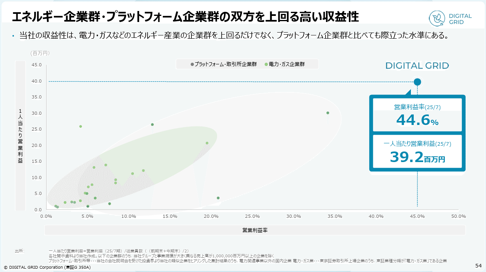
*デジタルグリッド株式会社の散布図のデザイン例*

> 引用元：[> 2025年7月期 通期 決算説明資料（事業計画及び成長可能性に関する事項）](https://ssl4.eir-parts.net/doc/350A/tdnet/2686579/00.pdf)

*https://www.digitalgrid.com/ir/news/*

パワポの「散布図」の特徴としては、**競合企業を２つのグループに分けている点**が挙げられます。散布図のデザインは以下のようになっています。

- 散布図の縦軸：１人当たり営業利益

- 散布図の横軸：営業利益率

- 散布図の凡例：プラットフォーム・取引所企業群が濃い緑色、電力・ガス企業群が黄緑色

散布図における競合企業をプラットフォーム・取引所企業群と電力・ガス企業群に分けて、**凡例として色分けしたうえで、さらに楕円の網掛けをして、グループ化**をしています。視覚的にグループ化をすることで、散布図の見方が非常にわかりやすいデザインとなっています。
その上で、自社の色は凡例と異なるコーポレートカラーにしたうえで、横軸縦軸から直線を引き、営業利益率と一人当たり営業利益率のいずれでも他社を圧倒していることを強調しています。加えて具体的な数値も強調することで意識付けを行うデザインとなっています。

## 散布図とラベルのデザインのパワポ３選

続いて散布図のラベルのデザインが特徴的なスライド例を見ていきましょう。散布図においては**プロットした点群にラベルとして情報を付加することで見方がわかりやすくなりますが、その反面たくさんの点をプロットできるという強みは失われ**ます。
そのため回帰分析などの統計分析の散布図ではあまりラベルは使われず、競合分析やポートフォリオ分析の散布図でラベルが使われることが多いです。

### ラベルが特徴的な散布図の例

まずは株式会社みずほフィナンシャルグループのパワポにおける「散布図」のデザインを見ていきましょう。
"Mizuho IR Day 2025"のパワーポイントにある、Beyond PBR 1.0xに向けてのスライドになります。

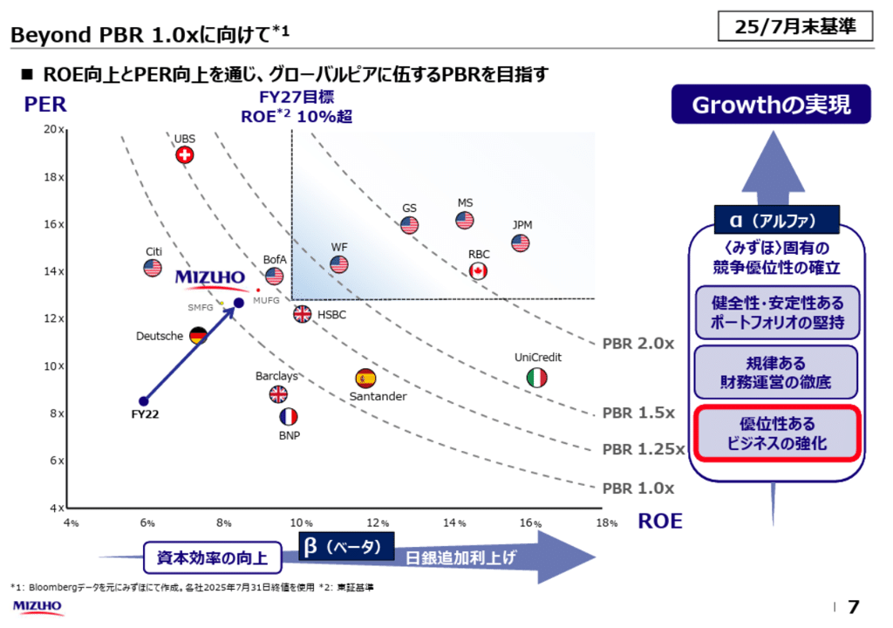
*株式会社みずほフィナンシャルグループの散布図のデザイン例*

> 引用元：[> "Mizuho IR Day 2025"](https://www.mizuho-fg.co.jp/investors/financial/briefing/pdf/20250825_1.pdf)

*https://www.mizuho-fg.co.jp/investors/financial/briefing/index.html*

パワポの「散布図」の特徴としては、**競合企業ごとに本社所在地の国旗のラベルを付けている点**が挙げられます。散布図のデザインは以下のようになっています。

- 散布図の縦軸：PER

- 散布図の横軸：ROE

- 散布図の基準線：PBR1.0倍、PBR1.25倍、PBR1.5倍、PBR2倍、ROE10％

- 散布図のラベル：国旗

ROE向上とPER向上を通じてグローバルピアに伍するPBRを実現するというメッセージのため、グローバルの競合ごとに国旗のラベルを貼り、PBRのラインを入れています。また自社のPBRが2022年から2025年にかけて大きく改善したことを、点と直線の矢印で見せることで、さらなる飛躍が期待できるデザインとなっています。

それ以外にも散布図の縦軸のPERを上げるための成長の実現に何が必要か、横軸のROEを上げるための資本効率の向上は日銀の追加利上げにかかっていることなど、**PBRが上がっていくことを期待させるデザイン**になっている点も、非常によい散布図のスライドといえます。

### ポートフォリオ分析の散布図の例

続いて雪印メグミルク株式会社のパワポにおける「散布図」のデザインを見ていきましょう。
雪印メグミルクグループ経営計画「Next Design2030」説明会資料のパワーポイントにある、2030年のありたい姿：事業ポートフォリオ変革の方向性（具体例）のスライドです。

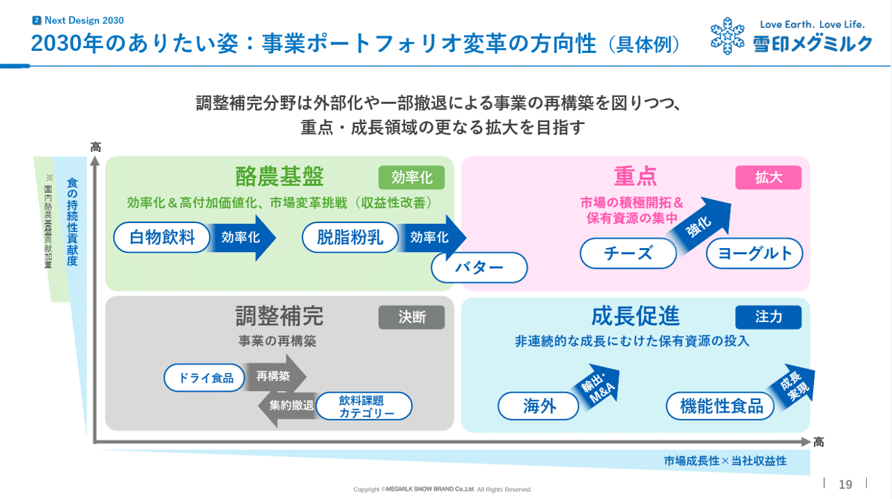
*雪印メグミルク株式会社の散布図のデザイン例*

> 引用元：[> 雪印メグミルクグループ経営計画「Next Design2030」説明会資料](https://contents.xj-storage.jp/xcontents/AS08619/a9b41d9b/eaf5/40e3/831c/ce9646e82c7c/20250514081918914s.pdf)

*https://www.meg-snow.com/ir/library/presentation/*

パワポの「散布図」の特徴としては、**ポートフォリオ分析のスタイルでカテゴリーのラベルを貼っている点**が挙げられます。散布図のデザインは以下のようになっています。

- 散布図の縦軸：市場成長性×当社収益性

- 散布図の横軸：食の持続性貢献度

- 散布図のラベル：事業カテゴリ

- 散布図の特徴：４象限に分解している

一般的なポートフォリオ分析のスタイルですが、バブルチャートを使わずに、散布図のスタイルで点群にラベルを貼っています。**バブルチャートの特徴として、大きいものの視覚的なインパクトが強くなってしまうので、各事業を平等に見せたい場合は散布図スタイルの様が良い**ときもあります。

### マトリックス分析の散布図の例

次は株式会社ミラタップのパワポにおける「散布図」のデザインです。
事業計画及び成長可能性に関する事項のパワーポイントにある、当社の業界ポジショニングのスライドを見てみましょう。

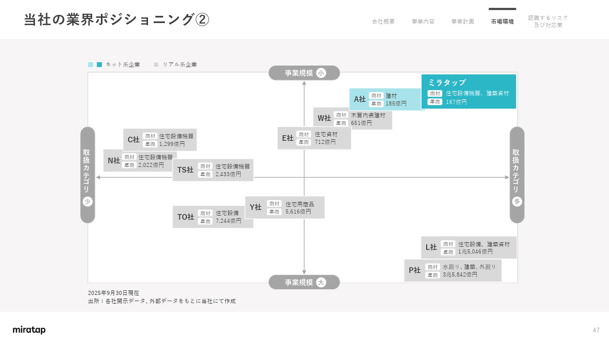
*株式会社ミラタップの散布図のデザイン例*

> 引用元：[> 事業計画及び成長可能性に関する事項](https://ssl4.eir-parts.net/doc/3187/ir_material_for_fiscal_ym2/194072/00.pdf)

*https://info.miratap.co.jp/ir/*

パワポの「散布図」の特徴としては、**マトリックス分析のスタイルでラベルに商材と年商を記載している点**が挙げられます。散布図のデザインは以下のようになっています。

- 散布図の縦軸：取り扱いカテゴリ数

- 散布図の横軸：事業規模

- 散布図の凡例：ネット企業が青色系、リアル企業がグレー色系

- 散布図のラベル：商材と年商

- 散布図の特徴：４象限に分解している

散布図の縦軸がカテゴリの広さ、横軸が事業規模ということで、ポジショニングマップ型の競合分析になっています。その中で多品種少量を強みにしている企業のトップとして、ミラタップ社が右上に位置していることを示しています。グレー色がベースの中に、自社と競合１社だけが青色系で目立つデザインにしている点もポイントです。

## バブルチャートの使い方が上手いパワポ３選

最後はバブルチャートを使ったパワポ例を見ていきましょう。バブルチャートの特徴である、大きさを視覚的に見せられるという点を活かした、バブルチャートの使い方となっている例です。

### ベーシックなバブルチャートの例

まずはベーシックな例として、オムロン株式会社のパワポにおける「バブルチャート」のデザインを見ていきましょう。
決算プレゼンテーション資料のパワーポイントにある、半導体・EV領域へのフォーカスのスライドです。

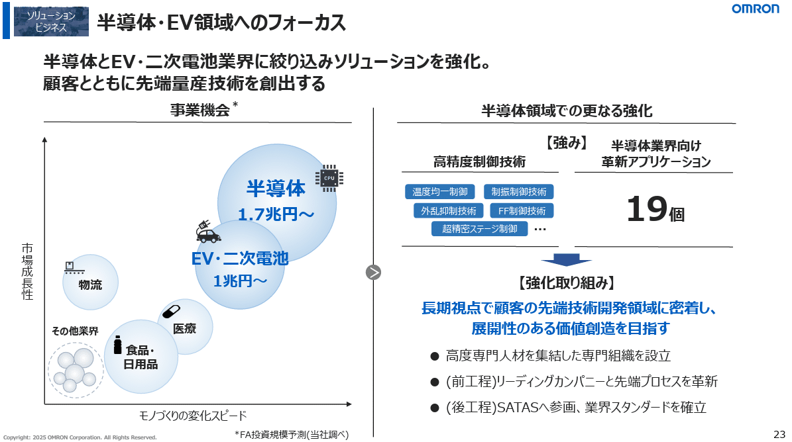
*オムロン株式会社のバブルチャートのデザイン例*

> 引用元：[> 決算プレゼンテーション資料](https://www.omron.com/jp/ja/ir/irlib/pdfs/20250508_presentation_j.pdf)

*https://www.omron.com/jp/ja/ir/irlib/kessan.html*

パワポの「バブルチャート」の特徴としては、**バブルチャートをサマリーとして使ったうえで事業戦略につなげている点**が挙げられます。バブルチャートのデザインは以下のようになっています。

- バブルチャートの縦軸：市場成長性

- バブルチャートの横軸：モノづくりの変化スピード

- バブルチャートのバブルの大きさ：FA投資規模予測

バブルチャートの横軸に「モノづくりの変化スピード」を上げている点が特徴的ですが、市場成長性とモノづくりの変化スピードがオムロンの市場選定における重要な評価軸であることがわかります。

余談ですがこのスライド、かなりコンサルファームっぽいんですよね。特に左と右を線で分けた上で、ボールで矢印を書いている点など。

### わかりやすい色分けのバブルチャートの例

続いてソニーフィナンシャルグループ株式会社のパワポにおける「バブルチャート」のデザインを見ていきましょう。
IR説明会資料のパワーポイントにある、損保事業｜業界ポジション・将来目指す姿のスライドです。

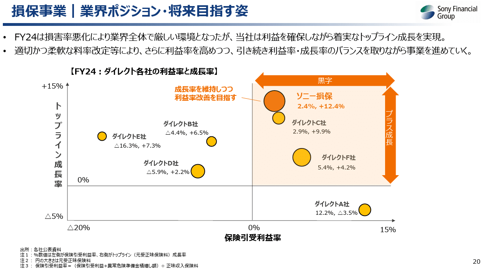
*ソニーフィナンシャルグループ株式会社のバブルチャートのデザイン例*

> 引用元：[> IR説明会資料](https://www.sonyfg.co.jp/ja/financial_info/management_vision/251201_01.pdf)

*https://www.sonyfg.co.jp/ja/ir/library/management_vision/*

パワポの「バブルチャート」の特徴としては、**バブルの色をオレンジにしつつ黒字成長領域をさらに濃いオレンジでハイライトしている点**が挙げられます。バブルチャートのデザインは以下のようになっています。

- バブルチャートの縦軸：トップライン成長率

- バブルチャートの横軸：保険引受利益率

- バブルチャートのバブルの大きさ：元受正味保険料

- バブルチャートの基準線：トップライン成長率0％、保険引受利益率0％

バブルチャートの右上の、トップライン成長率がプラスかつ保険引受利益率がプラスの領域をオレンジ色でハイライトしつつ、「黒字」かつ「成長」していることを濃いオレンジ色で強調しています。また自社のバブルだけ、強調に使っているのと同じオレンジ色を使っています。

### 使い方が変わっているバブルチャートの例

最後はウリドキ株式会社のパワポにおける「バブルチャート」のデザインを見ていきましょう。
2025年11月期 通期決算説明資料のパワーポイントにある、獲得対象カテゴリの拡充のスライドです。

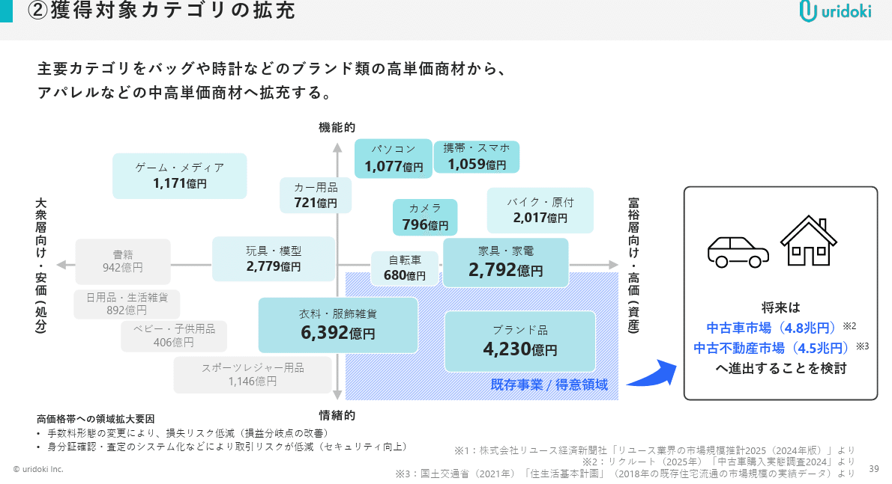
*ウリドキ株式会社のバブルチャートのデザイン*

> 引用元：[> 2025年11月期 通期決算説明資料](https://contents.xj-storage.jp/xcontents/AS06482/84421cec/8d6e/4798/ab41/ce18ef1ca47b/140120260114533094.pdf)

*https://uridoki.co.jp/ir/library/presentations/*

パワポの「バブルチャート」の特徴としては、**バブルの代わりに四角いボックスを使っている点**が挙げられます。バブルチャートのデザインは以下のようになっています。

- バブルチャートの縦軸：機能的か情熱的か

- バブルチャートの横軸：富裕層向けか大衆向けか

- バブルチャートのバブルの大きさ：市場規模（ただし厳密には比例していない）

自社の既存領域として、「富裕層向け・高値」かつ「情熱的」の領域をハイライトしています。バブルチャートの凡例は記載されていませんが、おそらく現在の取引の多さで、２段階の緑色をグラデーションのように使っていることがわかります。

## 【マネしたい】パワポの「バブルチャート」「散布図」スライド９選

以上、色々な企業のパワポを参考に「バブルチャート」「散布図」のデザインを紹介してきました。競合分析、ポートフォリオ分析、統計分析など、散布図もバブルチャートも様々な使い方ができることが伝わったのではないかと思います。

ちなみに**パワポ研で提供しているテンプレート集には、以下のようなそのまま使える「散布図」「バブルチャート」のテンプレートもあります**ので、気になる方は下で紹介しているオリジナルテンプレートのNoteも見てみてくださいね。

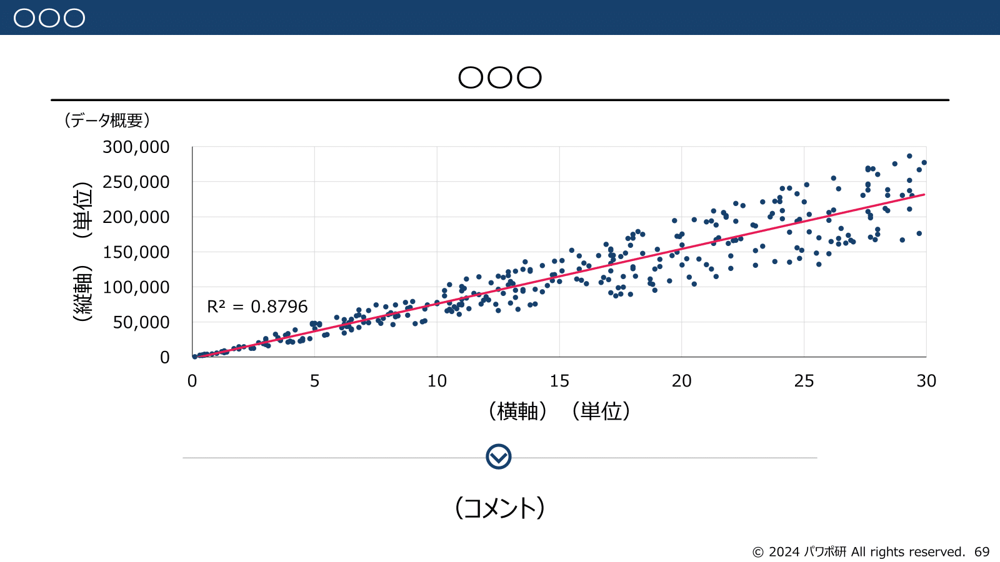
*パワポ研オリジナルテンプレートの散布図スライド*

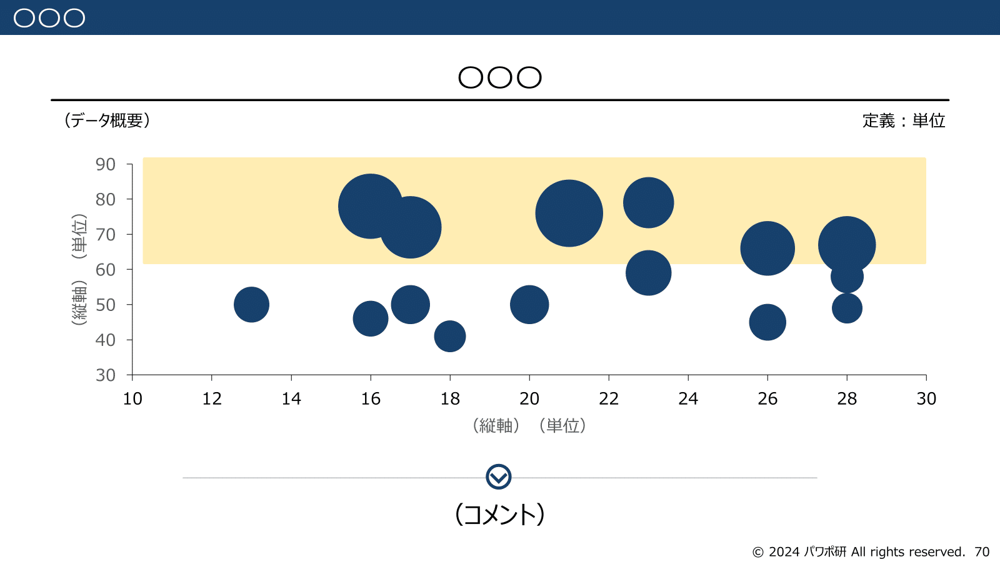
*パワポ研オリジナルテンプレートのバブルチャートスライド*

## パワポ研オリジナルテンプレート

パワポ研では、「ビジネスシーンで使える」パワーポイントテンプレートを公開しております。デザインを整えるのみならず、**ロジックやストーリーを整理するのにも役立つパッケージ**になっておりますので、関心のある方は下記ページも併せてご覧ください！

上記の記事のように、noteでは**フォローしているだけでビジネスにおける「資料作成のコツ」と「デザインのセンス」が身に付くアカウント**を目指して情報配信を行っています。
今後もコンスタントに記事を配信していく予定なので、関心のある方は是非アカウントのフォローをお願いします！

**> Template販売　**[> https://powerpointjp.stores.jp/](https://powerpointjp.stores.jp/%EF%BF%BCnote)
**> note　**[> パワポ研の資料作成術](https://note.com/powerpoint_jp/m/mc291407396da)
**> X（旧Twitter)　**[> https://twitter.com/powerpoint_jp](https://twitter.com/powerpoint_jp)

## レックスアドバイザーズからのお知らせ

パワポ研は株式会社レックスアドバイザーズが運営しています。
レックスアドバイザーズは**経営企画職や経営管理職に特化した転職エージェント**です。
上場企業や上場準備企業を中心に、**経営企画、IR、経理財務、法務、内部監査等の職種の求人**をご紹介しているほか、**CFOなどのコンフィデンシャル求人**もご紹介可能です。
またコンサルティングファームや監査法人、会計事務所の求人も豊富にあるため、プロフェッショナルファームを目指す方のご支援も得意です。
求人紹介やキャリア相談を希望の方は、[**無料転職サポート**](https://www.career-adv.jp/job_search/entryform_exp/)よりサービス利用登録をしてみてください。

*レックスアドバイザーズのサービスサイトはこちら*

**> 求人をご希望の方　**[> 無料転職サポート](https://www.career-adv.jp/job_search/entryform_exp/)**
> 採用支援をご希望の方　**[> 採用サポート](https://www.career-adv.jp/request3/)
**> その他　**[> お問い合わせフォーム](https://www.rex-adv.co.jp/contact)
**> 書籍　**[> 注目企業の実例から学ぶパワポ作成術](https://www.amazon.co.jp/dp/4046060476)

