# 【パワポ研直伝】パワポの「資金調達ピッチ」作成ポイントと参考スライド集 （2025年更新）

[note原文](https://note.com/powerpoint_jp/n/n6b6db49c6081)

みなさんこんにちは。
資料デザインのリサーチや分析に取り組むパワーポイントのスペシャリスト、パワポ研です。noteやXでパワポに関する情報発信をしています。

今回は**「資金調達ピッチ資料」**が必要な方に向けて、パワーポイント作成のポイントと参考になるスライドを紹介していきます。資料作成のノウハウを記載するだけでなく、実際に参考になるデザインを紹介していきます。
ページの最後にはパワポ研オリジナルの「資金調達ピッチ」テンプレートの紹介もあるので、ぜひ最後まで読んでみてくださいね。

## 資金調達ピッチ資料の作り方

最初に資金調達ピッチ資料の作り方の説明をしておきます。

ベンチャー企業の資金調達には、VCなどの機関投資家や個人のエンジェル投資家からの出資受入、銀行からの借入、クラウドファンディングなど様々なパターンがありますね。
いずれもパワーポイントの説明資料が必要になりますが、ここで使われれるが「資金調達ピッチ」です。特に資料の作り込みが求められるのは、**VCや個人投資家から出資を受ける際に使われる場合ですね。**

ピッチ資料を作成する目的は、投資家に「この事業は成長しそう、投資する価値がありそう」と思わせることです。自社の事業について理解してもらい、**投資家目線で「儲かる」ということを認識してもらう**。銀行からの借入であれば、「リスクが小さい」ことを認識してもらうのが目的です。

具体的にどのようなスライドが必要かというと、以下はマストです。
これに加えて、自社の強みを裏付ける根拠や基本情報を追加していきます。

- **事業内容や事業コンセプト**

- **解決したい課題や顧客のニーズ**

- **想定する市場の大きさ**

- **競争環境**

- **自社の競争優位性**

- **ビジネスモデルや商流**

- **現在の状況やトラクション （As is）**

- **目指す姿と成長戦略 （To be）**

- **調達した資金の使い道**

- **経営陣のプロファイル**

プレゼンテーション時間は、質疑応答やQ&Aを含めて最大1時間程度です。
スライドの説明は最初の20分程度なので、**プレゼンする部分はできるだけコンパクトに、必要十分な情報を厳選してまとめる**必要があります。加えてQ&Aで使う情報をAppendixに入れておきましょう。

では作成のポイントと参考スライド例を見ていきましょう。実際の資金調達ピッチは公開されていないので、目的が似ている「事業計画及び成長可能性に関する事項」のスライドを抜粋しています。

## 事業内容や事業コンセプトのスライド見本

事業内容や事業コンセプトの説明においては、**細かな機能の説明はできるだけ省略し、何を提供している事業なのかを端的に示すことが重要**です。投資家側は、過去の経験や知見、類似サービスと比較しながら、その事業に将来性がありそうかを考えます。

スライド作成の観点では、**シンプルでコンパクトにまとまった印象のデザインにすることが大切**です。まずは[【マネしたい】おしゃれなパワポの表紙スライド３０選](https://note.com/powerpoint_jp/n/na7d0cb4925f3)でも取り上げた株式会社ミライロ（2025年3月上場）のスライドは、1枚の中にサービスイメージとコンセプトがまとまっており参考になります。

*引用元：事業計画及び成長可能性に関する事項*

資金調達段階の企業においては、サービスの全体像が固まり切っていないこともあると思います。その場合は画像やイラストでコンセプトのイメージを伝えます。同じく2025年3月上場のダイナミックマッププラットフォーム株式会社のスライドが参考になりますよ。

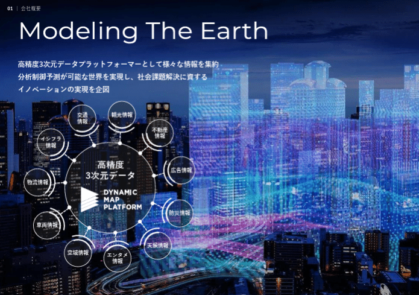
*引用元：事業計画及び成長可能性に関する事項*

## 解決したい課題や顧客ニーズのスライド見本

顧客の課題（ペインポイント）やニーズの説明においては、**シンプルでインパクトのある数字を持ってくる**パターンと、**複数のファクトから論理的に説明する**パターンがあります。まずは数字を使うスライドとして2025年2月に上場した株式会社TENTIALのスライドを見てみましょう。

*引用元：事業計画及び成長可能性に関する事項*

次は[【マネしたい】見やすいパワポの「棒グラフ」「複合グラフ」スライド９選](https://note.com/powerpoint_jp/n/n285958fc3427)でも紹介したウェルネスコミュニケーションズ株式会社（2025年6月上場）のスライドを見てみましょう。法令への対応と社会環境の変化を詳細に記載したうえで、自社サービスへのニーズの高さを説明しています。

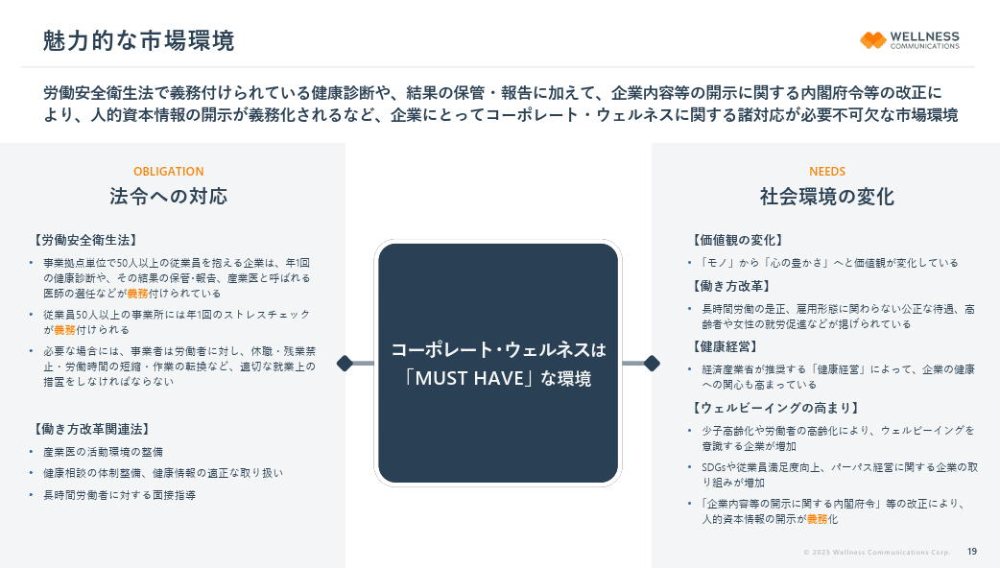
*引用元：事業計画及び成長可能性に関する事項*

## 想定する市場の大きさのスライド見本

事業ポテンシャルを示すスライドは、会社のフェーズによって望ましい形が変わります。初期フェーズの企業は、**目の前に狙える市場があることが大切**ですし、一定成長した企業は、**将来的な拡大余地があることが大切です**。市場規模の推定においては、できる限り一次情報を根拠にしつつ、必要に応じ権威性のある調査機関のデータを使うことで、信憑性が増します。
2025年4月に上場したデジタルグリッド株式会社のスライドを2枚見てみましょう。

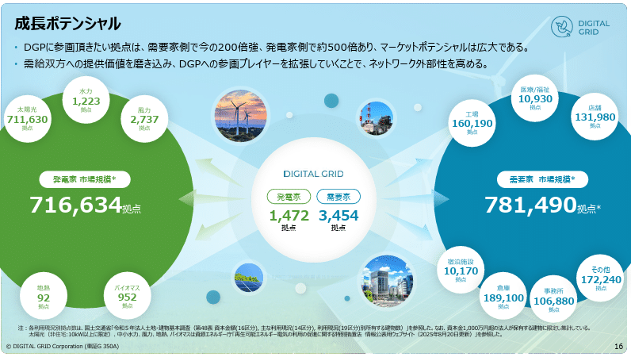
*目の前の狙える市場を示したスライド*

*ポテンシャルを示す、TAM・SAM・SOMのスライド*

> 引用元：[> 決算説明資料（事業計画及び成長可能性に関する事項）の追加資料について](https://ssl4.eir-parts.net/doc/350A/tdnet/2686579/00.pdf)

*https://www.digitalgrid.com/ir/library/presentation/*

次に先ほども見た株式会社ミライロの資料も見てみましょう。こちらは直接的に市場規模を書いているわけではありませんが、市場が拡大してきて、今後も拡大していくことがシンプルな数字で示されています。

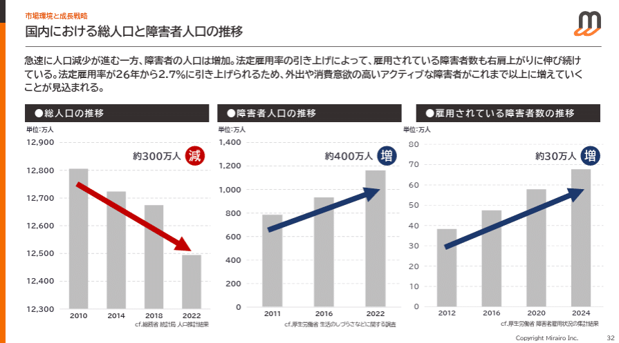
*引用元：事業計画及び成長可能性に関する事項*

## 競争環境のスライド見本

競争環境の説明においては、競合と自社の違いをまとめていきます。自社のポジションの説明もするため、重要度の高いスライドです。
**ポイントはできるだけ客観的な見方を示すこと**です。そのためには納得できる軸の設定と評価基準があるとよいです。
ここでは再び株式会社TENTIALのスライドを見てみましょう。

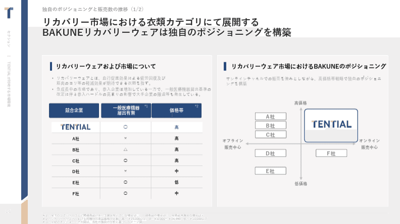
*引用元：事業計画及び成長可能性に関する事項*

これから拡大していく企業の場合、ポジショニングではなく、競合を一覧化して見せるのも手です。2025年4月に上場した株式会社LOIVE（旧株式会社Life Create）の資料はデザインとしてはややビジーですが、狙いは参考になります。

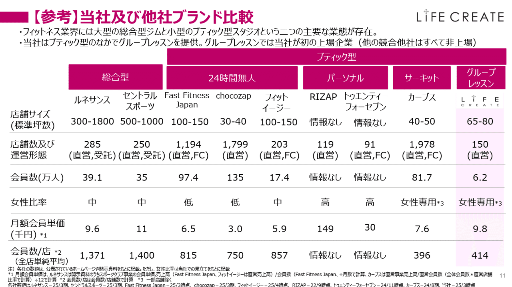
*引用元：事業計画及び成長可能性に関する事項PDF*

## 自社の競争優位性のスライド見本

自社の強みを示すにあたっては、業界一般と比較するパターンと具体的な競合と比較するパターンがあります。強みは、**技術優位性、事業資産、ビジネスモデル、アライアンス、チームメンバーの経験、**等から選びます。補足としてメディア掲載実績や「顧客の声」も**実際のエビデンスとして、顧客が何を良いと思っているのかを示す**ことができるので有効です。
[【マネしたい】カッコいいパワポの「会社概要」スライド９選](https://note.com/powerpoint_jp/n/na98a8a3288b8)でも取り上げたダイナミックマッププラットフォーム株式会社の事例が参考になります。当社は日系自動車メーカー全社のバックアップを受けていること、これまで築いてきた事業資産が強みの源泉です。

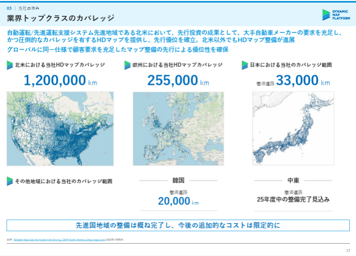
*引用元：事業計画及び成長可能性に関する事項*

次は競合と比較している事例を見てみましょう。[【マネしたい】戦略が伝わるパワポの「事業紹介」スライド９選](https://note.com/powerpoint_jp/n/nabc9e703e7b9#84571310-efef-4953-9d3a-510b7c6917fa)でも紹介した、株式会社PRISM Biolabの事例を見ていきましょう。ここでは医薬品のコンセプトについて、他の選択肢に比べて自社が優位であることを、いくつかの項目で横比較して示しています。

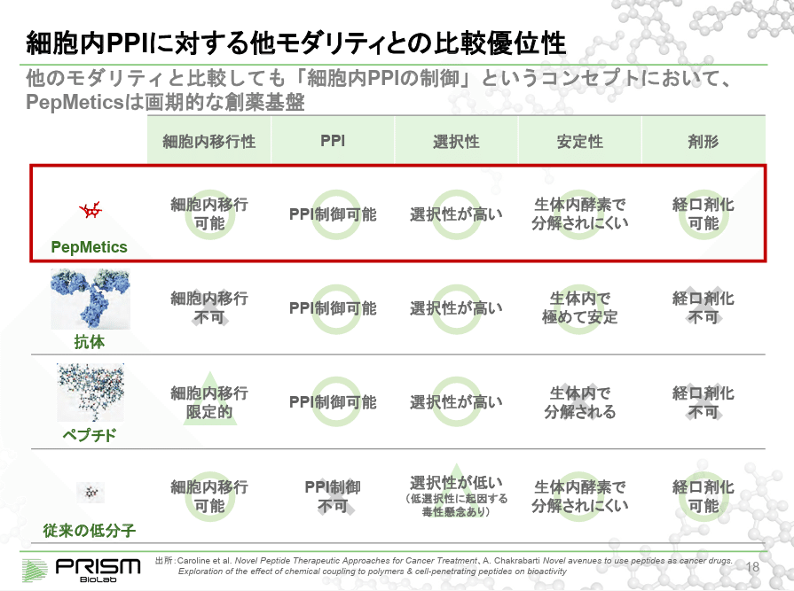
*引用元：2024年9月期 決算説明会資料*

## ビジネスモデルや商流のスライド見本

ビジネスモデル（全体のモノ・サービスとカネの流れ）の説明は、**図にして説明することで、双方の理解にズレがないように**するために重要です。記号や矢印は意外と探すのが手間なので、自分のテンプレートを持っていると便利ですね。
まずは[【マネしたい】要点がまとまっているパワポの「エグゼクティブサマリー」スライド９選](https://note.com/powerpoint_jp/n/nfa3e08dcd6f5)でも取り上げた株式会社ダイブのスライドを見てみましょう。

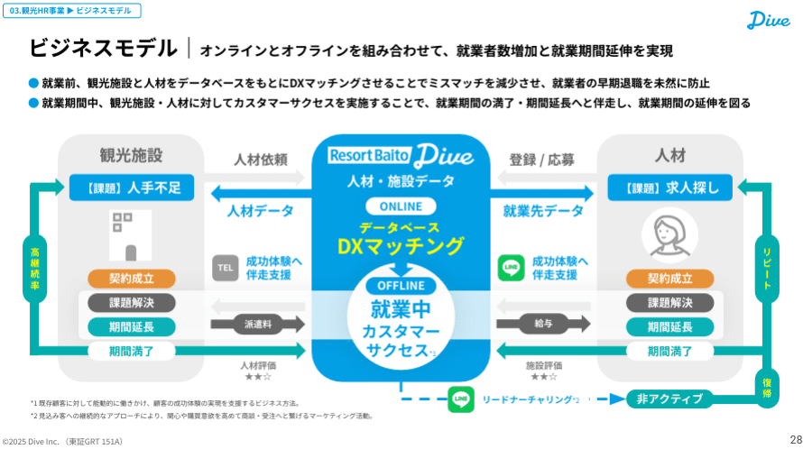
*引用元：2025年6月期 通期決算説明資料（事業計画及び成長可能性に関する事項）*

いわゆるビジネスモデル図に加えて、料金モデルやKPIも一緒に示すことで、より事業について理解しやすくなります。ここでは再びウェルネスコミュニケーションズ株式会社のスライドを見てみましょう。

*引用元：事業計画及び成長可能性に関する事項*

## 現状やトラクション （As is）のスライド見本

現在の状況を説明するにあたっては、**将来の成長に向けて着実にステップを踏んでいることを示すのが大切**です。トラクションが伸びているならそれをわかりやすく示せばよいですし、そうでない場合はプロダクトの開発状況などを示すのが必要です。
まずは[【マネしたい】見やすいパワポの「円グラフ」スライド９選](https://note.com/powerpoint_jp/n/n6bafe5e67864)でも取り上げた株式会社タイミーのスライドから見てみましょう。

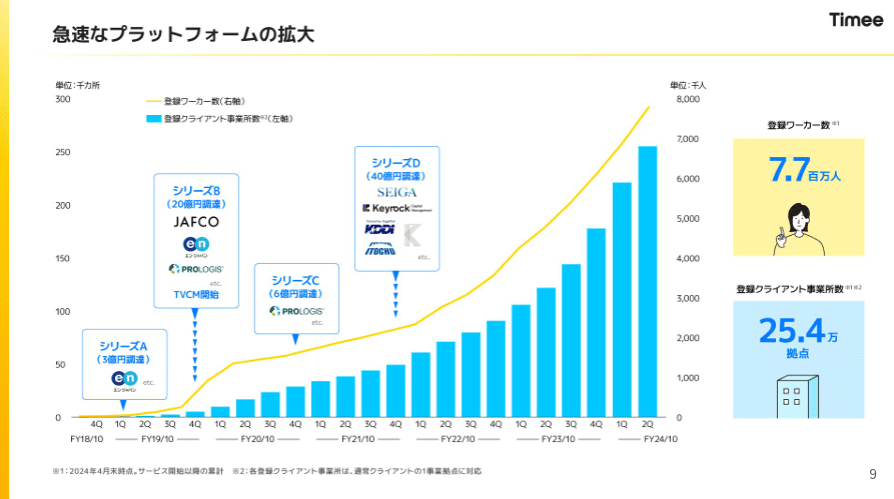
*引用元：事業計画及び成長可能性に関する事項*

投資段階の企業の例として、ここまでも何度か紹介しているダイナミックマッププラットフォーム株式会社のスライドを見てみましょう。大手の自動車メーカーと取引していることや、官公庁との関連が深いことを持って、事業が順調であることを示しています。

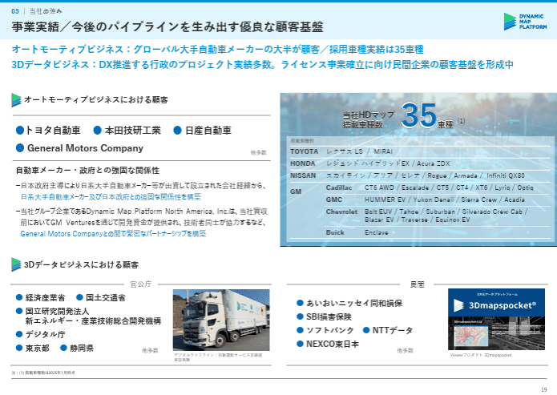
*引用元：事業計画及び成長可能性に関する事項*

## 目指す姿と成長戦略 （To be）のスライド見本

成長戦略の説明においては、**これまで培ってきた経験や資産をどうレバレッジするか、収益を変えていくかを端的に示すこと**が重要です。投資家としては**、次回の資金調達活動（ラウンド）までの達成目標、目指す姿を見たい**ので、中期的な絵姿と長期的な絵姿が必要です。
ここでは再びウェルネスコミュニケーションズ株式会社のスライドを見てみましょう。ステップで成長戦略を見せることで非常に見やすい事例です。

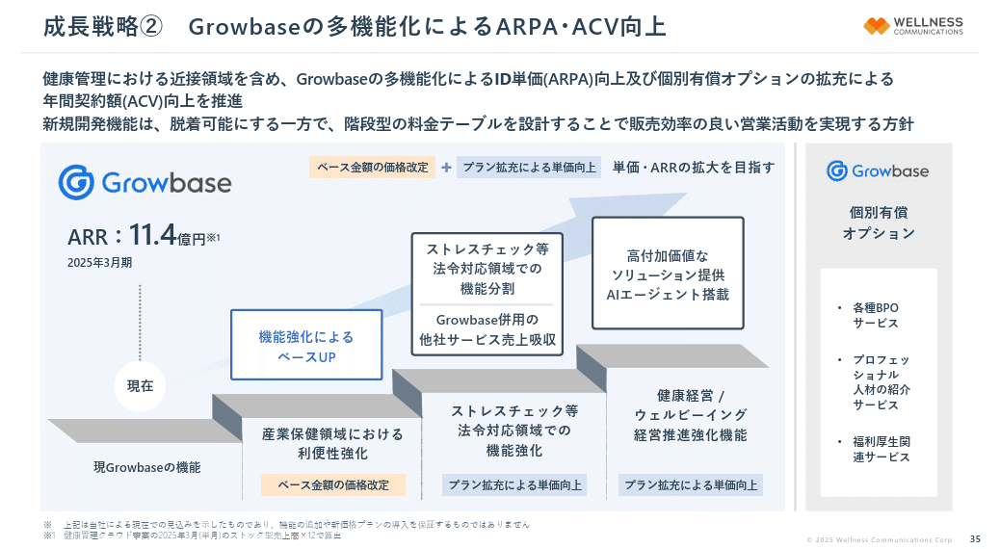
*引用元：事業計画及び成長可能性に関する事項*

ロードマップとして見せるのも有効な手段です。株式会社ダイブのスライドを見てみましょう。なお資金調達ピッチにおいては、**時期や取り組みやKPIをもう少し具体に書いていく必要**があります。

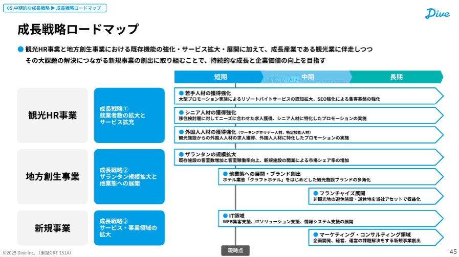
*引用元：2025年6月期 通期決算説明資料（事業計画及び成長可能性に関する事項）*

## 調達した資金の使い道のスライド見本

調達資金の使用用途の説明においては、**調達した資金の投資により課題が解決し、成長スピードが上がることを示す**のが重要です。また資金調達は一度ではなく、次のラウンドに入るためのゴールが設定されます。その意味でも、**「資金使途」を具体的に記載することが求められます**。
わかりやすい例として、[【マネしたい】見やすいパワポの「折れ線グラフ」スライド９選](https://note.com/powerpoint_jp/n/n4d105e11f613)でも取り上げた株式会社フライヤーのスライドと、これまでも見てきた株式会社ミライロのスライドを見てみましょう。

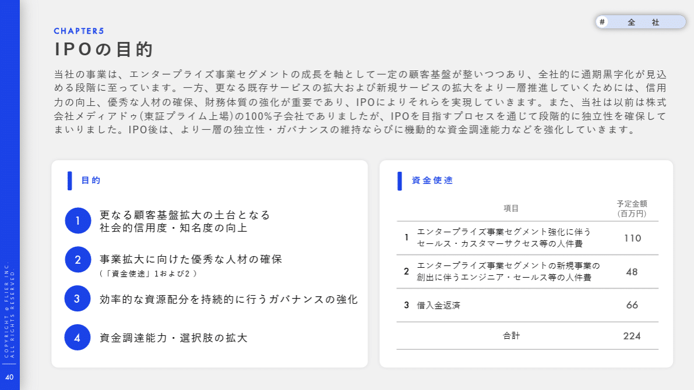
*引用元：2025年2月期通期 決算説明資料*

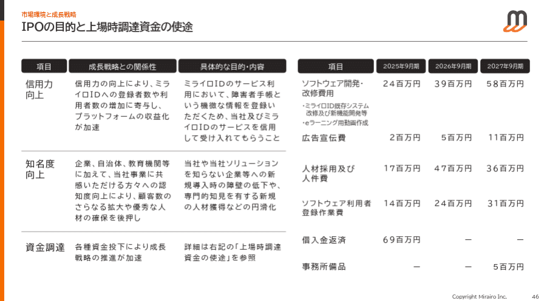
*引用元：事業計画及び成長可能性に関する事項*

## 経営陣のプロファイルのスライド見本

経営チームを表すスライドでは、投資家に「このチームならやり切ってくれそうだ」と思わせることが重要です。**誰がやっているのか、は投資判断において最も重要な要素**といっても過言ではありません。
パターンとしては代表の想いや経歴に全振りするパターンと、チームを押すパターンの両方があるので、前者は2024年12月に上場したGVA TECH株式会社、後者は株式会社TENTIALの事例を見てみましょう。

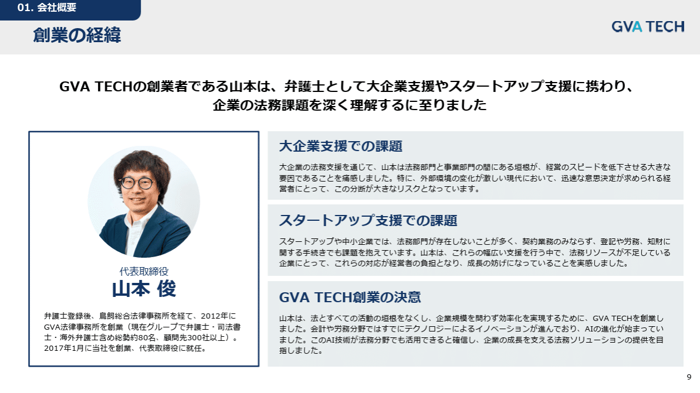
*引用元：事業計画及び成長可能性に関する事項について*

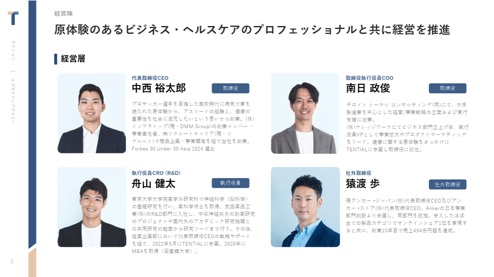
*引用元：事業計画及び成長可能性に関する事項*

## パワポの「資金調達ピッチ」作成ポイントと参考スライド集まとめ

いかがでしたでしょうか。資金調達ピッチの中核となるスライドについて、様々なパターンで参考になる事例を用意しました。皆様のパワーポイント作成のお役に少しでも立っていれば幸いです。

## パワポ研の「資金調達ピッチ」テンプレート

パワポ研では**「資金調達ピッチ資料」にそのまま使えるパワーポイントテンプレート**を公開しております。デザインを整えるのみならず、**ロジックやストーリーを整理する**のにも役立つパッケージになっておりますので、関心のある方はサンプルをダウンロードしてみてくださいね。

   [    **パワポ研_資金調達ピッチ資料_v1（0. サンプル）.pdf** 1010 KB  ファイルダウンロードについて      

ダウンロード
   ](https://note.com/api/v2/attachments/download/1dc15a2ff5bfaa15a5b830b674db2715)   なおパワポ研では「資金調達ピッチ」以外にも様々なテンプレートやスライド集を用意しています。お得なまとめパッケージもありますので、気になる方はクリエイターページのストアをご確認ください。

 
[
**
パワポ研の商品一覧｜note
**

フォローしているだけでビジネスにおける「資料作成のコツ」と「デザインのセンス」が身に付くアカウント。

note.com

](https://note.com/powerpoint_jp/store)

 
*テンプレート一覧はこちらから*

パワポ研では**フォローしているだけでビジネスにおける「資料作成のコツ」と「デザインのセンス」が身に付くアカウント**を目指して情報配信を行っています。
今後もコンスタントに記事を配信していく予定なので、関心のある方は是非アカウントのフォローをお願いします！

**> Template販売　**[> https://powerpointjp.stores.jp/](https://powerpointjp.stores.jp/%EF%BF%BCnote)
**> note　**[> パワポ研の資料作成術](https://note.com/powerpoint_jp/m/mc291407396da)
**> X（旧Twitter)　**[> https://twitter.com/powerpoint_jp](https://twitter.com/powerpoint_jp)

## レックスアドバイザーズからのお知らせ

パワポ研は株式会社レックスアドバイザーズが運営しています。
レックスアドバイザーズは**経営企画職や経営管理職に特化した転職エージェント**です。
上場企業や上場準備企業を中心に、**経営企画、IR、経理財務、法務、内部監査等の職種の求人**をご紹介しているほか、**CFOなどのコンフィデンシャル求人**もご紹介可能です。
またコンサルティングファームや監査法人、会計事務所の求人も豊富にあるため、プロフェッショナルファームを目指す方のご支援も得意です。
求人紹介やキャリア相談を希望の方は、[**無料転職サポート**](https://www.career-adv.jp/job_search/entryform_exp/)よりサービス利用登録をしてみてください。

*レックスアドバイザーズのサービスサイトはこちら*

**> 求人紹介をご希望の方　**[> 無料転職サポート](https://www.career-adv.jp/job_search/entryform_exp/)**
> 採用支援をご希望の方　**[> 採用サポート](https://www.career-adv.jp/request3/)
**> その他　**[> お問い合わせフォーム](https://www.rex-adv.co.jp/contact)
**> 書籍　**[> 注目企業の実例から学ぶパワポ作成術](https://www.amazon.co.jp/dp/4046060476)

