# 【マネしたい】おしゃれなパワポの「円グラフ」スライド９選 （2026年更新）

[note原文](https://note.com/powerpoint_jp/n/n6bafe5e67864)

みなさんこんにちは。
資料デザインのリサーチや分析に取り組むパワーポイントのスペシャリスト、パワポ研です。

今回は、パワポのおしゃれな「円グラフ」スライドに焦点を当て、上場企業のIR資料から見やすい円グラフや、見せ方のうまい円グラフのスライドを紹介していきます。

テーマ別のスライドを紹介するNoteのまとめ記事はこちら。

おしゃれなデザインのパワポによく使われる円グラフですが、実は作成する上で注意が必要です。というのも、円グラフは長所と短所がはっきりしており、パワポ作成においては円グラフを使うべきシーンと使うべきでないシーンがはっきりと分かれるからです。具体的なパワポの円グラフ例を紹介する前に少し説明しておきましょう。

## 円グラフの特徴とパワポ作成時の注意点

パワポにおいて円グラフは、売上や利益の構成内訳、従業員の属性内訳、株主内訳、市場シェアなどのスライドに使われることが多いです。**つまり内訳やパーセンテージが視覚的に伝わりやすいデザインにする際によく作成される**という特徴を持っています。

そうした円グラフですが、作成する上で意識したい特徴があります。それは**スライド上で一定の面積を取る割に、情報量が限定されるデザイン**であるという点です。余談ですがコンサルティングファームのパワーポイント研修では、「円グラフは紙面を使う割に情報量が限られるので、あまり作成する機会はありません」と教わります。

ではどういった場合に円グラフが有効かというと、以下の３つの見せ方が多いです。

- **円グラフを使って見やすいデザインのパワポにする**

- **円グラフを使って重要な情報をパワポ上で強調する**

- **円グラフを使ってパワポ上で内訳やパーセンテージをおしゃれに見せる**

今回の事例紹介においても、上記の３つの見せ方の事例にフォーカスして紹介していきます。では行きましょう！

## おしゃれで見やすいパワポの円グラフ３選

まずは視覚的に理解しやすいという円グラフの特長を生かして、おしゃれで見やすいパワポのデザインにしている例を見ていきましょう。円グラフを中心に、付加情報をうまく整理しているパワポが多いです。

### 円グラフと売上内訳のパワポ例

まずは株式会社FUNDINNOのパワポにおける「円グラフ」のデザインから見ていきましょう。
2025年10月期 決算説明資料のパワーポイントにある、事業構成：営業収益比率のスライドです。

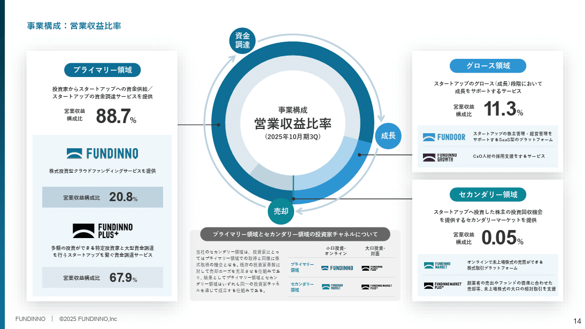
*株式会社FUNDINNOのパワポの円グラフ*

> 引用元：[> 2025年10月期 決算説明資料](https://ssl4.eir-parts.net/doc/462A/tdnet/2730565/00.pdf)

*https://corp.fundinno.com/ir/library/presentation/*

パワポの「円グラフ」の特徴として、**円グラフを中心において、売上の内訳詳細を外側にボックスで整理**しています。「プライマリー領域」「グロース領域」「セカンダリー領域」の３つのセグメントごとにボックスで整理されていて見やすいだけでなく、プライマリー領域のボックスの中も内訳が整理され、FUNDINNOとFUNDINNNO PLUS+の売上比率が入っています。
円グラフとテキストボックスが整然と並べられることで、おしゃれで見やすいパワポとなっていますね。

また円グラフの外側に「資金調達」「成長」「売却」という企業のライフサイクルを入れているほか、円グラフの下に補足情報として「プライマリー領域とセカンダリー領域の投資家チャネルについて」をまとめており、１枚のスライドで情報が十分に伝わりますね。

### 円グラフとサービス詳細のパワポ例

続いて株式会社ジンジブのパワポにおける「円グラフ」のデザインを見ていきましょう。
2025年3月期 通期 決算説明資料 中期経営計画 説明資料 （事業計画及び成長可能性に関する事項）のパワーポイントにある、サービスラインナップと売上高構成比のスライドです。

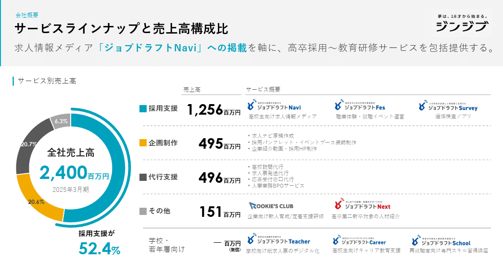
*株式会社ジンジブのパワポの円グラフ*

> 引用元：[> 2025年3月期 通期 決算説明資料 中期経営計画 説明資料 （事業計画及び成長可能性に関する事項）](https://ssl4.eir-parts.net/doc/142A/tdnet/2619236/00.pdf)

*https://jinjib.co.jp/ir/library/presentation/*

パワポの「円グラフ」の特徴としては、**円グラフを見やすいサマリーとして左側に表示し、右側でサービスラインナップを具体的に紹介している点**が挙げられます。円グラフで「採用支援」「企画制作」「代行支援」「その他」の４つのセグメント別の売上構成を見せ、右側でそれぞれの事業セグメントがどういうサービスブランドを展開しているのか、具体的に何をしているのかを紹介しています。

このデザインであれば、**実は左側は100％棒グラフでも問題はありません**。100％棒グラフの方がスペースは小さく済むので、具体的な内訳を詳細に書きやすいというメリットもあります。
しかしながら円グラフを使う方がおしゃれかつ直感的で見やすいパワポになるというメリットがあるので、**円グラフのサイズを押さえてデメリットを消しつつ、バランスを取っているわけ**ですね。

### 市場内訳が見やすい円グラフのパワポ例

次はコージンバイオ株式会社のパワポにおける「円グラフ」のデザインです。
2025年３月期通期決算説明資料のパワーポイントにある、エグゼクティブサマリー（２／１０）：当社の対峙する市場のスライドを見ていきましょう。

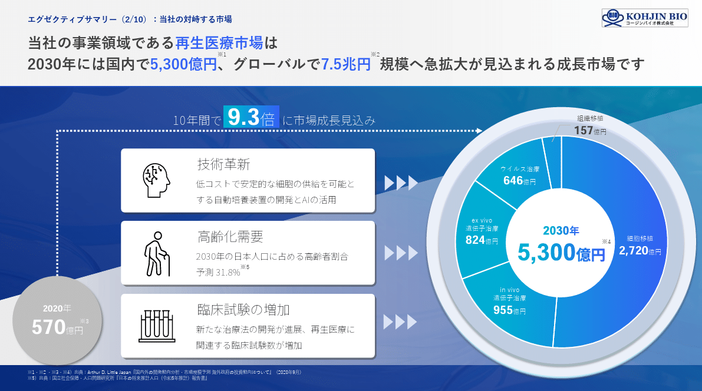
*コージンバイオ株式会社のパワポの円グラフ*

> 引用元：[> 2025年３月期通期決算説明資料](https://kohjin-bio.jp/wp-content/uploads/2025_03_Financial_Report.pdf)

*https://kohjin-bio.jp/ir/*

パワポの「円グラフ」の特徴としては、**中心に市場規模の合計があり、円グラフの内訳で各セグメントの市場規模を見せている点**が挙げられます。いわゆるドーナツ円グラフを使った見せ方ですね。
中心に再生医療市場全体の市場規模である5,300億円という数値があり、内訳として「細胞移植」「in vivo 遺伝子治療」「ex vivo 遺伝子治療」「ウイルス治療」「組織移植」の各市場規模があります。

メインとなっている2030年の市場規模の円グラフに加えて、左側には2020年の市場規模が円で記載されています。**円グラフの強みとして、円の大きさを変化させることで市場の大きさを示せるので、市場自体の伸びと市場の内訳を見やすい形で同時に見せたい場合には、円グラフは有効なデザイン**となります。市場規模が9.3倍になる上でのドライバーを間に入れている点や、9.3倍のハイライトの色を円グラフの色と揃えている点もよいですね。

## 円グラフを使って強調するパワポ３選

続いては円グラフを使って強調しているパワポの例を見てきましょう。
特定の数字を「強調」したい場合に円グラフを使っておしゃれで見やすいデザインに仕上げるのは、パワポでもよくある手法です。
決算説明資料や成長可能性の説明資料において、**市場の大きさや競合優位性を自社の特徴に絡めて説明する場合に、強調は有効な手法**ですよね。

### シンプルな円グラフで強調するパワポ例

まずは株式会社unerryのパワポにおける「円グラフ」のデザインから見ていきましょう。
2025年6月期通期 決算説明資料のパワーポイントにある、unerryが解決する課題のスライドです。

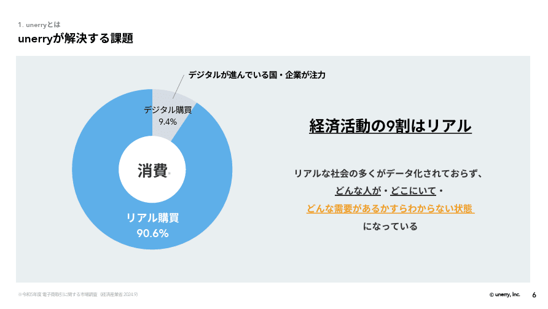
*株式会社unerryのパワポ*

> 引用元：[> 2025年6月期通期 決算説明資料](https://contents.xj-storage.jp/xcontents/AS82460/42cb224e/d3dc/493d/aced/dd7acff9c7b3/140120250812539357.pdf)

*https://www.unerry.co.jp/ir/news/*

パワポの「円グラフ」の特徴として、**シンプルな割合データで円グラフを作成し、スライドの半分近くを使って強調している点**が挙げられます。「消費の90％がリアル消費である」という事実を伝えるために、消費におけるデジタルとリアルの比率を示す円グラフをメインに据えています。

**パワポの円グラフの配色としては、ブルーオーシャンをイメージさせる青色**を使っています。逆にセキュリティ領域で**リスクの円グラフを出す場合は黒色や赤色など恐怖心をあおる配色にすると効果的**です。単に見やすい色ということではなく、強調する上で効果的な色を使うことが重要です。

### 円グラフでシェアを強調するパワポ例

続いてローランド株式会社のパワポにおける「円グラフ」のデザインです。
決算説明会資料のパワーポイントにある、主要製品カテゴリーで高い市場シェアを保持のスライドを見ていきましょう。

*ローランド株式会社のパワポの円グラフ*

> 引用元：[> 決算説明会資料](https://ir.roland.com/ja/ir/library/result/main/00/teaserItems2/0111/linkList/0/link/Presentation%20material%20for%20the%20financial%20result%20of%20FY2025_J.pdf)

*https://ir.roland.com/ja/ir/library/result.html*

パワポの「円グラフ」の特徴として、**規則的に円グラフを並べた上で自社のシェアのみを強調している点**が挙げられます。主要製品ごとに製品画像と円グラフがありますが、円グラフは自社とその他の二つのみに分かれており、自社のシェアがコーポレートカラーのオレンジ色、他社のシェアがグレー色となっています。

パワポの円グラフでシェアを見せるときにはパーセンテージを入れることが多いですが、ここではパーセント表示はせず、オレンジ色に白抜きのシェア順位のみとなっています。シンプルな円グラフの見せ方で、おしゃれで見やすいパワポに仕上がっています。

### 円グラフで変化を強調するパワポ例

次は株式会社Macbee Planetのパワポにおける「円グラフ」のデザインを見ていきましょう。
2024年４月期 通期決算説明資料のパワーポイントにある、対象市場：インターネット広告市場のスライドです。

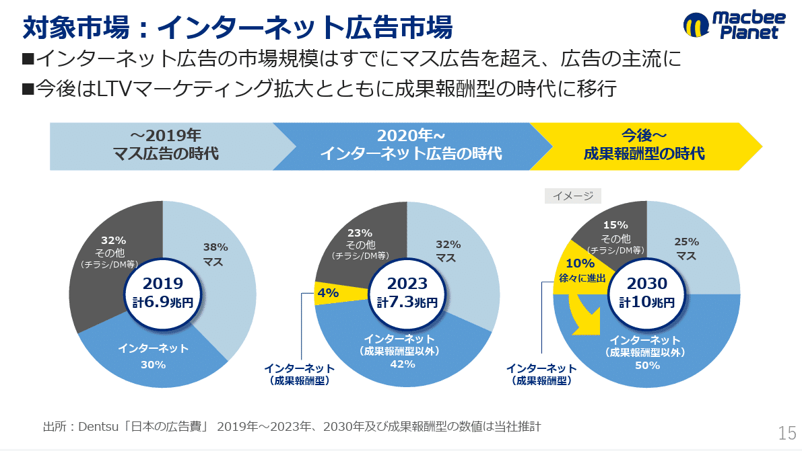
*株式会社Macbee Planetのパワポ*

> 引用元：[> 2024年４月期 通期決算説明資料](https://macbee-planet.com/ir/upload_file/tdnrelease/7095_20240612527689_P01_.pdf)

*https://macbee-planet.com/ir/backno.html*

パワポの「円グラフ」の特徴としては、**時系列でのパーセンテージの変化を示すことで、一部の変化を強調するデザイン**となっています。日本における広告費の内訳を、マス広告、インターネット広告（成果報酬型以外）、インターネット（成果報酬型）、その他に分けて、内訳の変化を見せています。

パワポの円グラフで内訳を見せるにあたって、基本は青系の色とグレー色を使っていますが、一部のインターネット（成果報酬型）だけが黄色になっています。**自社の主要マーケットが拡大してきていることを強調**するために、強調したい一部を反対色にしているわけですね。また３つのフェーズにおける最後を黄色にしていますが、**円グラフで強調に使っている黄色とリンクさせる**ことで、おしゃれなデザインのパワポになっています。

これも棒グラフで示すこともできますが、**パーセンテージが10％くらいの場合、棒グラフだとあまり強調できません**。円グラフだと面積が大きいため、今回のように配色によって一部を強調でき、見やすいパワポになります。

## 見せ方がおしゃれなパワポの円グラフ３選

最後は、パワポの円グラフを使った、見せ方がおしゃれなデザインのスライドを見ていきましょう。応用形ではありますが、そのままマネできるようなパワポの円グラフの見せ方もあるので、是非覚えておいてください。

### 単色のドーナツ円グラフのパワポ例

まずは株式会社電通のパワポにおける「円グラフ」のデザインから見ていきましょう。
2024年度通期 説明会資料のパワーポイントにある、2024年度地域別オーガニック成長率のスライドです。

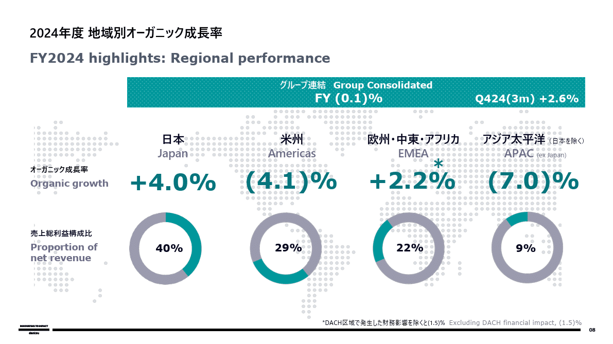
*株式会社電通のパワポの円グラフ*

> 引用元：[> 2024年度通期 説明会資料](https://ssl4.eir-parts.net/doc/4324/ir_material_for_fiscal_ym1/171123/00.pdf)

*https://www.group.dentsu.com/jp/ir/library/conferencematerials/*

パワポの「円グラフ」の特徴としては、**単色のドーナツ円グラフを使いスタイリッシュな見せ方にしている点**が挙げられます。日本、米州、欧州・中東・アフリカ、アジア太平洋の４つの地域に分け、全体の売上に対するパーセンテージをドーナツ円グラフで視覚的に示しています。

総売上に対する各地域のパーセンテージと成長率を見せたいだけであれば、このような見せ方でなくとも、一つの円グラフを作成するだけで十分です。しかしながらパワーポイントの資料としては少し物寂しくなりますよね。

そこで**地域別に４つのドーナツ円グラフを作成し、背景に世界地図を配置することによって**、おしゃれで見やすいパワポのデザインにしています。グレーバックに緑色の単色で作成した円グラフという組み合わせもスタイリッシュでおしゃれな印象を与えます。

### ドーナツ円グラフで内訳を見せるパワポ例

続いて株式会社アインホールディングスのパワポにおける「円グラフ」のデザインを見ていきましょう。
決算説明会資料のパワーポイントにある、さくら薬局グループ取得による店舗展開のスライドです。

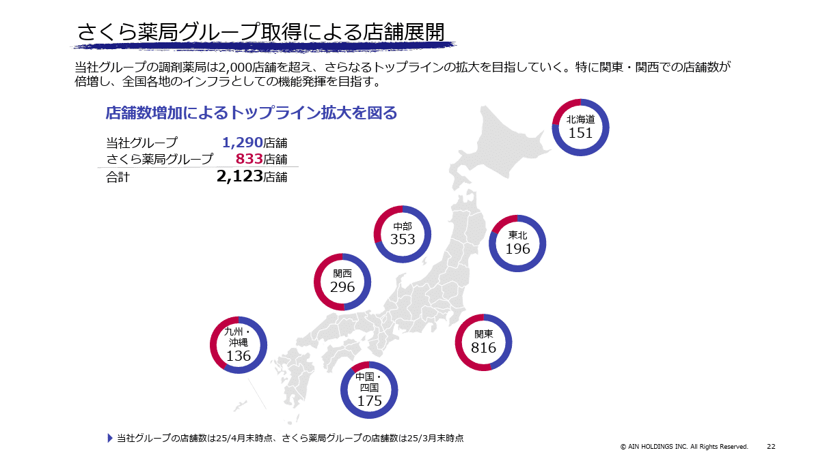
*株式会社アインホールディングスのパワポの円グラフ*

> 引用元：[> 決算説明会資料](https://www.ainj.co.jp/corporate/ir/library/financial/assets/upload/ir_2025_4q.pdf)

*https://www.ainj.co.jp/corporate/ir/library/financial/2025/*

パワポの「円グラフ」の特徴としては、**２色のドーナツ円グラフを使って２社の店舗数の比率を示す見せ方**が挙げられます。地域ごとに、アイングループとさくら薬局の店舗数がどのようなバランスになっているかをドーナツ円グラフで見せています。

円グラフは割合を視覚的に理解しやすいという特徴があるので、**円グラフの特徴的な見せ方として、パーセンテージや文字を省くことが**できます。
またアインホールディングスとさくら薬局グループを反対色で色分けすることで、「アイングループが地方に強い一方で、買収したさくら薬局が関東や関西に強く、全国的に統合のメリットが大きい」ということが一目でわかります。スライド全体を２色でシンプルに見せていることもあり、おしゃれで見やすい円グラフのパワポとなっています。

### 見せ方や色がおしゃれな円グラフ例

最後は株式会社pluszeroのパワポにおける「円グラフ」のデザインです。
2024年10月期通期 決算説明資料のパワーポイントにある、技術力が高い人材を安定的に採用・継続雇用のスライドを見ていきます。

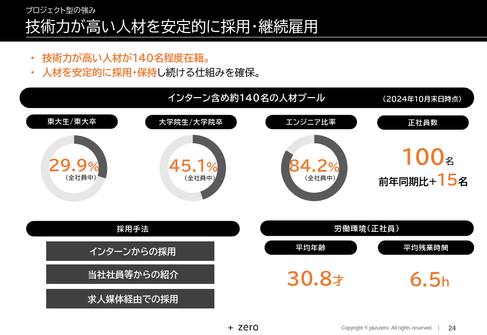
*株式会社pluszeroのパワポの円グラフ*

> 引用元：[> 2024年10月期通期 決算説明資料](https://contents.xj-storage.jp/xcontents/AS09142/fb77e3e2/d342/4ef7/9f3b/311c0b5c402a/140120241211536803.pdf)

*https://plus-zero.co.jp/ir/presentations/*

パワポの「円グラフ」の特徴としては、**「数字で見る」フォーマットの中に円グラフを入れ込んでいる点**が挙げられます。パワポの中で色々な数字が示されていますが、人材プールにおける「東大生や東大卒の比率」「大学院生や大学院卒の比率」「エンジニア比率」といった強調したい要素について円グラフが使われています。

「数字で見る」フォーマットは、パワポでも近年使われることが増えており、重要なKPIを見やすい形で整理したい際に使える見せ方です。割合や内訳を示すことが多いので、スライド内に円グラフがよく使われます。

配色は、**AIベンチャーらしい黒を基調としたシックなデザインの中に、あえてオレンジでパーセント表示**となっています。黒とオレンジは意外に相性がよく、見やすいおしゃれなパワポとなっています。

## 【マネしたい】おしゃれなパワポの「円グラフ」スライド９選まとめ

パワポの作成において「円グラフ」は使い方が難しいものの、うまく使うことで、**おしゃれで見やすいデザインにできる、重要な情報を強調できる、内訳やパーセンテージをおしゃれに見せる**といったメリットがあることお伝え出来たかと思います。

ちなみに**パワポ研で提供しているテンプレート集には、以下のようなそのまま使える「円グラフ」のテンプレートもあります**ので、気になる方は下で紹介しているオリジナルテンプレートのNoteも見てみてくださいね。

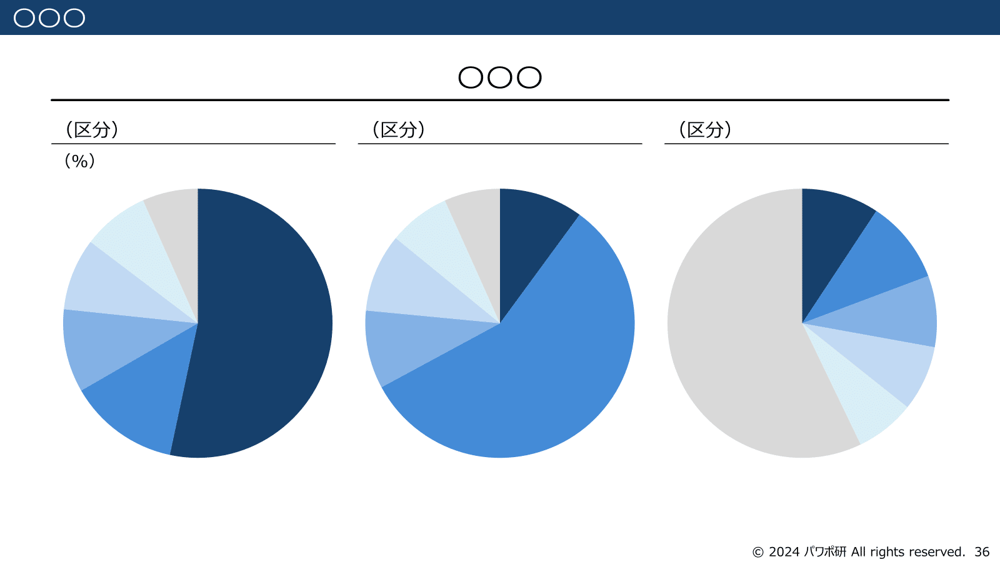
*パワポ研オリジナルテンプレートの円グラフのスライド*

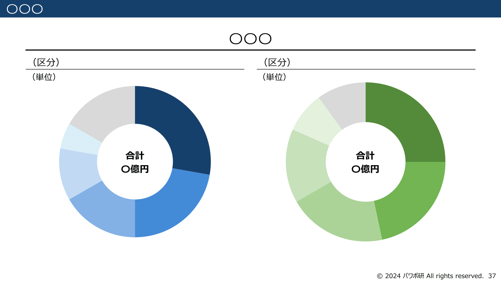
*パワポ研オリジナルテンプレートのドーナツ円グラフのスライド*

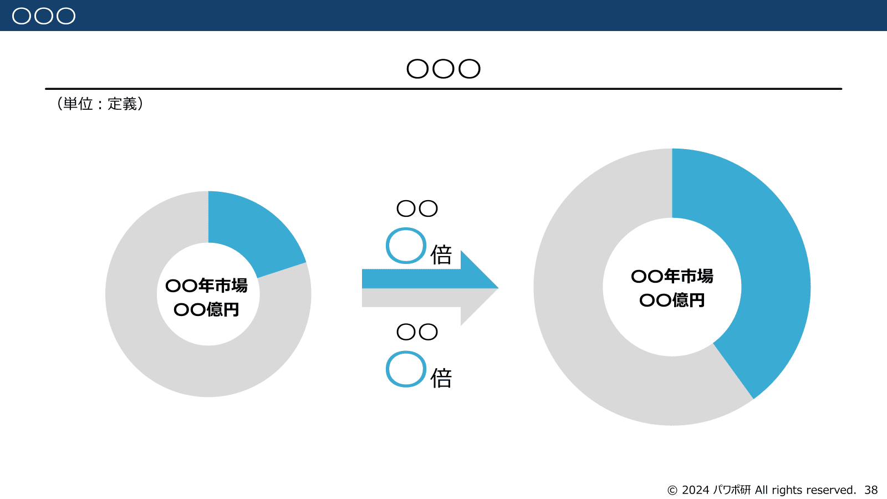
*パワポ研オリジナルテンプレートの円グラフで市場規模を示すスライド*

## パワポ研オリジナルテンプレート

パワポ研では、「ビジネスシーンで使える」パワーポイントテンプレートを公開しております。デザインを整えるのみならず、**ロジックやストーリーを整理するのにも役立つパッケージ**になっておりますので、関心のある方は下記ページも併せてご覧ください！

[
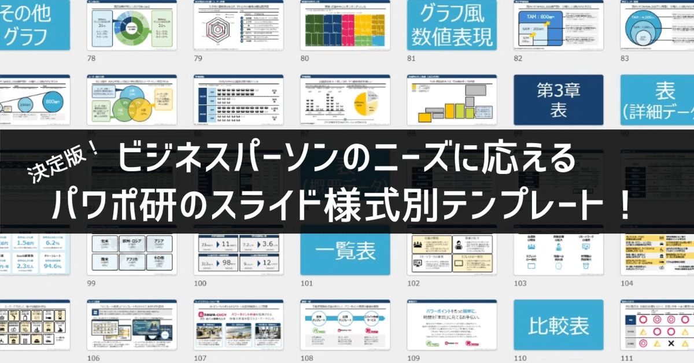
](https://note.com/powerpoint_jp/n/n50d02ec3162f)え上記の記事のように、noteでは**フォローしているだけでビジネスにおける「資料作成のコツ」と「デザインのセンス」が身に付くアカウント**を目指して情報配信を行っています。
今後もコンスタントに記事を配信していく予定なので、関心のある方は是非アカウントのフォローをお願いします！

**> Template販売　**[> https://powerpointjp.stores.jp/](https://powerpointjp.stores.jp/%EF%BF%BCnote)
**> note　**[> パワポ研の資料作成術](https://note.com/powerpoint_jp/m/mc291407396da)
**> X（旧Twitter)　**[> https://twitter.com/powerpoint_jp](https://twitter.com/powerpoint_jp)

## レックスアドバイザーズからのお知らせ

パワポ研は株式会社レックスアドバイザーズが運営しています。
レックスアドバイザーズは**経営企画職や経営管理職に特化した転職エージェント**です。
上場企業や上場準備企業を中心に、**経営企画、IR、経理財務、法務、内部監査等の職種の求人**をご紹介しているほか、**CFOなどのコンフィデンシャル求人**もご紹介可能です。
またコンサルティングファームや監査法人、会計事務所の求人も豊富にあるため、プロフェッショナルファームを目指す方のご支援も得意です。
求人紹介やキャリア相談を希望の方は、[**無料転職サポート**](https://www.career-adv.jp/job_search/entryform_exp/)よりサービス利用登録をしてみてください。

*レックスアドバイザーズのサービスサイトはこちら*

**> 求人をご希望の方　**[> 無料転職サポート](https://www.career-adv.jp/job_search/entryform_exp/)**
> 採用支援をご希望の方　**[> 採用サポート](https://www.career-adv.jp/request3/)
**> その他　**[> お問い合わせフォーム](https://www.rex-adv.co.jp/contact)
**> 書籍　**[> 注目企業の実例から学ぶパワポ作成術](https://www.amazon.co.jp/dp/4046060476)

