# 【マネしたい】おしゃれなパワポの「ピラミッド図」スライド９選

[note原文](https://note.com/powerpoint_jp/n/n6cf82209cbfa)

みなさんこんにちは。
資料デザインのリサーチや分析に取り組むパワーポイントのスペシャリスト、パワポ研です。

今回は、**パワポの「ピラミッド図」スライドに焦点を当て、上場企業のIR資料からおしゃれなスライドを紹介**していきます。ピラミッド図とは、顧客セグメントや顧客レイヤーを示すパワポや、経営戦略の構造を示すパワポに使われる、三角形でレイヤーを表現するフォーマットです。

*パワポ研テンプレートのピラミッド図*

では早速行きましょう！

## 顧客開拓状況のピラミッド図２選

最初は顧客の開拓状況を見せるためにピラミッド図を使用しているパワポの例から見ていきましょう。
ピラミッド図を使って顧客を規模感で分類しているスライドや、顧客を取引額で分類しているスライドがあります。

### ピラミッド図で顧客規模を見せるパワポ例

まずは株式会社ツナググループ・ホールディングスのパワポにおける「ピラミッド図」のデザインから見ていきましょう。
2025年９月期 決算説明資料のパワーポイントにある、RPO（採用業務代行・採用コンサルティング）事業　市場開拓余地のスライドです。

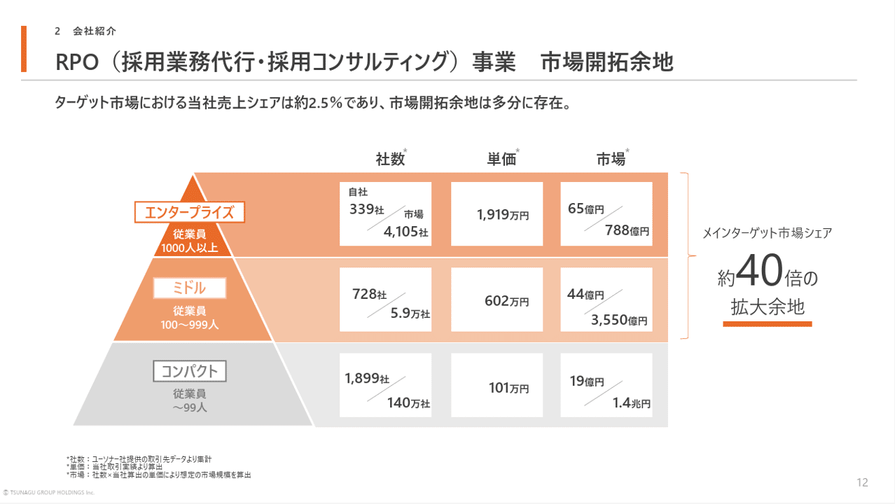
*株式会社ツナググループ・ホールディングスのピラミッド図のパワポ*

> 引用元：[> 2025年９月期 決算説明資料](https://contents.xj-storage.jp/xcontents/AS81305/586ddc42/3cc1/4aea/a2d3/523c66dcaa93/140120251110593977.pdf)

*https://tghd.co.jp/ir/library/presen.html*

パワポの「ピラミッド図」の特徴としては、**従業員規模で顧客セグメントを整理してピラミッド図で表現している点**が挙げられます。
従業員規模1,000人以上のエンタープライズ、従業員規模100～999人のミドル、従業員100人未満のコンパクトの3つの顧客セグメントでピラミッド図にしています。

ピラミッド図の顧客セグメントごとに、社数ベースのシェア、単価、金額ベースのシェアを表現していますが、数字をしっかり右揃えにする、ピラミッドの上位から買いに向けてオレンジのグラデーションにするなど、細かな工夫のおかげで、おしゃれで見やすいパワポに仕上がっています。シェアを実数の分母と分子で見せるデザインもわかりやすいですね。

### 顧客取引額を示すピラミッド図のパワポ例

続いて株式会社GRCSのパワポにおける「ピラミッド図」のデザインです。
2025年11月期 決算説明資料のパワーポイントにある、進捗状況（戦略②）：業種別ターゲットのスライドを見てみましょう。

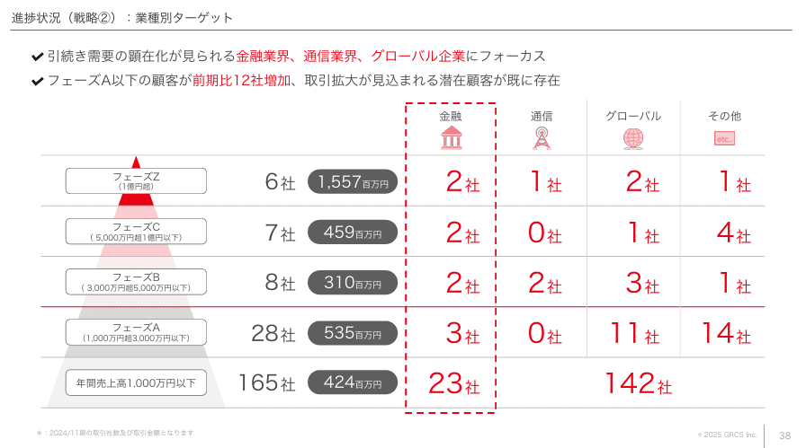
*株式会社GRCSのピラミッド図のパワポ*

> 引用元：[> 2025年11月期 決算説明資料](https://ssl4.eir-parts.net/doc/9250/tdnet/2742305/00.pdf)

*https://www.grcs.co.jp/ir/library/presentation*

パワポの「ピラミッド図」の特徴としては、**取引額で顧客セグメントを整理しピラミッド図で表現している点**が挙げられます。
取引額が1億円以上の顧客をフェーズZ、5,000万円以上をフェーズC、3,000万円以上をフェーズB、1,000万円以上をフェーズAとし、各フェーズの顧客数、売上、業種別顧客数を記載しています。

安定大口顧客を増やすという顧客戦略の基本に対して、進捗状況が明確にわかるだけでなく、「金融」「通信」「グローバル」の顧客を狙っていくことが明確にわかるよいスライドです。赤色のグラデーションとグレーのシンプルなデザインでおしゃれなパワポともいえますね。

## 顧客セグメント別戦略のピラミッド図２選

続いて顧客セグメント別の戦略を示すためにピラミッド図を使用しているパワポの例です。
顧客を規模でセグメントしたうえでピラミッド図を示し、各セグメントにどのようなサービスを提供するのか、どのように開拓するのかといった戦略を整理しています。なお事業紹介については、ピラミッド図以外にも様々なパターンがあり、「戦略が伝わるパワポの事業紹介スライド９選」のNoteで整理しています。

### 顧客層別対応サービスのピラミット図の例

次に共同ピーアール株式会社のパワポにおける「ピラミッド図」のデザインを見てみましょう。
2024年12月期決算説明会のパワーポイントにある、NEXT KYODOPRのスライドです。

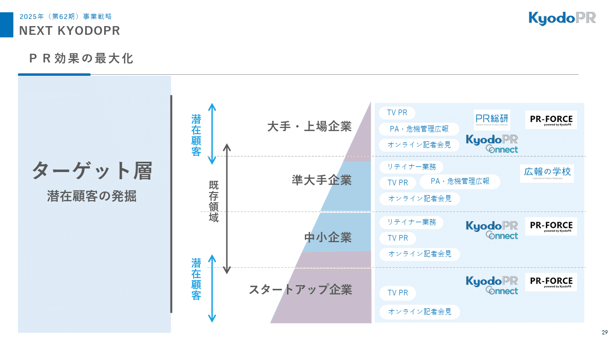
*共同ピーアール株式会社のピラミッド図のパワポ*

> 引用元：[> 2024年12月期　決算説明会](https://www.kyodo-pr.co.jp/wp/wp-content/uploads/2025/02/IR_20250214_04.pdf)

*https://www.kyodo-pr.co.jp/investor/event/explanation/*

パワポの「ピラミッド図」の特徴としては、**顧客を規模別でセグメントしてピラミッド図に入れたうえで、それぞれの顧客セグメントが行うPRと対応するサービスをまとめている点**が挙げられます。
顧客を「大手・上場企業」「準大手企業」「中小企業」「スタートアップ企業」の４つの階層に分けてピラミッド図にプロットし、それぞれのレイヤーに「TV PR」「PA・危機管理広報」「オンライン記者会見」「リテイナー業務」といったニーズを記載しています。

ピラミッド図は上位から下位にかけてグラデーションの配色を使うことが多いですが、今回のように既存や新規で色分けをする場合もあります。

### 立体的なピラミッド図のパワポ例

続いて株式会社FUNDINNOのパワポにおける「ピラミッド図」のデザインを見ていきましょう。
事業計画及び成長可能性に関する事項のパワーポイントにある、プライマリー領域における構造図のスライドになります。

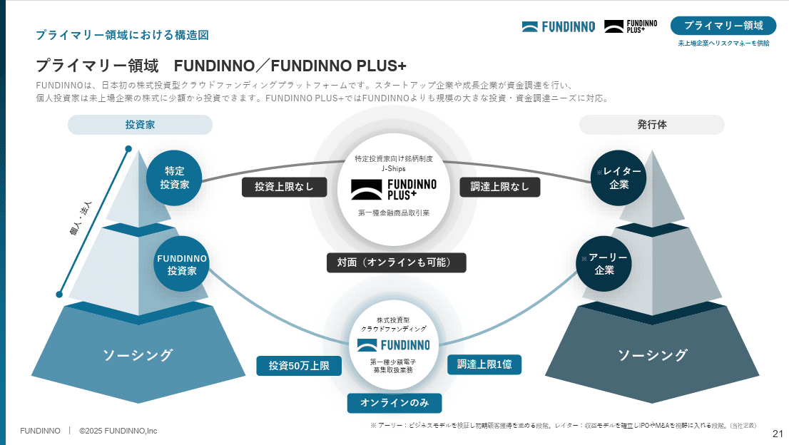
*株式会社FUNDINNOのピラミッド図のパワポ*

> 引用元：[> 事業計画及び成長可能性に関する事項](https://ssl4.eir-parts.net/doc/462A/tdnet/2746795/00.pdf)

*https://corp.fundinno.com/ir/*

パワポの「ピラミッド図」の特徴としては、**ピラミッドが立体的なデザインであることとピラミッドが２つあること**が挙げられます。
左側に投資家のピラミッド、右側に投資家のピラミッドがあり、それぞれ３つのレイヤーがあります。そして投資家側の特定投資家と発行体のレイター企業がFUNDINNO PLUS＋、FUNDINNO投資家とアーリー企業がFUNDINNOでつながっているということを見せています。

ピラミッド図を立体的にしているパワポがおしゃれで珍しいため記憶に残りやすいことに加えて、FUNDINNO PLUS+とFUNDINNOの違いも分かりやすく整理されており、良いスライドといえますね。

## 顧客内レイヤー別サービスのピラミッド２選

続いて顧客内のレイヤー別の戦略を示すためにピラミッド図を使用しているパワポの例を見ていきましょう。
顧客内の意思決定レイヤーや、ITのレイヤーなどをピラミッド図で表し、それぞれのレイヤーにどのように価値提供するのかを整理しています。

### 階層別サービスのピラミッド図の例

まずは株式会社ココナラのパワポにおける「ピラミッド図」のデザインを見ていきましょう。
2025年8月期 通期決算説明資料のパワーポイントにある、成長方針②：エージェント立ち上げ・拡大のスライドです。

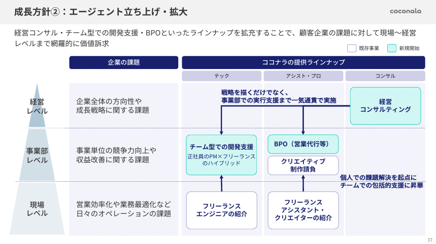
*株式会社ココナラのピラミッド図のパワポ*

> 引用元：[> 2025年8月期 通期決算説明資料](https://ssl4.eir-parts.net/doc/4176/tdnet/2697472/00.pdf)

*https://coconala.co.jp/ir/library/presentation/*

パワポの「ピラミッド図」の特徴としては、**ピラミッド図で意思決定のレイヤーを整理したうえで課題と提供できるサービスをレイヤーごとに整理している点**が挙げられます。
経営レベル、事業部レベル、現場レベルという３つの階層に対して、それぞれの課題と、「テック」「アシスト・プロ」「コンサル」で提供できるサービスを記載しています。

ピラミッド図のそれぞれの階層に対してどのようなサービスを提供できるかだけでなく、それぞれのサービスの連関を矢印で整理しており、サービスポートフォリオのスライドとしても機能しています。

### 階層別プロジェクトのピラミッド図の例

続いて株式会社pluszeroのパワポにおける「ピラミッド図」のデザインを見ていきましょう。
成長可能性に関する説明資料のパワーポイントにある、「プロジェクト型の特徴：幅広い顧客に多用なソリューションを提供」のスライドです。

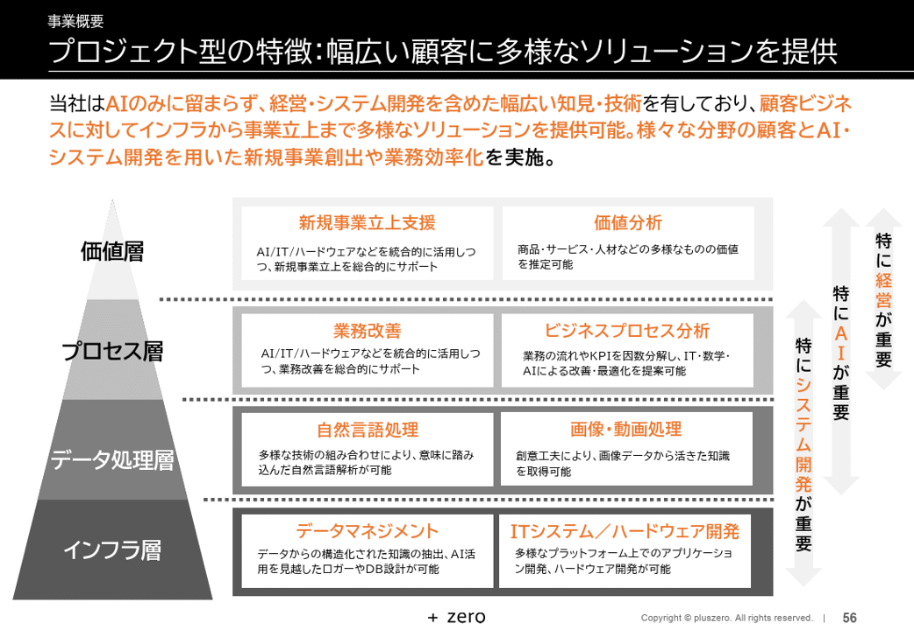
*株式会社pluszeroのピラミッド図のパワポ*

> 引用元：[> 成長可能性に関する説明資料](https://contents.xj-storage.jp/xcontents/AS09142/aafb1bc8/9484/4ad5/a808/1f41442bc233/140120260126538476.pdf)

*https://plus-zero.co.jp/ir/news*

パワポの「ピラミッド図」の特徴としては、**ピラミッド図でITのレイヤーを整理し、提供できるサービスをプロットしている点**が挙げられます。
「価値層」「プロセス層」「データ処理層」「インフラ層」の４レイヤーに分けて、それぞれで提供可能なサービスを２つずつ記載しています。

その上で、右側に各レイヤーの特徴を矢印で示しており、「特に経営が重要」「特にAIが重要」「特にシステム開発が重要」というように記載してます。pluszeroのパワポはよく紹介していますが、グレー色のグラデーションにオレンジの文字がおしゃれです。

## パワポの経営戦略のピラミッド図３選

最後はピラミッド図を用いて経営戦略の説明をしているパワポの例を見ていきましょう。
経営戦略はビジョンや大方針の元、個別戦略が定義されていくので、ピラミッド図と非常に相性が良いです。経営戦略の例、事業戦略の例、M&A戦略の例を見ていきましょう。

### 経営戦略のピラミッド図のポワポ例

まずは株式会社エアークローゼットのパワポにおける「ピラミッド図」のデザインを見ていきましょう。
2025年6月期決算説明資料のパワーポイントにある、エアークローゼットの経営戦略のスライドです。

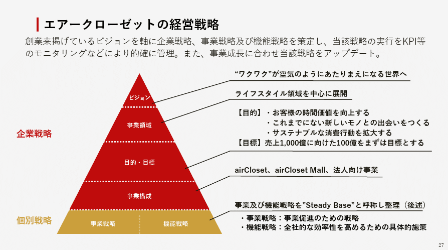
*株式会社エアークローゼットのピラミッド図のパワポ*

> 引用元：[> 2025年6月期　決算説明資料](https://ssl4.eir-parts.net/doc/9557/tdnet/2676375/00.pdf)

*https://corp.air-closet.com/ir/library/presentation/*

パワポの「ピラミッド図」の特徴としては、**ビジョンに始まり５階層にピラミッドが分かれていることと、企業戦略と個別戦略が描き分けられていること**が挙げられます。
「ビジョン」「事業領域」「目的・目標」「事業構成」「事業戦略」「機能戦略」が、ピラミッドの階層に記載されています。

それぞれについて、右側に詳細をテキストで記載していますが、文字の左揃えや箇条書きの活用で見やすく整理されています。ピラミッド図のレイヤーのうち、企業戦略を赤色で、個別戦略を黄色で記載している点も工夫が見られます。

### 事業戦略のピラミッド図のパワポ例

続いて株式会社ユーグレナのパワポにおける「ピラミッド図」のデザインを見ていきましょう。
2024年12月期通期決算説明および今後の展望のパワーポイントにある、中期経営計画のスライドです。

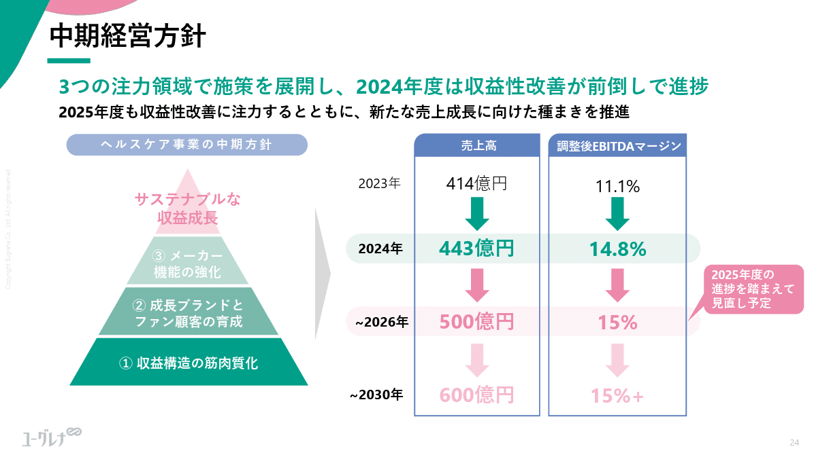
*株式会社ユーグレナのピラミッド図のパワポ*

> 引用元：[> 2024年12月期通期決算説明および今後の展望](https://ssl4.eir-parts.net/doc/2931/tdnet/2568583/00.pdf)

*https://www.euglena.jp/ir/library/presentation/*

パワポの「ピラミッド図」の特徴としては、**最上位の経営方針の下に、３つの取り組みを階層構造で整理している点**が挙げられます。
最上位に「サステナブルな収益成長」があり、その下に「メーカー機能の強化」「成長ブランドとファン顧客の育成」「収益構造の筋肉質化」が挙げられています。

３つの取り組みについては、必ずしも連関しているわけではないため、ピラミッド図でなくてもよいのですが、より経営判断に近いトップダウン的な施策を上に、おりボトムアップ的な施策を下に持ってくることで理解しやすくしています。

### 投資戦略のピラミッド図のパワポ例

最後は株式会社タイミーのパワポにおける「ピラミッド図」のデザインから見ていきましょう。
事業計画及び成長可能性に関する事項についてのパワーポイントにある、競合環境のスライドです。

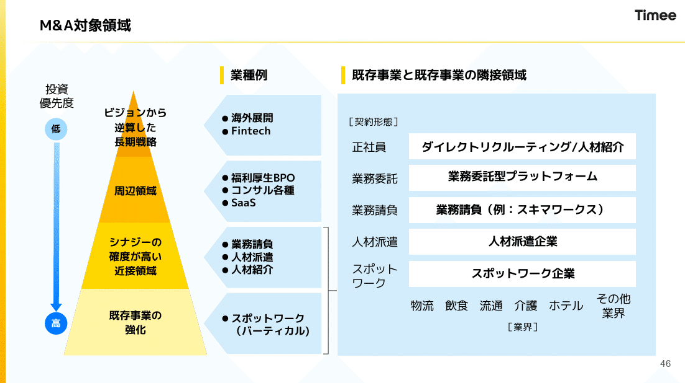
*株式会社タイミーのピラミッド図のパワポ*

> 引用元：[> 2025年10月期 通期決算説明資料](https://contents.xj-storage.jp/xcontents/AS05113/b9ee94ee/cbd2/4b3b/a36d/2f43121b5d0f/140120251211518007.pdf)

*https://corp.timee.co.jp/ir/presentations/*

パワポの「ピラミッド図」の特徴としては、**ピラミッド図で記載した投資領域のピラミッドに対して、投資優先度が対応している点**が挙げられます。
ピラミッド図は「ビジョンから逆算した長期戦略」「周辺領域」「シナジーの確度が高い近接領域」「既存事業の強化」と、より戦略的な領域が上位に来ている一方、M&Aの優先度としては下位の既存事業に近い領域の方が優先されています。対照的なグラデーションを使うことでM&Aの優先度が一目でわかる、おしゃれなパワポです。

またピラミッド図の各階層に対応する具体な業種例を入れたうえで、より重要な「既存事業の強化」「シナジーの角度が高い近接領域」については、より詳細に記載するデザインで、M&Aされたい企業やM&A仲介からの提案が舞い込みやすいようにしていますね。

## 【マネしたい】おしゃれなパワポの「ピラミッド図」スライド９選まとめ

以上、色々な企業のパワポを参考に「ピラミッド図」のデザインを紹介してきました。ピラミッド図そのものは大きく変わりませんが、何のピラミッドにするのか、ピラミッドをどう使うのかという点でデザインが大きく変わることが伝わったかと思います。

ちなみに**パワポ研で提供しているテンプレート集には、以下のようなそのまま使える「ピラミッド図」のテンプレートもあります**ので、気になる方は下で紹介しているオリジナルテンプレートのNoteも見てみてくださいね。

*パワポ研テンプレートのピラミッド図*

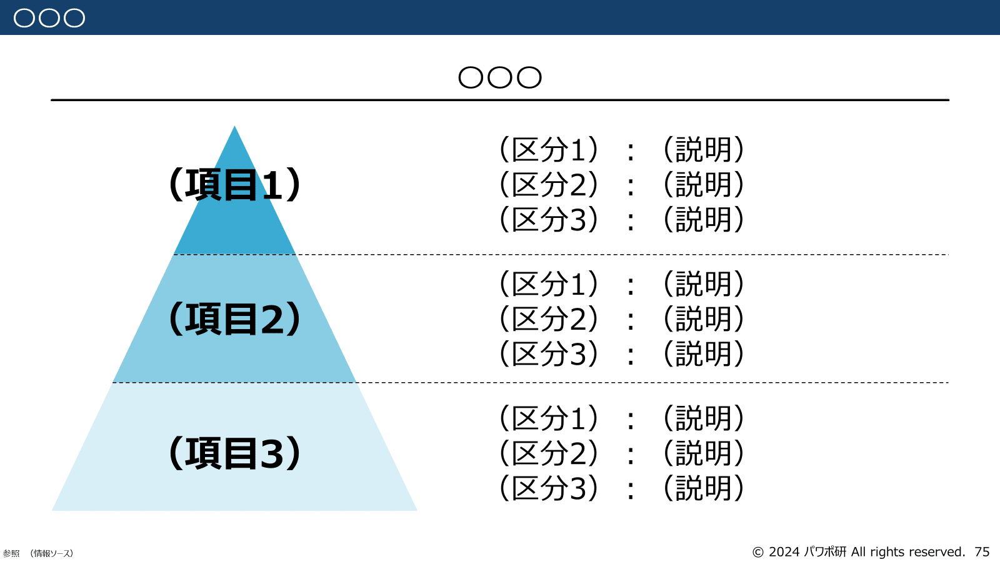
*パワポ研テンプレートのピラミッド図２*

## パワポ研オリジナルテンプレート

パワポ研では「ビジネスシーンで使える」パワーポイントテンプレートを公開しております。デザインを整えるのみならず、**ロジックやストーリーを整理するのにも役立つパッケージ**になっておりますので、関心のある方は下記ページも併せてご覧ください！

[
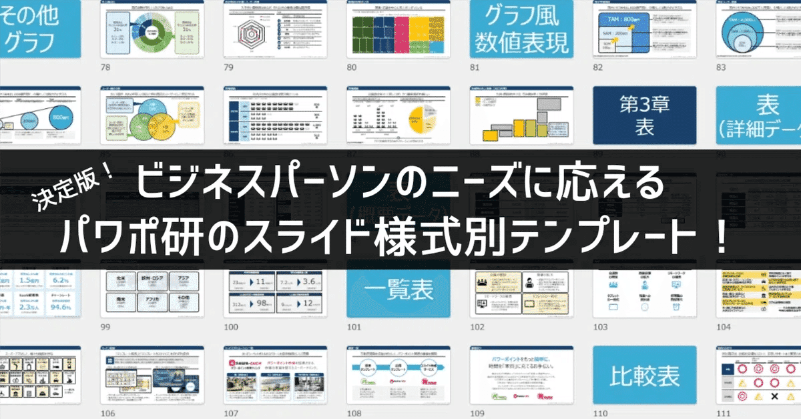
](https://note.com/powerpoint_jp/n/n50d02ec3162f)上記の記事のように、noteでは**フォローしているだけでビジネスにおける「資料作成のコツ」と「デザインのセンス」が身に付くアカウント**を目指して情報配信を行っています。
今後もコンスタントに記事を配信していく予定なので、関心のある方は是非アカウントのフォローをお願いします！

**> Template販売　**[> https://powerpointjp.stores.jp/](https://powerpointjp.stores.jp/%EF%BF%BCnote)
**> note　**[> パワポ研の資料作成術](https://note.com/powerpoint_jp/m/mc291407396da)
**> X（旧Twitter)　**[> https://twitter.com/powerpoint_jp](https://twitter.com/powerpoint_jp)

## レックスアドバイザーズからのお知らせ

パワポ研は株式会社レックスアドバイザーズが運営しています。
レックスアドバイザーズは**経営企画職や経営管理職に特化した転職エージェント**です。
上場企業や上場準備企業を中心に、**経営企画、IR、経理財務、法務、内部監査等の職種の求人**をご紹介しているほか、**CFOなどのコンフィデンシャル求人**もご紹介可能です。
またコンサルティングファームや監査法人、会計事務所の求人も豊富にあるため、プロフェッショナルファームを目指す方のご支援も得意です。
求人紹介やキャリア相談を希望の方は、[**無料転職サポート**](https://www.career-adv.jp/job_search/entryform_exp/)よりサービス利用登録をしてみてください。

*レックスアドバイザーズのサービスサイトはこちら*

**> 求人をご希望の方　**[> 無料転職サポート](https://www.career-adv.jp/job_search/entryform_exp/)**
> 採用支援をご希望の方　**[> 採用サポート](https://www.career-adv.jp/request3/)
**> その他　**[> お問い合わせフォーム](https://www.rex-adv.co.jp/contact)
**> 書籍　**[> 注目企業の実例から学ぶパワポ作成術](https://www.amazon.co.jp/dp/4046060476)

