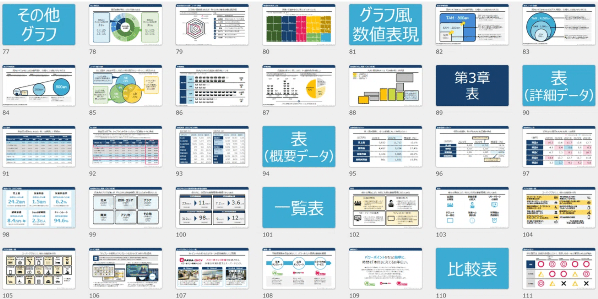
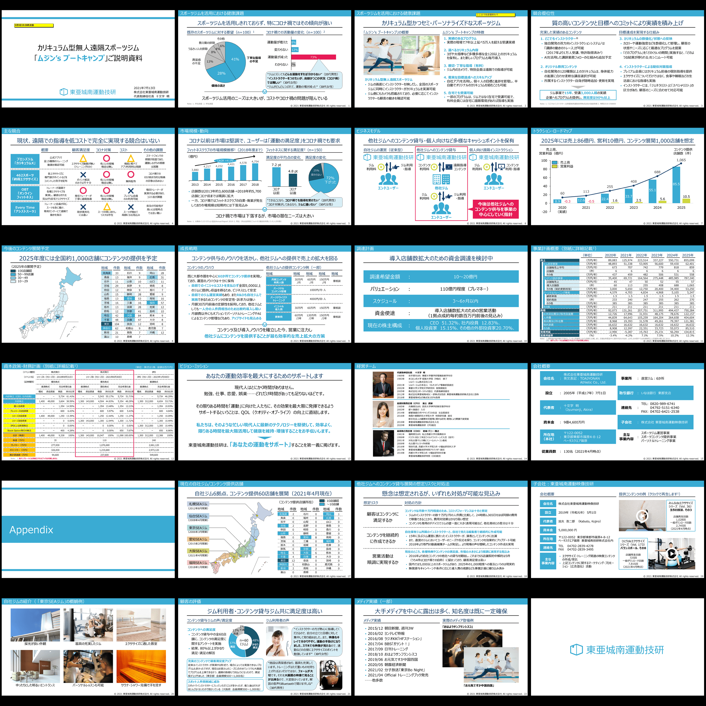
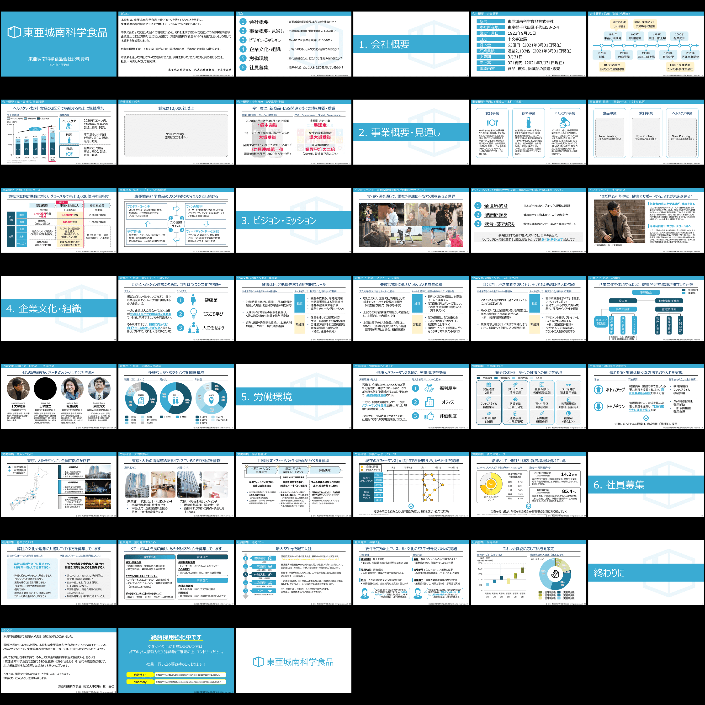
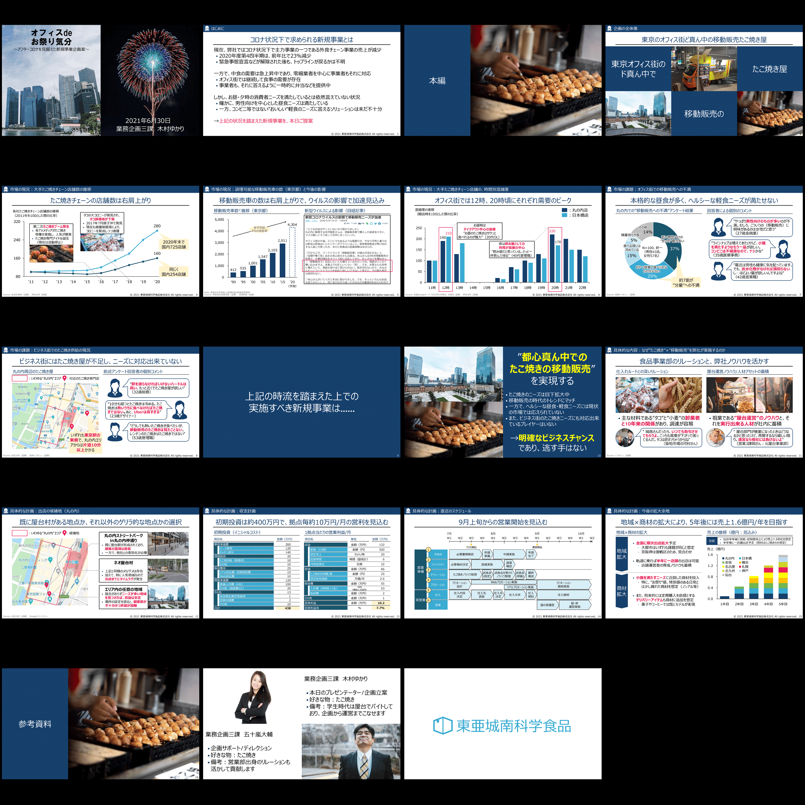
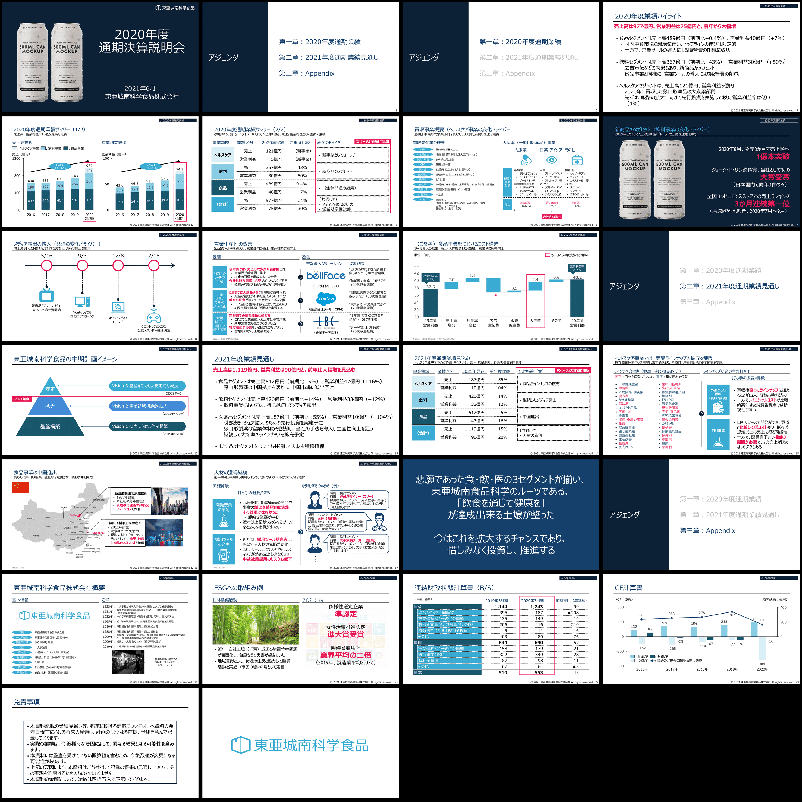
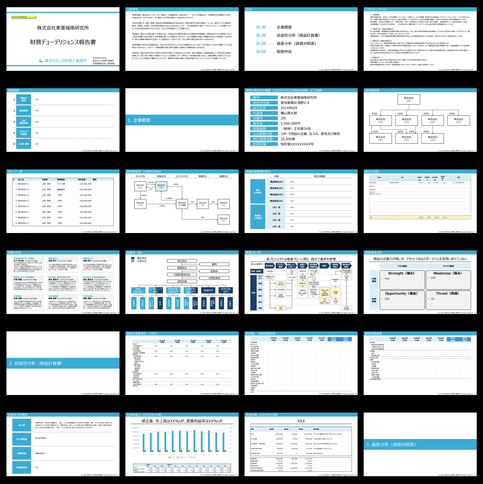
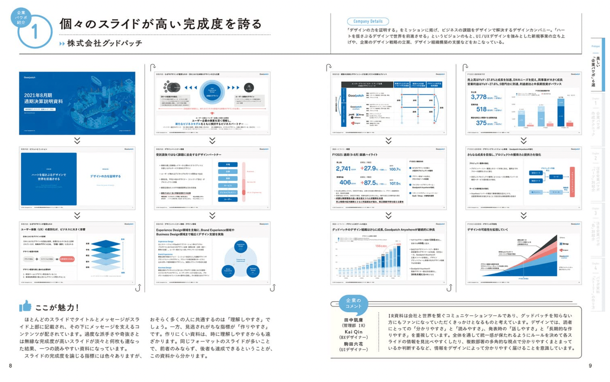

# 【保存版】パワポ研の販売しているビジネス用パワポテンプレートの一覧

[note原文](https://note.com/powerpoint_jp/n/n7300a1293e8e)

みなさんこんにちは。
資料デザインのリサーチや分析に取り組むパワーポイントのスペシャリスト、パワポ研です。日々noteやTwitterでパワポに関する情報発信をしています。

本記事では現時点でのパワポテンプレートの販売状況を整理して解説いたします。「それぞれのテンプレートの違いを知りたい」「どのセットを購入すれば最もお得になるのか気になる」「販売チャネルを知りたい」といった方は是非ご覧ください。

（なお「**解説はいらないからすぐに使いたい！」**という人は**「**[**こちら**](https://powerpointjp.stores.jp/)**」**からご希望のテンプレートをご購入ください）

## パワポ研で販売中のビジネス資料向けテンプレート

早速ですが、これまでに開発し、現在販売を行っているテンプレートの一覧を示します。

> ① パワーポイント素材スライドテンプレート集（2024年7月発売）
> ② 資金調達プレゼン資料パワポテンプレート（2021年7月発売）
> ③ 会社説明・採用資料パワポテンプレート（2021年7月発売）
> ④ 新規ビジネス計画資料パワポテンプレート（2021年7月発売）
> ⑤ 決算説明会資料パワポテンプレート（2021年7月発売）
> ⑥ 財務デューデリジェンス報告資料テンプレート（2025年9月発売）

①は**様式別のテンプレート**、②〜⑥は**シチュエーション別**のパワポフォーマットとなっており、役割が異なっております。詳しくは後述しますが、「明確にパワポを作るシチュエーションが決まっている」「とにかく時短したい」場合は②〜⑥、「個々のスライドのレベルを底上げしたい」「網羅性の高いテンプレが欲しい」場合は①のパワポテンプレートがオススメです。もちろん、併用することも可能です。

## パワポテンプレートのお得な購入方法

### パワポ研テンプレートを初めて買う方

まとめ買いがお得です。①〜⑤のテンプレートが全て含まれるパッケージとなります。合計15,980円のところを、[**まとめ買い割引で9,980円**](https://powerpointjp.stores.jp/items/66893d8ab4efa21638ab2251)となっており、大変お買い求め安くなっています。

②〜⑤のテンプレートがすべて含まれるパッケージは、合計10,000円のところを、[**まとめ買い割引で6,980円**](https://powerpointjp.stores.jp/items/60ed52109bb1677bb25e36e1)で販売しております。

### パワポ研のテンプレートを購入済の方

これまでの販売履歴を見ると、ほとんどの方が②〜⑤のまとめ買いパッケージをご購入頂いております。Storesのメルマガを登録されている方は、①のテンプレートを購入する際に使える割引クーポンもありますので、是非お問い合わせください。
②〜⑤のテンプレートを単品で購入いただいた方で、他のテンプレートを新たに買いたいという方は、場合によっては[**全商品まとめ買い割引**](https://powerpointjp.stores.jp/items/66893d8ab4efa21638ab2251)で購入した方が安くなるケースがございますので、ご検討いただければと思います。

## ビジネス資料向けパワポテンプレートの詳細

### パワーポイント素材テンプレート集

以下の7つのカテゴリー（章）のパワポテンプレやパワポフォーマットがまとめて収録されている素材集です。全体では、34セクション、184種類のテンプレートとなります。
（1）基本グラフ（棒グラフ、折れ線グラフ、円グラフ　等）
（2）応用グラフ（複合グラフ、滝グラフ、面グラフ　等）
（3）表（一覧表、比較表、関係者紹介　等）
（4）時間推移（ガントチャート・フロー、タイムライン　等）
（5）関係性（循環図、構成図、マトリクス、相関図　等）
（6）文字主体（組織概要、サービス・事業概要、ワード、コンセプト）
（7）資料骨子（表紙、裏表紙、目次、ディバイダー）

詳細はこちらの[**note記事**](https://note.com/powerpoint_jp/n/n50d02ec3162f)で解説しています。

### 資金調達プレゼン用パワポテンプレート

外部の投資家に対してプレゼンする際やその他ピッチの場面で活躍する**「資金調達」**に関するパワポフォーマットです。サービスの詳細説明やビジネスモデル、資本政策など資金調達資料に必要なスライドが詰まった全24ページのパッケージです。

### 会社紹介・採用資料パワポテンプレート

就活生・転職希望者に向けに作成する**「会社説明・採用」**に関するパワポフォーマットです。自社のビジネスや沿革、福利厚生や採用プロセスなど就職希望者に対して説明が必要な内容が網羅された、全45ページのパッケージとなっています。

### 新規ビジネス計画資料パワポテンプレート

社内向けに新しいビジネスを提案する際の**「新規事業計画」**に関するパワポフォーマットです。サービスの概要や収支計画予定、既存事業とのシナジーなど事業計画に必要なスライドが詰まった全19ページのビジネス向けパッケージです。

### 決算説明会資料パワポテンプレート

四半期に一度開催される株主向けの**「決算説明会」**に関するパワポフォーマットです。当期の業績や来期の計画発表など決算説明会に必要なスライドが詰まった全26ページのパッケージです。なお非上場企業においても自社の業績や施策を紹介する場面は多いため、そちらの用途でも十分に活用いただけるパワポテンプレとなっています。

②〜⑤のテンプレートの詳細については、こちらの[**note記事**](https://note.com/powerpoint_jp/n/n0380d0556127)にて解説しております。

### 財務デューデリジェンス報告資料パワポテンプレート

公認会計士やアドバイザリーが行う財務デューデリジェンスの報告資料用のパワポフォーマットです。財務デューデリジェンスで検討する項目を一通り網羅した全42Pのパワポテンプレとなっています。
なおこちらは①のパワーポイント素材スライドテンプレート集とのセット販売になっています。財務デューデリジェンス用ですが、税務デューデリジェンスやビジネスデューデリジェンスにも転用が可能です。

## パワポ研テンプレートのリンクまとめ

最後にテンプレの購入ページ、解説ページ等のURLを一覧化してまとめておきます。また、TwitterやQ&AについてのURLも合わせてまとめておきます。今後ともパワポ研をよろしくお願いします！

### パワポ研テンプレート購入ページ

 
[
**
パワポ研の商品一覧｜note
**

フォローしているだけでビジネスにおける「資料作成のコツ」と「デザインのセンス」が身に付くアカウント。

note.com

](https://note.com/powerpoint_jp/store)

 

### ①「パワーポイント素材スライドテンプレート集」の解説記事

### ②〜⑤ 「ビジネスシーン別スライド集」の解説記事

### パワポ研テンプレート購入に関するQ&A

 
[
**
FAQ | パワポ研｜ビジネスで使えるデザインテンプレート
**

パワポ研｜ビジネスで使えるデザインテンプレートのネットショップです

powerpointjp.stores.jp

](https://powerpointjp.stores.jp/faq)

 

### パワポ研Ｘアカウント（旧Twitter）

[https://twitter.com/powerpoint_jp](https://twitter.com/powerpoint_jp)

## おまけ

テンプレートとは異なりますが、2023年1月にKADOKAWAからより「[**注目企業の実例から学ぶパワポ作成術**](https://www.amazon.co.jp/dp/4046060476)」という書籍を出版しております。実際の企業の決算パワポを40社分解説しており、パラパラとめくれる「デザイン集」として使える一冊となっておりますので、手元に紙で置いておきたいという方が購入をご検討ください！

*パワポ研書籍「注目企業の実例から学ぶパワポ作成術」のページサンプル*

