# 【パワポ研直伝】見やすいスライドを作成するためのテクニック

[note原文](https://note.com/powerpoint_jp/n/n754b3a94f9ae)

みなさんこんにちは。
資料デザインのリサーチや分析に取り組むパワーポイントのスペシャリスト、パワポ研です。

パワポ研ではスライド作成の参考になる事例をピックアップしてご紹介していますが、**今日は皆様が美しいパワポを作るためのコツを伝授**していこうと思います。過去に作成した記事のアップデートもどんどん進めていますので、気になる方はまとめページをブックマークしておいてくださいね。

今回ご紹介するのは、大きく表の作成に関するコツと、グラフの作成に関するコツになります。今すぐ使えるものから、少し手間がかかるものまで複数ご用意しています。ぜひ参考にしてみてくださいね！

## 明日から使える！見やすい表を作るコツ

### 数字は右揃えして中央に寄せよう

最初にお伝えしておきますが、今回お伝えするテクニックは、すごく細かいものもあります。一見するとそこまで影響がないように見えるかもしれませんが、**神は細部に宿るというように、一つ一つの積み重ねが美しいパワポを作ります。**

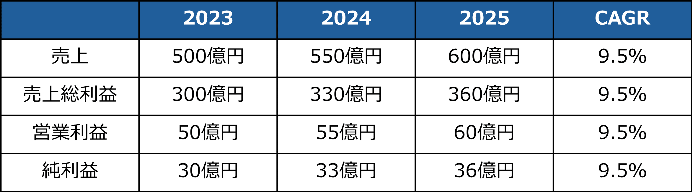
*何も手を入れていないテーブル*

*数字を右揃えにして真ん中に寄せたテーブル*

どうでしょうか。下の表では、単位の円が右にきれいにそろっており、数字の縦比較がしやすくなっています。今回はそこまで影響ないように見えるかもしれませんが、4ケタと1ケタが混ざっているような図では、より効果を発揮します。

ここでのポイントですが、**文字を右揃えにするだけではここまできれいに仕上がりません。**数字が右に寄っているのに対し上の年数が真ん中ぞろえなので、美しくないですね。

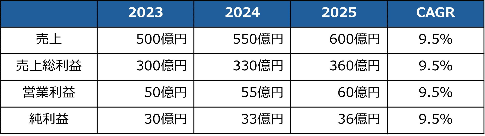
*数字を右寄せしただけのテーブル*

そこでどうするかというと、対象の数字をまとめて選択して右クリック⇒図形の書式設定⇒文字のオプション⇒テキストボックスと進み、**右余白を調整します**。1ずつノッチを上げていき、一番大きい数字が真ん中まで来たらそこでストップしましょう。これで完成です。

ちなみに、売上・売上総利益・営業利益・純利益の部分は右揃えにしてもよいです。こちらは全部終わった後にバランスを見て調整るするのがよいですね。

### 「テーブルレイアウト」タブで縦横のサイズを調整しよう

次はサイズ調整の話におけるコツになります。サイズ調整なんて手動で誰でもやっていると思うかもしれませんが、ここでのポイントは「テーブルレイアウト」タブです。

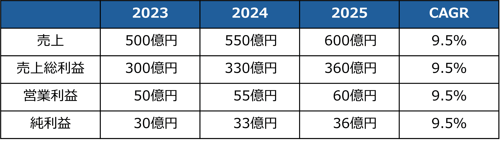
*サイズ未調整のテーブル*

*サイズ調整後のテーブル*

上記の表の場合、**2023年から2025年については同じ横幅**にしたい一方、ほかの列については個別に幅調整をしたいですよね。
こうした場合に、同じ横幅にしたい列を選択して、セルの横幅の数字を1ノッチずつ増やします。

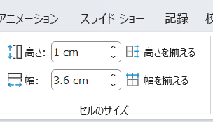
*セルのサイズ調整*

そうすると、3つのセルの横幅は同じにしたまま、横幅を拡大できます。またこの機能だとテーブル自体も横に広がっていくので、**セル自体の大きさとテーブルの大きさのバランスもとりやすく**なりますよ。

### 枠線や仕切りの太さや種類や色にこだわろう

3つ目のテクニックは枠線や仕切り線に関するものです。**太い線がたくさんあるとどうしても圧の強い表**になってしまうので、仕切り機能は残しつつ、できるだけ目立たないようにします。

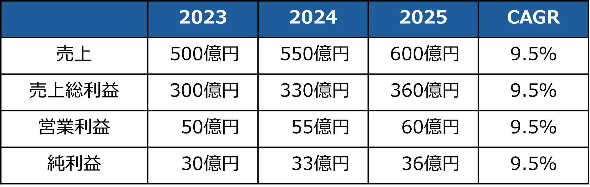
*枠線や仕切り線未変更のテーブル*

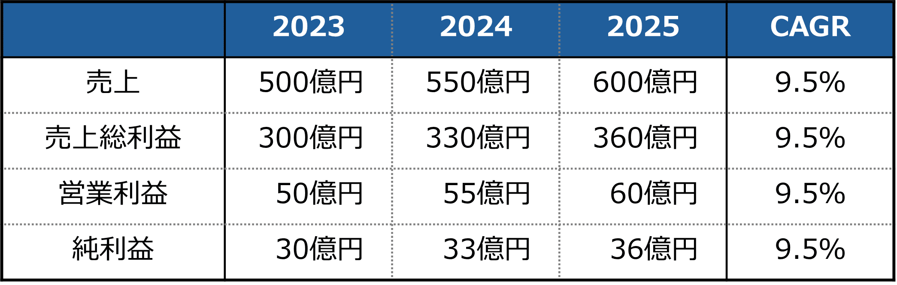
*枠線や仕切り線を変更したテーブル*

どうでしょうか。ここでは3つの変更を加えてみました。

- 横の仕切り線の一部を「灰色の破線」に変更（一番上の仕切り線は残す）

- 縦の仕切り線の一部を「灰色の破線」に変更（左右の仕切り線は残す）

- 箱の大枠は0.5pt太くする

大分見やすくなったのではないかと思います。やり方としては、**「テーブルデザイン」を選択⇒罫線（けいせん）の作成⇒罫線**の順です。

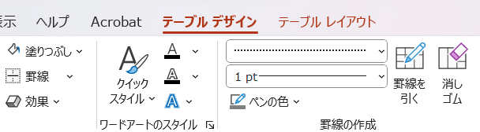
*罫線の設定方法*

ちなみにこのテクニックはエクセルでも有効なのでぜひ活用してみてください。**本当に時間がないときは、エクセルでパッとこんなテーブルを作り、「写真として貼り付け」てしまえば**きれいなパワポになります。

## 図形を使って美しい表を作るテクニック

ここまではすぐ使える、ただしそこまで大きくは変化が出ないテクニックを見てきました。でもできることなら、[【パワポ研厳選】コンサルティングファーム・シンクタンクのスライド資料３０選](https://note.com/powerpoint_jp/n/n812a673ce2ab)で見たような、美しい表を作ってみたいですよね？

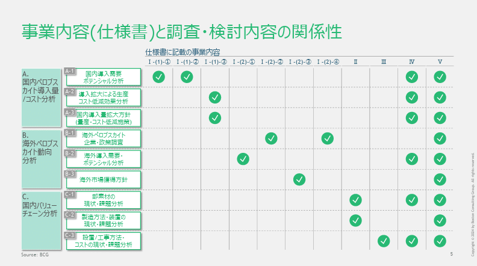
*こんなのとか*

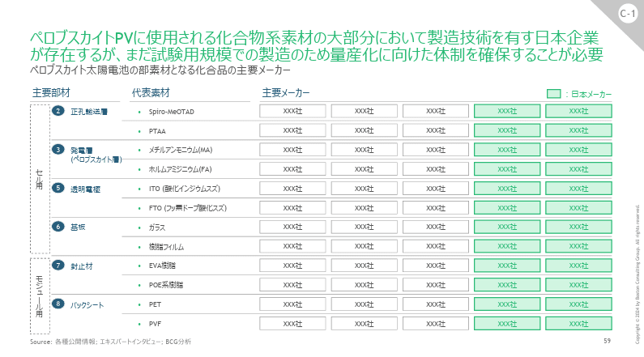
*こんなのとか*

> 引用元：[> 令和6年度エネルギー需給構造高度化対策調査等事業（次世代型太陽電池の需要等に関する調査）](https://www.meti.go.jp/meti_lib/report/2024FY/1000013.pdf)

*https://www.meti.go.jp/meti_lib/report/2024FY/itakuichiran2024FY.pdf*

ここからは少し上級者向けになりますが、図形を使って美しい表を作るテクニックを伝授していきます。**なおここからは「配置」の機能を多用**します。ショーカットはAlt＋JD＋AAになりますが、かなり使うのでクイックアクセスツールバーに入れてしまうのも手ですよ。

*配置の使い方*

### テーブルのセルを図形で表現する

最初のステップとして、**図形（四角）を均等に並べて、テーブルのセルを表現**します。

*箱を均等に並べる*

まずは**箱をコピーして横に並べて、グループ化**します。グループ化したうえで縦に並べてテーブルを作ります。

*一行分の箱のグループ*

この時、箱を均等に並べるために、「配置」の「上揃え」「左右に整列」を使います。箱のサイズの調整は、「図形の書式」⇒「レイアウト」で調整しましょう。ショートカットはALT＋JD＋H（高さ）かALT＋JD＋W（横）になります。

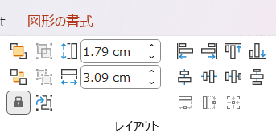
*箱のサイズの調整*

グループ化は同じように配置の中にあります。グループ化したら、それを必要な行数コピーして、下に並べたうえで、「配置」の「左揃え」「上下に整列」で調整します。

### 罫線を作ったうえで不要な枠線を消す

美しい表にする上では、**目立つ線はできるだけ消去する**ことが望ましいです。そのためには罫線を引いたうえで、セルの箱は可能な限り消すことが望ましいです。

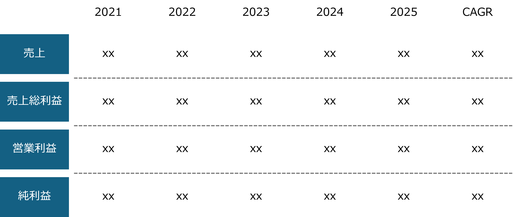
*枠線を消してすっきり見せた表*

まずはもう一度一列に戻ります。グループを解除したうえで、図形の直線を選んで、一番左の箱から右の箱まで、引きましょう。この時に**箱の真ん中の緑の点を使うと、水平な線を引くこと**ができます。ちなみにここで線が曲がっている場合、箱の上下がそろっていないということになります。

*仕切り線を水平にする方法*

ここで作った仕切り線をコピーした上で、「配置」の「右揃え」「上下に整列」を行って仕切り線を入れていきます。

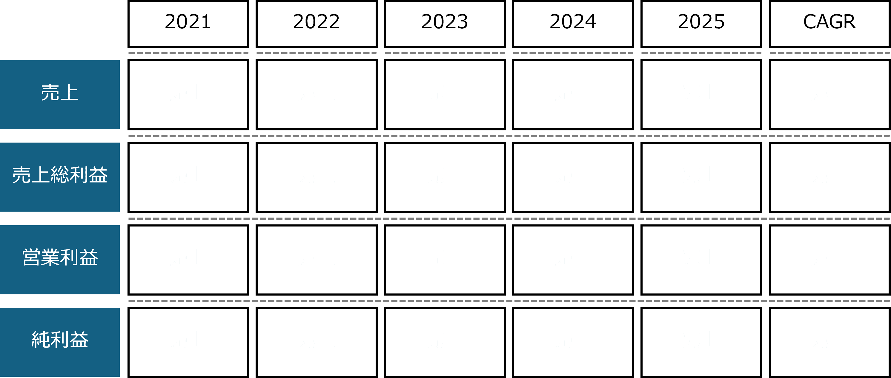
*仕切り線を上下に整列で入れる*

あとは数字を入れたうえで、箱の枠線を消しましょう。枠線は図形のスタイルの中にあります。図形の枠線のショートカットはALT＋JD＋SOです。

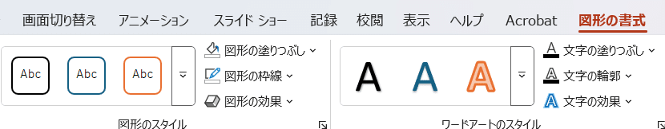
*図形の枠線を消す方法*

### 図形の効果で美しく見せる

図形を使って表を作るメリットが、図形の効果を使える点です。
例えば影を付けて立体的に見せる、見せたい数値の箱だけを囲って強調するなどが可能です。これはテーブルだとなかなか難しいです。

*影を付ける*

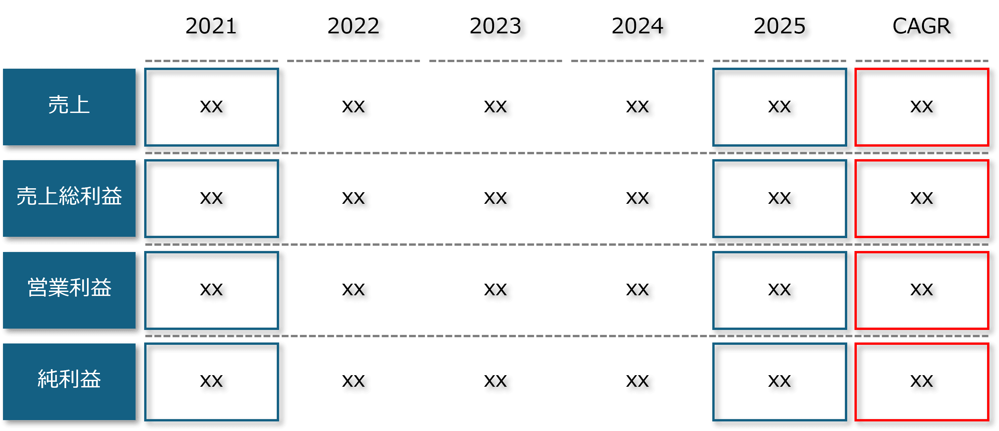
*色付きの枠で強調する*

参考になりましたでしょうか。図形を使った表は時間も手間もかかりますが、既存のテーブルに比べて美しいというのが伝わったかと思います。

ここからはグラフについて見ていきましょう。

## グラフを作成する上で意識したいポイント

### 強調したいとき以外は枠線を消す

一つ目のポイントは「枠線」です。表のところでも説明しましたが、美しいグラフを作るうえでは線はできるだけ無い方が望ましいです。
[【マネしたい】見やすいパワポの「棒グラフ」「複合グラフ」スライド９選](https://note.com/powerpoint_jp/n/n285958fc3427)でもいろいろなグラフを紹介しましたが、いずれも枠線は特にありません。

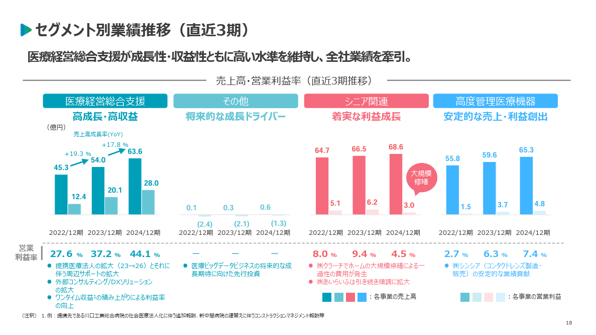
*ユカリア 東証グロース 286A*

> 引用元：[> 2024年12月期 通期決算説明資料](https://contents.xj-storage.jp/xcontents/AS96593/db79aabf/80ad/494d/8a69/57f6fa3e8ead/140120250226583009.pdf)

*https://eucalia.jp/ir/presentations/*

**逆に強調したい場合は枠線を使うのが有効**です。強調に限らず、何らかの意味を持たせたい場合には枠線は有効な手段になりますね。
見込み案件の場合に枠線を破線にするなどの見せ方もあります。

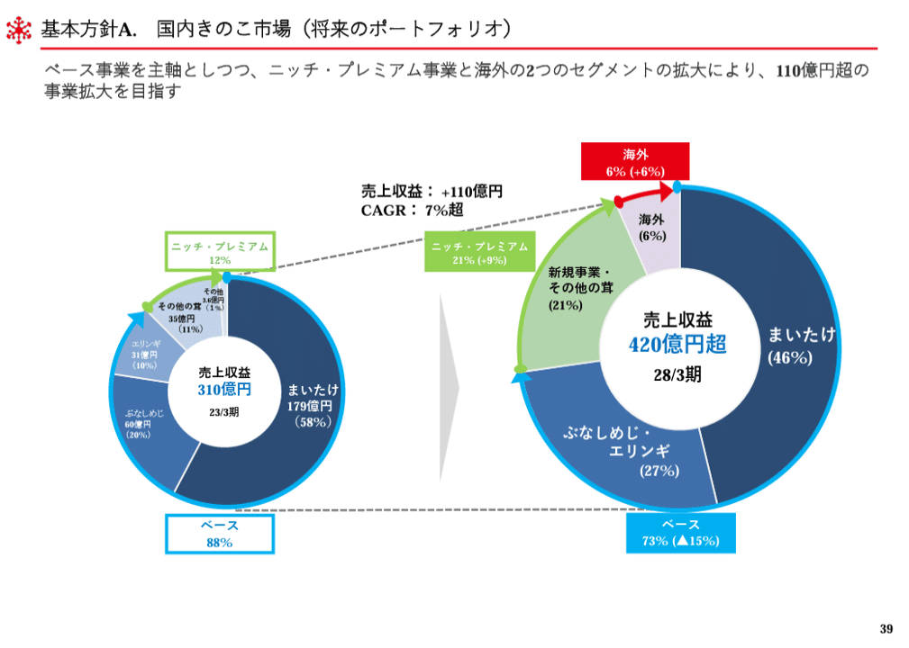
*ユキグニファクトリー 東証プライム 1375*

> 引用元：[> 2025年3月期 決算説明資料](https://ssl4.eir-parts.net/doc/1375/tdnet/2606620/00.pdf)

*https://www.yukiguni-factory.co.jp/ir/library/presentations/*

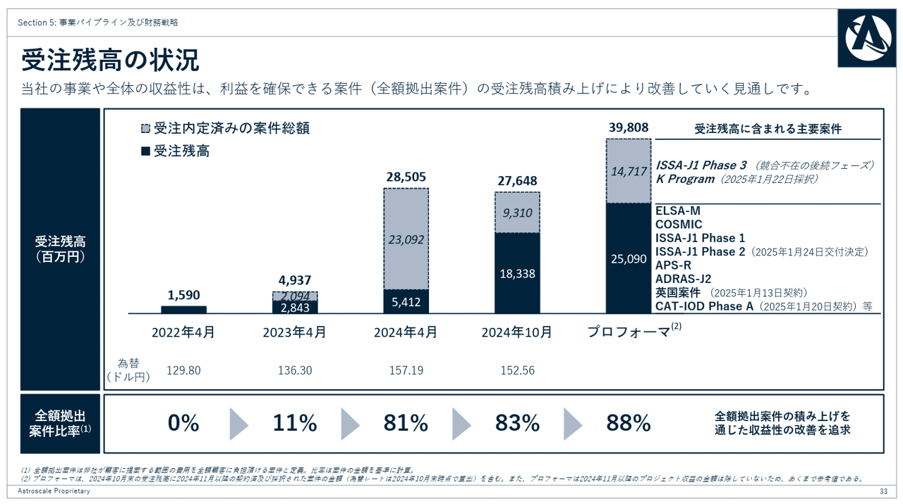
*アストロスケール 東証グロース 186A*

> 引用元：[> 2025年4月期下期 事業説明会資料](https://contents.xj-storage.jp/xcontents/AS82438/7acb88c3/fccf/4f4f/86f8/c5d388e39b49/20250127004923959s.pdf)

*https://www.astroscale.com/ja/ir/news?category=presentations*

### 同系色を基本としつつ強調したい際は差し色を入れる

グラフを作るうえでは同系色でそろえるの基本です。落ち着いた色をベースにすることでスライド全体が引き締まります。これは棒グラフや円グラフ、滝グラフなどグラフの種類を問わず有効です（下記は[【マネしたい】可視化が上手い「ウォーターフォールチャート」「積み上げグラフ」スライド９選](https://note.com/powerpoint_jp/n/nf87a1ea252ce#f0b8647d-bc97-42bd-a9be-82ee5f8e7885)で取り上げた東レのチャート）。

*東レ 東証プライム 3402*

> 引用元：[> 説明資料](https://www.toray.co.jp/ir/pdf/lib/lib_a643.pdf)

*https://www.toray.co.jp/ir/library/data/*

*コージンバイオ 東証グロース 177A*

> 引用元：[> 2025年3月期通期決算説明資料](https://kohjin-bio.jp/wp-content/uploads/2025_03_Financial_Report.pdf)

*https://kohjin-bio.jp/ir/presentations/*

逆に強調したい場合は差し色を入れるのが効果的です。差し色にコーポレートカラーを持ってくると、プレゼンテーション全体が見やすくなります。
[【マネしたい】見やすいパワポの「円グラフ」スライド９選](https://note.com/powerpoint_jp/n/n6bafe5e67864)で見たマクビープラネットのスライドがすごくわかりやすいです。

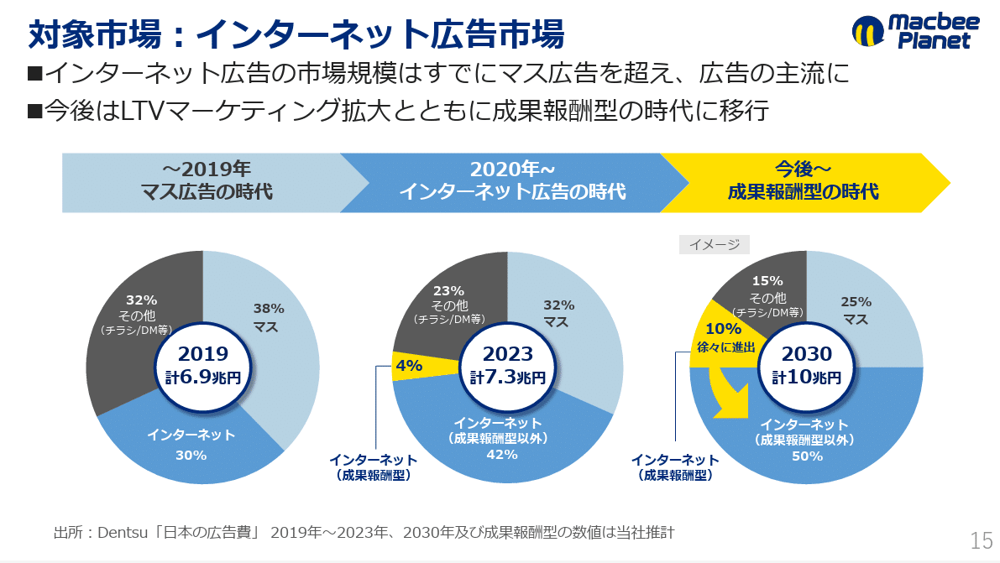
*Macbee Planet 東証プライム 7095*

### 繰り返し情報はできるだけ削る

最後は情報リッチなスライドを作る際に意識したいポイントです。
例えば同じ形式のグラフを縦に並べる場合、すべてのグラフに棒の説明を入れると文字が増えてしまいます。そうした状況を防ぐために、**グラフの説明は上か下にまとめる**方がよいです。
また、**書かなくてもわかる情報は書かなくてよい**です。例えば長い時系列グラフの途中の年数や、年齢別の分布を棒グラフを並べて見る場合などがそれに該当します。

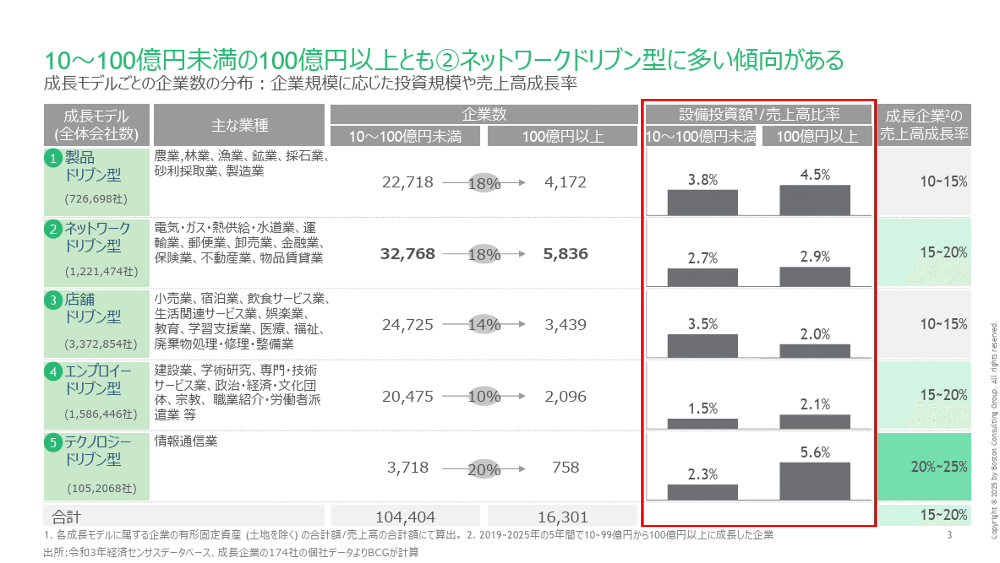
*グラフの説明をまとめている例*

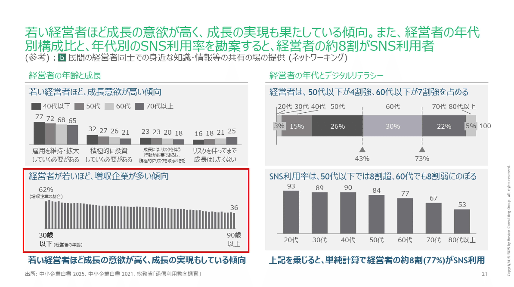
*書かなくてもわかる情報は省いている例*

> 引用元：[> 令和6年度中小企業実態調査事業(100 億企業創出加速化に向けた調査)報告書](https://www.meti.go.jp/meti_lib/report/2024FY/000032.pdf)

*https://www.meti.go.jp/meti_lib/report/2024FY/itakuichiran2024FY.pdf*

## 【パワポ研直伝】見やすいスライドを作成するためのテクニックまとめ

今回はこれまでパワポ研がパワーポイントの研究をしてきた中で蓄積された、美しい表やグラフを作るための極意をお伝えしてきました。すぐ取り組める事例から少し習熟に時間がかかる事例まで用意しましたが、皆様の参考になりそうな事例が一つでもあれば、幸いです。

## パワポ研オリジナルテンプレート

パワポ研では、「ビジネスシーンで使える」パワーポイントテンプレートを公開しております。デザインを整えるのみならず、**ロジックやストーリーを整理するのにも役立つパッケージ**になっておりますので、関心のある方は下記ページも併せてご覧ください！

上記の記事のように、noteでは**フォローしているだけでビジネスにおける「資料作成のコツ」と「デザインのセンス」が身に付くアカウント**を目指して情報配信を行っています。
今後もコンスタントに記事を配信していく予定なので、関心のある方は是非アカウントのフォローをお願いします！

**> Template販売　**[> https://powerpointjp.stores.jp/](https://powerpointjp.stores.jp/%EF%BF%BCnote)
**> note　**[> パワポ研の資料作成術](https://note.com/powerpoint_jp/m/mc291407396da)
**> X（旧Twitter)　**[> https://twitter.com/powerpoint_jp](https://twitter.com/powerpoint_jp)

## レックスアドバイザーズからのお知らせ

パワポ研は株式会社レックスアドバイザーズが運営しています。
レックスアドバイザーズは**経営企画職や経営管理職に特化した転職エージェント**です。
上場企業や上場準備企業を中心に、**経営企画、IR、経理財務、法務、内部監査等の職種の求人**をご紹介しているほか、**CFOなどのコンフィデンシャル求人**もご紹介可能です。
またコンサルティングファームや監査法人、会計事務所の求人も豊富にあるため、プロフェッショナルファームを目指す方のご支援も得意です。
求人紹介やキャリア相談を希望の方は、[**無料転職サポート**](https://www.career-adv.jp/job_search/entryform_exp/)よりサービス利用登録をしてみてください。

*レックスアドバイザーズのサービスサイトはこちらから*

**> 求人をご希望の方　**[> 無料転職サポート](https://www.career-adv.jp/job_search/entryform_exp/)**
> 採用支援をご希望の方　**[> 採用サポート](https://www.career-adv.jp/request3/)
**> その他　**[> お問い合わせフォーム](https://www.rex-adv.co.jp/contact)
**> 書籍　**[> 注目企業の実例から学ぶパワポ作成術](https://www.amazon.co.jp/dp/4046060476)

