# 【パワポ研厳選】2025年に上場した「スライド作成の見本にしたい」スタートアップ１５選

[note原文](https://note.com/powerpoint_jp/n/n7ab95a1513bb)

みなさんこんにちは。
資料デザインのリサーチや分析に取り組むパワーポイントのスペシャリスト、パワポ研です。

2025年も65社もの企業が上場しましたが、グロース市場に上場したスタートアップを中心に、上場時に公開される資料が「事業計画及び成長可能性に関する事項」のパワーポイント資料です。
新規上場時の売出価格やその後の出来高にも影響する非常に重要な資料であることから、**「事業計画及び成長可能性に関する事項」の資料は各社力を入れて作っています**が、年々レベルが上がっており、参考になるパワポ資料の宝庫となっています。

そこで今回は**2025年に上場したスタートアップの「事業計画及び成長可能性に関する事項」の資料から特に参考になる資料をピックアップして紹介**していきます。
既に【マネしたい】シリーズの中で紹介している企業のパワポ資料も多いので、どのNoteで触れているかも合わせてご紹介していきますね。
なお、【マネしたい】シリーズのリンクまとめはこちらから。

では早速行きましょう！

## 株式会社フライヤー

2025年2月20日に東証グロースに上場した株式会社フライヤーの「事業計画及び成長可能性に関する事項」の資料です。フライヤー社は「本の要約サービス」を軸に、人材教育やマネジメントの領域にサービスを展開しています。

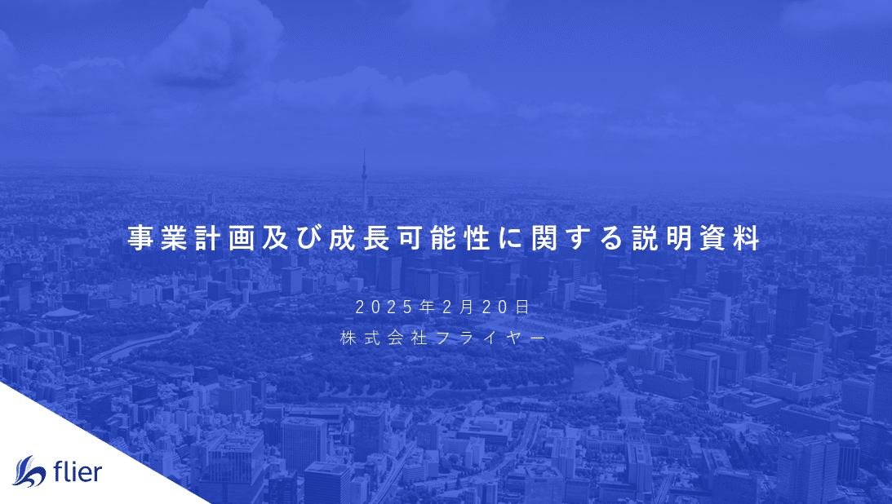
> 引用元：[> 事業計画及び成長可能性に関する説明資料](https://contents.xj-storage.jp/xcontents/AS09236/b9c849be/4eec/4bf0/99f8/ba09ce7646ee/140120250219578808.pdf)

*https://corp.flierinc.com/ir/library*

パワーポイント資料の特徴としては、**シンプルで力強いスライドが多い**ことが挙げられます。伝えたいメッセージに対して、グラフや事例の選び方がとてもうまく参考になります。グラフや図の見せ方の工夫もよいですね。

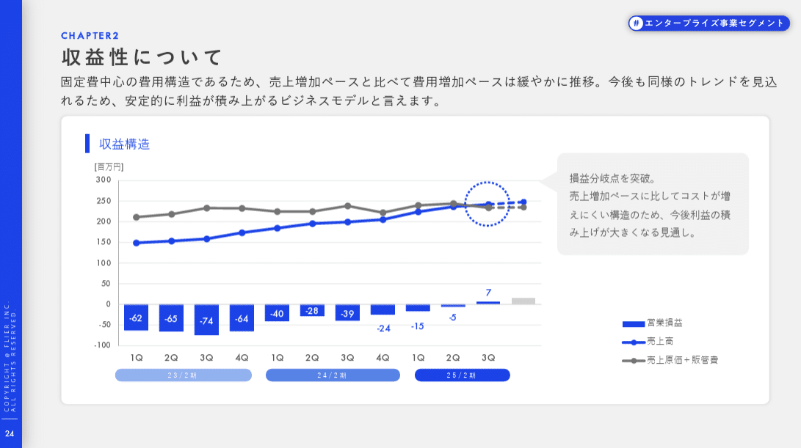

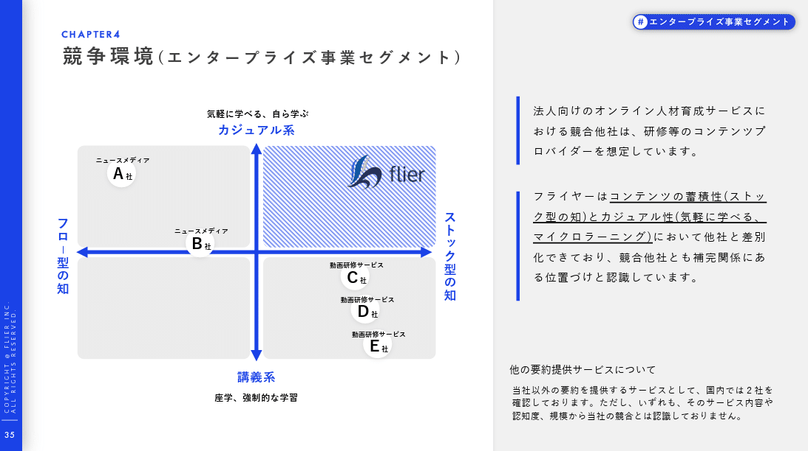

パワポ研では以下のNoteでフライヤー社のパワポを紹介しています。

- [おしゃれなパワポの「折れ線グラフ」スライド９選](https://note.com/powerpoint_jp/n/n4d105e11f613)

- [かっこいいパワポの「ロードマップ」スライド９選](https://note.com/powerpoint_jp/n/nef4eb14dc50f)

- [パワポの「資金調達ピッチ」作成ポイントと参考スライド集](https://note.com/powerpoint_jp/n/n6b6db49c6081)

## 株式会社TENTIAL

2025年2月28日に東証グロースに上場した株式会社TENTIALの「事業計画及び成長可能性に関する事項」の資料です。TENTIAL社はリカバリーウェアのBAKUNEを製造販売しています。

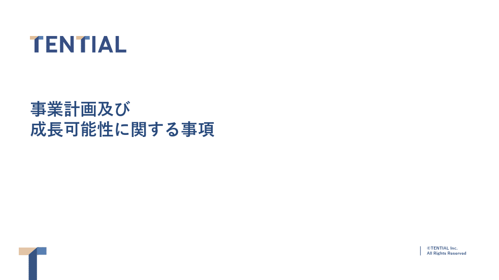
> 引用元：[> 事業計画及び成長可能性に関する事項](https://ssl4.eir-parts.net/doc/325A/tdnet/2574510/00.pdf)

*https://corp.tential.jp/ir/library/*

パワーポイント資料の特徴としては、**とにかくデザインが優れている**ことが挙げられます。紺色と金色の配色が素晴らしいことに加え、リボンやディバイダーの使い方もうまく、高級感のあるパワポに仕上がっています。

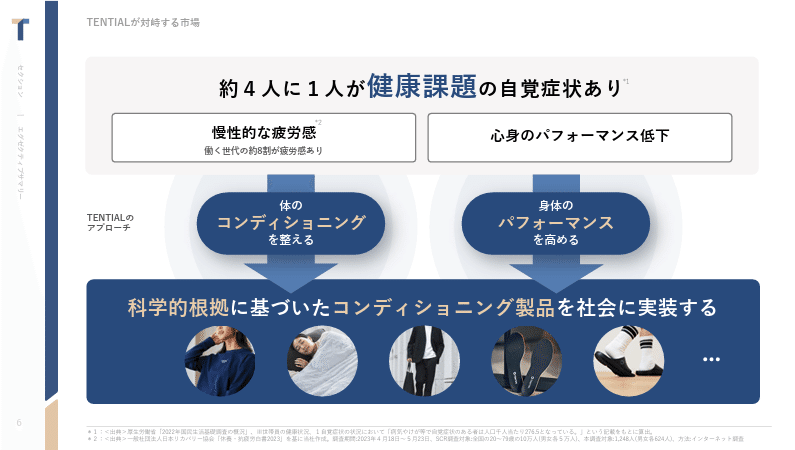

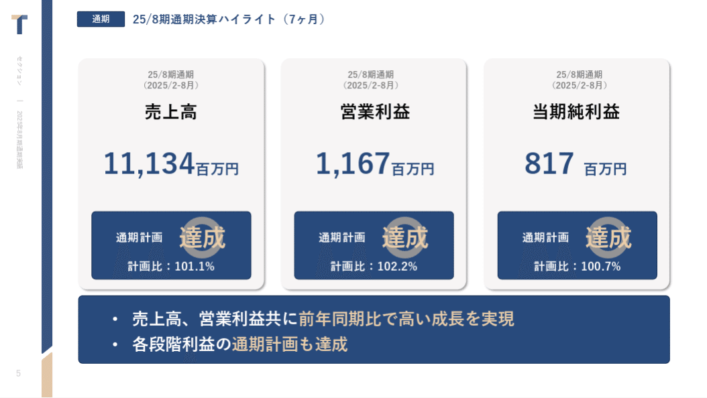

パワポ研では以下のNoteでTENTIAL社のパワポを紹介しています。

- [カッコいいパワポの「マトリックス」スライド９選](https://note.com/powerpoint_jp/n/na3237006af1c)

- [おしゃれなパワポのスライド「レイアウト」９選](https://note.com/powerpoint_jp/n/n816b11bf9c03)

- [おしゃれなパワポの「マーカー」スライド９選](https://note.com/powerpoint_jp/n/n4b2540bb1e83)

- [色の組み合わせがおしゃれなパワポのプレゼン９選](https://note.com/powerpoint_jp/n/na02d7822ebc3)

- [パワポのディバイダーのデザインとスライド例２０選](https://note.com/powerpoint_jp/n/ncbf53b3635fb)

- [パワポのページ番号の編集方法とデザイン例２５選](https://note.com/powerpoint_jp/n/nbaf520b586e6)

- [パワポの「資金調達ピッチ」作成ポイントと参考スライド集](https://note.com/powerpoint_jp/n/n6b6db49c6081)

## 株式会社TalentX

2025年3月18日に東証グロースに上場した株式会社TalentXの「事業計画及び成長可能性に関する事項」の資料です。TalentXは人材採用のためのSaaSソリューションを提供しています。

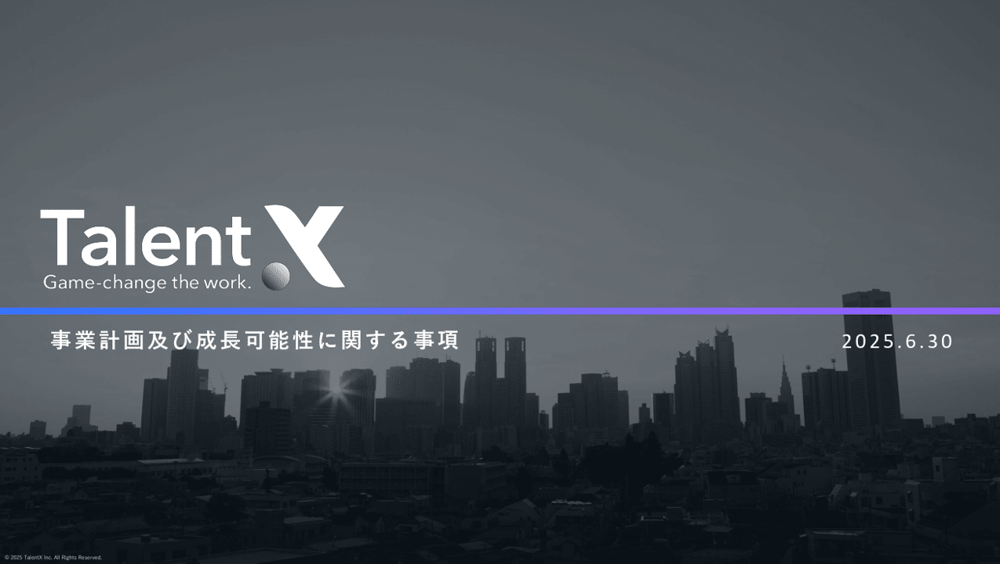
> 引用元：[> 事業計画及び成長可能性に関する事項](https://ssl4.eir-parts.net/doc/330A/tdnet/2581999/00.pdf)

*https://talentx.co.jp/ir/news*

パワーポイント資料の特徴としては、**自社のサービスラインの説明と、複数のサービスラインがどう優位性につながるかの説明が巧み**な点が挙げられます。目指す世界観とその背景などのストーリーの組み立てもよいですね。

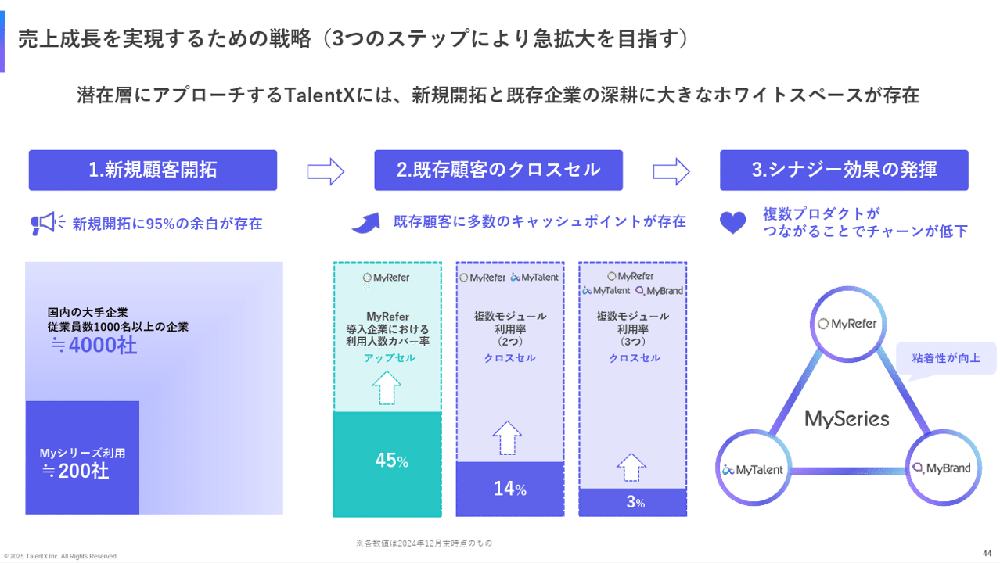

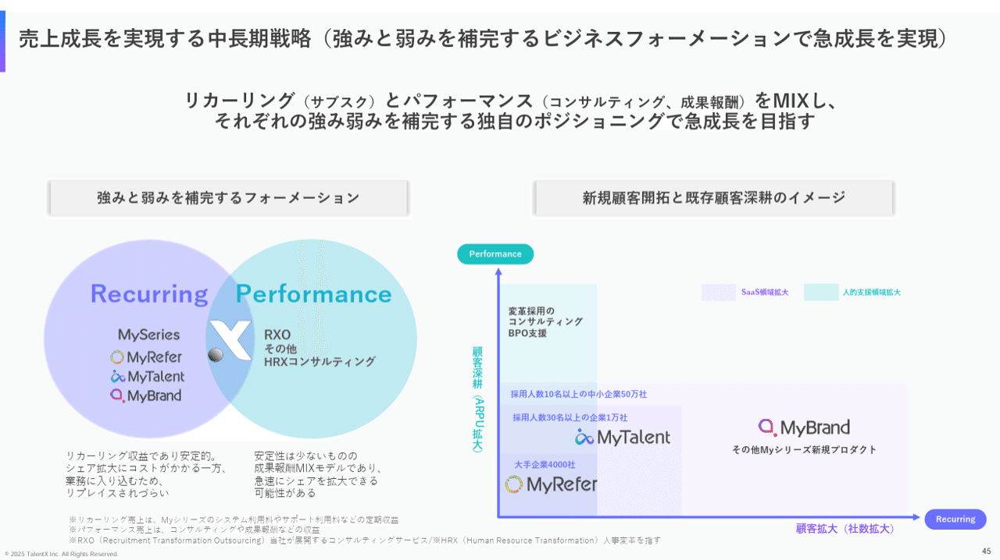

## ミーク株式会社

2025年3月21日に東証グロースに上場したミーク株式会社の「事業計画及び成長可能性に関する事項」の資料です。ミーク社はSonyからスピンアウトした、モバイルIoT支援事業を行っている企業です。

> 引用元：[> 事業計画及び成長可能性に関する事項](https://ssl4.eir-parts.net/doc/332A/tdnet/2582998/00.pdf)

*https://www.meeq.com/ir/news/*

パワーポイント資料の特徴としては、**プラットフォーマーとしてのサービスの広がりを見せるのが上手い**点が挙げられます。Sonyの技術に裏付けられた手堅いビジネスを起点に、着実な成長が期待できることがよく伝わります。

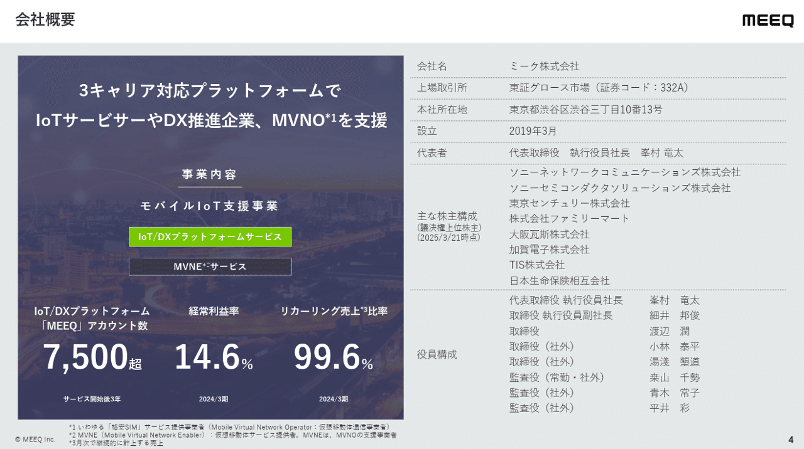

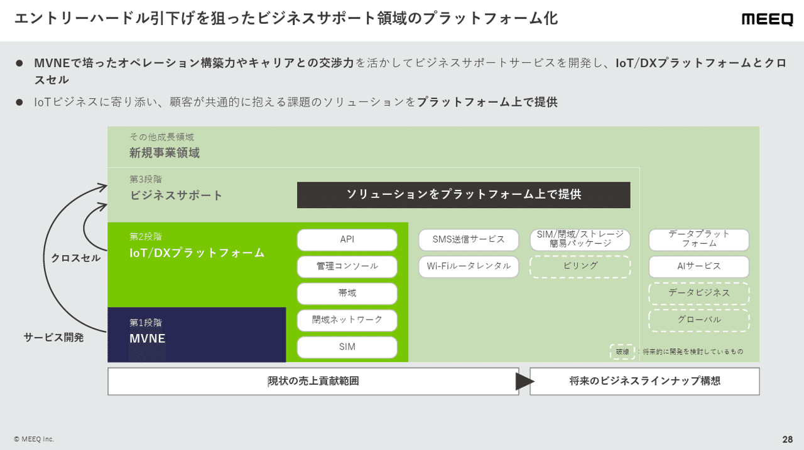

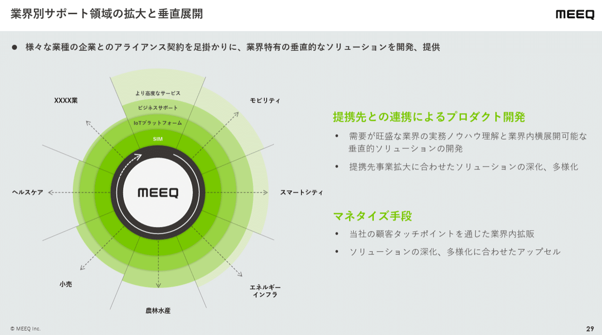

## 株式会社ミライロ

2025年3月24日に東証グロースに上場した株式会社ミライロの「事業計画及び成長可能性に関する事項」の資料です。ミライロは障害者手帳を代替するミライロIDを軸に、障害者プラットフォーム事業を展開しています。

> 引用元：[> 事業計画及び成長可能性に関する事項](https://ssl4.eir-parts.net/doc/335A/tdnet/2583569/00.pdf)

*https://www.mirairo.co.jp/ir/news*

パワーポイント資料の特徴としては、**今なぜ自社のサービスが必要とされているかのストーリー構成が上手い点**が挙げられます。障害者IDや障害者プラットフォームがなぜ必要とされているのか、という部分ですね。こうした社会的なインパクトのある事業を展開している企業の場合、背景の社会ニーズの説明は肝になってきますね。

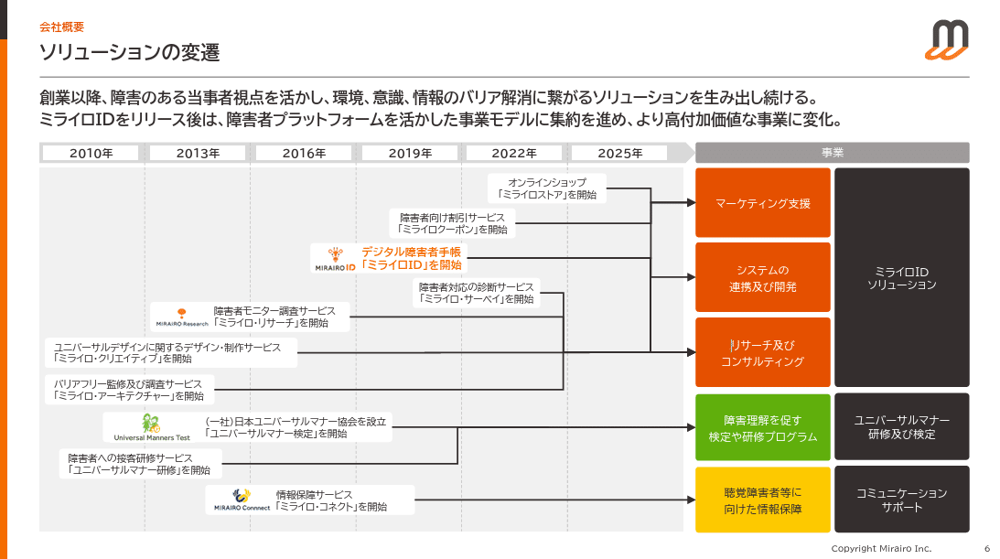

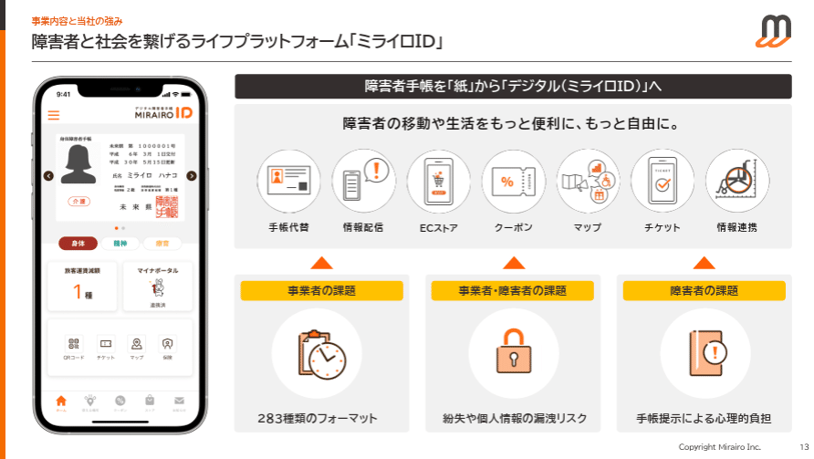

パワポ研では以下のNoteでミライロ社のパワポを紹介しています。

- [パワポのディバイダーのデザインとスライド例２０選](https://note.com/powerpoint_jp/n/ncbf53b3635fb)

- [パワポの「資金調達ピッチ」作成ポイントと参考スライド集](https://note.com/powerpoint_jp/n/n6b6db49c6081)

## 株式会社ジグザグ

2025年3月31日に東証グロースに上場した株式会社ジグザグの「事業計画及び成長可能性に関する事項」の資料です。EC事業者と海外の購入者をつなぐサービスを展開しており、現在は海外購入者向けの購入代行がメインです。

> 引用元：[> 事業計画及び成長可能性に関する事項](https://ssl4.eir-parts.net/doc/340A/tdnet/2587239/00.pdf)

*https://ir.zig-zag.co.jp/news/*

パワーポイント資料の特徴としては、**図とテキストの組み合わせ方の上手さ**が挙げられます。配色や手レイアウトの工夫によって、図をメインに最低限のテキストで詳細を補足するデザインとなっています。

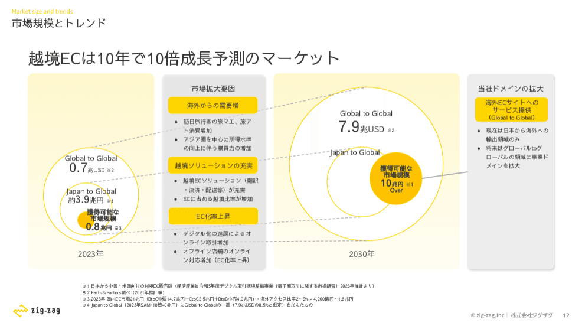

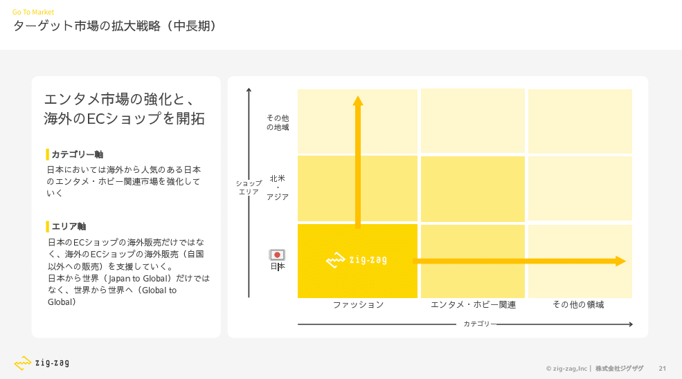
パワポ研では以下のNoteでジグザグ社のパワポを紹介しています。

- [おしゃれなパワポの「黄色」プレゼン３選](https://note.com/powerpoint_jp/n/n479a7aaacc39)

## デジタルグリッド株式会社

2025年4月22日に東証グロースに上場したデジタルグリッド株式会社の「事業計画及び成長可能性に関する事項」の資料です。上場直後のパワポよりも、その後の決算発表資料のパワポの方が参考になります。
デジタルグリッド社は再生可能エネルギーを中心とする電力取引PFを起点に様々なソリューションを提供しています。

> 引用元：[> 2025年7月期通期_決算説明資料（事業計画及び成長可能性に関する事項）](https://ssl4.eir-parts.net/doc/350A/tdnet/2686461/00.pdf)

*https://www.digitalgrid.com/ir/news/*

パワーポイント資料の特徴としては、**資料全体を通してデザインのレベルの高さ**が挙げられます。再エネ発電所の画像を使った背景や、図やテキストのレイアウト、定量情報や定性情報の見せ方など、全てにおいてかなりハイレベルな資料となっています。

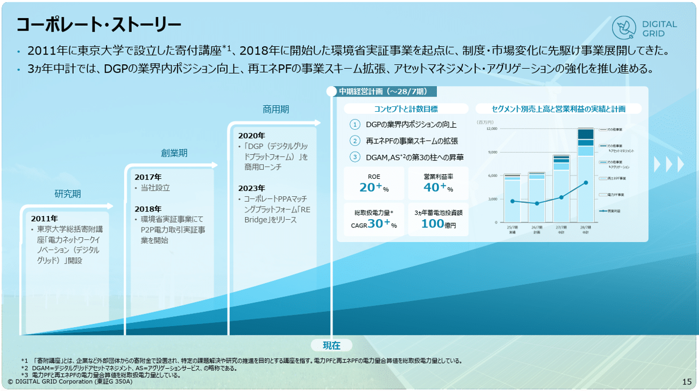

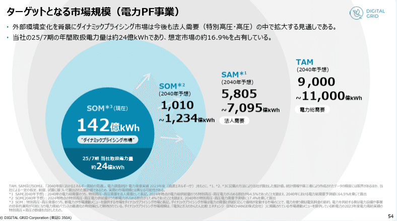
パワポ研では以下のNoteでデジタルグリッド社のパワポを紹介しています。

- [見やすいパワポの「タイムライン」「時系列」スライド９選](https://note.com/powerpoint_jp/n/n13417981793d)

- [おしゃれなパワポの「箇条書き」スライド９選](https://note.com/powerpoint_jp/n/n00e1bf7dc2fd)

- [背景の色や画像がおしゃれなパワポのスライド５選](https://note.com/powerpoint_jp/n/n7bace1935705)

- [パワポのディバイダーのデザインとスライド例２０選](https://note.com/powerpoint_jp/n/ncbf53b3635fb)

- [パワポの「資金調達ピッチ」作成ポイントと参考スライド集](https://note.com/powerpoint_jp/n/n6b6db49c6081)

## ウェルネス・コミュニケーションズ株式会社

2025年6月23日に東証グロースに上場したウェルネス・コミュニケーションズ株式会社の事業計画及び成長可能性に関する事項」の資料です。ウェルネス・コミュニケーションズ社は伊藤忠の社内ベンチャーとして、検診ソリューションと健康管理クラウドの２つのサービスを提供しています。

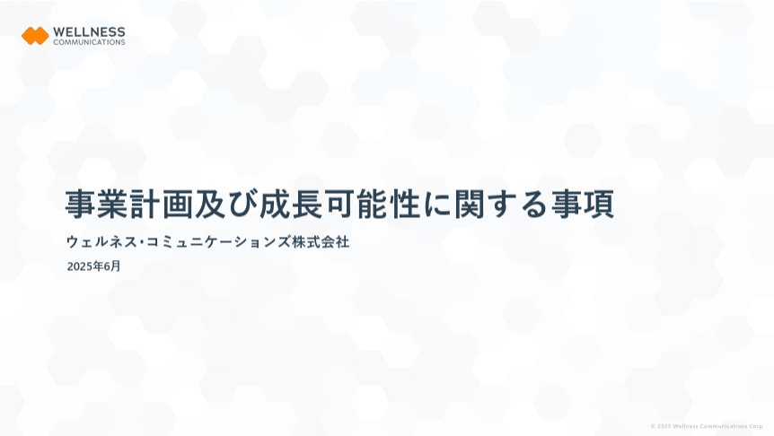
> 引用元：[> 事業計画及び成長可能性に関する事項](https://contents.xj-storage.jp/xcontents/AS05024/f07105d4/224b/4949/bb38/3f16e6c11299/140120250620595058.pdf)

*https://wellcoms.jp/ir/news/*

パワーポイント資料の特徴としては、**２つの主要サービスの位置づけや成長性をうまく見せている点**が挙げられます。青色とオレンジ色の組み合わせも落ちついた見やすいデザインとなってますよ。

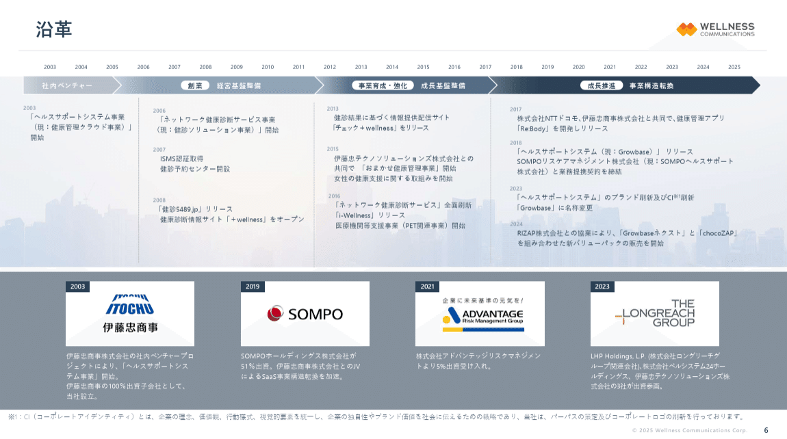

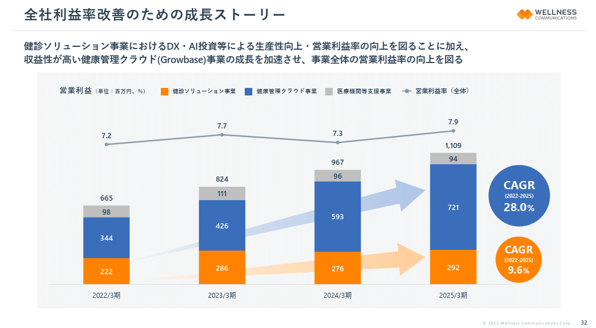

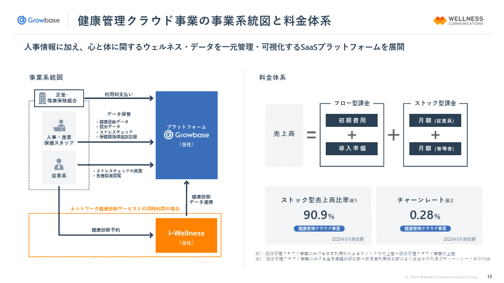
パワポ研では以下のNoteでウェルネス・コミュニケーションズ社のパワポを紹介しています。

- [見やすいパワポの「棒グラフ」「複合グラフ」スライド９選](https://note.com/powerpoint_jp/n/n285958fc3427)

- [見やすいパワポの「タイムライン」「時系列」スライド９選](https://note.com/powerpoint_jp/n/n13417981793d)

- [かっこいいパワポの「ロードマップ」スライド９選](https://note.com/powerpoint_jp/n/nef4eb14dc50f)

- [色の組み合わせがおしゃれなパワポのプレゼン９選](https://note.com/powerpoint_jp/n/na02d7822ebc3)

- [パワポの「資金調達ピッチ」作成ポイントと参考スライド集](https://note.com/powerpoint_jp/n/n6b6db49c6081)

## 株式会社リップス

2025年6月30日に東証グロースに上場した株式会社リップスの事業計画及び成長可能性に関する事項」の資料です。リップス社は男性向け化粧品でシェアを拡大している新興コスメメーカーです。

> 引用元：[> 事業計画及び成長可能性に関する事項](https://contents.xj-storage.jp/xcontents/AS83314/f142e7e4/91cd/4271/956e/c01b106ffaef/20250704131926507s.pdf)

*https://lipps.co.jp/ir/news/*

パワーポイント資料の特徴としては、**赤を中心に鮮やかな色を多数使いながらも見やすいデザインとなっている点**が挙げられます。B2Cに強いコスメティック企業ならではという感じです。

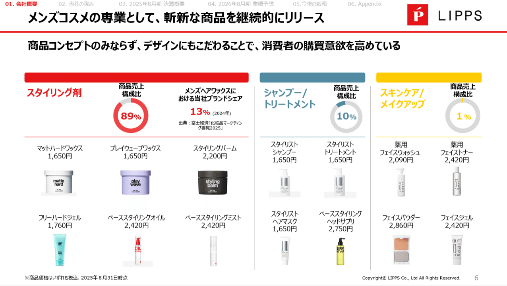

パワポ研では以下のNoteでリップス社のパワポを紹介しています。

- [見やすいパワポの「棒グラフ」「複合グラフ」スライド９選](https://note.com/powerpoint_jp/n/n285958fc3427)

- [かっこいいパワポの「ロードマップ」スライド９選](https://note.com/powerpoint_jp/n/nef4eb14dc50f)

- [色の組み合わせがおしゃれなパワポのプレゼン９選](https://note.com/powerpoint_jp/n/na02d7822ebc3)

## 株式会社ヒット

2025年7月4日に東証グロースに上場した株式会社ヒットの事業計画及び成長可能性に関する事項」の資料です。デジタルサイネージを中心とした屋外広告を展開しており、一時３D広告がかなり話題になりました。

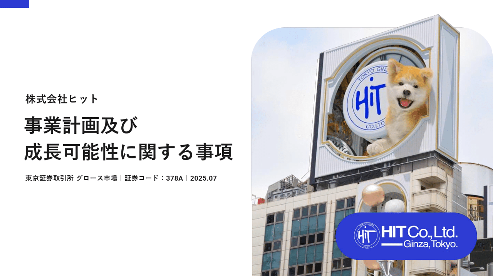
> 引用元：[> 事業計画及び成長可能性に関する事項について](https://contents.xj-storage.jp/xcontents/AS06556/7c2b752b/d368/481e/bf43/b8c15f956566/140120250703507829.pdf)

*https://www.hit-ad.co.jp/ir/news.html*

パワーポイント資料の特徴としては、**かっちりした見やすいレイアウト**が挙げられます。屋外広告という魅力薄にも映るマーケットで、なぜ高成長や高収益を実現できるのかの説明がすごくわかりやすい資料です。

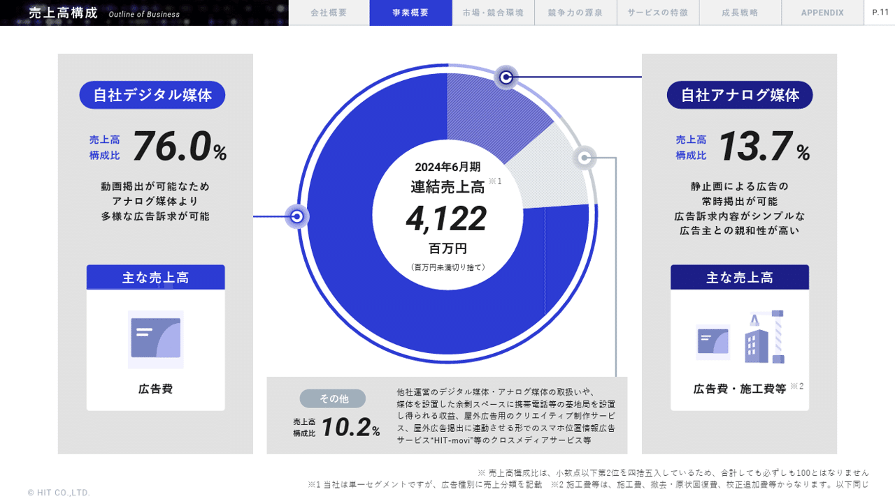

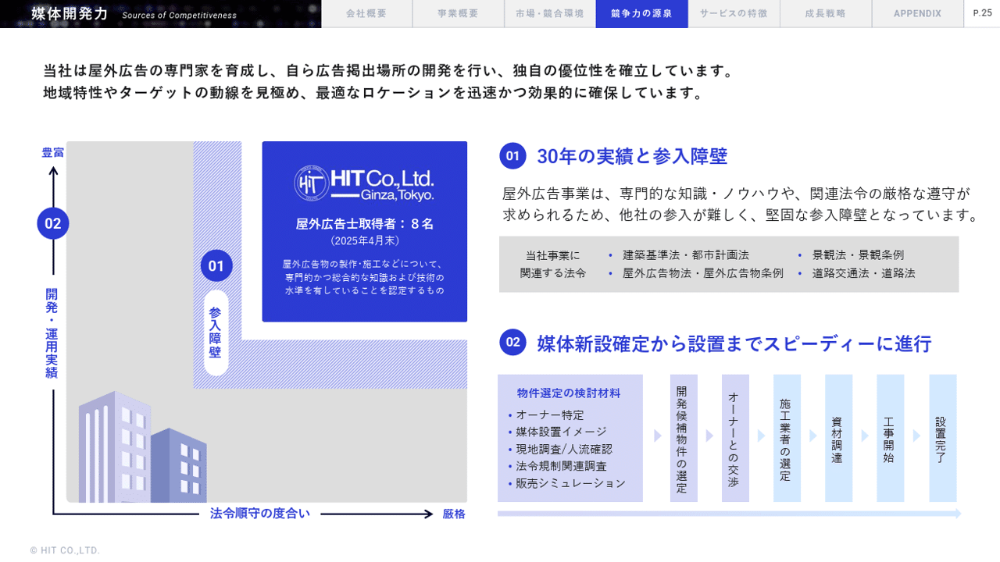

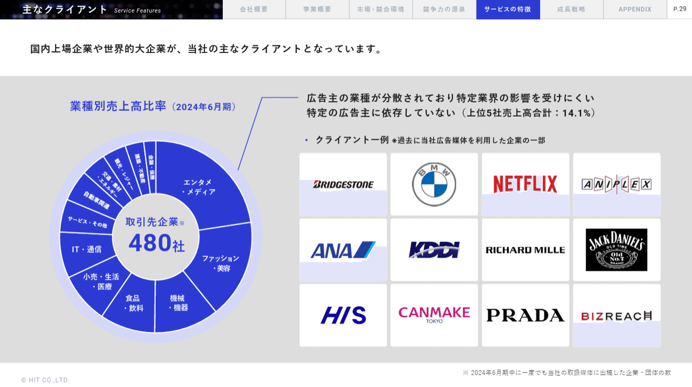

## GMOコマース株式会社

2025年9月25日に東証グロースに上場したGMOコマース株式会社の事業計画及び成長可能性に関する事項」の資料です。GMOコマースは購買者データを使ったマーケティングの高度化支援を行っています。

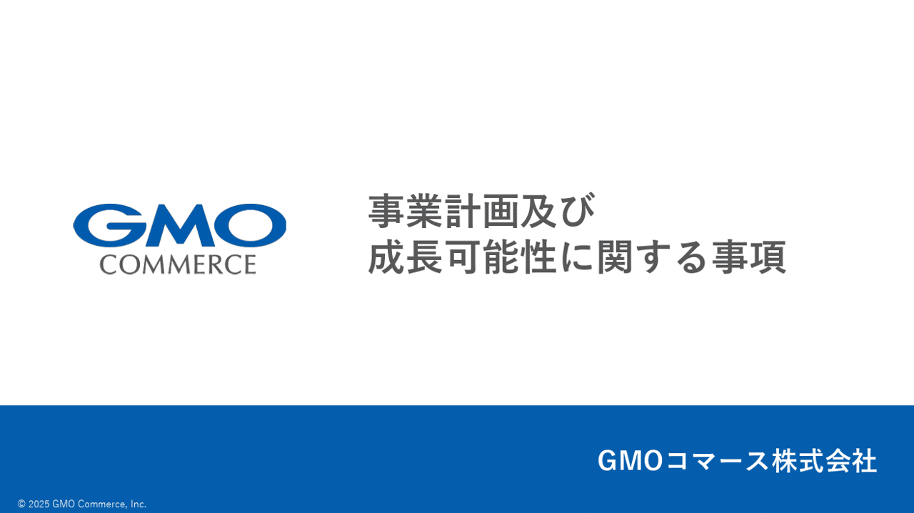
> 引用元：[> 事業計画及び成長可能性に関する事項](https://pdf.irpocket.com/C410A/K2Hn/B572/uhFT.pdf)

*https://ir.gmoc.jp/news/*

パワーポイント資料の特徴としては、**強みや競合比較のスライドのバリュエーションが豊富な点**が挙げられます。全体的に青ベースですっきりとまとまっている点もよいですね。

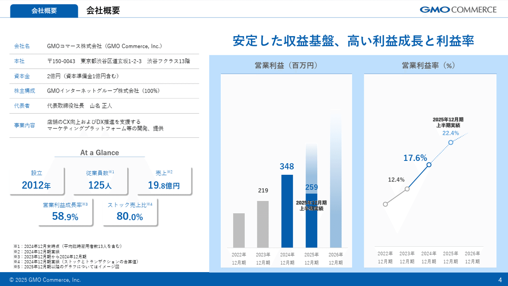

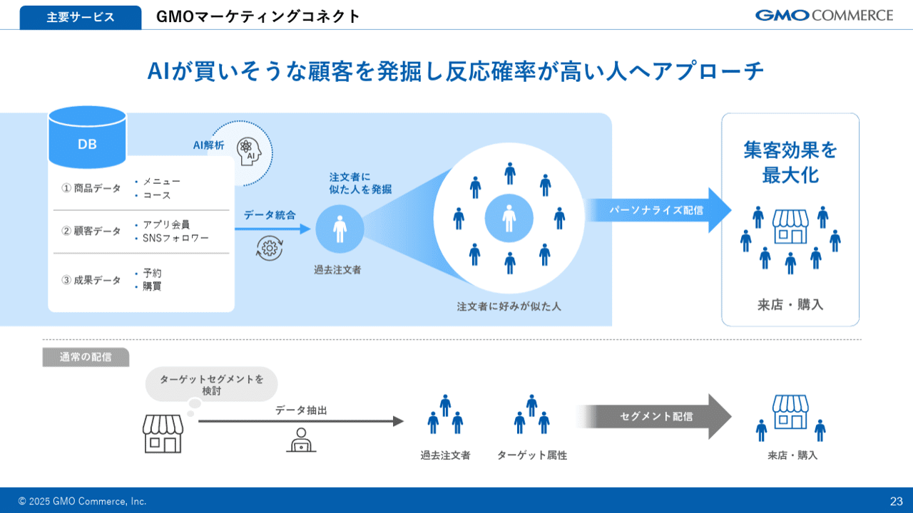

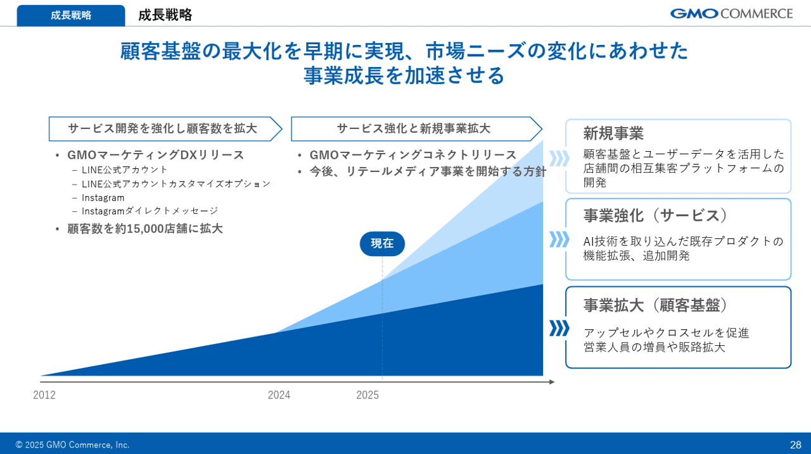

## NE株式会社

2025年11月4日に東証グロースに上場したNE株式会社の事業計画及び成長可能性に関する事項」の資料です。NE社は多店舗EC事業者向けプラットフォーム事業を展開しており、Hamee社からスピンオフ上場しました。

> 引用元：[> 事業計画及び成長可能性に関する事項](https://contents.xj-storage.jp/xcontents/AS06428/8429ca6a/1336/4eef/a3d2/4fd7480dd8d5/140120251030583355.pdf)

*https://ne-inc.jp/investor/library/*

パワーポイント資料の特徴としては、**なぜスピンオフ上場するのかの説明が丁寧にされている点**が挙げられます。全体的に必要十分な情報をすっきりとまとめた見やすさ重視のスライドが多いですが、キースライドである競争優位性のスライドはこだわりが見られますね。

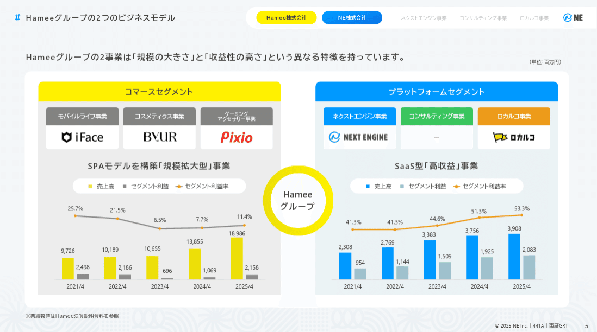

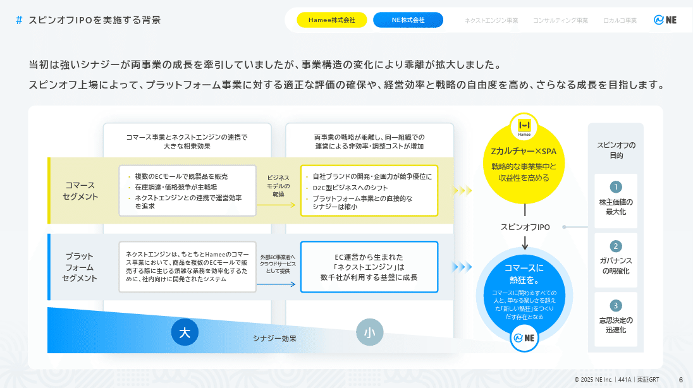

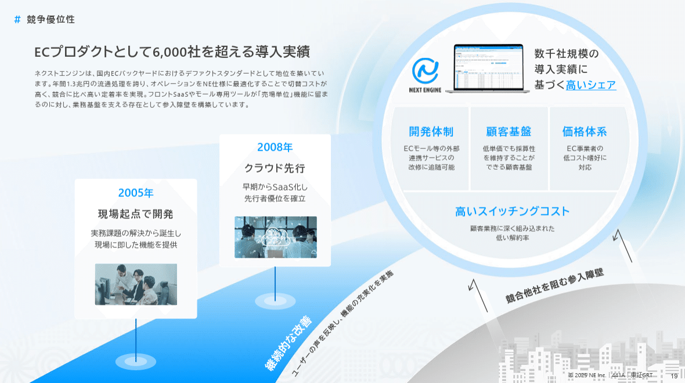

## 株式会社ノースサンド

2025年11月21日に東証グロースに上場した株式会社ノースサンドの事業計画及び成長可能性に関する事項」の資料です。ノースサンド社はベイカレント・コンサルティング出身のメンバーが立ち上げたITコンサルティングファームで、独自のポジショニングで高成長を実現しています。

> 引用元：[> （差替え）「事業計画及び成長可能性に関する事項」の差替えについて](https://contents.xj-storage.jp/xcontents/AS83453/04a57b47/8e2b/4bf0/8809/9ef24e1ac56c/140120251121507883.pdf)

*https://northsand.co.jp/ir/ir-news/*

パワーポイント資料の特徴としては、**独自のポジショニングを伝えるべく、競合があまり使わないゆるめのイラストを多用している点**が挙げられます。
競合と全く違うというだけでも目を引きますが、「人間力重視」というポジショニングと合うイラストを多用することで、資料としての完成度も高いです。

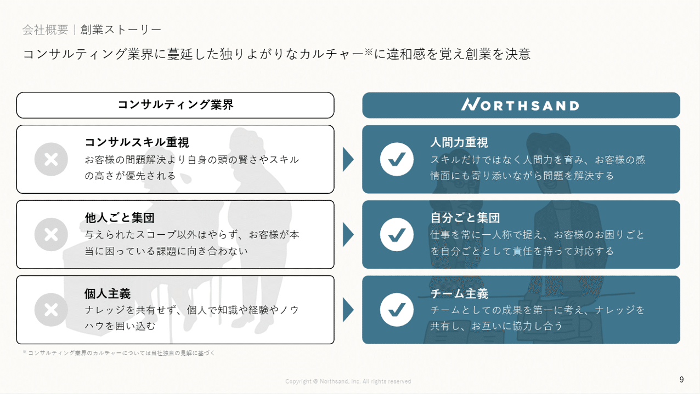

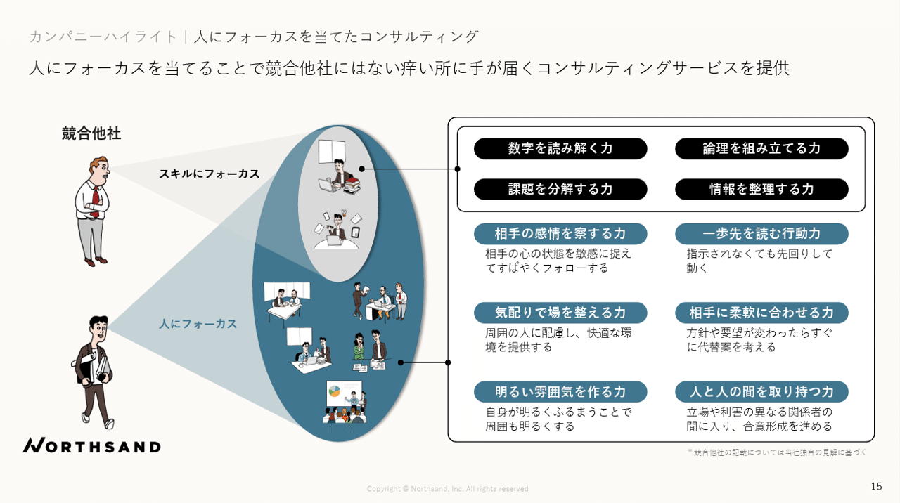

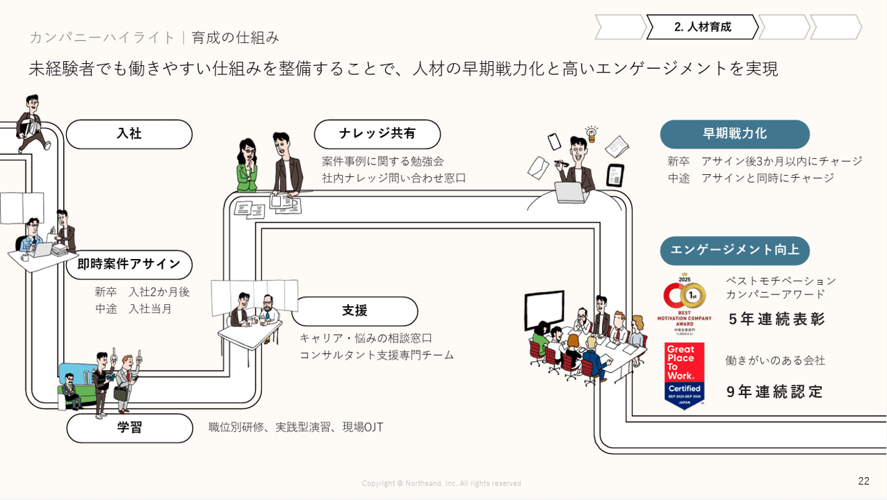
パワポ研では以下のNoteでノースサンド社のパワポを紹介しています。以前Xでも取り上げましたが、たくさんの反響をいただいており、ノースサンド社への注目の高さがうかがえます。

- [上場しているＩＴコンサルティングファームのスライド資料](https://note.com/powerpoint_jp/n/nd40e533c5632)

## 株式会社FUNDINNO

2025年12月5日に東証グロースに上場した株式会社FUNDIINOの事業計画及び成長可能性に関する事項」の資料です。ファンディーノ社は株式投資型クラウドファンディング事業を提供しています。

> 引用元：[> 事業計画及び成長可能性に関する事項](https://ssl4.eir-parts.net/doc/462A/tdnet/2728142/00.pdf)

*https://corp.fundinno.com/ir/news/*

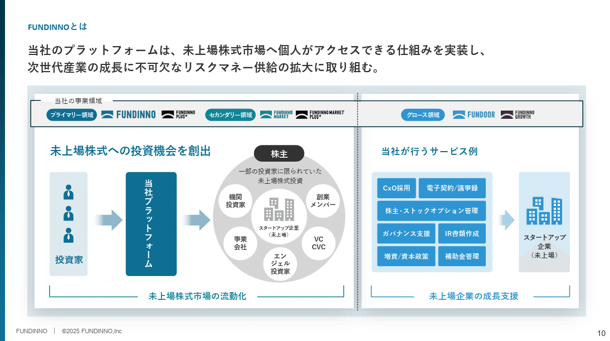

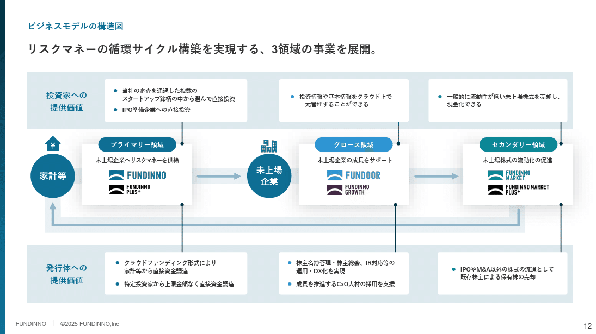

パワーポイント資料の特徴としては、**きれいな構造化がされているスライドが多い点**が挙げられます。日々株式市場と向き合っているだけあって、初心者から上級者まで参考になるIR資料といえますね。

## 株式会社ミラティブ

2025年12月18日に東証グロースに上場した株式会社ミラティブの事業計画及び成長可能性に関する事項」の資料です。ミラティブ社はゲーム実況配信アプリを提供しています。

> 引用元：[> 事業計画及び成長可能性に関する事項](https://contents.xj-storage.jp/xcontents/AS09198/d7fbc4c6/a4eb/4742/94af/08d94563e6be/140120251217521406.pdf)

*https://www.mirrativ.co.jp/ir/*

パワーポイント資料の特徴としては、ゲーム配信アプリになじみの無い人にも理解しやすいように、**積み上げ型のストーリーで事業の紹介をしている点**が挙げられます。

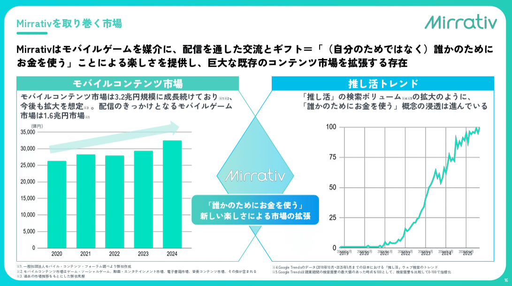

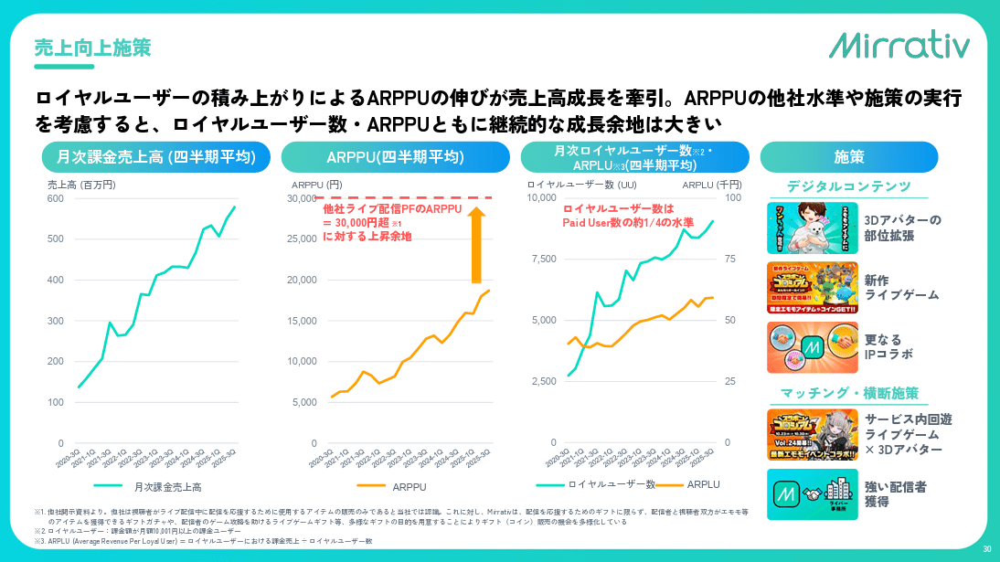

## 2025年に新規上場の「事業計画及び成長可能性に関する事項」資料１５選のまとめ

2025年に新規上場した企業の「事業計画及び成長可能性に関する事項」のパワーポイント資料を15社分紹介しました。
見ていただいた通り、業種も規模も会社のステージも様々な企業のパワポを紹介しましたので、様々なシチュエーションでなんらか役に立つNoteとなっているのではないかなと思います。
より上場が近い方や資金調達が必要な方向けには、「資金調達ピッチ」に特化したNoteもありますので、是非参考にしてみてくださいね。

## パワポ研オリジナルテンプレート

パワポ研では**「ビジネスシーンで使える」パワーポイントテンプレート**を公開しております。デザインを整えるのみならず、**ロジックやストーリーを整理する**のにも役立つパッケージになっておりますので、関心のある方は下記ページも併せてご覧ください！

上記の記事のように、noteでは**フォローしているだけでビジネスにおける「資料作成のコツ」と「デザインのセンス」が身に付くアカウント**を目指して情報配信を行っています。
今後もコンスタントに記事を配信していく予定なので、関心のある方は是非アカウントのフォローをお願いします！

**> Template販売　**[> https://powerpointjp.stores.jp/](https://powerpointjp.stores.jp/%EF%BF%BCnote)
**> note　**[> パワポ研の資料作成術](https://note.com/powerpoint_jp/m/mc291407396da)
**> X（旧Twitter)　**[> https://twitter.com/powerpoint_jp](https://twitter.com/powerpoint_jp)

## レックスアドバイザーズからのお知らせ

パワポ研は株式会社レックスアドバイザーズが運営しています。
レックスアドバイザーズは**経営企画職や経営管理職に特化した転職エージェント**です。
上場企業や上場準備企業を中心に、**経営企画、IR、経理財務、法務、内部監査等の職種の求人**をご紹介しているほか、**CFOなどのコンフィデンシャル求人**もご紹介可能です。
またコンサルティングファームや監査法人、会計事務所の求人も豊富にあるため、プロフェッショナルファームを目指す方のご支援も得意です。
求人紹介やキャリア相談を希望の方は、[**無料転職サポート**](https://www.career-adv.jp/job_search/entryform_exp/)よりサービス利用登録をしてみてください。

*レックスアドバイザーズのサービスサイトはこちら*

**> 求人をご希望の方　**[> 無料転職サポート](https://www.career-adv.jp/job_search/entryform_exp/)**
> 採用支援をご希望の方　**[> 採用サポート](https://www.career-adv.jp/request3/)
**> その他　**[> お問い合わせフォーム](https://www.rex-adv.co.jp/contact)
**> 書籍　**[> 注目企業の実例から学ぶパワポ作成術](https://www.amazon.co.jp/dp/4046060476)

