# 【徹底解説】背景の色や画像がおしゃれなパワポのスライド５選

[note原文](https://note.com/powerpoint_jp/n/n7bace1935705)

みなさんこんにちは。
資料デザインのリサーチや分析に取り組むパワーポイントのスペシャリスト、パワポ研です。

今回は【徹底解説】シリーズの新作です。**パワポの背景色に焦点を当て、上場企業のIR資料から、参考になりそうなパワーポイント資料を抜粋して紹介**していきます。

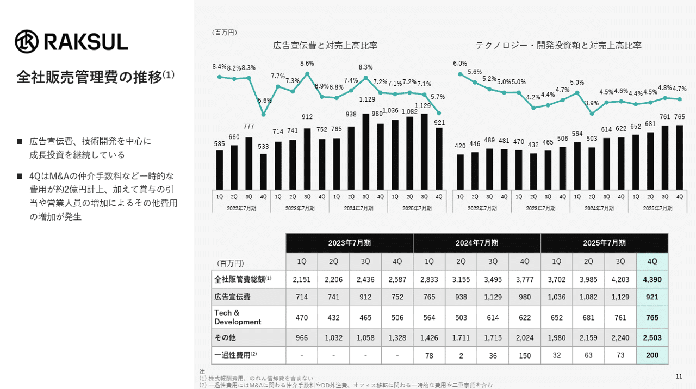
*背景が白色とグレーのスライド例：ラクスル株式会社のパワポ*

> 引用元：[> 2025年7月期決算説明会資料](https://ssl4.eir-parts.net/doc/4384/ir_material_for_fiscal_ym/187138/00.pdf)

*https://corp.raksul.com/ir/library/presentation/*

IR資料などのパワーポイントにおいては、**背景色は白色あるいは薄いグレーが一般的**ですが、背景色が青色や緑色のパワポも少ないながら存在します。
背景色が白色やグレーでないパワポは、資料としての独自性が高くなる一方で、**見やすい資料にするための工夫**が必要です。

なので今回は、白色やグレー以外の背景色を使いながら、おしゃれで見やすい資料に仕上げているIR資料を例に、デザインのポイントを解説します。
なお表紙やディバイダーだけ独自の背景色にする、といったパワーポイント資料もあるので、気になる方は下記のNoteを見てみてくださいね。

では早速行きましょう！

## ベージュ色の背景がおしゃれなパワポ例

まずは株式会社Schooのパワポスライドを見ていきましょう。2025年9月期 決算説明資料のパワーポイント資料にあるスライドを見ていきます。

> 引用元：[> 2025年9月期通期 決算説明資料 -事業計画及び成長可能性に関する事項のアップデート-](https://ssl4.eir-parts.net/doc/264A/tdnet/2719649/00.pdf)

*https://corp.schoo.jp/ir/library/presentation/*

パワポのスライドのデザインとしては、**ベージュ色の背景に青緑色を合わせる配色**で、タイトルとメッセージが濃いベージュ色、ボディが薄いベージュとなっています。背景色がベージュ色のパワポは多くないですが、青緑色に限らず**色なじみがよいのでおすすめ**です。

### ベージュ色の背景の目次スライド

まずはパワーポイントの目次のスライドから見ていきましょう。
**スライドの背景は濃いベージュ色一色、チャプター番号は青緑色、チャプタータイトルは黒色、チャプター名の英語表記は白色**というデザインになっています。
ベージュ色と青緑色のパワポは珍しいですが、おしゃれなデザインですね。

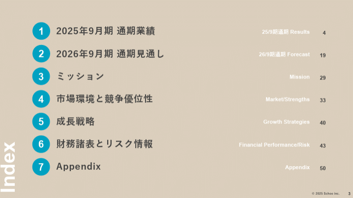

### ベージュ色の背景のサマリースライド

続いてパワーポイントのサマリーのスライドを見ていきましょう。
スライドの背景は濃いベージュ色と薄いベージュ色で、グラフタイトルの文字色もベージュ色、グラフのメッセージもベージュ色の背景の円となっており、**スライド全体にベージュ色をベースとした統一感**があります。
パワポのグラフの見せたい部分だけに、差し色として青緑色を使っている点や、グラフ右上のチャプタータイトルを白文字にしている点もおしゃれなのでおすすめですね。

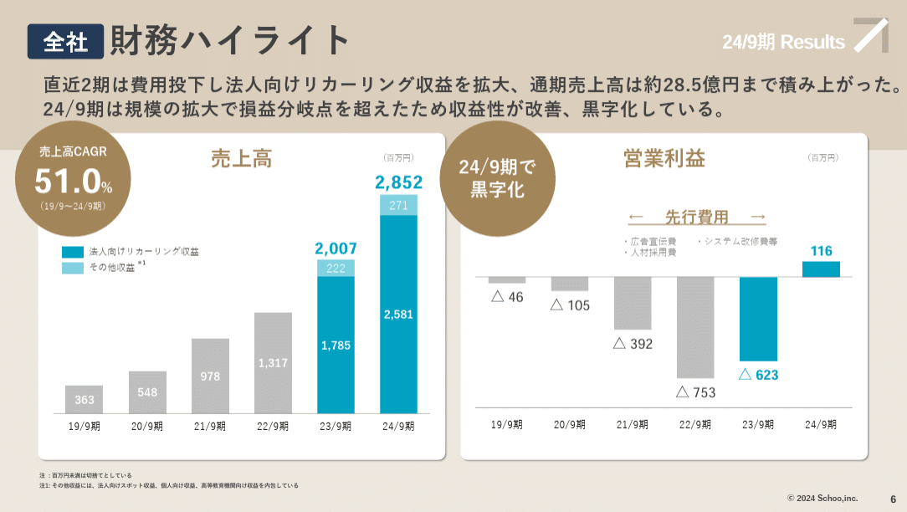

### ベージュ色の背景の表スライド

続いてパワーポイントの表スライドです。
先ほどのグラフもそうですが、**表やグラフの背景色がベージュ色だとさすがにパワポとしては見づらい**ので、表やグラフ部分の背景色は白色になっています。
表やグラフの背景については、**白色にした上で濃いベージュと薄いベージュの境目を少し超えるデザイン**になっており、おしゃれですね。白色の背景の角を丸くしている点も、パワポが柔らかい印象になるのでおススメです。

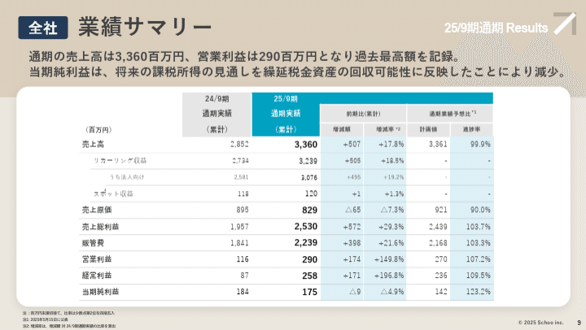

### ベージュ色の背景の図スライド

続いてパワーポイントの図スライドです。
見せたい部分はサマリーや表と同様に白色の背景としつつ、左側のカテゴリタイトルである「Category」「Customer」「Product/Business」「Key figure」については、ベージュの背景にそのまま黒文字で記載されています。
濃いベージュ色が増えていくと見づらくなってしまうことから、**ベージュ色の塗りつぶし、枠線のみベージュ色、青緑色の塗りつぶしなどを使い分け**て見やすいパワポに仕上げています。

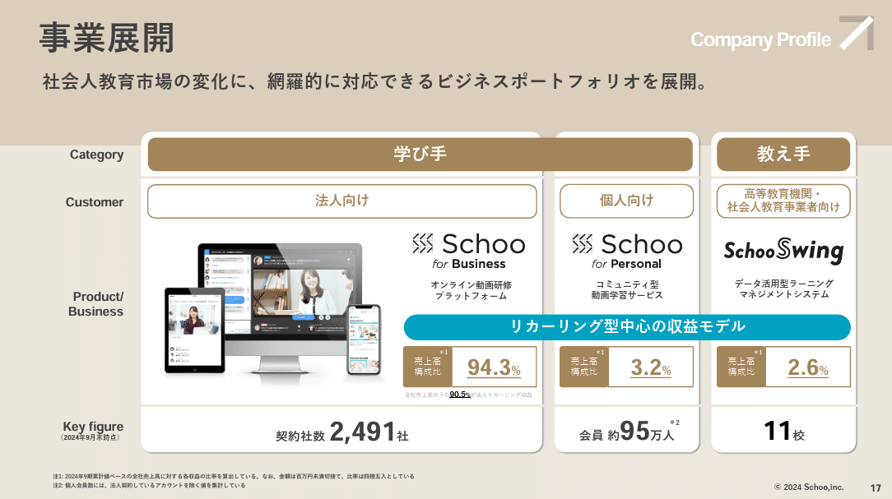

### ベージュ色の背景が文字スライド

最後にテキスト中心のパワポスライドです。
文字が多いことから、ボディ部分の背景は白色にし、カテゴリーはベージュ色に白文字、テキストは黒文字、結論のテキストは青緑色に白文字となっています。
**色の使い分けによって構造化をしてるとおしゃれなスライドになるのでおすすめ**です。

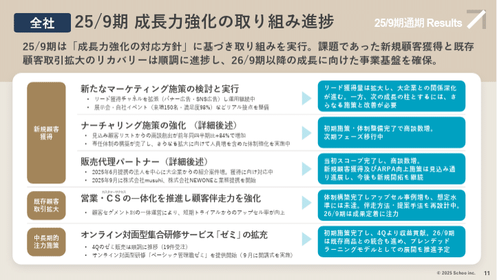

## 青色の背景がおしゃれなパワポ例

次は株式会社ジーニーのパワポスライドを見ていきましょう。2025年3⽉期 通期決算説明資料のパワーポイント資料にあるスライドを見ていきます。

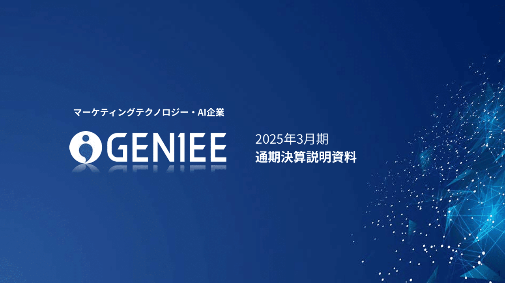
> 引用元：[> 2025年3⽉期 通期決算説明資料](https://geniee.co.jp/wp/wp-content/uploads/datas/library_briefing/pdf/020250514234259_68p0.pdf)

*https://geniee.co.jp/ir/library/briefing/*

パワポのスライドのデザインとしては、**背景がデジタル空間をイメージさせる濃い青色の画像、テキストが白文字と黄色文字**となっています。タイトルとメッセージは白色で、強調したい部分には黄色文字が使われています。青色の背景のパワポに白色や黄色は相性がいいのでおすすめです。

### 青色の背景の目次スライド

まずはパワーポイントの目次のスライドから見ていきましょう。
**スライドの背景は濃い青色、チャプター番号とテキストは白色**というデザインで、当該チャプター以外のタイトルは青色で目立たなくなっています。
パワポの背景右下のドットがつながる画像が、デジタル空間をイメージさせる、おしゃれなデザインとなっています。

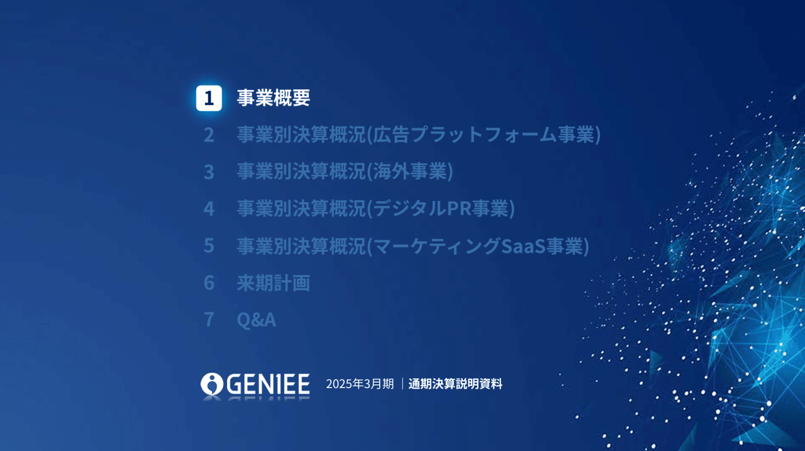

### 青色の背景のサマリースライド

続いてパワーポイントのサマリーのスライドを見ていきましょう。
**スライドの背景は濃い青色の画像ですが、グラフタイトルの背景色はさらに濃い青色でレイヤー分け**がされています。文字は白ベースですが、太字や黄色文字を使い分けることで見やすく仕上がっています。
パワポの背景左下にはうっすらとジーニーの企業ロゴが入っているほか、箇条書きのトップにも企業ロゴが入っている、おしゃれなデザインですね。

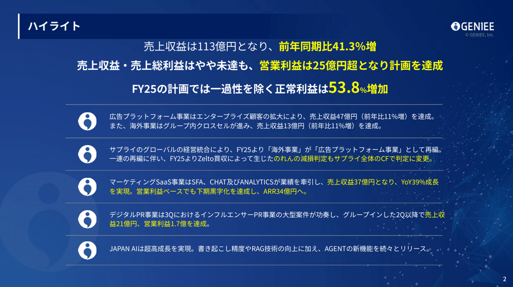

### 青色の背景の表スライド

続いてパワーポイントの表スライドです。
パワポの背景の画像や色は変わらず、白文字の表が入っています。**表はできる限り罫線を減らたうえで数字を右寄せ**しており、基本を押さえたおしゃれなでデザインとなっています。

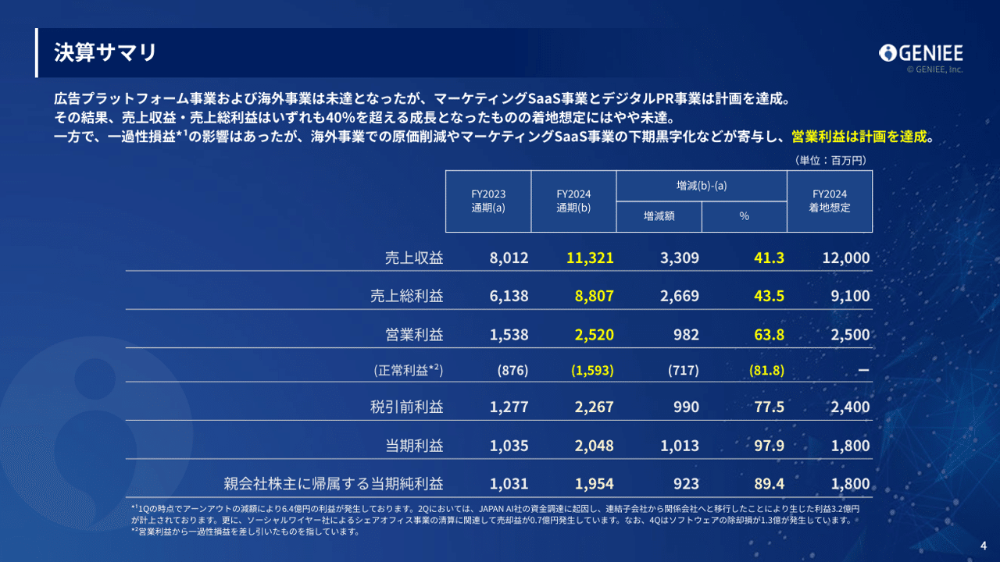

### 青色の背景の図スライド

続いてパワーポイントの図スライドです。
真ん中にマーケティングのプロセスとジーニーの事業の関係を青色のグラデーションで見せていますが、珍しく赤色が出てきます。これはパワーポイントの流れの中で、突然ピンポイントで赤色のスライドを差し込むことで飽きさせないための工夫と思われます。**背景色が青色のパワポはおしゃれですが、見慣れない分、読み手が疲れやすい**ので、こうした工夫はおススメです。
ボディの背景にも青色の影が使われていますが、煙のようなデザインで社名とリンクしており、おしゃれなスライドとなっています。

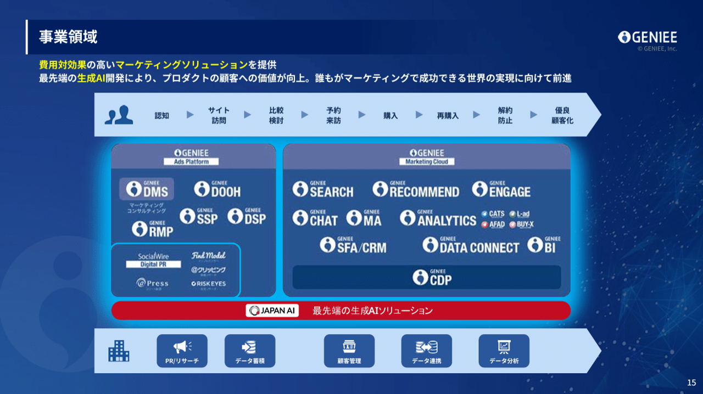

### 青色の背景の文字スライド

最後にテキスト中心のパワポスライドです。
スライドの文字が多いことから、明るめの水色を使ったり、黄色の図形を使ったりするデザインで、おしゃれに仕上げています。ここでも青色の背景で読み手が疲れないよう、白色のアイコンを多めに使うなどの工夫も見られます。

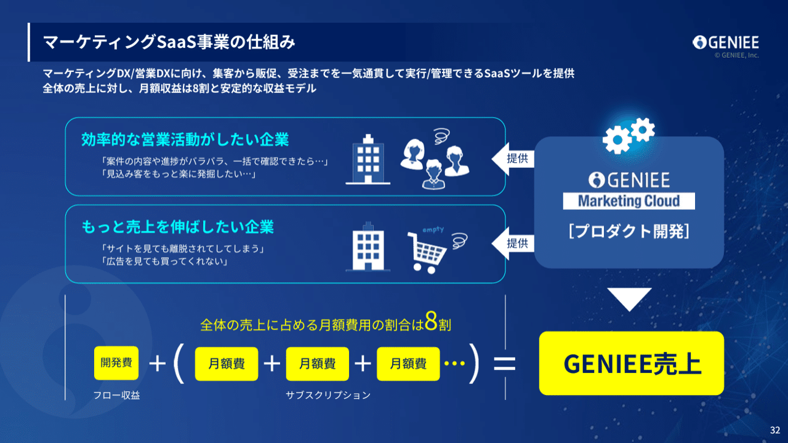

## 緑色の背景のシンプルなパワポ例

次は株式会社IDOMのパワポスライドを見ていきましょう。2025年2月期 決算説明会資料のパワーポイント資料にあるスライドを見ていきます。

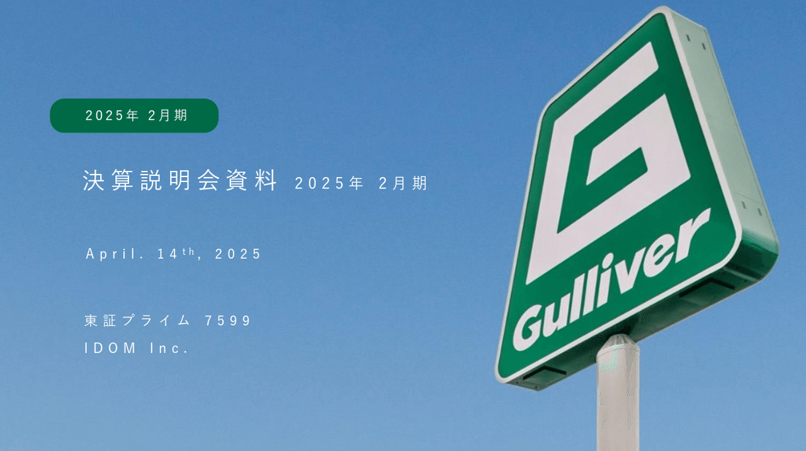
> 引用元：[> 2025年2月期 決算説明会資料](https://idom-inc.com/wp-content/uploads/2025/04/setumei_20250414_1.pdf)

*https://idom-inc.com/ir/library/account_statement/*

パワポのスライドのデザインとしては、背景にコーポレートカラーと同じ緑色を使いつつも、大半の部分は白色の背景となっており、緑色はほぼ縁取りのような感じになっています。**パワポの背景色を設定しながら白色メインにするデザインは比較的簡単な割におしゃれ**なので、おすすめのデザインとなります。

### 緑色の背景のシンプルな目次スライド

まずはパワーポイントの目次のスライドから見ていきましょう。
**スライドの背景は濃い緑色一色、その上に白色の背景があり、文字色は黒というシンプル**なデザインになっています。パワポの右上のロゴと同じ緑色をパワポの背景の色と揃えることで統一感が出ていますが、おススメのテクニックです。

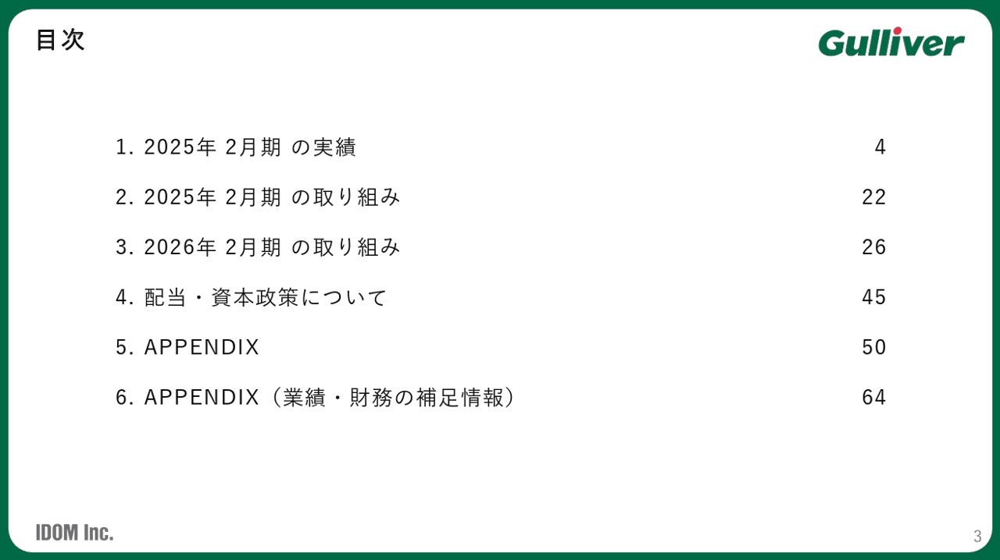

### 緑色の背景のシンプルなサマリースライド

続いてパワーポイントのサマリーのスライドを見ていきましょう。
スライドの背景は目次と同じ濃い緑色と白色の組み合わせで、スライドタイトルが左上に黒いタグ、その下はグレーのグラデーションにコーポレートカラーの赤と緑のタグというデザインになっています。
こちらも**グレーをベースにコーポレートカラーで仕上げるというシンプルなデザインのスライド**ですが、初心者でも作りやすいのでおすすめです。

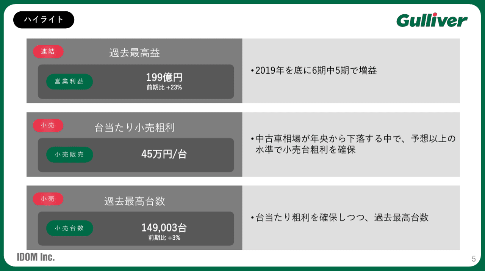

### 緑色の背景のシンプルな表スライド

続いてパワーポイントの表スライドです。
パワポの背景の画像や色はそのままに、おそらくパワーポイントの基本機能にあるテーブルで作られたであろう表があります。基本機能で作りつつ、**表の背景色を緑色にすることでシンプルながらきれいなデザイン**となっています。

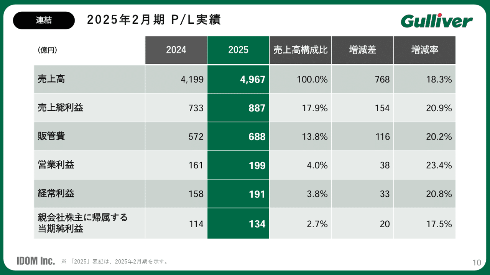

### 緑色の背景のシンプルな図スライド

続いてパワーポイントの図スライドです。５つの主力付帯商品の付帯率を見せているスライドですね。
こちらも複雑ではなくアイコンと数字のシンプルなスライドですが、**アイコンの色をパワポの背景色の同じ緑色にすることで、スライドにまとまりが出ておしゃれに見える**ので、こちらもおススメのテクニックです。

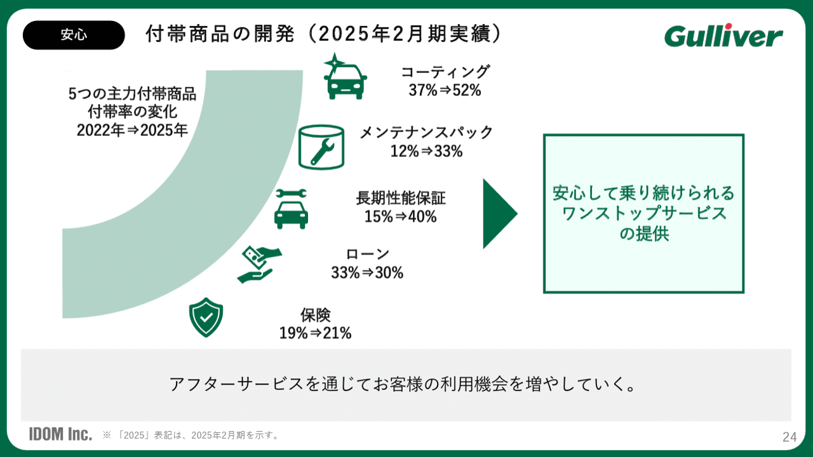

### 緑色の背景のシンプルな文字スライド

最後にテキスト中心のパワポスライドです。
情報量が比較的少ないシンプルなスライドで、うまく構成しないと内容が薄い印象を与えかねませんが、緑色が比較的強めの色であることから、背景色、塗りつぶし、アイコン、文字色などの組み合わせで、パワポとしてうまく成立させています。

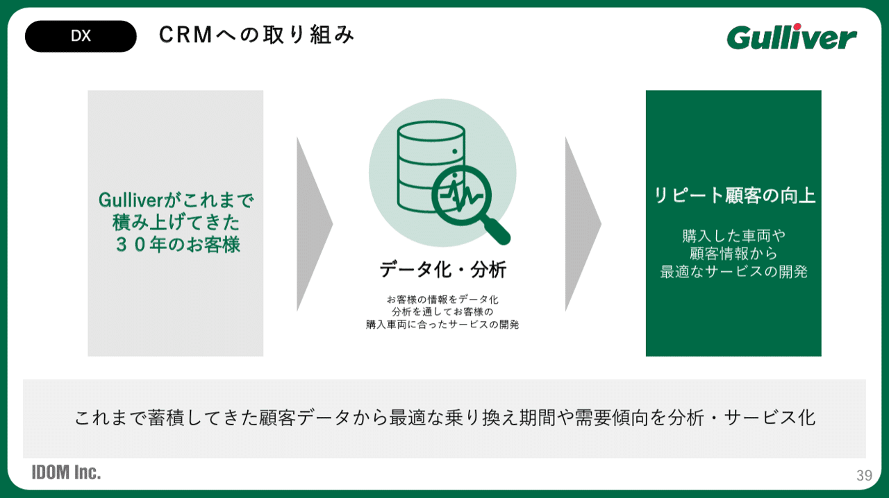

## 水色の空の背景がおしゃれなパワポ例

続いてデジタルグリッド株式会社のパワポスライドを見ていきましょう。2025年7月期 通期 決算説明資料（事業計画及び成長可能性に関する事項）のパワーポイント資料にあるスライドを見ていきます。

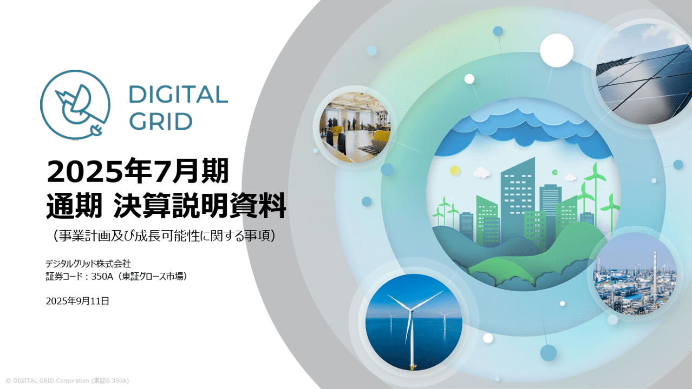
> 引用元：[> 2025年7月期 通期 決算説明資料（事業計画及び成長可能性に関する事項）](https://ssl4.eir-parts.net/doc/350A/tdnet/2686579/00.pdf)

*https://www.digitalgrid.com/ir/library/presentation/*

パワポのスライドのデザインとしては、**背景に水色ベースの再エネ発電所の画像**を入れたうえで、青系の色や緑色系の色と合わせています。決して見やすいパワポではありませんが、かなりおしゃれで独創的なパワポに仕上がるため、コンセプト重視でパワポを作る際には、画像の活用がおすすめです。

### 水色グラデーションの背景の目次スライド

まずはパワーポイントの目次のスライドから見ていきましょう。
目次については**パワポの背景に画像は使っておらず、水色のグラデーションで同心円が広がっていくデザイン**です。文字色は黒というシンプルなデザインになっています。

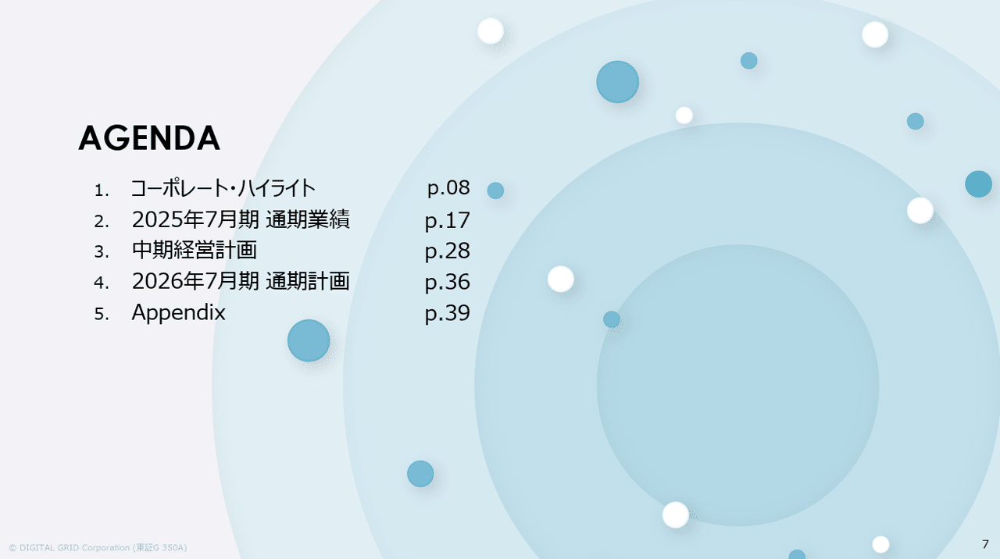

### 水色の画像が背景のサマリースライド

続いてパワーポイントのサマリーのスライドを見ていきましょう。
スライドの背景は、風力発電や太陽光発電の画像を使った、空をイメージさせる画像となっています。**当社の再エネを中心とする電力プラットフォーム事業とリンクする画像を背景に使って**おり、非常におしゃれなパワポです。
パワポの背景に画像を使うとどうしても見づらくはなるため、棒グラフを白色に、KPIも白色の背景に透過を入れるデザインで、文字が読みやすいように工夫しています。パワポの背景に画像を使う場合、白色の透過のテキストボックスを組み合わせるのがおすすめですね。

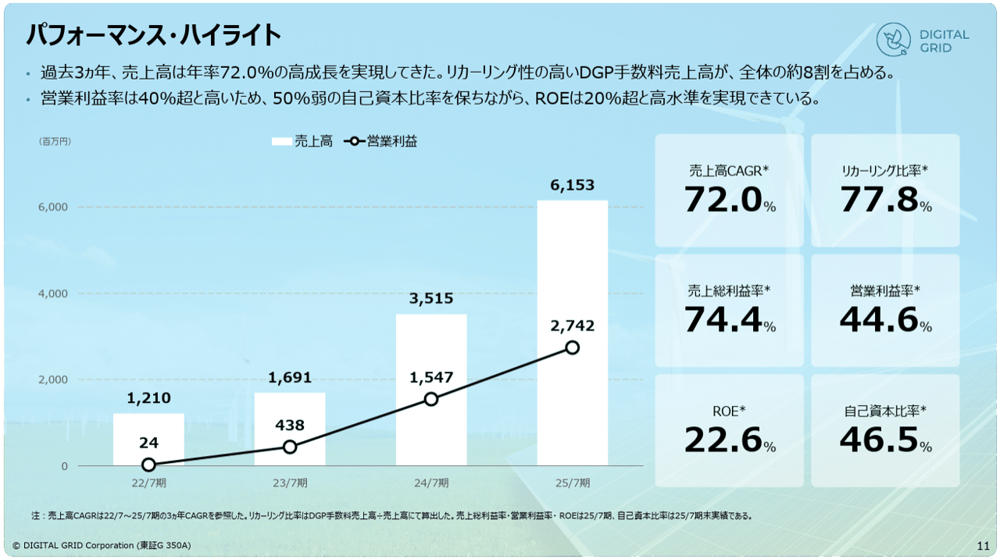

### 水色の画像が背景の表スライド

続いてパワーポイントの表スライドです。
表が必要なスライドとなると、さすがに見やすさが重要なので、**白色の背景も透過ではないものが使われて**います。逆に透過無しの白色背景のボックスを使うことで、ボックス内には様々な表現が可能になることから、少し濃い緑色の強調なども行っています。

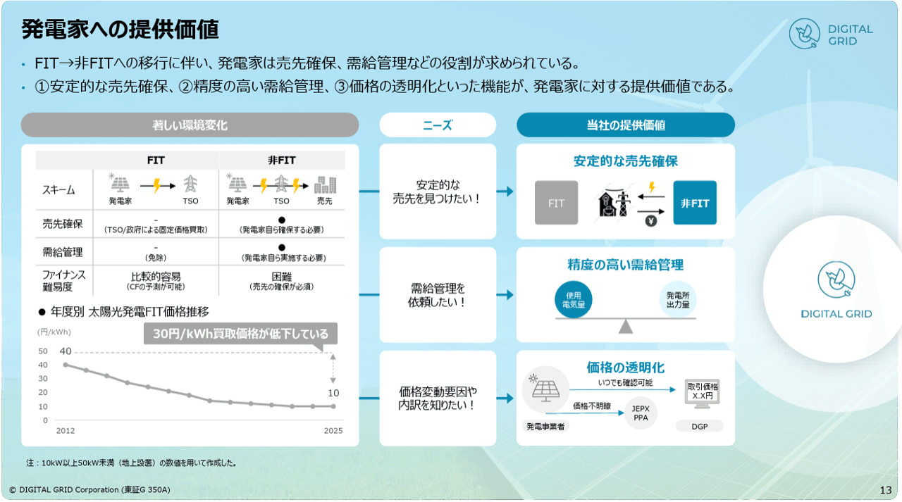

### 水色の画像が背景の図スライド

続いてパワーポイントの図スライドです。
再エネイメージの背景画像に、目次スライドで使われていた同心円を組み合わせる、おしゃれなデザインです。デジタルグリッドが発電家と需要家をつなぐプラットフォームであることをビジュアルで伝えていますね。
電力需給PFというとかなり専門的なので、**細かいことはおいておき、パワポのビジュアルで伝える**のも一つのおすすめ方法です。需要の大きさやニーズの大きさを、おしゃれな背景デザインでわかりやすく伝えています。

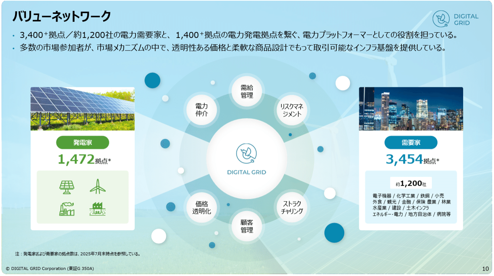

### 水色の画像が背景の文字スライド

最後にテキスト中心のパワポスライドです。
表スライド同様に、文字が見やすい必要があるため、透過無しの白色背景のボックスを使ってテキストを見やすくしています。コーポレートロゴをはじめ、アイコンが多めのおしゃれなデザインのパワポです。

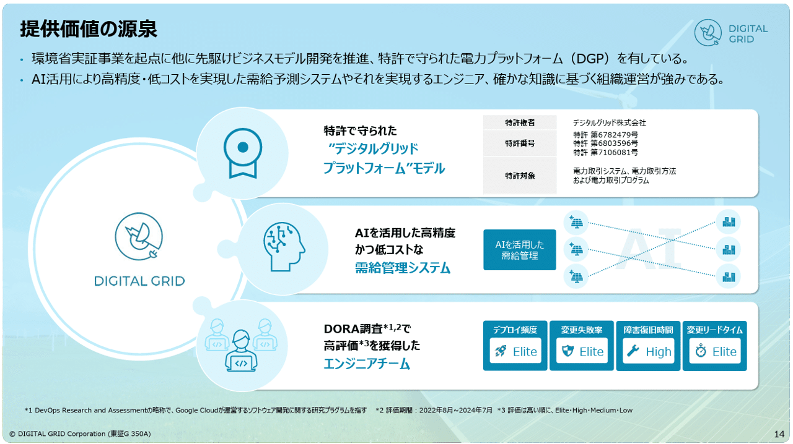

## 黒色の空間の背景がおしゃれなパワポ例

最後は株式会社Ture Dataのパワポスライドを見ていきましょう。2025年3月期決算説明資料（事業計画及び成長可能性に関する事項）のパワーポイント資料にあるスライドを見ていきます。

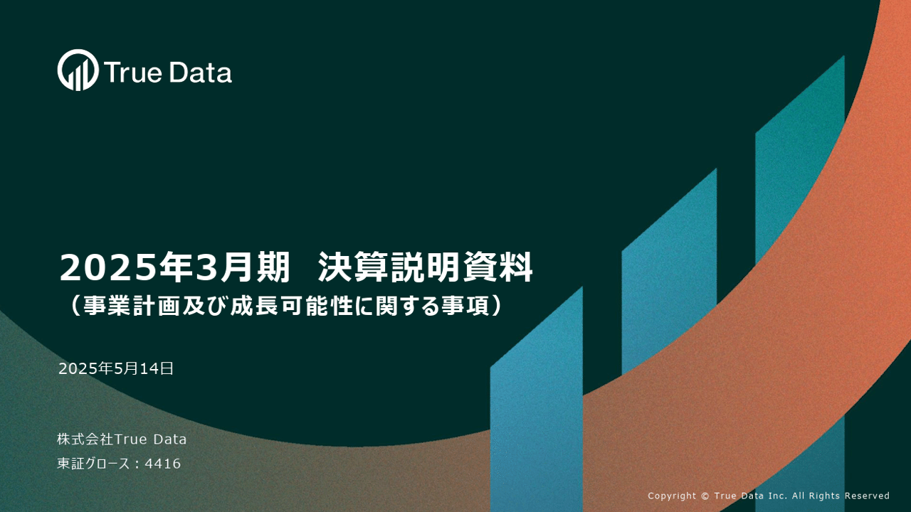
> 引用元：[> 決算説明資料（事業計画及び成長可能性に関する事項）](https://contents.xj-storage.jp/xcontents/AS02849/1fd20b36/5516/454f/aa1d/02d004cb5114/140120250513545549.pdf)

*https://www.truedata.co.jp/ir/presentations/*

### 黒色の背景の目次スライド

まずはパワーポイントの目次のスライドから見ていきましょう。
目次については少し変わった構造になっており、表紙と２枚でワンセットになっています。**パワポの背景は画像ではないものの黒色のデザインとなっており、テキストは白色文字**です。２枚セットのため上部が表紙とつながっており、目次が下半分に集中しています。

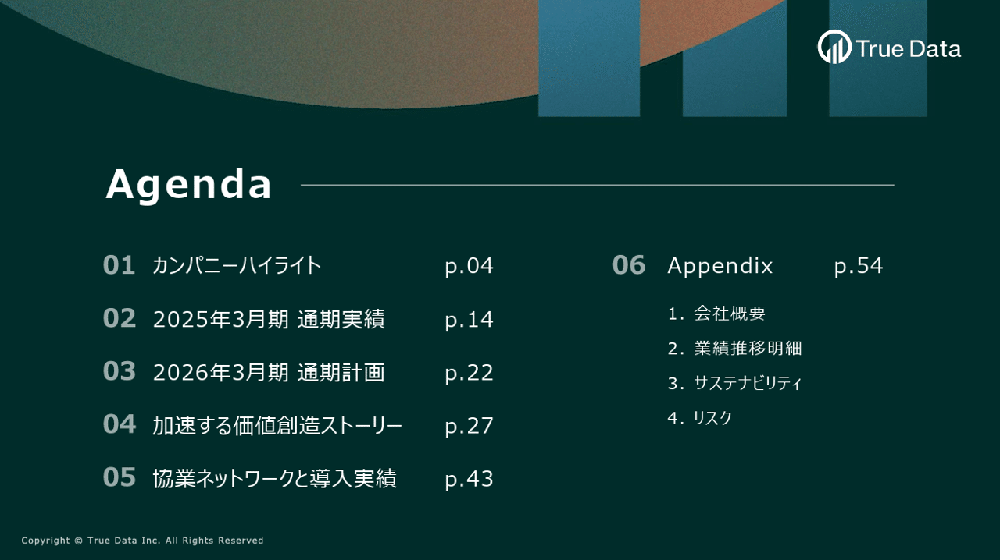

### 黒色の空間の背景のサマリースライド

続いてパワーポイントのサマリーのスライドを見ていきましょう。
スライドの背景は、データ空間をイメージさせる黒色の空間の画像に、少しだけ透過のある白色の背景の組み合わせになっています。**ベーシックな白色のスライド風にしつつ、若干だけ背景の色が透過しているデザイン**で、おしゃれなパワポスライドといえますね。

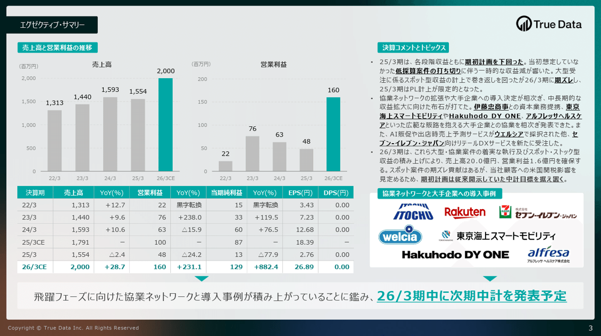

### 黒色の空間の背景の表スライド

続いてパワーポイントの表スライドです。
パワポの背景については、同じように黒色の画像に透過の白色の背景を合わせており、表は明るい緑色や濃い緑色の枠を使ってハイライトしています。

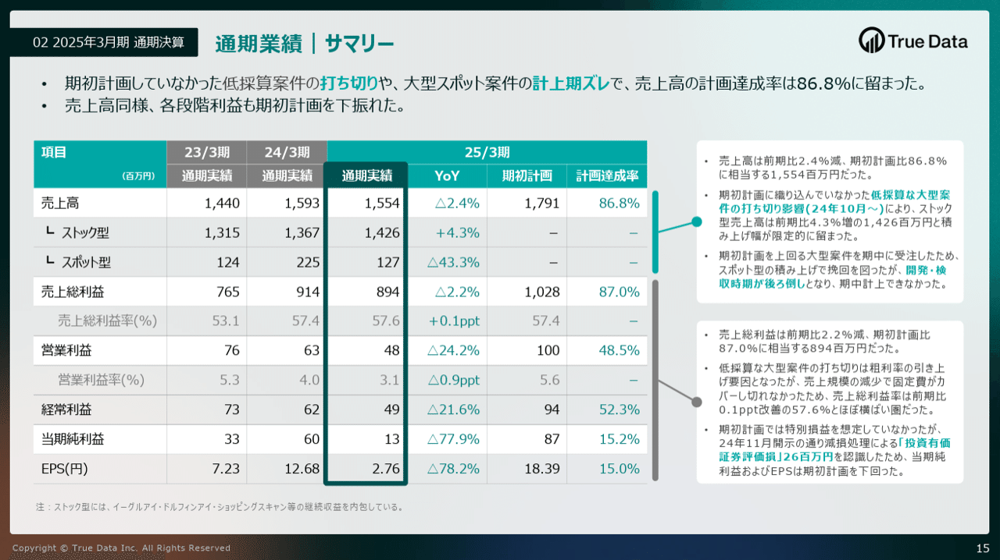

### 黒色の空間の背景の図スライド

続いてパワーポイントの図スライドです。
データ空間をイメージさせる黒色の背景画像に、ファネルやプラットフォームの図を合わせたスライドになっています。**ビジュアルで見せるタイプのビジネスモデルのパワポなので、背景は黒色の画像のみ**になっています。
未来感のあるビジュアルがおしゃれなパワポですね。

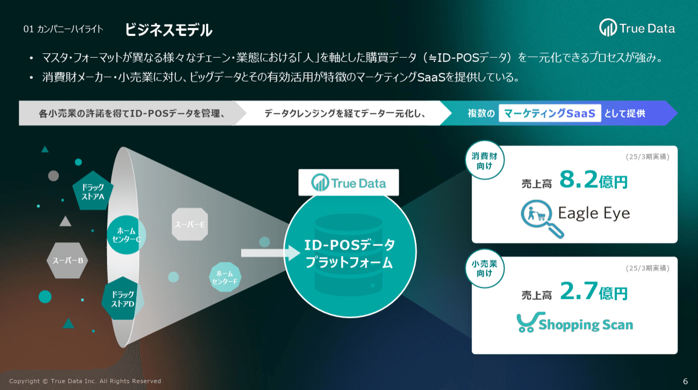

### 黒色の空間の背景の文字スライド

最後にテキスト中心のパワポスライドです。
サマリースライド同様に、黒色の画像を背景に、白色の透過の背景を重ねたデザインです。そのままでも読みやすいですが、より読みやすくするために、さらに白色や緑色の背景のボックスを重ねています。

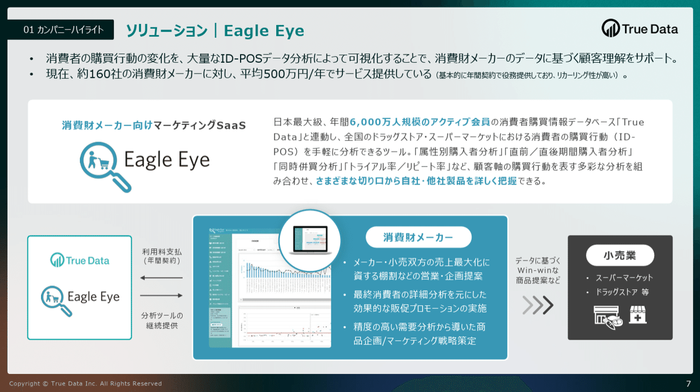

## パワポの背景を変更する方法

ここまで様々なパワポの背景の事例を見てきましたが、最後に簡単にパワポの背景を変更する方法を説明します。

パワポの背景を変更したい場合は、パワーポイントの基本機能にある「デザイン」のユーザー設定にある「背景の書式設定」を使います。

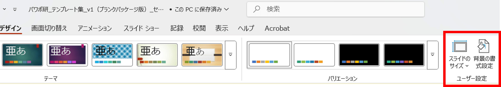
*パワーポイントの背景の書式設定の機能*

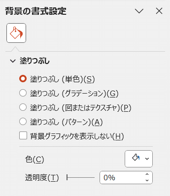
*パワーポイントの背景の書式設定の機能詳細*

画像を入れたい場合は、塗りつぶし（図またはテクスチャ）を選んで、画像ソースの挿入するを選びます。そうすることで、背景に画像を入れて背景を変更することができます。これを**スライドのマスタースライド機能で行えば背景を変更**できますし、その上に白のボックスを入れればIDOM社のように、白の透過のボックスを入れればTRUE DATA社のようになります。

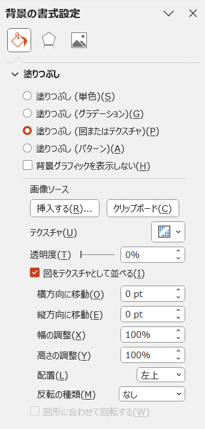

## 【徹底解説】背景の色使いがおしゃれなパワポのスライド５選まとめ

これまで５つの異なる背景デザインのパワポスライドを紹介してきましたが、自社で使ってみたいデザインはありましたでしょうか。
一番シンプルなものであればIDOM社のようにスライドの外枠の色だけを変えるのも手ですし、一番難易度の高いものであれば、デジタルグリッドのように背景に画像を入れるデザインもあります。
この辺りはおしゃれさと見やすさのバランスをどうとるかや、パワポのスキルによってもおススメが変わってくるので、是非参考にしてみてくださいね。

## パワポ研オリジナルテンプレート

パワポ研では、「ビジネスシーンで使える」パワーポイントテンプレートを公開しております。デザインを整えるのみならず、**ロジックやストーリーを整理するのにも役立つパッケージ**になっておりますので、関心のある方は下記ページも併せてご覧ください！

上記の記事のように、noteでは**フォローしているだけでビジネスにおける「資料作成のコツ」と「デザインのセンス」が身に付くアカウント**を目指して情報配信を行っています。
今後もコンスタントに記事を配信していく予定なので、関心のある方は是非アカウントのフォローをお願いします！

**> Template販売　**[> https://powerpointjp.stores.jp/](https://powerpointjp.stores.jp/%EF%BF%BCnote)
**> note　**[> パワポ研の資料作成術](https://note.com/powerpoint_jp/m/mc291407396da)
**> X（旧Twitter)　**[> https://twitter.com/powerpoint_jp](https://twitter.com/powerpoint_jp)

## レックスアドバイザーズからのお知らせ

パワポ研は株式会社レックスアドバイザーズが運営しています。
レックスアドバイザーズは**経営企画職や経営管理職に特化した転職エージェント**です。
上場企業や上場準備企業を中心に、**経営企画、IR、経理財務、法務、内部監査等の職種の求人**をご紹介しているほか、**CFOなどのコンフィデンシャル求人**もご紹介可能です。
またコンサルティングファームや監査法人、会計事務所の求人も豊富にあるため、プロフェッショナルファームを目指す方のご支援も得意です。
求人紹介やキャリア相談を希望の方は、[**無料転職サポート**](https://www.career-adv.jp/job_search/entryform_exp/)よりサービス利用登録をしてみてください。

*レックスアドバイザーズのサービスサイトはこちら*

**> 求人をご希望の方　**[> 無料転職サポート](https://www.career-adv.jp/job_search/entryform_exp/)**
> 採用支援をご希望の方　**[> 採用サポート](https://www.career-adv.jp/request3/)
**> その他　**[> お問い合わせフォーム](https://www.rex-adv.co.jp/contact)
**> 書籍　**[> 注目企業の実例から学ぶパワポ作成術](https://www.amazon.co.jp/dp/4046060476)

