# 【マネしたい】カッコいいパワポの「オレンジ色系」プレゼン３選（2025年更新）

[note原文](https://note.com/powerpoint_jp/n/n7d202c005a6a)

みなさんこんにちは。
資料デザインのリサーチや分析に取り組むパワーポイントのスペシャリスト、パワポ研です。

今回は、**オレンジ色系のパワポに焦点を当て、上場企業のIR資料から参考になりそうな抜粋して紹介**していきます。カラーコードについても記載していきますので、見栄えの良い「色」について、パワポ作成の参考になれば幸いです。

【マネしたい】シリーズのまとめ記事はこちら。

またオレンジ色のPwCグループのスライドまとめはこちら。

では早速行きましょう！

## オレンジと白の配色が美しいスライド見本

まずは株式会社LIFULLの事業戦略説明会のパワーポイントを見ていきましょう。白色の背景にオレンジのみの配色の資料になっています。**白色の背景とのバランスが抜群に良く**、白色がオレンジによく合うことがわかります。

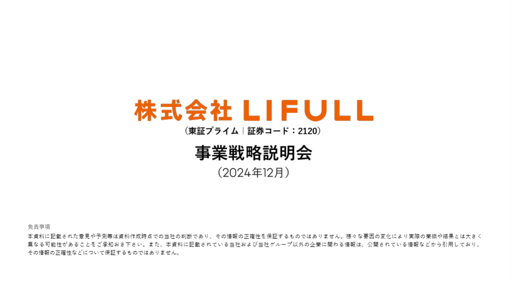
*株式会社LIFULLのプレゼンテーション資料*

> 引用元：[> 事業戦略説明会資料（2024年12月16日開催）PDF](https://lifull.com/doc/2024/12/20241216presentation.pdf)

*https://lifull.com/doc/2024/12/20241216presentation.pdf*

- 濃いオレンジ色：カラーコード#eb5300、rgb（245,178,134）

- オレンジ色：カラーコード#fdbe92、rgb（253,190,146）

- 薄いオレンジ色：カラーコード#ffdfc9、rgb（255,223,201）

### 会社概要はオレンジ単色でデザイン

事業内容については、複数事業がある場合は複数の色を使ってかき分けることが多いです。逆にLIFULLのように**単一事業の場合、１色ですっきりと見せる方が見やすくなります**。LIFULLはオレンジを白色の背景や黒文字とうまく組み合わせることで、見やすい配色となっています。

サービスサイトはもちろんオレンジですし、**写真も夕焼けのオレンジが入っている**ので、情報を足していっても単色で見やすいスライドになっているわけですね。夕焼けのオレンジと、建物をハイライトする濃いオレンジのグラデーションがお見事です。

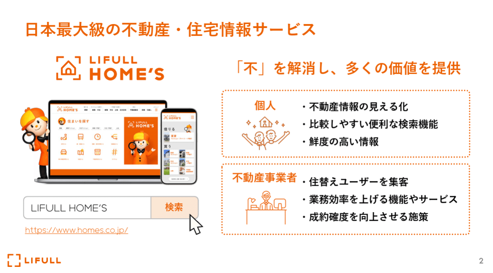

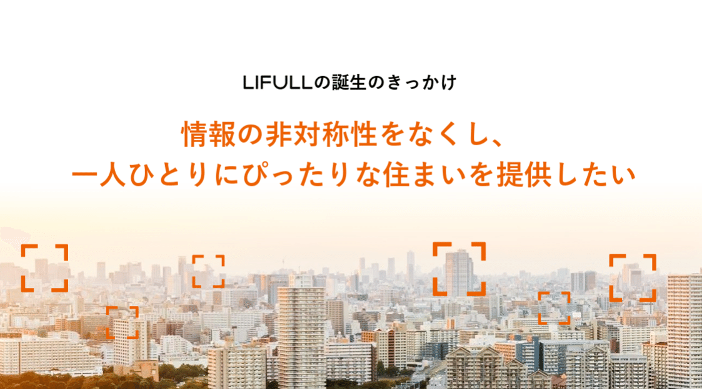

### 背景のアクセントにオレンジを配色

タイムラインやグラフなど、会社の成長を見せたいスライドでは、成長している感を感じられるデザインにすることが大切です。

LIFULLではそうしたポイントで、**背景に右肩上がりのオレンジのシェードを使い**、成長している会社であることが伝わるようなデザインにしています。売上収益もオレンジの太字で示すことで、シェードがより強調されるようになっています。

またサービスの進化や売上収益の増加についてもオレンジのグラデーションを使って、会社が成長していることを示しています。白とオレンジの配色が見やすいと既に説明しましたが、**2枚目の棒グラフのようなグレーとオレンジの配色も効果的で見やすく**、グレーもオレンジと合う色であることがわかります。

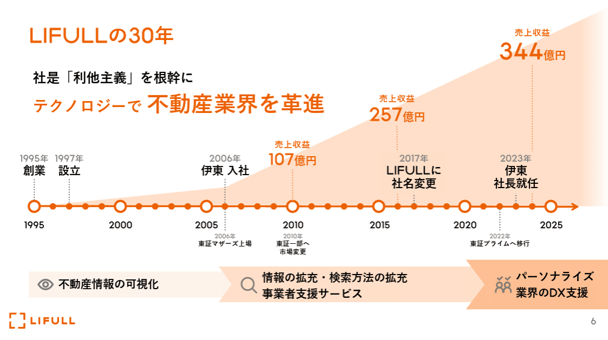

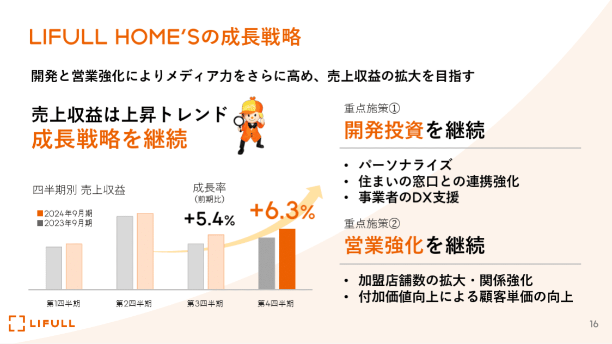

### 円とグラデーションを合わせたデザイン

LIFULLのスライドの特徴として、**円とオレンジのグラデーションの組み合わせが非常に上手**という点が挙げられます。
同心円でグラデーションを使うことはよくありますが、真ん中にコアとなる部分をおい、周辺に行くほどに色を薄くするという使い方が多いです。

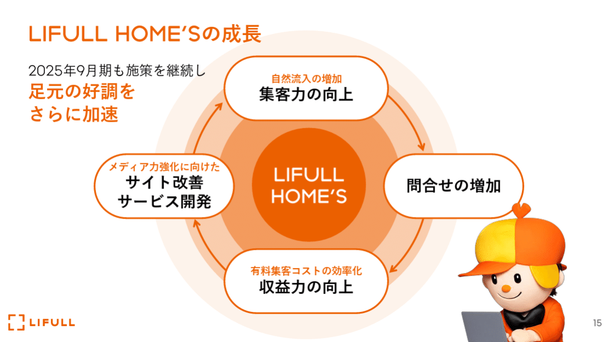
一枚目のスライドは、サイト改善やサービス開発を起点に好循環が回っているということを見せています。好循環のサイクルと別に、**同心円をオレンジのグラデーションで見せる**ことで、サービスが広がっていることを示しています。

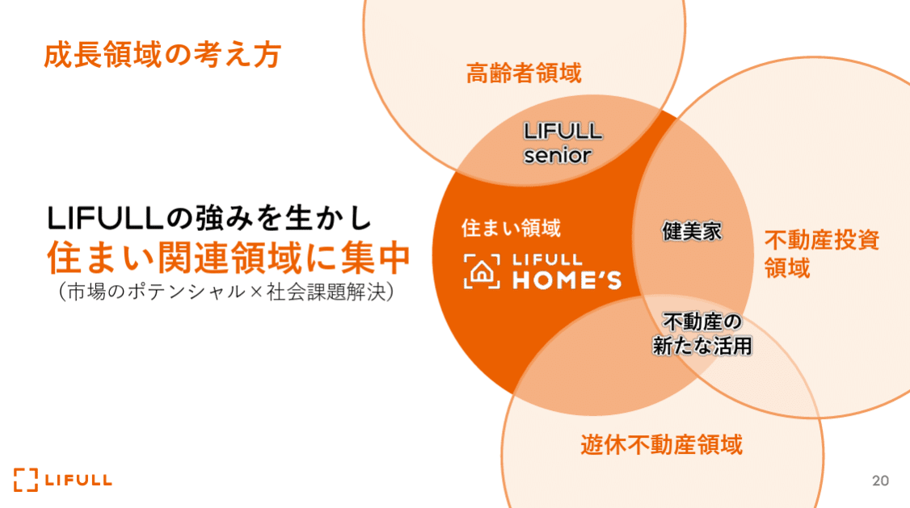
２枚目のスライドは、中心となる住まい領域を濃いオレンジにする一方、周辺の高齢者領域や不動産投資領域、遊休不動産領域を薄いオレンジにしています。これを重ねることで、**住まい領域と重なっている部分はオレンジ色が濃くなり、ターゲットであるということが視覚的にわかる**ようになっています。

## 薄いオレンジで親しみやすいスライド見本

続いては株式会社ボードルアの決算補足説明資料のパワーポイントを見ていきましょう。灰色の背景にオレンジの配色が見やすいことに加えて、イラストを多用しているのが特徴です。イラストとオレンジ色の相性がなかなか良いのも見どころです。

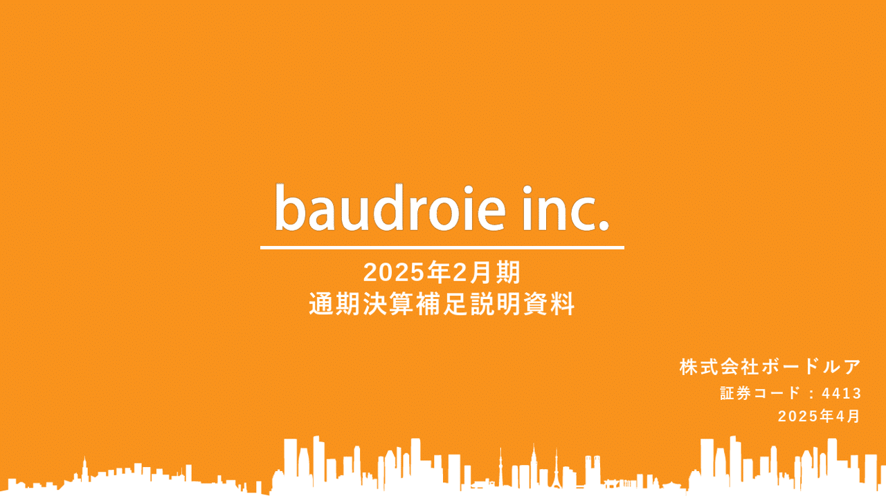
*株式会社ボードルアのプレゼンテーション資料*

> 引用元：[> 2025年２月期　決算補足説明資料](https://contents.xj-storage.jp/xcontents/AS82646/78393b6f/504c/4fce/b111/4d1ca83dcaa8/140120250415516268.pdf)

*https://www.baudroie.jp/ir/presentations/*

- オレンジ色：カラーコード#f8921d、rgb（248,146,29）

- 黄色：カラーコード#ffc908、rgb（255,201,8）

- 赤色：カラーコード#e3370f、rgb（227,55,15）

### 表はオレンジを目立たせるデザイン

表を使ったスライドにおいては、**グレーの背景とオレンジ色のタイトル、白ベースの表とオレンジ色のハイライトというように、オレンジ色が目立つように**しています。これまで見てきたように、白やグレーはオレンジに合う色なので、良い配色といえますね。

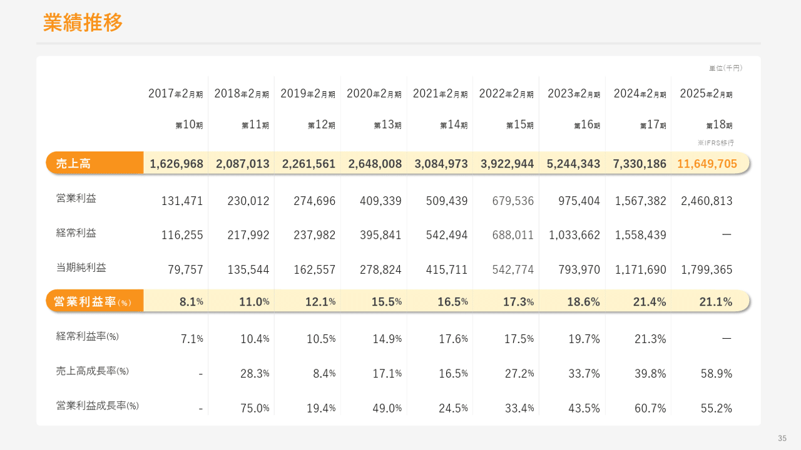

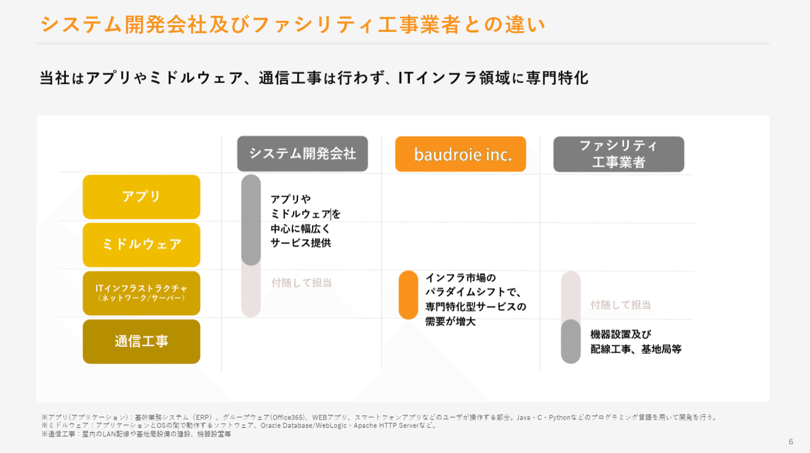

### オレンジと黄色のグラフデザイン

グラフにおいては、実績や最新年をオレンジに、**計画値や前年実績を黄色で示すことで、実績が伸びていることを強調**しています。

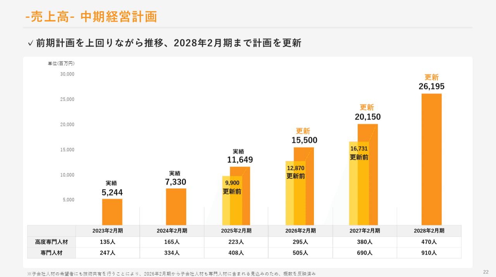
売上高のグラフにおいては、計画値と実績値をあえて重ねることで３色にするという工夫をしています。特に意味が込められているものではないですが、オシャレではありますね。

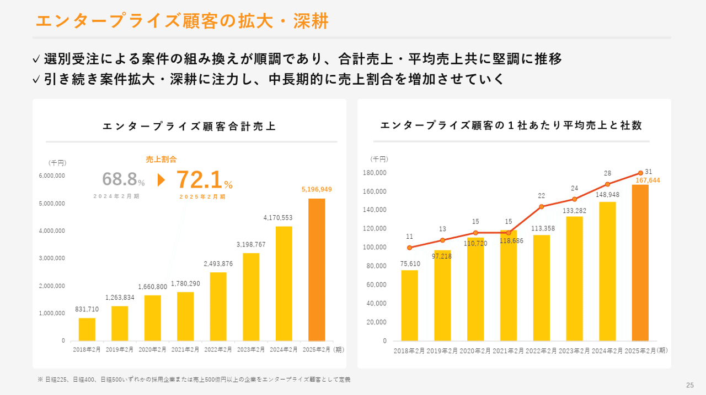
また前年比のグラフでも、直近の実績をオレンジで強調すると同時に、エンタープライズ顧客の社数をオレンジに近い赤色の折れ線グラフで示すことで強調するなど、オレンジ色を効果的に使っています。背景の灰色も含めて、**4色をバランスよく利用できている例**だと思います。

### イラストとオレンジ色のデザイン

もう一つ、株式会社ボードルアから学べる点が、**イラストとオレンジ色の相性がとても良い**ということです。黄色がかったオレンジが温かみのある色なので、親しみやすいイラストテイストのスライドとよく合うわけですね。

競争優位性のスライドは、ややもするととっ散らかりそうなスライドですが、イラストとオレンジ色の組み合わせでしっかりとまとまっています。

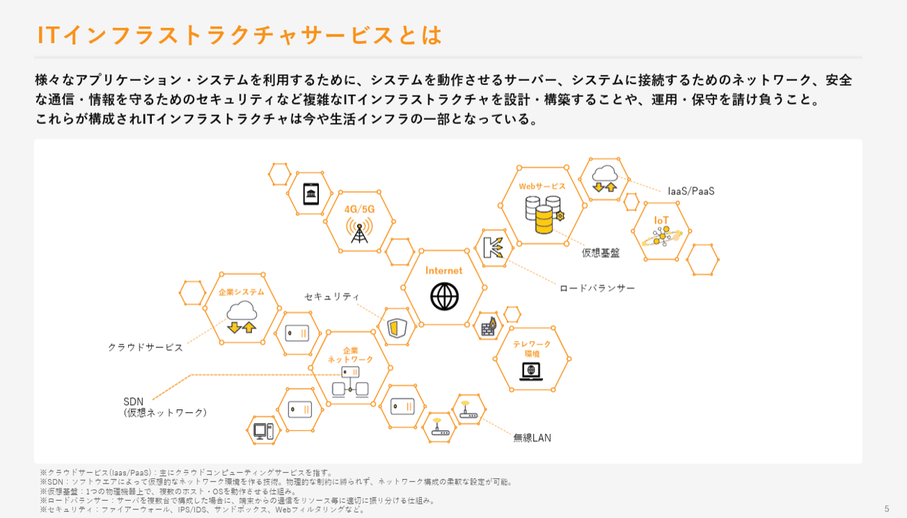

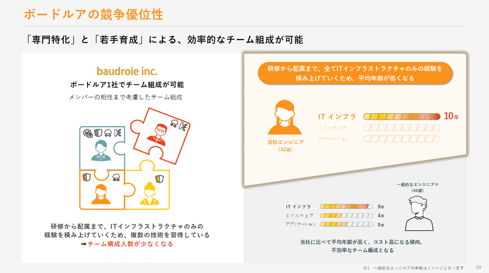

## 濃いオレンジで情熱的に見せるスライド見本

最後に株式会社kubellの通期決算説明資料のパワーポイントを見ていきましょう。オレンジの中でも濃い目のオレンジを使い、**パワフルなスライドに仕上げている**のが特徴です。

*株式会社kubellのプレゼンテーション資料*

> 引用元：[> 2024年12月期 通期決算説明資料](https://contents.xj-storage.jp/xcontents/AS04681/13ad73fa/b7cd/4fcd/a681/a6999481ddb8/20250214193459598s.pdf)

*https://www.kubell.com/ir/library/presentations/*

- 濃いオレンジ色：カラーコード#f04600、rgb（240,70,0）

- やや濃いオレンジ色：カラーコード#ff743c、rgb（255,116,60）

- やや薄いオレンジ色：カラーコード#ffaa89、rgb（255,170,137）

- 薄いオレンジ色：カラーコード#ffe1d6、rgb（255,225,214）

### オレンジの背景で勢いを見せるデザイン

会社概要のページでは、**彩度が高くはっきりした印象の濃いオレンジ色を前面に出すことで、勢いのあるスライドにする**ことに成功しています。
特にミッションのパワポは背景色にオレンジ色を使うと同時に、絵の具のようなデザインにすることで、「働くをもっと楽しく、創造的に」というメッセージにあうスライドになっています。

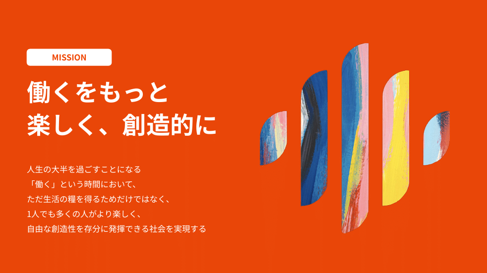

### 企業概要は統一感のあるデザイン

企業概要のスライドにおいては、白の背景にオレンジのグラフタイトルやオレンジの文字という配色で、統一感のあるデザインにしています。
濃い色が多いとどうしてもうるさい印象になりがちですが、**丸めにするといったフォントの工夫や、オレンジベースに白抜き文字といった配色の工夫によって、すっきりと見せる**ことに成功しています。

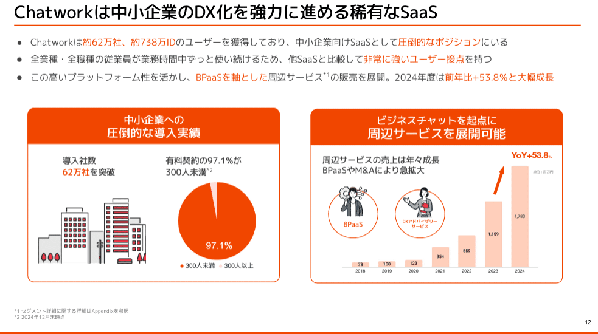

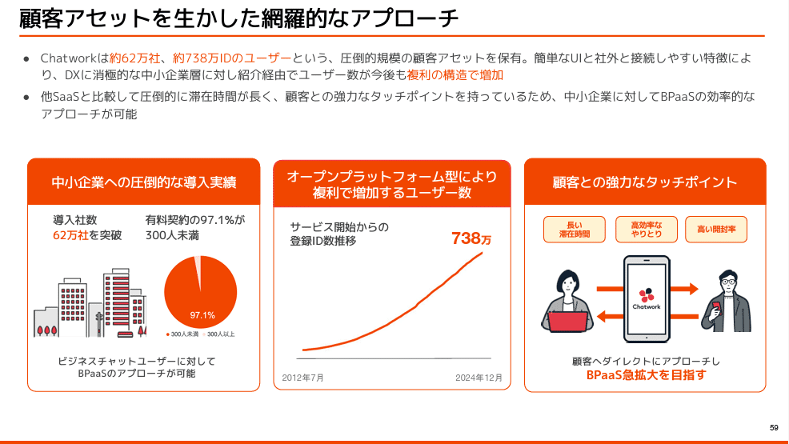

### 表やグラフでは差し色として配色

白抜きなどで工夫をしても、やはり濃いオレンジは目立つは目立つので、**表やグラフなど数字を見せたいスライドについては、濃いオレンジは限定的に**して強調にのみ使っています。
白やグレーがオレンジに合う色であるということを見てきましたが、黒も自然な感じに仕上がってよいですね。

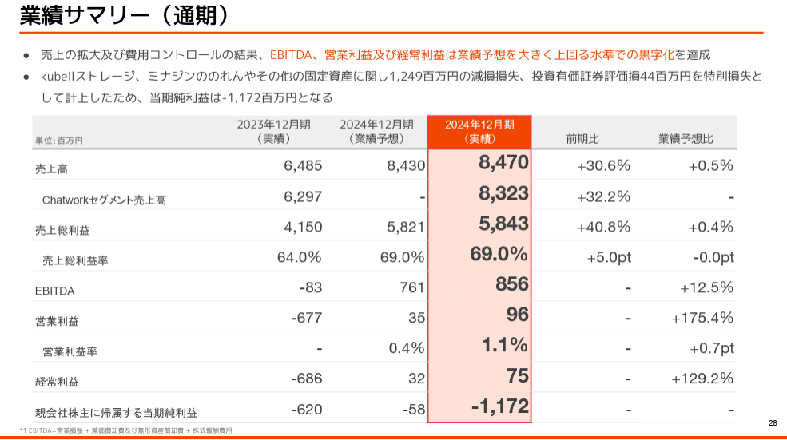

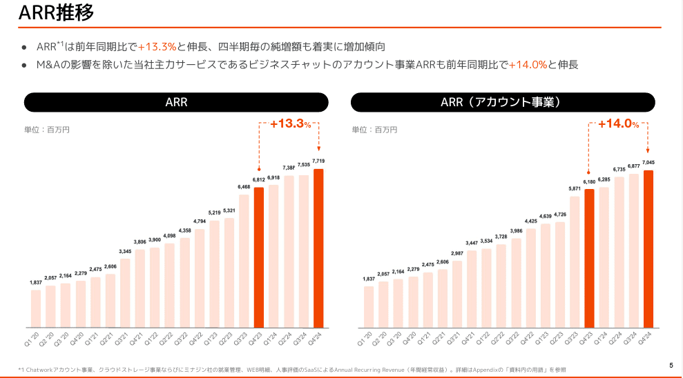

### 市場規模はグラデーションでデザイン

最後に市場規模のスライドです。ここではコアマーケットから周辺のマーケットに向けてオレンジ４色のグラデーションで見せています。また数字については、コアマーケットのみは白色、SOMとSAMとTAMは黒色で示していますが、**白も黒も色なじみがよく、オレンジとよく合う**ことがわかります。

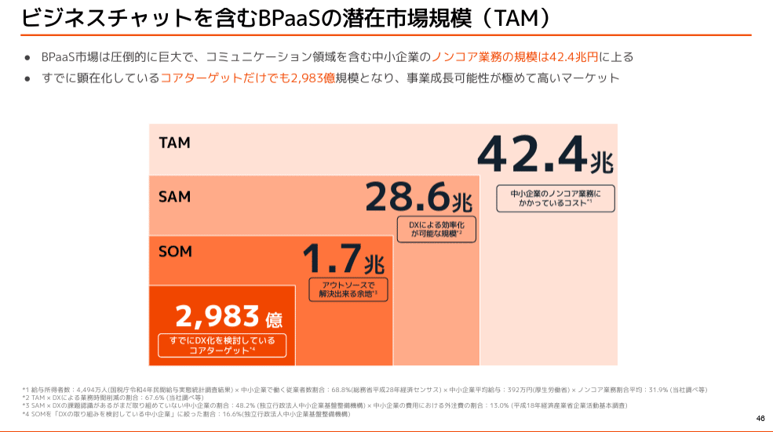

## 【マネしたい】カッコいいパワポの「オレンジ色系」プレゼン３選まとめ

いかがでしたでしょうか。オレンジ色でも様々な色があり、同じように見える青色もカラーコードを見てみると違っていたりと多くの発見があります。オレンジ色は色なじみがよく、白色、グレー色、黒色、いずれとも配色できることがわかりました。また濃淡も活用しやすく、作成者にとって優しい色でもありますね。

## パワポ研オリジナルテンプレート

パワポ研では「ビジネスシーンで使える」パワーポイントテンプレートを公開しております。デザインを整えるのみならず、**ロジックやストーリーを整理するのにも役立つパッケージ**になっておりますので、関心のある方は下記ページも併せてご覧ください！

[
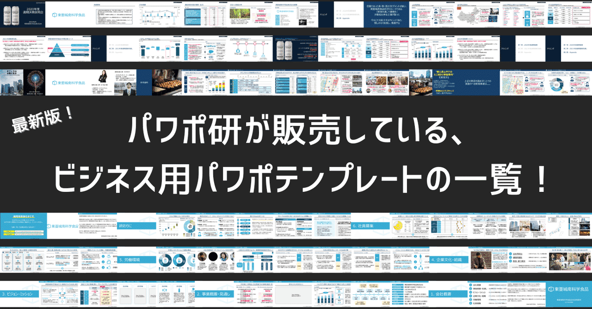
](https://note.com/powerpoint_jp/n/n7300a1293e8e)上記の記事のように、noteでは**フォローしているだけでビジネスにおける「資料作成のコツ」と「デザインのセンス」が身に付くアカウント**を目指して情報配信を行っています。
今後もコンスタントに記事を配信していく予定なので、関心のある方は是非アカウントのフォローをお願いします！

**> Template販売　**[> https://powerpointjp.stores.jp/](https://powerpointjp.stores.jp/%EF%BF%BCnote)
**> note　**[> パワポ研の資料作成術](https://note.com/powerpoint_jp/m/mc291407396da)
**> X（旧Twitter)　**[> https://twitter.com/powerpoint_jp](https://twitter.com/powerpoint_jp)

## レックスアドバイザーズからのお知らせ

パワポ研は株式会社レックスアドバイザーズが運営しています。
レックスアドバイザーズは**経営企画職や経営管理職に特化した転職エージェント**です。
上場企業や上場準備企業を中心に、**経営企画、IR、経理財務、法務、内部監査等の職種の求人**をご紹介しているほか、**CFOなどのコンフィデンシャル求人**もご紹介可能です。
またコンサルティングファームや監査法人、会計事務所の求人も豊富にあるため、プロフェッショナルファームを目指す方のご支援も得意です。
求人紹介やキャリア相談を希望の方は、[**無料転職サポート**](https://www.career-adv.jp/job_search/entryform_exp/)よりサービス利用登録をしてみてください。

**> 求人をご希望の方　**[> 無料転職サポート](https://www.career-adv.jp/job_search/entryform_exp/)**
> 採用支援をご希望の方　**[> 採用サポート](https://www.career-adv.jp/request3/)
**> その他　**[> お問い合わせフォーム](https://www.rex-adv.co.jp/contact)
**> 書籍　**[> 注目企業の実例から学ぶパワポ作成術](https://www.amazon.co.jp/dp/4046060476)

