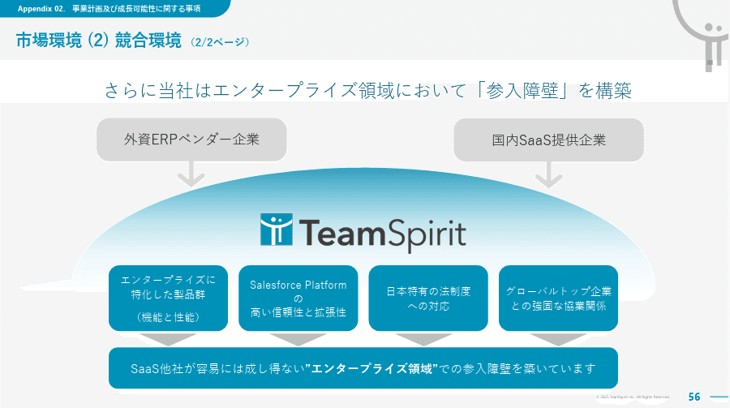
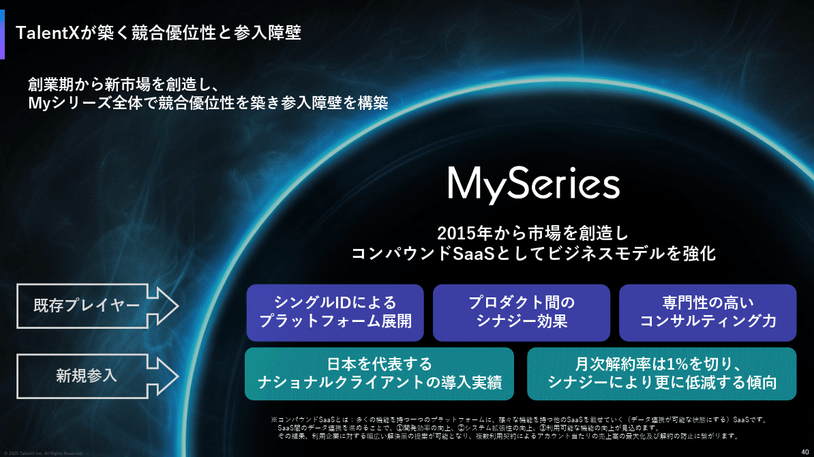
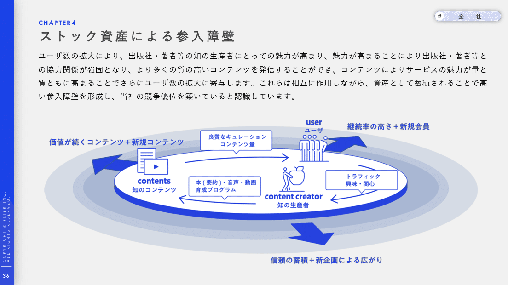
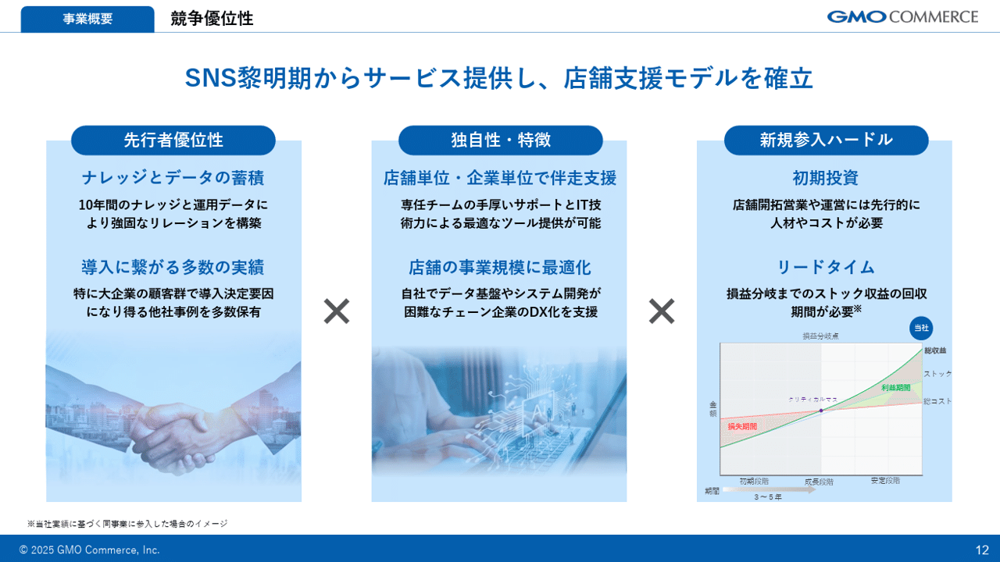
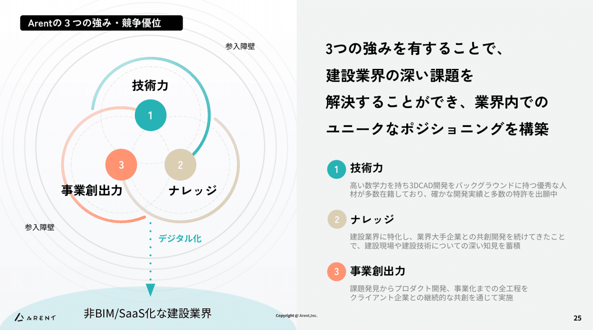
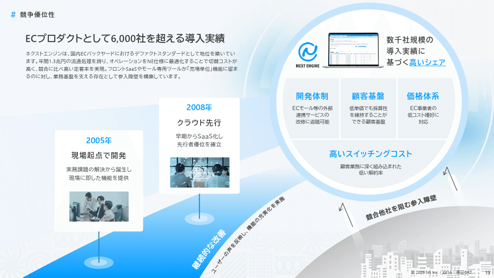
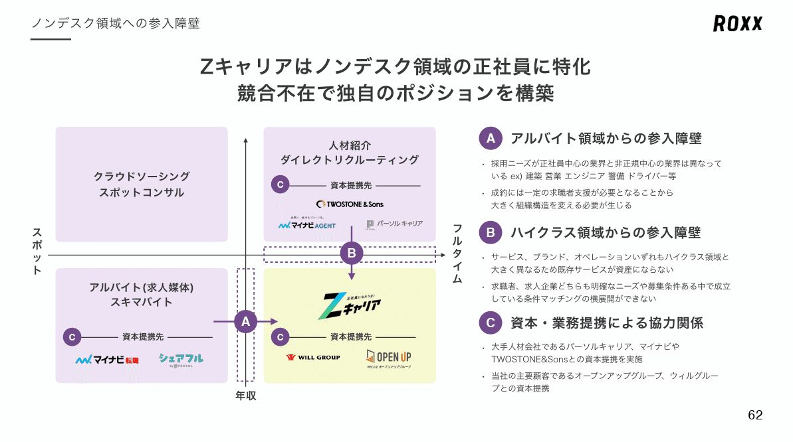
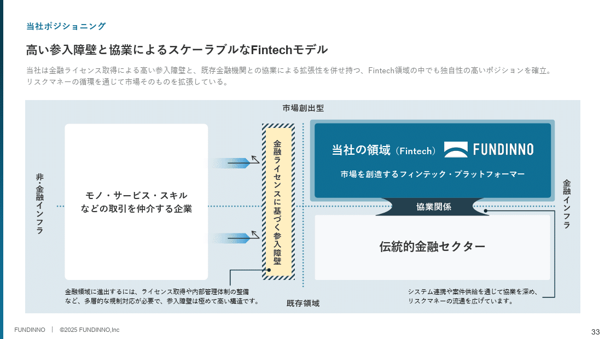
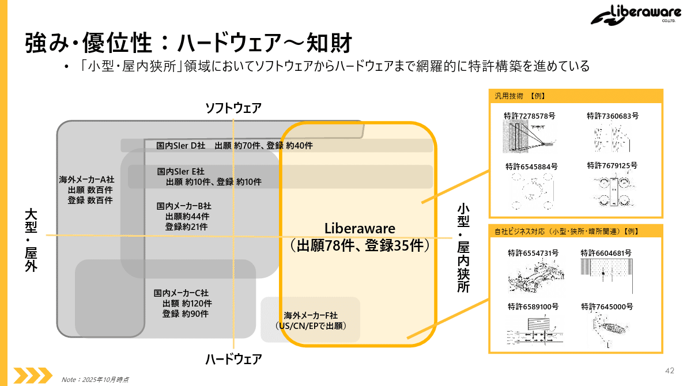

# 【マネしたい】パワポの「参入障壁」「競争優位性」スライド事例９選

[note原文](https://note.com/powerpoint_jp/n/n7df40ea8bbf5)

みなさんこんにちは。
資料デザインのリサーチや分析に取り組むパワーポイントのスペシャリスト、パワポ研です。

今回は、**パワポの「参入障壁」「競争優位性」スライドに焦点を当て、上場企業のIR資料から参考事例を紹介**していきます。参入障壁や競争優位性のスライドは事業計画及び成長可能性のプレゼンテーション資料でもよく見かけるスライドですね。

ビジネスシーンにおいてパワーポイントの資料を作る場合、IR資料であれ、新規事業やM&Aの提案資料であれ、ほぼ確実に入ってくるのが、競争優位性のスライドです。なぜなら、**プレゼンテーションを通じて伝えたい「その会社に投資すべき理由」「その事業を行うべき理由」「その企業を買収すべき理由」の根幹をなすのが、競争優位性**だからです。

また競争優位性があるとして、それがどう戦略的に収益につながっているのかの説明もまた重要です。そうした場合にわかりやすいのが**「参入障壁」言い換えると新規参入者が入ってこれないようなエントリーバリアーがある**、という説明です。

今回はそうしたビジネスプレゼンテーションの核となる「参入障壁」「競争優位性」のスライド例を紹介していきます。では早速行きましょう！

## 参入障壁が高い企業のパワポ例３選

まずは参入障壁が高い企業における、参入障壁の説明をしたスライドから見ていきましょう。参入障壁とは、他社の新規参入を防ぐための仕組みです。そのため**参入障壁のスライドでは、「どのような企業の参入を防いでいるのか」「どのような理由で参入障壁が高いのか」の説明が重要**です。
なお参入障壁はさんにゅうしょうへきと読み、英語ではエントリーバリアーと言われるので、パワポにおいては壁やバリアーのイラストが使われることが多いです。

### 参入障壁が高い企業のパワポ例

まずは株式会社チームスピリットのパワポにおける「参入障壁」のスライド例から見ていきましょう。
2025年8月期 通期 決算説明資料及び中期経営計画アップデートと2026年8月期業績予想について（事業計画及び成長可能性に関する事項のアップデート）のパワーポイントにある、市場環境（２）競合環境のスライドです。

*株式会社チームスピリットの参入障壁スライド*

> 引用元：[> 2025年8月期 通期 決算説明資料及び中期経営計画アップデートと2026年8月期業績予想について（事業計画及び成長可能性に関する事項のアップデート）](https://ssl4.eir-parts.net/doc/4397/ir_material_for_fiscal_ym/188438/00.pdf)

*https://corp.teamspirit.com/ir/ir-library/presentation/*

パワポの「参入障壁」の特徴としては**、参入障壁が高い理由をシンプルなテキストで整理している点**が挙げられます。「エンタープライズに特化した製品群」「Salesforce Platformの高い信頼性と拡張性」「日本特有の法制度への対応」「グローバルトップ企業との強固な協業関係」によって、外資ERPベンダー企業や国内SaaS提供企業に対して高い参入障壁を築いているというスライドです。

イラストとしては、バリアーをイメージさせるような曲線を使っています。まさに参入障壁ならぬ英語のエントリーバリアーですね。

### 参入障壁が高いサービスのパワポ例

続いて株式会社TalentXのパワポにおける「参入障壁」のスライド例です。
2025年3月期　通期決算説明資料のパワーポイントにある、TalentXが築く競合優位性と参入障壁のスライドを見てみましょう。

*株式会社TalentXの参入障壁スライド*

> 引用元：[> 2025年3月期　通期決算説明資料](https://ssl4.eir-parts.net/doc/330A/tdnet/2615997/00.pdf)

*https://talentx.co.jp/ir/news*

パワポの「参入障壁」の特徴としては、**参入障壁をプロダクトと顧客基盤に分けて整理している点**が挙げられます。プロダクトの競争優位性である「シングルIDによるプラットフォーム展開」「プロダクト間のシナジー効果」「専門性の高いコンサルティング力」と、顧客基盤の競争優勢性である「日本を代表するナショナルクライアントの導入実績」「月次解約率は1％を切り、シナジーによりさらに提言する傾向」の５つで参入障壁を築いているというスライドです。

イラストとしては、エントリーバリアーのイメージになっていますが、宇宙の様な、炎の様な、独特な障壁のデザインになっています。

### 参入障壁の高い業界のパワポ例

次に株式会社フライヤーのパワポにおける「参入障壁」のスライド例を見てみましょう。
2025年2月期通期 決算説明資料のパワーポイントにある、ストック資産による参入障壁のスライドです。

*株式会社フライヤーの参入障壁スライド*

> 引用元：[> 2025年2月期通期 決算説明資料](https://contents.xj-storage.jp/xcontents/AS09236/24cdcf14/f994/4987/a156/26a1dccbaddc/140120250414515013.pdf)

*https://corp.flierinc.com/ir/library/presen*

パワポの「参入障壁」の特徴としては、**業界の中で好循環が回ることで高い参入障壁が作られることを表現している点**が挙げられます。業界の中で「知の生産者」「知のコンテンツ」「ユーザー」が循環し、加速度的に成長していくことで、より基盤が拡大し、参入障壁が高い業界になることが表現されています。

イラストとしては、循環図をベースに好循環によって基盤が同心円状に広がることを表現しています。これから拡大していく業界で、ネットワーク効果によって新規参入者が参入障壁を築く場合に合うデザインですね。

## 企業の競争優位性を説明するパワポ例３選

続いては参入障壁ではなく、競争優位性や競合優位性の説明をしているパワポを見ていきましょう。競争優位性とは、競合他社や新規参入者に対しての優位性を意味するため、本質的に参入障壁とは近しいです。競争優位性や競合優位性を生み出す要素がすなわち参入障壁を構築する要素ということですね。

### シンプルな競争優位性と戦略のパワポ例

まずはGMOコマース株式会社のパワポにおける「競争優位性」のスライド例を見ていきましょう。
事業計画及び成長可能性に関する事項のパワーポイントにある、競争優位性のスライドです。

*GMOコマース株式会社の競争優位性スライド*

> 引用元：[> 事業計画及び成長可能性に関する事項](https://pdf.irpocket.com/C410A/K2Hn/B572/uhFT.pdf)

*https://ir.gmoc.jp/news/*

パワポの「競争優位性」の特徴としては、**戦略上重要な３つの要素に構造化した上でシンプルにテキストで整理している点**が挙げられます。「先行者優位性」「独自性・特徴」「新規参入ハードル」の３つの要素の中に、「ナレッジとデータの蓄積」と「導入につながる多数の実績」、「店舗単位・企業単位で伴走支援」と「店舗の事業規模に最適化」、「初期投資」と「リードタイム」と、それぞれ２つずつの要素が記載されています。

多くの場合、競争優位性は戦略的に複数の優位性を組み合わせることで構築されます。そのためこのように３つの要素を横並びにしたり、紙面を４分割して４つの要素にまとめたりすることが多いわけですね。

### 美しい競争優位性と戦略のパワポ例

株式会社Arentのパワポにおける「競争優位性」の例です。
2025年6月期 通期決算説明資料のパワーポイントにある、Arentの３つの強み・競争優位のスライドになります

*株式会社Arentの競争優位性のスライド*

> 引用元：[> 2025年6月期 通期決算説明資料](https://ssl4.eir-parts.net/doc/5254/tdnet/2669039/00.pdf)

*https://arent.co.jp/ir/library/presentation/*

パワポの「競争優位性」の特徴として、**紙面を左右に分けた上で、左側では戦略上重要な３つの要素をビジュアルで見せ、右側では競争優位性構築への戦略的な取り組みをテキストで記載しています**。「技術力」「ナレッジ」「事業創出力」の３つの観点で優位性を獲得するために、どのような戦略的取り組みをしているのかを記載しているわけですね。

左においては、３つの要素が融合した結果、参入障壁が広がると同時に、顧客である建設業界へのサービスが可能になることが、ビジュアルでうまく表現されています。構造化のレベルが高く直感的に理解しやすいだけでなく、レイアウトや色使いも非常におしゃれな、ハイレベルなスライドです。

### 競合優位性と時系列のパワポ例

最後はNE株式会社のパワポにおける「競合優位性」のスライド例を見ていきましょう。
事業計画及び成長可能性に関する事項のパワーポイントにある、ECプロダクトとして6,000社を超える導入実績のスライドです。

*NE株式会社の競争優位性のスライド*

> 引用元：[> 事業計画及び成長可能性に関する事項](https://contents.xj-storage.jp/xcontents/AS06428/8429ca6a/1336/4eef/a3d2/4fd7480dd8d5/140120251030583355.pdf)

*https://ne-inc.jp/investor/library/*

パワポの「競合優位性」の特徴として、**競合優位性の構築に至る時系列を合わせて記載している点**が挙げられます。競合優位性は「開発体制」「顧客基盤」「価格体系」「高いスイッチングコスト」の４つの要素から確立されていますが、その背景として、2005年から現場起点の開発をしてきたこと、2008年にクラウドで先行したことなどが記載されています。

ビジュアルとしては、競合優位性が高い位置にあり、下にいる競合他社との間に参入障壁があるというデザインになっています。これは時系列との組み合わせの中で、上に上がっていくデザインの相性が良い事、そうなったときに競合他社が到達できない高みにいるという表現がわかりやすいことなどから、こうしたデザインになったと想定されます。

## マトリックス図の参入障壁のパワポ例３選

最後は少し変わった参入障壁あるいは競争優位性のスライドです。参入障壁や競争優位性はこれまで見てきたように、要素を分解してテキストで見せるパターンが多いのですが、マトリックス図を使うパターンもあります。
参入障壁も競合優位性も、突き詰めれば戦略的にどのようなポジショニングを取るかという話なので、マトリックス図と相性が良いわけですね。

### 象限間に参入障壁があるパワポ例

まずは株式会社ROXXのパワポにおけるマトリックス図の「参入障壁」のスライド例から見ていきましょう。参入障壁が高い業界の例ですね。
2025年９月期通期 決算説明資料についてのパワーポイントにある、ノンデスク領域への参入障壁のスライドです。

*株式会社ROXXの参入障壁スライド*

> 引用元：[> 2025年９月期通期 決算説明資料](https://contents.xj-storage.jp/xcontents/AS04024/9e62dca3/6e71/4e16/9a36/6e6c51c83463/140120251110594542.pdf)

*https://roxx.co.jp/ir/library/presentation/*

パワポの「参入障壁」の特徴として、**自業界の属する象限と隣接する象限の間に参入障壁があることを表現しています**。縦軸に年収、横軸にスポットかフルタイムかの軸を置き、アルバイト領域に対してもハイクラス領域に対しても参入障壁があり、ノンデスクワーカー業界が実は参入障壁が高いことを説明しています。

参入障壁があるということは、逆に言えば自社も他領域に行きづらいことを意味しますが、それを踏まえて隣接する象限には資本提携先を記載し、資本・業務提携先による協力関係があることで、すみ分けをうまく実現していることを見せています。。

### 象限間に参入障壁と協業関係がある例

続いて株式会社Fundinnoのパワポにおける「参入障壁」のマトリックス図のスライド例を見ていきましょう。
事業計画及び成長可能性に関する事項のパワーポイントにある、高い参入障壁と協業によるスケーラブルなFintechモデルのスライドです。

*株式会社Fundinnoの参入障壁スライド*

> 引用元：[> 事業計画及び成長可能性に関する事項](https://ssl4.eir-parts.net/doc/462A/tdnet/2728142/00.pdf)

*https://corp.fundinno.com/ir/news/*

パワポの「参入障壁」の特徴としては、**４象限間に参入障壁があるだけでなく象限間に協業関係もある点**が挙げられます。横軸の金融インフラと非・金融インフラの間はライセンスによる参入障壁がある一方、当社が属する市場創出型の金融インフラと、伝統的金融セクターの既存領域の金融インフラは協業関係にあるということが示されています。

マトリックス図を戦略的に使いやすいのが、独自性の高いポジショニング戦略を取っている企業ですが、今回のように他の象限に対して参入障壁があることも多いので、うまい見せ方といえますね。

### 競争優位をマトリックス図で示すパワポ例

最後は株式会社Liberawareのパワポにおける「競争優位性」のマトリックス図のスライド例を見てみましょう。
2025年7月期 通期決算説明資料のパワーポイントにある、強み・優位性：ハードウェア～知財のスライドです。

*株式会社Liberawareの競合優位性のスライド*

> 引用元：[> 2025年7月期 通期決算説明資料](https://ssl4.eir-parts.net/doc/218A/tdnet/2687217/00.pdf)

*https://liberaware.co.jp/ir/library/presentation/*

パワポの「競争優位性」の特徴としては、**参入障壁そのものである知財のポジショニングから競合優位性を示している点**が挙げられます。ドローン関係の知財に関して、縦軸にハードウェア化ソフトウェアか、横軸に大型・屋外か小型・屋内狭所かを取り、小型・屋内狭所でハードとソフトの両方の特許を保有する唯一の事業者であることを示しています。

## 【マネしたい】パワポの「参入障壁」「競争優位性」スライド事例９選のまとめ

以上、参入障壁や競争優位性あるいは競合優位性にフォーカスしたスライドを紹介してきました。
競争優位性や参入障壁は経営戦略の核であり、ビジネスプレゼンテーションの肝にもなる部分ですので、是非自社のプレゼンを魅力的にすべく、参考にしてみてくださいね。

## パワポ研オリジナルテンプレート

パワポ研では、「ビジネスシーンで使える」パワーポイントテンプレートを公開しております。デザインを整えるのみならず、**ロジックやストーリーを整理するのにも役立つパッケージ**になっておりますので、関心のある方は下記ページも併せてご覧ください！

上記の記事のように、noteでは**フォローしているだけでビジネスにおける「資料作成のコツ」と「デザインのセンス」が身に付くアカウント**を目指して情報配信を行っています。
今後もコンスタントに記事を配信していく予定なので、関心のある方は是非アカウントのフォローをお願いします！

**> Template販売　**[> https://powerpointjp.stores.jp/](https://powerpointjp.stores.jp/%EF%BF%BCnote)
**> note　**[> パワポ研の資料作成術](https://note.com/powerpoint_jp/m/mc291407396da)
**> X（旧Twitter)　**[> https://twitter.com/powerpoint_jp](https://twitter.com/powerpoint_jp)

## レックスアドバイザーズからのお知らせ

パワポ研は株式会社レックスアドバイザーズが運営しています。
レックスアドバイザーズは**経営企画職や経営管理職に特化した転職エージェント**です。
上場企業や上場準備企業を中心に、**経営企画、IR、経理財務、法務、内部監査等の職種の求人**をご紹介しているほか、**CFOなどのコンフィデンシャル求人**もご紹介可能です。
またコンサルティングファームや監査法人、会計事務所の求人も豊富にあるため、プロフェッショナルファームを目指す方のご支援も得意です。
求人紹介やキャリア相談を希望の方は、[**無料転職サポート**](https://www.career-adv.jp/job_search/entryform_exp/)よりサービス利用登録をしてみてください。

*レックスアドバイザーズのサービスサイトはこちら*

**> 求人をご希望の方　**[> 無料転職サポート](https://www.career-adv.jp/job_search/entryform_exp/)**
> 採用支援をご希望の方　**[> 採用サポート](https://www.career-adv.jp/request3/)
**> その他　**[> お問い合わせフォーム](https://www.rex-adv.co.jp/contact)
**> 書籍　**[> 注目企業の実例から学ぶパワポ作成術](https://www.amazon.co.jp/dp/4046060476)

