# 【パワポ研厳選】コンサルティングファーム・シンクタンクのスライド資料３０選 （2026年更新）

[note原文](https://note.com/powerpoint_jp/n/n812a673ce2ab)

コンサルティングファームやシンクタンク（総合研究所）はパワーポイント資料を納品することで対価を得ています。つまり、彼らの作成するパワーポイントには、スライドを作成する上でのコツやポイントが詰まっており、我々がパワーポイントを作成する際のお手本となります。

ということで、戦略コンサル・総合コンサル・シンクタンクのパワーポイントを大量にピックアップして、一覧にしました。**おそらく、日本語で記載されたパワーポイントに関して、最も充実した一覧になっています（各15社が2資料で30資料）。**これを見てどのようなスライドが上手い、あるいは美しいか分析してもよいですし、中身を読んでコンサルティングファームの分析手法を学んでもよいと思います。

スライドの引用元は**経済産業省の委託調査報告書**です。経産省の委託調査報告書になぜ多くの上質なスライドがあるのかはこちらの記事にまとめてあります。

なお、以下で紹介しているパワポのリンクは2026年4月現在有効ですが、予告なしに消滅する場合がございます。予めご了承ください。

それでは早速ご覧いただきましょう。

## 戦略系コンサルティングファームのスライド

### マッキンゼー・アンド・カンパニー（Mck）の調査報告書

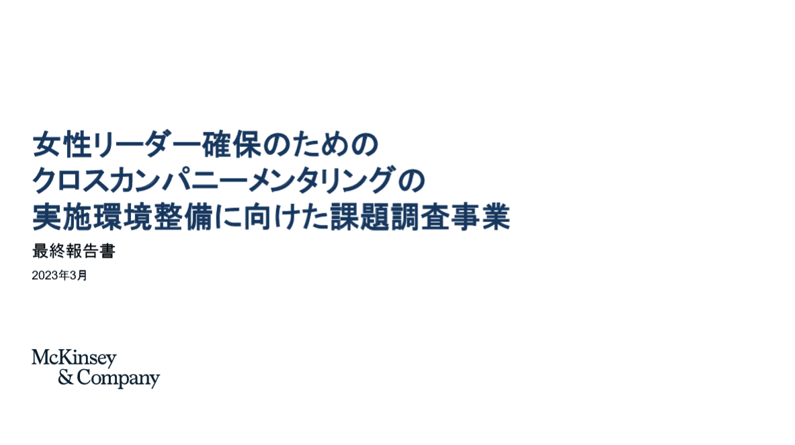
*マッキンゼーの調査報告プレゼン資料*

> 引用元：[> 女性リーダー確保のためのクロスカンパニーメンタリングの実施環境整備に向けた課題調査事業](https://www.meti.go.jp/meti_lib/report/2022FY/000555.pdf)

*https://www.meti.go.jp/meti_lib/report/2022FY/itakuichiran2022FY.pdf*

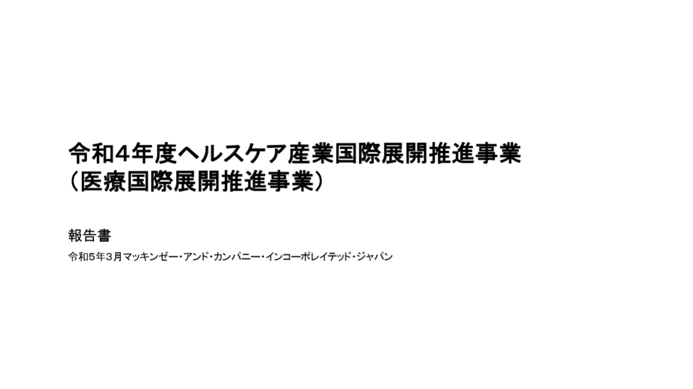
*マッキンゼーの事業報告プレゼン資料*

> 引用元：[> 令和４年度ヘルスケア産業国際展開推進事業（医療国際展開推進事業](https://www.meti.go.jp/meti_lib/report/2022FY/000496.pdf)

*https://www.meti.go.jp/meti_lib/report/2022FY/itakuichiran2022FY.pdf*

戦略コンサルティングファームの雄、マッキンゼーのパワポスライドです。委託調査の成果報告資料として莫大な情報量を包含しつつも、すっきりと見やすいスライドに仕上げているのは、ロジカルな構造化と上下左右のレイアウト調整の賜物ですね。

### ボストン・コンサルティング・グループ（BCG）の調査報告書

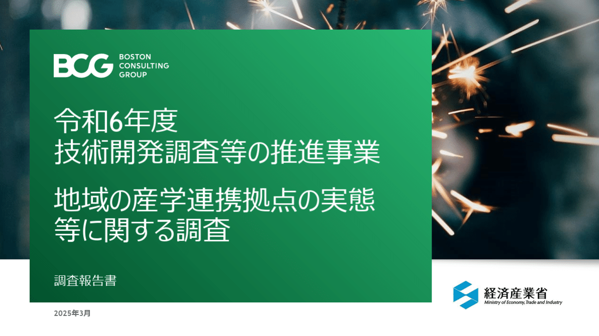
*BCGの推進事業プレゼン資料*

> 引用元：[> 令和６年度技術開発などの推進事業 地域の産学連携拠点の実態などに関する調査](https://www.meti.go.jp/meti_lib/report/2024FY/1000080.pdf)

*https://www.meti.go.jp/meti_lib/report/2024FY/itakuichiran2024FY.pdf*

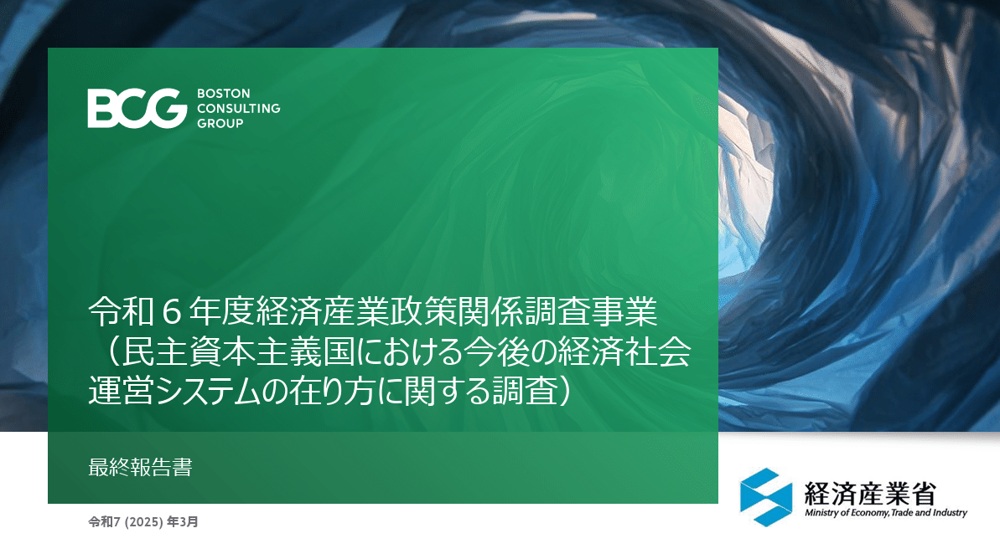
*BCGの調査事業プレゼン資料*

> 引用元：[> 令和６年度経済産業政策関係調査事業（民主資本主義国における今後の経済社会運営システムの在り方に関する調査）最終報告書](https://www.meti.go.jp/meti_lib/report/2024FY/1000015.pdf)

*https://www.meti.go.jp/meti_lib/report/2024FY/itakuichiran2024FY.pdf*

戦略コンサルの中でも、経産省の委託事業を特に多く受けているのが、BCGです。規制産業の大手クライアントに強いBCGならではともいえますね。
こちらも調査報告資料らしいビジーなスライドながら、もはやテンプレともいえるBCGフォーマットを使って整理されていることで、見やすいスライドとなっています。密集度の高いスライドでは四角を駆使して少しでもわかりやすくする一方、多少余裕のあるスライドでは縦横の選を最小限にしてスタイリッシュに見せる工夫も上手です。

### A. T. カーニー（KEARNEY）の調査報告書

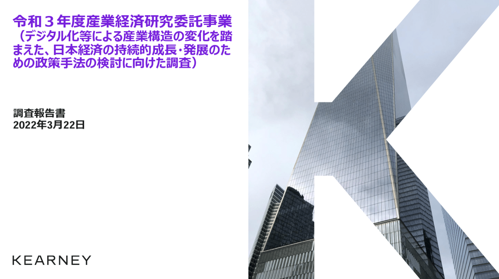
*KEARNEYの調査報告プレゼン資料*

> 引用元：[> 令和３年度産業経済研究委託事業 （デジタル化などによる産業構造の変化を踏まえた、日本経済の持続的成長・発展のための政策手法の検討に向けた調査）](https://www.meti.go.jp/meti_lib/report/2021FY/000570.pdf)

*https://www.meti.go.jp/meti_lib/report/2021FY/itakuichiran2021FY.pdf*

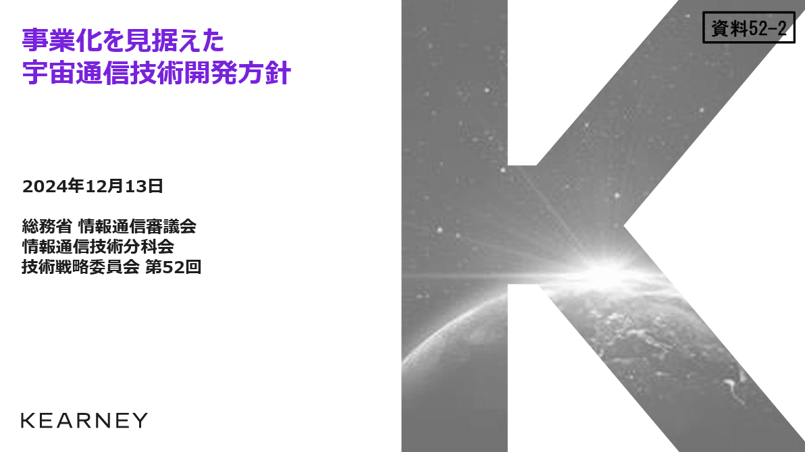
*KEARNEYの総務省分科会プレゼン資料*

> 引用元：[> 事業化を見据えた宇宙通信技術開発方針](https://www.soumu.go.jp/main_content/000981792.pdf)

*https://www.soumu.go.jp/main_sosiki/joho_tsusin/policyreports/joho_tsusin/gijutsusenryaku/02tsushin03_04000590.html*

A. T. カーニーは委託調査の成果報告書があまりなく、一つは総務省の情報通信審議会のプレゼン資料となったスライドを引用しています。なお A. T. KearneyからKEARNEYにリブランディングするタイミングで、一度大きくスライドフォーマットを変えていますが、昔の資料は赤ベースで割と武骨な感じであるのに対し、新しい資料は紫でフォントも柔らかく、スタイリッシュな印象になっています。コンサルファームのブランド一新はほかの戦略ファームでも見られるので、一度分析してもよいかもしれません。

### ローランドベルガー（RB）の成果報告書

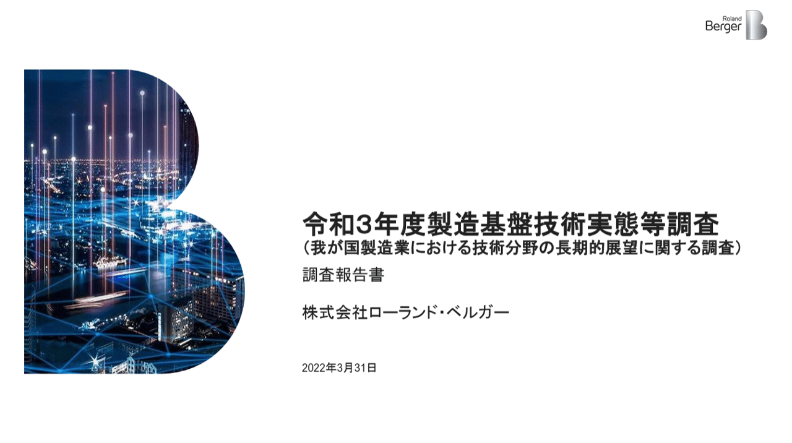
*ローランド・ベルガーの調査報告プレゼン資料*

> 引用元：[> 令和３年度製造基盤技術実態等調査（我が国製造業における技術分野の長期的展望に関する調査）](https://www.meti.go.jp/meti_lib/report/2021FY/000069.pdf)

*https://www.meti.go.jp/meti_lib/report/2021FY/itakuichiran2021FY.pdf*

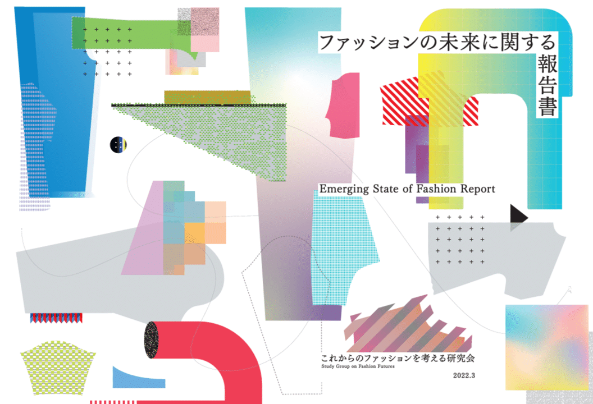
*ローランド・ベルガーの調査研究事業の報告プレゼン資料*

> 引用元：[> 令和３年度商取引・サービス環境の適正化に係る事業報告書（ファッションによる新たな価値創造に関する調査研究事業）](https://www.meti.go.jp/meti_lib/report/2021FY/000588.pdf)

*https://www.meti.go.jp/meti_lib/report/2021FY/itakuichiran2021FY.pdf*

ローランド・ベルガーといえば、銀を基調とするスタイリッシュなデザインのスライドが通常ですが、直近あまり委託調査事業を受けていないこともあり、ちょっと変わった成果報告資料のスライドをチョイスしてみました。
通常のスライドにおいては、淡い色使いと矢印を多用するデザインで、すっきりと見せるのが上手いので、参考にするとよいでしょう。

### アーサー・D・リトル（ADL）の調査報告書

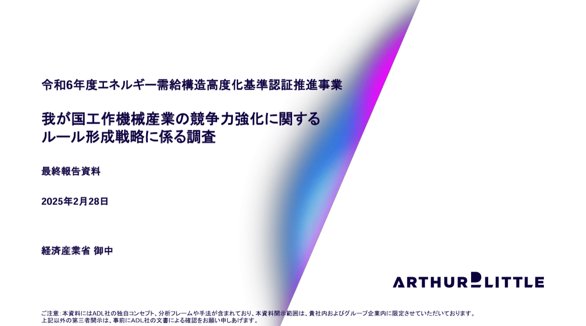
*アーサー・D・リトルの調査報告プレゼン資料*

> 引用元：[> 我が国工作機械産業の競争力強化に関するルール形成戦略に掛かる調査](https://www.meti.go.jp/meti_lib/report/2024FY/1000046.pdf)

*https://www.meti.go.jp/meti_lib/report/2024FY/itakuichiran2024FY.pdf*

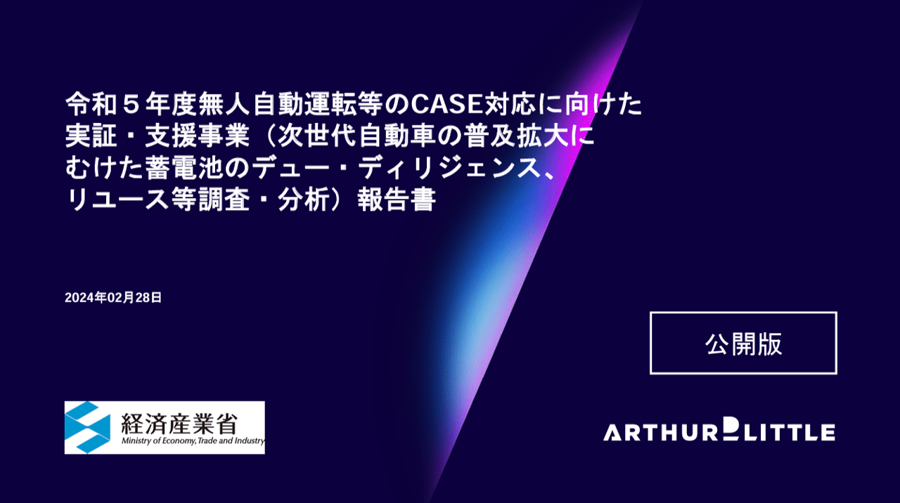
*アーサー・D・リトルの調査・分析報告プレゼン資料*

> 引用元：[> 令和５年度無人自動運転などのCASE対応に向けた実証・支援事業（次世代自動車の普及拡大に向けた蓄電池のデューデリジェンス、リユース等調査・分析](https://www.meti.go.jp/meti_lib/report/2023FY/000569.pdf)

*https://www.meti.go.jp/meti_lib/report/2023FY/itakuichiran2023FY.pdf*

アーサー・Ｄ・リトルのスライドは、これでもかと情報を詰め込んでいるにもかかわらず、有機的な図に見せるという点において、非常に参考になるスライドといえます。
技術系に強く、委託事業の資料でも技術や部品の全体像を１枚のスライドで表現しなければいけない中で、そうした技術が磨かれてきたのでしょう。
大分古い資料なので今回は上げていませんが、EV初期における部材のコスト分析は不朽の名作スライドといえますね。

## 総合系コンサルティングファームのスライド

### デロイトトーマツコンサルティング（DTC）の調査報告書

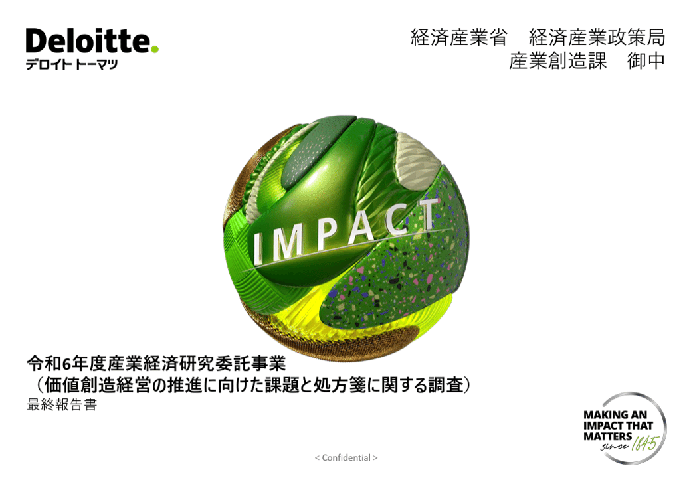
*デロイトトーマツの研究委託事業プレゼン資料*

> 引用元：[> 令和６年度産業経済研究委託事業（価値創造経営の推進に向けた課題と処方箋に関する調査）](https://www.meti.go.jp/meti_lib/report/2024FY/1000124.pdf)

*https://www.meti.go.jp/meti_lib/report/2024FY/itakuichiran2024FY.pdf*

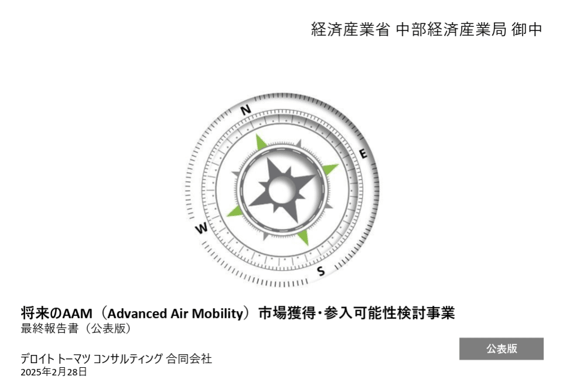
*デロイトトーマツの検討事業プレゼン資料*

> 引用元：[> 将来のAAM（Advanced Air Mobility）市場獲得・参入可能性検討事業](https://www.meti.go.jp/meti_lib/report/2024FY/000037.pdf)

*https://www.meti.go.jp/meti_lib/report/2023FY/itakuichiran2023FY.pdf*

BCGと並んで経産省の委託調査事業の請負数が多いのがDTCです。
成果報告資料を見てみるとわかりますが、意外に決まったフォーマットがなく、色使いも様々です。これはデロイト トーマツ コンサルティングが様々なファームから採用をしている結果で、決まったフォーマットがない事が個性である、というような感じなのかもしれません。
デロイトトーマツグループのスライド資料については以下のNoteでより詳細に解説しているので、気になる方はどうぞ。

### PwCコンサルティングの調査報告書

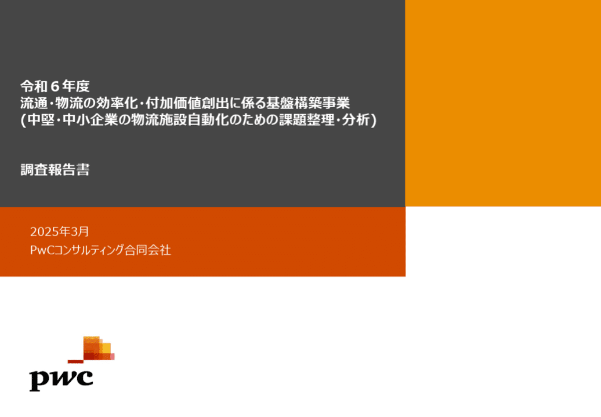
*PwCコンサルティングの事業報告スライド資料*

> 引用元：令和６年度[> 流通・物流の効率化・付加価値創出に係る基盤構築事業(中堅・中小企業の物流施設自動化のための課題整理・分析)](https://www.meti.go.jp/meti_lib/report/2024FY/1000144.pdf)

*https://www.meti.go.jp/meti_lib/report/2024FY/itakuichiran2024FY.pdf*

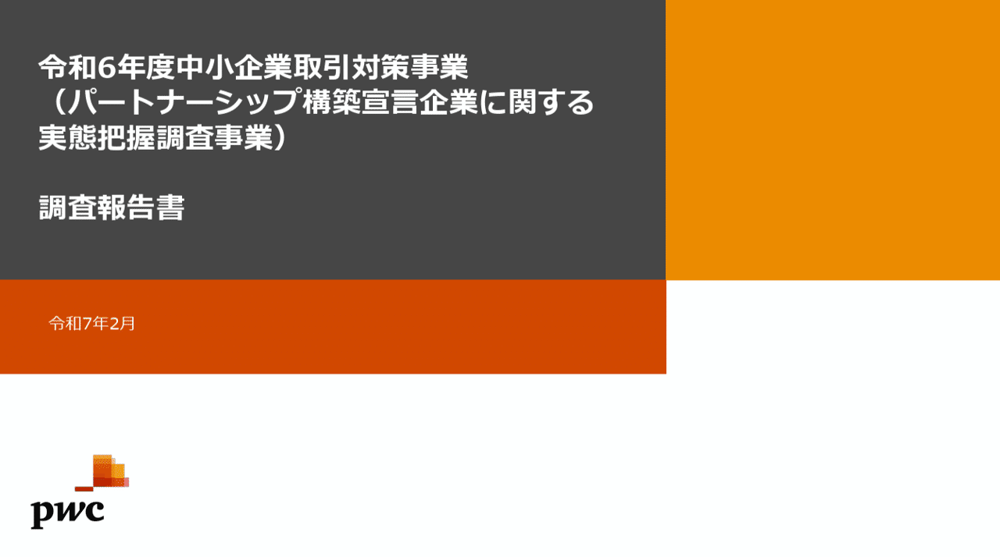
*PwCコンサルティングの調査事業報告スライド資料*

> 引用元：[> 令和6年度中小企業取引対策事業（パートナーシップ構築宣言企業に関する実態把握調査事業）](https://www.meti.go.jp/meti_lib/report/2024FY/000031.pdf)

*https://www.meti.go.jp/meti_lib/report/2024FY/itakuichiran2024FY.pdf*

PwCのスライドはオレンジをベースにしたものとなっていますが、上で上げた資料のうち一つは資料の中で様々なトーンが使われています。中には某戦略コンサルを想起させる独特な色使いも。
これはDTC同様に、戦略ファームからの移籍者が自分の慣れたスタイルのスライドを作ること、また委託調査事業を省エネで行うために、過去の様々なアウトプットをサニタイズして使うのが上手だからといえますね。
PwCグループのスライド資料については以下のNoteでより詳細に解説しているので、気になる方はどうぞ。

### EYストラテジー・アンド・コンサルティング（EYSC）の調査報告書

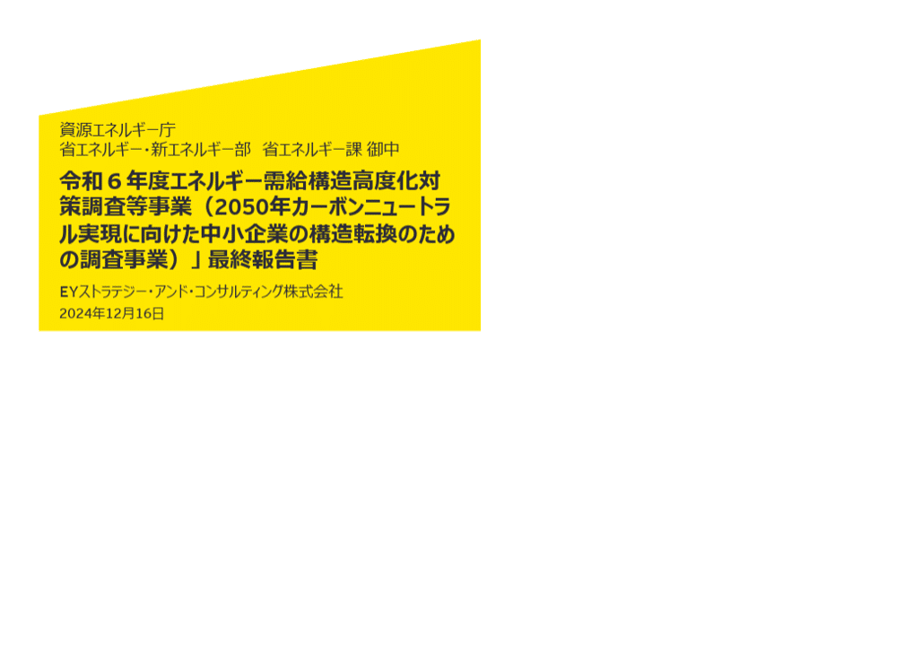
*EYSCの調査事業報告スライド資料*

> 引用元：[> 令和６年度エネルギー需給構造高度化対策調査等事業（2050年カーボンニュートラル実現に向けた中小企業の構造転換のための調査事業](https://www.meti.go.jp/meti_lib/report/2024FY/000514.pdf)> ）】

*https://www.meti.go.jp/meti_lib/report/2024FY/itakuichiran2024FY.pdf*

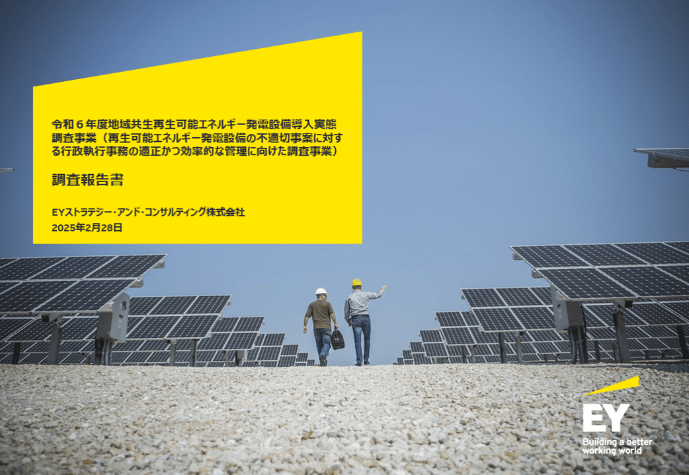
*EYSCの調査報告スライド資料*

[> 引用元：令和６年度地域共生再生可能エネルギー発電設備導入実態調査事業（再生可能エネルギー発電設備の不適切事案に対する行政執行事務の適正かつ効率的な管理に向けた調査事業）調査報告書](https://www.meti.go.jp/meti_lib/report/2024FY/000336.pdf)

*https://www.meti.go.jp/meti_lib/report/2024FY/itakuichiran2024FY.pdf*

EYSCのスライドは前のデロイトトーマツコンサルティングやPwCコンサルティングに比べて、色のトーンの統一感があるように見えます。
スライドは基本的な構造化に四角の枠をうまく多用することで、情報量が多くても頭に入りやすいように作られています。
EYグループのスライド資料については以下のNoteでより詳細に解説しているので、気になる方はどうぞ。

### KPMGコンサルティングの調査報告書

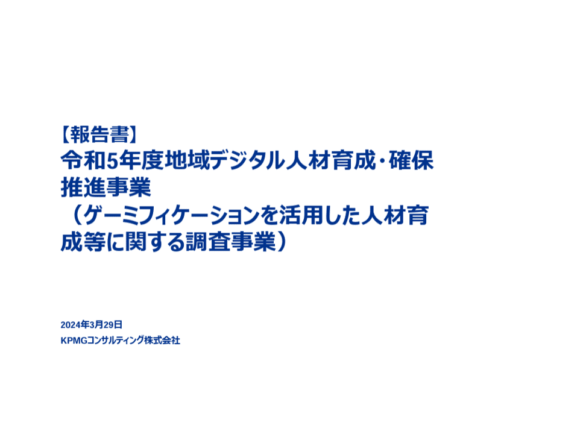
*KPMGコンサルティングの事業報告スライド資料*

> 引用元：[> 令和５年度地域デジタル人材育成・確保推進事業（ゲーミフィケーションを活用した人材育成等に関する調査事業）](https://www.meti.go.jp/meti_lib/report/2023FY/000515.pdf)

*https://www.meti.go.jp/meti_lib/report/2023FY/itakuichiran2023FY.pdf*

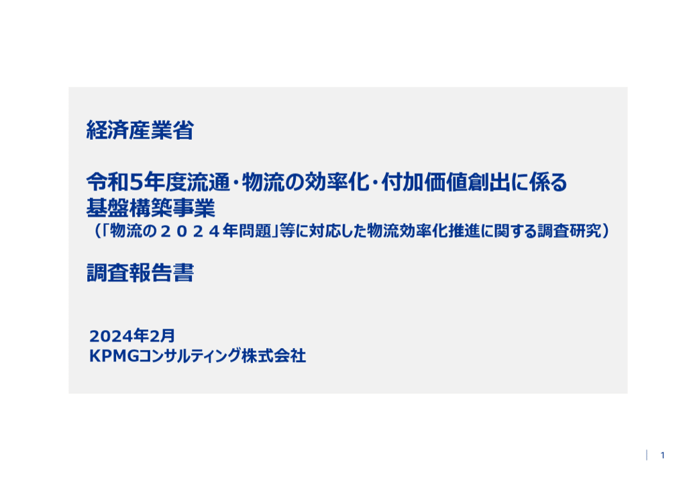
*KPMGコンサルティングの調査報告スライド資料*

> 引用元：[> 令和５年度流通・物流の効率化・付加価値創出に係る基盤構築事業（「物流の2024年問題」等に対応した物流効率化推進に関する調査研究）](https://www.meti.go.jp/meti_lib/report/2023FY/000436.pdf)

*https://www.meti.go.jp/meti_lib/report/2023FY/itakuichiran2023FY.pdf*

KPMGのスライドは青が基調のすっきりとしたデザインですが、濃い青から薄い青まで、青の使い方がうまく、全体のバランスが取れている印象です。
スライドは表形式のものが多いのですが、色のグラデーションや文字色の調整などによって、スタイリッシュに見える事例ですね。
KPMGグループのスライド資料については以下のNoteでより詳細に解説しているので、気になる方はどうぞ。

### アビームコンサルティング（ABeam）の調査報告書

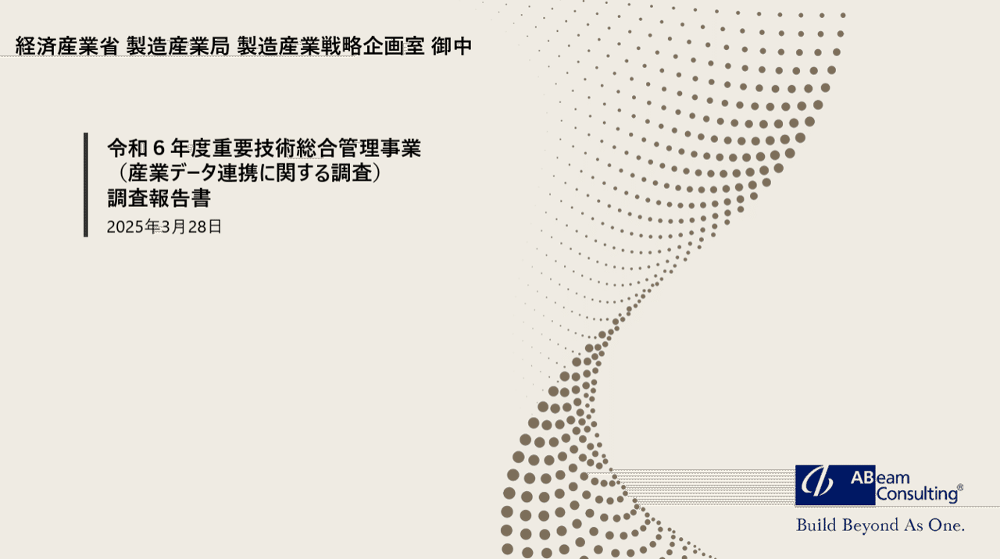
*アビームコンサルティングの調査報告スライド資料*

> 引用元：[> 令和６年度重要技術総合管理事業（産業データ連携に関する調査）調査報告書](https://www.meti.go.jp/meti_lib/report/2024FY/000742.pdf)

*https://www.meti.go.jp/meti_lib/report/2024FY/itakuichiran2024FY.pdf*

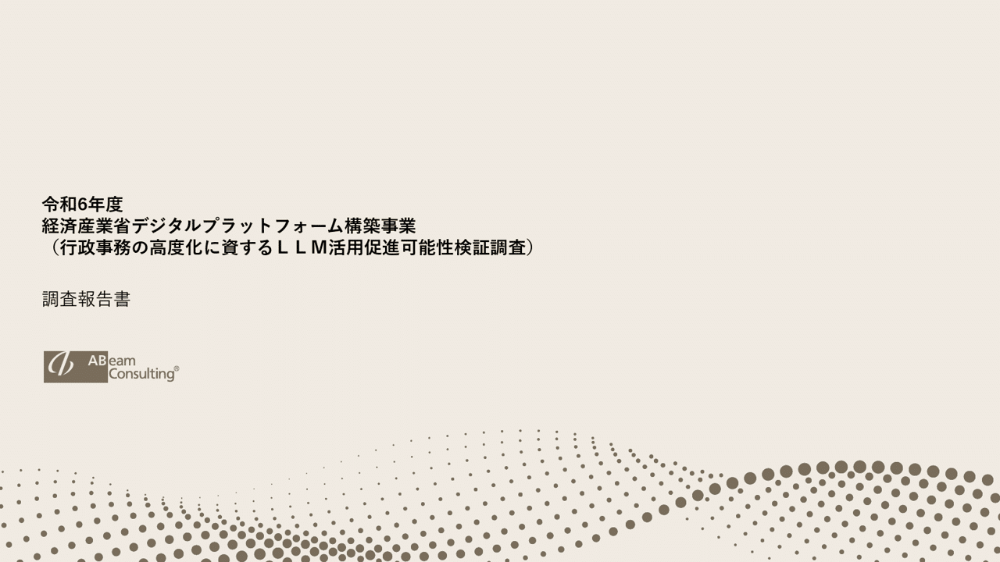
*アビームコンサルティングの事業報告スライド資料*

> 引用元：[> 令和６年度経済産業省デジタルプラットフォーム構築事業（行政事務の高度化に資するＬＬＭ活用促進可能性検証調査）](https://www.meti.go.jp/meti_lib/report/2024FY/000718.pdf)

*https://www.meti.go.jp/meti_lib/report/2024FY/itakuichiran2024FY.pdf*

アビームのスライドは他のファームではあまり見ない、ベージュを基調としたデザインとなっています。また背景色をすべてベージュにしているページもあり、落ち着いたレトロな印象を受ける反面、たまに文字が読みづらいところもあります。
とはいえ多くの有名な競合がある中で、このデザインが目立つのは間違いないので、その意味ではうまくいっているスライドとも言えますね。

### アクセンチュア（ACC）の調査報告書

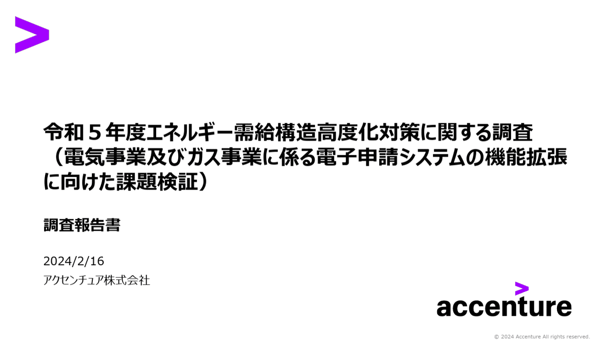
*アクセンチュアの調査報告スライド資料*

> 【[> 令和５年度エネルギー需給構造高度化対策に関する調査（電気事業及びガス事業に係る電子申請システムの機能拡張に向けた課題検証](https://www.meti.go.jp/meti_lib/report/2023FY/000825.pdf)> ）】

*https://www.meti.go.jp/meti_lib/report/2023FY/itakuichiran2023FY.pdf*

*アクセンチュアの事業報告スライド資料*

> 【[> 令和５年度ヘルスケア産業基盤高度化推進事業（2025 年大阪・関西万博におけるPHR 体験実証及び医療情報関連ガイドラインに関する調査）](https://www.meti.go.jp/meti_lib/report/2023FY/000785.pdf)> 】

*https://www.meti.go.jp/meti_lib/report/2023FY/itakuichiran2023FY.pdf*

アクセンチュアといえば、コーポレートブランドを刷新して紫のカラーになりましたが、委託調査の資料を見る限りでは、スライド資料もすべて紫にするという感じではないようです。
スライドの中身はというと、戦略コンサルに近い構造的なものもあれば、ITコンサル寄りのものもあり、この辺りは対応するコンサルタントによっても変わってくるのかもしれません。

## 総合研究所・シンクタンクのパワポ

### 三菱UFJリサーチ&コンサルティング（MURC）の成果報告書

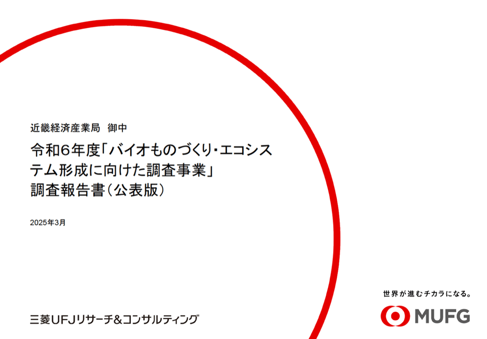
*MURCの調査報告スライド資料（公表版）*

> 引用元：[> 令和６年度「バイオものづくり・エコシステム形成に向けた調査事業」](https://www.meti.go.jp/meti_lib/report/2024FY/000025.pdf)

*https://www.meti.go.jp/meti_lib/report/2024FY/itakuichiran2024FY.pdf*

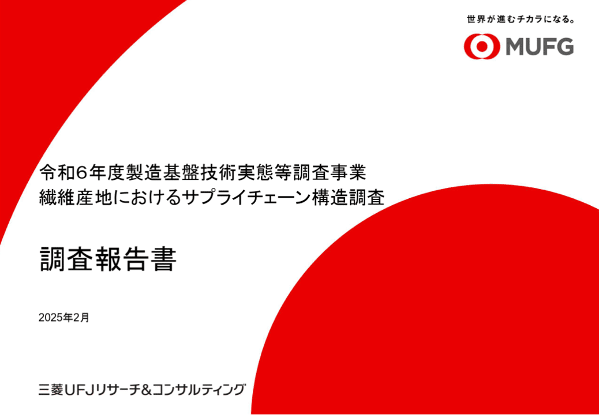
*MURCの調査報告スライド資料*

> 引用元：[> 令和６年度製造基盤技術実態等調査事業繊維産地におけるサプライチェーン構造調査](https://www.meti.go.jp/meti_lib/report/2024FY/000328.pdf)

*https://www.meti.go.jp/meti_lib/report/2024FY/itakuichiran2024FY.pdf*

三菱UFJリサーチ＆コンサルティングの調査報告スライドは、シンクタンクらしく、情報を伝えることに重きが置かれています。そのため、グラフを見せたいページなどはグラフを中心に持ってきて周りはあまりビジーにしないなど、うまく強弱をつける工夫がみられます。

### 野村総合研究所（NRI）の調査報告書

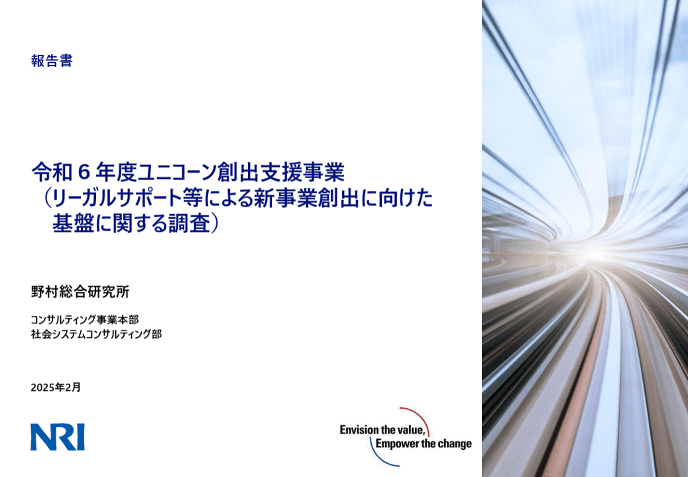
*NRIの事業報告スライド資料*

> 引用元：[> 令和６年度ユニコーン創出支援事業（リーガルサポート等による新事業創出に向けた基盤に関する調査）](https://www.meti.go.jp/meti_lib/report/2024FY/1000061.pdf)

*https://www.meti.go.jp/meti_lib/report/2024FY/itakuichiran2024FY.pdf*

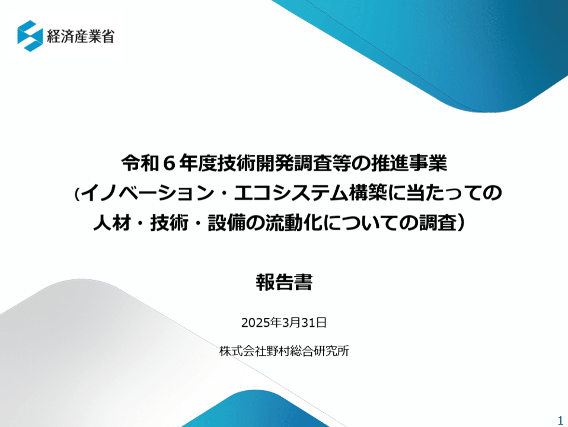
*NRIの調査事業報告スライド資料*

> 引用元：[> 令和６年度技術開発調査等の推進事業（イノベーション・エコシステム構築に当たっての人材・技術・設備の流動化についての調査）](https://www.meti.go.jp/meti_lib/report/2024FY/1000143.pdf)

*https://www.meti.go.jp/meti_lib/report/2024FY/itakuichiran2024FY.pdf*

NRIの成果報告資料は、比較的戦略コンサルに近いような、構造ベースのスライドが多いです。多くは表形式のスライドですが、色遣いや線の強弱によって見せているため、すっきりと見やすくなっています。

### 三菱総合研究所（MRI）の調査報告書

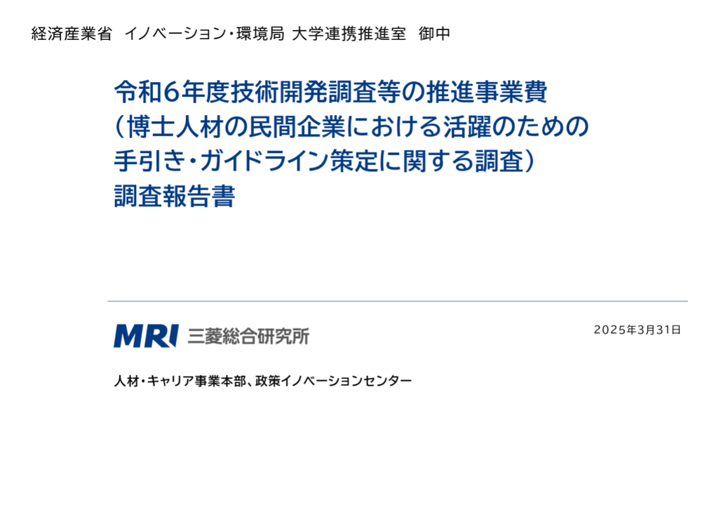
*MRIの調査報告スライド資料*

> 引用元：[> 令和６年度技術開発調査等の推進事業費（博士人材の民間企業における活躍のための手引き・ガイドライン策定に関する調査）調査報告書](https://www.meti.go.jp/meti_lib/report/2024FY/1000031.pdf)

*https://www.meti.go.jp/meti_lib/report/2024FY/itakuichiran2024FY.pdf*

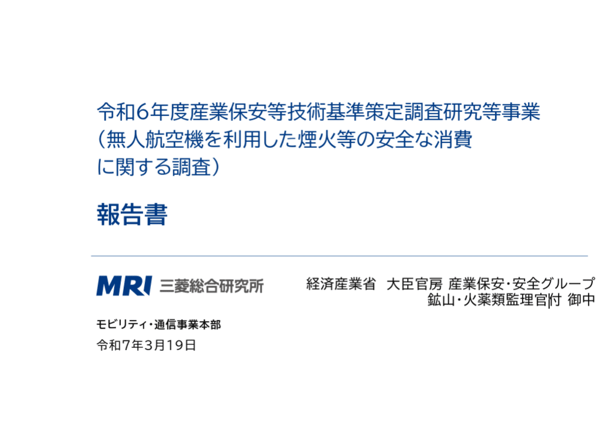
*MRIの研究事業報告スライド資料*

> 引用元：[> 令和６年度産業保安等技術基準策定調査研究等事業（無人航空機を利用した煙火等の安全な消費に関する調査）](https://www.meti.go.jp/meti_lib/report/2024FY/1000090.pdf)

*https://www.meti.go.jp/meti_lib/report/2024FY/itakuichiran2024FY.pdf*

三菱総研の調査報告資料も、情報の提供に重きが置かれていますが、全体としてファクトを積み上げて結論に向かっていく構造がうまく作られており、調査した内容から徐々にストーリーが組みあがっていくので、読みやすいスライドといえますね。

### NTTデータ（NTT Data）の調査報告書

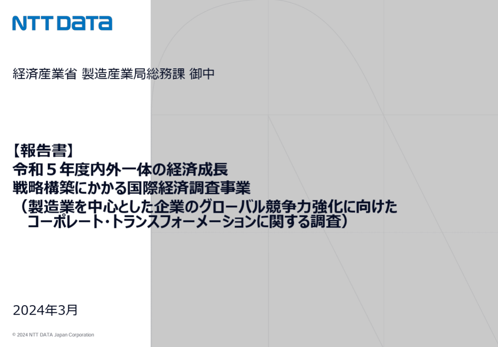
*NTTデータの調査報告スライド資料*

> 引用元：[> 令和５年度内外一体の経済成長戦略構築にかかる国際経済調査事業（製造業を中心とした企業のグローバル競争力強化に向けたコーポレート・トランスフォーメーションに関する調査）](https://www.meti.go.jp/meti_lib/report/2023FY/000465.pdf)

*https://www.meti.go.jp/meti_lib/report/2023FY/itakuichiran2023FY.pdf*

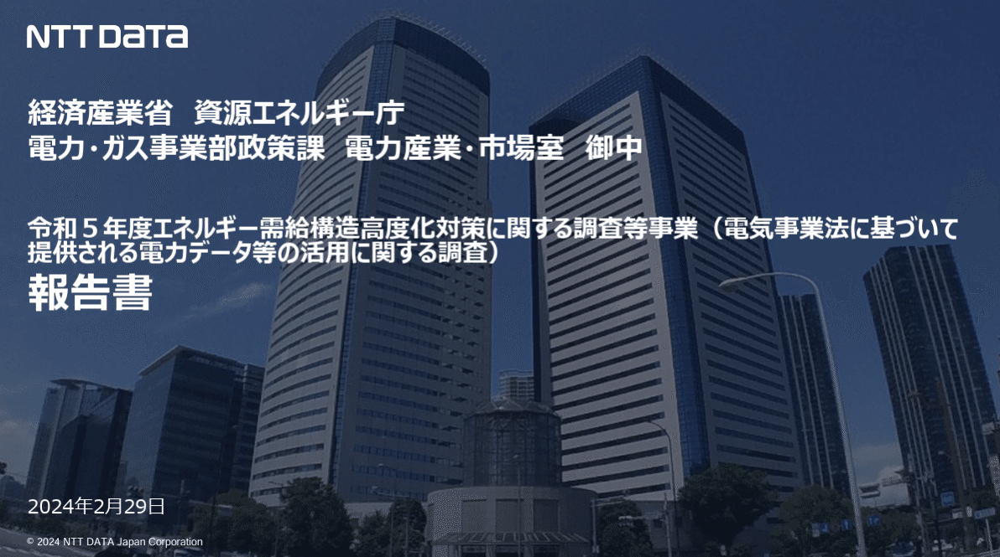
*NTTデータの事業報告スライド資料*

> 引用元：[> 令和５年度エネルギー需給構造高度化対策に関する調査等事業（電気事業法に基づいて提供される電力データ等の活用に関する調査）](https://www.meti.go.jp/meti_lib/report/2023FY/000106.pdf)

*https://www.meti.go.jp/meti_lib/report/2023FY/itakuichiran2023FY.pdf*

NTTデータは、ITコンサルティングだけあって、定量分析などデータ分析に強みがあることから、成果報告資料もデータ分析を中心とした構成になっています。自社の強みを生かしてストーリーラインをうまく設計しているという意味で、参考になるといえますね。

## 終わりに

以上、30のパワーポイント資料を一覧としました。かなりボリュームがありますので、土日など時間のある時に一つ一つのんびりとご覧いただければと思います。
また、新しくアクティビストファンドの株主提案スライドについてまとめたNoteを公開しましたので、興味がある方は読んでみてくださいね。

## パワポ研オリジナルテンプレート

パワポ研では、**戦略コンサルティングファームのOBが監修して作成された**「ビジネスシーンで使える」パワーポイントテンプレートを公開しております。デザインを整えるのみならず、**ロジックやストーリーを整理する**のにも役立つパッケージになっておりますので、関心のある方は下記ページも併せてご覧ください！

[
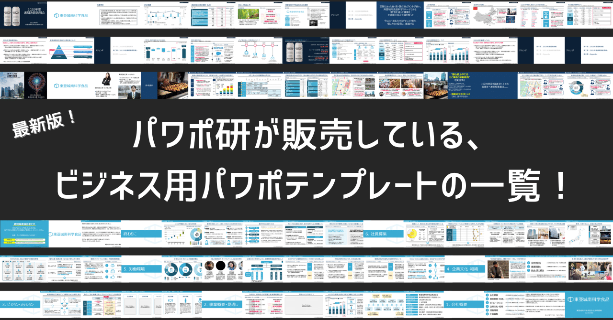
](https://note.com/powerpoint_jp/n/n7300a1293e8e)上記の記事のように、noteでは**フォローしているだけでビジネスにおける「資料作成のコツ」と「デザインのセンス」が身に付くアカウント**を目指して情報配信を行っています。
今後もコンスタントに記事を配信していく予定なので、関心のある方は是非アカウントのフォローをお願いします！

**> Template販売　**[> https://powerpointjp.stores.jp/](https://powerpointjp.stores.jp/%EF%BF%BCnote)
**> note　**[> パワポ研の資料作成術](https://note.com/powerpoint_jp/m/mc291407396da)
**> X（旧Twitter)　**[> https://twitter.com/powerpoint_jp](https://twitter.com/powerpoint_jp)

## レックスアドバイザーズからのお知らせ

パワポ研は株式会社レックスアドバイザーズが運営しています。
レックスアドバイザーズは**経営企画職や経営管理職に特化した転職エージェント**です。
上場企業や上場準備企業を中心に、**経営企画、IR、経理財務、法務、内部監査等の職種の求人**をご紹介しているほか、**CFOなどのコンフィデンシャル求人**もご紹介可能です。
またコンサルティングファームや監査法人、会計事務所の求人も豊富にあるため、プロフェッショナルファームを目指す方のご支援も得意です。
求人紹介やキャリア相談を希望の方は、[**無料転職サポート**](https://www.career-adv.jp/job_search/entryform_exp/)よりサービス利用登録をしてみてください。

*レックスアドバイザーズのサービスサイトはこちら*

**> 求人をご希望の方　**[> 無料転職サポート](https://www.career-adv.jp/job_search/entryform_exp/)**
> 採用支援をご希望の方　**[> 採用サポート](https://www.career-adv.jp/request3/)
**> その他　**[> お問い合わせフォーム](https://www.rex-adv.co.jp/contact)
**> 書籍　**[> 注目企業の実例から学ぶパワポ作成術](https://www.amazon.co.jp/dp/4046060476)

