# 【マネしたい】おしゃれなパワポのスライド「レイアウト」９選

[note原文](https://note.com/powerpoint_jp/n/n816b11bf9c03)

みなさんこんにちは。
資料デザインのリサーチや分析に取り組むパワーポイントのスペシャリスト、パワポ研です。

今回は、**パワポの「レイアウト」に焦点を当て、上場企業のIR資料からおしゃれなスライドを紹介**していきます。ちなみにレイアウトに限らない、おしゃれすぎるパワーポイント３選の記事はこちら。

パワポのレイアウトとは、簡単に言えばスライドの構成です。**ヘッダーやフッター、ボディにどのようなコンテンツをどのように配置するか**ということですね。
そしてパワポのレイアウトを考える上では、大きく３つの観点で考えるのがシンプルでよいです。

- チャプターやタイトルをスライドのどこに配置するか

- メッセージをスライドのどこに配置するか

- スライドの中心部をどのように分割するか

こう聞くと難しく感じるかもしれませんが、具体なパワポのレイアウト例を見ればすぐ理解できるので、スマレジの事業計画及び成長可能性に関する事項のパワーポイントを例に、スライドのレイアウトを見てみましょう。

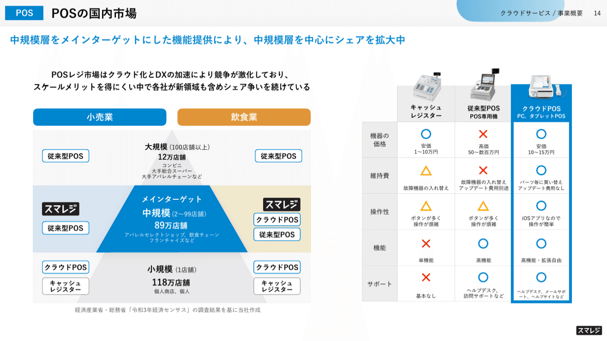
> 引用元：[> 事業計画及び成長可能性に関する事項](https://corp.smaregi.jp/ir/library/FY2025_Business_Plan_and_Growth_Potential.pdf)

*https://corp.smaregi.jp/ir/*

こちらのスライドについて、上の観点でレイアウトを整理してみましょう。

- チャプター：ヘッダー右

- タイトル：ヘッダー左

- メッセージ：ヘッダー下最上部

- ボディ：左右２分割、左右均等ではなく左が少し大きい

パワーポイントの資料で一番多いレイアウトとしては、ヘッダー左上にチャプター名とタイトルがあり、その下にメッセージ、ボディは分割無しあるいは左右で均等に２分割するスライドです。
そのためスマレジ社のレイアウトは、**チャプターがヘッダー右にある点と、ボディが左右均等ではなく左の方がやや大きい点が特徴的**といえますね。

パワポのレイアウトの考え方に関して、イメージが湧いたと思いますので、ここからはおしゃれなスライドのレイアウト例を見ていきましょう！

## おしゃれなチャプターやタイトルの例２選

まずはパワポのレイアウトの一つ目の観点である、チャプターやタイトルについて、おしゃれなレイアウト例を見ていきましょう。

### チャプターがおしゃれなレイアウト例

まずは株式会社TENTIALのパワポのレイアウト例を見ていきましょう。
2025年8月期 通期決算説明資料（事業計画及び成長可能性に関する資料）のパワーポイント資料です。

> 引用元：[> 2025年8月期 通期決算説明資料（事業計画及び成長可能性に関する資料）](https://ssl4.eir-parts.net/doc/325A/tdnet/2698232/00.pdf)

*https://corp.tential.jp/ir/library/presentations/*

パワポのレイアウトの特徴として、**チャプターがスライド左側に縦で入っています**。左側にチャプターがあることがわかるよう、縦のリボンが入っていますが、コーポレートカラーの紺色と金色のリボンがおしゃれですね。
また左上にはコーポレートロゴ、左下にページ番号を入れているレイアウトも、パワポ全体としておしゃれな印象を与えます。

### 目次を入れた見やすいレイアウト例

次に株式会社トライアルホールディングスのパワポのレイアウト例を見ていきましょう。
2025年６月期 決算説明資料のパワーポイント資料です。

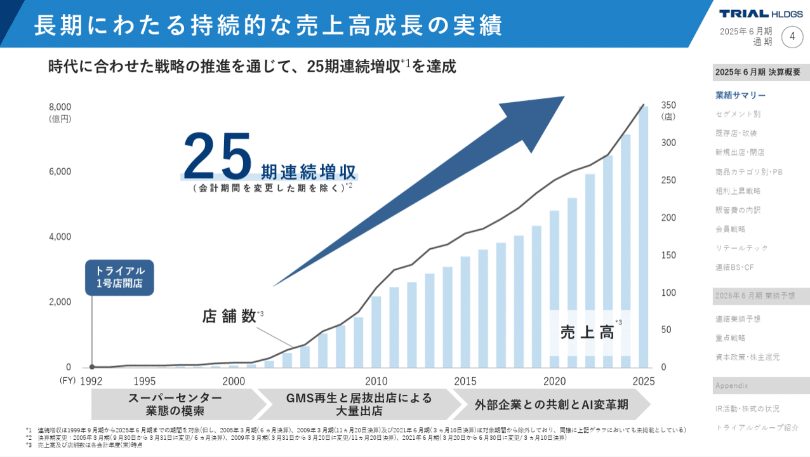
> 引用元：[> 2025年６月期 決算説明資料](https://pdf.irpocket.com/C141A/hGOm/hHO6/ZWXe.pdf)

*https://trial-holdings.inc/ir/library/financial-announcement/*

パワポのレイアウトの特徴として、**チャプターの目次がスライド右側に縦で入っています。現在のスライドがプレゼンテーション資料のどの位置なのかが一目でわかりやすいレイアウト**になっており、見やすいパワポのレイアウトといえますね。目次の上にはコーポレートロゴと資料名、ページ番号が入っている点も見やすいです。

チャプターが右側に配置されていることで、ヘッダーに直接スライドのタイトルが入るレイアウトになっています。白地のスライドに対して、ヘッダーがコーポレートカラーの青色に白文字の配色となっており、全体的におしゃれなレイアウトのパワーポイントといえますね。

## メッセージが見やすいレイアウトの例３選

続いてパワポのレイアウトの二つ目の観点である、スライドのメッセージの位置について、見やすいレイアウト例を見ていきましょう。

### メッセージがわかりやすいレイアウト例

最初はラクスル株式会社のパワポのレイアウト例を見ていきましょう。
2025年7月期決算説明会資料のパワーポイント資料です。

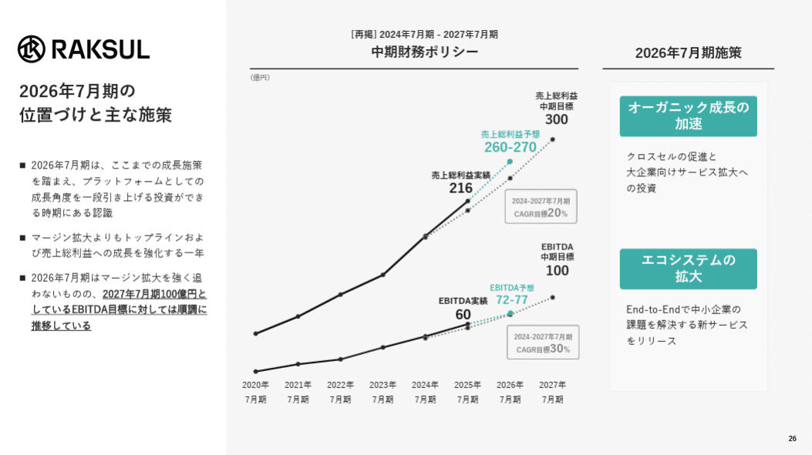
> 引用元：[> 2025年7月期決算説明会資料](https://ssl4.eir-parts.net/doc/4384/ir_material_for_fiscal_ym/187138/00.pdf)

*https://corp.raksul.com/ir/library/presentation/*

パワポのレイアウトの特徴として、**メッセージがスライド左側に縦で入っています。箇条書きで補足を入れることで、メッセージがわかりやすい**スライドになります。

一般的なパワポのレイアウトだとメッセージが上部に来ますが、そこに補足の箇条書きを入れてしまうと、メッセージ部分のスペースが大きくなり、おしゃれでない印象を与えてしまいます。

その点、パワポの左側にメッセージと補足の箇条書きを入れるレイアウトだと、**多少箇条書きが長くても間延びした印象を与えづらく、おしゃれでわかりやすいスライド**になります。

### メッセージが見やすいレイアウト例

続いて株式会社クラウドワークスのパワポのレイアウト例を見ていきましょう。
2025年９月期通期 決算説明資料のパワーポイント資料です。

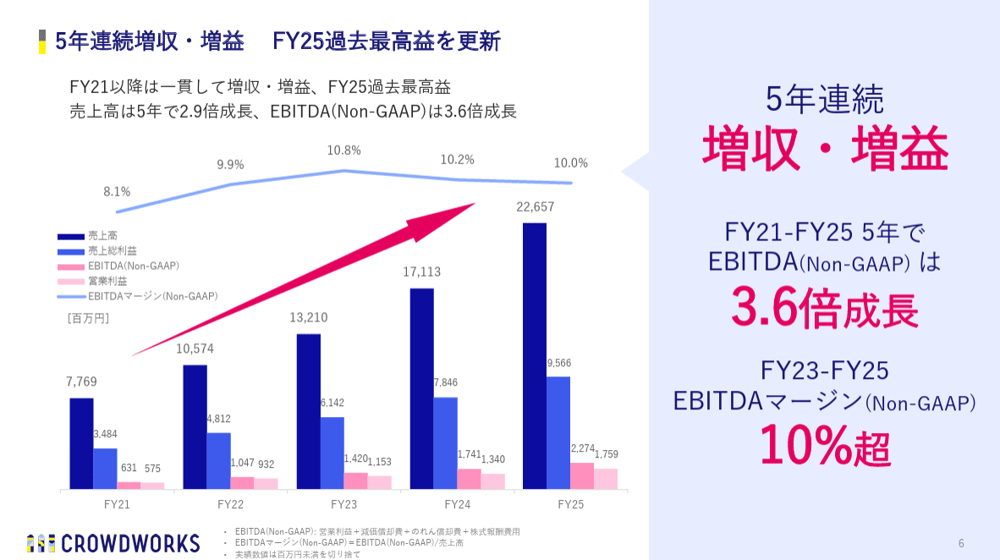
> 引用元：[> 2025年９月期通期 決算説明資料](https://contents.xj-storage.jp/xcontents/AS80447/3d3c95f4/389d/4f7c/8ed9/dfe4b4a7c1e9/20251114133622897s.pdf)

*https://crowdworks.co.jp/ir/results*

パワポのレイアウトの特徴として、**メッセージがスライド右側に縦で入っています。**右側のスペースの背景を薄い青色にしたうえで、メッセージだけを入れることで読み手の視線を誘導する工夫がされており、見やすいパワポのレイアウトといえますね。

パワポの右側にぶち抜きでメッセージを入れるレイアウトのため、タイトルやボディは左側のスペースで完結しています。**ここをコンパクトにまとめていること**が、このレイアウトで見やすいパワポに仕上げる上でのポイントといえますね。**右側を吹き出しのように見せている点もおしゃれで見やすいレイアウトのパワポにする工夫**といえますね。

また人間の視線は左から右に流れるため、メ**ッセージをスライドの上や左に設定するレイアウトの場合は、いわゆる結論ファーストの構成のパワポ**になります。逆に**右や下にスライドのメッセージを持ってくる場合は、ファクトから結論に流れるストーリー型の構成のパワポ**になります。

### 上下を使ったわかりやすいレイアウト例

続いて株式会社リアルゲイトのパワポのレイアウト例を見ていきましょう。
通期決算説明資料のパワーポイント資料です。

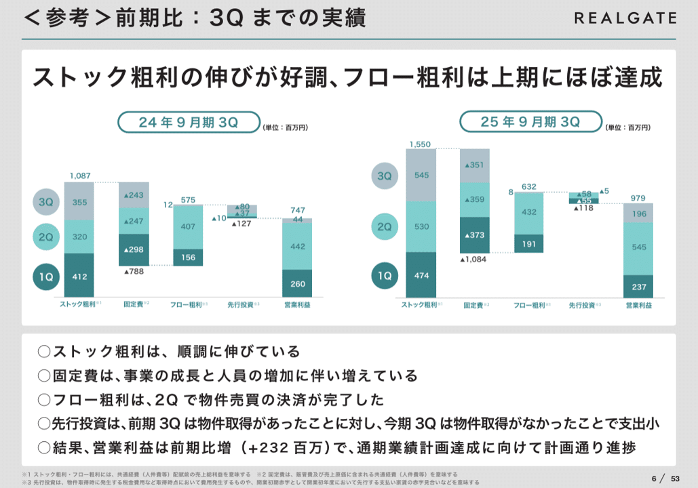
> 引用元：[> 通期 決算説明資料](https://realgate.jp/ir/upload_file/tdnrelease/5532_20251028580026_P01_.pdf)

*https://realgate.jp/ir/library/presentation.html*

パワポのレイアウトの特徴として、**メインメッセージをヘッダーの下に入れつつ、補足の箇条書きをスライド下**に入れています。よくある上部にメッセージがあるパワポのレイアウトの変形版です。

ラクスルのところで少し説明しましたが、**上のメッセージの下に箇条書きで詳細を入れてしまうと、スライドのスペースを取ってしまうため、見やすくない**レイアウトになってしまいます。そこで、上部はメッセージのみとし、ボディを挟んで下に詳細を箇条書きにするというレイアウトにすることで、見やすい、わかりやすいパワポにしています。

ちなみに、**上下を使うパワポのレイアウトとしては、上メッセージでスライドのボディの説明、下メッセージで示唆や提案といった構造のデザイン**もあります。戦略コンサルティングファームなどで好まれるスライドのレイアウトで、提案書などにあうフォーマットですね。

## ボディ構造がわかりやすいレイアウト例４選

最後はパワポのレイアウトの三つ目の観点である、スライドの中心部をどのように分割するかという点について、ボディ構造がわかりやすいレイアウト例を見ていきましょう。

### 背景色でスライドを分割するレイアウト例

まずは株式会社Sapeatのパワポのレイアウト例を見ていきましょう。
2025年9月期 決算説明資料のパワーポイント資料です。

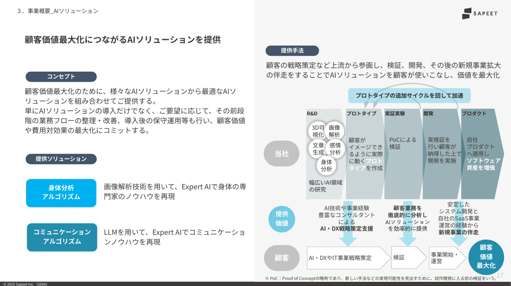
> 引用元：[> 2025年9月期 決算説明資料](https://contents.xj-storage.jp/xcontents/AS06134/917529c0/e514/43c6/9c94/946f9e645375/140120251113501224.pdf)

*https://sapeet.com/ir/presentations*

パワポのレイアウトの特徴として、**左側を白色の背景、右側を灰色の背景というように、背景の色で完全にスライドを二分割**しています。スライドをに分割しつつも、間に仕切り線などはなくシームレスな印象を与えるので、おしゃれでスタイリッシュなパワポのレイアウトといえます。

ポイントとして、背景色は分けていますが、タグの色は黒色で揃えているほか、使っている色も青色と緑色の継投で統一することで、パワポ全体の統一感を維持したおしゃれなレイアウトとしています。

なおパワポの左右を背景色で二分割するデザインは、**特にビフォーアフターで見せたい場合などで有効**なレイアウトです。この場合は、おしゃれなレイアウトというだけでなく、パワポのコンセプトがわかりやすいレイアウトにもなるわけですね。

### 動的なデザインのレイアウト例

お次は株式会社ウェザーニュースのパワポのレイアウト例を見ていきましょう。
2025年5月期 決算説明資料のパワーポイント資料です。

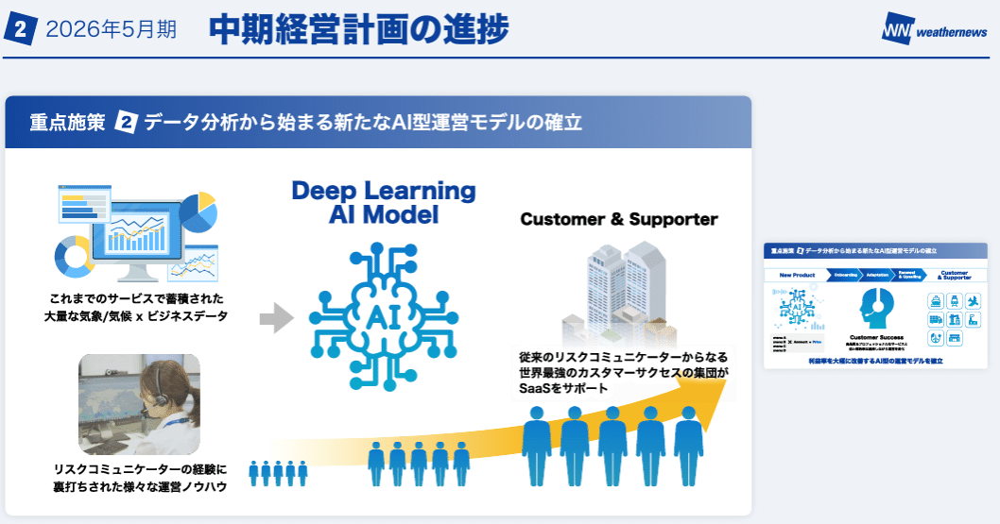

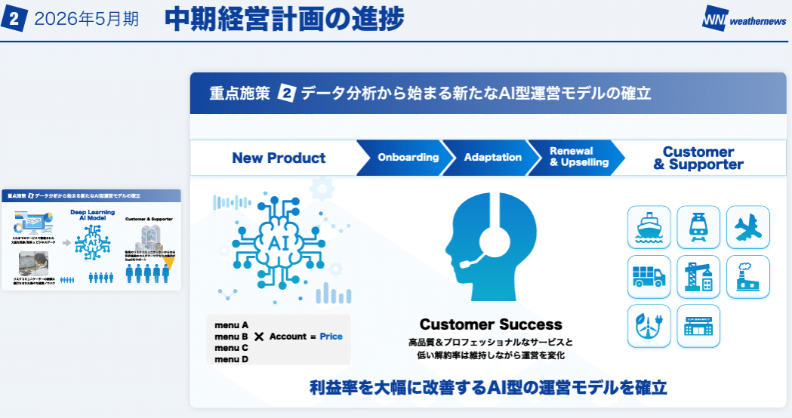
> 引用元：[> 2025年5月期 決算説明資料](https://ssl4.eir-parts.net/doc/4825/tdnet/2651858/00.pdf)

*https://jp.weathernews.com/irinfo/ir-library/result/*

パワポではあまり見ない、独創的なレイアウトのスライドですが、非常におしゃれで、わかりやすいスライドの例のため紹介したいと思います。
パワポのレイアウトの特徴として、**スライド二枚でワンセットになっており、ボディの左右のミニスライドのサイズが一枚目と二枚目で逆転**します。

二つの重要な要素をパワポのボディに入れ込む場合は、スライドを左右で均等に分割するレイアウトが一般的です。片方を強調したい場合は、文字を太字にしたり、太枠で囲ったり、背景色を変えたり、逆に強調しない方をグレーアウトするなどのデザインで対応し、レイアウトはそのままにすることが多いです。

しかし**今回のように情報量が多いと、パワポのスライドを左右に二分割するレイアウトでは、どうしてもビジー**になってしまいます。そこで、二枚のミニスライドは使うものの、二ページでワンセットの構成にして、左右のバランスを変えて見せるというデザインにしているわけですね。
結果として、読み手に動的な印象を与えるスライドにもなっており、おしゃれでわかりやすいパワポのレイアウトといえますね。

### パワーポイントを４分割するレイアウト例

最後はパワーポイントを４分割あるいは３分割するレイアウトの例を見ていきます。
まずはパワポを４分割にするレイアウトの例として、ソニーフィナンシャル・グループ株式会社のスライドのレイアウト例を見ていきましょう。
ソニーグループの金融 Investor Dayのパワーポイント資料です。

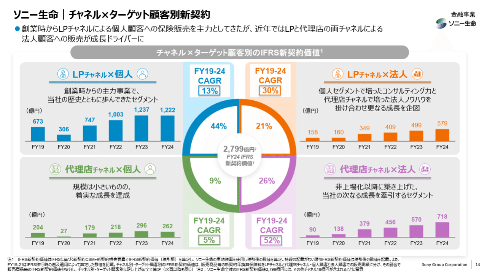
> 引用元：[> ソニーグループ(株) 金融 Investor Day 金融分野(説明資料)](https://www.sony.com/ja/SonyInfo/IR/library/presen/irday/pdf/2025/FinancialServices.pdf)

*https://www.sonyfg.co.jp/ja/ir/library/management_vision/*

パワポのレイアウトの特徴として、スライドを４分割していることがことが挙げられますが、**４つの関係性がわかりやすいように、真ん中に円を置いて説明するデザイン**になっています。パワーポイントの背景色は白色とし、４つの項目については背景色をグレーにすることで、４分割のレイアウトのパワポであることがわかりやすいような工夫もされていますね。

またこのスライドが見やすい理由の一つに、**棒グラフのスケールを合わせている点**が挙げられます。パワーポイントをセグメントや事業で４分割するレイアウトの場合、棒グラフのスケールをそろえておくと、読み手がそれぞれの比較をしやすい、わかりやすいレイアウトのパワポになりますよ。

### 写真３枚の見やすいパワポレイアウト例

最後はパワーポイントを３分割して写真を３枚使うレイアウトの例として、株式会社Arentのスライドのレイアウト例を見ていきましょう。
2025年6月期決算説明資料のパワーポイント資料です。

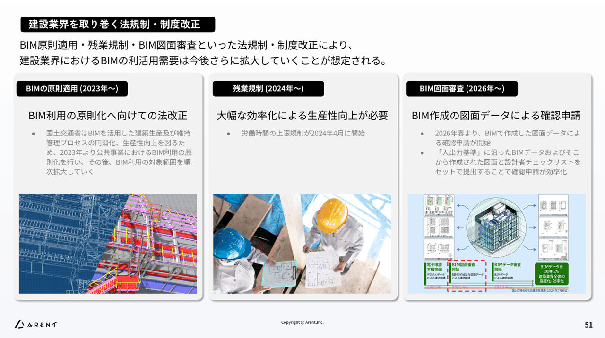
> 引用元：[> 2025年6月期決算説明資料](https://ssl4.eir-parts.net/doc/5254/tdnet/2669039/00.pdf)

*https://arent.co.jp/ir/library/presentation/*

パワポのレイアウトの特徴として、スライドを３つに均等に分割し、それぞれに同じサイズの３枚の写真を入れていることが挙げられます。３枚の写真についてはオセロの盤面のように交互に並べるレイアウトのパワポもありますが、かなり上級者向けなので、**まずはきちんと上下をそろえて均等な間隔で並べるのが大切**です。

また３枚の写真を並べるパワポのレイアウトにおいては、**３枚の写真の位置以上に、写真ごとのタイトルあるいはテキストが重要**です。このスライドでは、タイトルとメインメッセージと補足テキストのサイズや位置関係が３つの写真でそろっており、見やすいパワポのレイアウトになっている点も覚えておきましょう。

## パワポのレイアウトの編集におけるポイント

ここまで９種類の様々なパワポのレイアウトを見てきましたが、最後にパワーポイントにおけるレイアウトの編集方法のポイントを説明していきます。

### ガイドやグリッドを有効活用する

見やすいパワポのレイアウトに編集する上でまず大切なのが、ボディを均等に分割することです。パワーポイントを左右に２分割や３分割する場合でも、２×２の４分割にする場合でも、まずは均等に分割すれば、見やすいレイアウトになります。そこで活躍するのが、表示の機能にある、グリッド線とガイドの機能です。

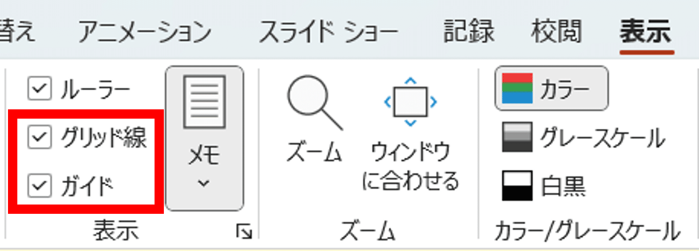
*パワーポイントのグリッド線とガイドの機能*

*グリッド線の入ったパワーポイント*

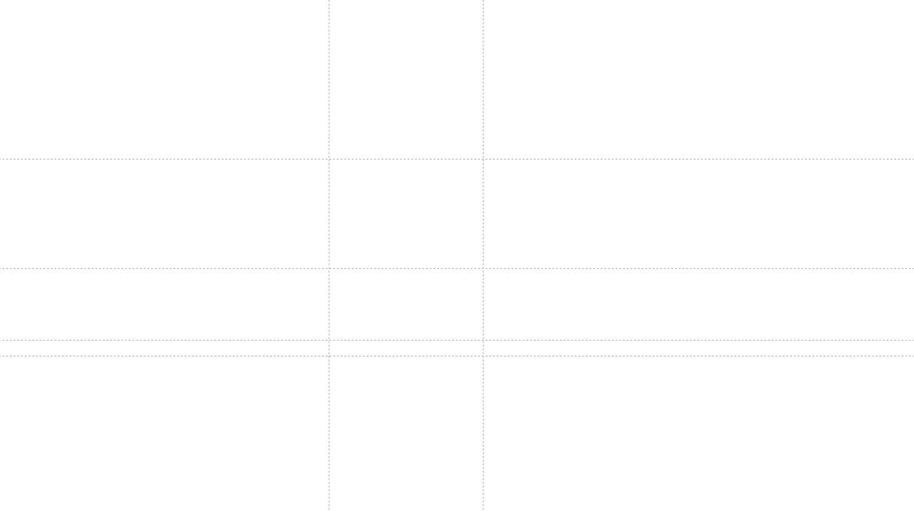

*ガイド線の入ったパワーポイントガイド線は自由に移動可能*

グリッド線はスライド紙面を等間隔に切り分けてくれる機能で、パワーポイントを方眼紙のようにしてくれるので、レイアウトを作る際には必須です。もちろん実際のパワポ上にはグリッド線は出てきません。
ガイド線も同様に目盛りとなる機能ですが、こちらは自分で位置を動かせるので、等間隔でないパワポのレイアウトを作りたい場合などに重宝します。

### パワポのレイアウトを自動で変更する

ここからはパワポのレイアウトの機能について説明していきます。
まずはパワーポイントの標準機能を使ったレイアウトの変更から。

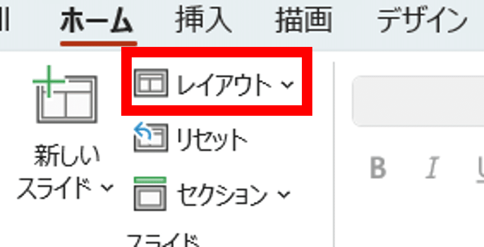
*パワーポイントのレイアウト機能*

ご存じの方も多いかもしれませんが、パワーポイントには標準のレイアウトがいくつか入っています。新しいスライドを作る際に、このホームタブのレイアウトの機能を使えば、登録されているレイアウトを自動で呼び出せるわけですね。

### パワポのレイアウトを追加する

上で説明した、自動でレイアウトを変更できるパワーポイントの機能ですが、実はレイアウトのテンプレートを追加することが可能です。

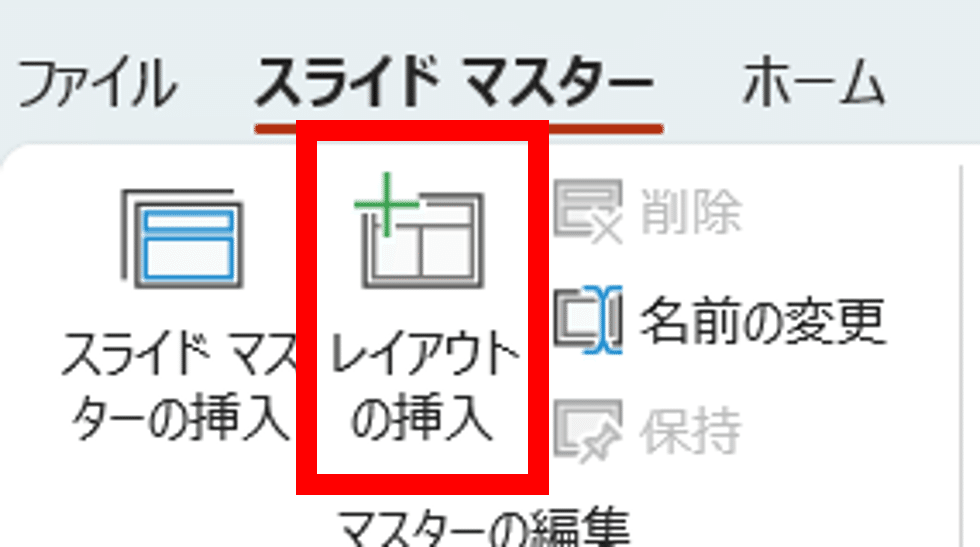
*スライドマスターのレイアウトの挿入機能*

スライドマスターを開き、その中のレイアウトの挿入の機能を選べば、スライドマスター中にスライドが追加され、レイアウトのテンプレートを追加することができるようになります。

ただ実際のところ、例えば４分割のパワーポイントのレイアウトを用意しておいても、実際は作るスライドごとに微調整が必要になってきます。そうなるとスライドマスターのレイアウト機能を用意しておくよりも、**そのままコピーして使えるレイアウトのスライドを複数持っておく方が効率的**かもしれませんね。

## 【マネしたい】おしゃれなパワポのスライド「レイアウト」９選まとめ

今回はパワーポイントのレイアウトに絞って、おしゃれなパワポのレイアウト例や、見やすいパワポのレイアウト例、わかりやすいパワポのレイアウト例などを見てきました。
パワポのレイアウトについては、**やはりどれだけのスライドを頭の中にストックしているか、もっといえばそのままコピーして使えるパワーポイントのレイアウトのスライドをどれだけ持っているかが重要**です。パワポ研のオリジナルテンプレートには、そのままコピーして使えるレイアウトのテンプレートがたくさん入っているので、気になる方は見てみてくださいね。

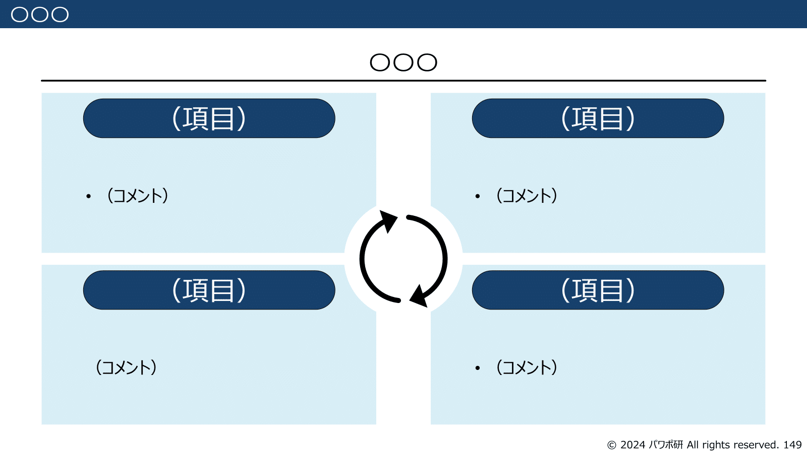
*パワポ研オリジナルテンプレートの４分割レイアウトスライド例１*

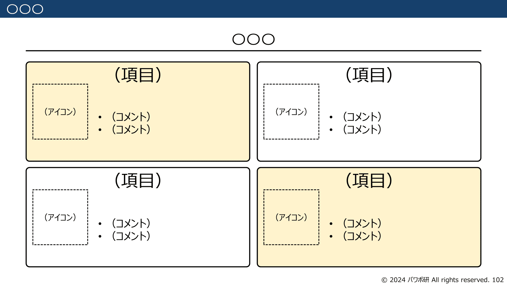
*パワポ研オリジナルテンプレートの４分割レイアウトスライド例２*

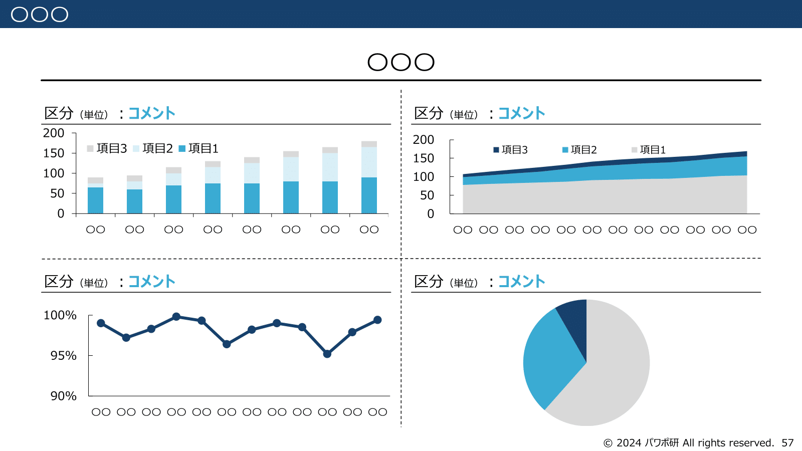
*パワポ研オリジナルテンプレートの４分割レイアウトスライド例３*

## パワポ研オリジナルテンプレート

パワポ研では、「ビジネスシーンで使える」パワーポイントテンプレートを公開しております。デザインを整えるのみならず、**ロジックやストーリーを整理するのにも役立つパッケージ**になっておりますので、関心のある方は下記ページも併せてご覧ください！

上記の記事のように、noteでは**フォローしているだけでビジネスにおける「資料作成のコツ」と「デザインのセンス」が身に付くアカウント**を目指して情報配信を行っています。
今後もコンスタントに記事を配信していく予定なので、関心のある方は是非アカウントのフォローをお願いします！

**> Template販売　**[> https://powerpointjp.stores.jp/](https://powerpointjp.stores.jp/%EF%BF%BCnote)
**> note　**[> パワポ研の資料作成術](https://note.com/powerpoint_jp/m/mc291407396da)
**> X（旧Twitter)　**[> https://twitter.com/powerpoint_jp](https://twitter.com/powerpoint_jp)

## レックスアドバイザーズからのお知らせ

パワポ研は株式会社レックスアドバイザーズが運営しています。
レックスアドバイザーズは**経営企画職や経営管理職に特化した転職エージェント**です。
上場企業や上場準備企業を中心に、**経営企画、IR、経理財務、法務、内部監査等の職種の求人**をご紹介しているほか、**CFOなどのコンフィデンシャル求人**もご紹介可能です。
またコンサルティングファームや監査法人、会計事務所の求人も豊富にあるため、プロフェッショナルファームを目指す方のご支援も得意です。
求人紹介やキャリア相談を希望の方は、[**無料転職サポート**](https://www.career-adv.jp/job_search/entryform_exp/)よりサービス利用登録をしてみてください。

*レックスアドバイザーズのサービスサイトはこちらから*

**> 求人をご希望の方　**[> 無料転職サポート](https://www.career-adv.jp/job_search/entryform_exp/)**
> 採用支援をご希望の方　**[> 採用サポート](https://www.career-adv.jp/request3/)
**> その他　**[> お問い合わせフォーム](https://www.rex-adv.co.jp/contact)
**> 書籍　**[> 注目企業の実例から学ぶパワポ作成術](https://www.amazon.co.jp/dp/4046060476)

