# 【マネしたい】カッコいいパワポの「赤色」プレゼン３選

[note原文](https://note.com/powerpoint_jp/n/n830659eba076)

みなさんこんにちは。
資料デザインのリサーチや分析に取り組むパワーポイントのスペシャリスト、パワポ研です。

今回は、**赤系のパワポに焦点を当て、上場企業のIR資料から参考になりそうな抜粋して紹介**していきます。カラーコードについても記載していきますので、赤色を使った配色について、パワポ作成の参考になれば幸いです。

【マネしたい】シリーズのまとめ記事はこちら。

では早速行きましょう！

## 赤文字や赤枠を基調としたスライド見本

まずは株式会社資生堂のパワーポイントを見ていきましょう。全体的に白色の背景に赤色のグラデーションを合わせたデザインですが、**パワポ全体を通して赤文字のテキストや赤枠で囲むデザインを使用したスライドが多い**のが特徴です。

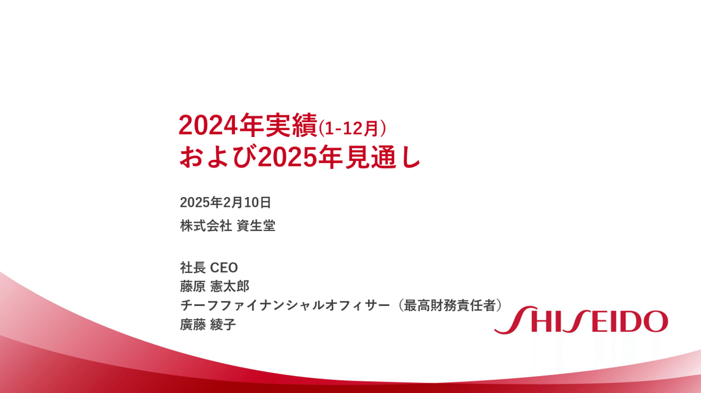
*株式会社資生堂のプレゼンテーション資料*

> 引用元：[> 決算説明資料](https://corp.shiseido.com/jp/ir/pdf/ir20250210_162.pdf)

*https://corp.shiseido.com/jp/ir/library/tanshin/*

- 赤背景の色：カラーコード#c70420、rgb（199,4,32）

- 赤文字の色：カラーコード#d03549、rgb（208,53,73）

- ピンク色：カラーコード#ffebeb、rgb（255,235,235）

- 薄いピンク色：カラーコード#fff7f7、rgb（255,247,247）

### 赤文字を基調とするデザイン

資生堂社のパワポの特徴として、**スライドタイトルやメインメッセージは基本的に赤色の文字**となっています。赤は比較的強い色なので、ピンポイントで使われることが多いのですが、資生堂社は、赤文字を多用しながらもスライドの調和を取ることに成功しています。

ポイントとしては、**赤色と相性のいい白色以外は基本使わず**、使う場合も薄い赤やピンクなど同系色のグラデーションを最小限使うにとどめていることです。

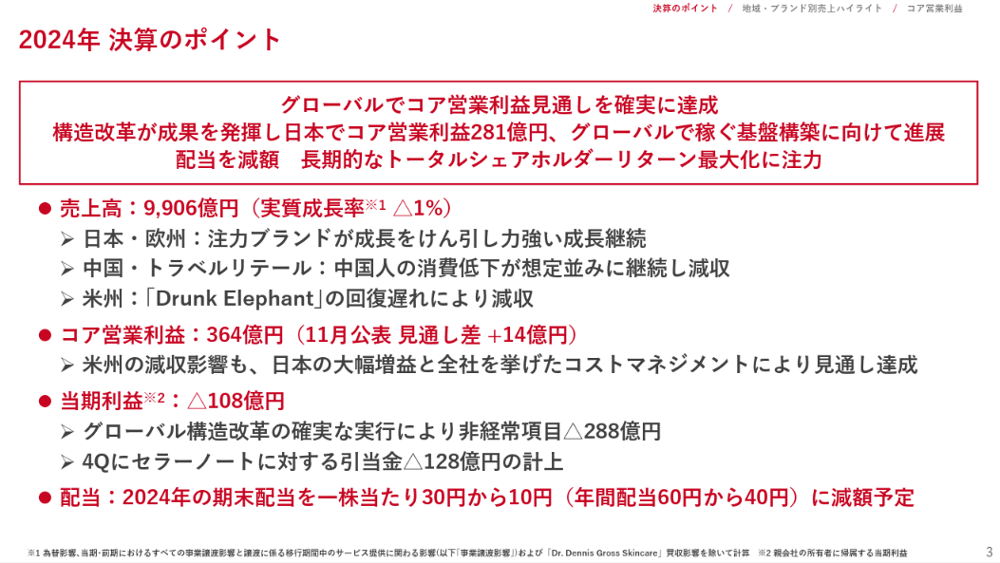

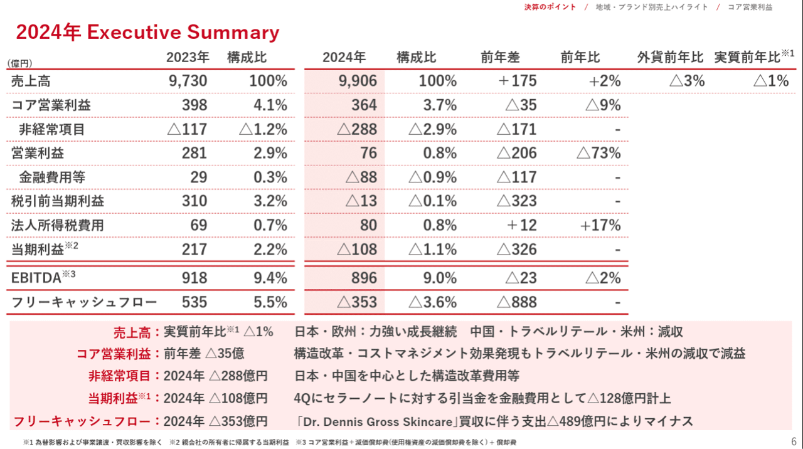

### 赤枠で囲むことでパワポを構造化

資生堂社の次の特徴が、パワポ全体を通して、**赤枠でテキストや表を囲むことで構造化している**スライドが多いことです。これまで見てきたようにトップラインのメッセージは赤文字のテキストを赤枠で囲っていますし、数値や表についても、赤枠や赤線を多用しています。

テキストの色同様、赤色は比較的強い色のため、パワポにおいて赤枠で囲む場合は、何かを強調することが多いです。しかしながら資生堂では、赤枠の太さなども工夫することで、プレゼンテーション全体を通して違和感なく赤枠を多用しています。

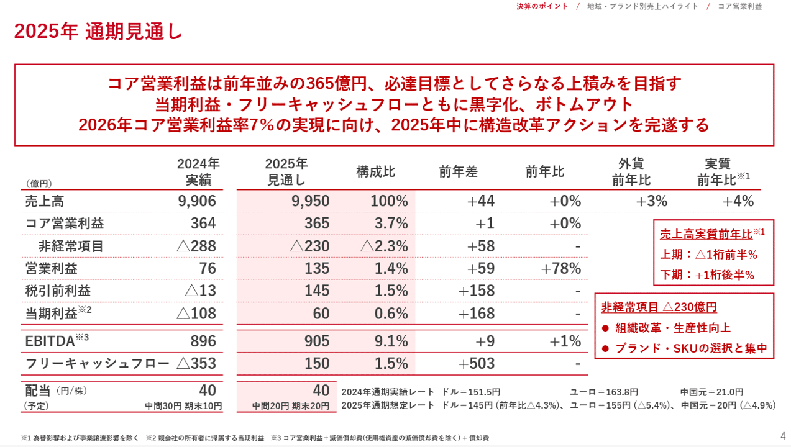

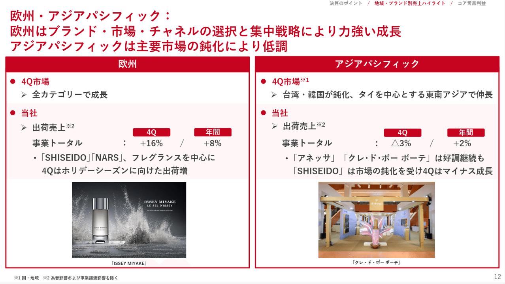
スライドのボディである、欧州とアジアパシフィックを分けるために赤枠を使っています。メッセージまで赤枠で囲むとうるさいデザインになってしまいますが、この辺りはパワポ全体を通してバランスよく設計されています。

### 背景色は薄めの色でデザイン

赤文字を多用しているため、パワーポイント全体を通じて背景色は白が多いのですが、一部のスライドでは背景色を入れています。
そうしたスライドにおいては、**薄い色でかつ赤色と相性のいい色を使うことで、赤文字と合わせてもうるさくならず調和したデザイン**となっています。

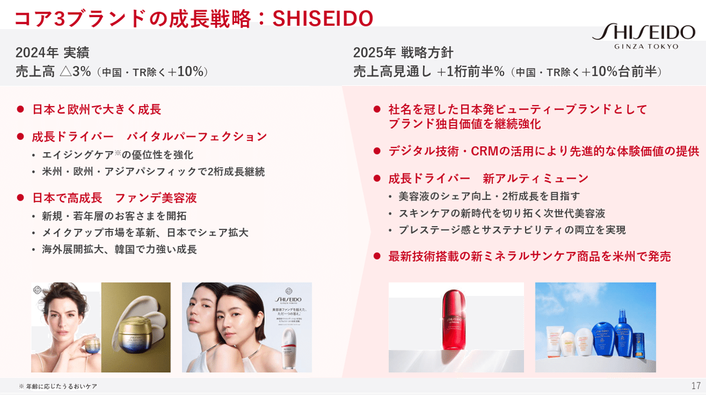
薄い赤色やピンク色であれば、赤文字と合わせても何ら問題はありません。パワポ全体を通して、白の次に使われている色がピンクです。

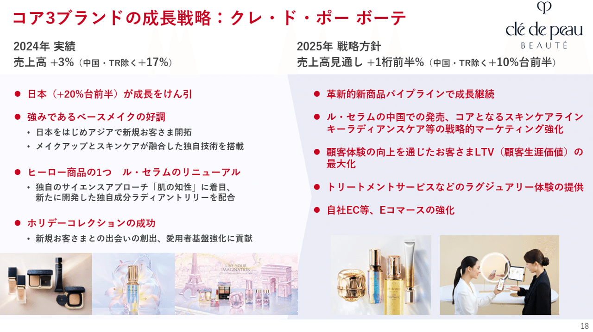
青系もグレーに近い暗めの色であれば、赤色との相性はよいです。コア３ブランドですべて同じ背景色だと少し退屈なので、スライドごとに若干背景色を変えるという工夫をしています。

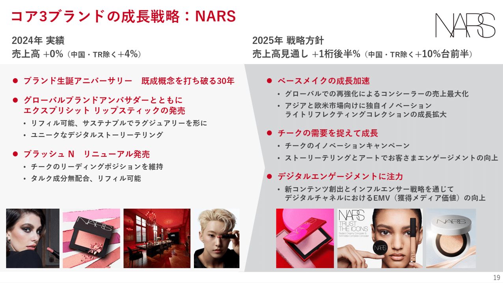
３枚目はグレーなのでもちろん赤との相性は抜群です。グレーであれば少し濃い目でも赤と合わせられるので、左右でグラデーション的に見せる上ではベストチョイスといえますね。

## 赤色とえんじ色のシックなスライド見本

つづいては株式会社みらいワークスのパワーポイントを見ていきましょう。みらいワークス社の特徴は、**赤の中でもえんじ色に近い暗めの色を使うことでシックな仕上がりのパワポ**になっている点です。
えんじ色は赤の中では比較的使いやすい色で、多用してもそこまでうるさくならないので、デザインの参考になりますね。

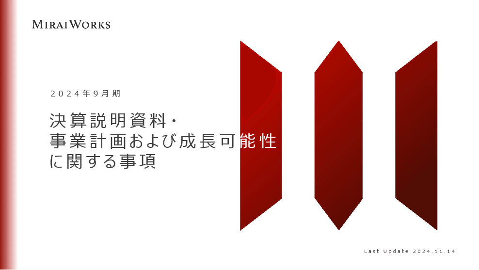
> 引用元：[> 決算説明資料・事業計画および成長可能性に関する事項](https://contents.xj-storage.jp/xcontents/AS08217/d6963452/a5bc/4dd1/9d33/aceb1b8535a1/140120241113522609.pdf)

*https://mirai-works.co.jp/ir/presentations/*

- えんじ色：カラーコード#8d0e05、rgb（141,14,5）

- 薄い赤色：カラーコード#d4a5a2、rgb（212,165,162）

- ピンク色：カラーコード#ddb7b4、rgb（221,183,180）

### えんじ色の落ち着いたデザイン

みらいワークス社のパワポは、表ベースやテキストベース、グラフなどを問わず、えんじ色に近い濃い赤色が基調の配色となっています。
スライドタイトルにせよ表のタイトルにせよ、**全体がぐっと引き締まっており**、えんじ色がプレゼンテーション向きであることがわかります。

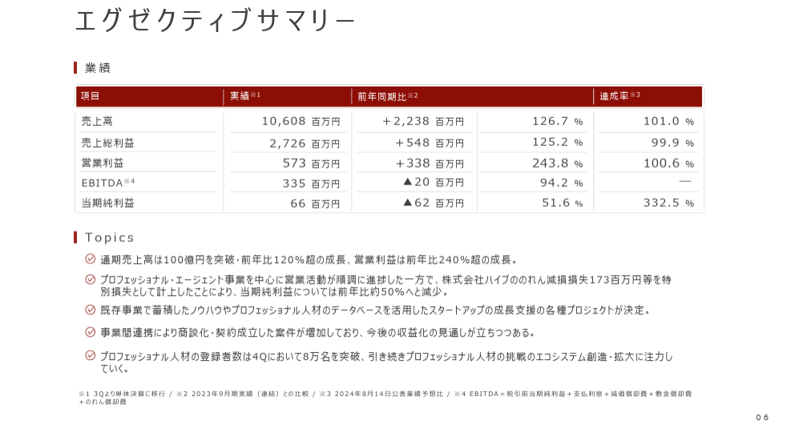

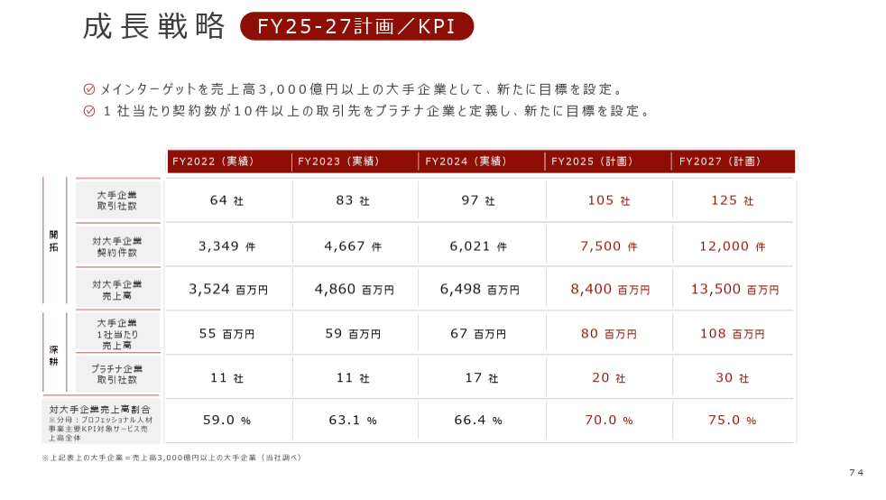
成長戦略のスライドでは、灰色と濃い赤色の配色になっていますが、赤とグレーは相性がいいので、とても見やすいです。パワーポイント全体を通して、落ち着いた見やすい資料が多いですね。

### グレーに赤線の配色のパワポデザイン

上のスライドでもグレーと濃い赤の配色は相性がいいという話をしましたが、**グレーの背景と赤線はとても相性がいい**です。背景色を使いたいが特にこだわりがない場合はグレーを使うのがよいですね。

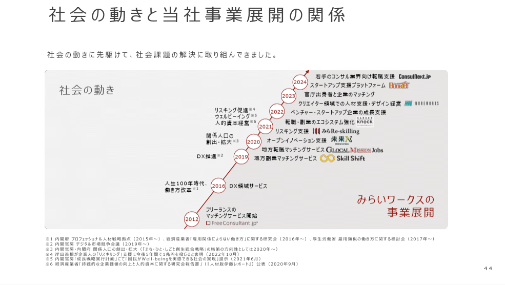
沿革のスライドでは、社会の動きとみらいワークス社の事業展開を左右に分けていますが、斜めの赤線を境にグレーの濃さを変えており、非常にスタイリッシュなデザインとなっています。

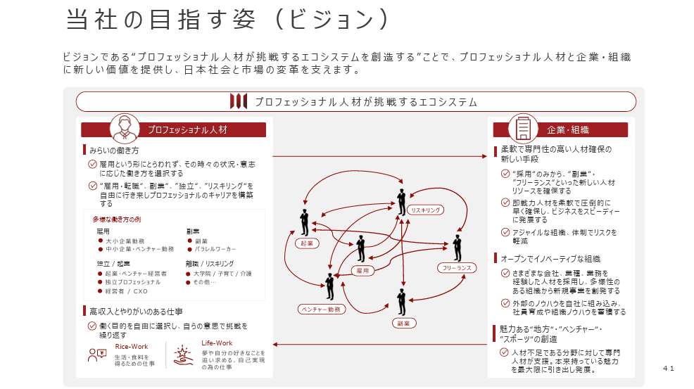
ビジョンのスライドは、やや文字が多く、また赤線が複雑に絡み合っていて、ややもすると見づらくなりそうですが、**白と灰色の使い分けや構造化を通じて、見やすいデザイン**になっています。みらいワークス社は情報量の多いスライドが多いですが、濃い赤とグレーの配色のうまさでパワーポイント全体を見やすく仕上げています。

### 赤とピンクのグラデーションのデザイン

みらいワークス社のスライドのその他の特徴として、**グレー以外で色を入れる際にはピンク寄りのグラデーション**を使っています。

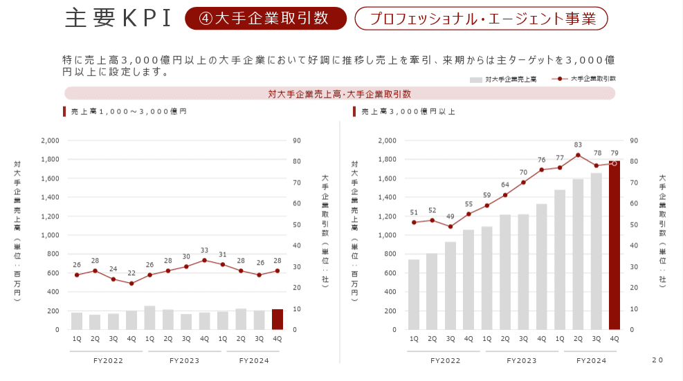
主要KPIのスライドでは、KPIの横にえんじ色でタグをつけており、またグラフの最新数値もえんじ色にしているため、**グラフタイトルまでえんじ色にすると単調になってしまい**ます。そこでグラフタイトルはピンクの背景に濃い赤のテキストという配色を選んでいます。

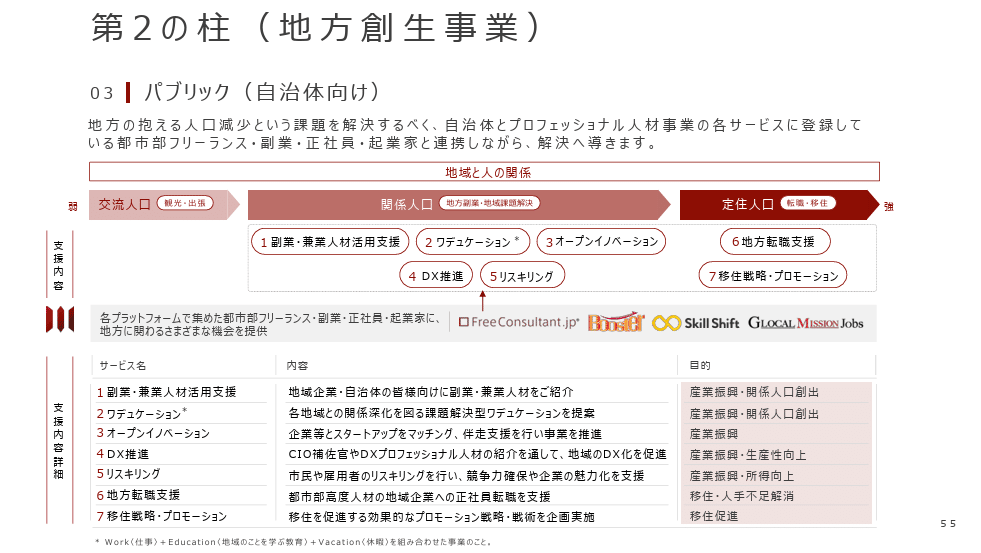
また時系列に合わせてグラデーションを見せたいスライドにおいても、濃い赤色だけで構成するのは至難の業です。明るい赤に寄せてしまうとシックな印象が崩れてしまうので、ここでもピンク色に濃い赤や、濃い目のピンクに白文字という配色を選んでいます。

## 明るい赤で勢いを見せるスライド見本

最後は株式会社メンバーズのパワーピントを見ていきましょう。メンバーズのスライドの特徴は、**赤の中でも比較的明るめの赤を使うことで、パワポ全体に勢いや元気さを表現している点**です。

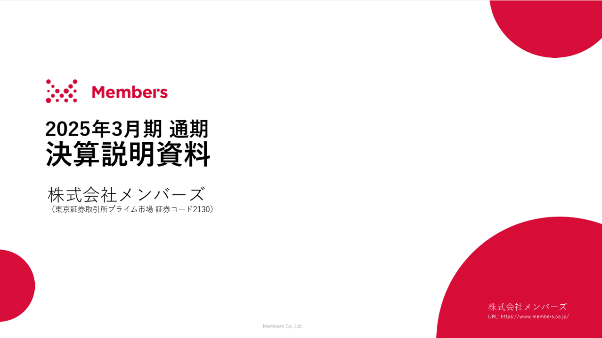
> 引用元：[**> 2025年３月期 決算説明資料**](https://ssl4.eir-parts.net/doc/2130/tdnet/2614245/00.pdf)

*https://www.members.co.jp/ir/library/presentation*

- 赤色：カラーコード#d70e3a、rgb（215,14,58）

- 濃いピンク色：カラーコード#ff4e7d、rgb（255,78,125）

- ピンク色：カラーコード#ff84a6、rgb（255,132,166）

- 薄いピンク色：カラーコード#ffc4d3、rgb（255,196,211）

### 赤文字や赤枠で明るい印象のデザイン

メンバーズ社のスライドも、資生堂社と同様に赤枠と赤文字もを多く使うデザインですが、**よりピンクに近い明るい色を使っている点や、テキスト量が多い点が特徴**です。
一方で、テキスト量の多さに対してそこまで読みづらくはなっておらず、**文字間の空白の使い方やフォント、黒文字と赤文字の使い分けなどのうまさ**が目立ちます。

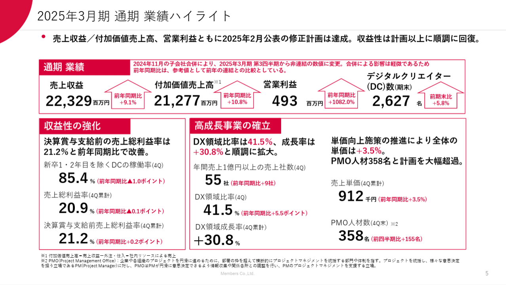

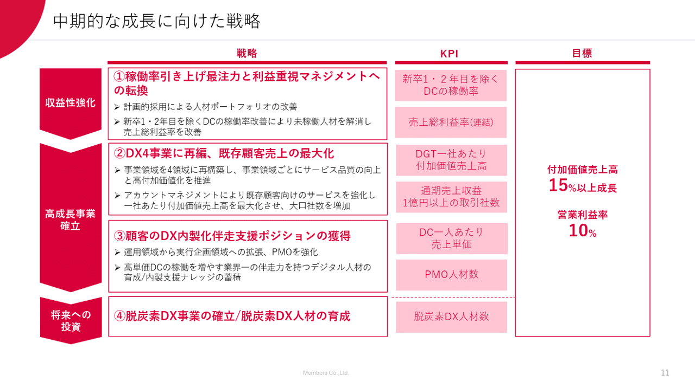

### 赤枠での強調は控えめなデザイン

これまでも何度か説明してきた通り、パワポにおいて赤枠で囲うデザインは、何かを強調するときに使われますが、メンバーズ社においてはそういった使い方もしています。
しかしながら、**太めの赤枠で囲うデザインはかなり圧が強くなることもあり、メンバーズ社は割と細めの枠を使って**います。

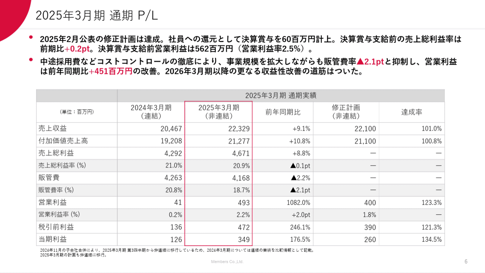

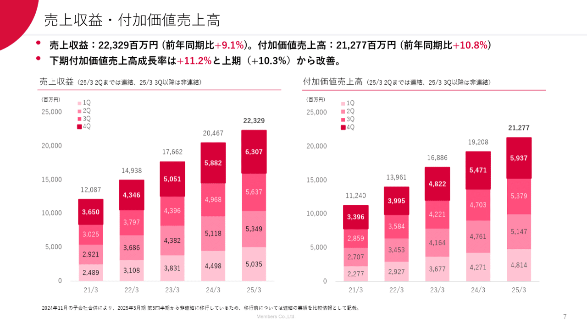
グラデーションでクオーターごとの売上や付加価値額を見せているグラフです。このグラフの４Qの部分ですが、よく見ると１Qから３Qに比べて少し大きくなっており、実は赤枠で囲われているのがわかります。

### タイトルに赤の下線を合わせるデザイン

メンバーズ社のデザインのその他の特徴として、スライドのボディにおけるタイトルの下に赤の下線を引くというものがあります。
ボディタイトルは、**みらいワークス社で見たような赤背景に白抜きのものか、メンバーズ社のように黒文字に赤の下線というパターン**がありますね。

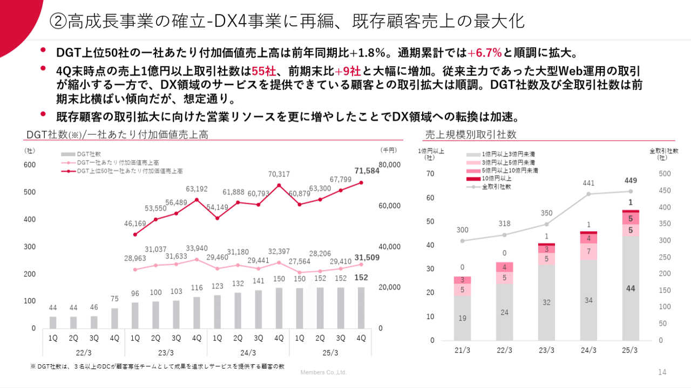

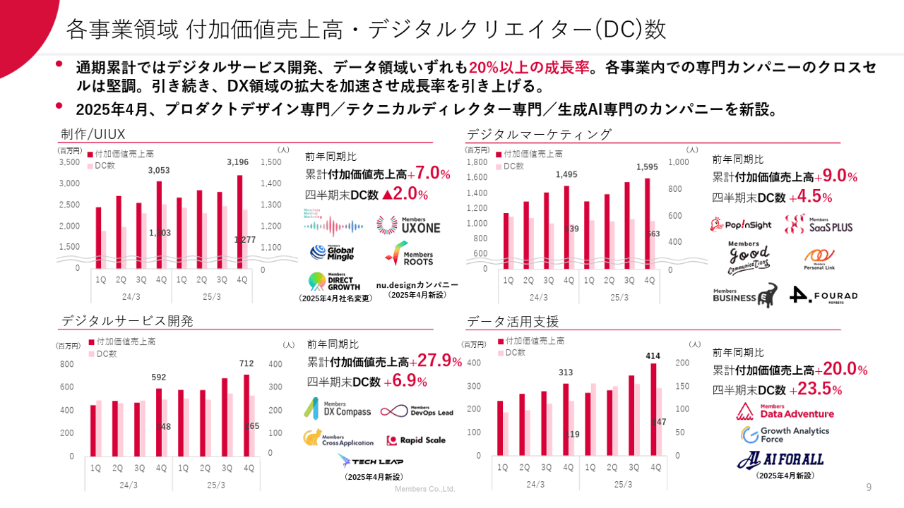
情報量が多い中で、**ボディのグラフタイトルの下に赤の下線を入れることで、スライドの構造が見やすく**なっています。下線が黒だと全体的にゴテゴテしたデザインになってしまうので、細い赤の下線を使うのは効果的といえますね。

## 【マネしたい】カッコいいパワポの「赤色」スライド３選まとめ

いかがでしたでしょうか。赤色といっても、えんじ色のような濃い赤からピンクに近い明るい赤まで、**様々な赤色によって、パワポの印象も大きく変わる**ことが伝わったのではないかと思います。
一方で、グレーや暗めの色と赤の配色であれば基本的に合うということ、赤色の文字や赤枠で囲むデザインもすっきりと使いうることもわかりました。

赤のような比較的強めの色はデザイン一つで毒にも薬にもなりますので、使いたい場合は是非自社のパワーポイントに合う赤のデザインを探してみてくださいね。

## パワポ研オリジナルテンプレート

パワポ研では「ビジネスシーンで使える」パワーポイントテンプレートを公開しております。デザインを整えるのみならず、**ロジックやストーリーを整理するのにも役立つパッケージ**になっておりますので、関心のある方は下記ページも併せてご覧ください！

上記の記事のように、noteでは**フォローしているだけでビジネスにおける「資料作成のコツ」と「デザインのセンス」が身に付くアカウント**を目指して情報配信を行っています。
今後もコンスタントに記事を配信していく予定なので、関心のある方は是非アカウントのフォローをお願いします！

**> Template販売　**[> https://powerpointjp.stores.jp/](https://powerpointjp.stores.jp/%EF%BF%BCnote)
**> note　**[> パワポ研の資料作成術](https://note.com/powerpoint_jp/m/mc291407396da)
**> X（旧Twitter)　**[> https://twitter.com/powerpoint_jp](https://twitter.com/powerpoint_jp)

## レックスアドバイザーズからのお知らせ

パワポ研は株式会社レックスアドバイザーズが運営しています。
レックスアドバイザーズは**経営企画職や経営管理職に特化した転職エージェント**です。
上場企業や上場準備企業を中心に、**経営企画、IR、経理財務、法務、内部監査等の職種の求人**をご紹介しているほか、**CFOなどのコンフィデンシャル求人**もご紹介可能です。
またコンサルティングファームや監査法人、会計事務所の求人も豊富にあるため、プロフェッショナルファームを目指す方のご支援も得意です。
求人紹介やキャリア相談を希望の方は、[**無料転職サポート**](https://www.career-adv.jp/job_search/entryform_exp/)よりサービス利用登録をしてみてください。

**> 求人をご希望の方　**[> 無料転職サポート](https://www.career-adv.jp/job_search/entryform_exp/)**
> 採用支援をご希望の方　**[> 採用サポート](https://www.career-adv.jp/request3/)
**> その他　**[> お問い合わせフォーム](https://www.rex-adv.co.jp/contact)
**> 書籍　**[> 注目企業の実例から学ぶパワポ作成術](https://www.amazon.co.jp/dp/4046060476)

