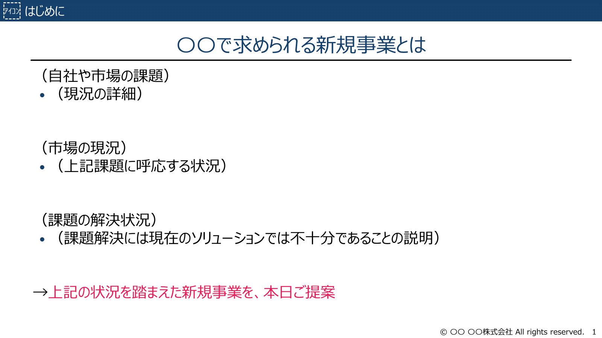
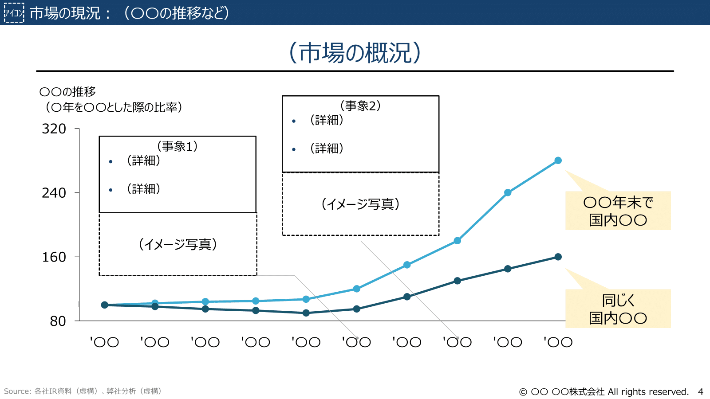
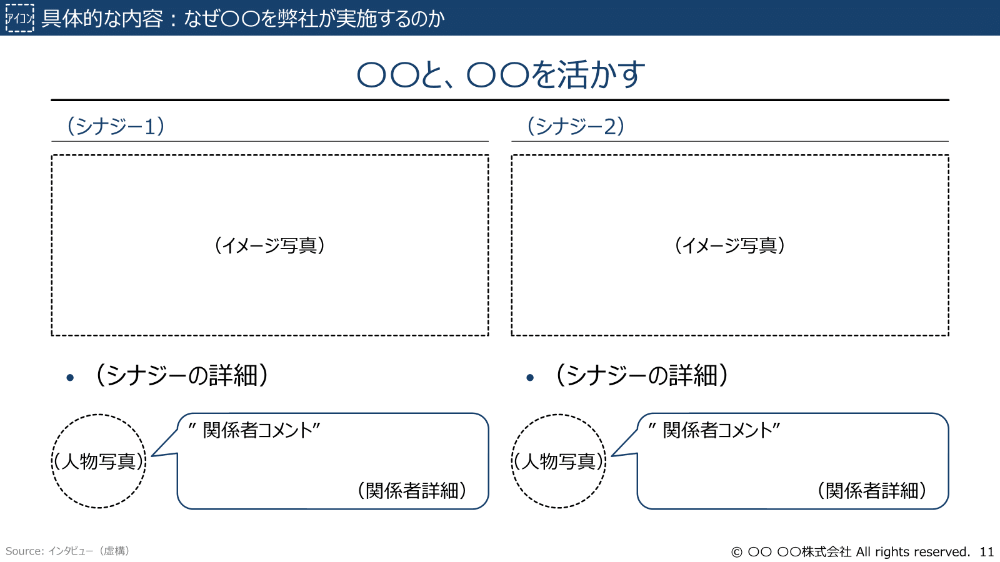
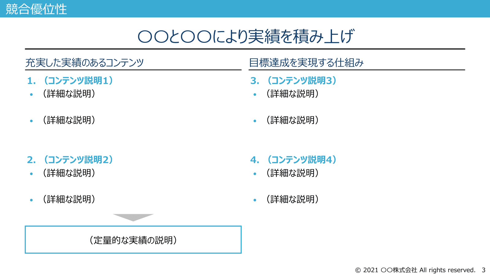
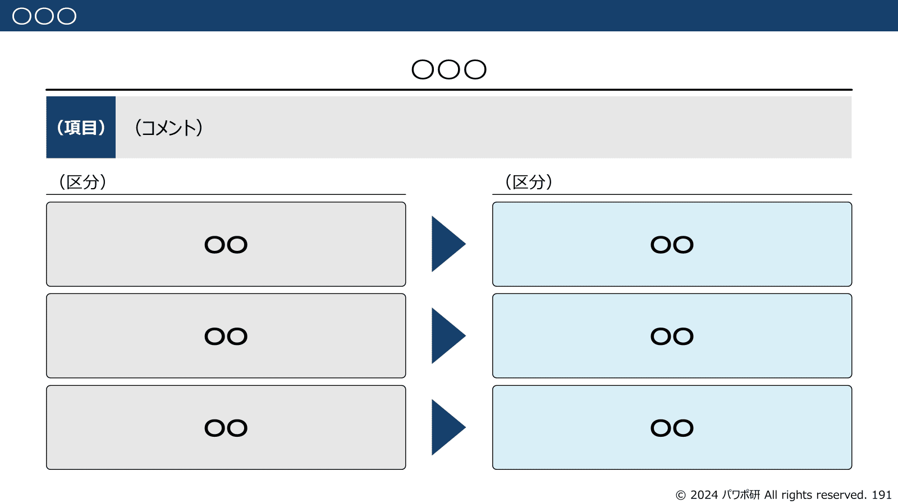
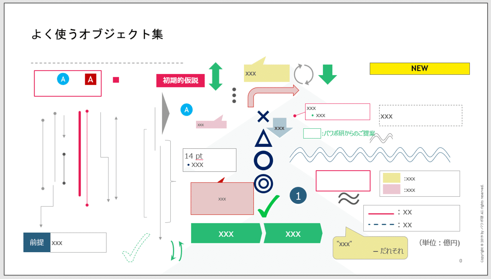
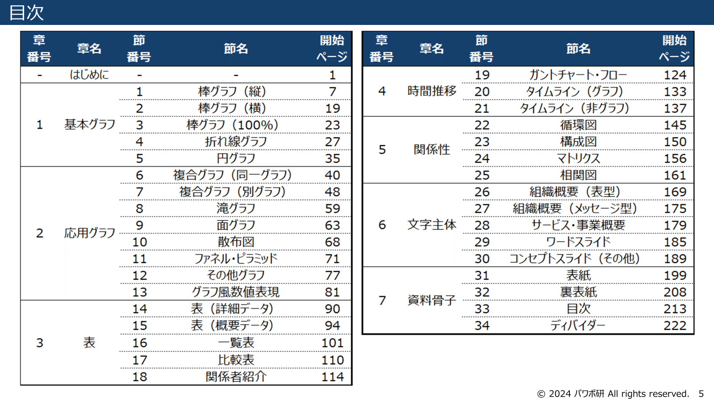
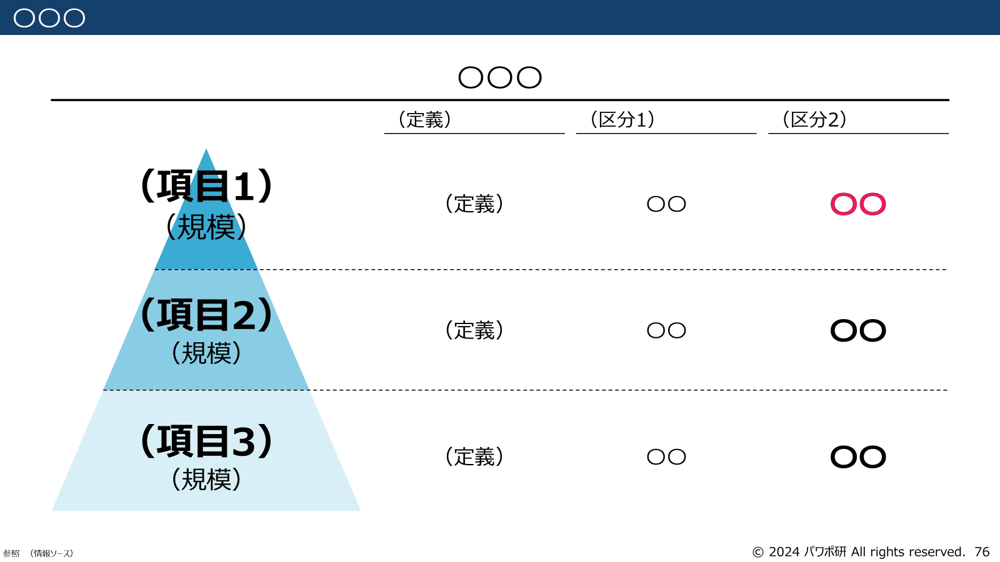
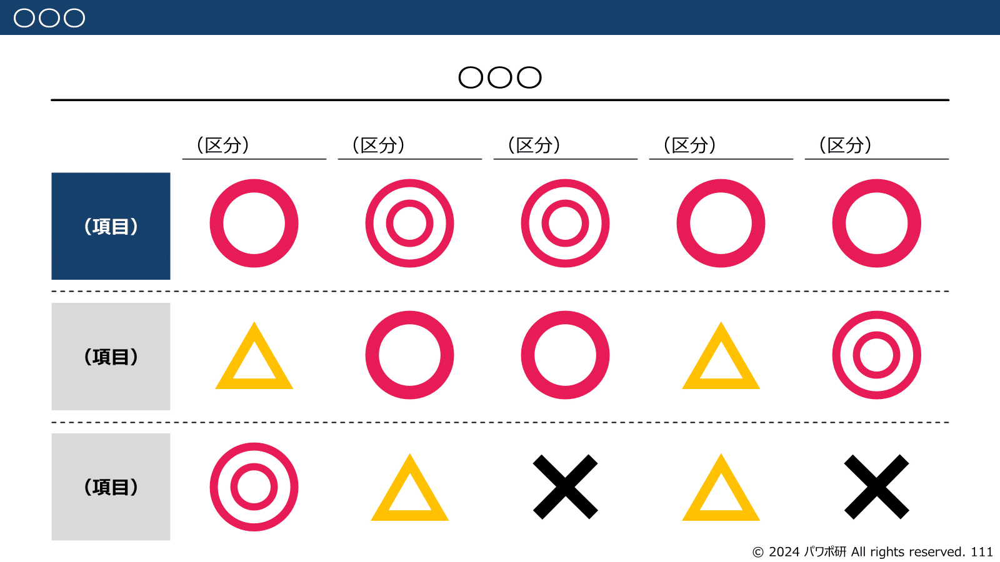
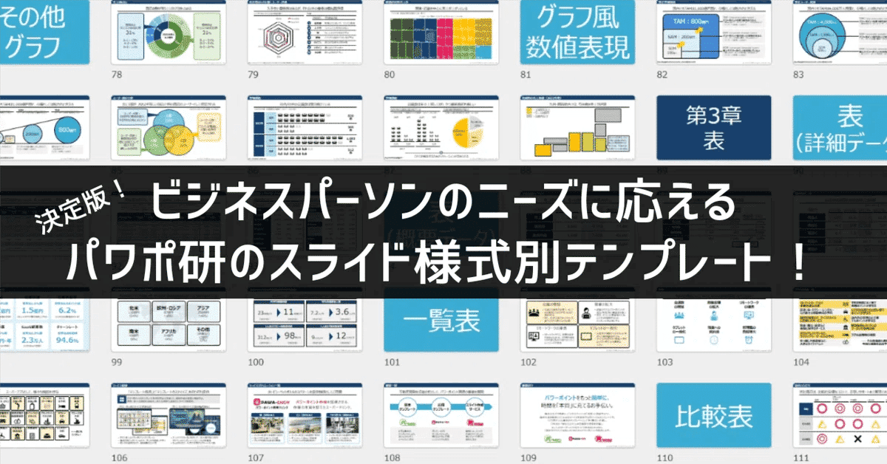

# もしも「一時間でプレゼン資料を作れ」と無茶振りされたら

[note原文](https://note.com/powerpoint_jp/n/n84385006b453)

みなさん、こんにちは。
資料デザインのリサーチや分析に取り組むパワーポイントのスペシャリスト、パワポ研です。

今日は上司から急に**「一時間でプレゼン資料を作れ」**と言われた時に取るべき対処法を、具体的な作業フローや時間配分、スライドを示しながら解説していきます。

状況としてはこんな感じでしょうか。

> 「ミーティングお疲れ様。今のM&A仲介が持ってきた推し活アプリの案件、思っていたより面白いかもね。スピード勝負になりそうだから、この後の役員とのミーティングで頭出ししときたいな。１時間後なんだけど、もし時間あるなら、対象企業の市場環境に関する簡単な説明資料を作っておいてくれないかな？出来る範囲で構わないからさ。よろしく頼むね。」

……ずいぶんな無茶振りですね。とはいえ面白そうな案件であれば、ここでひと踏ん張りして、プロジェクトチームへの参加を狙いたいところです。

今回は推し活アプリ事業を題材に、推し活アプリ市場に関する社内プレゼン資料を一時間で作成するケースを想定し、その具体的な対処法について解説していきます。まず状況を整理すると、こんな感じでしょうか。

- 市場に関しては、M&A仲介会社がざっくりとは説明してくれているが、情報としては不十分かつ、情報の裏取りも必要な状況

- M&A仲介会社とのMTG後、上司とはほとんど話せておらず、上司が何を魅力に感じているかは、推測するしかない

- 役員は細かいディテールには興味がなく、買収する意義と、のれん償却後に利益が出るかどうかの２点を気にしている

- 役員は対象市場については全く分かっていない

つまり役員とのMTGのゴールとしては、「役員に事業そのものの魅力を伝える」「買収の意義を伝える」、部長から与えられたミッションとしては、「役員に事業の魅力を伝えるために、市場環境についてわかりやすくまとめる」ということになります。

## １時間で資料を完成させるための３ステップ

資料作成にあたっては、大きく３つのステップで考えることが必要です。
これは１時間で資料を作成する場合に限った話ではないのですが、時間に制約がある場合はより強く意識する必要があります。

- 最低限必要な要素と加点要素を定義する

- ストーリーラインを作成する

- 情報を収集して資料に落とす

１つ目のステップが、最低限必要な要素と、加点要素を区別することです。１時間で資料作成をする上では、よほど自信がない限り、１００点を目指すのは得策ではないです。コンサルティングファームでは、「MUSTとNice to haveを区別せよ」みたいなことをよく言います。

２つ目のステップが、資料を通じて何を伝えるのか、どのようなストーリーで伝えるのかを決めることです。もちろん情報収集する中でストーリーが変更になることはありますが、それも含めてまずストーリーを作ります。仮説思考というやつですね。コンサルティングファームでは、ボディがないメッセージだけのパワポを「空パック」なんて呼びます。

*パワポ研オリジナルテンプレート「新規事業」パッケージより空パックのイメージ*

ここまで来て初めて、３つ目のリサーチをして情報をパワーポイントに詰めていく作業が始まります。やりがちなミスとして、リサーチから始めてしまうというのがありますが、何を伝えるのかを決めずにリサーチから入るのはとても危険です。情報だけ集まって、「結局何を言いたいんだっけ？」となってしまうのは、新卒コンサルタントにありがちな光景もあります。

ここで覚えておきたいのは、**人力で資料作成する場合でも、生成AIツールを使って資料作成する場合でも、この３ステップは不変**であることです。生成AIを使いこなすことで、３ステップ目の情報収集は格段に効率的になりますが、何を作るのか、何を伝えたいかはあくまで人間が考えることであり、その部分がずれるとアウトプットもおかしくなってしまうからです。

ではここからもう少し細かく見ていきましょう。

## 最低限の要素と加点要素を定義する（５分）

繰り返しになりますが、まず大事なことは、いきなり手を動かさないこと。急いてはことを仕損じるとはよく言ったもので、最初に「どこまでやれば合格か」「時間が余ったらやるべきことは何か」を決めましょう。

改めて、役員へのプレゼンの目的と、部長から与えられたミッションについて振り返ります。

- 役員とのMTGのゴールとしては、「役員に事業そのものの魅力を伝える」「買収の意義を伝える」

- 部長から与えられたミッションとしては、「役員に事業の魅力を伝えるために、市場環境についてわかりやすくまとめる」

合格点のラインとしては、時間内に言われたことをきちんとやり遂げることになるので、「推し活アプリの市場環境についてわかりやすくまとめる」ことになります。

*パワポ研オリジナルテンプレート「新規事業」パッケージより市場規模のスライド*

時間が余ったら、**「買収の意義」を伝えるスライドの作成や、見栄えの改良に時間を使ってもよいですが、特に１時間という限られた中では、見栄えは捨ててしまって問題ない**でしょう。また情報ソースなどに過度に気を配る必要もありません。あくまで1時間で作った社内資料なので、情報転載の許諾などは必要なく、参照元を簡単に記載する程度で良いでしょう。

*パワポ研オリジナルテンプレート「新規事業」パッケージよりシナジーのスライド*

次に合格点のラインである「推し活アプリの市場環境についてわかりやすくまとめる」ことを実現するには何が必要か？を考えます。そうすると、例えば３C分析のフレームワークで簡単にまとめればいいのではないか、といった形で整理ができるわけです。また時間があれば、SWOT分析なんか持たせるとなおよし、ただし必須ではないので一旦劣後、みたいな方針が固まるわけです。

## ストーリーラインを作成する（２０分）

メッセージだけを入れたスライド資料、通称空パック（からぱっく）と言われてもイメージが湧かない人も多いと思うので説明します。ちなみに、**この作業が最も大事かつ高度なので、ここが踏ん張りどころ**です。組織によっては、この空パックさせあれば話が通じてしまうところもあります。
時間配分は20分と書きましたが、AIの活用などで情報収集の時間を最小化できるならば、もう少しここに時間をかけてもよいと思います。

空パックを一言で言えば、「**発表資料のパッケージの体裁をなしているが、中身が詰まっていなもの**（＝実作業が残っているものの、それ以外は作成が完了しているもの）」となります。その実作業とは、次章の「中身詰め」になるので、それ以外の外形を整える作業が空パックの作成になります。

ストーリーラインの作成は大きく３つの作業に分かれます。

- 資料全体を通じて伝えたいメッセージを決める

- メッセージを伝えるための流れを決める

- 各スライドに入れる情報を決める

全体を通して何を伝えたいか、そのために各スライドをどのような順番で配置するか、また各スライドのメッセージを何にするか、各スライドのメッセージをサポートするファクトとして何を入れるか、という流れですね。

### 資料を通じて伝えたいメッセージを決める

最初にやるべきことは、「対象市場の市場環境に関する調査」の資料を通じて何を伝えたいか考えることです。役員との打ち合わせのゴールが「役員に事業そのものの魅力を伝える」であることを踏まえると、「市場が伸びている」「ユーザーニーズを解消できる良いポジションにいる」「競合に対するユニークな強みがある」といったことがポイントになりそうです。

*パワポ研オリジナルテンプレート「資金調達」パッケージより競合優位性のスライド*

もちろん、実際に調査してみないことには、どのようなメッセージになるかはわかりませんが、まずは仮説的に考えることが大切です。この場合、M&A仲介の説明や、M&A仲介からのプレゼン資料が参考になりそうです。
一旦、「推し活アプリ市場が伸びており」「当社は比較的最初のころから市場に参入しているため一定の顧客基盤がある」ことを伝えることにします。

### メッセージを伝えるための流れを決める

続いて、「推し活アプリ市場が伸びており」「当社は比較的最初のころから市場に参入しているため一定の顧客基盤がある」ことを説明するためのストーリーを作ります。最初に少し記載した、３Cの流れで問題なく整理できそうです。
市場に関しては、「推し活アプリ市場の市場レポート」などがあればよいですが、無い場合は、「推し活市場の伸び」「推し活におけるニーズ」「アプリ市場が盛り上がっている」みたいに３枚に分けて説明するわけです。

それができてきたら、各スライドにタイトルとメッセージを記載していく作業に移ります。中身が空っぽでメッセージだけ入った「空パック」の出来上がりです。今回のケースであれば以下の様な流れになりそうです。

- 推し活アプリ市場の市場規模と今後の展望（もしあれば）：推し活アプリ市場は急速に成長している

- 推し活市場の市場規模と今後の展望：推し活市場は急速に成長している

- 推し活ユーザーのニーズ：推し活ユーザーはイベントやメディア出演等のスケジュールを把握しやすいアプリを求めている

- 競争環境：推し活アプリ市場においては、サブセグメントが細かく分かれており、本サブセグメントはまだブルーオーシャン

- 自社の特徴：自社のアプリは、本サブセグメントにおいて優位な知見を有しており、デファクトを取れるポテンシャルを持っている

……などをざっと書き上げます。ポイントは、「**その知識が手に入りやすいか**（＝１時間で獲得できるか）」と「**ストーリーに対して意味があるか**」の二点です。いずれも、時間短縮に必要な観点です。前者は、企業に問い合わせして手に入れるような情報はこの段階では当然使えませんし、後者は時間がないのにそんな情報を詰め込んでいる余裕はありません。

### 各スライドの情報とフォーマットを決める

タイトルとメッセージさえ決まってしまえば、中身はほとんど決まったようなものです。ただし、実際に定量的なファクトが取れるかどうかによって、グラフのような形式にするのか、定性的な表などの形式にするのか、フォーマットが変わってきます。

*パワポ研オリジナルテンプレートの棒グラフのスライド*

*パワポ研オリジナルテンプレートの定性分析のスライド*

この後書いていく、スライドのパターンはおおよそ三つ程度に絞られます。

- １パネル型：大きな図（グラフなど）がスライドの全面を占有

- ２パネル型：左側に図、右側にその説明を記載。あるいは、メッセージを異なる二つの要素で支える場合などに活用

- ３パネル以上：並列で複数の要素を見せる場合や、推移や経過を示すフロー図などに活用

１時間という短い枠組みなら、この三つくらいを念頭にスライドのボディを考えていきます。１枚あたり１分くらいで構成しましょう。押さえるべき要素は二つしかなく、「**本当に情報がすぐとれそうか**（前回と同じ）」と「**そのフォーマットで情報が伝わりそうか**」です。特に後者については、イメージが湧かない場合はノートに手書きでスライドの概形を書くことも多いです。

## 情報を収集して資料に落とす（３５分）

中身の詰め方……実際のところ、先ほどの下準備で８割方終わったようなもので、あとはとにかくググって貼り付ける、これに尽きます。既にある資料で役立つものがあれば、どんどん画像貼り付けしていきましょう。
繰り返しになりますが、今の時代は情報収集や資料作成にどこまでAIを使えるかも重要なポイントですね。

- 検索して、コピー＆ペースト（画像貼り付けでOK）

- 文脈に合うように中身を修正（吹き出しでの補足でOK）

- 引用したソースを貼る

- メッセージをちゃんと支えているか確認する

唯一注意すべきなのは、**多少調べて情報がなさそうならそのスライドをあきらめるか、あるいはメッセージを変更する**こと。一枚に拘泥しているとすぐに１時間なんて終わってしまうので、別の方法を考えましょう。もし横に同僚がいれば、代替の情報収集は任せてしまってもOKです。この段階まで来れば、スライドライティングから情報収集まで、**他の人と分担が可能**となります（どんな情報を集めるべきか、きちんとラベルを貼っている前提）。

## １時間で資料を完成させるためのポイント

１時間に限らず、短時間で資料を完成させる上でのポイントは大きく２つあります。要はそのまま使えるものを事前にもっていくということです。

### 資料作成に使うパーツを用意しておく

パワーポイントのオブジェクトやスライドフォーマットを持っておきましょう。例えばですが「よく使うパーツ集.pptx」というものをデスクトップに配置するイメージです。具体的には、以下のようなオブジェクトを適当に置いておくパワーポイントです。

- テキストボックス：よく使うフォントや文字の大きさのもの

- タイトルやメッセージBOX：表題を記載するテキスト

- ハイライト用の「囲い」：赤の枠線や下地が赤のボックス

- いろいろな種類の矢印：太いものや三角のシンプルなものなど

- コメントの「吹き出し」：誰かが喋っている風のもの

- 番号やアルファベット：丸や四角で囲まれた文字

- 三点リーダー：「…」という「次に続く」という意味の図形

- ステッカー：「作業中」や「更新予定」など状況が分かるもの

- 〇×△オブジェクト：何かを評価するときに使う図形

*よく使うオブジェクト集のスライド*

パワポ研では、全184スライドに渡る、[テーマ別オリジナルテンプレート集](https://note.com/powerpoint_jp/n/n50d02ec3162f)も提供しておりますので、気になる方は以下ご覧ください。

*パワポ研のスライド様式別オリジナルテンプレートの全体像*

*パワポ研のスライド様式別オリジナルテンプレートのピラミッド図*

*パワポ研のスライド様式別オリジナルテンプレートの比較表*

*パワポ研のスライド様式別オリジナルテンプレートの循環図*

### テンプレートを持っておく

スライドやフォーマットはもちろんですが、さらに進むと、パッケージを持っておくのも有効です。つまり、中身さえ入れればできるものを事前に持っておくということです。

パワポ研では、そのまま使える「資金調達ピッチ資料テンプレート」「会社説明・採用資料テンプレート」「新規事業計画資料テンプレート」「決算説明資料テンプレート」の４つの用途別オリジナルテンプレートも提供しておりますので、気になる方は下記リンクからご覧ください。

## パワポ研オリジナルテンプレート

パワポ研では、「ビジネスシーンで使える」パワーポイントテンプレートを公開しております。デザインを整えるのみならず、**ロジックやストーリーを整理するのにも役立つパッケージ**になっておりますので、関心のある方は下記ページも併せてご覧ください！

上記の記事のように、noteでは**フォローしているだけでビジネスにおける「資料作成のコツ」と「デザインのセンス」が身に付くアカウント**を目指して情報配信を行っています。
今後もコンスタントに記事を配信していく予定なので、関心のある方は是非アカウントのフォローをお願いします！

**> Template販売　**[> https://powerpointjp.stores.jp/](https://powerpointjp.stores.jp/%EF%BF%BCnote)
**> note　**[> パワポ研の資料作成術](https://note.com/powerpoint_jp/m/mc291407396da)
**> X（旧Twitter)　**[> https://twitter.com/powerpoint_jp](https://twitter.com/powerpoint_jp)

## レックスアドバイザーズからのお知らせ

パワポ研は株式会社レックスアドバイザーズが運営しています。
レックスアドバイザーズは**経営企画職や経営管理職に特化した転職エージェント**です。
上場企業や上場準備企業を中心に、**経営企画、IR、経理財務、法務、内部監査等の職種の求人**をご紹介しているほか、**CFOなどのコンフィデンシャル求人**もご紹介可能です。
またコンサルティングファームや監査法人、会計事務所の求人も豊富にあるため、プロフェッショナルファームを目指す方のご支援も得意です。
求人紹介やキャリア相談を希望の方は、[**無料転職サポート**](https://www.career-adv.jp/job_search/entryform_exp/)よりサービス利用登録をしてみてください。

*レックスアドバイザーズのサービスサイトはこちら*

**> 求人をご希望の方　**[> 無料転職サポート](https://www.career-adv.jp/job_search/entryform_exp/)**
> 採用支援をご希望の方　**[> 採用サポート](https://www.career-adv.jp/request3/)
**> その他　**[> お問い合わせフォーム](https://www.rex-adv.co.jp/contact)
**> 書籍　**[> 注目企業の実例から学ぶパワポ作成術](https://www.amazon.co.jp/dp/4046060476)

