# 【マネしたい】パワポのマーケティング「ファネル」図スライド９選

[note原文](https://note.com/powerpoint_jp/n/n87d8f8103b50)

みなさんこんにちは。
資料デザインのリサーチや分析に取り組むパワーポイントのスペシャリスト、パワポ研です。

今回は、**パワポの「ファネル」図スライドに焦点を当て、上場企業のIR資料からおしゃれなスライドを紹介**していきます。ファネル図とは、マーケティングのスライドで使われる、人の購買行動の流れや、セールスの流れを示す図です。ファネル（ろうと）のように、先に行くほど細くなっていることから、マーケティングファネルやファネル図と呼ばれます。

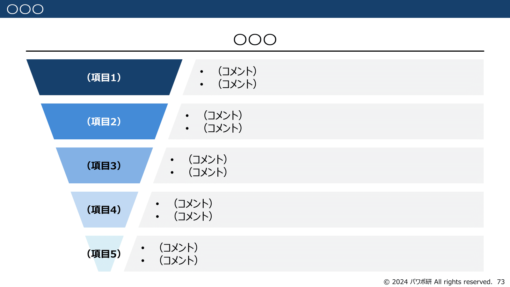
*パワポのファネル図の例（パワポ研テンプレートより）*

マーケティングファネルの図にもいくつかパターンがあり、顧客の購買の流れを示した「パーチェスファネル」、営業のセールスの流れを示した「セールスファネル」、購買後に継続・推奨へと再び広がる「ダブルファネル」などがあります。
今回はそれぞれのマーケティングファネルの例について、それぞれ３つのパワポを紹介していきますよ。

では早速行きましょう！

## パーチェスファネルの図のパワポ例３選

ではここからパワポのファネル図の具体例を見ていきましょう。
まずはパーチェスファネルからです。パーチェスファネルとは、顧客の購買行動の流れに合わせて作成されたファネルです。顧客の購買行動に対してどのようにマーケティング施策を打つのか、どのようなマーケティングサポートができるのかを説明するパワポでファネル図が使われることが多いです。

### ファネル図でマーケティング施策を示す例

まずは株式会社スマレジのパワポにおける「パーチェスファネル」図の具体例から見ていきましょう。
事業計画及び成長可能性に関する事項のパワーポイントにある、契約件数の拡大 - S&M投資の継続のスライドです。

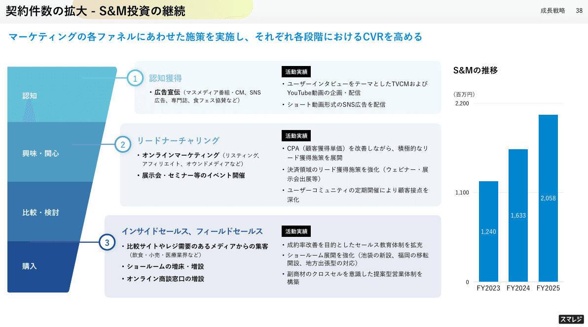
*株式会社スマレジの「パーチェスファネル」図*

> 引用元：[> 事業計画及び成長可能性に関する事項](https://corp.smaregi.jp/ir/library/FY2025_Business_Plan_and_Growth_Potential.pdf)

*https://corp.smaregi.jp/ir/management/growth-potential.php*

パワポの「パーチェスファネル」図の特徴としては、**ファネル分析に基づくマーケティング施策が、アッパーファネル、ローワーファネルの両方で示されている点**が挙げられます。
アッパーファネルの「認知」と「興味・関心」のそれぞれにマーケティング施策があり、ローワーファネルの「比較・検討」「購入」に対して一つのマーケティング施策があります。

ファネル図ですが、完全な逆三角形ではなく、その一部を切り取って台形で見せています。**逆三角形のファネルのパワポは視覚的に伝わりやすい代わりに、スペースを多く食ってしまう**ので、文字情報を多く入れたい場合は右半分だけを見せるのも手です。

### マーケティング事業をファネルで見せる例

続いて株式会社TalentXのパワポにおける「パーチェスファネル」図の具体例を見ていきましょう。
事業計画及び成長可能性に関する事項のパワーポイントにある、「AI・テクノロジーを駆使して労働人口減少時代の新たな採用スタンダードを創る」のスライドです。

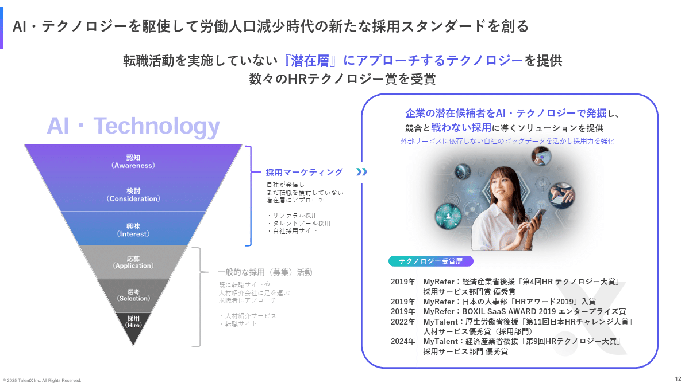
*株式会社TalentXの「パーチェスファネル」図*

> 引用元：[> 事業計画及び成長可能性に関する事項](https://ssl4.eir-parts.net/doc/330A/tdnet/2648681/00.pdf)

*https://talentx.co.jp/ir/news*

パワポの「パーチェスファネル」図の特徴としては、**パーチェスファネルの図を使って事業の紹介を行っている点**が挙げられます。
採用の流れをファネル図で示した上で、応募から採用という、求人サイトや転職エージェントが扱う領域ではなく、その手前の採用マーケティングや採用ブランディングのサービスを提供しているということを紹介しています。

応募から採用というローワーファネルの競争が激しい領域は黒色のグラデーション、自社が戦うブルーオーシャンは青色のグラデーションにすることで、「競合を避けていること」が視覚的にも伝わりやすくなっています。

### ファンマーケティングのファネル図の例

次にGLOE株式会社のパワポにおける「パーチェスファネル」図の具体例を見ます。
2025年10月期 決算説明資料のパワーポイントにある、既存のゲームユーザーのエンゲージメントを高めるマーケティングのスライドです。

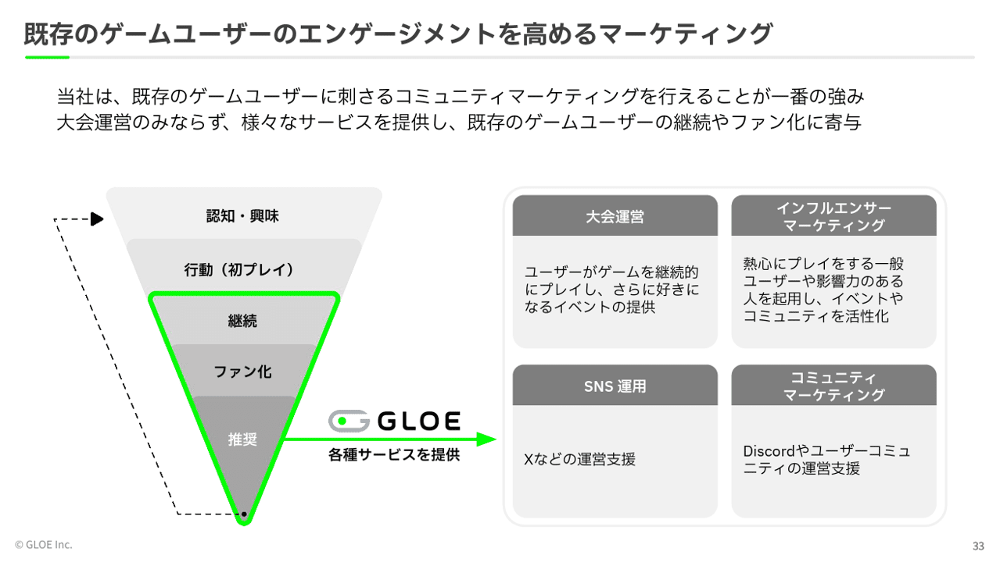
*GLOE株式会社の「パーチェスファネル」図*

> 引用元：[> 2025年10月期 決算説明資料](https://contents.xj-storage.jp/xcontents/AS82955/1353bba4/f420/46ae/98a9/fe9334feb255/20251211200111355s.pdf)

*https://gloe.jp/ir/presentations/*

パワポの「パーチェスファネル」図の特徴としては、**利用後のファン化や推奨といったフローまでファネルでカバーしている**点が挙げられます。
ゲームという、購入して終わりではなくファンマーケティングが大切な世界において、ミドルファネルからローワーファネルが全てファンマーケティングの要素になっています。

色合いが特徴的なパワポのファネル図で、グレーベースに蛍光色の黄緑色を使うことで強調効果が非常に強く出ています。

## セールスファネルの図のパワポ例３選

続いて、パワポのセールスファネルの例を見ていきましょう。セールスファネルとは、事業者のマーケティングの流れに合わせて作成されたファネルであり、「ユーザーとの関係構築」「潜在層」「クロージング」等、事業者目線のワードが使われます。
顧客のマーケティングの流れに対してどのようにサービスを提供するのか、また自社のマーケティングをどのように行うのかといったパワポで使われるファネル図です。

### ファネル図でソリューションを見せる例

まずは、AppierGroup株式会社のパワポにおける「セールスファネル」図の具体例です。
2024年12月期通期 決算説明資料のパワーポイントにある、ファネル全体をカバーする包括的なAI搭載ソリューションのスライドになります。

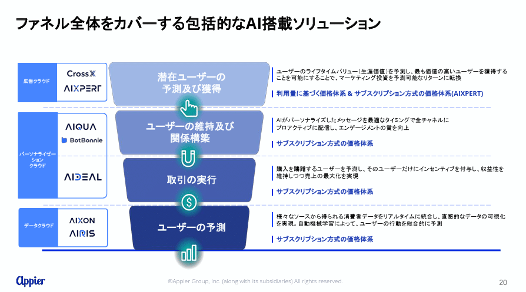
*AppierGroup株式会社の「セールスファネル」図*

> 引用元：[> 2024年12月期通期 決算説明資料](https://ssl4.eir-parts.net/doc/4180/tdnet/2569687/00.pdf)

*https://www.appier.com/ja-jp/ir-news*

パワポの「セールスファネル」図の特徴としては、**ユーザーの予測などAIの要素が入っている点、また結果としてファネルのカバー範囲が広い点**が挙げられます。
真ん中にファネル図を置き、左側に対象となるサービス、右側にその詳細をテキストで記載しています。ファネルの間隔にアイコンを入れてデジタル感を出しているのもよいですね。

### 採用のマーケティングファネルの例

続いて株式会社ROXXのパワポにおける「セールスファネル」図の具体例を見ていきましょう。
2025年９月期通期 決算説明資料のパワーポイントにある、テクノロジー（AI）を活用した生産性向上のスライドです。

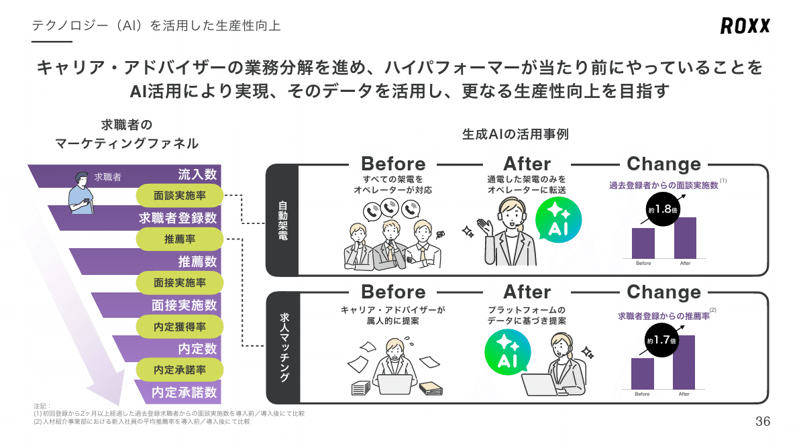
*株式会社ROXXの「セールスファネル」図*

> 引用元：[> 2025年９月期通期 決算説明資料](https://contents.xj-storage.jp/xcontents/AS04024/9e62dca3/6e71/4e16/9a36/6e6c51c83463/140120251110594542.pdf)

パワポの「セールスファネル」図の特徴として、**採用の流れをマーケティングファネルのように見せている点、その間に内定承諾率のようなKPIを入れている点**が挙げられます。ファネル分析をやる際のお手本のようなスライドといえるでしょう。

大量採用を行う企業においては、母集団の形成から内定承諾まで、採用活動はまさにマーケティングそのものなので、セールスファネルで説明がしやすいわけですね。人事系のサービスではよくあるセールスファネルの使い方なので覚えておくとよいですね。

### フルファネルマーケティングの例

続いて株式会社エータイのパワポにおける「セールスファネル」図の具体例を見ていきましょう。
事業計画及び成長可能性に関する事項のパワーポイントにある、成長戦略ーユーザー獲得戦略ーのスライドです。

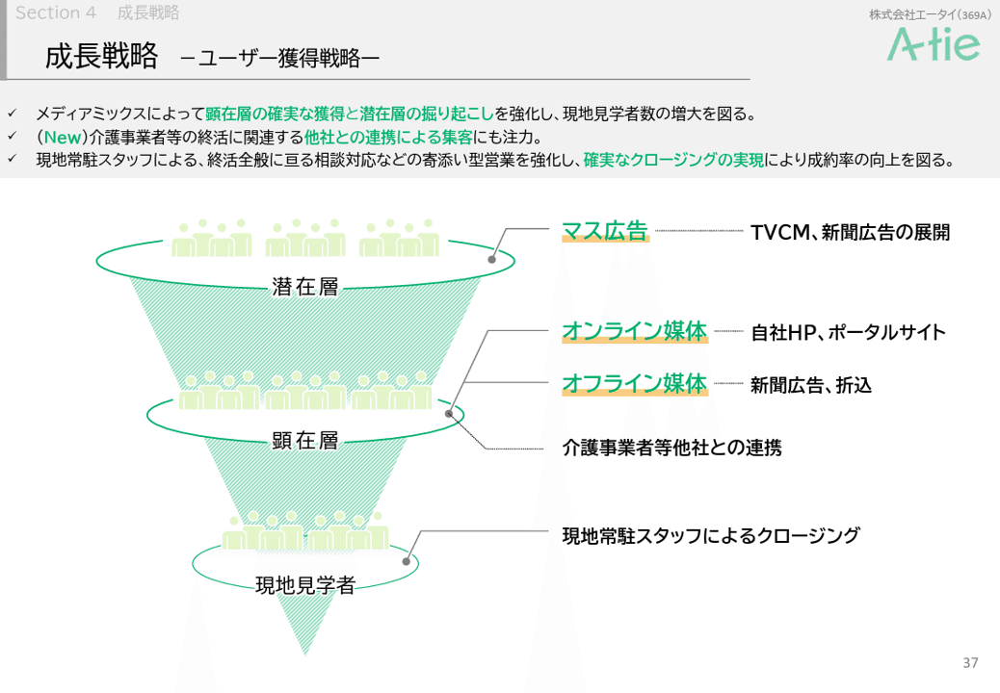
*株式会社エータイの「セールスファネル」図*

> 引用元：[> 事業計画及び成長可能性に関する事項](https://ssl4.eir-parts.net/doc/369A/tdnet/2725495/00.pdf)

*https://a-tie.co.jp/ir/news/*

パワポの「セールスファネル」図の特徴として、**ファネルの各段階にマーケティング施策をプロットし、フルファネルマーケティングの全体像として整理している点**が挙げられます。顧客の段階を、「潜在層」「顕在層」「現地見学者」に分けて、それぞれどのようなマーケティングを行っていくのかが整理されています。

シンプルなファネル図のパワポですが、どのようなマーケティング施策で顧客を獲得するのかの戦略が一目でわかりやすくなっています。

## ダブルファネルの図のパワポ例３選

ここからはパワポのダブルファネルの例を見ていきましょう。パーチェスファネルの中でも、購入以降に「継続」や「推奨」があり、再びファネルが広がるファネル図になります。
最新のマーケティング戦略においては、「継続」や「推奨」は非常に重要なポイントであるため、ダブルファネルもよく使われるファネル図となっています。

### ダブルファネルのマーケティングマップ例

まずは株式会社ヒットのパワポにおける「ダブルファネル」図の具体例から見ていきましょう。
事業計画及び成長可能性に関する事項についてのパワーポイントにある、競合環境のスライドです。

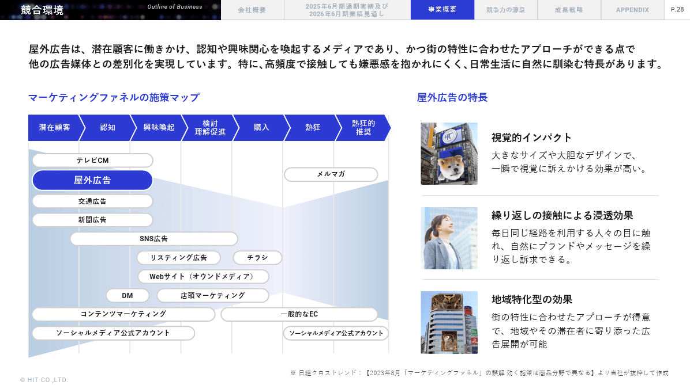
*株式会社ヒットの「ダブルファネル」図*

> 引用元：[> 事業計画及び成長可能性に関する事項について](https://contents.xj-storage.jp/xcontents/AS06556/7c2b752b/d368/481e/bf43/b8c15f956566/140120250703507829.pdf)

*https://www.hit-ad.co.jp/ir/news.html*

パワポの「ダブルファネル」図の特徴としては、**ダブルファネルに様々なマーケティング施策をプロットすることで、施策の全体像が見えるようにしている点**が挙げられます。
マーケティングの媒体について、ファネルのどのタイミングで使われるのかをプロットし、「屋外広告」の立ち位置を明確にしています。

ダブルファネルの上部にフローを記載し、フローの境界にも薄い線を入れることで、非常に見やすいパワポのファネル図となっています。

### ダブルファネルのマーケティング施策の例

続いて株式会社ピアラのパワポにおける「ダブルファネル」図の具体例を見ていきましょう。
2024年12月期 通期決算補足資料のパワーポイントにある、2025年12月期戦略の方向性のスライドです。

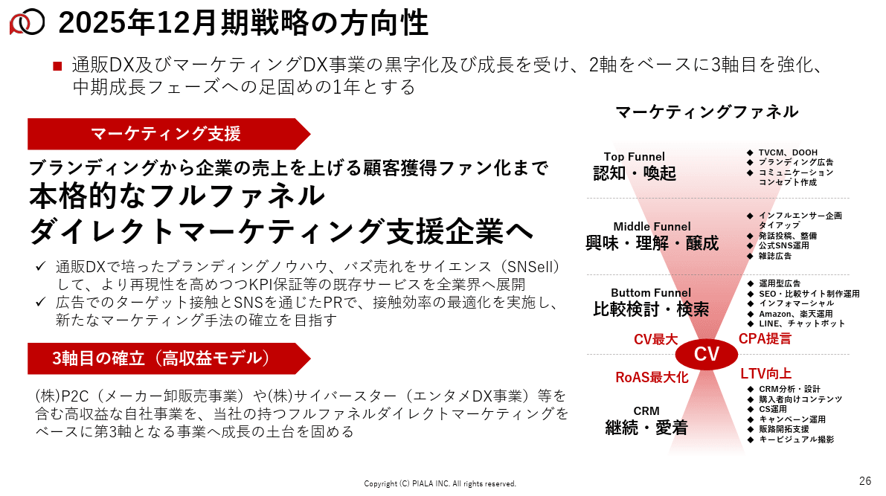
*株式会社ピアラの「ダブルファネル」図*

> 引用元：[> 2024年12月期 通期決算補足資料](https://ssl4.eir-parts.net/doc/7044/tdnet/2565864/00.pdf)

*https://www.piala.co.jp/ir/library/presentation*

パワポの「ダブルファネル」図の特徴として、**CVポイントを強調したうえでそこに向けてどのようなマーケティング支援ができるか記載**しています。
赤い楕円で「CV」を強調したうえで、「CV最大」「CPA低減」「RoAS最大化」「LTV向上」といった文字が並んでいます。

やや文字が多くてビジーなパワポの印象を受けますが、ファネルに合わせてわざとたくさんのマーケティング支援手法を書いていると考えられます。
「フルファネルダイレクトマーケティング支援企業へ」というメッセージを伝える上では、ファネルの各段階で様々なサービスを提供できることが必須なので、そのアピールをしているのでしょう。

### ダブルファネルとマーケティング戦略の例

最後はラバブルマーケティング株式会社のパワポにおける「ダブルチャネル」図の具体例を見ていきましょう。
事業計画及び成長可能性に関する事項のパワーポイントにある、③既存事業｜エルマーケとのM&Aによって期待できるシナジー効果のスライドです。

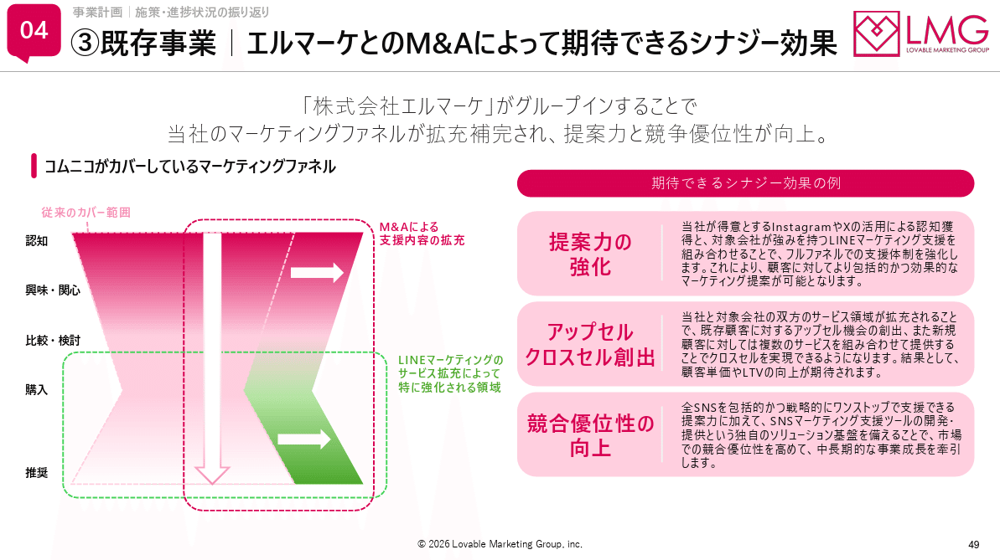
*ラバブルマーケティング株式会社の「ダブルチャネル」図*

> 引用元：[> 事業計画及び成長可能性に関する事項](https://contents.xj-storage.jp/xcontents/AS04712/06c97175/5b96/4c28/9721/1e2108c28219/140120260107530205.pdf)

*https://lmg.co.jp/ir/irnews/*

パワポの「ダブルファネル」図の特徴として、**M&Aやサービス拡充によってファネルが拡張している点**が挙げられます。
「M&Aによる支援内容の拡充」によってダブルファネル全体が横に拡大していること、LINEマーケティングのサービス拡充によって購入から推奨が強化されていることが示されています。

パワポでは珍しいファネル図の使い方ですが、矢印や強調の枠線を効果的に使うと同時に、Lineの緑色であえて統一感を出さないことで、しっかりとメッセージが伝わるパワポになっています。

## 【マネしたい】パワポのマーケティング「ファネル」図スライド９選まとめ

以上、パーチェスチャネル、セールスチャネル、ダブルファネルなど、様々なパターンのマーケティング「ファネル」図を紹介してきました。ファネル図はビジネス構造の説明や施策の説明、またファネル分析などでも効果的に使えるので、是非武器の一つにしてみてくださいね。

ちなみに**パワポ研で提供しているテンプレート集には、以下のようなそのまま使えるマーケティング「ファネル」図のテンプレートもあります**ので、気になる方は下で紹介しているオリジナルテンプレートのNoteも見てみてくださいね。

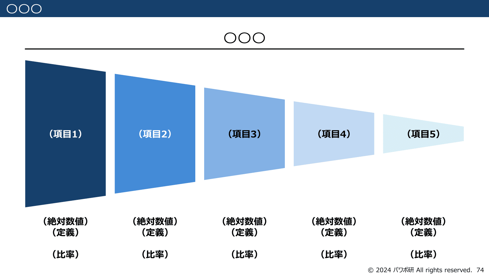
*パワポ研テンプレートの横向きファネル図*

*パワポ研テンプレートのファネル図*

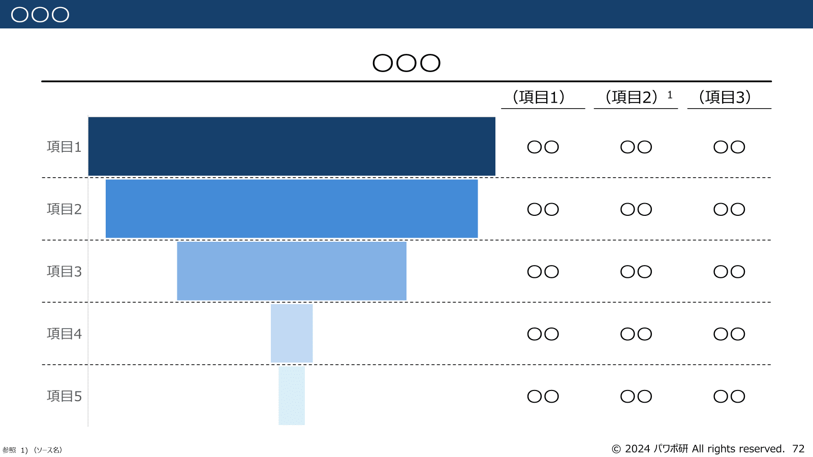
*パワポ研テンプレートの長方形ファネル図*

## パワポ研オリジナルテンプレート

パワポ研では「ビジネスシーンで使える」パワーポイントテンプレートを公開しております。デザインを整えるのみならず、**ロジックやストーリーを整理するのにも役立つパッケージ**になっておりますので、関心のある方は下記ページも併せてご覧ください！

[
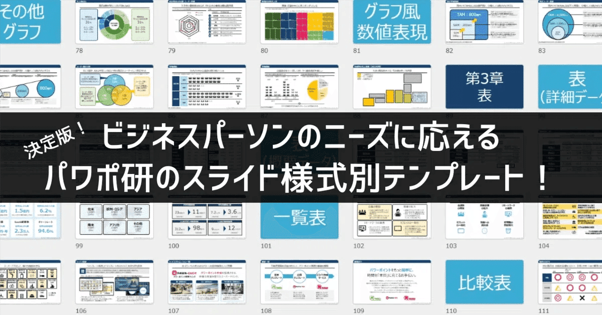
](https://note.com/powerpoint_jp/n/n50d02ec3162f)上記の記事のように、noteでは**フォローしているだけでビジネスにおける「資料作成のコツ」と「デザインのセンス」が身に付くアカウント**を目指して情報配信を行っています。
今後もコンスタントに記事を配信していく予定なので、関心のある方は是非アカウントのフォローをお願いします！

**> Template販売　**[> https://powerpointjp.stores.jp/](https://powerpointjp.stores.jp/%EF%BF%BCnote)
**> note　**[> パワポ研の資料作成術](https://note.com/powerpoint_jp/m/mc291407396da)
**> X（旧Twitter)　**[> https://twitter.com/powerpoint_jp](https://twitter.com/powerpoint_jp)

## レックスアドバイザーズからのお知らせ

パワポ研は株式会社レックスアドバイザーズが運営しています。
レックスアドバイザーズは**経営企画職や経営管理職に特化した転職エージェント**です。
上場企業や上場準備企業を中心に、**経営企画、IR、経理財務、法務、内部監査等の職種の求人**をご紹介しているほか、**CFOなどのコンフィデンシャル求人**もご紹介可能です。
またコンサルティングファームや監査法人、会計事務所の求人も豊富にあるため、プロフェッショナルファームを目指す方のご支援も得意です。
求人紹介やキャリア相談を希望の方は、[**無料転職サポート**](https://www.career-adv.jp/job_search/entryform_exp/)よりサービス利用登録をしてみてください。

*レックスアドバイザーズのサービスサイトはこちら*

**> 求人をご希望の方　**[> 無料転職サポート](https://www.career-adv.jp/job_search/entryform_exp/)**
> 採用支援をご希望の方　**[> 採用サポート](https://www.career-adv.jp/request3/)
**> その他　**[> お問い合わせフォーム](https://www.rex-adv.co.jp/contact)
**> 書籍　**[> 注目企業の実例から学ぶパワポ作成術](https://www.amazon.co.jp/dp/4046060476)

