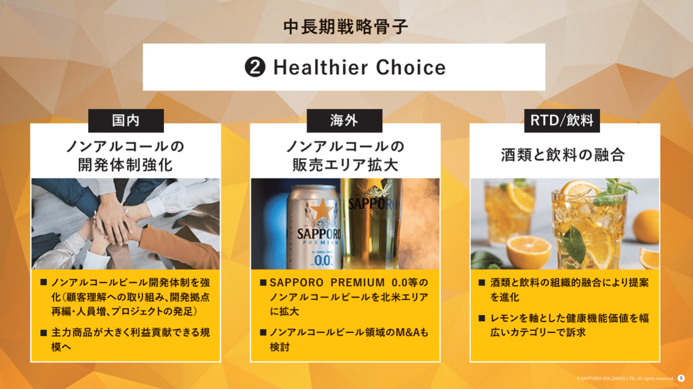
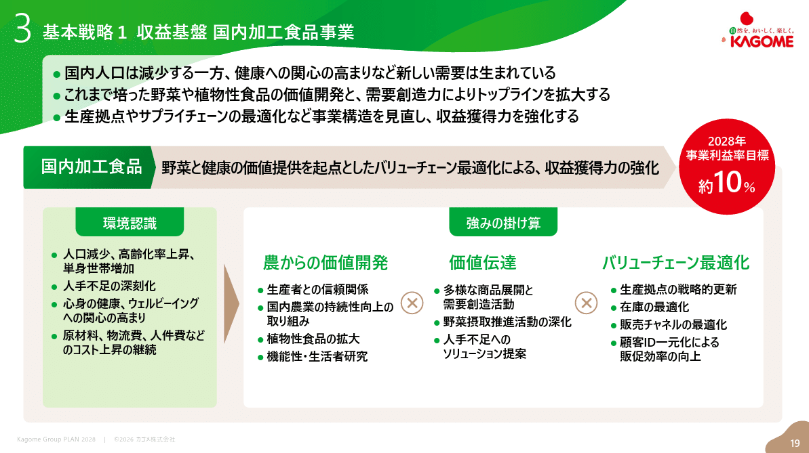
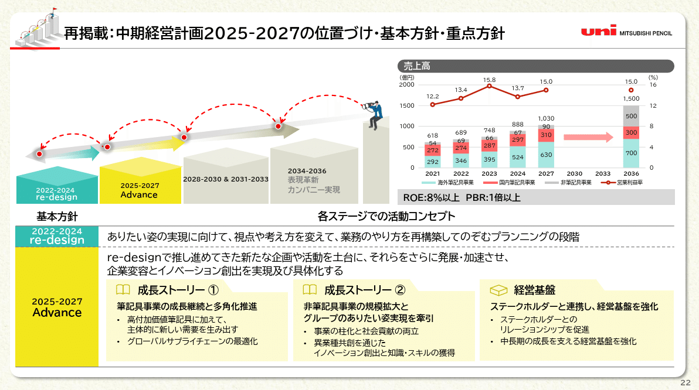
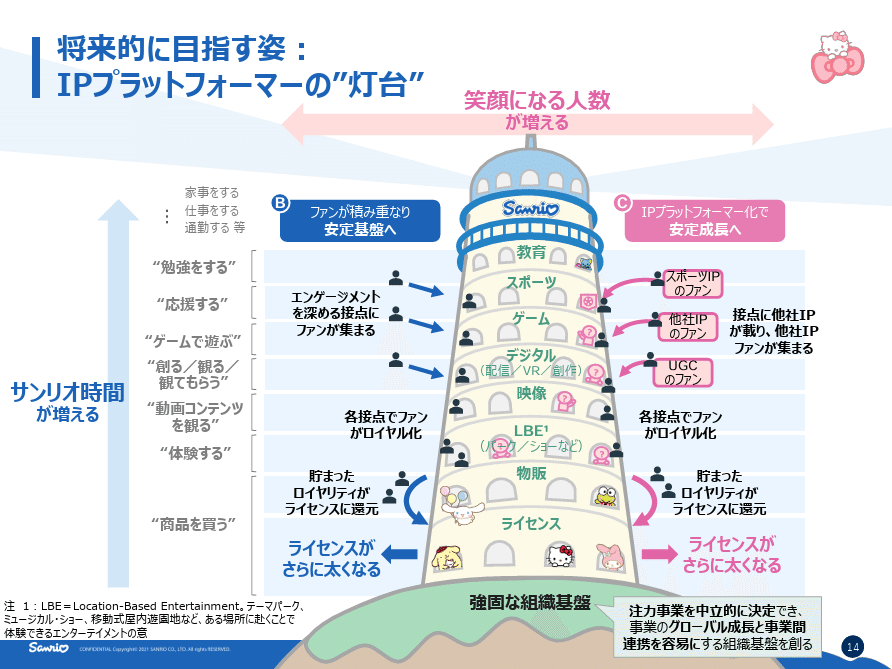
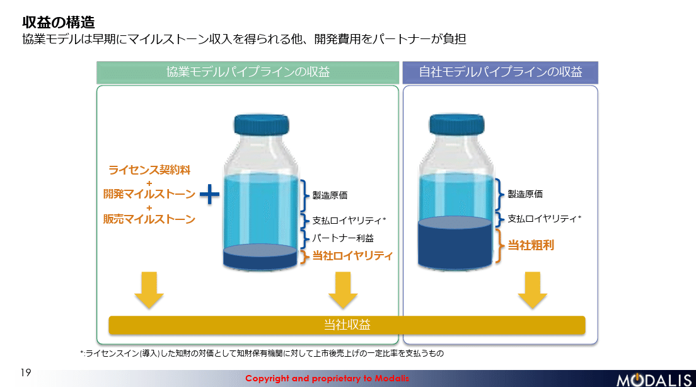
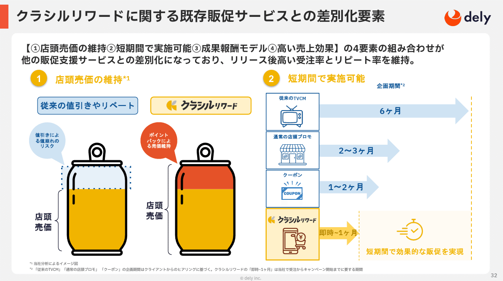
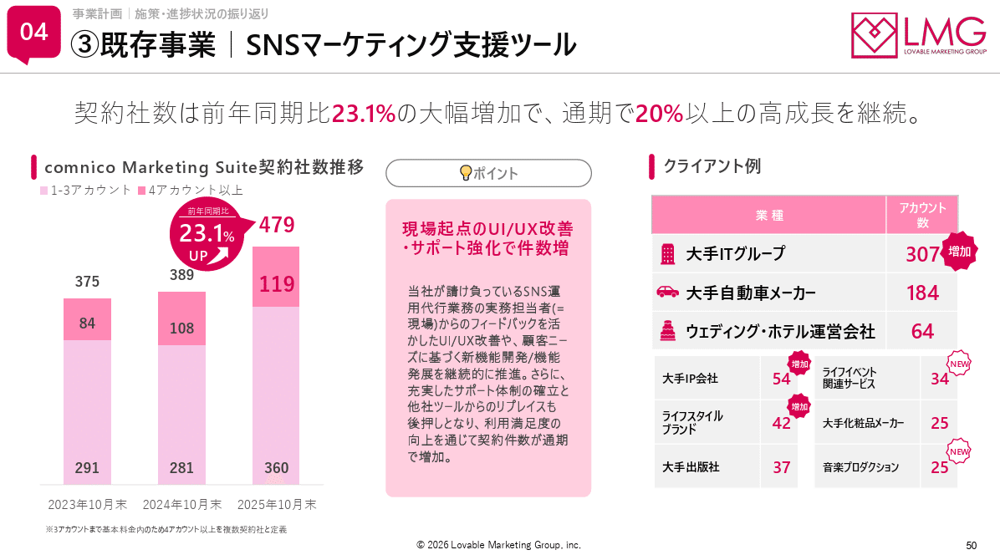
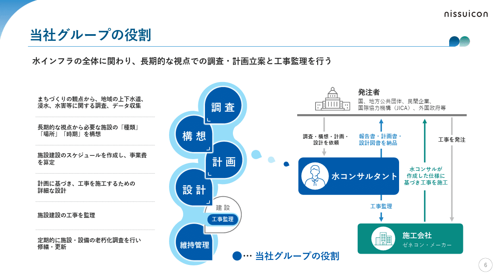
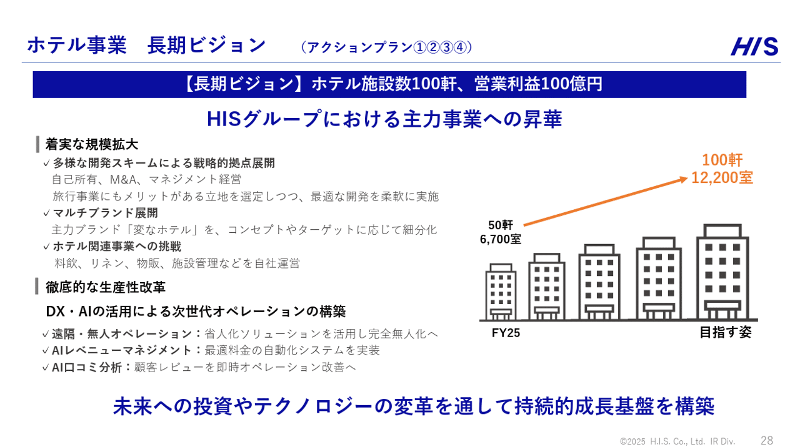

# 【おしゃれ過ぎる】アイデアが秀逸なパワポデザイン９選

[note原文](https://note.com/powerpoint_jp/n/n897f4853b60c)

みなさんこんにちは。
資料デザインのリサーチや分析に取り組むパワーポイントのスペシャリスト、パワポ研です。

今回は、**アイデアが素晴らしいパワポデザインのスライドに焦点を当て、上場企業のIR資料から参考事例を紹介**していきます。特に中期経営計画や長期ビジョンのパワーポイント資料においては、背景のデザインなどもかなり力が入っており、そうきたか！と思うようなアイデアのデザインのスライドも見かけます。

今回はそのような、グッとくるプレゼンテーションのデザインアイデアや、スライドのデザインアイデアを紹介していきます。なおおしゃれなデザインということで、以前紹介した「おしゃれなパワポのスライドレイアウト９選」の記事はこちらから。

では早速行きましょう！

## おしゃれなデザインアイデアのパワポ３選

まずは企業のブランドや事業内容にマッチしたデザインアイデアのパワーポイント例から見ていきましょう。背景にデザインを入れ込むスライドや、ポイントで事業に関するアイコンを入れるデザインなど、いくつかのパターンを見てみましょう。

### 背景や箱がおしゃれなデザインのスライド

まずはサッポロホールディングス株式会社のパワポにおけるデザインアイデアから見ていきましょう。
グループ中長期成長戦略（補足資料）のパワーポイントにある、中長期戦略骨子のスライドです。

*サッポロホールディングス株式会社の中長期成長戦略資料のスライド*

> 引用元：[> グループ中長期成長戦略（補足資料）](https://www.sapporoholdings.jp/ir/library/description/items/202502_mlt_hosoku_jp.pdf)

*https://www.sapporoholdings.jp/ir/*

パワポのデザインアイデアの特徴としては、**背景に加えてテキストボックスも事業イメージに連動させている点**が挙げられます。背景がまずビールの色合いのプリズムになっていますが、３つのテキストボックスもビールのような配色でおしゃれです。テキストボックスのタイトル部分の背景色が白色、テキスト部分の背景色が小麦色になっています。

またテキストボックスに合わせるように、中長期戦略骨子の下の②Helthier Choiceの文字の背景色も白色にしており、全体の調和を取っている点も細かいアイデアの工夫ですが、デザインのこだわりポイントですね。

### 配色がおしゃれなデザインのスライド

続いてカゴメ株式会社のパワポにおけるデザインアイデアです。
2035ビジョン 中計経営計画（2026-2028）説明会資料のパワーポイントにある、「基本戦略１ 収益基盤 国内加工食品事業」のスライドを見てみましょう。

*カゴメ株式会社の中長期戦略資料のスライド*

> 引用元：[> 2035ビジョン 中計経営計画（2026-2028）説明会資料](https://www.kagome.co.jp/library/company/ir/json/news/upload_file/tdnrelease/2811_2026020217374101_P01_.pdf)

*https://www.kagome.co.jp/company/ir/news/*

パワポのデザインアイデアの特徴としては、**事業に関連する色を巧みに使ってスライドを構成している点**が挙げられます。トマトの赤色はもちろん、葉っぱの緑色、土の茶色をグラデーションで使うデザインでスライドを構成しています。

目指す目標である営業利益率10％をトマトの赤色で示すデザインで目立たせつつ、背景色は土の茶色、そのための施策は葉っぱの緑色と、成果である果実とそれに至るための土壌や葉っぱという凝ったアイデアのデザインで、非常におしゃれです。

### アイコンがおしゃれなデザインのスライド

次に三菱鉛筆株式会社のパワポにおけるデザインアイデアを見てみましょう。
「中期経営計画2025-2027」の策定に関するお知らせのパワーポイントにある、「中期経営計画2025-2027の位置づけ・基本方針・重点方針」のスライドです。

*三菱鉛筆株式会社の中期経営計画資料のスライド*

> 引用元：[> 「中期経営計画2025-2027」の策定に関するお知らせ](https://ssl4.eir-parts.net/doc/7976/tdnet/2564883/00.pdf)

*https://www.mpuni.co.jp/news/ir/index.html*

パワポのデザインアイデアの特徴としては、**随所に事業に関するアイコンを混ぜ込んでいること**が挙げられます。中長期のステップアップの階段が封筒になっているほか、成長ストーリーのテキストボックスがフォルダーになっています。

テキストが多くビジーなスライドは読み手が疲れやすいので、こうした遊び語心のあるアイデアを入れておくと、しっかりと読んでもらえるデザインになるといういい事例ですね。

## 伝わりやすいデザインアイデアのパワポ３選

続いては何かしらのコンセプトを伝えるために、自社のブランドや事業に関連するデザインを入れているスライド事例を見ていきましょう。
難しいコンセプトをわかりやすく伝えるアイデアとして、有用なデザインも多いので、参考になると思います。

### 目指す姿が伝わるデザインのスライド

まずは株式会社サンリオのパワポにおけるデザインアイデアを見ていきましょう。
『10年間の長期ビジョン』と『中期経営計画のアップデート』のパワーポイントにある、「将来的に目指す姿」のスライドです。

*株式会社サンリオの長期ビジョンのスライド*

> 引用元：[> 『10年間の長期ビジョン』と『中期経営計画のアップデート』](https://ssl4.eir-parts.net/doc/8136/ir_material_for_fiscal_ym/178405/00.pdf)

*https://corporate.sanrio.co.jp/ir/news/*

パワポのデザインアイデアの特徴としては、**レイヤー構造を塔のアナロジーで見せている点**が挙げられます。強固な組織基盤の上に、「ライセンス」「物販」「LBE」「映像」「デジタル」「ゲーム」「スポーツ」「教育」とレイヤーが重なっている様子を塔のように表現するアイデアが秀逸ですね。

真ん中に塔を置き、キャラクターを窓から出すというアイデアのデザインで非常に目を引きますが、左を見るとカテゴリーとともに、より上に行くほど可処分時間におけるサンリオのシェアが伸びるという説明がされています。つまりベースの構造はピラミッド図を使って構造化されており、戦略が伝わりやすいデザインのスライドにもなっているわけです。

### ビジネス構造が伝わるデザインのスライド

続いて株式会社モダリスのパワポにおけるデザインアイデアです。
事業計画及び成長可能性に関する資料のパワーポイントにある、「収益の構造」のスライドを見ていきましょう。

*株式会社モダリスの事業計画及び成長可能性資料のスライド*

> 引用元：[> 事業計画及び成長可能性に関する資料](https://contents.xj-storage.jp/xcontents/AS04819/af674bbb/b2de/4dec/b553/4cbdc3a8b125/140120260325588530.pdf)

*https://modalistx.com/jp/ir/*

パワポのデザインアイデアの特徴としては、**イラストを使って内訳棒グラフをより直感的に理解しやすいようにしている点**が挙げられます。薬の売上に対し、製造原価、支払ロイヤリティ、パートナー収益、当社収益がどのような内訳になるのか、薬のビンのイラストで表現しています。

競業モデルパイプラインと自社モデルパイプラインに大きくビジネスモデルを分けた上で、それぞれの違いを薬のビンの中身で表現していますが、収益部分を金色にすることで、薬の売上の外側の収益もテキストで表現できるようにしています。遠目にはシンプルな棒グラフにも見えるようなデザイン　にしている点も、読み手にやさしいデザインアイデアといえますね。

### サービス特徴が伝わるデザインのスライド

次はクラシル株式会社のパワポにおけるデザインアイデアを見てみましょう。
事業計画及び成長可能性に関する資料のパワーポイントにある、「クラシルリワードに関する既存販促サービスとの差別化要素」のスライドです。

*クラシル株式会社の事業計画及び成長可能性資料のスライド*

> 引用元：[> 事業計画及び成長可能性に関する事項](https://contents.xj-storage.jp/xcontents/AS06568/13dc4d50/cbb5/4177/9338/ceabe5589efb/140120250501529251.pdf)

*https://kurashiru.co.jp/ir/ir_news*

パワポのデザインアイデアの特徴としては、**イラストを使ってサービスの魅力をより直感的に理解しやすいようにしている点**が挙げられます。クラシルリワードを使うことで、店頭の売価を下げることなく販売促進ができることを、缶の中身の量のイラストで示しています。

こちらも棒グラフの代わりに缶のイラストを入れるアイデアですが、クラシルリワードを使えば収益が全て入ってくる、従来の値引きやリベートでは収益の一部が流出するということが直感的にわかるデザインで、面白いアイデアです。

## アイコン使用のアイデアが光るパワポ３選

最後は、パワポのスライドの中で、ピンポイントで事業に関するアイコンを使っているデザインアイデアを見ていきましょう。ピンポイントでアイコンを使う場合、見やすいデザインにするためのアイデアというよりは、その企業らしさが出すアイデアとして使っているケースが多いように思います。

### チャプター番号にアイコンを使うアイデア

まずは株式会社ラバブルマーケティンググループのパワポにおけるデザインアイデアから見ていきましょう。
事業計画及び成長可能性に関する事項のパワーポイントにある、「③既存事業｜SNSマーケティング支援ツール」のスライドです。

*株式会社ラバブルマーケティンググループの事業計画及び成長可能性資料のスライド*

> 引用元：[> 事業計画及び成長可能性に関する事項](https://contents.xj-storage.jp/xcontents/AS04712/06c97175/5b96/4c28/9721/1e2108c28219/140120260107530205.pdf)

*https://lmg.co.jp/ir/irnews/*

パワポのデザインアイデアの特徴としては、**自社のサービスに関するアイコンをチャプター番号に入れている点**が挙げられます。
スライドタイトル前のチャプター番号をSNSにおけるチャットの吹き出しの様なデザインにするという遊び心あふれるアイデアです。

チャプターナンバーに加えて、グラフの成長率も吹き出しで表現するなど、チャプター以外でも同様のアイデアが使われたデザインとなっています。
全体的にスライドの強調ポイントで吹き出しが使われており、メリハリをつける上で効果的に機能しています。

ちなみにチャプター番号に遊び心を加えるアイデアもありますが、ページ番号で遊ぶデザインもいくつかあるので、気になる方は下のNoteも見てみてください。

### 表のフロー図にアイコンを使うアイデア

続いて株式会社日水コンのパワポにおけるデザインアイデアを見ていきましょう。
日水コングループ2030ビジョンのパワーポイントにある、「当社グループの役割」のスライドです。

*株式会社日水コンの長期ビジョン資料のスライド*

> 引用元：[> 日水コングループ2030ビジョン](https://ssl4.eir-parts.net/doc/261A/tdnet/2758842/00.pdf)

*https://www.nissuicon.co.jp/ir/news/*

パワポのデザインアイデアの特徴としては、**顧客の業務フロー表のフロー部分にアイコンを使っている点**が挙げられます。
業務フローのうち、自社がサービス提供する部分をを雫のアイコンで表現するという面白いアイデアです。

業務フローを深い青色にしつつ、周辺に水色をまとわせるデザインで、当社の水事業とうまくマッチしていることに加え、そこからグラデーションで右の水コンサルタントにつなげているアイデアも見事です。

### 棒グラフをアイコンで代替するアイデア

最後は株式会社エイチ・アイ・エスのパワポのデザインアイデアです。
2025年10月期 決算説明資料のパワーポイントにある、「ホテル事業　長期ビジョン」のスライドを見てみましょう。

*株式会社エイチ・アイ・エスの決算説明資料のスライド*

> 引用元：[> 2025年10月期 決算説明資料](https://www.his.co.jp/assets/FY25_4q_presentation.pdf)

*https://www.his.co.jp/ir/financialresult/*

パワポのデザインアイデアの特徴としては、**将来に向けて伸びる棒グラフをアイコンで表現している点**が挙げられます。
FY25の50件6,700室から、目指す姿の100件12,200室へという展開の棒グラフの棒をホテルのアイコンで表現しています。

実際のところ、目指す姿は横にも広がっており、棒グラフをそのまま代替するというアイデアではないです。逆に、アイコンが大きくなっていくのを棒グラフのように見せているデザインで、思いつきそうで思いつかない面白いアイデアといえますね。

## 【おしゃれ過ぎる】アイデアが秀逸なパワポデザイン９選

以上、企業のブランディングや遊び心が伝わるデザインアイデアを紹介してきました。それぞれ自社の事業ありきのデザインであり、そのままマネすることは難しいのですが、自社だったらどんなアイデアがあるかなと考えてみると、オリジナルのデザインが生まれるかもしれません。
パワポ研ではほかにも様々なスライドを紹介しているので、気になる方は是非見てみてくださいね。

## パワポ研オリジナルテンプレート

パワポ研では、「ビジネスシーンで使える」パワーポイントテンプレートを公開しております。デザインを整えるのみならず、**ロジックやストーリーを整理するのにも役立つパッケージ**になっておりますので、関心のある方は下記ページも併せてご覧ください！！

上記の記事のように、noteでは**フォローしているだけでビジネスにおける「資料作成のコツ」と「デザインのセンス」が身に付くアカウント**を目指して情報配信を行っています。
今後もコンスタントに記事を配信していく予定なので、関心のある方は是非アカウントのフォローをお願いします！

**> Template販売　**[> https://powerpointjp.stores.jp/](https://powerpointjp.stores.jp/%EF%BF%BCnote)
**> note　**[> パワポ研の資料作成術](https://note.com/powerpoint_jp/m/mc291407396da)
**> X（旧Twitter)　**[> https://twitter.com/powerpoint_jp](https://twitter.com/powerpoint_jp)

## レックスアドバイザーズからのお知らせ

パワポ研は株式会社レックスアドバイザーズが運営しています。
レックスアドバイザーズは**経営企画職や経営管理職に特化した転職エージェント**です。
上場企業や上場準備企業を中心に、**経営企画、IR、経理財務、法務、内部監査等の職種の求人**をご紹介しているほか、**CFOなどのコンフィデンシャル求人**もご紹介可能です。
またコンサルティングファームや監査法人、会計事務所の求人も豊富にあるため、プロフェッショナルファームを目指す方のご支援も得意です。
求人紹介やキャリア相談を希望の方は、[**無料転職サポート**](https://www.career-adv.jp/job_search/entryform_exp/?utm_source=note&utm_medium=referral&utm_campaign=note_pp)よりサービス利用登録をしてみてください。

*レックスアドバイザーズのサービスサイトはこちら*

**> 求人をご希望の方　**[> 無料転職サポート](https://www.career-adv.jp/job_search/entryform_exp/)**
> 採用支援をご希望の方　**[> 採用サポート](https://www.career-adv.jp/request3/)
**> その他　**[> お問い合わせフォーム](https://www.rex-adv.co.jp/contact)
**> 書籍　**[> 注目企業の実例から学ぶパワポ作成術](https://www.amazon.co.jp/dp/4046060476)

