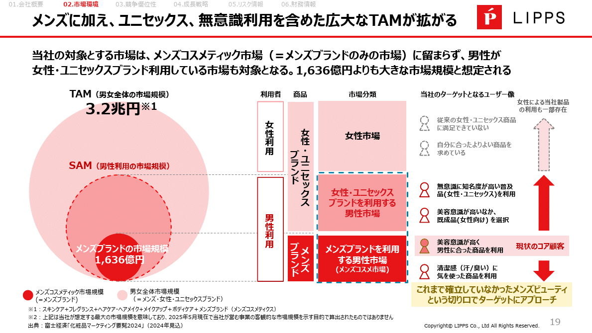
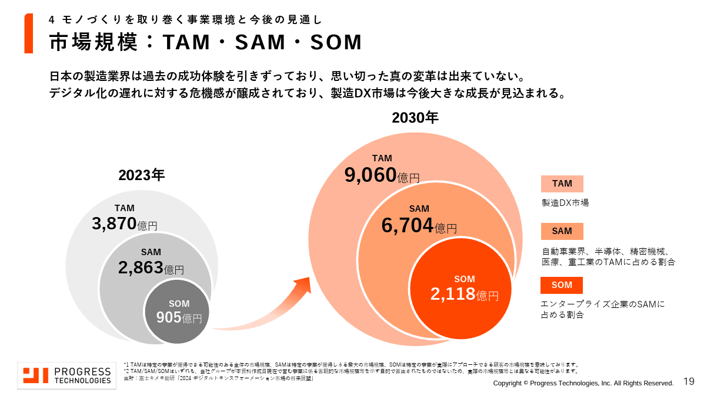
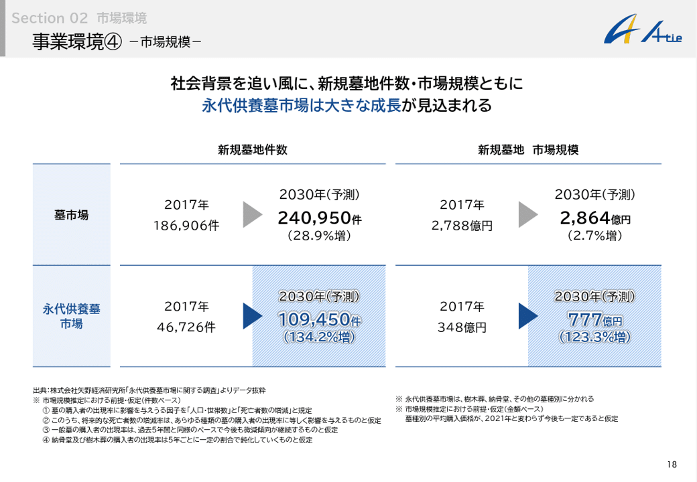
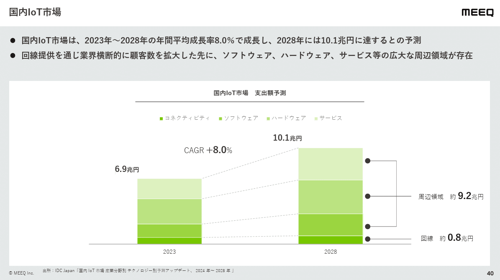
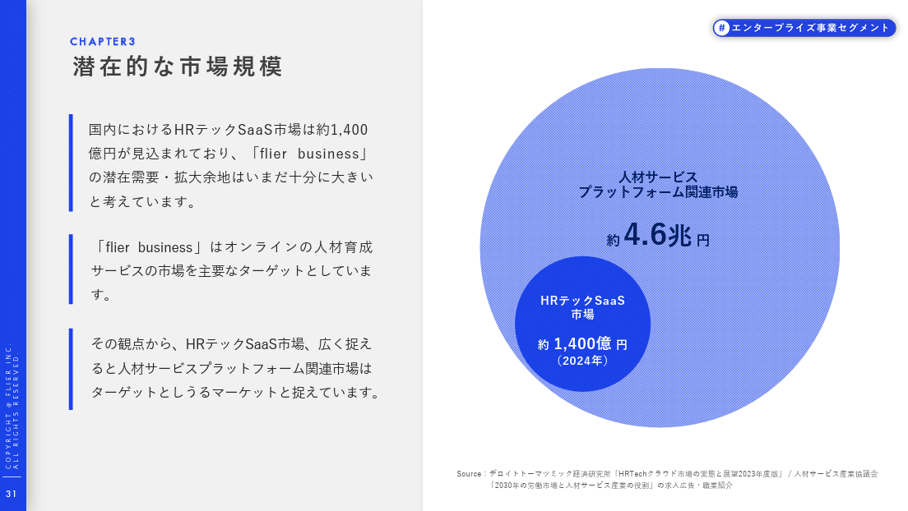
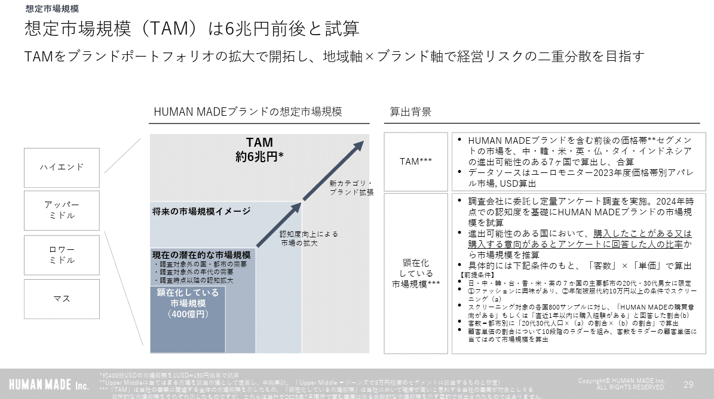
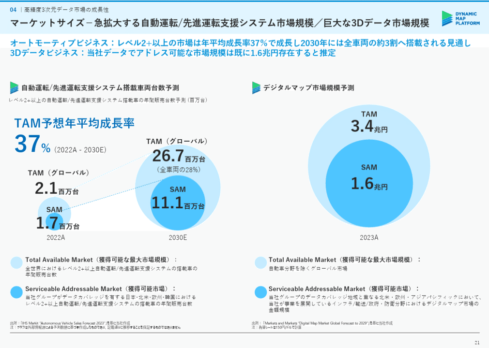
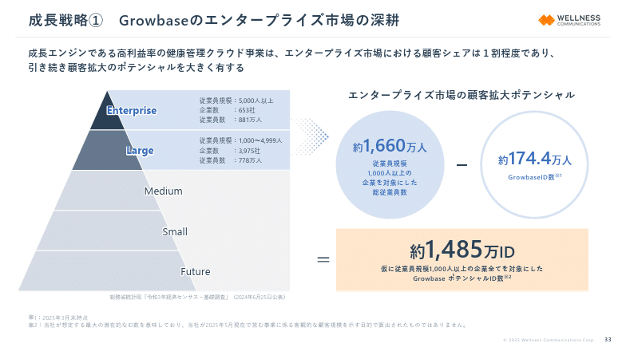
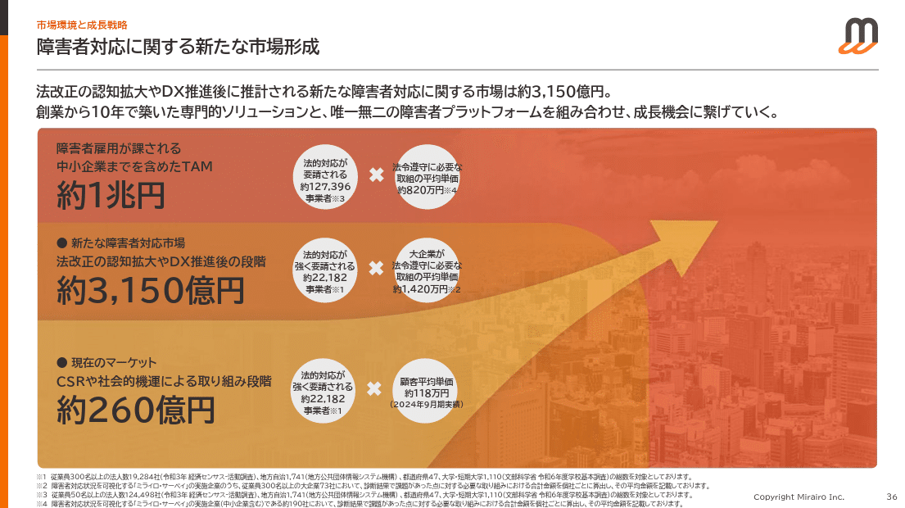
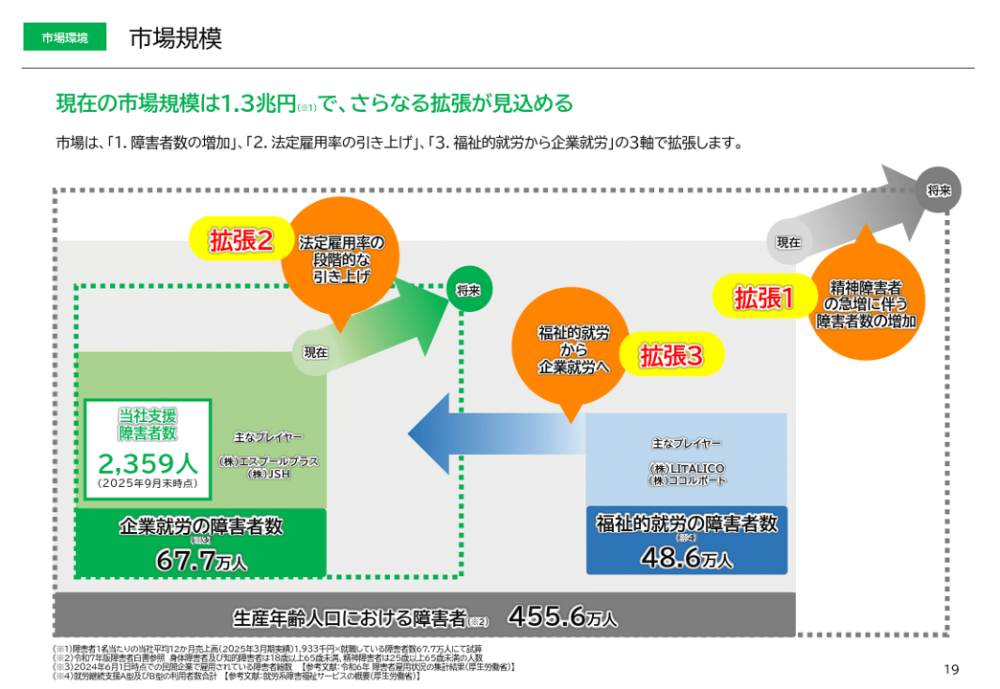

# 「TAM SAM SOM」の計算方法とおすすめ情報源１０選

[note原文](https://note.com/powerpoint_jp/n/n8ea4d91a34a2)

みなさんこんにちは。
資料デザインのリサーチや分析に取り組むパワーポイントのスペシャリスト、パワポ研です。

先日、**【マネしたい】カッコいいパワポの「TAM SAM SOM」スライド９選**のNoteを公開しましたが、今回は関連して「TAM SAM SOM」の計算方法と、計算に使える情報源の話を詳しくしていきます。

では早速行きましょう！

## 「TAM SAM SOM」の計算方法

最初に「TAM SAM SOM」の計算方法から説明していきます。
その前に、「TAM SAM SOM」の定義についておさらいしていきましょう。

### 「TAM SAM SOM」の定義

「TAM SAM SOM」というのは、ある企業がビジネスを行う上で、どのくらい市場が大きいかを示す指標です。**その企業のポテンシャルを示す指標**とも言えますね。

具体例として、犬の健康ペットフードを販売している会社があるとします。
この会社のビジネスの市場規模は、**狭くみると「犬用の健康ペットフードの年間販売額」**ということになりますが、**「健康」にこだわらなければ「犬用ペットフードの年間販売額」**になりますし、**「犬用」にこだわらなければ「健康ペットフード年間販売額」**とも言えます。
さらに広げると「ペットフードの年間販売額」でもいいですし、健康側に寄せれば医療費なども入れた「ペットの健康市場の年間販売額」でもいいわけです。まとめると、以下のようになります。

- 狭義の市場規模：犬用健康ペットフードの市場規模

- 広義な市場規模：犬用ペットフード／健康ペットフードの市場規模

- より広義の市場規模：ペットフード／ペットの健康マーケットの市場規模

ここで「TAM SAM SOM」に話を戻しましょう。改めて「TAM SAM SOM」の定義を確認し、上記のペットフードの事例を当てはめてみます。

- SOM：「Serviceable Obtainable Market」の略で**今現在のサービスで獲得しうる市場の市場規模**を指します。「犬用健康ペットフード」がSOMにあたります。

- SAM：「Serviceable Available Market」の略で、**今現在のサービスで狙いうる市場の最大規模**を指します。「犬用ペットフードの市場規模」か「健康ペットフードの市場規模」がSAMにあたります。

- TAM：「Target Addressable Market」の略で、**企業が狙いうる市場の最大値**を示します。「ペットフードの市場規模」か「ペットの健康マーケットの市場規模」がTAMにあたります。

ここで問題になるのが、TAMに「ペットフードの市場規模」を取るか、「ペットの健康マーケットの市場規模」を取るか、という問題です。
**ここはその企業の企業理念や目指す方向性に合わせて定義することが求められます。**「犬用健康ペットフード」の会社から、「ペットフード」の会社になりたいのか、「ペットの健康支援」の会社になりたいのか、どちらなのか？という話ですね。

### 「TAM SAM SOM」の計算方法

では「TAM SAM SOM」をどのように計算するのかという話ですが、大きく実績ベースでの計算方法と、フェルミ推定での計算方法があります。

実績ベースでの「TAM SAM SOM」の計算方法については、基本的に既に世の中のレポートをそのまま使うあるいは、レポートの数値を足し引きして使うのが一般的です。**よく使われるレポートとしては矢野経済研究所や富士経済、IT関連であればIDCのレポート**などがあります。
また業界団体が出しているレポートや、経産省の調査報告書、厚生労働省の事業者報告なども「TAM SAM SOM」の計算に使えるものがあります。

フェルミ推定を使う「TAM SAM SOM」の計算方法では、人数や事業者数に単価を掛け合わせるケースや、総市場規模に対し対象領域の比率を掛け合わせるケースが多いです。人数や事業者数には国の統計が、**総市場規模には世の中のレポートが使われることが多い**です。

## 1. 富士経済グループ

ここからは、「TAM SAM SOM」の計算に使える情報源の話です。
まずは富士経済グループから見ていきましょう。富士経済グループには富士経済と富士キメラ総研の資料がありますが、いずれも「TAM SAM SOM」のスライドにもよく引用されています。**ジャンルとしては幅広く取り扱っており、世界の市場規模に関する調査**もあります。
FK-Marsというサイトにて、レポートをページ単位で購入することができるので、対象となる市場規模のページだけを購入することもできます。また「マーケティング総覧」シリーズをはじめ、国会図書館に蔵書がある資料もありますが、最新版はコピー不可といったことがあります。

- 対象：オールジャンル

- 計算方法：大手事業者へのヒアリング

- 購入方法：ページ単位で購入可能（FK-Marsに登録が必要）

- 特徴：とにかく取り扱っているレポートが多い。将来予測もあるため、「TAM SAM SOM」の将来予測を入れる場合に重宝する

- HP：[https://www.fuji-keizai.co.jp/?la=ja](https://www.fuji-keizai.co.jp/?la=ja)

*富士経済のレポートを使った「TAM SAM SOM」スライド例*

> 引用元：[> 事業計画及び成長可能性に関する事項](https://contents.xj-storage.jp/xcontents/AS83314/f142e7e4/91cd/4271/956e/c01b106ffaef/20250704131926507s.pdf)

*https://lipps.co.jp/ir/news/*

*富士キメラ総研のレポートを使った「TAM SAM SOM」スライド例*

> 引用元：[> 事業計画及び成長可能性に関する事項](https://ssl4.eir-parts.net/doc/339A/tdnet/2586208/00.pdf)

*https://progresstech-group.jp/ir/news/*

## 2. 矢野経済研究所

続いて国内では富士経済と並ぶ二大巨頭の、矢野経済研究所から見ていきましょう。矢野経済研究所のレポートも「TAM SAM SOM」のスライドによく引用される資料です。こちらも**幅広いジャンルを取り扱っており、世界の市場規模に関する調査**もあります。YDB（Yano Data Bank）というサイトでページ単位でも購入可能なため、対象となる市場規模のページだけを購入することもできます。こちらも、国会図書館に蔵書がある資料もありますが、最新版はコピー不可能な点は同様です。

- 対象：オールジャンル

- 計算方法：事業者へのヒアリング

- 購入方法：ページ単位で購入可能（YDBに登録が必要）

- 特徴：とにかく取り扱っているレポートが多い。将来予測もあるため、「TAM SAM SOM」の将来予測を入れる場合に重宝する

- HP：[https://www.yano.co.jp/](https://www.yano.co.jp/)

*矢野総合研究所のデータを使った市場規模スライドの例*

> 引用元：[> 事業計画及び成長可能性に関する事項](https://ssl4.eir-parts.net/doc/369A/tdnet/2725495/00.pdf)

*https://a-tie.co.jp/ir/news/*

## 3. IDC Japan

続いてIDC Japanを見ていきましょう。IDC JapanのレポートはITやテクノロジー企業の「TAM SAM SOM」のスライドによく引用される資料です。ジャンルとしてはITや半導体などが中心です。

- 対象：IT・テクノロジー中心

- 計算方法：事業者へのヒアリング

- 購入方法：レポート単位での購入

- 特徴：IT領域を得意としているほか、グローバル企業のためグローバルの調査レポートも使いやすい

- HP：[https://www.idc.com/jp/](https://www.idc.com/jp/)

*IDC Japanのレポートを使った市場予測スライドの例*

> 引用元：[> 事業計画及び成長可能性に関する事項](https://ssl4.eir-parts.net/doc/332A/tdnet/2582998/00.pdf)

*https://www.meeq.com/ir/news/*

## 4. シードプランニング

続いてシードプランニングです。シードプランニングはヘルスケアとITのレポートを多く発行しており、「TAM SAM SOM」のスライドにも引用されています。SPIインフォメーションというサイトにて、自社以外のレポートの販売も行っています。

- 対象：「エレクトロニクス・IT、環境・エネルギー」「メディカル・バイオ、医療IT」「ヘルスケア、介護・福祉」に特化

- 計算方法：事業者へのヒアリング

- 購入方法：レポート単位で購入

- 特徴：対象領域を絞っており知見が深い。またより詳細な市場調査を依頼することも可能

- HP：[https://www.seedplanning.co.jp/](https://www.seedplanning.co.jp/)

## 5. デロイト トーマツ ミック経済研究所

続いてデロイト トーマツ ミック経済研究所です。もともとはミック経済研究所という家電に強いレポート会社でしたが、2020年にデロイトトーマツグループにジョインしました。ジャンルとしてはITの中でもスマートソリューション系が多いです。

- 対象：ITソリューション中心

- 計算方法：ヒアリング事業者へのヒアリング

- 購入方法：レポート単位での購入

- 特徴：１時間限定ですべてのレポートの中身を確認でき、本当に必要な資料か確認の上で購入できる。メモは禁止

- HP：[https://mic-r.co.jp/mr/2025/](https://mic-r.co.jp/mr/2025/)

*ミック経済研究所のレポートを使った「TAM SAM SOM」スライドの例*

> 引用元：[> 事業計画及び成長可能性に関する説明資料](https://contents.xj-storage.jp/xcontents/AS09236/b9c849be/4eec/4bf0/99f8/ba09ce7646ee/140120250219578808.pdf)

*https://corp.flierinc.com/ir/library*

ちなみにデロイトトーマツグループのパワーポイント資料はこちらから。

## 6. EUROMONITOR（ユーロモニター）

**消費財に強いレポートが海外のEUROMONITOR（ユーロモニター）**です。ユーロモニターはPOSのデータをベースに実績を取っているので実績データの信頼性が非常に高い点が特徴です。以前はサブスクリプションしかありませんでしたが、今ではレポート単位での購入が可能になっています。

- 対象：消費財が中心

- 計算方法：POSデータ

- 購入方法：レポート単位で購入

- 特徴：世界中の消費財の出荷データが入っており、「TAM SAM SOM」のための市場規模だけでなくシェアのデータを取るうえでも非常に有用

- HP：[https://www.euromonitor.com/store](https://www.euromonitor.com/store)

*EUROMONITORレポートからフェルミ推定した「TAM SAM SOM」スライド例*

> 引用元：[> 事業計画及び成長可能性に関する事項](https://contents.xj-storage.jp/xcontents/AS04974/40d2f000/3520/480b/96bc/5607a4183b51/140120251126509397.pdf)

*https://ir.humanmade.co.jp/news/*

## 7. IHS Markit

業界特化でいうと、**自動車に関してはS&P GlobalのIHS Markitのレポートが使われることが多い**です。IHS Markitのレポートは、自動車のモデルチェンジの時期などを踏まえたセグメント別の出荷台数予測がある点がポイントで、精緻な「TAM SAM SOM」の予測が可能です。。ページ単位でも購入可能なため、対象となる市場規模のページだけを購入することもできます。

- 対象：自動車産業

- 計算方法：出荷データ

- 購入方法：サブスクリプション

- 特徴：自動車のモデルチェンジ時期なども踏まえた、車種×国の販売台数予測が存在

- HP：[https://ihsmarkit.jp/products/mobility.html](https://ihsmarkit.jp/products/mobility.html)

*IHS Markitのレポートを使った「TAM SAM SOM」スライドの例*

> 引用元：[> 事業計画及び成長可能性に関する事項](https://contents.xj-storage.jp/xcontents/AS05208/209a6364/c5ec/4f40/ab9a/daa9bc7d1b8e/140120250326501104.pdf)

*https://www.dynamic-maps.co.jp/ir/news/*

## 8. 経済産業省 委託調査報告書

パワポ研ではおなじみ、経産省の委託調査です。戦略ファームをはじめとするコンサルティングファームが「TAM SAM SOM」に使える市場規模推計をしてくれているので、それをそのまま使うことができます。
ただしまれに、**フェルミ推定に使われている係数の論拠が薄いものもある**ので、定義はきちんと読むようにしましょう。同じ会社が何年も継続している調査で、「過去の定義に準ずる」的なことが書いてある資料は要注意です。

- 対象：オールジャンル

- 計算方法：様々

- 購入方法：無料

- 特徴：レポートによって制度が様々なので、使いたい場合はフェルミ推定の根拠を確認することが必要

- HP：[https://www.meti.go.jp/topic/data/e90622aj.html](https://www.meti.go.jp/topic/data/e90622aj.html)

## 9. 総務省統計局 各種統計調査

続いて総務省統計局の調査です。よく使われるのは、経済センサスや国勢調査などです。国の大規模調査のため、データとしての信頼性が高いのが特徴です。一方でデータの定義や粒度がなかなか合わないといったこともあるため、ドンピシャのものがあればラッキーです。

- 対象：企業活動や生活に関するものが中心

- 計算方法：定量アンケート

- 購入方法：無料

- 特徴：信頼性が高いが、基礎データのため、データの定義や粒度が「TAM　　SAM SOM」と合わないことも多い

- HP：[https://www.stat.go.jp/data/](https://www.stat.go.jp/data/)

*統計局のレポートを使った市場規模スライドの例*

> 引用元：[> 事業計画及び成長可能性に関する事項](https://contents.xj-storage.jp/xcontents/AS05024/f07105d4/224b/4949/bb38/3f16e6c11299/140120250620595058.pdf)

*https://wellcoms.jp/ir/news/*

*統計局データからフェルミ推定した「TAM SAM SOM」スライド例*

> 引用元：[> 事業計画及び成長可能性に関する事項](https://ssl4.eir-parts.net/doc/335A/tdnet/2583569/00.pdf)

*https://www.mirairo.co.jp/ir/news*

## 10. 厚生労働省 各種統計調査

次は厚生労働省の各種統計調査です。特徴として雇用に関する調査がまず多く、HRテックや人材系企業の「TAM SAM SOM」スライドによく利用されています。また医療や福祉に関する調査も多いので、病院や介護や学校などに関するサービスの「TAM SAM SOM」スライドにも登場します。

- 対象：雇用や医療福祉に関するものが中心

- 計算方法：定量アンケート

- 購入方法：無料

- 特徴：雇用や医療福祉に関するレポートが多く、事業者の定量レポートも一定あるため、親和性のある業界では使いやすい

- HP：[https://www.mhlw.go.jp/toukei_hakusho/toukei/index.html](https://www.mhlw.go.jp/toukei_hakusho/toukei/index.html)

*厚生労働省データからフェルミ推定した「TAM SAM SOM」スライド例*

> 引用元：[> 事業計画及び成長可能性に関する事項について](https://ssl4.eir-parts.net/doc/477A/tdnet/2733547/00.pdf)

*https://start-line.jp/ir/*

## 「TAM SAM SOM」の計算方法とおすすめ情報源１０選

「TAM SAM SOM」の計算方法と、計算に使えるおススメの情報源について紹介してきました。これら以外にも、業界団体のレポートであったり、海外の調査会社のレポートであったり、様々な情報源がありますので、ここで紹介した中に良いレポートがなかったとしても、あきらめずに検索してみてくださいね。

## パワポ研オリジナルテンプレート

パワポ研では「ビジネスシーンで使える」パワーポイントテンプレートを公開しております。デザインを整えるのみならず、**ロジックやストーリーを整理するのにも役立つパッケージ**になっておりますので、関心のある方は下記ページも併せてご覧ください！

上記の記事のように、noteでは**フォローしているだけでビジネスにおける「資料作成のコツ」と「デザインのセンス」が身に付くアカウント**を目指して情報配信を行っています。
今後もコンスタントに記事を配信していく予定なので、関心のある方は是非アカウントのフォローをお願いします！

**> Template販売　**[> https://powerpointjp.stores.jp/](https://powerpointjp.stores.jp/%EF%BF%BCnote)
**> note　**[> パワポ研の資料作成術](https://note.com/powerpoint_jp/m/mc291407396da)
**> X（旧Twitter)　**[> https://twitter.com/powerpoint_jp](https://twitter.com/powerpoint_jp)

## レックスアドバイザーズからのお知らせ

パワポ研は株式会社レックスアドバイザーズが運営しています。
レックスアドバイザーズは**経営企画職や経営管理職に特化した転職エージェント**です。
上場企業や上場準備企業を中心に、**経営企画、IR、経理財務、法務、内部監査等の職種の求人**をご紹介しているほか、**CFOなどのコンフィデンシャル求人**もご紹介可能です。
またコンサルティングファームや監査法人、会計事務所の求人も豊富にあるため、プロフェッショナルファームを目指す方のご支援も得意です。
求人紹介やキャリア相談を希望の方は、[**無料転職サポート**](https://www.career-adv.jp/job_search/entryform_exp/?utm_source=note&utm_medium=referral&utm_campaign=note_pp)よりサービス利用登録をしてみてください。

*レックスアドバイザーズのサービスサイトはこちら*

**> 求人をご希望の方　**[> 無料転職サポート](https://www.career-adv.jp/job_search/entryform_exp/)**
> 採用支援をご希望の方　**[> 採用サポート](https://www.career-adv.jp/request3/)
**> その他　**[> お問い合わせフォーム](https://www.rex-adv.co.jp/contact)
**> 書籍　**[> 注目企業の実例から学ぶパワポ作成術](https://www.amazon.co.jp/dp/4046060476)

