# 【マネしたい】カッコいいパワポの「紫色」プレゼン３選（2025年更新）

[note原文](https://note.com/powerpoint_jp/n/n9165d9472c99)

みなさんこんにちは。
資料デザインのリサーチや分析に取り組むパワーポイントのスペシャリスト、パワポ研です。

今回は、**紫色系のパワポに焦点を当て、上場企業のIR資料から参考になりそうな抜粋して紹介**していきます。カラーコードについても記載していきますので、見栄えの良い色や配色について、パワポ作成の参考になれば幸いです。

【マネしたい】シリーズのまとめ記事はこちら。

では早速行きましょう！

## 白やグレーに紫を合わせるパワポ例

まずはイオン株式会社のパワーポイントを見ていきましょう。紫色がメインカラーとなっているパワポの資料ですが、**落ち着いた紫色をチョイスしているのと、白色の部分の面積が大きい**ことから、そこまでキツい配色にはなっていません。紫色を使いながら落ち着いたデザインにしたいときは、色味を抑えて使う、と覚えておきましょう。

またイオン社の資料の特徴としては、構成がしっかりしていることが挙げられます。タイトル、メッセージ、グラフという要素とそれぞれの間の余白が適切です。よいパワポを作るうえでは、こうした基礎をしっかり押さえるのが大切なので、初心者にこそしっかり覚えておいていただきたいパワーポイントですね。

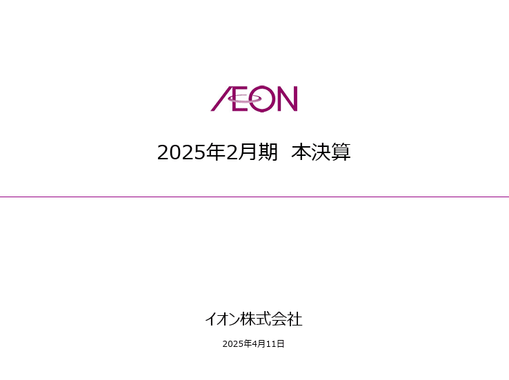
> 引用元：[> 決算説明会資料](https://ssl4.eir-parts.net/doc/8267/ir_material_for_fiscal_ym4/176829/00.pdf)

*https://www.aeon.info/ir/library/report/*

- 明るい紫：カラーコード#97518e、rgb（151,81,142）

- 濃い紫：カラーコード#950082、rgb（149,0,130）

- 薄めの紫：カラーコード#d8acd3、rgb（216,172,211）

- 薄い紫：カラーコード#f8eff8、rgb（248,239,248）

### 紫とグレーの配色のデザイン

イオン社のパワポは、一番後ろの背景が白色、その上にグレー、さらに必要に応じて白色を重ねて、文字やグラフは紫色という構成になっています。

**白やグレーは紫に合う色なので、まとまりのあるパワポとなっていますが、その基盤に白とグレーできちんと構造化をしている**のがポイントです。紫と合う色でベースがあるうえで、ポイントポイントの紫色が映えるデザインということですね。

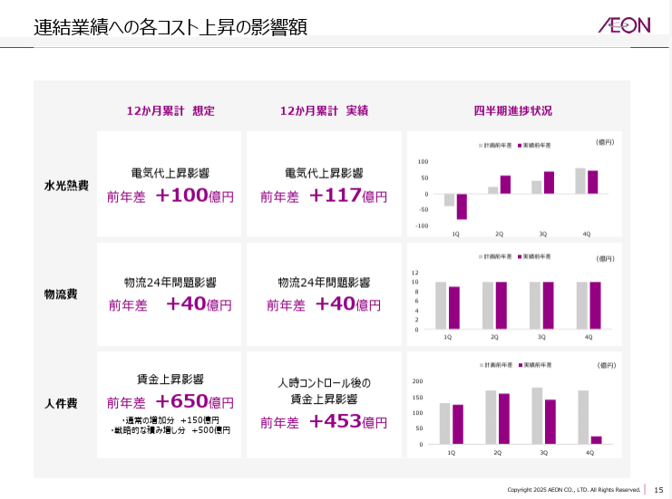

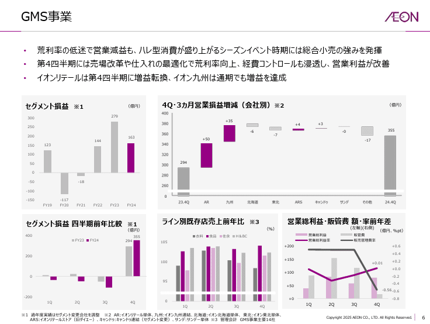

### 明るい紫のグラデーションのデザイン

イオン社のパワポにおける紫色の使い方として、もう一つの特徴として挙げられるのが紫のグラデーションです。
特に表においては、**パワポ上の見せたい数値の背景を紫にしたうえで、文字も紫色の太字にする**ことで、見せたい数値を強調することに成功しています。

ここでも背景が白＋グレーとなっていることがパワポ全体を引き締めるのに貢献しています。**パワポ上で、白、グレー、薄い紫というグラデーションのデザインが成立**しており、すごく滑らかな印象を受けます。

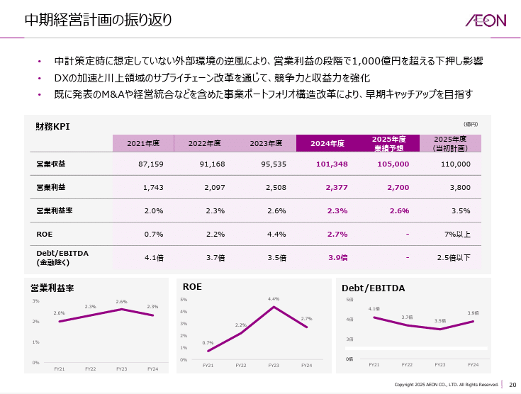

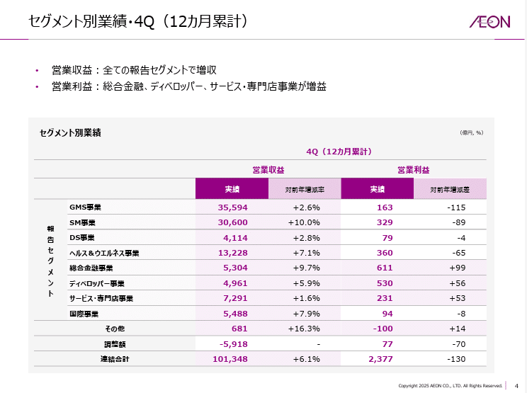

## 濃い紫を軸とする配色のパワポ例

次は葬儀会社の株式会社ティアのパワーポイントを見ていきましょう。
**ティア社のパワポの特徴は、濃い紫色をふんだんに使っている**点です。紫は古くから位の高い色として扱われていますが、濃い紫をデザインの中心にすることで、パワポもより高貴な印象を与えます。

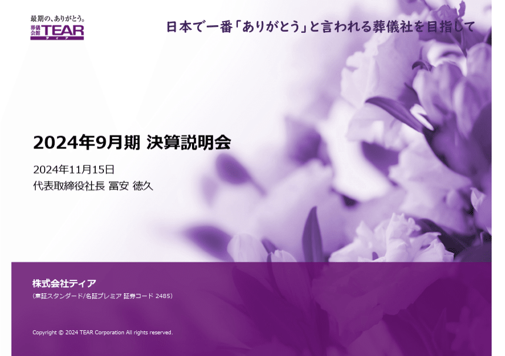
> 引用元：[> 2024年9月期　決算説明会配布資料](https://www.tear.co.jp/company/ir/event/pdf/kessan/20241115kessan.pdf)

*https://www.tear.co.jp/company/ir/event/library.html*

- コーポレートカラーの紫：カラーコード#7a3281、rgb（122,50,129）

- 濃い紫：カラーコード#490850、rgb（73,8,80）

- 薄めの紫：カラーコード#b885bd、rgb（184,133,189）

- 薄い紫：カラーコード#efe0f4、rgb（239,224,244）

### 濃い紫をメインカラーとするデザイン

ティア社の資料は、濃い紫がメインカラーとなっており、紙面上も濃い紫色のインパクトが大きいです。**グラフタイトルやカテゴリーはもちろん、グラフの色やテキストの背景色などのデザインにも濃い紫**が使われています。

濃い紫はインパクトが大きい分、多用するとパワポがうるさくなってしまうのですが、**ティア社は構造化がきちんとされているので、十分見やすい**資料になっています。ここまで強い色を多く使う資料は珍しいので、他社資料に対する差別化になりますね。

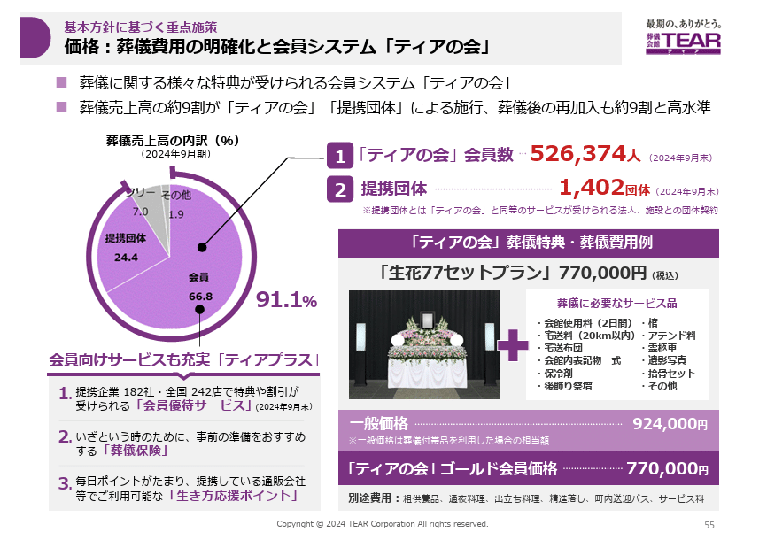

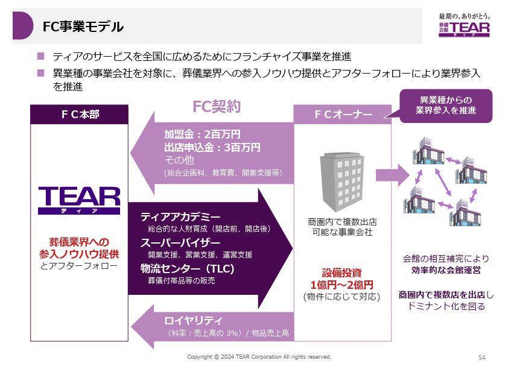

### 濃い紫を中心とする配色のデザイン

ティア社のパワーポイントも、イオン社同様に、紫以外の色は白とグレーが中心です。紫自体がそれなりに目立つ色なので、**パワポにおいても紫に白やグレーと合わせる配色のデザイン**がベターです。

円グラフ等のパワポにおいては、一番強い回答に一番濃い紫を合わせ、そこから徐々に紫色を薄くするというデザインを取っています。また強調したい文字においても紫色を使っています。

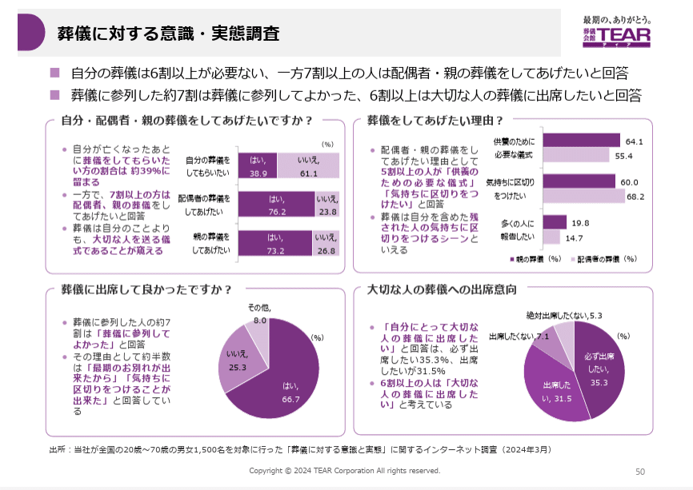

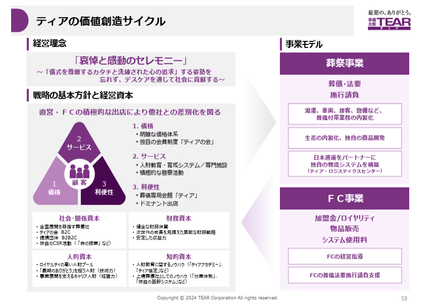

### 紫に合う色を組み合わせたデザイン

一方でティア社のパワーポイントを見ていくと、白やグレー以外の色と紫を合わせる配色のパワポも見受けられます。
例えば棒グラフと折れ線グラフの複合グラフにおいては、棒グラフに紫を使うと、折れ線に紫系の色やグレーや白を使うのは難しくなります。そこで、**紫に明るい黄色や青色を合わせるという配色のデザイン**にしています。
後ほども出てきますが、実は黄色は紫によく合う色なので、チョイスとしては正しいです。

またパワポの強調部分において赤文字を使っていますが、紫が赤と青を合わせた色であることから、赤も地味に紫に合う色となっています。

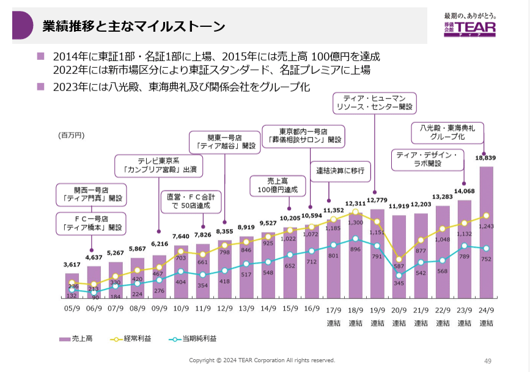

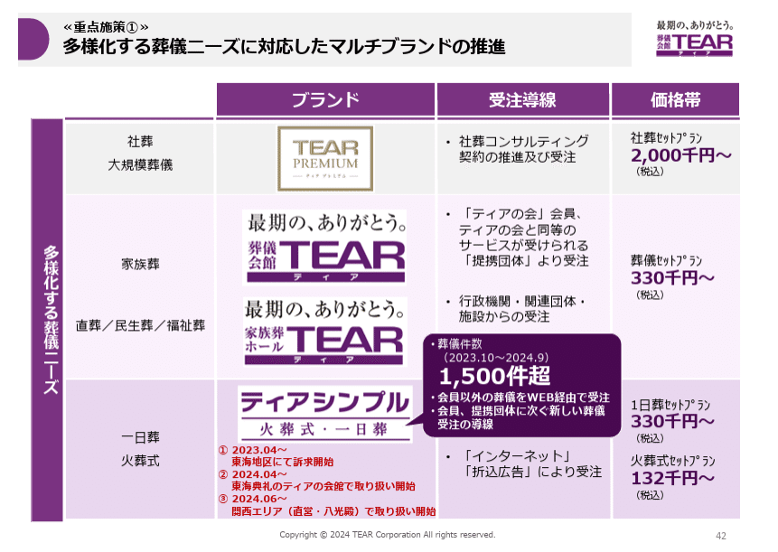

## 紫と黄色の組み合わせが美しいパワポ例

最後にZ世代向けのキャリア支援を行う株式会社ROXXのパワーポイントを見ていきます。以前Yahoo！を出自とするZホールディングスも紫色を使っていましたが、YやZと紫の相性が良いのでしょうか。

ROXX社のスライドの特徴は、**濃い紫を使いつつ、黄色をピンポイントで合わせるのが上手い**点が挙げられます。ティア社の例でも、紫に合う色として黄色を上げましたが、ROXX社は黄色を紫色への差し色としてパワポデザインに盛り込んでいます。

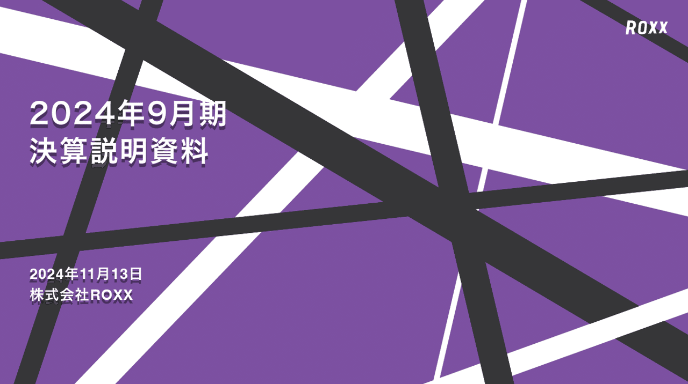
> 引用元：[> 2024年９月期 決算説明資料](https://contents.xj-storage.jp/xcontents/AS04024/7d721c31/9a2f/4d35/bb1a/38cebbc7fc36/140120241113521740.pdf)

*https://roxx.co.jp/ir/library/presentation/*

- 濃い紫：カラーコード#6a4b88、rgb（106,75,136）

- 薄めの紫：カラーコード#cdade4、rgb（205,173,228）

- 薄い紫：カラーコード#ede3f4、rgb（237,227,244）

- 黄色：カラーコード#dee673、rgb（222,230,115）

### 紫とグレーの配色のデザイン

ROXX社においても、**ベーシックなパワポは紫に白とグレーの配色のデザイン**となっています。表紙でも使われている濃い紫から薄い紫までのグラデーションと、グレーのグラデーションを使い分ける配色で見やすいパワポに仕上げています。

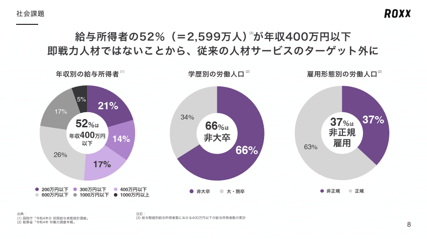

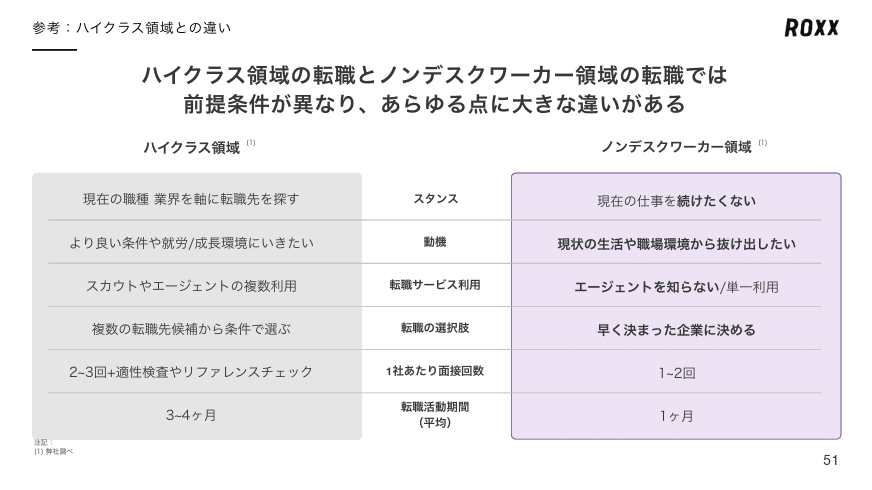

### 紫と黄色を組み合わせたデザイン

ROXX社の特徴としては、紫色と黄色の配色のパワポが多いことが挙げられますが、特にグラデーションのグラフ等に黄色を合わせるデザインのパワポが多いです。

**比較的濃い目の紫を使っていることから、黄色も蛍光色が強めの黄色**にしています。パワポを見てみると、黄色が紫に合う色であるといっても、その強弱がポイントであることがわかりますね。

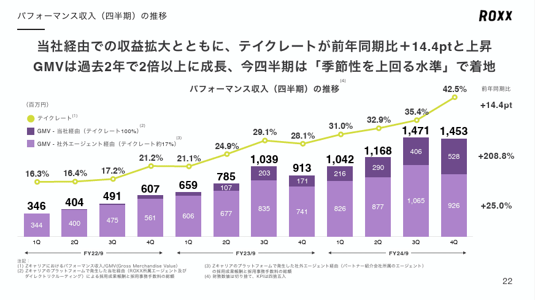

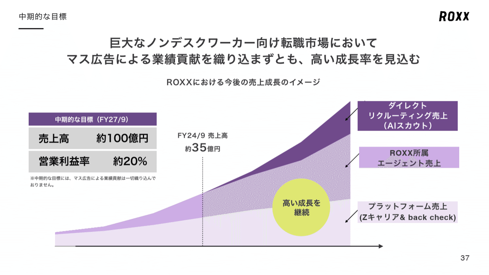

### 紫に黄色で強調するデザイン

またROXX社のパワポでは、強調にも黄色が使われています。紫に合わせる場合に限らず、黄色は強調に使われやすい色ですが、**ROXX社では特に枠を黄色に囲ってのハイライト**などに使われています。

こうしたパワポでも蛍光色の強い黄色を配色に使うことで、周りが紫で比較的強い中でもデザインとして調和を保てており、黄色が紫に合う色であることがよくわかります。

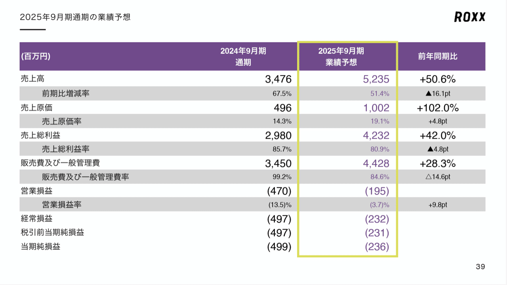

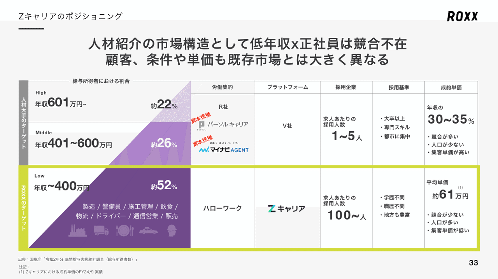

## 【マネしたい】カッコいいパワポの「紫色」プレゼン３選まとめ

いかがでしたでしょうか。紫色はややもすると強すぎるため、パワポの資料においては、あまり使われない色ですが、**白やグレーや黄色といった紫に合う色と合わせること**で、デザインとして使いやすくなります。
逆に言うと他の企業が使わない色なので、差別化を意識したい場合には、積極的に紫を利用したデザインにするのもありですね。

## パワポ研オリジナルテンプレート

パワポ研では「ビジネスシーンで使える」パワーポイントテンプレートを公開しております。デザインを整えるのみならず、**ロジックやストーリーを整理するのにも役立つパッケージ**になっておりますので、関心のある方は下記ページも併せてご覧ください！

上記の記事のように、noteでは**フォローしているだけでビジネスにおける「資料作成のコツ」と「デザインのセンス」が身に付くアカウント**を目指して情報配信を行っています。
今後もコンスタントに記事を配信していく予定なので、関心のある方は是非アカウントのフォローをお願いします！

**> Template販売　**[> https://powerpointjp.stores.jp/](https://powerpointjp.stores.jp/%EF%BF%BCnote)
**> note　**[> パワポ研の資料作成術](https://note.com/powerpoint_jp/m/mc291407396da)
**> X（旧Twitter)　**[> https://twitter.com/powerpoint_jp](https://twitter.com/powerpoint_jp)

## レックスアドバイザーズからのお知らせ

パワポ研は株式会社レックスアドバイザーズが運営しています。
レックスアドバイザーズは**経営企画職や経営管理職に特化した転職エージェント**です。
上場企業や上場準備企業を中心に、**経営企画、IR、経理財務、法務、内部監査等の職種の求人**をご紹介しているほか、**CFOなどのコンフィデンシャル求人**もご紹介可能です。
またコンサルティングファームや監査法人、会計事務所の求人も豊富にあるため、プロフェッショナルファームを目指す方のご支援も得意です。
求人紹介やキャリア相談を希望の方は、[**無料転職サポート**](https://www.career-adv.jp/job_search/entryform_exp/?utm_source=note&utm_medium=referral&utm_campaign=note_pp)よりサービス利用登録をしてみてください。

*レックスアドバイザーズのサービスサイトはこちら*

**> 求人をご希望の方　**[> 無料転職サポート](https://www.career-adv.jp/job_search/entryform_exp/)**
> 採用支援をご希望の方　**[> 採用サポート](https://www.career-adv.jp/request3/)
**> その他　**[> お問い合わせフォーム](https://www.rex-adv.co.jp/contact)
**> 書籍　**[> 注目企業の実例から学ぶパワポ作成術](https://www.amazon.co.jp/dp/4046060476)

