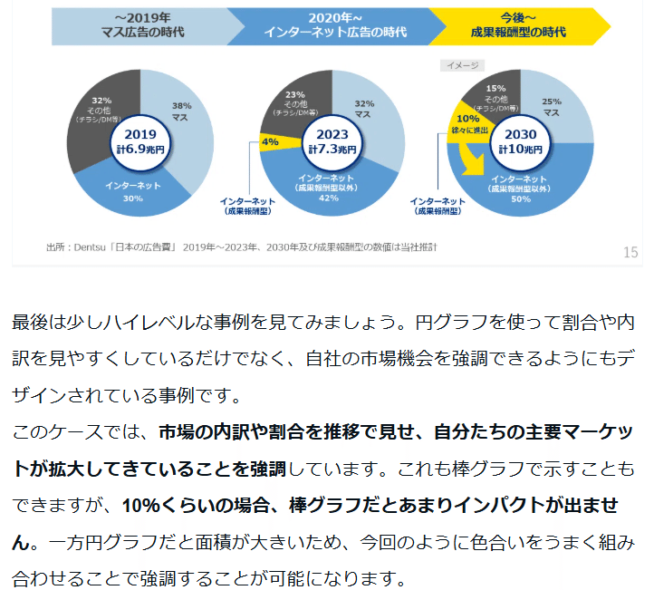
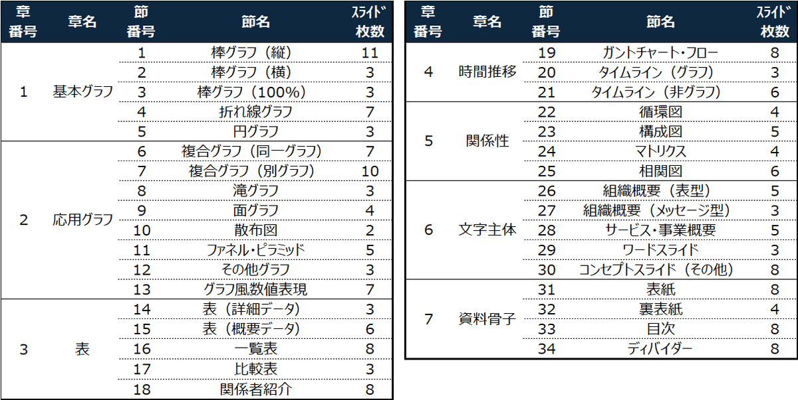

# 【リンクまとめ】パワポ作成の上手い人はスライドの引き出しが多い

[note原文](https://note.com/powerpoint_jp/n/n935391c7ed08)

みなさんこんにちは。
資料デザインのリサーチや分析に取り組むパワーポイントのスペシャリスト、パワポ研です。

このNoteは、**パワポ研で投稿している「見本となるスライド例を紹介するNote」のリンクをまとめたページ**です。
2025年9月より最新事例へのアップデートを行っておりますので、更新された記事を読みたい方は、この記事あるいは下記のマガジンをチェックしておいてください。

 
[
**
パワポ研厳選！テーマ別スライド集｜パワポ研｜note
**

パワポ研のノートのうち、特定テーマごとにまとめたノートを集めています。

note.com

](https://note.com/powerpoint_jp/m/m5a6f4525dd06)

 

## パワポ研で紹介してきたテーマ別のスライド事例集まとめ（2026年更新）

### 【マネしたい】表やグラフのスライド例

表やグラフなど、スライドを構成するパーツについてまとめた記事です。見本となるスライド例を紹介しているほか、**それぞれの表やグラフのメリットデメリット、使う際のポイント**をまとめています。

- [見やすいパワポの「表」スライド９選](https://note.com/powerpoint_jp/n/nfbd66d194ff2)

- [見やすいパワポの「円グラフ」スライド９選](https://note.com/powerpoint_jp/n/n6bafe5e67864)

- [カッコいいパワポの「ウォーターフォール」「滝グラフ」スライド９選](https://note.com/powerpoint_jp/n/nf87a1ea252ce)

- [見やすいパワポの「棒グラフ」「複合グラフ」スライド９選](https://note.com/powerpoint_jp/n/n285958fc3427)

- [見やすいパワポの「折れ線グラフ」スライド９選](https://note.com/powerpoint_jp/n/n4d105e11f613)

- [見やすいパワポの「タイムライン」スライド９選](https://note.com/powerpoint_jp/n/n13417981793d)

- [見やすいパワポの「スケジュール」スライド９選](https://note.com/powerpoint_jp/n/n1f177d84a172)

- [カッコいいパワポの「マトリックス」スライド９選](https://note.com/powerpoint_jp/n/na3237006af1c)

- [カッコいいパワポの「ロードマップ」スライド９選](https://note.com/powerpoint_jp/n/nef4eb14dc50f)

- [カッコいいパワポの「フローチャート」スライド９選](https://note.com/powerpoint_jp/n/nf57434bd50ee)

- [おしゃれなパワポの「ピラミッド図」スライド９選](https://note.com/powerpoint_jp/n/n6cf82209cbfa)

- [おしゃれなパワポの「循環図」デザイン９選](https://note.com/powerpoint_jp/n/n2ccf8fd39c73)

- [おしゃれなパワポのスライド「レイアウト」９選](https://note.com/powerpoint_jp/n/n816b11bf9c03)

- [おしゃれなパワポの「箇条書き」スライド９選](https://note.com/powerpoint_jp/n/n00e1bf7dc2fd)

- [おしゃれなパワポの「マーカー」スライド９選](https://note.com/powerpoint_jp/n/n4b2540bb1e83)

- [パワポの「面グラフ」「エリアチャート」スライド９選](https://note.com/powerpoint_jp/n/nda2b61b003ce)

- [パワポの「バブルチャート」「散布図」スライド９選](https://note.com/powerpoint_jp/n/n637c3b546a62)

- [パワポのマーケティング「ファネル」図スライド９選](https://note.com/powerpoint_jp/n/n87d8f8103b50)

- [パワポの「アップセル」「クロスセル」戦略のスライド９選](https://note.com/powerpoint_jp/n/n16f270481c80)

### 【マネしたい】会社紹介のスライド例

会社概要やミッションビジョンバリューなど、プレゼンテーションの会社紹介パートで使われるスライドについてまとめた記事です。見本となるスライド例を紹介しているほか、**スライド構成のパターン解説**などもしています。

- [カッコいいパワポの「TAM SAM SOM」スライド９選](https://note.com/powerpoint_jp/n/nff9c09d4535f)

- [カッコいいパワポの「会社概要」スライド９選](https://note.com/powerpoint_jp/n/na98a8a3288b8)

- [カッコいいパワポの「事業ポートフォリオ」９選](https://note.com/powerpoint_jp/n/n9bbf1e6e5443)

- [戦略が伝わるパワポの「事業紹介」スライド９選](https://note.com/powerpoint_jp/n/nabc9e703e7b9)

- [パワポの「参入障壁」「競争優位性」スライド事例９選](https://note.com/powerpoint_jp/n/n7df40ea8bbf5)

- [パワポの「ビジネスモデル図」「事業系統図」スライド例９選](https://note.com/powerpoint_jp/n/n93ee16c72a92)

- [パワポのわかりやすい「概念図」「イメージ図」デザイン９選](https://note.com/powerpoint_jp/n/nc4be4fdb0b91)

- [パワポの「市場シェア」「市場占有率」スライド例９選](https://note.com/powerpoint_jp/n/n35b4fd1cb8e4)

- [パワポの「KPIツリー」スライド事例９選](https://note.com/powerpoint_jp/n/nadabd5641868)

- [パワポの「ミッション」「ビジョン」「バリュー」スライド９選](https://note.com/powerpoint_jp/n/nb17a4621ac07)

- [要点がまとまっているパワポの「エグゼクティブサマリー」スライド９選](https://note.com/powerpoint_jp/n/nfa3e08dcd6f5)

- [おしゃれなパワポの表紙スライド３０選](https://note.com/powerpoint_jp/n/na7d0cb4925f3)

- [おしゃれなパワポの「タイトル」デザイン９選](https://note.com/powerpoint_jp/n/ncf68cb5f79d1)

### 【マネしたい】プレゼンテーション例

個別のスライドではなく、プレゼンテーション全体を紹介する記事です。
**プレゼンを構成する重要なスライドについて取り上げて説明**をしています。

- [もはやパワポのデザインが芸術的な領域に達している３社](https://note.com/powerpoint_jp/n/ncdfb90a94314)

- [カッコいいパワポの「青色」プレゼン３選](https://note.com/powerpoint_jp/n/n38223e35b2b4)

- [カッコいいパワポの「オレンジ色」プレゼン３選](https://note.com/powerpoint_jp/n/n7d202c005a6a)

- [カッコいいパワポの「緑色」プレゼン３選](https://note.com/powerpoint_jp/n/n4f81d5e2165a)

- [カッコいいパワポの「黄色」プレゼン３選](https://note.com/powerpoint_jp/n/n479a7aaacc39)

- [カッコいいパワポの「赤色」プレゼン３選](https://note.com/powerpoint_jp/n/n830659eba076)

- [カッコいいパワポの「モノクロ」プレゼン３選](https://note.com/powerpoint_jp/n/nd49ff920f465)

- [カッコいいパワポの「紫色」プレゼン３選](https://note.com/powerpoint_jp/n/n9165d9472c99)

- [色の組み合わせがおしゃれなパワポのプレゼン９選](https://note.com/powerpoint_jp/n/na02d7822ebc3)

- [アイデアが秀逸なパワポデザイン９選](https://note.com/powerpoint_jp/n/n897f4853b60c)

### 【マニアック】徹底分析してみた

- [パワポのページ番号の編集方法とデザイン例２５選](https://note.com/powerpoint_jp/n/nbaf520b586e6)

- [パワポのディバイダーのデザインとスライド例２０選](https://note.com/powerpoint_jp/n/ncbf53b3635fb)

- [背景の色や画像がおしゃれなパワポのスライド５選](https://note.com/powerpoint_jp/n/n7bace1935705)

## パワポ作成の上手い人はたくさんのスライドを見て頭の中にストックしている

なぜパワポ研が、【マネしたい】シリーズでうまいと評されるパワポスライドの事例を紹介しているかというと、良質なスライドを見て、それを頭の中にストックすることこそ、パワポの上手い人になるための近道だからです。

### 戦略コンサルタントがパワポ作成がうまいのは膨大なテンプレートに触れられる環境と実践できる環境のおかげ

一般にパワポ資料の作成が上手いといわれる戦略コンサルタントは、なにも頭がいいからパワポ資料の作成が得意なわけではありません。入社後の研修で基本となるスライドのパターンを学び、先輩の作成したスライドや会社のテンプレートを使いながら資料を作成し、フィードバックを受ける中で、**「こういった目的のスライドの時はこのパターンがいいのか」ということを学んでいく**わけですね。

この過去に**作成された良質な資料のストックや、グローバルで積み上げられたパワーポイントのテンプレート**の存在が、戦略コンサルの人々のパワポ作成力を急速に高めるのです。

彼らも最初は膨大な宝の山を使いこなすことはできません。提案書を作成する中で、過去のスライドに使われていた表を抜き出して使ってみたり、グローバルのテンプレートから抜き出して使ってみたりしますが、「なぜこのスライドにこのグラフを使おうと思ったのか？」「この表だと差分の理由が説明しづらいから別の表にしてください」といった指導を受けて、スライドの目的や表現したい意図に合うテンプレートを選べるようになっていくのです。ちなみに戦略ファームのプレゼンテーション資料は[【パワポ研厳選】コンサルティングファーム・シンクタンクのスライド資料３０選](https://note.com/powerpoint_jp/n/n812a673ce2ab)で紹介しています。

### パワポ研の【マネしたい】シリーズはよいデザインを紹介するだけでなく、背景や使用できるシチュエーションも説明している

ここまで読んでいただいて、頑張れば良質なパワーポイントに触れる機会は作れるものの、実践でフィードバックをしてもらうのはなかなか難しいと感じた方が多いのではないかと思います。

大丈夫です。そのためにパワポ研のスライド事例紹介は、**なぜそのスライドがうまいのか、マネすべきなのかという説明**を必ずしていますし、どういうシーン、どういう意図の場合に活用できるのかという、使い方の部分まで説明しています。

*【マネしたい】おしゃれなパワポの「円グラフ」スライド９選の一部*

なので、良いデザインのものを見たいというニーズに加えて、実際にそのパワポデザインを使えるようになってもらえるように、というのが私たちパワポ研の願いです。より直接的にテクニックを学べるよう、[【パワポ研直伝】見やすいスライドを作成するためのテクニック](https://note.com/powerpoint_jp/n/n754b3a94f9ae)という記事も作成しました。

とはいえ、一個一個の上手いスライドを見て、説明を読み、自分で再解釈をして使えるようにするのは中々労力もかかります。そこで、そうした学びの労力を最大限効率化し、コスパよくパワポ上級者となってもらうべく、私たちは184枚にもわたる、テーマ別のパワポ素材のパッケージを開発しました。

## パワポ研オリジナルテンプレート

パワポ研で展開する様式別テンプレートは、以下のラインナップで構成されています。なるべく多くのシチュエーションを網羅できるようにラインナップを構築しました。

テンプレートのサンプル（PDF抜粋版）は以下よりダウンロードできます。

   [    **様式別パワーポイントスライド実例集（サンプル）.pdf** 2.15 MB  ファイルダウンロードについて      

ダウンロード
   ](https://note.com/api/v2/attachments/download/578d3915ae9d80979498d9f1ebd4465a)   もちろん、「空欄が多い資料が良い」というニーズもあると思います。様々なニーズに対応するため、パワポ研は以下のパッケージをバンドルして提供します。

> 「フルパッケージ」資料（パワーポイント）
> 「解説ノート付きフルパッケージ」資料（パワーポイント）
> 「ブランクパッケージ」資料（パワーポイント）
> 「フルパッケージPDF」資料（PDF）

是非購入したいという方はクリエイターページのストアにてご購入いただければ幸いです。

 
[
**
パワポ研の商品一覧｜note
**

フォローしているだけでビジネスにおける「資料作成のコツ」と「デザインのセンス」が身に付くアカウント。

note.com

](https://note.com/powerpoint_jp/store)

 
より具体な内容、詳細を知りたいという方は下記Noteも合わせてご覧ください！

上記の記事のように、noteでは**フォローしているだけでビジネスにおける「資料作成のコツ」と「デザインのセンス」が身に付くアカウント**を目指して情報配信を行っています。
今後もコンスタントに記事を配信していく予定なので、関心のある方は是非アカウントのフォローをお願いします！

**> Template販売　**[> https://powerpointjp.stores.jp/](https://powerpointjp.stores.jp/%EF%BF%BCnote)
**> note　**[> パワポ研の資料作成術](https://note.com/powerpoint_jp/m/mc291407396da)
**> X（旧Twitter)　**[> https://twitter.com/powerpoint_jp](https://twitter.com/powerpoint_jp)

## レックスアドバイザーズからのお知らせ

パワポ研は株式会社レックスアドバイザーズが運営しています。
レックスアドバイザーズは**経営企画職や経営管理職に特化した転職エージェント**です。
上場企業や上場準備企業を中心に、**経営企画、IR、経理財務、法務、内部監査等の職種の求人**をご紹介しているほか、**CFOなどのコンフィデンシャル求人**もご紹介可能です。
またコンサルティングファームや監査法人、会計事務所の求人も豊富にあるため、プロフェッショナルファームを目指す方のご支援も得意です。
求人紹介やキャリア相談を希望の方は、[**無料転職サポート**](https://www.career-adv.jp/job_search/entryform_exp/)よりサービス利用登録をしてみてください。

*レックスアドバイザーズのサービスサイトはこちら*

**> 求人をご希望の方　**[> 無料転職サポート](https://www.career-adv.jp/job_search/entryform_exp/)**
> 採用支援をご希望の方　**[> 採用サポート](https://www.career-adv.jp/request3/)
**> その他　**[> お問い合わせフォーム](https://www.rex-adv.co.jp/contact)
**> 書籍　**[> 注目企業の実例から学ぶパワポ作成術](https://www.amazon.co.jp/dp/4046060476)

