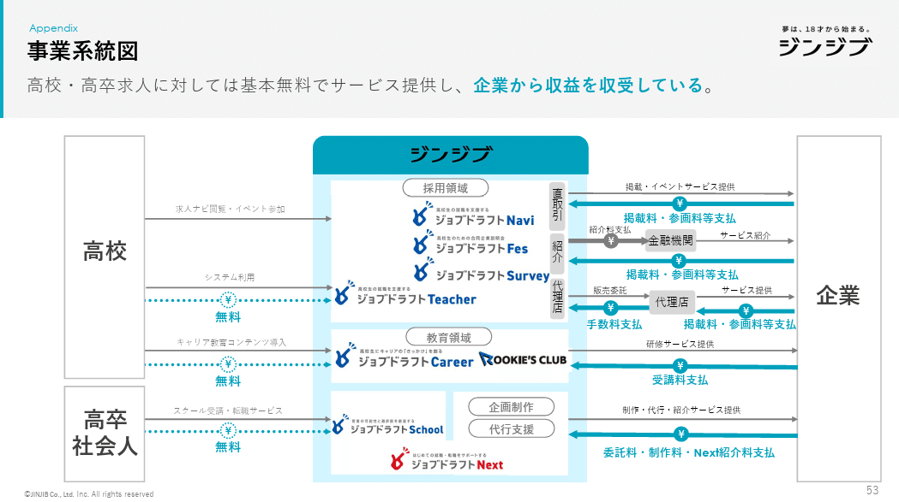
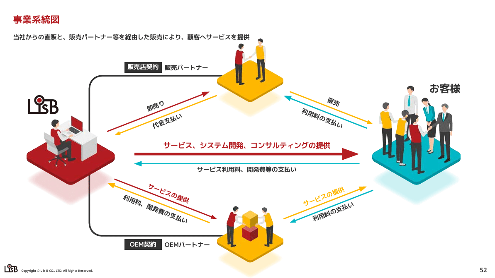
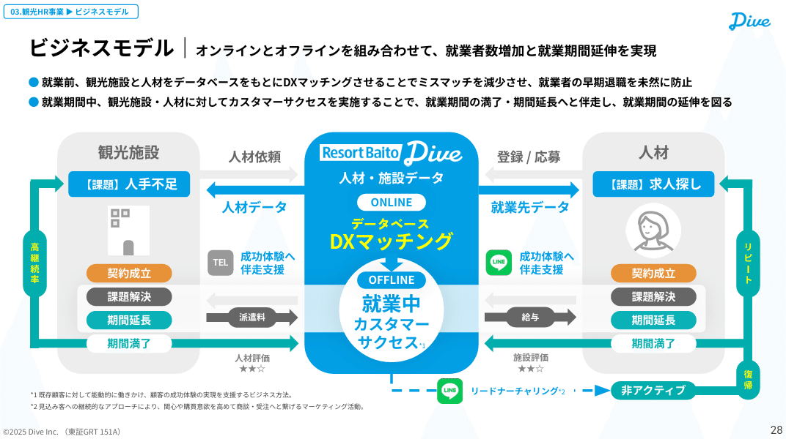
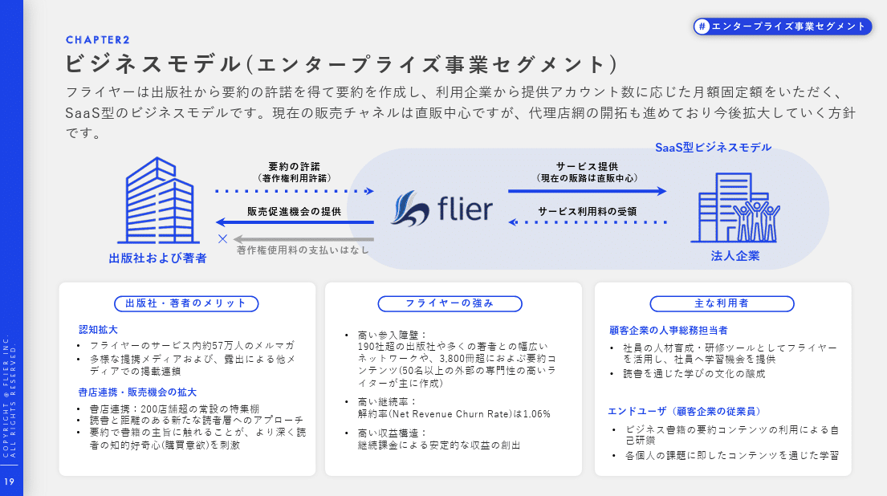
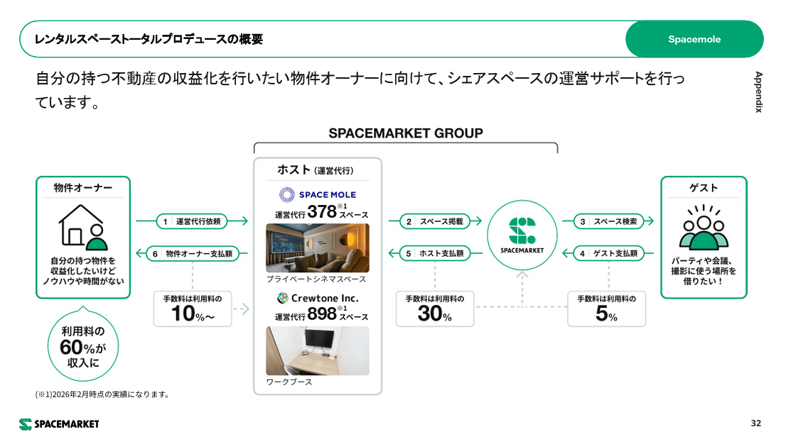
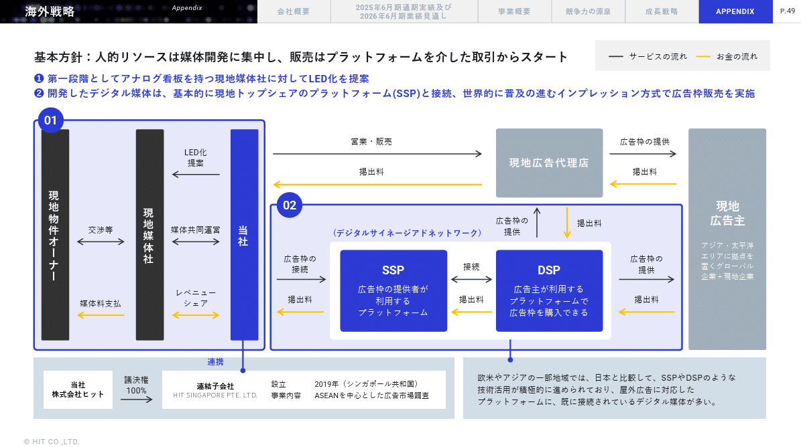
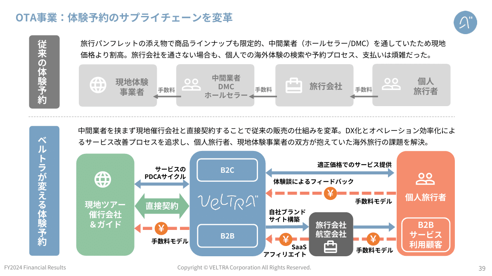

# 【マネしたい】パワポの「ビジネスモデル図」「事業系統図」スライド例９選

[note原文](https://note.com/powerpoint_jp/n/n93ee16c72a92)

みなさんこんにちは。
資料デザインのリサーチや分析に取り組むパワーポイントのスペシャリスト、パワポ研です。

今回は、**パワポの「ビジネスモデル図」「事業系統図」スライドに焦点を当て、上場企業のIR資料から参考事例を紹介**していきます。ビジネスモデル図や事業系統図は、その企業のサービスがどのように提供されているのか、サービスの流れや商流を説明するのに使われるテンプレートです。

事業系統図とビジネスモデル図の明確な定義はないので、同じものでも企業によって事業系統図と呼んだり、ビジネスモデル図と呼んだりします。
一般的な使い分けとしては以下のようになっており、ビジネスモデル図の方が広い概念に見えますね。

- **事業系統図**：サービスの流れやそれに伴うお金の流れを詳細に説明する際に使われることが多いテンプレート

- **ビジネスモデル図**：ビジネスのコンセプトや強みなど、ビジネスの全体像を説明する際に使われるテンプレート

では早速行きましょう！

## 事業系統図のパワポ例３選

最初はパワポの事業系統図のスライドから見ていきましょう。仕入れからサービス提供までの商流、つまりサービスの流れやお金の流れが詳細にわかるようなスライドになっています。事業系統図は有価証券報告書にも記載されますね。

### 一般的な事業系統図の例

まずは株式会社ジンジブのパワポにおける、オーソドックスな事業系統図の例から見ていきましょう。
2025年3月期 通期 決算説明資料 中期経営計画 説明資料 （事業計画及び成長可能性に関する事項）のパワーポイントにある、事業系統図のスライドです。

*株式会社ジンジブの事業系統図*

> 引用元：[> 2025年3月期 通期 決算説明資料 中期経営計画 説明資料 （事業計画及び成長可能性に関する事項）](https://ssl4.eir-parts.net/doc/142A/tdnet/2619236/00.pdf)

*https://jinjib.co.jp/ir/library/presentation/*

パワポの「事業系統図」の特徴としては、**中心に自社を置いて、右側に顧客、左側に仕入を置き、左から右に商品が流れている点**が挙げられます。
最もオーソドックスな事業系統図です。

複数事業がある中で、事業ごとに企業への矢印が伸びています。実際に料金が発生する部分は太い矢印にしつつ、無料の部分は破線の矢印にするといった工夫もみられますね。

### SaaS事業の事業系統図の例

続いて株式会社 L is Bのパワポにおける事業系統図の例です。SaaS事業は仕入れ等が少ないのでシンプルな事業系統図となりやすいです。
2025年 12月期 通期 決算説明資料のパワーポイントにある、事業系統図のスライドを見てみましょう。

*株式会社 L is Bの事業系統図*

> 引用元：[> 2025年 12月期 通期 決算説明資料](https://contents.xj-storage.jp/xcontents/AS05193/a9de1925/8296/41a0/bdea/28ec0c314a97/140120260213560775.pdf)

*https://l-is-b.com/ja/ir/presentations/*

パワポの「事業系統図」の特徴としては、**自社、顧客、パートナーの３者に合わせて３色を使い分けている点**が挙げられます。自社が赤色、パートナーが黄色、顧客が緑色になっており、自社から延びる矢印は赤色、パートナーから延びる矢印は黄色と、それぞれから延びる矢印も同じ色になっています。

事業系統図というと、箱と矢印でより詳細に見せるデザインも多い中で、イラストを使って抽象的に見せている点も特徴的です。

### SaaS事業の事業系統図と補足情報の例

次にウェルネス･コミュニケーションズ株式会社のパワポにおける事業系統図の例を見てみましょう。
事業計画及び成長可能性に関する事項のパワーポイントにある、健康管理クラウド事業の事業系統図と料金体系のスライドです。

*ウェルネス･コミュニケーションズ株式会社の事業系統図*

> 引用元：[> 事業計画及び成長可能性に関する事項](https://contents.xj-storage.jp/xcontents/AS05024/f07105d4/224b/4949/bb38/3f16e6c11299/140120250620595058.pdf)

*https://wellcoms.jp/ir/news/*

パワポの「事業系統図」の特徴としては、**事業系統図の横に補足情報として料金体系を切り出して説明している点**が挙げられます。SaaSのシンプルな事業系統図に合わせて、ストック型の売上比率が高いということ、チャーンレートが低いということを示しています。

事業系統図に定量情報を入れ込む場合、直接事業系統図に書き込むパターンもありますが、ややビジーになりがちです。そこで、スライド全体を通して伝えたい、「健康管理のSaaSプラットフォームが主力事業で、ストック売上の比率が高い」というメッセージを出すために、完全に二つを切り分けているわけですね。

## ビジネスモデル図のパワポ例３選

続いてパワポのビジネスモデル図のスライドを見ていきましょう。ビジネスの全体像を見せるパターンや、ビジネスの全体像はざっくり書きつつポイントを整理するパターンなどがあります。

### オーソドックスなビジネスモデル図の例

まずはダイブ株式会社のパワポにおけるビジネスモデル図の例を見ていきましょう。
2025年6月期 通期決算説明資料（事業計画及び成長可能性に関する事項）のパワーポイントにある、ビジネスモデル｜オンラインとオフラインを組み合わせて、就業者数増加と就業期間延伸を実現のスライドです。

*株式会社ダイブのビジネスモデル図*

> 引用元：[> 2025年6月期 通期決算説明資料（事業計画及び成長可能性に関する事項）](https://ssl4.eir-parts.net/doc/151A/tdnet/2671665/00.pdf)

*https://dive.design/ir/library/presentation*

パワポの「ビジネスモデル図」の特徴としては、**単に商流を書くだけでなく、自社のDXマッチングを中心にデータの循環の流れが記載されている点**が挙げられます。中心に自社の人材・施設データとDXマッチングがあり、左側の観光施設と右側の人材に対して商流とデータ流が可視化されています。

事業系統図だけだと、どうしても事業の概要しかわからないところを、自社の強みにつながる裏側の情報を記載することで、ビジネスモデル図として可視化している例ですね。

### SaaS事業のビジネスモデル図の例

株式会社フライヤーのパワポにおけるビジネスモデル図の例です。
2025年2月期通期 決算説明資料のパワーポイントにある、ビジネスモデル（エンタープライズ事業セグメント）のスライドになります。

*株式会社フライヤーのビジネスモデル図*

> 引用元：[> 2025年2月期通期 決算説明資料](https://contents.xj-storage.jp/xcontents/AS09236/24cdcf14/f994/4987/a156/26a1dccbaddc/140120250414515013.pdf)

*https://corp.flierinc.com/ir/library/presen*

パワポの「ビジネスモデル図」の特徴としては、**ビジネスモデル図は簡易的にし、ビジネスモデルのポイントである「メリット」「強み」「利用者」を整理している点**が挙げられます。出版社・著者のメリットがあるのでコンテンツが提供され、SaaSプラットフォームの価値が高まる、ネットワークがあり参入障壁が高い、法人企業の人事総務担当者や従業員が使っている、ということがこのビジネスモデル図でわかります。

テキストでしっかりとビジネスモデルを伝えるスライドですが、「メリット」「強み」「利用者」がビジネスモデル図とリンクする形で構造的に整理されており、見やすいスライドとなっています。

### 定量数値が伝わるビジネスモデル図の例

最後は株式会社スペースマーケットのパワポにおけるビジネスモデル図の例を見ていきましょう。
2025年12月期決算説明資料のパワーポイントにある、レンタルスペーストータルプロデュースの概要のスライドです。

*株式会社スペースマーケットのビジネスモデル図*

> 引用元：[> 2025年12月期決算説明資料](https://contents.xj-storage.jp/xcontents/AS04708/476ae432/7af9/4c5d/9ea4/da81590e4f13/140120260213560800.pdf)

*https://spacemarket.co.jp/ir/irnews*

パワポの「ビジネスモデル図」の特徴としては、**単なるビジネスモデル図ではなく、手数料率やスペース数といった定量数値が記載されている点**が挙げられます。スペース利用者は利用料の5％の手数料、スペース提供者は利用料の10％の手数料を払うビジネスモデルであること、、また運営代行しているスペースが1,000以上あることが一目でわかります。

ビジネスモデル図ですが、商流についてはあくまでシンプルに整理し、数字でしっかりと見せていく構造になっています。ビジネスモデル自体にそこまで新規性がなく、実績を見せることの効果が大きい場合に有効なビジネスモデル図といえますね。

## ビジネスモデル図と事業特徴のパワポ例３選

最後はビジネスモデル図の応用編で、ビジネスモデル図を使って提供価値の説明をしたり、ビジネスモデルの特徴の説明をしたり、As Is と To Beの比較をしたりする例を紹介していきます。

### ビジネスモデル図と提供価値のパワポ例

まずは株式会社FUNDINNOのパワポにおけるビジネスモデル図の例から見ていきましょう。
事業計画及び成長可能性に関する事項のパワーポイントにある、ビジネスモデルの構造図のスライドです。

*株式会社FUNDINNOのビジネスモデル図*

> 引用元：[> 事業計画及び成長可能性に関する事項](https://ssl4.eir-parts.net/doc/462A/tdnet/2746795/00.pdf)

*https://corp.fundinno.com/ir/*

パワポの「ビジネスモデル図」の特徴としては、**ユーザーを提供価値でグルーピングし、事業との関係を整理している点**が挙げられます。投資家への提供価値として「IPO準備企業への直接投資」「投資情報の一元管理」「未上場株の売却」の３つをどのサービスで提供するのか。また発行体への提供価値として、「クラウドファンディング」「DXやCXO人材採用」「保有株の売却」の３つをどのサービスで提供するのかまとめています。

自社の３つのサービス自体も連携して循環しており、そこに投資家と発行体のニーズがそれぞれ３つずつ連関する仕組みで、サービスの全体像が一目でわかるようになっています。

### ビジネスモデル図と事業戦略のパワポ例

続いて株式会社ヒットのパワポにおけるビジネスモデル図の例を見ていきましょう。
2025年６月期 決算説明資料のパワーポイントにある、海外戦略のスライドです。

*株式会社ヒットのビジネスモデル図*

> 引用元：[> 2025年６月期 決算説明資料](https://contents.xj-storage.jp/xcontents/AS06556/79158e9c/6d28/4d65/bb46/f141a2c66de7/140120250812539521.pdf)

*https://www.hit-ad.co.jp/ir/news.html*

パワポの「ビジネスモデル図」の特徴としては、**事業系統図の枠組みに合わせて、事業ビークルやサービス提供スキームの話が記載されている点**が挙げられます。海外では日本の事業とスキームが変わる中で、どのように価値提供していくのかがわかりやすく記載されています。

スライドのメッセージにナンバーを付け、ビジネスモデル図にもナンバーで網掛けをして関係性がわかりやすいように整理してる点もよいですね。全体的に少しだけ角の丸い長方形を使い、上下も揃えてあるおかげで、スタイリッシュなパワポに仕上がっています。

### ビジネスモデル図で比較するパワポ例

最後はベルトラ株式会社のパワポにおけるビジネスモデル図のデザインを見てみましょう。
事業計画及び成長可能性に関する事項についてのパワーポイントにある、OTA事業：体験予約のサプライチェーンを変革のスライドです。

*ベルトラ株式会社のビジネスモデル図*

> 引用元：[> 事業計画及び成長可能性に関する事項について](https://corp.veltra.com/ja/ir/news/news20250326102851/main/0/link/File86392167.pdf)

*https://corp.veltra.com/ja/ir/news.html*

パワポの「ビジネスモデル図」の特徴としては、**通常の商流と自社が入る場合の商流を比較して差分の説明をしている点**が挙げられます。従来の体験予約は単純な仲介としてシンプルな一方向の商流であるの対し、ベルトラが返る体験予約ではフィードバックやサービス提供などの付加価値が追加されることがわかります。

強調したい部分をより濃い色やコーポレートカラーで見せるのはよくある手段ですが、合わせて比較対象をグレースケールにしてしまうのも有効な手段です。今回のように、変化を見せたい場合や、テクノロジーによる進化を見せたい場合に有効な見せ方です。

## ビジネスモデル図の書き方

最後に簡単にビジネスモデル図の書き方についても解説しておきましょう。
ビジネスモデル図を描くにあたっては、まずスライドのメッセージ、つまり伝えたいことを最初に整理しましょう。
それによって、事業系統図の様な詳細を見せる図がよいのか、コンセプトや強みに焦点を当てたビジネスモデル図がよいのかも変わってきます。

- **事業系統図**：サービスの流れやそれに伴うお金の流れを詳細に説明する際に使われることが多いテンプレートなので、ビジネスモデルに対する基本的な理解を促進したい場合に有効

- **ビジネスモデル図**：ビジネスのコンセプトや強みなど、ビジネスの全体像を説明する際に使われるテンプレートなので、魅力付けとして強みや特徴をアピールしたい場合に有効

### ビジネスモデル図の書き方

ではビジネスモデル図の書き方からです。
ビジネスモデルを書くにあたっては、まず重要なステークホルダーと自社の関係を整理します。その上で、自社の特長や競合優位性、あるいは顧客の特長などといった、自社の魅力を強調します。

フライヤー社の例であれば、出版社及び著者と法人企業以外のステークホルダーは捨象し、シンプルな商流図にしたうえで、強みや選ばれる理由をテキストで書き下しています。
ビジネスモデル図は比較的自由度が高くテンプレートもあまり存在しません。ですが、伝えたいことを絵の中心に持ってきて、それに関連する商流図を入れれば、ある程度伝わるスライドになると思ってよいでしょう。

### 事業系統図の書き方

続いて事業系統図です。事業系統図のポイントは、情報量をできるだけ増やしつつ、構造をシンプルにすることで読みやすく仕上げることです。

ジンジブの例では、自社を真ん中に置き、サービスごとに企業と高校への矢印が伸びています。ただし、高校と採用領域の連携では、それぞれのサービスごとに企業の矢印があるわけではないので、採用領域全体と高校の間に矢印があります。

このように、事業系統図においては、**サービスライン、事業、企業といったレイヤーを意識しつつ、どのレイヤーと矢印をつなぐのか意識すること**がポイントです。その上で比率の数値を入れたり、重要チャネルを太字で強調したりと、メッセージに合わせた協調の工夫をするわけですね。こちらも企業によって少しずつ形が異なるため汎用的なテンプレートが設定しづらいところではあります。

## 【マネしたい】パワポの「ビジネスモデル図」「事業系統図」スライド例９選のまとめ

以上、一般的な事業系統図やビジネスモデル図、そしてビジネスモデル図の応用形と、ビジネスモデル図の書き方について解説してきました。
ビジネスモデル図については、情報を詰め込みすぎてがちゃがちゃになってしまいがちなので、入れる情報と捨てる情報の取捨選択をしっかり行ってからスライドを作るとよいでしょう。

なおパワポ研のテンプレート集には、ビジネスモデル図のテンプレートはありませんが、応用することで使えるスライドがありますので、気になる方は是非見てみてくださいね。

## パワポ研オリジナルテンプレート

パワポ研では**「ビジネスシーンで使える」パワーポイントテンプレート**を公開しております。デザインを整えるのみならず、**ロジックやストーリーを整理する**のにも役立つパッケージになっておりますので、関心のある方は下記ページも併せてご覧ください！

上記の記事のように、noteでは**フォローしているだけでビジネスにおける「資料作成のコツ」と「デザインのセンス」が身に付くアカウント**を目指して情報配信を行っています。
今後もコンスタントに記事を配信していく予定なので、関心のある方は是非アカウントのフォローをお願いします！

**> Template販売　**[> https://powerpointjp.stores.jp/](https://powerpointjp.stores.jp/%EF%BF%BCnote)
**> note　**[> パワポ研の資料作成術](https://note.com/powerpoint_jp/m/mc291407396da)
**> X（旧Twitter)　**[> https://twitter.com/powerpoint_jp](https://twitter.com/powerpoint_jp)

## レックスアドバイザーズからのお知らせ

パワポ研は株式会社レックスアドバイザーズが運営しています。
レックスアドバイザーズは**経営企画職や経営管理職に特化した転職エージェント**です。
上場企業や上場準備企業を中心に、**経営企画、IR、経理財務、法務、内部監査等の職種の求人**をご紹介しているほか、**CFOなどのコンフィデンシャル求人**もご紹介可能です。
またコンサルティングファームや監査法人、会計事務所の求人も豊富にあるため、プロフェッショナルファームを目指す方のご支援も得意です。
求人紹介やキャリア相談を希望の方は、[**無料転職サポート**](https://www.career-adv.jp/job_search/entryform_exp/)よりサービス利用登録をしてみてください。

*レックスアドバイザーズのサービスサイトはこちら*

**> 求人をご希望の方　**[> 無料転職サポート](https://www.career-adv.jp/job_search/entryform_exp/)**
> 採用支援をご希望の方　**[> 採用サポート](https://www.career-adv.jp/request3/)
**> その他　**[> お問い合わせフォーム](https://www.rex-adv.co.jp/contact)
**> 書籍　**[> 注目企業の実例から学ぶパワポ作成術](https://www.amazon.co.jp/dp/4046060476)

