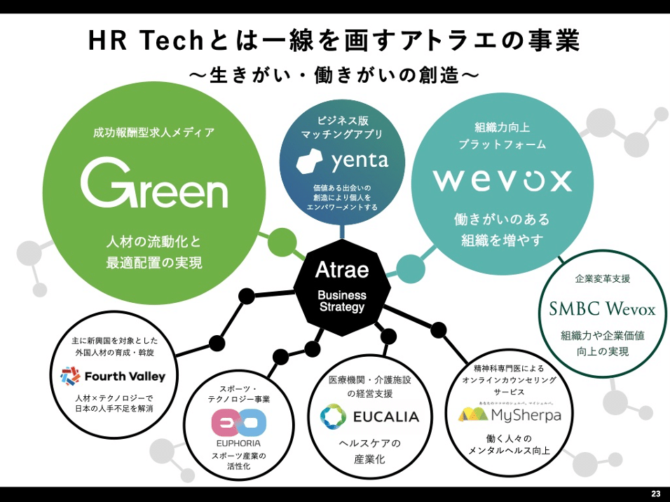
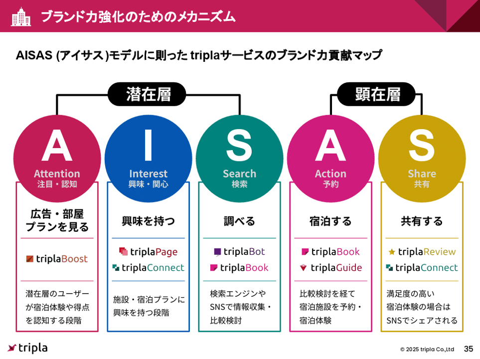
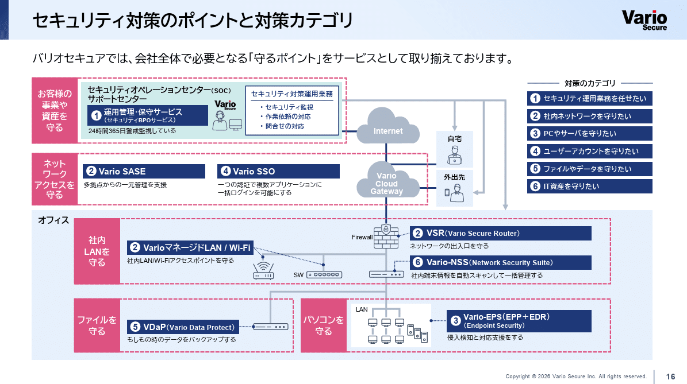
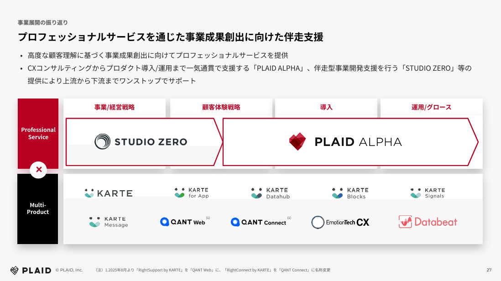
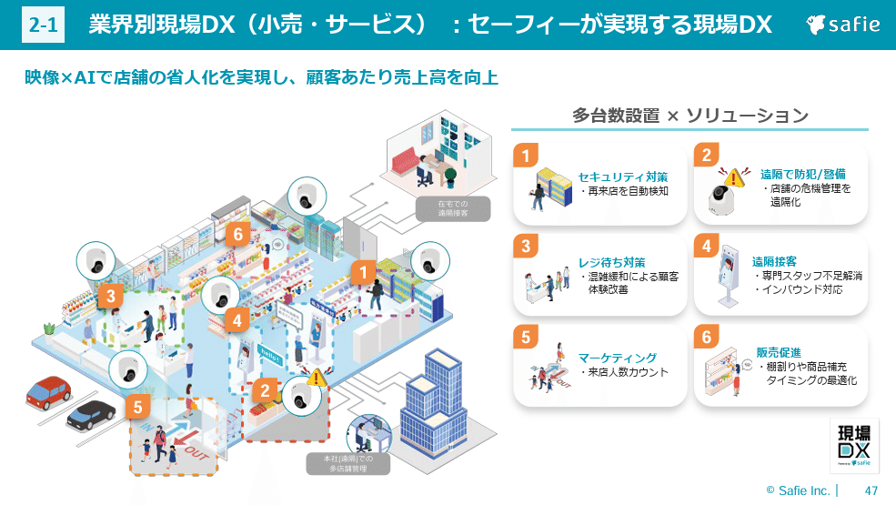
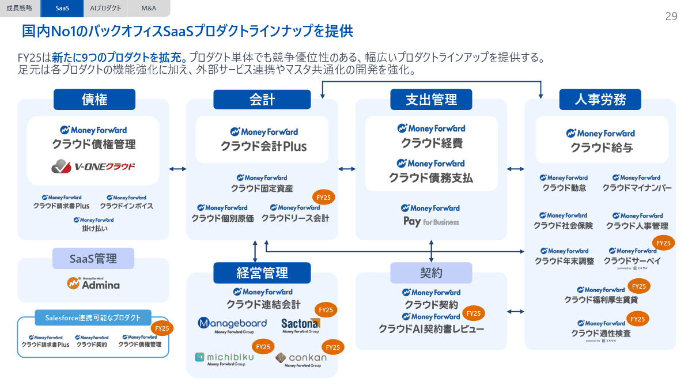
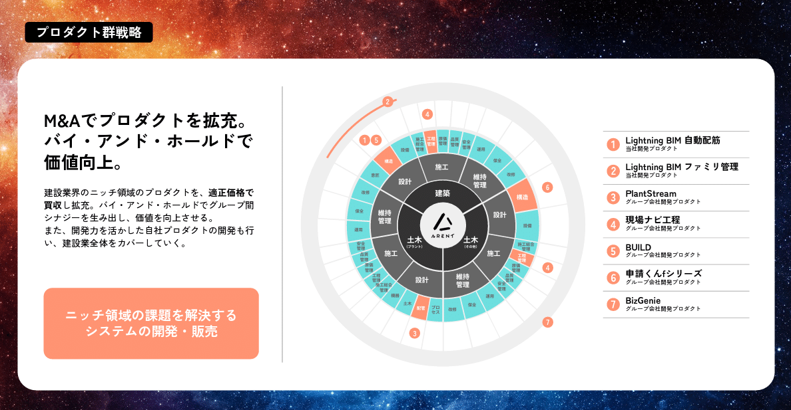
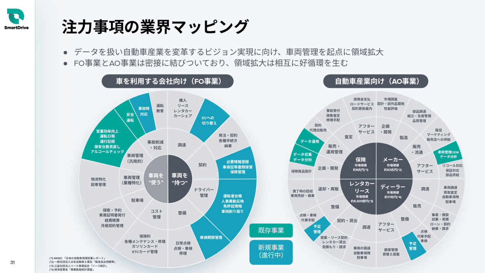
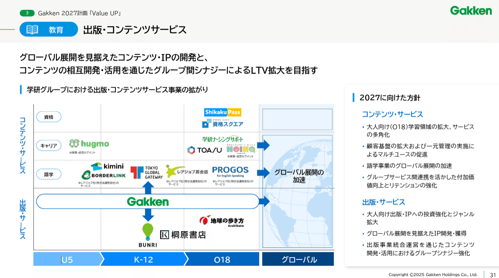
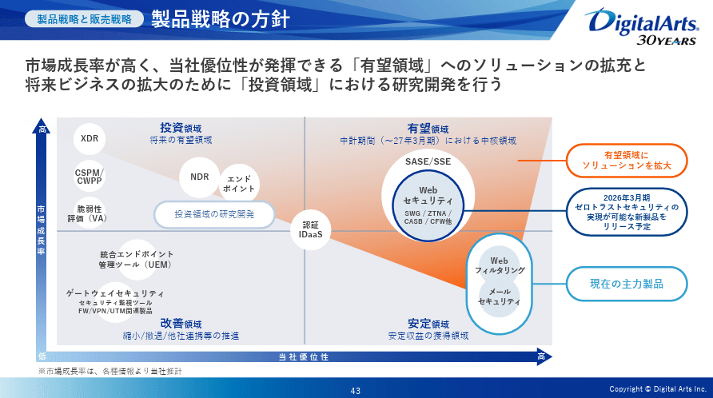

# 【マネしたい】パワポの「事業ポートフォリオ」スライド９選（2026年更新）

[note原文](https://note.com/powerpoint_jp/n/n9bbf1e6e5443)

みなさんこんにちは。
資料デザインのリサーチや分析に取り組むパワーポイントのスペシャリスト、パワポ研です。

今回は、パワポの「事業ポートフォリオ」スライドに焦点を当て、上場企業のIR資料から参考になりそうなスライド例を紹介していきます。

パワポの事業ポートフォリオといえば、BCGマトリックスをはじめとするマトリックス図のスライドがイメージされやすいですが、必ずしもその限りではありません。

*株式会社アトラエの事業ポートフォリオのスライド*

> 引用元：[> 2025年9月期 通期決算説明資料](https://ssl4.eir-parts.net/doc/6194/ir_material_for_fiscal_ym1/191192/00.pdf)

*https://atrae.co.jp/ir/presentation/*

今回はそんな事業ポートフォリオの見せ方について、図をはじめとする様々な例を紹介していきますよ。ちなみに【マネしたい】カッコいいパワポの「マトリックス」スライドはこちらから。

では早速行きましょう！

## 事業ポートフォリオとフローのパワポ例３選

ではここから「事業ポートフォリオ」を紹介するパワポの具体例を見ていきましょう。まずは顧客の業務や行動のフロー図に合わせて「事業ポートフォリオ」を紹介するスライド例からです。

### 購買フロー図と事業ポートフォリオの例

まずはtripla株式会社のパワポにおける「事業ポートフォリオ」図の具体例から見ていきましょう。
事業計画及び成長可能性に関する事項 中期経営計画(2026年10月期-2028年10月期)のパワーポイントにある、ブランド力強化のためのメカニズムのスライドです。

*tripla株式会社の事業ポートフォリオ図のスライド例*

> 引用元：[> 事業計画及び成長可能性に関する事項　中期経営計画(2026年10月期-2028年10月期)](https://contents.xj-storage.jp/xcontents/AS04848/07fd589e/414d/4e3b/b03f/75560968aac9/140120251215519870.pdf)

*https://tripla.io/ir/news/*

「事業ポートフォリオ」図の特徴としては、**マーケティングで使われる「AISASモデル」という顧客の購買フローの図を使っている点**が挙げられます。自社の顧客である宿泊施設に対して提供できるサービスを、宿泊施設のお客さんの購買行動の図に合わせてプロットしています。

配色がカラフルで、ややもすると見づらくなってしまうスライド例ですが、適度な間隔と余白で非常に見やすいデザインとなっています。他ではあまり見ないデザインでもあるので、頭にも残りやすくてよい事例です。

### 業務フロー図と事業ポートフォリオの例

続いてバリオセキュア株式会社のパワポにおける「事業ポートフォリオ」の具体例を見てみましょう。
2025年2月期 決算説明資料のパワーポイントにある、セキュリティ対策のポイントと対策カテゴリのスライドです。

*バリオセキュア株式会社の事業ポートフォリオ図のスライド例*

> 引用元：[> 2025年2月期 決算説明資料](https://ssl4.eir-parts.net/doc/4494/tdnet/2591833/00.pdf)

*https://www.variosecure.net/ir/library3/*

「事業ポートフォリオ」図の特徴としては、**クライアントにおけるインターネットセキュリティの全体図に事業ポートフォリオをプロットしている点**が挙げられます。「事業や資産を守る」「ネットワークアクセスを守る」「社内LANを守る」「ファイルを守る」「パソコンを守る」という要素に対して、対策業務のフローを図で示したうえで、バリオセキュアがどのようなサービスを提供するのかを記載しています。

インターネットセキュリティという、詳細がわかりにくい事業において、業務フローを図で示すことで業務の全体像がまずわかりやすくなっており、事業ポートフォリオへの理解も深まりやすいです。

### フローとカテゴリを合わせた図の例

最後に株式会社プレイドのパワポにおける「事業ポートフォリオ」図のデザインから見ていきましょう。
2025年9月期第4四半期決算説明資料のパワーポイントにある、事業展開の振り返りのスライドです。

*株式会社プレイドの事業ポートフォリオ図のスライド例*

> 引用元：[> 2025年9月期第4四半期決算説明資料](https://pdf.irpocket.com/C4165/PDLX/jLGV/BCsM.pdf)

*https://plaid.co.jp/ir/*

「事業ポートフォリオ」図の特徴としては、**横軸に戦略から運用までのフローを入れ、縦に自社のサービス提供の仕方を入れることで、全体を構造化**しています。プロフェッショナルサービスとプロダクトの組み合わせで価値提供をしていることがわかりやすいですね。

## 事業ポートフォリオと関係図のパワポ例２選

続いて「事業ポートフォリオ」内の事業の関係性を図にすることでよりわかりやすく示しているスライド例を見ていきましょう。イラストなどを使ってビジュアルで見せる例と、関係性を図で見せる例があります

### イラストを使った事業ポートフォリオの例

まずはセーフィー株式会社のパワポにおける「事業ポートフォリオ」の具体例から見ていきましょう。
事業計画及び成長可能性に関する事項のパワーポイントにある、業界別現場DX（小売・サービス）のスライドです。

*セーフィー株式会社の事業ポートフォリオ図のスライド例*

> 引用元：[> 成長可能性資料](https://ssl4.eir-parts.net/doc/4375/tdnet/2584982/00.pdf)

*https://safie.co.jp/ir/library/*

「事業ポートフォリオ」図の特徴として、**イラストを使ってクライアントの現場のイメージを描いたうえで事業をプロット**しています。クライアントに対してどのような価値提供をするのか、図で例示されていることで、事業ポートフォリオの理解がしやすくなっています。

このように、顧客に入り込んでクロスセルやアップセルを行うことが重要な事業の場合、イラストなどのビジュアルや図を使って、事業ポートフォリオを見せるのは効果的です。

### 事業ポートフォリオ間の関係図の例

続いてマネーフォワード株式会社のパワポにおける「事業ポートフォリオ」の具体例を見ていきましょう。
2025年11月期 通期決算説明資料のパワーポイントにある、SaaSプロダクトラインナップのスライドです。

*株式会社マネーフォワードの事業ポートフォリオ図のスライド例*

> 引用元：[> 2025年11月期 通期決算説明資料](https://contents.xj-storage.jp/xcontents/AS71106/781f04a3/4fb3/409e/83f7/aa7360811159/140120260114533742.pdf)

*https://corp.moneyforward.com/ir/library/presentation/*

「事業ポートフォリオ」図の特徴としては、**顧客のバックオフィスにおける各業務の関係性を図で示した上で事業をプロットしている点**が挙げられます。中心にある会計や支出管理に対して経営管理や人事労務、契約、債権等がどのように結びついているのかが一目でわかる図になっています。

## 事業ポートフォリオと円形図のパワポ例２選

次にサンバーストのグラフを使って「事業ポートフォリオ」を紹介するパワポの具体例を見ていきましょう。業界のセグメントを細かく見せたいときに使う例ですね。

### 顧客セグメントをサンバーストで見せる例

まずは株式会社Arentのパワポにおける「事業ポートフォリオ」図の具体例から見ていきましょう。
2025年6月期 通期決算説明資料のパワーポイントにある、プロダクト群戦略のためのメカニズムのスライドです。

*株式会社Arentの事業ポートフォリオ図のスライド例*

> 引用元：[> 2025年6月期 通期決算説明資料](https://ssl4.eir-parts.net/doc/5254/tdnet/2669039/00.pdf)

*https://arent.co.jp/ir/library/presentation/*

「事業ポートフォリオ」図の特徴としては、**建設業界における市場を３階層に分けてセグメントを示している点**が挙げられます。

- １階層目が「建設」「土木（プラント）」「土木（その他）」

- ２階層目が「設計」「施工」「維持管理」

- ３階層目が「構造」「設備」「施工総合管理」「工程管理」「原価管理」「品質管理」「安全管理」「運用」「保全」「改修」

となっています。

事業ポートフォリオの図としてもわかりやすいですし、このスライドのように、M&A戦略においてもどこが空白でどこをうめればいいのかが一目でわかるので向いていますね。

### 事業ポートフォリオを既存新規に分ける例

続いて株式会社スマートドライブのパワポにおける「事業ポートフォリオ」の具体例を見てみましょう。
2025年9⽉期第4四半期決算説明資料のパワーポイントにある、注力事項の業界マッピングのスライドです。

*株式会社スマートドライブの事業ポートフォリオ図のスライド例*

> 引用元：[> 2025年9⽉期第4四半期決算説明資料](https://smartdrive.co.jp/wp-content/uploads/2025%E5%B9%B49%E6%9C%88%E6%9C%9F%E7%AC%AC4%E5%9B%9B%E5%8D%8A%E6%9C%9F-%E6%B1%BA%E7%AE%97%E8%AA%AC%E6%98%8E%E8%B3%87%E6%96%99.pdf)

*https://smartdrive.co.jp/company/ir/library/financial-reports/*

「事業ポートフォリオ」図の特徴としては、**同じようにサンバーストを使いつつ、カバーしている領域を既存事業と新規事業に分けている点**が挙げられます。「車を利用する会社向け」「自動車産業向け」に分けたうえで、既存事業を緑色、新規事業を青色にしています。

車を利用する会社向けの方の事業ポートフォリオ図では、「車両を”持つ”」「社用を”使う”」というように、セグメントをより直感的に理解しやすいよう整理している点もよいですね。

## 事業ポートフォリオとマトリクス図の例２選

最後にマトリックス図を使って「事業ポートフォリオ」を紹介しているスライド例を見ていきましょう。セグメントをマトリックスで見せる事例と、いわゆるBCGマトリックス系の事例を見ていきましょう。

### マトリックスでセグメントを分ける例

まずは株式会社学研ホールディングスのパワポにおける「事業ポートフォリオ」の具体例から見ていきましょう。
教育領域の出版・コンテンツサービスのパワーポイントにある、業界別現場DX（小売・サービス）のスライドです。

*株式会社学研ホールディングスの事業ポートフォリオ図のスライド例*

> 引用元：[> 中期経営計画Gakken 2030 Vision および Gakken 2027計画 「Value UP」](https://www.gakken.co.jp/ja/ir/news/news-251107_Gakken2027_ValueUP/main/0/link/Gakken%202027%20Medium-Term%20Management%20Plan%20Value%20UP.pdf)

*https://www.gakken.co.jp/ja/ir/news.html*

「事業ポートフォリオ」図の特徴として、**横軸に顧客セグメント、縦軸にサービスカテゴリを置き、マトリックスで示している点**が挙げられます。
横軸は学習者の年齢として「５歳以下」「６－１８歳」「１８歳以上」そして「グローバル」に分かれています。縦軸はコンテンツとして「資格」「キャリア」「語学」と、出版に分けています。

セグメントを細かく切ることで、事業ポートフォリオがより鮮明にわかるようになるよい例です。

### BCGマトリックス系のポートフォリオ例

続いてデジタルアーツ株式会社のパワポにおける「事業ポートフォリオ」の具体例を見ていきましょう。
中期経営計画（2025年3月期～2027年3月期）のパワーポイントにある、製品戦略と販売戦略のスライドです。

*デジタルアーツ株式会社の事業ポートフォリオ図のスライド例*

> 引用元：[> 中期経営計画（2025年3月期～2027年3月期）](https://www.daj.jp/ir/data/daj2326_202403_4q_mbp.pdf)

*https://www.daj.jp/ir/library/mbp/*

「事業ポートフォリオ」図の特徴としては、**BCGマトリックスのような形で４象限を定義している点**が挙げられます。BCGマトリックスで事業ポートフォリオ分析をする際は、縦軸に市場成長率、横軸にシェアをとりますが、デジタルアーツは市場成長率と当社優位性のマトリックスとなっています。

４象限は「有望領域」「投資領域」「安定領域」「改善領域」となっており、その中に現在の事業ポートフォリオをプロットするだけでなく、現在の主力が何なのか、リリース予定があるものは何なのか、研究開発中のものは何なのかわかるようになっています。

## 【マネしたい】パワポの「事業ポートフォリオ」スライド９選まとめ

以上、フロー、関係図、サンバースト、マトリックス等、様々な「事業ポートフォリオ」図の例を紹介してきました。**「事業ポートフォリオ」図は目的や事業内容によっても最適解が変わりますし、M&A戦略を語るうえでも使いやすいので**、是非いろいろなパターンを試してみてくださいね。

## パワポ研オリジナルテンプレート

パワポ研では「ビジネスシーンで使える」パワーポイントテンプレートを公開しております。デザインを整えるのみならず、**ロジックやストーリーを整理するのにも役立つパッケージ**になっておりますので、関心のある方は下記ページも併せてご覧ください！

上記の記事のように、noteでは**フォローしているだけでビジネスにおける「資料作成のコツ」と「デザインのセンス」が身に付くアカウント**を目指して情報配信を行っています。
今後もコンスタントに記事を配信していく予定なので、関心のある方は是非アカウントのフォローをお願いします！

**> Template販売　**[> https://powerpointjp.stores.jp/](https://powerpointjp.stores.jp/%EF%BF%BCnote)
**> note　**[> パワポ研の資料作成術](https://note.com/powerpoint_jp/m/mc291407396da)
**> X（旧Twitter)　**[> https://twitter.com/powerpoint_jp](https://twitter.com/powerpoint_jp)

## レックスアドバイザーズからのお知らせ

パワポ研は株式会社レックスアドバイザーズが運営しています。
レックスアドバイザーズは**経営企画職や経営管理職に特化した転職エージェント**です。
上場企業や上場準備企業を中心に、**経営企画、IR、経理財務、法務、内部監査等の職種の求人**をご紹介しているほか、**CFOなどのコンフィデンシャル求人**もご紹介可能です。
またコンサルティングファームや監査法人、会計事務所の求人も豊富にあるため、プロフェッショナルファームを目指す方のご支援も得意です。
求人紹介やキャリア相談を希望の方は、[**無料転職サポート**](https://www.career-adv.jp/job_search/entryform_exp/)よりサービス利用登録をしてみてください。

*レックスアドバイザーズのサービスサイトはこちら*

**> 求人をご希望の方　**[> 無料転職サポート](https://www.career-adv.jp/job_search/entryform_exp/)**
> 採用支援をご希望の方　**[> 採用サポート](https://www.career-adv.jp/request3/)
**> その他　**[> お問い合わせフォーム](https://www.rex-adv.co.jp/contact)
**> 書籍　**[> 注目企業の実例から学ぶパワポ作成術](https://www.amazon.co.jp/dp/4046060476)

