# 【マネしたい】色の組み合わせがおしゃれなパワポのプレゼン９選

[note原文](https://note.com/powerpoint_jp/n/na02d7822ebc3)

みなさんこんにちは。
資料デザインのリサーチや分析に取り組むパワーポイントのスペシャリスト、パワポ研です。

今回は【マネしたい】シリーズの新作です。パワポ研ではこれまで、**パワポのテーマの「色」に焦点を当て、上場企業のIR資料から参考になりそうなパワーポイント資料を抜粋して紹介**してきました。

これまで、赤色、青色、黄色、緑色、オレンジ色、紫色、モノクロといったテーマでパワーポイント資料を紹介してきましたが、**ベースとなる色と差し色の組み合わせが上手く、おしゃれに見えるスライド**を紹介するケースがちらほらとありました。

*紫と黄色のパワポスライド（株式会社ROXXの決算説明資料）*

そこで今回は**パワポにおける色の組み合わせをテーマに、参考となるプレゼンテーション資料を紹介**しています。
上に例として出した株式会社ROXXなどは、まさに紫と黄色とグレーの３色の色を組み合わせたパワーポイントの例として秀逸ですが、「紫色」プレゼン３選のNoteで触れているので今回は触れません。気になる方はNoteを見てみてくださいね。

では早速行きましょう！

## ３色の色を組み合わせたおしゃれパワポ４選

まずは３色の色を組み合わせたパワーポイントの例から見ていきましょう。
３色の色の組み合わせの場合は、**ベースカラーと差し色に、グレーや黒といった色を組み合わせるパワポと、ベースカラー２色にグレーや黒を組み合わせるパワポ**のパターンがあります。

### 緑色とオレンジ色で親しみやすいパワポ例

まずはグリーンモンスター株式会社のパワポの色の組み合わせ例を見ていきましょう。2025年6月期 通期決算説明資料（事業計画及び成長可能性に関する事項）から、事業構成のスライドと、売上高及び売上総利益の複合グラフのスライドです。

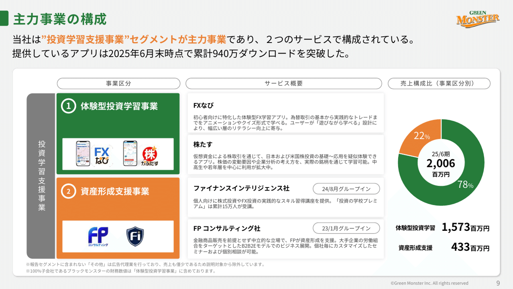
> 引用元：[> 2025年6月期 通期決算説明資料（事業計画及び成長可能性に関する事項）](https://contents.xj-storage.jp/xcontents/AS04869/8f57059a/8b77/4d01/a3a0/7f208f8a43a6/140120250814542608.pdf)

*https://greenmonster.co.jp/ir/library/*

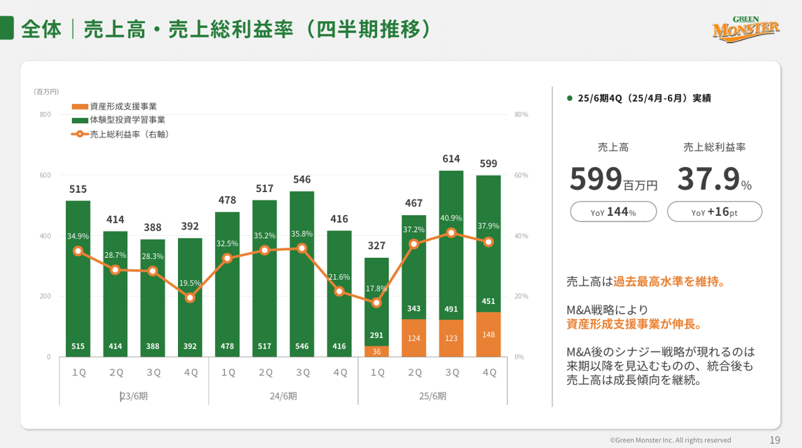
パワポの３色の色の組み合わせは、緑色とオレンジ色とグレーです。**コーポレートロゴが緑色とオレンジ色なので、パワーポイント全体を通してこの組み合わせ**なわけですね。背景色などに一部グレー系の色が使われています。

グリーンモンスター社の３色の使い方としては２つのルールがあります。

- タイトルを緑色、テキストの強調部分をオレンジ色にする

- 体験型投資学習事業を緑色、資産形成支援事業をオレンジ色にする

３色の色の組み合わせでパワーポイントを構成する場合には、**明確なルールのもとに色の使い方を統一すると、統一感のあるおしゃれなパワポになる**のでおすすめですね。

### 青色と金色で高級感のあるパワポ例

次はパワポ研ではおなじみの株式会社TENTIALのパワポの色の組み合わせ例です。2025年8月期 通期決算説明資料（事業計画及び成長可能性に関する資料）のパワーポイント資料にある通期決算ハイライトのスライドとブランド投資に関するスライドです。

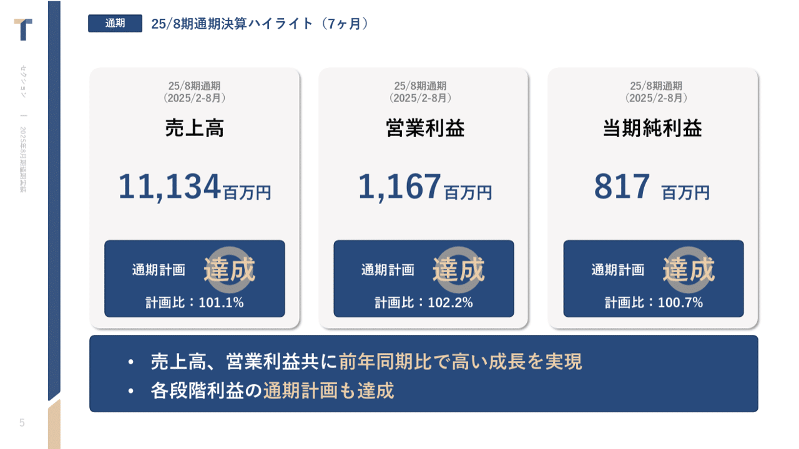
> 引用元：[> 2025年8月期 通期決算説明資料（事業計画及び成長可能性に関する資料）](https://ssl4.eir-parts.net/doc/325A/tdnet/2698232/00.pdf)

*https://corp.tential.jp/ir/library/presentations/*

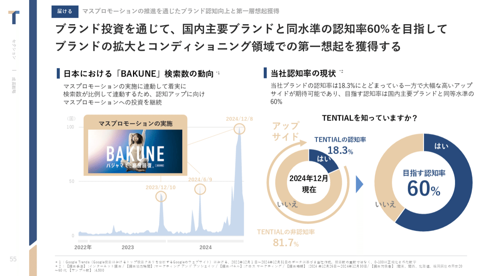
パワポの３色の色の組み合わせは、濃い青色と金色とグレーです。グリーンモンスター社同様、コーポレートロゴの色を使ってパワーポイントを構成しています。

**シックな濃い青色をベースに、華やかな金色を合わせることで、高級感のあるおしゃれなパワポ**に仕上がっています。金色が多いと華美な印象が強くなりますが、濃い青色をメインの色とすることで、高級感のあるデザインとなるわけですね。

[おしゃれなパワポのスライド「レイアウト」９選](https://note.com/powerpoint_jp/n/n816b11bf9c03)でも取り上げましたが、パワーポイント左側のリボンもおしゃれで、単価の高い消費財におすすめの色の組み合わせのパワポです。

### オレンジ色と青色の見やすいパワポ例

次はウェルネス・コミュニュケーションズ株式会社のパワポの色の組み合わせ例です。事業計画及び成長可能性に関する事項のパワーポイント資料にある事業領域のスライドと成長ストーリーに関するスライドです。

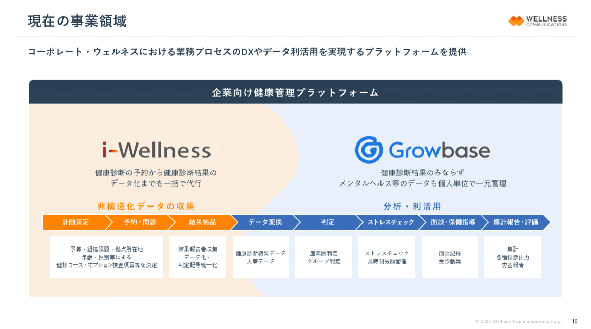
> 引用元：[> 事業計画及び成長可能性に関する事項](https://contents.xj-storage.jp/xcontents/AS05024/f07105d4/224b/4949/bb38/3f16e6c11299/140120250620595058.pdf)

*https://wellcoms.jp/ir/news/*

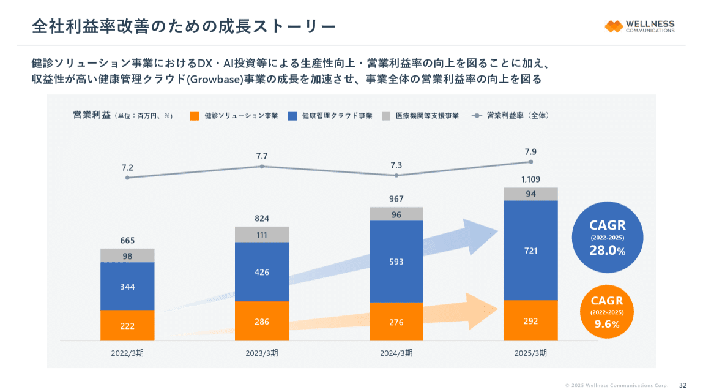
パワポの３色の色の組み合わせは、青色とオレンジ色とグレーです。コーポレートロゴではなく、サービスロゴの色を使ってパワーポイントを構成しています。

ウェルネス・コミュニケーションズ社のパワポにおいては、**検診ソリューション事業がオレンジ色、健康管理クラウド事業が青色というように、事業別に色を使い分けること**が徹底されており、読み手が常に２つの事業を分けて理解できるようにしています。２つの大きな事業がある場合におすすめの色の組み合わせのパワポデザインです。

### 黒色と緑色で未来感のあるパワポ例

３つの色の組み合わせのパワポの最後は株式会社スカラの例です。2025年6月期 通期決算説明会のパワーポイント資料にあるセグメント別通期予想比グラフのスライドと収益改善の取り組みのスライドです。

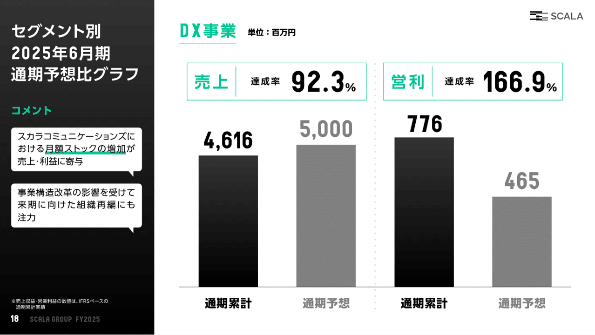
> 引用元：[> 2025年6月期 通期決算説明会](https://scalagrp.jp/20250819-irnews/)

*https://scalagrp.jp/ir/documents/*

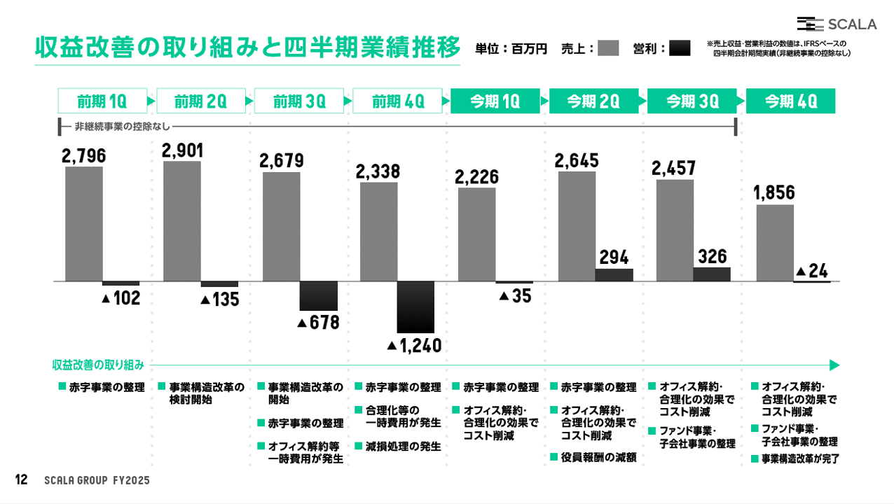
パワポの３色の色の組み合わせは、明るい緑色と黒色と灰色です。コーポレートカラーである黒色と灰色に、明るい緑色を組み合わせたパワーポイントとなっています。

黒系の色と緑色はかなり相性がいいのですが、スカラの例を見ていただくとわかるように、**少しSF的な印象のパワーポイント**になります。[おしゃれなパワポの「緑色系」プレゼン３選](https://note.com/powerpoint_jp/n/n4f81d5e2165a)で取り上げたインフォメティス社もまさにそんな感じで、参考にしたいおすすめのパワーポイントです。

*インフォメティス社のパワーポイント*

## ４色以上の色を組み合わせたパワポ５選

続いて４色の色を組み合わせたパワーポイントの例から見ていきましょう。
４色の色の組み合わせの場合は、３色＋グレー系になることが多いのですが、パワポ資料において３つの要素を組み合わせるスライドはよくあるので、そうしたスライドでたびたび登場します。

### ４色の淡い色を組み合わせたパワポ例

まずはパワポ研ではおなじみの株式会社Arentのパワポの色の組み合わせ例です。2025年6月期 通期決算説明資料のパワーポイント資料にある、強みと競争優位のスライドと、ビジネスモデルのスライドです。

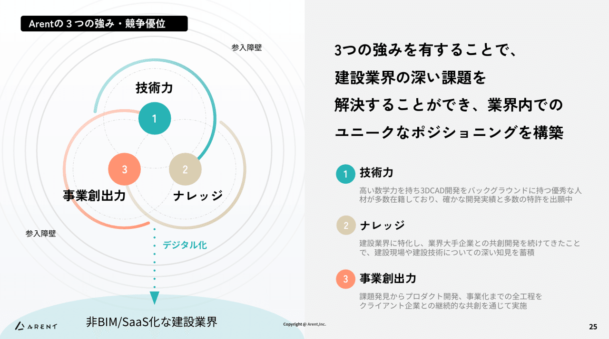
> 引用元：[> 2025年6月期 通期決算説明資料](https://ssl4.eir-parts.net/doc/5254/tdnet/2669039/00.pdf)

*https://arent.co.jp/ir/library/presentation/*

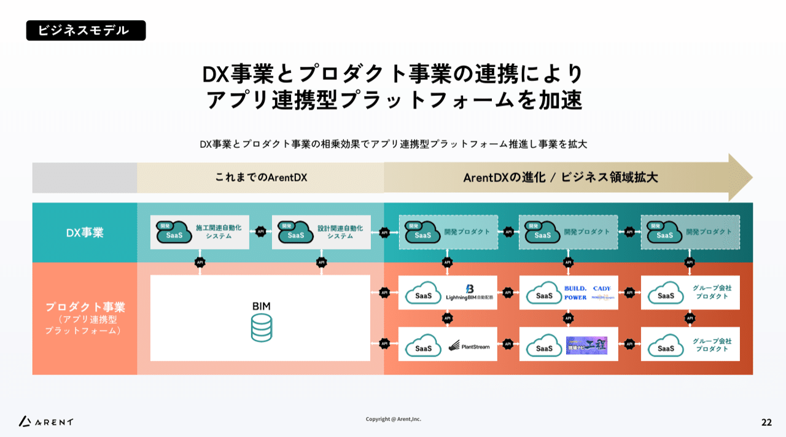
パワポの４色の色の組み合わせは、緑色、オレンジ色、ベージュ色、グレーです。**全体的に淡い色を組み合わせ**ることで、色同士がケンカをせず、４つの色をおしゃれに組み合わせたパワーポイントとして成立させています。

全体的に淡めの色遣いとなっていますが、**ビジネスモデルの進化のスライドでは、将来に行くほど色が濃く**なっています。将来に向けて力強く進化していくことをビジュアルで示したい場合におすすめのパワポデザインですね。

### ４色の明るい色を組み合わせたパワポ例

次は株式会社 L is B のパワポの色の組み合わせ例を見ていきましょう。2024年 12月期 通期 決算説明資料から、市場規模のスライドと事業系統図のスライドです。

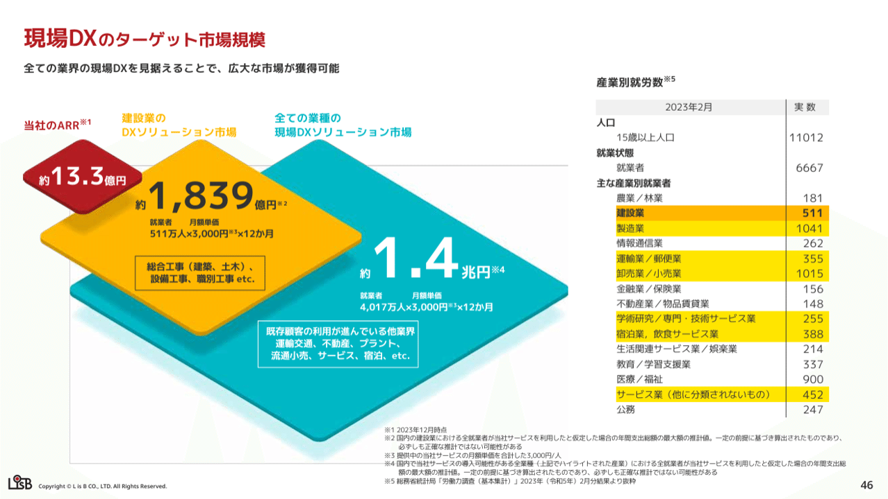
> 引用元：[> 2024年 12月期 通期 決算説明資料](https://contents.xj-storage.jp/xcontents/AS05193/eb43db33/5d69/419f/a9af/3e1d5d3423b5/140120250214575783.pdf)

*https://l-is-b.com/ja/ir/presentations/*

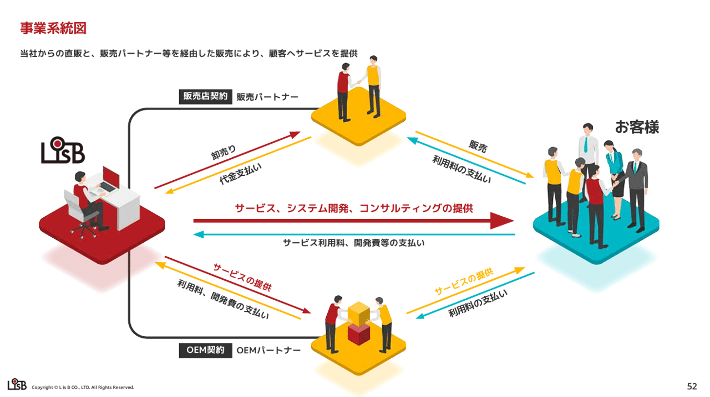
パワポの４色の色の組み合わせは、赤色、黄色、青緑色、グレーです。先ほどのArent社とは真逆で、濃い色で統一されています。**濃い色同士は主張が激しいですが、全体的に濃い色で統一することで、バランスが取れて**います。

事業系統図は割と平面的な図を使うスライドが多いのですが、**比較的シンプルな商流の場合、このようにイラストと色で示すことで見やすくなります**。矢印に色を付けと単なる矢印より見やすくなるのでいおすすめです。

### メインの赤と３つの補色で４色のパワポ例

次は株式会社リップスのパワポの色の組み合わせ例を見ていきましょう。2025年8月期 決算説明資料 （事業計画及び成長可能性に関する事項）から、会社概要のスライド２枚です。

> 引用元：[> 2025年8月期 決算説明資料 （事業計画及び成長可能性に関する事項）](https://contents.xj-storage.jp/xcontents/AS83314/01e25629/8f3d/43c7/b864/caa7fe055679/140120251015573538.pdf)

*https://lipps.co.jp/ir/presentations/*

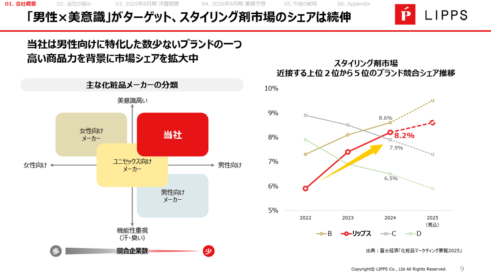
パワポの４色の色の組み合わせは、赤色、青色、黄色、グレーです。**コーポレートカラーの赤色がメイン事業や、競合比較における自社の色、強調などに使われており**、その他の色は補色として使われています。

パワーポイントのテーマの色があって、そこに他の色を合わせていく場合、今回であれば**赤色に対して色なじみの良い組み合わせにする必要**があります。リップスの場合は、青と黄色を選んだ上で、競合するときは青と黄色を薄くするといった工夫をしていますね。

### ４色の個性的な色の組み合わせのパワポ例

続いてソニーフィナンシャルグループ株式会社のパワポの色の組み合わせ例を見ていきましょう。ソニーグループ(株) 金融 Investor Dayの金融分野(説明資料) から、主要事業別KPIのスライドと、ソニー生命のチャネル別新規契約数のスライドです。

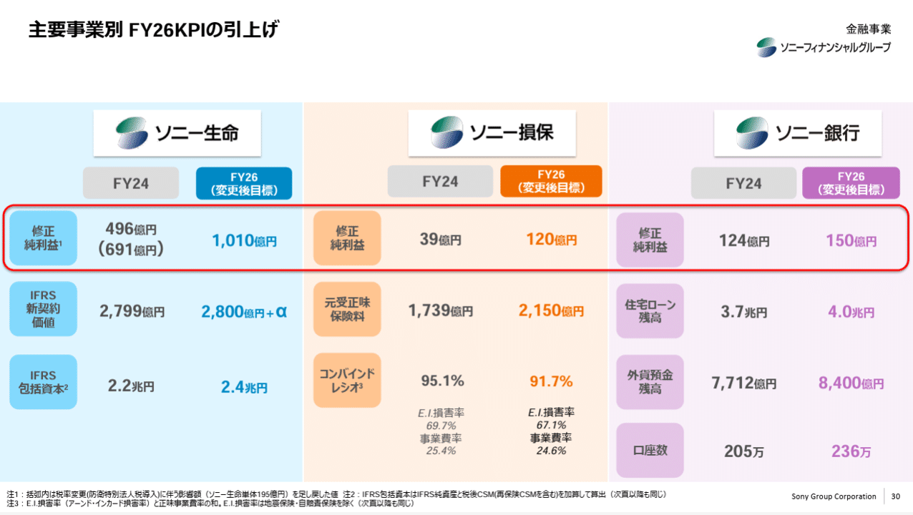
> 引用元：[> 金融分野(説明資料)](https://www.sony.com/ja/SonyInfo/IR/library/presen/irday/pdf/2025/FinancialServices.pdf)>  

*https://www.sonyfg.co.jp/ja/ir/library/management_vision/*

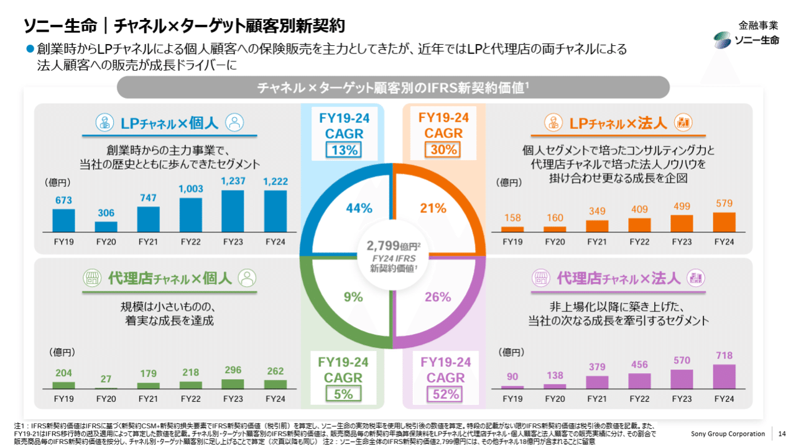
パワポの４色の色の組み合わせは、青色、オレンジ色、紫色、グレーです。マトリックスのスライドでは、緑色も追加されて５色の色の組み合わせとなっています。

色の組み合わせとしては、比較的ばらばらという感じですが、**それぞれのセグメントを独立して目立たせたい場合にはよいデザイン**ですね。そのうえで全体的に薄めの色にすることで、全体の統一感を保っています。

### 遊び心を感じる色の組み合わせのパワポ例

最後は株式会社オプロのパワポの色の組み合わせ例を見ていきましょう。2024年11月期 通期決算説明資料・事業計画及び成長可能性資料に関する事項から、会社概要のスライドと競争優位性のスライドです。

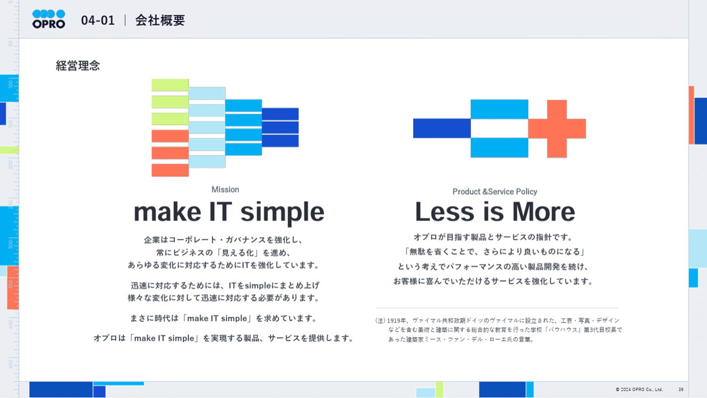
> 引用元：[> 2024年11月期 通期決算説明資料・事業計画及び成長可能性資料に関する事項](https://ssl4.eir-parts.net/doc/228A/tdnet/2548029/00.pdf)

*https://corp.opro.net/ir/presentation/*

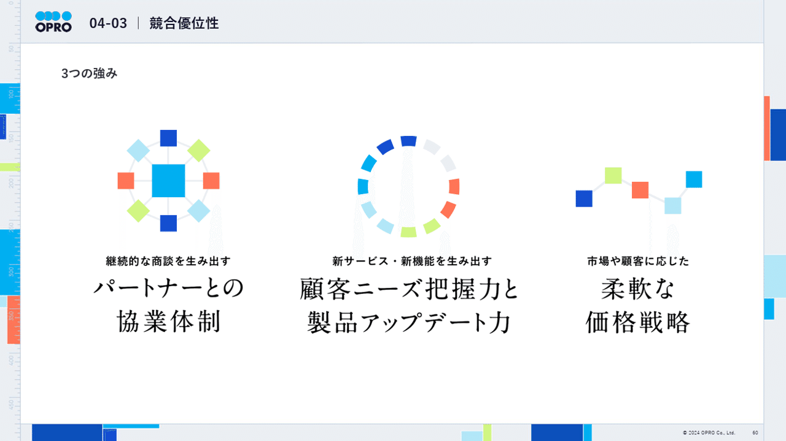
オプロ社のパワポは非常におしゃれで、５色以上の色の組み合わせとなっています。濃い青色、青色、水色、黄緑色、オレンジ色、グレーが使われていますね。

オプロ社のパワポはそれ以外にもおしゃれな点が複数あります。

- 経営理念や競合優位性を、カラフルなブロックの組み合わせでコンセプチュアルに表現している

- 外枠の左側が定規のようになっており、当社の帳票サービスをイメージさせるデザインになっている

- 同様に外枠にカラフルなボックスが配置されており、こちらも帳票サービスをイメージさせるデザインとなっている

パワポのこれらのデザインについては、すぐにまねできるものではないものの、自社のサービスを連想させる要素を入れていくのはありなので、検討してみてもよいでしょう。

## 【マネしたい】色の組み合わせがおしゃれなパワポのプレゼン９選まとめ

以上、パワポにおける色の組み合わせについて解説してきました。
３色の色の組み合わせのパワポは比較的シンプルなので、色の組み合わせの考え方などを参考にしながら、いろいろと試してみてくださいね。
また冒頭説明した、テーマカラー別のパワポシリーズをまだ見ていない方は、気になる色のNoteを見てみてくださいね。

- [カッコいいパワポの「青色」プレゼン３選](https://note.com/powerpoint_jp/n/n38223e35b2b4)

- [カッコいいパワポの「オレンジ色」プレゼン３選](https://note.com/powerpoint_jp/n/n7d202c005a6a)

- [カッコいいパワポの「緑色」プレゼン３選](https://note.com/powerpoint_jp/n/n4f81d5e2165a)

- [カッコいいパワポの「黄色」プレゼン３選](https://note.com/powerpoint_jp/n/n479a7aaacc39)

- [カッコいいパワポの「赤色」プレゼン３選](https://note.com/powerpoint_jp/n/n830659eba076)

- [カッコいいパワポの「モノクロ」プレゼン３選](https://note.com/powerpoint_jp/n/nd49ff920f465)

- [カッコいいパワポの「紫色」プレゼン３選](https://note.com/powerpoint_jp/n/n9165d9472c99)

## パワポ研オリジナルテンプレート

パワポ研では、「ビジネスシーンで使える」パワーポイントテンプレートを公開しております。デザインを整えるのみならず、**ロジックやストーリーを整理するのにも役立つパッケージ**になっておりますので、関心のある方は下記ページも併せてご覧ください！

[
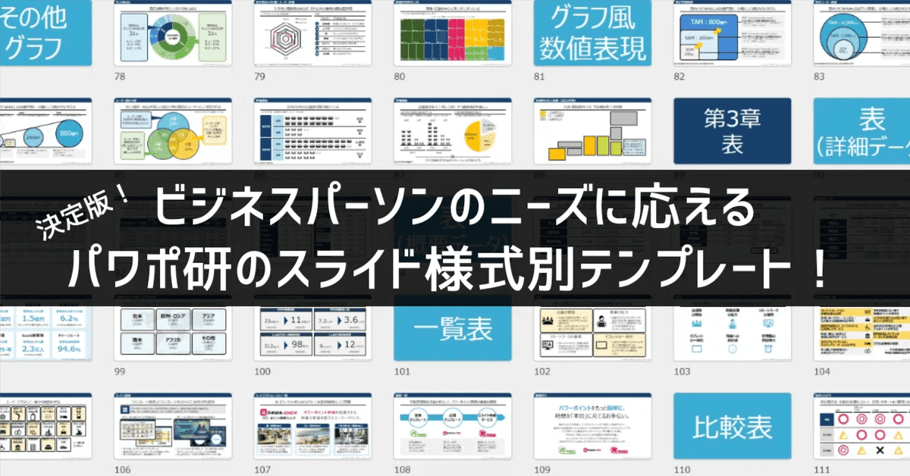
](https://note.com/powerpoint_jp/n/n7300a1293e8e)上記の記事のように、noteでは**フォローしているだけでビジネスにおける「資料作成のコツ」と「デザインのセンス」が身に付くアカウント**を目指して情報配信を行っています。
今後もコンスタントに記事を配信していく予定なので、関心のある方は是非アカウントのフォローをお願いします！

**> Template販売　**[> https://powerpointjp.stores.jp/](https://powerpointjp.stores.jp/%EF%BF%BCnote)
**> note　**[> パワポ研の資料作成術](https://note.com/powerpoint_jp/m/mc291407396da)
**> X（旧Twitter)　**[> https://twitter.com/powerpoint_jp](https://twitter.com/powerpoint_jp)

## レックスアドバイザーズからのお知らせ

パワポ研は株式会社レックスアドバイザーズが運営しています。
レックスアドバイザーズは**経営企画職や経営管理職に特化した転職エージェント**です。
上場企業や上場準備企業を中心に、**経営企画、IR、経理財務、法務、内部監査等の職種の求人**をご紹介しているほか、**CFOなどのコンフィデンシャル求人**もご紹介可能です。
またコンサルティングファームや監査法人、会計事務所の求人も豊富にあるため、プロフェッショナルファームを目指す方のご支援も得意です。
求人紹介やキャリア相談を希望の方は、[**無料転職サポート**](https://www.career-adv.jp/job_search/entryform_exp/)よりサービス利用登録をしてみてください。

*レックスアドバイザーズのサービスサイトはこちら*

**> 求人をご希望の方　**[> 無料転職サポート](https://www.career-adv.jp/job_search/entryform_exp/)**
> 採用支援をご希望の方　**[> 採用サポート](https://www.career-adv.jp/request3/)
**> その他　**[> お問い合わせフォーム](https://www.rex-adv.co.jp/contact)
**> 書籍　**[> 注目企業の実例から学ぶパワポ作成術](https://www.amazon.co.jp/dp/4046060476)

